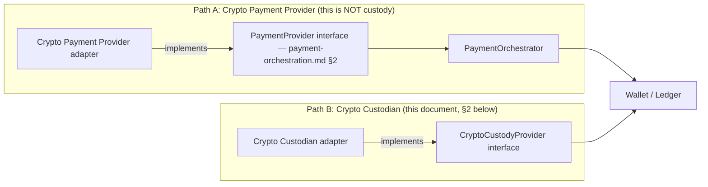

# Crypto Custody Boundary

Status: Stage 3A (Financial Architecture Freeze) — architecture only,
`NOT IMPLEMENTED`. Source: Blueprint §4.6 (crypto rails), ADR 0008
(custody decision), extending `07-payments-architecture.md`'s "Crypto
custody (resolved)" section with the concrete interface and ledger
integration this stage requires. Owner: `payments`, custody-boundary
review by `security`.

## 1. Non-negotiable boundary — `BLUEPRINT`/ADR 0008

Restated because Stage 3A explicitly requires it re-affirmed before any
crypto-adjacent design proceeds: **the platform must not hold private
keys.** All key custody and blockchain signing happen inside an
institutional custodian, behind a `CryptoCustodyProvider` interface. This
document designs the interface and the ledger-facing abstractions around
it; it does not implement or select a custodian (ADR 0008: vendor
selection is a human decision).

### 1.1 Crypto Payment Provider is a different object from Crypto Custodian — `docs/decisions/0022`

The business owner has directed that crypto payment gateways/providers
follow the same provider-agnostic orchestration principle as fiat
providers, while explicitly preserving this document's custody boundary
— restated here as binding, not merely cross-referenced, because it is
the single easiest way for this boundary to be silently broken by a
future integration:



A **Crypto Payment Provider** (a gateway that accepts or sends crypto
payments on the platform's behalf, analogous to a fiat PSP) is a
`PaymentProvider` implementation, routed by the `PaymentOrchestrator`
exactly like any fiat rail — it never touches private keys and never
implements `CryptoCustodyProvider`. A **Crypto Custodian** (who holds the
platform's own crypto assets and signs on the platform's behalf) is a
`CryptoCustodyProvider` implementation as designed in the rest of this
document. **These two roles are never collapsed into one interface or one
object, even when a single vendor genuinely performs both** — such a
vendor is integrated as two separate adapters against two separate
interfaces — with separate `provider_id`s, separate least-privilege
credentials and independent rotation, sharing at most stateless vendor SDK
*library* code and never a shared authenticated client or API key
(`docs/decisions/0022` §4.2) — so that "we added a payment gateway" can
never quietly become "we gave a vendor custody-boundary trust" without the
ADR-0008 review that trust requires. Full reasoning, and the
provider-capability/multi-tenant model both paths share:
`docs/decisions/0022` §4.

**The interface rule alone is not the whole boundary — `security`.**
"Never implements `CryptoCustodyProvider`" constrains what an adapter is
declared as, not what a vendor hands it at runtime. A crypto payment
gateway operating in a "non-custodial"/"self-managed wallet" mode can
return, in an API response or webhook, a private key or WIF, a seed
phrase/mnemonic, a spend-capable extended key plus derivation path, or a
local-signing SDK handle. An adapter that accepts, logs, or persists such a
field has put key material inside the platform while formally implementing
only `PaymentProvider` — ADR 0008 broken with the separation rule above
still textually intact. Therefore, binding and equal in force to the
separation rule: **the platform never enables a provider mode that
transfers key material or signing authority to it, and key material
arriving from any `PaymentProvider` is a boundary violation to be rejected
at parse time — never persisted, never logged (not even hashed or
truncated), operation failed, security alert raised.** The canonical
`DepositResult`/`WithdrawResult`/`CallbackEvent` shapes carry no free-form
passthrough blob that could transport it. Choosing such a provider mode is
a custody decision under ADR 0008, not a payment integration. Detail and
test obligations: `docs/decisions/0022` §4.1, §7. Addresses and memo/
destination tags are *not* key material and are stored normally (§3).

**Two gaps this separation opens, recorded rather than assumed away —
`architect`:**

- `OPEN DECISION` (deposit-address ownership): `GenerateDepositAddress`
  lives on `CryptoCustodyProvider` (§2) and `DepositAddress.custodian_ref`
  is `NOT NULL` (§3), so a crypto *payment provider* that issues its own
  deposit addresses has no modeled home for them. Either `DepositAddress`
  generalizes to an externally-issued-address shape with a provider-kind
  discriminator, or crypto-payment-provider deposits use a hosted-flow
  shape that never surfaces a platform-persisted address. `payments`/
  `architect`, before Stage 3B implements any crypto deposit; not invented
  here.
- §4.1's unresolved clearing-account decision now has **two** consumers,
  not one: a crypto payment provider routed like a fiat PSP needs an
  in-flight clearing leg for exactly the same reason a custodian does, and
  `psp_clearing` is fiat-only by its own definition
  (`ledger-accounting-model.md` §2). Whatever resolution `ledger-finance`
  chooses must cover both, or the crypto payment rail inherits the same
  blocker (`docs/decisions/0022` §4, §5).

## 2. `CryptoCustodyProvider` interface — `ARCHITECTURAL DECISION`

```
CryptoCustodyProvider
  GenerateDepositAddress(ctx, tenant_id, wallet_id, asset_code) (DepositAddress, error)
  InitiateWithdrawal(ctx, WithdrawalInstruction) (CustodianWithdrawalResult, error)
  QueryTransaction(ctx, custodian_tx_ref) (CustodianTxStatus, error)
  HandleWebhook(ctx, rawPayload) (CustodianEvent, error)
  ListConfirmedDeposits(ctx, since) ([]CustodianDeposit, error)   -- reconciliation feed
```

Same shape discipline as `PaymentProvider` (`payment-orchestration.md`
§2): no custodian SDK type crosses this interface into core domain logic.

## 3. Deposit address abstraction — `ARCHITECTURAL DECISION`

```
DepositAddress
  id                 UUID (PK)
  tenant_id          UUID NOT NULL
  wallet_id          UUID NOT NULL
  asset_code         TEXT NOT NULL
  address            TEXT NOT NULL        -- custodian-issued (see §1.1's deposit-address OPEN DECISION for the crypto-payment-provider case)
  memo_tag           TEXT NULL            -- for chains requiring a memo/destination tag (e.g. some account-model chains)
  custodian_ref      TEXT NOT NULL        -- custodian's own identifier for this address
  status             TEXT NOT NULL        -- 'active' | 'retired'
  created_at         TIMESTAMPTZ NOT NULL
```

Scope: tenant + brand + player + asset, reached through `wallet_id` (no
`brand_id` column — `financial-domain-model.md`'s brand denormalization
rule), `tenant_id NOT NULL` with RLS like every other Stage 3A table. It is
listed in that document's scoping table.

`OPEN DECISION`: whether a wallet gets one persistent deposit address per
asset (simpler, but reused addresses complicate some chains'
privacy/UTXO-management) or a fresh address per deposit intent
(custodian-dependent capability) — left to the specific custodian's
supported model, not fixed here.

## 4. Blockchain transaction reference and confirmation state

```
CustodianDeposit
  custodian_ref, tx_hash, output_index (if UTXO)
  asset_code, amount (minor units, per asset's own decimal_exponent — e.g. 8 for BTC, 18 for ETH-based assets, per ADR 0007)
  confirmations, required_confirmations (per-asset, custodian- or platform-configured)
  status              -- 'pending' | 'confirmed' | 'orphaned'
```

A deposit only triggers Flow 1 (`financial-transaction-flows.md`) once
`status = 'confirmed'` (confirmations ≥ the per-asset required threshold).
An `orphaned` deposit (chain reorg invalidates a previously-seen tx) that
was never confirmed simply never posts — no reversal needed. An
`orphaned` deposit that *had already been confirmed and posted* (reorg
depth exceeds the platform's finality assumption — rare but must be
designed for) uses Flow 2 (deposit reversal), same as a PSP chargeback,
because from the ledger's point of view a confirmed-then-invalidated
crypto deposit and a confirmed-then-reversed card payment are the same
shape of event: money believed settled, later un-settled.

### 4.1 Which ledger account the custodian leg posts to — `OPEN DECISION`

`financial-transaction-flows.md` Flow 1 debits `psp_clearing` on a deposit
and Flow 3 Step B credits "`psp_clearing` (or the custodian-facing account,
per `crypto-custody-boundary.md`)" — but no custodian-facing account type
exists: `ledger-accounting-model.md` §2 defines `psp_clearing` as "any
fiat asset with PSP rails", which by its own definition cannot hold a
crypto asset. Crypto deposits and withdrawals therefore currently have no
named in-flight account, and Flow 3's forward reference to this document
resolves to nothing. Two candidate resolutions:

1. Generalize `psp_clearing` to "external rail clearing" covering PSPs and
   custodians alike, distinguished by `provider_id` on the transaction.
2. Add a `custodian_clearing` account type (an eleventh/twelfth type
   outside the Blueprint's list), keeping fiat and crypto rails separately
   reconcilable.

This is a ledger-model decision owned by `ledger-finance` (it changes the
account-type list and the reconciliation streams in
`reconciliation-model.md` §2.2/§2.8) and must be resolved before Stage 3B
implements any crypto deposit or withdrawal posting. Not decided here.

## 4a. Wrong-network / misdirected deposits — `ARCHITECTURAL DECISION` (workflow existence) + `OPEN DECISION` (recovery policy)

`07-payments-architecture.md` already flags wrong-network deposits (e.g. an
asset sent to a correctly-formatted address on the wrong chain, or the
right chain but wrong asset contract) as "a weekly occurrence needing a
support workflow, not just an error log." It is restated here because it
is squarely a custody-boundary concern: a misdirected deposit is, by definition, **not** a
`CustodianDeposit` matching any `DepositAddress`/`asset_code` pair the
platform expects, so it never triggers Flow 1 and never becomes a
`LedgerTransaction` on its own. Required, at minimum:

- A support/back-office intake path for a player reporting (or the
  custodian surfacing, if it detects funds at a monitored address that
  don't match the expected asset) a misdirected deposit — this is manual
  investigation, not automated posting, since recoverability is
  chain/custodian-dependent.
- If recovered by the custodian, the credit posts through the **normal**
  Flow 1 path once the custodian reports it as a confirmed, correctly-
  attributed deposit (possibly net of a recovery fee) — never a direct
  `manual_adjustment` invented to shortcut this, so the same idempotency
  and audit trail apply.
- `OPEN DECISION`: whether recovery fees, unrecoverable-deposit write-off
  policy, and how long the platform holds a misdirected-deposit case open
  before closing it are business/risk/vendor-contract decisions (recovery
  capability itself varies by custodian and chain) — not fixed here, and
  not something this architecture freeze invents.

## 5. Withdrawal request → custodian approval

```
WithdrawalInstruction
  withdrawal_request_id  UUID NOT NULL   -- FK to withdrawal-state-machine.md's WithdrawalRequest
  destination_address, destination_memo_tag
  asset_code, amount
  idempotency_key         -- same withdrawal_request_id-derived key used platform-side
```

The custodian may itself require its own approval step (e.g. a
policy-engine quorum inside the custodian, common for institutional
custodians) **in addition to** the platform's own four-eyes approval
(`withdrawal-state-machine.md` §5) — these are two independent approval
layers at two different trust boundaries and neither substitutes for the
other. The platform's `submitted` state (§1 of the withdrawal state
machine) covers the period where the platform has approved and handed off
to the custodian, but the custodian's own internal approval has not yet
cleared — `CustodianTxStatus` surfaces whatever intermediate states the
specific custodian exposes; this document does not invent a universal
custodian-side state enum since it is vendor-specific.

## 6. Webhook/callback

`HandleWebhook` verifies the custodian's signature (mechanism vendor-
specific, but always present — an unauthenticated custodian webhook is
never trusted, consistent with CLAUDE.md's authorization posture) and
translates the payload into a `CustodianEvent` the orchestrator dispatches
the same way it dispatches a `PaymentProvider` callback
(`payment-orchestration.md` §7's sequence, substituting the custodian
adapter for a PSP adapter) — deliberately the same shape, so the
orchestrator's dispatch/idempotency machinery is not duplicated for crypto
vs. fiat.

## 7. Reconciliation

`ListConfirmedDeposits`/custodian statement exports are the reconciliation
source for crypto wallets, feeding `reconciliation-model.md`'s
"wallet ↔ crypto custodian" reconciliation stream — structurally identical
to the PSP reconciliation stream (§9 of `payment-orchestration.md`), just
sourced from a different adapter family.

## 8. What this document deliberately does not do

- Does not implement self-custody, HD wallet derivation, or any signing
  logic — explicitly out of scope per CLAUDE.md and ADR 0008.
- Does not select a custodian vendor (ADR 0008: human/commercial decision).
- Does not design an on-chain fee/gas-management model — that is internal
  to the custodian's own operations for a custodial model; if the platform
  ever needs to reason about network fees directly (e.g. displaying an
  estimated withdrawal fee to the player), that is a `payments`-owned
  addition to `WithdrawalInstruction` in Stage 3B, not designed here since
  the Blueprint does not specify fee-display requirements.
- Does not build a crypto exchange/conversion engine — cross-asset
  movement (e.g. BTC wallet → EUR wallet) goes through the same
  `ConversionOperation` abstraction as any other cross-asset movement
  (`financial-domain-model.md`, `06-wallet-ledger-architecture.md`), not a
  crypto-specific mechanism.

## Cross-references

- Custody decision and platform/custodian ownership split: ADR 0008,
  `07-payments-architecture.md`.
- Crypto Payment Provider vs. Crypto Custodian distinction, provider
  capability model, multi-tenant provider routing:
  `docs/decisions/0022-payment-provider-agnosticism-and-capability-model.md`
  §4, `payment-orchestration.md`.
- Withdrawal workflow this integrates with: `withdrawal-state-machine.md`.
- Deposit/withdrawal ledger postings: `financial-transaction-flows.md`
  Flows 1–4.
- Reconciliation: `reconciliation-model.md`.
