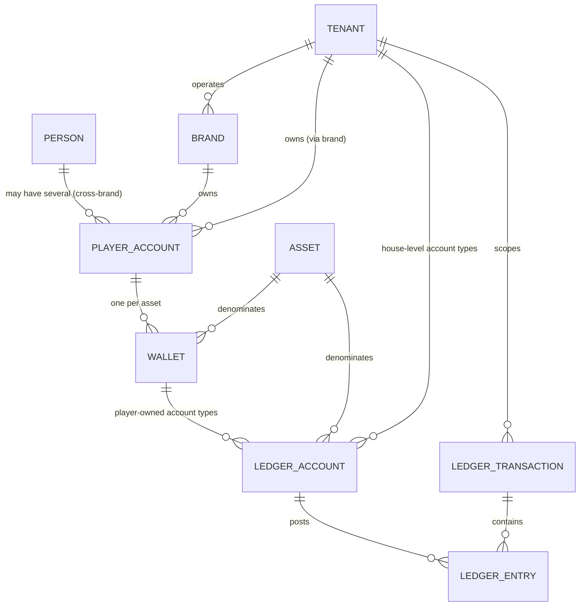

# Financial Domain Model

Status: `PARTIALLY IMPLEMENTED` (Stage 3B). Designed in Stage 3A
(Financial Architecture Freeze); migrations `0019`–`0028` built `Wallet`,
both `LedgerAccount` families, `LedgerTransaction`, `LedgerEntry`,
`wallet_balance_projection`, `ProviderCapability`,
`WithdrawalRequest`, `WithdrawalApproval` and
`ReconciliationRun`/`ReconciliationMismatch`. Two objects in the scoping
table below remain `NOT IMPLEMENTED` and are flagged as such in their own
rows: `ConversionOperation` (ADR 0021) and `DepositAddress`
(`crypto-custody-boundary.md` — crypto is out of scope this stage).
Source: Blueprint §4.2 ("Wallet and ledger"), §4.6 ("Payments and PSP
orchestration"), extending the Stage 0/1/2 foundation already built —
`docs/decisions/0001`, `0007`, `0008`, `docs/architecture/06`, `07`, and
the identity model in `docs/architecture/05`. Owner: `ledger-finance`
(financial model), `architect` (cross-domain relationships).

## Purpose

This document fixes the object model and scoping rules the rest of
Stage 3A's documents assume: what a `Wallet` is, how it relates to the
`Person`/`PlayerAccount`/`Tenant`/`Brand` model Stage 2 already built, and
which objects are platform-, tenant-, brand-, player-, or asset-scoped.
Everything here is `ARCHITECTURAL DECISION` (informed by the Blueprint but
not literally specified by it) unless marked `BLUEPRINT` (the Blueprint
states it directly) or `OPEN DECISION` (the Blueprint is silent and this
is left for a human to resolve, not invented).

## Relationship to the existing identity model

Stage 2 already established: `Person` (platform-wide, no tenant),
`PlayerAccount` (a Person's relationship with one Brand/Tenant, `NOT NULL
tenant_id` + `brand_id`), `Tenant` (commercial/legal/licensing entity, no
RLS — platform registry), `Brand` (consumer-facing product, tenant-scoped,
public-read RLS — ADR 0012). This document adds `Wallet`, `Asset`
(already exists, migrations 0003/0006), `LedgerAccount`,
`LedgerTransaction`, `LedgerEntry` on top of that, without changing any
Stage 2 table.



## Wallet: scoped to PlayerAccount, not to Person — `ARCHITECTURAL DECISION`

The Blueprint's own examples predate Stage 2's Brand/Tenant split (it has
no concept of one tenant operating several brands) and never states
whether a wallet belongs to a Person or to a PlayerAccount. Given Stage
2's model, this must be decided explicitly:

**Decision: `Wallet` belongs to exactly one `PlayerAccount`, not to
`Person`.** A Person with accounts at two different Brands (even under
the same Tenant) gets two independent sets of wallets — balances never
pool across brands by default. This is chosen because:

- It matches the Blueprint's one place that *does* discuss shared
  balances: "start the [sportsbook] widget... on the same wallet as
  casino, so the player sees one balance" — explicitly a same-*brand*,
  cross-*product* sharing, never a cross-*brand* one.
- ADR 0012 already treats Brand as the actual consumer-facing product
  boundary (it defines Brand as "the consumer-facing product" and binds
  `PlayerAccount` to a `(tenant_id, brand_id)` pair with a composite FK).
  ADR 0012 itself says nothing about wallets — extending that boundary to
  `Wallet` is this document's decision, not a restatement of ADR 0012. A
  player's balance is a property of the brand relationship they're playing
  under, not of the underlying human.
- It avoids a much harder problem (settling which brand's KYC/RG state,
  currency set, and bonus terms govern a pooled balance) that no part of
  the Blueprint or Stage 0-2 decisions has resolved.

`OPEN DECISION`: a tenant operating multiple brands under one commercial
umbrella might eventually want an opt-in shared-wallet-across-brands
product (analogous to the same-wallet casino+sportsbook sharing, but
across brands instead of across products). Nothing here prevents adding
it later as an explicit, separately-modeled capability — it is not
assumed, built toward, or blocked by this design.

## Wallet identity

```
Wallet
  id                UUID (PK)
  tenant_id         UUID NOT NULL  -- denormalized from player_account for RLS; must match it
  brand_id          UUID NOT NULL  -- denormalized from player_account for RLS; must match it
  player_account_id UUID NOT NULL  -- FK to player_accounts
  asset_code        TEXT NOT NULL  -- FK to assets.code
  status            TEXT NOT NULL  -- 'active' | 'frozen' | 'closed'
  created_at        TIMESTAMPTZ NOT NULL
  UNIQUE (player_account_id, asset_code)  -- one wallet per player per asset
```

`tenant_id`/`brand_id` are denormalized onto `Wallet` (not just reachable
via a join through `player_accounts`) for the same reason Stage 2
denormalized `tenant_id` onto `brands`/`player_accounts` themselves:
row-level security policies need the tenant column *on the row being
protected*, not several joins away — see
`docs/architecture/03-database-architecture.md` and every Stage 2 RLS
migration. A composite foreign key `(player_account_id, tenant_id,
brand_id) REFERENCES player_accounts (id, tenant_id, brand_id)` — the
same pattern `player_accounts.(brand_id, tenant_id)` already uses against
`brands` — guarantees the denormalized columns can never drift from the
account they claim to belong to.

`status = 'frozen'` freezes new debits/credits from ordinary gameplay/
payment flows while still permitting compensating entries and
investigation-driven manual adjustments (four-eyes gated, per CLAUDE.md).
`'closed'` is terminal (e.g. account closure) — a closed wallet's
non-zero remaining balance is itself an operational alert.

`OPEN DECISION` (residual balance on wallet closure): what *happens* to
that residual balance — forced payout to the player's last verified
withdrawal method, indefinite retention as a liability, or
jurisdiction-specific escheatment/dormancy handling — is deliberately not
decided here. It has legal and jurisdictional weight (ADR 0006's
per-jurisdiction model means the answer can differ per market) and
financial-statement consequences (an unpaid player balance is a liability
that cannot simply be written off by engineering judgment). What Stage 3A
*does* fix regardless of the answer: whatever the policy, it is executed
as ordinary `LedgerTransaction`s (most likely a withdrawal flow or a
four-eyes `manual_adjustment`), never as a balance write-off, and the
`player_cash` balance of a closed wallet stays visible in the ledger until
it is discharged by posted entries.

## Scoping table

| Object | Scope | Notes |
|---|---|---|
| `Person` | Platform | Unchanged from Stage 2. No financial data lives here directly. |
| `Tenant` | Platform (registry) | Unchanged from Stage 2. Each Tenant is its own commercial/financial entity — `house_gaming` etc. are never pooled across tenants, even two tenants both `under_platform_licence`. |
| `Brand` | Tenant | Unchanged from Stage 2. |
| `PlayerAccount` | Tenant + Brand | Unchanged from Stage 2. |
| `Asset` | Platform (registry) | **Stage 4H-B0-R3 correction**: an open, extensible platform registry, not a closed Stage-1 seed set — the schema (migrations 0003/0006) already accepts any asset code/exponent with no code change; only the operational surface (admin API, RBAC, audit) is missing. See `docs/architecture/27-stage-4h-b0-scope-and-implementation-plan.md` §26 and the recommended future ADR 0037. Which assets a tenant/jurisdiction actually *offers* is `tenant_jurisdiction_configs.allowed_currencies`, not a property of the registry row itself. |
| `Wallet` | Tenant + Brand + Player + Asset | New this stage. One per `(player_account_id, asset_code)`. |
| `LedgerAccount` (player-owned types: `player_cash`, `player_bonus`, `player_locked`, `player_withdrawal_hold` — see `ledger-accounting-model.md`) | Tenant + Brand + Player + Asset (via `wallet_id`) | New this stage. |
| `LedgerAccount` (house-level types: `house_gaming`, `provider_payable`, `psp_clearing`, `psp_reserve`, `jackpot_contribution`, `promo_liability`, `manual_adjustment`) | Tenant + Asset (no `wallet_id`, no player, no brand) | New this stage. One row per `(tenant_id, account_type, asset_code)` — see `ledger-accounting-model.md` for why these are tenant-scoped, never brand-scoped, even though `player_cash` etc. are brand-scoped via their wallet. |
| `LedgerTransaction` | Tenant | New this stage. Never spans tenants — every entry it produces belongs to accounts in the same tenant (enforced at the database, not by convention — see the ledger ADR). |
| `LedgerEntry` | Tenant (inherits from its account/transaction) | New this stage. |
| `wallet_balance_projection` (`docs/decisions/0019`, `reconciliation-model.md` §3) | Same scope as the `LedgerAccount` it projects (tenant + brand + player + asset for player-owned; tenant + asset for house-level) | New this stage. Subordinate projection, one row per `ledger_account_id`, `wallet_id` NULL for house-level accounts; carries `tenant_id NOT NULL` like every other table here. |
| `WithdrawalRequest` (`withdrawal-state-machine.md` §2) | Tenant + Brand + Player + Asset (via `wallet_id`) | New this stage. Workflow state, not ledger state. |
| `WithdrawalApproval` (`withdrawal-state-machine.md` §5) | Tenant (via its `WithdrawalRequest`) | New this stage. Staff decisions, not player-owned; carries `tenant_id NOT NULL` for RLS on the row itself, matching its parent request. |
| `DepositAddress` (`crypto-custody-boundary.md` §3) | Tenant + Brand + Player + Asset (via `wallet_id`) | `NOT IMPLEMENTED` — crypto rails are out of scope this stage; no migration exists. Brand is derived through `wallet_id`, not stored (see brand rule below). |
| `ConversionOperation` (ADR 0021, and below) | Tenant + Player + Asset pair (via two wallets of one `player_account_id`) | Designed this stage, not implemented (ADR 0021). Both wallets belong to the same `PlayerAccount`, so brand is implicitly single-valued and no `brand_id` column is carried; it produces exactly one `LedgerTransaction` whose entries balance *per asset*. |
| `ProviderCapability` (`docs/decisions/0022` §2/§3) | Tenant, optionally narrowed to Brand | Implemented as `provider_capabilities` (migration `0024`; RLS tightened by `0028`). Payment-provider routing configuration, not ledger state. The one Stage 3A table that carries `brand_id` without a `wallet_id` — it is configuration that exists before any wallet does — and the only one where `brand_id` is *nullable* (NULL = every brand under that tenant; a brand-specific row replaces it for that brand). Constrained by `(brand_id, tenant_id) REFERENCES brands(id, tenant_id)` per ADR 0012; `tenant_id NOT NULL`, never platform-scoped. |
| `provider_capability_amount_limits` (`docs/decisions/0022` §2) | Tenant (directly, since Stage 3C) | Implemented as a child table of `provider_capabilities` (migration `0024`), one `(asset_code, min_amount, max_amount)` row per declared asset. Stage 3B's known gap (no `tenant_id` column of its own; RLS was a subquery into `provider_capabilities`) was resolved in Stage 3C: migration `0030` added `tenant_id NOT NULL`, a composite `(provider_capability_id, tenant_id)` FK, and a direct `tenant_isolation` policy; migration `0033` added the player-scope exclusion guard the direct policy needed (see ADR 0023 §2). |
| `ReconciliationRun` / `ReconciliationMismatch` (`reconciliation-model.md` §5) | Tenant | New this stage. Every stream in `reconciliation-model.md` §2 belongs to exactly one tenant; `tenant_id NOT NULL`, never platform-scoped (ADR 0019). Platform-wide drift dashboards read through the reporting layer, not through relaxed RLS. |

### Brand denormalization rule for new financial tables

`brand_id` is denormalized **only** onto `Wallet` (with the composite FK
above), onto workflow tables that need to be listed/authorized per brand
in the back office (`WithdrawalRequest`), and onto per-brand
*configuration* tables that have no wallet to reach brand through
(`ProviderCapability`, ADR 0022 — payment routing configuration exists
before and independently of any wallet). Every other table introduced in
Stage 3A reaches brand through `wallet_id` and must **not** carry its own
`brand_id` column — a second, independently-writable copy of brand is a
drift risk with no RLS benefit, since all Stage 3A RLS policies key on
`tenant_id` (plus player-principal scope via `wallet_id`), never on
`brand_id`. Where a table does carry `brand_id`, it is constrained by a
composite FK so it can never disagree with what it points at: back to
`wallets`/`player_accounts` for the wallet-derived cases, and directly to
`brands (id, tenant_id)` (ADR 0012's own pattern) for the configuration
case, which has no wallet ancestor (exact key shape: Stage 3B migration
design). `ProviderCapability` is also the only one of these where
`brand_id` is **nullable**, carrying the tenant-wide-default meaning
defined in ADR 0022 §3; note that a NULL there means the composite FK is
not checked at all (Postgres `MATCH SIMPLE`), so `tenant_id`'s own FK is
what binds such a row.

## Cross-asset movement: `ConversionOperation`

Moving value between two wallets of *different* assets is never a balance
mutation and never an implicit leg of another flow (deposit, bet, payout).
It is an explicit, auditable `ConversionOperation` (CLAUDE.md financial
rules; ADR 0007). Stage 3A fixes its shape, scope and invariants in
**`docs/decisions/0021-multi-asset-accounting.md`** — that ADR is the
canonical definition; this document only records its scope (table above)
and the rule that no other flow may perform an implicit conversion. It is
designed, not implemented: no Stage 3A flow produces one
(`financial-transaction-flows.md` has no conversion flow).

## Why house-level accounts are tenant-scoped, not brand-scoped

`player_cash`/`player_bonus`/`player_locked` are brand-scoped because they
live on a brand-scoped `Wallet`. House-level accounts (`house_gaming`,
`provider_payable`, etc.) are deliberately **tenant**-scoped, one level
up: a Tenant's P&L, provider payables, and PSP reserve position are
commercial/financial-reporting concerns of the *Tenant* (the licensing/
commercial entity, per ADR 0012), not of any one Brand it operates. This
mirrors real-world operator accounting — a company running three brands
reports one P&L to its acquirer/PSP/provider contracts, not three. If a
tenant later needs brand-level P&L reporting, that's a reporting-layer
concern (Blueprint §4.9, CDC → ClickHouse) built on top of ledger data
already carrying both `tenant_id` and (via the wallet on player-owned
entries) `brand_id` — not a reason to move house accounts down to
brand-scope.

## Cross-references

- Ledger account types, transaction/entry shape, idempotency keys:
  `ledger-accounting-model.md`.
- Canonical transaction flows: `financial-transaction-flows.md`.
- Payment/PSP routing, multi-provider fiat+crypto capability model,
  provider independence:
  `payment-orchestration.md`,
  `docs/decisions/0022-payment-provider-agnosticism-and-capability-model.md`.
- Withdrawal workflow: `withdrawal-state-machine.md`.
- Crypto custody boundary: `crypto-custody-boundary.md`.
- Reconciliation: `reconciliation-model.md`.
- Multi-asset representation and `ConversionOperation`:
  `docs/decisions/0021-multi-asset-accounting.md`.
- RLS/tenancy implications for every table introduced here: see each
  document's own "Security/RLS" section, and
  `docs/decisions/0019-authoritative-ledger-and-balance-projection-architecture.md`.
