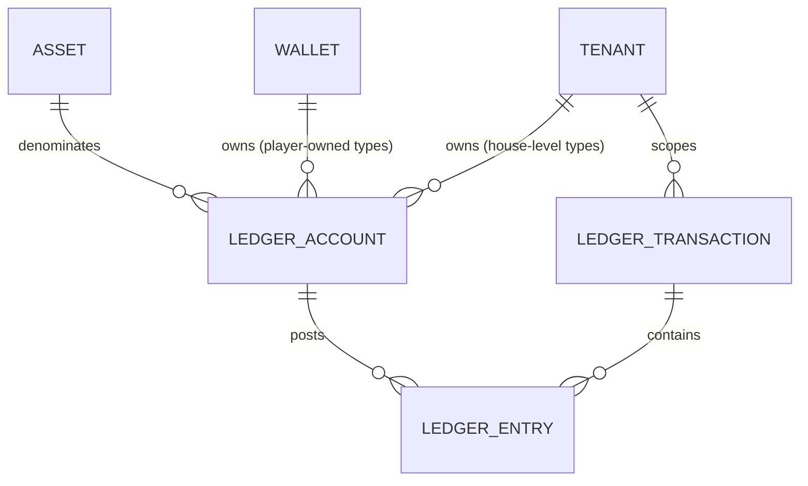

# Ledger Accounting Model

Status: `IMPLEMENTED` (Stage 3B). Designed in Stage 3A (Financial
Architecture Freeze) and built in Stage 3B: migrations `0020`–`0023`
(`ledger_accounts`, `ledger_transactions`, `ledger_entries`,
`wallet_balance_projection`) plus `internal/ledger`. Note that
`ledger_transactions.transaction_type` is deliberately constrained to the
deposit/withdrawal/manual-adjustment/tombstone types Stage 3B actually
posts; casino/sportsbook/bonus/crypto types listed in §1.2 and
`financial-transaction-flows.md` are added by their own stage. Source:
Blueprint §4.2 ("Wallet and ledger"), extending `docs/decisions/0001`,
`0007`, and `docs/architecture/06-wallet-ledger-architecture.md`, and
consistent with `financial-domain-model.md`'s scoping table. Owner:
`ledger-finance`.

Labeling convention (unchanged from `financial-domain-model.md`):
`BLUEPRINT` = stated directly in the Blueprint; `ARCHITECTURAL DECISION` =
informed by the Blueprint but not literally specified; `OPEN DECISION` =
Blueprint silent, left for a human.

## 1. Core objects



### 1.1 `LedgerAccount` — `BLUEPRINT` (account types) + `ARCHITECTURAL DECISION` (column shape)

```
LedgerAccount
  id                 UUID (PK)
  tenant_id          UUID NOT NULL
  wallet_id          UUID NULL      -- set for player-owned types; NULL for house-level types
  player_account_id  UUID NULL      -- denormalized from the owning Wallet, NULL for house-level types.
                                  -- This is the column the player-scoped RLS policy keys on (migration 0020);
                                  -- kept in lockstep with wallet_id by CHECK ((wallet_id IS NULL) = (player_account_id IS NULL))
  account_type       TEXT NOT NULL  -- see §2
  asset_code         TEXT NOT NULL  -- FK to assets.code
  status             TEXT NULL      -- house-level accounts only ('active' | 'frozen' | 'closed'); NULL for
                                  -- player-owned accounts, whose effective status is read from their Wallet (see below)
  created_at         TIMESTAMPTZ NOT NULL
  UNIQUE (wallet_id, account_type, asset_code) WHERE wallet_id IS NOT NULL
  UNIQUE (tenant_id, account_type, asset_code) WHERE wallet_id IS NULL
```

A `LedgerAccount` is a named bucket that ledger entries post to — it never
carries a balance column itself (§5). `asset_code` is denormalized from the
owning `Wallet` for player-owned types (and must match it — enforced by a
composite FK `(wallet_id, asset_code) REFERENCES wallets (id, asset_code)`,
the same denormalization-plus-FK pattern used for `tenant_id`/`brand_id` on
`Wallet` itself); for house-level types it is set directly since there is
no wallet to inherit it from.

Exactly one `LedgerAccount` row exists per `(wallet_id, account_type,
asset_code)` or `(tenant_id, account_type, asset_code)` — accounts are not
created per-transaction; a transaction's entries reference existing
accounts, creating one lazily on first use if it doesn't exist yet (via
`INSERT ... ON CONFLICT DO NOTHING` against the unique constraints above,
never check-then-insert, so two concurrent first postings cannot create
two accounts).

**`status` is derived for player-owned accounts, not stored twice.** The
idea that an account "inherits wallet status" is only sound if it is an actual
derivation: a stored per-account copy of `wallets.status` is a second
source of truth for freeze state that can drift from the wallet (e.g. a
wallet frozen for an AML investigation while one of its accounts still
reads `'active'`, which is precisely the account an attacker or a buggy
code path would post to). For player-owned types the effective status is
therefore *always read from the owning `Wallet`* — no independent
per-account status exists. Only house-level accounts (`wallet_id IS NULL`)
carry their own `status`, defaulting to `'active'`. Freezing a house-level
account halts every flow that touches it tenant-wide, so **`OPEN
DECISION`**: which role may do so, and under what approval tier, is an
operational/risk policy question left for `security` + finance — not
decided here. Note that in all cases a frozen or closed account still
permits the compensating and four-eyes-gated corrective postings described
in `financial-domain-model.md`; "frozen" blocks ordinary flows, never the
ledger's ability to record a correction.

### 1.2 `LedgerTransaction` — `ARCHITECTURAL DECISION`

```
LedgerTransaction
  id                 UUID (PK)
  tenant_id          UUID NOT NULL
  transaction_type   TEXT NOT NULL   -- 'deposit' | 'withdrawal' | 'casino_bet' | ... | 'tombstone' (see financial-transaction-flows.md and §1.4)
  -- NOTE: there is deliberately NO stored `status` column. 'posted'/'reversed'
  -- are DERIVED labels (a view or computed expression), never a mutable field
  -- — see the status note below in this section. A physical status column is an
  -- UPDATE target on a historical financial row, contradicting the append-only
  -- rule and invariant #2. (Stage 3A `security` review: the column sketch and
  -- the prose below contradicted each other; the prose is the correct one.)
  idempotency_key    TEXT NOT NULL   -- see idempotency ADR and §3
  provider_id        TEXT NULL       -- external system that originated this, if any
  provider_tx_id     TEXT NULL       -- external system's reference for this transaction
  correlation_id     UUID NOT NULL   -- ties together a business operation across services/requests
  causation_id       UUID NULL       -- the specific event/command that caused this transaction (e.g. a provider callback id)
  reverses_transaction_id UUID NULL  -- set on a compensating transaction; FK to ledger_transactions.id
  reason_code        TEXT NULL       -- required for manual_adjustment transactions (CLAUDE.md four-eyes rule)
  created_at         TIMESTAMPTZ NOT NULL
  posted_at          TIMESTAMPTZ NOT NULL  -- when entries became visible/authoritative; see §4 on posting vs. creation
  UNIQUE (tenant_id, provider_id, provider_tx_id) WHERE provider_id IS NOT NULL  -- BLUEPRINT idempotency rule, tenant-scoped (§3)
  UNIQUE (tenant_id, idempotency_key)
```

A `LedgerTransaction` is the atomicity/idempotency boundary: it either
posts all of its entries or none of them, in one database transaction. It
never spans tenants — a database constraint (§6, invariant #5) ensures every entry it
owns belongs to an account whose `tenant_id` matches the transaction's own
`tenant_id`.

**`provider_id`/`provider_tx_id` are opaque strings, never a provider
type or enum.** This is what already makes the ledger provider-agnostic
(per the business owner's multi-provider fiat/crypto requirement,
formalized in `docs/decisions/0022-payment-provider-agnosticism-and-
capability-model.md`): the ledger records *which adapter, which external
reference*, and nothing about how that provider works. No table or
invariant in this document may ever branch on a specific provider's
identity — provider-specific behavior lives exclusively in that
provider's `PaymentProvider`/`CryptoCustodyProvider` adapter
(`payment-orchestration.md`, `crypto-custody-boundary.md`), translated
into the same canonical flow shapes (`financial-transaction-flows.md`)
before it ever reaches this model.

`status`: `'posted'` is the only state a completed `LedgerTransaction` has
— per principle 2 (append-only, no `UPDATE`/`DELETE` of historical
entries), a posted transaction's entries are never edited or unposted.
`'reversed'` is not a state a row transitions *into* by mutation; it is a
**derived/reporting label** meaning "a later transaction exists with
`reverses_transaction_id` pointing at this one" — included in the model
as a queryable view/computed column, not as a column that gets `UPDATE`d
on the original row. There is deliberately no `'pending'` or `'failed'`
status on `LedgerTransaction` itself: a transaction that failed to post
completely (application crash, provider timeout mid-flow) simply does not
exist as a row — nothing partial is ever visible (see §4). Provider-
side pending/settling states belong to the provider's own state machine
(e.g. withdrawal-state-machine.md, payment-orchestration.md), which decides
*when* to ask the ledger to post — the ledger itself only ever records
completed, balanced, atomic facts.

### 1.3 `LedgerEntry` — `BLUEPRINT` (debit/credit columns) + `ARCHITECTURAL DECISION` (remaining columns)

```
LedgerEntry
  id                 UUID (PK)
  ledger_transaction_id UUID NOT NULL  -- composite FK, see below
  ledger_account_id  UUID NOT NULL     -- composite FK, see below
  tenant_id          UUID NOT NULL     -- denormalized from ledger_account; must match it (composite FK)
  wallet_id          UUID NULL         -- denormalized from ledger_account; NULL for house-level accounts.
                                       -- Required so ADR 0019's player-scoped RLS policy can be written
                                       -- against a column ON THIS ROW rather than via a join (see below).
  player_account_id  UUID NULL         -- denormalized from ledger_account; NULL for house-level accounts.
                                       -- The column the player-scoped RLS policy actually keys on (migration 0022).
  asset_code         TEXT NOT NULL     -- denormalized from ledger_account; must match it (composite FK)
  direction          TEXT NOT NULL     -- 'debit' | 'credit'
  amount             NUMERIC(38,0) NOT NULL CHECK (amount > 0)  -- minor units, scaled by asset's decimal_exponent
  created_at         TIMESTAMPTZ NOT NULL
  FOREIGN KEY (ledger_account_id, tenant_id, asset_code)
    REFERENCES ledger_accounts (id, tenant_id, asset_code)
  -- wallet_id is deliberately NOT part of this FK: it is NULL for house-level
  -- entries, and a composite FK containing a NULL column is satisfied
  -- trivially (MATCH SIMPLE), which would switch the tenant/asset check OFF
  -- for exactly the house-level rows. wallet_id agreement with the account is
  -- enforced by a trigger/CHECK instead (see the `wallet_id` note below).
  FOREIGN KEY (ledger_transaction_id, tenant_id)
    REFERENCES ledger_transactions (id, tenant_id)
```

**Both composite foreign keys are load-bearing.** §1.2's claim that a
transaction never spans tenants is only a schema-level, RLS-independent
guarantee if the entry is pinned on `tenant_id` to its *transaction* as
well as to its *account*; the account-side FK alone does not achieve it.
`FOREIGN KEY (ledger_transaction_id, tenant_id) REFERENCES
ledger_transactions (id, tenant_id)` supplies the missing half, and requires
`ledger_transactions` to expose a `UNIQUE (id, tenant_id)` constraint
(trivially addable alongside its own PK, the same pattern already used for
`ledger_accounts (id, tenant_id, asset_code)` and for `wallets`'
`(player_account_id, tenant_id, brand_id)` FK in
`financial-domain-model.md`).

**Why `wallet_id` is on this row** (Stage 3A `security` review): ADR 0019
specifies a player-principal-scoped read policy over ledger entries ("a
player reads only ledger entries for their own wallets, never another
player's, even within the same tenant"). Such a policy is not implementable
without a wallet/player column on the row being protected — it would have
to subquery `ledger_accounts`, which is slower and *itself subject to that
table's own RLS*, producing a policy whose deny behaviour silently depends
on a second table's policy set. That is precisely the indirection ADR 0016
had to unwind for `sessions`. `wallet_id` is therefore denormalized onto
the entry, NULL for house-level accounts.

Because `wallet_id` is nullable it cannot be carried in the composite FK
(a `MATCH SIMPLE` composite FK with any NULL column is satisfied
trivially, which would disable the tenant/asset check for exactly the
house-level rows, and `MATCH FULL` would reject them outright). Stage 3B
must therefore enforce `ledger_entries.wallet_id = ledger_accounts.wallet_id`
with a trigger (or a generated column plus `CHECK`) on insert — an explicit
Stage 3B obligation, not an assumed property of the FK.

Per the Blueprint's own worked examples (reproduced in
`06-wallet-ledger-architecture.md`), entries use an explicit
**debit/credit direction column with a strictly positive amount**, never a
single signed amount column. This is the standard double-entry
representation and is what the Blueprint's worked tables show; it is kept
verbatim rather than "simplified" to a signed integer, because a signed
column silently allows an unbalanced transaction (e.g. two negative
entries) to look superficially plausible, whereas `SUM(debit) =
SUM(credit)` per asset per transaction is a single, mechanically checkable
invariant (§6, invariant #1) against this exact shape.

`tenant_id` and `asset_code` are denormalized onto `LedgerEntry` (not only
reachable via a join to `ledger_accounts`) for the same RLS-needs-the-
column-on-the-protected-row reason `Wallet` denormalizes `tenant_id`/
`brand_id` (`financial-domain-model.md` §"Wallet identity").

### 1.4 Tombstones (rollback of a never-seen transaction) — `ARCHITECTURAL DECISION`

CLAUDE.md / ADR 0001 require that "a rollback for a transaction never seen
writes a tombstone so a late-arriving original is rejected", and
`financial-transaction-flows.md` Flows 2 and 7 depend on that mechanism.
It is modeled here because it has to live in the *same uniqueness
namespace* as ordinary transactions to be database-enforced — a separate
table would require a second lookup and reintroduce the check-then-insert
race the unique constraint exists to eliminate.

A tombstone is therefore a `LedgerTransaction` row with
`transaction_type = 'tombstone'`, carrying the **original's**
`(provider_id, provider_tx_id)` and **zero `LedgerEntry` rows**: no money
moved, so nothing posts, but the late-arriving original callback hits
`UNIQUE (tenant_id, provider_id, provider_tx_id)` (§3) and is rejected rather than posted
after the fact. The tombstone row itself records `reason_code`, the
rollback/reversal callback's own reference in `causation_id`, and the
`correlation_id` of the business operation.

Consequences that Stage 3B must honour explicitly:

- The "debits = credits per transaction per asset" invariant (§6 #1) is
  satisfied trivially (0 = 0) by a tombstone; the enforcing
  constraint/trigger must therefore permit an entry-less transaction **only**
  for `transaction_type = 'tombstone'`, and must reject an entry-less
  transaction of any other type (which would otherwise be an
  invisible-but-plausible bug).
- A tombstone is never reversed. If the original transaction legitimately
  needs to be posted after a tombstone exists, that is a manual,
  four-eyes, reason-coded `manual_adjustment` with its own idempotency key
  — not a deletion or mutation of the tombstone.
- Tombstones are excluded from GGR/turnover reporting by
  `transaction_type`, since they represent a *rejected* fact, not a
  financial one.

### 1.5 Audit relationship

Every `LedgerTransaction` write additionally writes one audit record (per
CLAUDE.md's "every mutating administrative/financial action writes an
audit record") via the existing append-only audit store
(`docs/decisions/0013-audit-log-immutability-and-dual-scope-rls.md`),
correlated by `correlation_id`. The audit record captures actor/principal,
tenant, `transaction_type`, `ledger_transaction_id`, before/after balance
projections for affected accounts where meaningful, external reference,
and reason code (for manual adjustments). **The audit log is a secondary,
human-readable trail — the ledger itself remains the sole authoritative
financial record** (CLAUDE.md; ADR 0001). Reconstructing money movement from the audit log alone is
explicitly not a supported operation; reconciliation and balance rebuild
(`reconciliation-model.md`) always read `ledger_entries`, never the audit
store.

## 2. Financial accounts

Per-account-type modeling. The Blueprint's list (`player_cash`, `player_bonus`,
`player_locked`, `house_gaming`, `provider_payable`, `psp_clearing`,
`psp_reserve`, `jackpot_contribution`, `promo_liability`,
`manual_adjustment`) is `BLUEPRINT`; `player_withdrawal_hold` below is an
`ARCHITECTURAL DECISION` addition, called out explicitly as such.

The Blueprint's single `player_locked` is implemented as **two** account
types, `player_locked_cash` and `player_locked_bonus` (migration `0048`;
design §6.3, invariant **L1** in §6 and §6.5.4). The split is a
realization of the Blueprint concept, not a departure from it: one
undifferentiated locked account loses the origin of the value it holds,
which a rollback or settlement must know. Bare `player_locked` is **not**
an admitted `account_type` and no Go const for it exists (HR-8, §6.4.7).
Everything below that is true of the locked family is true of both
members; where only one applies it is named.

| Account type | Purpose | Owner/scope | Asset applicability | Normal balance | Allowed transaction types | Directly manipulable? | Compensating entries required? | Reconciliation |
|---|---|---|---|---|---|---|---|---|
| `player_cash` (`BLUEPRINT`) | Player's real-money balance | Wallet (player+brand+tenant) | Any asset the tenant/jurisdiction offers | Credit (liability — asset owed to player) | deposit, deposit_reversal, withdrawal_requested/_reversed, casino bet/win/rollback, sportsbook bet/settlement/void/partial settlement, bonus conversion-in, jackpot_payout, manual_adjustment | No — only via a `LedgerTransaction` | Yes, always | Wallet projection vs. ledger (hourly); wallet vs. PSP/provider (daily) |
| `player_bonus` (`BLUEPRINT`) | Non-withdrawable bonus balance subject to wagering | Wallet | Any asset bonuses are offered in | Credit | bonus_grant, casino/sportsbook bet/win (bonus-funded stake), bonus_conversion (bonus→cash), bonus_forfeiture | No | Yes | Wallet projection vs. ledger (hourly); bonus-engine liability vs. `promo_liability` (see below) |
| `player_locked_cash` (`BLUEPRINT`, as the cash half of the Blueprint's `player_locked` — migration `0048`) | Cash-funded funds locked against an open sportsbook stake (not yet settled) | Wallet | Any asset sportsbook accepts | Credit while locked (liability — stake still belonging to the player until the outcome is known) | sportsbook_bet (lock), sportsbook_settlement (release), sportsbook_partial_settlement (partial release), sportsbook_void (release) | No | Yes, on void/partial settlement | Open-liability report (see `09-sportsbook-architecture.md`) vs. the sum of **both** locked types' balances (`player_locked_cash` + `player_locked_bonus`); a query naming only one silently under-reports (§6.4.8 item 5) |
| `player_locked_bonus` (`BLUEPRINT`, as the bonus half of the Blueprint's `player_locked` — migration `0048`) | Bonus-funded funds locked against an open sportsbook stake (not yet settled) | Wallet | Any asset sportsbook accepts | Credit while locked (liability — stake still belonging to the player until the outcome is known) | sportsbook_bet (lock), sportsbook_settlement (release), sportsbook_partial_settlement (partial release), sportsbook_void (release) | No | Yes, on void/partial settlement | Same open-liability reconciliation as `player_locked_cash`; **additionally** inside invariant B1's extended set `{player_bonus, player_locked_bonus}` (§6.1, §6.3.2), so it is also covered by the B1 reconciliation stream (`reconciliation-model.md` §2.9) |
| `player_bonus_held` (`ARCHITECTURAL DECISION`, Stage 4H-B1 Wave 1.5 Fix Round 2, §7.7.2) | Bonus-origin settlement value (a win payout, and/or a released stake lock) whose disposition is undecided because `NewStakeEligibility` for the attributed Grant had already closed at settlement time — held pending a human-supplied G-2 answer (ADR 0039 Decision 2) | Wallet | Any asset bonus-funded wagering is offered in | Credit (liability — still potentially owed to the player, pending disposition) | Hold-capture leg of casino_win/sportsbook_settlement/sportsbook_partial_settlement (credit only); the resolution transaction that clears it (`ACTION_REFORFEIT`'s first half into `player_bonus`, or `ACTION_ROUTE_TO_CASH` directly into `player_cash` — both debit this account); the generic rollback-inversion of a still-held hold-capture posting (§7.7.2.7) | No | Yes | New stream **LF-12** (§7.7.2.8): every open `bonus_held_dispositions` row's amount must equal exactly its attributed balance here; **additionally** a third member of `BONUS_SET` (§6.1), covered by B1 (extended)'s hourly zero-tolerance sweep |
| `player_withdrawal_hold` (`ARCHITECTURAL DECISION`) | Funds earmarked for a withdrawal request that has left `player_cash` but is not yet externally sent (pending approval/PSP submission) | Wallet | Any withdrawable asset | Credit while held | withdrawal_requested (in), withdrawal_completed (out, external send), withdrawal_reversed (back to `player_cash`) | No | Yes | Cross-checked against open rows in the withdrawal state machine (`withdrawal-state-machine.md`) — every held amount must equal exactly one non-terminal withdrawal request |
| `house_gaming` (`BLUEPRINT`) | House's gaming P&L (stakes in, wins out) | Tenant (house-level, no wallet — see `financial-domain-model.md`) | Any asset the tenant accepts stakes in | Credit (revenue) net over time — may legitimately sit debit-side for a period if payouts exceed stakes | casino_bet, casino_win, casino_rollback, sportsbook_settlement, sportsbook_partial_settlement, sportsbook_void (post-settlement), provider_settlement (fee recognition — see Flow 17 `OPEN DECISION`). **Not** `sportsbook_bet`: a sportsbook stake moves `player_cash` → `player_locked_cash` and/or `player_bonus` → `player_locked_bonus` only, and does not touch `house_gaming` until settlement | No | Yes | Recomputed GGR (Blueprint §4.9) vs. this account's balance, per tenant per asset |
| `provider_payable` (`BLUEPRINT`) | Amount owed to a casino/sportsbook game provider for GGR-share/fees | Tenant (house-level) | Any asset the provider bills in | Credit (liability) | provider_settlement | No | Yes | Daily reconciliation against provider settlement statements |
| `psp_clearing` (`BLUEPRINT`) | In-flight funds between a PSP initiating a movement and it landing in `player_cash`/external bank rail | Tenant (house-level) | Any fiat asset with PSP rails | **Debit** (asset — funds receivable from / held at the PSP). Transient: should net toward zero as batches settle to the bank rail | deposit (debit, in), deposit_reversal (credit), withdrawal send (credit, out), psp_settlement_batch (credit, out to bank rail), psp_reserve_movement | No | Yes | PSP settlement file reconciliation (`reconciliation-model.md`) |
| `psp_reserve` (`BLUEPRINT`) | Funds a PSP holds back (rolling reserve / chargeback buffer) | Tenant (house-level) | Any fiat asset the PSP reserves | **Debit** (asset — platform funds withheld by the PSP and receivable back; a credit normal balance would state the opposite of this account's stated purpose) | psp_reserve_movement (increase = debit `psp_reserve` / credit `psp_clearing`; release = inverse) | No | Yes | PSP reserve statement vs. this account, monthly or per PSP's own cadence |
| `jackpot_contribution` (`BLUEPRINT`) | Portion of stakes contributed to a progressive jackpot pool | Tenant (house-level) — `OPEN DECISION`: or provider-scoped if the Blueprint's jackpot model is provider-hosted (see below) | Any asset the jackpot-enabled games accept | Credit (liability to eventual jackpot winner/provider) | casino_bet (contribution split), jackpot_payout | No | Yes | Provider's jackpot pool statement vs. this account |
| `promo_liability` (`BLUEPRINT`) | Contra/cost account mirroring outstanding bonus value issued but not yet converted or forfeited | Tenant (house-level) | Any asset bonuses are issued in | **Debit**, as posted by Flows 12/15 — see the `promo_liability` `OPEN DECISION` below; the player-facing *liability* is `player_bonus` (credit), and this account is its balancing counter-side, so labelling it "credit (liability)" both double-counts the liability and makes Flow 12 unbalanced | bonus_grant (debit, in), bonus_conversion / bonus_forfeiture (credit, out) | No | Yes | Sum of all non-terminal `player_bonus` balances vs. this account, per tenant per asset — must reconcile exactly |
| `manual_adjustment` (`BLUEPRINT`) | Counter-account for staff-initiated corrections | Tenant (house-level) | Any asset | Neither — a clearing/offset account by design; direction is whatever balances the account being corrected | manual_adjustment only | **No** — like every other account, it is only ever moved by posting a `LedgerTransaction`; the difference is that the *initiation* is a human back-office action, four-eyes-gated above threshold (CLAUDE.md), never a raw account or balance mutation | Yes — a manual adjustment is itself corrected only by a further, separately approved compensating `manual_adjustment`, never by editing the original | Every entry here requires a reason code and is 100% audited; this account's activity is itself a standing reconciliation report (all manual interventions, by definition) |

`OPEN DECISION` (`jackpot_contribution` scope): the Blueprint mentions
jackpot contribution as a Blueprint-listed account type but does not
specify whether progressive jackpots are platform-hosted (tenant liability
until paid) or entirely provider-hosted (the provider owns the pool and
the platform only records its own contribution as an expense, not a
liability it could ever be asked to pay out directly). This changes
whether `jackpot_contribution`'s normal balance is a liability or an
expense-recognition account. Left open pending the actual jackpot-provider
contract; Stage 3B does not require resolving it since no jackpot
integration ships in this stage.

`OPEN DECISION` — **now RESOLVED, see the resolution note immediately
below this block** (`promo_liability` framing and the missing bonus-cost
account): double-entry forces a choice here, and the Blueprint's
ten-account list does not obviously contain the counter-account a bonus
grant needs. `player_bonus` is unambiguously credit-normal (value owed to
the player). A grant must therefore *debit* something. Two coherent
models exist:

1. **As currently posted (Flows 12/15)**: `promo_liability` is the debit
   side — effectively a bonus-cost / contra-liability account whose debit
   balance mirrors the sum of outstanding `player_bonus` credit balances
   (which is exactly what this row's reconciliation column asserts). Its
   name is then misleading but no new account type is needed.
2. **Strict liability framing**: `promo_liability` stays credit-normal and
   a *new* `bonus_expense` (P&L) account type is added as the debit side
   of a grant, with `promo_liability` mirroring `player_bonus` on the
   credit side. This adds an eleventh account type and changes NGR
   reporting.

Which framing is adopted is a finance/reporting decision (it changes how
bonus cost appears in GGR/NGR and in the tenant's P&L), not an
engineering one, and is **not** resolved here. What *is* fixed regardless:
a bonus grant is one debit and one credit of equal amount in one asset
(Flow 12 must never post two same-direction entries), and no bonus value
is ever created without a balancing counter-entry.

**RESOLVED (Stage 4H-A) — `docs/decisions/0032-bonus-accounting.md`.** The
framing above is settled: **framing 1 is confirmed** — `promo_liability` is
the debit-side mirror of `player_bonus`, and the genuinely missing piece,
a **new `bonus_expense` account type** (house-level, per `(tenant_id,
asset_code)`, `wallet_id IS NULL`, debit-normal), is added to carry
*recognized* promotional cost at the moment bonus value leaves
`player_bonus` for any reason other than forfeiture. The resulting
zero-tolerance invariant is **B1**, in its **extended** form — the only
form this document recognizes (§6.1, finding LF-17):
`signed(promo_liability) + Σ signed(player_bonus) + Σ
signed(player_locked_bonus) == 0` per `(tenant_id, asset_code)` at every
instant (see §6.1; §6.3.2 for the widening and why the lock/unlock cycle
needs no mirror leg). ADR 0032 §2 states the pre-migration-`0048` form
over `{player_bonus}` alone; read §6.1 as governing. ADR 0032 holds the
full reasoning, the per-event entry tables
(grant / conversion / forfeiture / reversal), the operator- vs.
provider-funded vs. externally-fulfilled cost treatments, and the
recognition position; it is not duplicated here. Status: **architecture
only, `NOT IMPLEMENTED`** — no migration adds `bonus_expense` or any
`bonus_*` `transaction_type` yet, so bonus postings remain `BLOCKED` by the
existing `CHECK` constraint until their own stage. **Stage 4H-B1 update:
§7.2/§7.3 design those two migrations (`0050`/`0051`) exactly; they are
still unwritten and this status line is still accurate at `HEAD`.**

`OPEN DECISION` (cross-asset conversion counter-account): `ADR 0021`'s
`ConversionOperation` cannot balance per asset using only player wallet
accounts (see that ADR's corrected text) — it requires a house-level
FX/conversion clearing account per asset, which is also not in the
Blueprint's ten. Deferred with the same reasoning; no flow in
`financial-transaction-flows.md` produces a conversion in Stage 3B.

Beyond the Blueprint's ten plus `player_withdrawal_hold`, every flow in
`financial-transaction-flows.md` resolves onto this list **with three
exceptions, all recorded as `OPEN DECISION`s above or in the flows
document rather than silently patched**: the bonus-grant counter-account
(`promo_liability` framing, above — **now resolved by ADR 0032, which also
adds `bonus_expense` as a twelfth account type; `NOT IMPLEMENTED`**), the
FX/conversion clearing account
required by ADR 0021, and the provider-fee expense account (Flow 17). Each
is a finance/reporting decision, not an engineering one. If Stage 3B
implementation surfaces a further gap, it is likewise a new architectural
decision, not a silent schema addition.

## 3. Idempotency keys — `BLUEPRINT` (constraint) + `ARCHITECTURAL DECISION` (scope, detailed in the idempotency ADR)

Every `LedgerTransaction` carries two independent uniqueness mechanisms,
both database-enforced:

1. `UNIQUE (tenant_id, provider_id, provider_tx_id) WHERE provider_id IS
   NOT NULL` — the Blueprint's own idempotency rule, for transactions that
   originate from an external callback (PSP, casino provider, sportsbook
   provider, custodian).
2. `UNIQUE (tenant_id, idempotency_key)` — a platform-generated or
   caller-supplied key for internally-originated operations (manual
   adjustments, bonus-engine-triggered postings) that have no natural
   `(provider_id, provider_tx_id)` pair.

**Both keys are tenant-scoped** (`ARCHITECTURAL DECISION`, Stage 3A, owner
`architect`; CLAUDE.md permits "(provider_id, provider_tx_id) *or
equivalent*"). A platform-global unique key on a tenant-partitioned,
RLS-protected table is a multi-tenancy defect in two directions:

- **Cross-tenant denial/collision.** Provider references and
  caller-supplied idempotency keys are only unique within a provider
  *account*, and provider credentials are per tenant (`CLAUDE.md`,
  `payment-orchestration.md` §10). Two tenants using the same PSP — or one
  tenant simply choosing a key another tenant already used — could
  otherwise block each other's legitimate postings.
- **Cross-tenant information leak.** With `FORCE ROW LEVEL SECURITY`, a
  unique violation against a row the current tenant cannot see still
  surfaces as an error, revealing that another tenant holds that
  reference. Scoping the constraint by `tenant_id` removes the oracle.

This satisfies the Blueprint/CLAUDE.md rule ("a unique constraint on
`(provider_id, provider_tx_id)` *or equivalent*, enforced by the
database"). Because `tenant_id` is always derived server-side from
authenticated context (invariant #6), adding it to the key cannot be
influenced by a client. The trade-off is explicit: per-tenant provider
credentials become a hard requirement, because one provider account shared
across two tenants would no longer be de-duplicated by a tenant-scoped
constraint. `ledger-finance` sign-off, with `architect` + `security`
confirmation, is required before Stage 3B encodes this in a migration,
since it modifies the mechanism behind invariants #3/#4.

Full retry/concurrency semantics (exact-retry vs. same-key-different-
payload vs. concurrent-duplicate behavior) are specified in
`docs/decisions/0020-financial-idempotency-and-concurrency-control.md`.

## 4. Posting status vs. transaction status

Because `LedgerTransaction` has no partial/pending state (§1.2), there is
no separate "posting status" column distinct from `status` — posting is
atomic and binary (all entries exist, or the transaction row does not
exist). What upstream systems call "pending" (a deposit awaiting PSP
confirmation, a withdrawal awaiting approval) is modeled as **no ledger
transaction yet** — the provider/workflow state machine tracks its own
pending states externally (`withdrawal-state-machine.md`,
`payment-orchestration.md`) and only calls into the ledger once there is a
fact to post. This is a deliberate simplification versus modeling
"pending ledger transactions": a pending ledger row would be either (a)
mutated later (violates append-only) or (b) itself require a compensating-
entry model to "cancel" — both worse than keeping pending state entirely
outside the ledger until the fact is final.

## 5. Balance is a projection, never a stored field — `BLUEPRINT`

No table in this model has a `balance` column. A `LedgerAccount`'s balance
at any point is:

```sql
SELECT direction, SUM(amount) FROM ledger_entries
WHERE ledger_account_id = $1 AND created_at <= $2
GROUP BY direction;
-- signed_balance = SUM(amount FILTER direction='credit')
--                - SUM(amount FILTER direction='debit')
```

`signed_balance` is defined **credit-positive for every account type,
without exception** — the stored/compared value never varies by account
type, because a per-account sign convention applied at read time is
exactly the kind of ambiguity that produces a wrong comparison in
reconciliation. The "normal balance" column in §2 is therefore only a
statement of which sign a healthy account is *expected* to carry
(`player_cash`, `player_bonus`, `player_locked_cash`,
`player_locked_bonus`, `player_withdrawal_hold`, `provider_payable`,
`jackpot_contribution`, `house_gaming` ≥ 0; `psp_clearing`, `psp_reserve`,
`promo_liability` ≤ 0 — both locked types carry the same `≥ 0` expectation
the single `player_locked` carried before migration `0048`),
and a presentation-layer instruction to negate debit-normal accounts for
human display. A balance whose sign is the opposite of its normal balance
is an operational alert, not an error in this formula.

Note on the point-in-time filter: `created_at <= $2` uses the *entry's*
timestamp. For as-of reporting, `ledger_transactions.posted_at` is the
business-meaningful instant; the two are equal for atomically posted
transactions, but Stage 3B must pick one explicitly (recommendation:
join and filter on `posted_at`) rather than leaving both in use.

Materialized projections for read performance are covered in
`reconciliation-model.md` §3 ("Balance projections") — they are explicitly
**subordinate, rebuildable caches**, never a second source of truth.

## 6. Mandatory Financial Invariants

Formal list Stage 3B implementation **must** enforce, at minimum, with
the mechanism this model uses to enforce each one (#15 was added during
Stage 3A review):

| # | Invariant | Enforcement mechanism in this model |
|---|---|---|
| 1 | Debits = credits, per transaction, per asset | DB constraint/trigger on `ledger_entries` grouped by `(ledger_transaction_id, asset_code)` — see `docs/decisions/0019` |
| 2 | No historical ledger mutation | **No `UPDATE`/`DELETE` policy at all** on `ledger_entries`/`ledger_transactions` under `FORCE ROW LEVEL SECURITY` (absent permissive policy = deny), **plus** a `BEFORE UPDATE OR DELETE` row trigger **and** a `BEFORE TRUNCATE` statement trigger that unconditionally raise — the pair ADR 0013 arrived at for `audit_log`. Corrected in Stage 3A `security` review: the previous "no `UPDATE`/`DELETE` grants for the application role" does **not** hold here, because that role *owns* these tables (ADR 0016, "Approaches considered" #2) and a table owner can re-`GRANT` itself any privilege; row triggers also never fire on `TRUNCATE`. See ADR 0019, "Append-only enforcement". |
| 3 | No duplicate financial effect from retries | `UNIQUE (tenant_id, idempotency_key)` (§3) |
| 4 | No duplicate provider callback effect | `UNIQUE (tenant_id, provider_id, provider_tx_id)` (§3) |
| 5 | No cross-tenant financial access | RLS on every table in this model, `tenant_id` denormalized onto every row (see `docs/decisions/0019`) |
| 6 | No client-controlled tenant assignment | `tenant_id` always derived server-side from authenticated context (unchanged platform-wide rule, CLAUDE.md) |
| 7 | No floating-point monetary arithmetic | `NUMERIC(38,0)` everywhere; no `FLOAT`/`DOUBLE` column or application-layer float math on any amount |
| 8 | Asset precision respected | `decimal_exponent` always read from the `Asset` registry, never hardcoded (ADR 0007) |
| 9 | Authoritative balance rebuildable from ledger | §5 — balance is always `SELECT SUM(...)`, never a mutated field |
| 10 | Compensating entries only for corrections | `reverses_transaction_id` is the only correction mechanism; no delete/edit path exists |
| 11 | Withdrawal approval cannot be bypassed | State machine gate before any `withdrawal_completed` `LedgerTransaction` can be created — see `withdrawal-state-machine.md` |
| 12 | Locked funds cannot be spent twice | The locked-funds family (`player_locked_cash`/`player_locked_bonus` — migration 0048, invariant L1 below; formerly the single `player_locked`) and `player_withdrawal_hold` balances are moved by transactions referencing the specific open bet/withdrawal id they lock against, checked before release (`financial-transaction-flows.md`) |
| 13 | Settlement cannot be posted twice | Same idempotency mechanism (#3/#4) applied to settlement callbacks specifically |
| 14 | Reversed operations leave an auditable financial trail; failed ones leave a non-ledger trail | §1.5 — a posted transaction, including one later reversed, is a permanent row, and a reversal adds entries rather than removing them. An operation that never reached a posted fact (declined, abandoned, crashed mid-flow) deliberately has **no** ledger row at all (§4); its trail is the audit log plus the orchestrator/workflow attempt records (`payment-orchestration.md` §5, `withdrawal-state-machine.md` §2) |
| 15 | Balance sufficiency is checked in the same database transaction as the debit it authorizes | Not a new rule — CLAUDE.md's "the authoritative balance read happens inside the same database transaction as the write", given its own number because `financial-transaction-flows.md` Flows 3/5/8 need one to cite and #9 (balance rebuildability) is a different property. Mechanism: `docs/decisions/0020` (row lock or `SERIALIZABLE`) |

These are the floor Stage 3B must meet; each transaction flow in
`financial-transaction-flows.md` states which of these apply to it
specifically.

### 6.1 Lettered invariants added by later stages — B1 (bonus mirror, Stage 4H-A, `NOT IMPLEMENTED`) and L1 (locked-origin determinacy, Stage 4H-B0-R7, `IMPLEMENTED`)

`docs/decisions/0032-bonus-accounting.md` §2 adds one further invariant,
and §6.5.4 of this document adds a second, both listed here so the
mandatory list above stays the single place to look. They are lettered
rather than numbered so the Stage 3B list above keeps its numbering:

> **B1 is stated below in its EXTENDED form, and that is the only form
> this document recognizes.** *(Corrected Stage 4H-B1, Wave 1.5, finding
> **LF-17**.)* ADR 0032 §2 originally covered `{player_bonus}` alone,
> because `player_locked_bonus` did not exist. §6.3.2 widened the covered
> set to `{player_bonus, player_locked_bonus}` when the locked-origin
> split was proposed, and migration `0048` made that split real
> (`IMPLEMENTED`), so the unextended form is **no longer a correct
> statement of B1 against this schema** — it would report a bonus-funded
> sportsbook lock as `X` of drift. The row below previously carried the
> unextended form, which defeated the purpose of this table being the
> single place to look. Any surviving unextended statement elsewhere is a
> documentation bug, not an alternative reading.

| # | Invariant | Enforcement mechanism |
|---|---|---|
| B1 | **B1 (extended)** — `signed(promo_liability) + Σ signed(player_bonus) + Σ signed(player_locked_bonus) == 0` for every `(tenant_id, asset_code)`, at every instant, **no tolerance band**. The aggregated account set is named `BONUS_SET = {player_bonus, player_locked_bonus}` (§7.4.2) | **Rule B2 (extended)**: every `LedgerTransaction` is mirrored on its **net** movement across `BONUS_SET` per asset — an equal, opposite `promo_liability` leg generated/validated in `internal/ledger` rather than assembled by callers (§7.4.2's four-step generator; HR-17 forbids a caller-supplied mirror leg). A movement *within* `BONUS_SET` (a lock, `Dr player_bonus · Cr player_locked_bonus`, or its release) nets to zero and is correctly **unmirrored**. Verified continuously by a new hourly, zero-tolerance reconciliation stream, P1 on any drift (`reconciliation-model.md` §2.9) |
| L1 | Locked-origin determinacy: every `LedgerEntry` against a locked-funds account is attributable to the origin of the value it holds from the account's own `account_type` alone. Family membership is explicit and named; no origin-indeterminate locked account exists or can be created. Full statement, including the extensibility clause, in §6.5.4 | Five layers (§6.5.4): (1) `ledger_accounts_account_type_check` admits `player_locked_cash`/`player_locked_bonus` and **not** `player_locked` (migration 0048); (2) no `AccountPlayerLocked` Go const exists, so a stale use is a compile error; (3) migration 0048's pre-flight guard proves the pre-state; (4) every read-side `account_type` enumeration is exhaustive with a fail-closed `default` (`internal/wallet.GetSummary`); (5) tests in `internal/ledger` and `internal/wallet` (§6.5.8) |

> **`BONUS_SET` is extended to a THIRD member.** *(Added Stage 4H-B1, Wave
> 1.5 Fix Round 2, §7.7.2 — the holding-representation decision.)*
> `BONUS_SET = {player_bonus, player_locked_bonus, player_bonus_held}`.
> The new member holds bonus-origin settlement value whose disposition is
> undecided pending a human-supplied G-2 answer (ADR 0039 Decision 2).
> B1 (extended)'s formula above gains a third summand,
> `Σ signed(player_bonus_held)`, and Rule B2 (extended)'s boundary-crossing
> rule (§6.3.2, §7.4.2) applies to it identically to the other two members.
> Full derivation, schema, and the reasoning against **LF-19**/**LF-20**:
> §7.7.2.

L1 is `IMPLEMENTED` as of migration 0048 and its accompanying Go changes
(§6.5's implementation-status note). It is a *determinacy* statement, not
a sufficiency one: bonus-origin locking remains unusable until
`bonus_expense` and the Rule B2 (extended) generator exist, which HR-9
enforces at the posting boundary.

B1 is `NOT IMPLEMENTED`: it becomes enforceable only once the
`bonus_expense` account type and the `bonus_*` transaction types exist.
Its full derivation, the worked grant/bet/win/convert check, and the
provider-funded and externally-fulfilled variants are in ADR 0032 and are
not restated here. **Stage 4H-B1: §7.4 specifies the Rule B2 (extended)
mirror generator that makes B1 hold by construction — its location,
algorithm, API and failure modes — and §7.2/§7.3 specify the two
migrations B1 waits on. All three remain `NOT IMPLEMENTED` (design
only).**

### 6.2 Open item — `player_locked` loses stake origin (blocking precondition, future stage)

`OPEN DECISION`, recorded here because it constrains a **future** stage and
must not be discovered during implementation. §2's `player_locked` is a
**single** account type, so a sportsbook stake posted per
`financial-transaction-flows.md` Flow 8 loses whether the locked funds came
from `player_cash` or `player_bonus`. Two consequences: settlement cannot
know whether to return the stake to cash or to bonus, and invariant B1
(§6.1) breaks the moment a bonus-funded stake is locked, because the value
has left `player_bonus` while the player may still get it back, leaving
`promo_liability` with nothing correct to mirror.

`RECOMMENDATION` (ADR 0032 §10): split into `player_locked_cash` and
`player_locked_bonus` (or carry an equally binding, indexable origin
dimension) and extend B1's account set to include the bonus-origin locked
account. This does **not** affect casino (no locked state) and is **not**
resolved in Stage 4H-A. It **is** a blocking precondition for implementing
bonus-funded sportsbook stakes, it changes a Blueprint-listed account type,
and it therefore requires `architect` + `sportsbook` + `ledger-finance`
sign-off in the stage that needs it.

**Stage 4H-B0-R5**: §6.3 below formalizes this recommendation into a
concrete, reviewable proposal — still `OPEN DECISION`, still not resolved
here, now in an exactly-specified form for `architect` + `bonus-engine` +
`sportsbook` to review, mirroring how ADR 0035 §1.3.1 formalized the
agent-float schema question. `docs/decisions/0038-sportsbook-accounting-
and-ledger-integration.md` §15 is the sportsbook-specific instantiation of
what follows; this section is the platform-wide mechanism, written here
rather than in that ADR because the gap is not sportsbook-specific (it
would recur identically for any future bonus-funded casino feature with a
contingent/locked state) and CLAUDE.md's "no uncontrolled scope
expansion"/"never invent a sportsbook-specific workaround" reasoning
belongs with the general model, not a single domain's ADR.

### 6.3 Proposed resolution — `player_locked` origin split (Stage 4H-B0-R5, PROPOSAL ONLY, `NOT IMPLEMENTED`)

**Status: `NOT IMPLEMENTED`. This section is a `ledger-finance` *proposal*
for independent review, not a decision.** It requires `architect` +
`bonus-engine` + `sportsbook` review, and human approval, before any
migration is written — CLAUDE.md's "no specialist redesigns shared
architecture unilaterally" applies without exception, because this amends
the practical shape of a Blueprint-listed account type governed by
human-approved decisions (ADR 0007, ADR 0019, this document). §6.2's
`OPEN DECISION` status is unchanged by this section; only its form
changes, from a recommended direction to an exact, implementable shape —
the identical service ADR 0035 §1.3.1 performed for the agent-float
schema question, and this section follows that precedent's tone and rigor
deliberately.

#### 6.3.1 Two shapes considered

Per the constraint that the fix must not be "a new account merely to avoid
the issue" without justifying it against the alternative, two genuinely
different shapes were evaluated — one that splits the **account**, one
that tags the **entry**:

**Shape A — split `player_locked` by `account_type`
(`player_locked_cash`/`player_locked_bonus`).** Two new, additive
`account_type` values, both player-owned (`wallet_id NOT NULL`), each
fitting the **existing** `UNIQUE (wallet_id, account_type, asset_code)`
constraint unchanged — no new owner family (unlike ADR 0035 §1.3.1's
`hierarchy_node_id`, which needed one), no new column on
`ledger_accounts`, no RLS change (RLS keys on `wallet_id`/`tenant_id`/
`player_account_id`, not `account_type`). The only schema change is an
additive `account_type` CHECK widening — the same *shape* ADR 0032 §2
**architecturally decided** to use when it added `bonus_expense` as a
twelfth account type, for exactly the reason "double-entry genuinely needs
a new bucket," not as a workaround.

> **Stage 4H-B0-R5 `architect`-review factual correction.** An earlier
> draft of this paragraph, and of ADR 0038 §15's Consequences entry,
> claimed this was "a shape this platform has already done once,
> successfully." **That was false and is withdrawn.** Verified against the
> live schema: `bonus_expense` appears in **zero** files under
> `migrations/` — migration `0020_create_ledger_accounts.up.sql`'s
> `account_type` CHECK still lists exactly eleven values
> (`player_cash`, `player_bonus`, `player_locked`,
> `player_withdrawal_hold`, `house_gaming`, `provider_payable`,
> `psp_clearing`, `psp_reserve`, `jackpot_contribution`,
> `promo_liability`, `manual_adjustment`) — and ADR 0032 §2's own status
> line reads `RESOLVED (architecture) — NOT IMPLEMENTED`, explicitly
> listing "an additive migration adding the account type" as still
> outstanding. The correct statement is therefore: **ADR 0032 decided to
> use this shape; nobody has executed it yet.** If this proposal is
> approved and migrated before ADR 0032's own `bonus_expense` migration
> lands, it would be **the first `account_type` CHECK-widening migration
> ever executed against this schema**, which raises the operational bar on
> it (down-migration, ordering against `0020`'s constraint name, and a
> deployed-instance rehearsal) rather than lowering it by precedent. The
> argument for Shape A does not depend on the withdrawn claim: points 1–5
> below stand on their own.

**Shape B — an origin-tag column on `ledger_entries` (e.g.
`funding_origin TEXT NULL CHECK (funding_origin IN ('cash','bonus'))`,
`NULL` for every entry not against `player_locked`), keeping a single
`player_locked` account per wallet+asset.** Seriously considered: it adds
no new `account_type` value, and `ledger_entries` already denormalizes
per-row dimensions for policy reasons (`wallet_id`, `player_account_id`,
`tenant_id`, `asset_code` — §1.3), so a further per-row dimension is not
without precedent in this exact table. A mixed-funded bet (§6.3.3 case C)
works under Shape B too, via two origin-tagged credit entries into the one
`player_locked` account instead of two separate accounts — functionally
equivalent generality to Shape A for that case.

**Shape A is the recommended shape.** Reasons, weighed against Shape B
rather than asserted:

1. **Smaller schema footprint on the higher-volume, higher-scrutiny
   table.** `ledger_entries` is append-only and written on every posting
   in the platform; `ledger_accounts` is written once per
   wallet/account-type/asset combination and is comparatively small and
   slow-changing. A new dimension is safer to add to the smaller,
   slower-changing table.
2. **Zero new query shape.** Every existing formula in this model that
   aggregates money — §5's balance formula, §6's open-liability query,
   B1's `Σ signed(player_bonus)` (the pre-extension form; §6.3.2 below
   widens it to `Σ signed(BONUS_SET)`, which aggregates by `account_type`
   identically) — aggregates **by `account_type`**.
   Shape A composes into that pattern with a one-token change (`account_type
   = 'player_locked_bonus'` instead of `= 'player_locked'`, or an `IN`
   list across both new types for the combined open-liability figure).
   Shape B requires a **new kind of query** everywhere those formulas
   would need the bonus-attributable subset — a filtered aggregate
   (`WHERE account_type = 'player_locked' AND funding_origin = 'bonus'`)
   that has no precedent anywhere else in `reconciliation-model.md` or
   this document, meaning the reconciliation machinery would need to learn
   a second aggregation shape rather than reuse its existing one.
3. **Consistency with the platform's own established idiom for this exact
   problem.** "Same player value, different origin, must not be
   commingled" is not a new problem this proposal is solving for the first
   time — it is *exactly* what `player_cash` vs. `player_bonus` already
   is, and that distinction has always been expressed as separate
   `account_type` values, never as an origin tag on a shared account's
   entries. Shape A extends the existing idiom; Shape B introduces a
   second, inconsistent way of expressing the same kind of distinction
   elsewhere in the same model.
4. **Administrative/status granularity.** `ledger-accounting-model.md`
   §1.1 ties an account's effective status/freeze state to the account
   itself. Under Shape A, bonus-origin locked exposure is a distinct
   account and could, if ever needed, be reasoned about, reported on, or
   (in principle) frozen independently of cash-origin locked exposure —
   consistent with how `player_cash`/`player_bonus` already can be. Under
   Shape B, both origins share one account's identity permanently; the
   distinction exists only inside `ledger_entries`, one level below where
   this platform's other account-level controls operate.
5. **No data to migrate.** Sportsbook is `NOT IMPLEMENTED` — zero
   `player_locked` rows exist in any environment today. Shape A can be
   adopted with **zero backfill** if the recommendation below (mint
   `player_locked_cash` from the very first cash-funded posting, never
   bare `player_locked`) is followed, which removes the one real cost
   (migrating already-posted rows) that would otherwise favor a
   less-invasive column addition.

Shape B is not rejected as invalid — it is a coherent alternative — but
Shape A is recommended on the balance of these five points, particularly
#2 and #5.

**Not adopted, and why (mirroring ADR 0035 §1.3's format for
considered-and-rejected alternatives):**

- **Do nothing / infer origin by looking back through `correlation_id` at
  settlement time.** Rejected: this does not actually fix invariant B1.
  B1 is an *aggregate*, continuously-checked, zero-tolerance invariant
  (§6.1) — it needs a **cheap, indexed aggregate** over the
  bonus-attributable locked amount at every instant, not a per-bet lookup
  that only helps a settlement handler decide which single account to
  credit for the bet it is currently processing. The aggregate is what is
  actually missing; a per-bet lookup does not produce it.
- **A new mirror-leg pair posted at lock time (`Dr bonus_expense X · Cr
  promo_liability X` alongside the lock).** Rejected outright: it
  contradicts ADR 0032 §3's already-`RESOLVED` recognition-timing rule
  ("no `bonus_expense` is recognized at grant... a bonus becomes a
  recognized expense at the instant bonus value leaves `player_bonus` for
  any reason **other than forfeiture**") — a lock is not such a departure,
  the stake is still contingent, and recognizing expense before the bet
  even resolves would materially misstate `bonus_expense`/NGR for every
  open bet. This is exactly the "invent a new mechanism to avoid the
  issue" failure mode CLAUDE.md warns against, and it is rejected on that
  basis, not merely because a cleaner alternative exists.

#### 6.3.2 The proposed additive schema change (Shape A)

Illustrative only — **not a migration to run**, per the same convention
ADR 0035 §1.3.1(2) uses:

```sql
-- PROPOSED (Stage 4H-B0-R5, NOT IMPLEMENTED, human approval required)
ALTER TABLE ledger_accounts
    DROP CONSTRAINT <existing account_type CHECK constraint>;
ALTER TABLE ledger_accounts
    ADD CONSTRAINT ledger_accounts_account_type_check
    CHECK (account_type IN (
        -- ... every currently-implemented and already-approved value ...
        'player_locked_cash', 'player_locked_bonus'
        -- 'player_locked' itself is never added — see the migration-
        -- sequencing note below.
    ));
```

No new column, no new index, no new owner family, no RLS change. The
`UNIQUE (wallet_id, account_type, asset_code)` constraint already covers
both new values without modification, because they are player-owned like
every other `player_*` type.

**Verified constraint identity (per the `architect` review's request to
check this line-by-line against the live schema, the way ADR 0035 §1.3.2
did).** Migration `0020_create_ledger_accounts.up.sql` declares
`account_type` with an **inline, unnamed** `CHECK (account_type IN (...))`,
so PostgreSQL has auto-named it `ledger_accounts_account_type_check`. The
migration that executes this proposal must therefore `DROP CONSTRAINT
ledger_accounts_account_type_check` (the auto-generated name, not a
hand-chosen one) and re-add it with the full widened list — and because no
such widening has ever been executed against this schema (see §6.3.1's
factual correction), the migration must carry a working `.down.sql` that
re-narrows the list, and must be rehearsed against an instance that
already holds `player_locked_cash` rows to confirm the down-migration
fails loudly rather than silently orphaning them.

**Migration-sequencing note.** Because zero `player_locked` rows exist
anywhere today, this proposal recommends that the **first** sportsbook
migration (ADR 0038's Consequences §, migration step 1) mint
`player_locked_cash` directly for the cash-funded case, and never post a
bare `player_locked` row at all — even though cash-funded sportsbook
wagering does not, by itself, need the origin split to function correctly
(§6.3.3, case A). This is a sequencing recommendation, not a schema
requirement: if cash-funded sportsbook ships before this proposal is
reviewed and approved, using bare `player_locked` is not incorrect, but it
creates real rows that would need a backfill migration
(`player_locked` → `player_locked_cash`) the moment this proposal is later
approved — a cost this recommendation avoids entirely if followed from the
start.

**B1 extension.** Invariant B1's covered "bonus-denominated player
accounts" set (§6.1; ADR 0032 §2 already flags this exact section as "the
one change that would extend it") widens from `{player_bonus}` to
`{player_bonus, player_locked_bonus}`:

> **B1 (extended, proposed).** For every `(tenant_id, asset_code)`:
> `signed(promo_liability) + Σ signed(player_bonus) + Σ
> signed(player_locked_bonus) == 0`, at every instant, no tolerance band.

**Why this holds through the lock/unlock cycle with no mirror leg at lock
time.** A lock (`Dr player_bonus X · Cr player_locked_bonus X`) moves
value **within** the extended set — `player_bonus` decreases by `X`,
`player_locked_bonus` increases by `X`, net change to the set's sum is
zero, `promo_liability` is untouched, B1 holds automatically. The same is
true for a rollback of that lock (the exact inverse, also entirely inside
the set — this is also why a rollback needs no special-case mirror logic,
consistent with ADR 0032 §7's existing "falls out of reversing the same
transaction" property). The mirror pair is only required at the moment
value actually **leaves** the extended set for `house_gaming` (settlement
loss, or the stake-absorption leg of a settlement win) for a reason other
than forfeiture — which is ADR 0032 §3's existing recognition-timing rule,
applied to the extended set instead of `{player_bonus}` alone. No new
rule is introduced; an existing one is generalized to the correct account
set.

**Rule B2 must be restated too, and the restatement is the load-bearing
part (Stage 4H-B0-R5, `bonus-engine`-review addition).** The paragraph
above extends B1 (the *aggregate* invariant) but an earlier draft left ADR
0032 §2's **Rule B2** — the *constructive* rule that makes B1 hold, and
the one `internal/ledger`'s automatic mirror-generation mechanism is
actually built from — stated only in its original `{player_bonus}`-only
form. Read literally, original Rule B2 ("every `LedgerEntry` against a
`player_bonus` account is accompanied, in the same `LedgerTransaction`, by
an equal, opposite entry against `promo_liability`") is **wrong** under
Shape A in two directions at once:

- It would **wrongly require** a `promo_liability` mirror on the lock
  entry itself (`Dr player_bonus X` at lock is an entry against
  `player_bonus`, so literal B2 demands a mirror) — which is exactly the
  mistake §6.3.1 already rejects on ADR 0032 §3 recognition-timing
  grounds, and which would double-count `promo_liability` against a stake
  that is still contingent.
- It would **wrongly omit** the mirror on every entry against
  `player_locked_bonus`, because that account does not exist in original
  B2's text — missing the mirror requirement on the stake-absorption leg
  (`Dr player_locked_bonus S · Cr house_gaming S`, the loss case, §6.3.3
  case G / C-loss) and, symmetrically, leaving the settlement-payout leg
  that credits `player_bonus` (the win case, cases F / C-win) governed
  only by the literal per-entry rule rather than by a rule that explains
  *why* it mirrors while the lock does not.

The correct generalization is not "add `player_locked_bonus` to B2's list
of accounts" — that reproduces the first error. It is to restate B2 as a
**boundary-crossing** rule over the set as a whole:

> **Rule B2 (extended, proposed).** Let
> `BONUS_SET = {player_bonus, player_locked_bonus}` for a given
> `(tenant_id, asset_code)`. A mirror entry against `promo_liability` is
> required **if and only if** a `LedgerEntry` moves value across the
> **boundary** of `BONUS_SET` — i.e. value enters `BONUS_SET` from an
> account outside it, or leaves `BONUS_SET` for an account outside it. It
> is required in the **same `LedgerTransaction`**, of the opposite
> direction and equal amount, for the same `(tenant_id, asset_code)`.
> **No mirror is generated for a transfer *within* `BONUS_SET`** — a
> `player_bonus ↔ player_locked_bonus` movement in either direction (the
> lock leg, and the rollback-of-lock leg) leaves the set's sum unchanged,
> so B1 already holds across it with no mirror and a mirror would break
> B1 rather than preserve it.
>
> Corollaries, stated so the implementation has no room to interpret:
> - **Per-crossing, not netted.** Where one transaction contains both an
>   outbound and an inbound crossing (§6.3.3 case C-win, case C-partial
>   `P > R`), **one mirror pair is generated per crossing leg**, not one
>   net mirror. Netting would leave `promo_liability` and `bonus_expense`
>   at identical *balances* — so B1 cannot detect the difference — but it
>   would destroy leg-level auditability of *why* expense was recognized
>   and then partly reversed, and it would produce a zero-amount entry
>   (forbidden, §1.3) whenever the two crossings happen to be equal.
> - **Counterparty-independent.** The crossing, not the counterparty,
>   triggers the mirror. §6.3.2's paragraph above names `house_gaming` as
>   the destination because that is the common case, but the rule does not
>   depend on it: in a mixed-funded partial settlement the bonus-origin
>   debit's value is absorbed by a *mix* of `house_gaming` and player
>   accounts across the transaction's other legs, and no per-leg
>   counterparty is even well-defined in a multi-entry transaction. A
>   counterparty-keyed rule would be unimplementable there; a
>   boundary-keyed rule is not.
> - **Forfeiture remains the one exception**, unchanged from ADR 0032 §3:
>   a forfeiture *is* an outbound crossing of `BONUS_SET`, so it carries
>   the `promo_liability` mirror, but that mirror's counter-leg is
>   `player_bonus` → `promo_liability` directly (the liability simply
>   evaporates) and **no `bonus_expense` is recognized**. Rule B2
>   (extended) governs whether a `promo_liability` mirror exists;
>   ADR 0032 §3's recognition rule governs whether the mirror's other side
>   is `bonus_expense` or not. Keeping those two questions separate is
>   what makes forfeiture expressible without an exception clause inside
>   B2 itself.
> - **Still no exception by transaction type**, per ADR 0032 §2's
>   "Rule B2 admits no exception by transaction type": `manual_adjustment`,
>   `bonus_reversal`, `sportsbook_*` and any future type bind identically,
>   and the rule is evaluated and enforced unconditionally in
>   `internal/ledger`, never assembled by `internal/sportsbook`,
>   `internal/casino` or the bonus engine.

**Implementation note for `internal/ledger`'s mirror generator.** Stated
because the generator does not exist yet and this is its specification,
not a description of existing behavior: the generator cannot decide
"mirror or not" by inspecting one entry's `account_type` alone (that is
precisely original B2's failure). It must classify the transaction's
entry set: for each `(tenant_id, asset_code)`, compute the debit and
credit totals against `BONUS_SET`; the portion that is matched by an
opposite-direction entry against the *other* member of `BONUS_SET` is an
internal transfer and is not mirrored; the unmatched remainder in each
direction is a boundary crossing and is mirrored leg-by-leg. Because
`account_type` lives on `ledger_accounts` and **not** on `ledger_entries`
(verified against migration `0022_create_ledger_entries.up.sql` — that
table carries `tenant_id`, `wallet_id`, `player_account_id`, `asset_code`,
`direction`, `amount` only), this classification is a join against the
already-resolved account rows the poster is holding anyway, not a new
query shape.

**Required worked numeric example — a bonus-funded sportsbook win as one
combined `LedgerTransaction` (`bonus-engine`-review addition, cases F/G).**
ADR 0032 §3 proved its recognition rule against casino's *separate* bet
and win transactions. Sportsbook settles a win in a **single**
`sportsbook_settlement` transaction containing both the stake-absorption
leg and the payout leg, so the same proof must be redone on the combined
shape — it is not implied by the casino walkthrough. Take a fully
bonus-funded bet: grant `20`, stake `S = 20` (the whole bonus), the bet
wins with winnings `W = 15`, full payout `S + W = 35` (EUR, minor units
omitted for readability, per ADR 0032 §3's own convention).

`T1` — grant (ADR 0032 §3, unchanged, shown for a complete trace):

| # | Dr | Cr | Amount |
|---|---|---|---|
| 1 | `promo_liability` | | 20 |
| 2 | | `player_bonus` | 20 |

`T2` — `sportsbook_bet` (the lock; **two entries, no mirror**, per Rule B2
extended: `player_bonus → player_locked_bonus` is a transfer *within*
`BONUS_SET`):

| # | Dr | Cr | Amount |
|---|---|---|---|
| 1 | `player_bonus` | | 20 |
| 2 | | `player_locked_bonus` | 20 |

`T3` — `sportsbook_settlement`, **one transaction, eight entries**: the
stake-absorption leg (an outbound crossing of `BONUS_SET`, mirrored) and
the payout leg (an inbound crossing, mirrored), per-crossing not netted:

| # | Leg | Dr | Cr | Amount |
|---|---|---|---|---|
| 1 | stake absorption | `player_locked_bonus` | | 20 |
| 2 | stake absorption | | `house_gaming` | 20 |
| 3 | mirror of #1 (outbound crossing) | `bonus_expense` | | 20 |
| 4 | mirror of #1 (outbound crossing) | | `promo_liability` | 20 |
| 5 | payout `S+W` | `house_gaming` | | 35 |
| 6 | payout `S+W` | | `player_bonus` | 35 |
| 7 | mirror of #6 (inbound crossing) | `promo_liability` | | 35 |
| 8 | mirror of #6 (inbound crossing) | | `bonus_expense` | 35 |

**Invariant #1 (debits == credits, per transaction, per asset) across the
combined `T3`:** debits `20 + 20 + 35 + 35 = 110`; credits
`20 + 20 + 35 + 35 = 110`. Balanced as one transaction, which is what
migration 0022's deferred `ledger_entries_balanced` constraint trigger
checks at commit — the two legs do **not** need to balance individually
(they happen to here: `20 = 20` and `35 = 35`), and nothing in this shape
relies on them doing so.

**Invariant B1 (extended) after each committed transaction** — signed =
credits − debits, so `promo_liability` is credit-normal/negative-signed:

| After | `player_bonus` | `player_locked_bonus` | `promo_liability` | B1 sum | `house_gaming` | `bonus_expense` (Dr-positive) |
|---|---|---|---|---|---|---|
| `T1` (grant 20) | +20 | 0 | −20 | `−20 + 20 + 0 = 0` ✓ | 0 | 0 |
| `T2` (lock 20) | 0 | +20 | −20 | `−20 + 0 + 20 = 0` ✓ | 0 | 0 |
| `T3` (settle win 35) | +35 | 0 | −35 | `−35 + 35 + 0 = 0` ✓ | −15 | −15 |

B1 holds at every committed instant, including **through the lock with no
mirror leg** (`T2`'s row is the whole point: the set's sum is unchanged at
`+20` while its internal distribution moves) and across the combined
settlement. Within `T3` the mirror legs also pair off internally
(`#3/#4` net `BONUS_SET` down by 20 and `promo_liability` up by 20;
`#7/#8` do the reverse at 35), so no intermediate ordering of inserts can
transiently violate B1 even if the invariant were checked mid-transaction.

**Cross-check against ADR 0032 §3's casino walkthrough.** That table's
economically identical case (grant 20, bet 10, win 25 — net player gain
15 out of the house) ends at `house_gaming −15` and `bonus_expense −15`.
This combined sportsbook settlement, with net player gain also 15, ends at
exactly the same two figures: `house_gaming = 20 − 35 = −15`,
`bonus_expense = 20 − 35 = −15`. **Combining the two legs into one
transaction changes the entry count and the transaction count, and changes
nothing about the recognized expense or the house result** — which is the
property that had to be proved rather than assumed, and is the reason
sportsbook's single-transaction settlement needs no sportsbook-specific
recognition rule.

**Rule B2 (extended) check on `T3`:** crossings of `BONUS_SET` are entry
#1 (outbound, 20) and entry #6 (inbound, 35); each carries exactly one
mirror pair (#3/#4 and #7/#8); no other entry touches `BONUS_SET`; the
lock in `T2` correctly carries none. A generator implementing original,
unextended B2 would instead have produced a mirror on `T2` (wrong, expense
recognized on a still-contingent stake) and none on entry #1 of `T3`
(wrong, `promo_liability` left mirroring value that has irreversibly left
the player's bonus balance) — B1 would then be broken by `20` from `T2`
onward and detected only by the next hourly zero-tolerance B1 sweep. That
failure mode is the concrete reason this restatement is required rather
than editorial.

#### 6.3.3 Worked cases (also cross-referenced from ADR 0038 §15 for the sportsbook instantiation)

| Case | Entries | Origin-dependence |
|---|---|---|
| A. Cash-funded lock | `Dr player_cash X · Cr player_locked_cash X` | None — confirmed unaffected |
| B. Bonus-funded lock | `Dr player_bonus X · Cr player_locked_bonus X` | Origin now recorded by the account itself; no mirror leg at lock (§6.3.2) |
| C. Mixed lock | `Dr player_cash C · Dr player_bonus B · Cr player_locked_cash C · Cr player_locked_bonus B` | Split instruction supplied by the wagering domain, posted by `internal/ledger`, identical boundary to `10-bonus-engine-architecture.md` §6 |
| D. Rollback, cash-funded | `Dr player_locked_cash X · Cr player_cash X` | None — confirmed unaffected |
| E. Rollback, bonus-funded | `Dr player_locked_bonus X · Cr player_bonus X` | **The crux**: without the split, a rollback handler cannot reliably determine this, and either leaks real cash to the player or wrongly re-restricts real cash as bonus funds |
| F. Win after bonus-funded bet | Stake-absorption leg + mirror pair at settlement (not at lock) + payout `Cr player_bonus (S+W)`, continuing wagering progress | Same treatment ADR 0032 already gives a bonus-funded casino win — not a new, sportsbook-specific rule |
| G. Loss after bonus-funded bet | `Dr player_locked_bonus S · Cr house_gaming S` + mirror pair | Stake absorption itself needs no origin distinction; only whether the mirror pair fires does |

##### 6.3.3.1 Recovering a bet's original cash/bonus split at unlock time (`sportsbook`-review addition, Stage 4H-B0-R5)

Cases D–G above are all *single-origin*, so the unlock side is
unambiguous: there is exactly one locked account to debit. Case C is not,
and the cases below (C-void, C-loss, C-win, C-partial, C-cashout) all
need one input that **was never stated anywhere in this proposal, in ADR
0038, or in ADR 0032**: at unlock time, what were this bet's `C` (cash-
origin) and `B` (bonus-origin) amounts? `sportsbook`'s review correctly
identified this as a real gap rather than an implementation detail,
because **sportsbook's lock and its settlement are separated in time**
(minutes to months) and possibly by process restarts.

> **CORRECTION (Stage 4H-B1, Wave 1.5, `ledger-finance`).** This
> paragraph originally continued: *"whereas casino resolves a bet
> atomically inside one transaction and therefore still holds the split
> in memory. Casino never needed a recovery mechanism; sportsbook cannot
> work without one."* **That claim is factually wrong and is withdrawn.**
> Raised by `casino` (doc 08 §16.2.1/§16.12 item 1) and verified here
> against `internal/casino/orchestrator.go` at `HEAD`: `postBet`
> (`orchestrator.go:577-811`) and `postWin` (`orchestrator.go:838-906`)
> are reached from **two separate `ReceiveCallback` invocations**, each
> opening its **own** database transaction, separated by an arbitrary,
> unbounded interval — a webhook delivery gap, not a continuation. That
> is the *identical* separation sportsbook has. `postWin` already proves
> the point: it recovers the round's wallet by querying the bet's own
> posted `ledger_entries` through `correlation_id` (lines 844-861)
> precisely because it holds **nothing** in memory from `postBet`.
>
> **Consequence for this subsection:** casino needs the same
> `correlation_id` recovery mechanism sportsbook does, and reuses the
> queries below rather than requiring a parallel invention. The
> *mechanism* in this subsection is unaffected and unchanged — only the
> false premise about who needs it. Casino's own application of it is
> doc 08 §16.4, and **that application is not a verbatim reuse of
> variant 1 below** — see the `ledger-finance` finding recorded there
> (Wave 1.5 review, finding LF-1): variant 1 reads the **credit** leg
> into the locked account (`account_type IN ('player_locked_cash',
> 'player_locked_bonus')`, credit-positive signed sum, wallet and asset
> supplied as inputs), whereas doc 08 §16.4 reads the **debit** leg
> (`e.direction = 'debit'`, wallet resolved as an output). Both are
> legitimate queries answering different questions; they are not the same
> query, and the difference is load-bearing for the destination map
> doc 08 §16.4 builds on top of it.

**The mechanism (proposed).** The split is recovered from the ledger
itself — the append-only record that already contains it — never from a
sportsbook-side cached copy that could drift from the ledger:

```sql
-- PROPOSED. Recovers a bet's ORIGINAL per-origin lock amounts.
-- account_type lives on ledger_accounts, NOT on ledger_entries
-- (verified against migration 0022) - hence the join.
SELECT la.account_type,
       SUM(CASE WHEN e.direction = 'credit' THEN e.amount ELSE -e.amount END)
         AS locked_signed
  FROM ledger_entries      e
  JOIN ledger_accounts     la ON la.id = e.ledger_account_id
  JOIN ledger_transactions t  ON t.id  = e.ledger_transaction_id
 WHERE t.correlation_id = :internal_bet_id      -- ADR 0038 §3/§5 "Correlation"
   AND t.transaction_type = 'sportsbook_bet'    -- the LOCK transaction only
   AND la.wallet_id = :wallet_id
   AND e.asset_code = :asset_code
   AND la.account_type IN ('player_locked_cash', 'player_locked_bonus')
 GROUP BY la.account_type;
```

Two distinct questions, two variants of this query, and conflating them is
the trap worth naming:

1. **The original split (`C:B` ratio)** — the query above, pinned to
   `transaction_type = 'sportsbook_bet'`. This is what the proportional
   rules below key off.
2. **The currently-remaining per-origin locked amount** — the same query
   with the `transaction_type` filter **dropped**, so it nets the original
   lock against every later `sportsbook_partial_settlement` /
   `sportsbook_cashout` / `sportsbook_void` / `sportsbook_rollback`
   transaction sharing the same `correlation_id`. This is what a handler
   must check before debiting, so it can never release more than is
   actually still locked per origin. For a bet with no prior partial
   events the two answers coincide; for a partially-settled or
   partially-cashed-out bet they do not, and using (1) where (2) is meant
   would over-release.

**Indexed with no new index.** `ledger_transactions` already carries
`idx_ledger_transactions_correlation ON (correlation_id)` (migration 0021)
and `ledger_entries` already carries
`idx_ledger_entries_transaction ON (ledger_transaction_id)` (migration
0022), so both variants are index-driven joins over a handful of rows.
This preserves §6.3.1's "no new index" claim.

**This is not the rejected alternative resurfacing.** §6.3.1 rejects "do
nothing / infer origin by looking back through `correlation_id` at
settlement time" — and this section is a `correlation_id` lookback at
settlement time, so the distinction must be explicit rather than left for
a reviewer to reconstruct. The rejected proposal used the lookback
**instead of** the split, to reconstruct origin from an undifferentiated
`player_locked` balance; the rejection stands because that cannot produce
invariant B1's cheap, indexed, continuously-checked *aggregate* over
bonus-attributable locked value. Here the lookback is used **on top of**
the split, and only to answer a per-bet routing question ("which of this
bet's two locked accounts, and how much of each"). B1's aggregate still
comes from the account-type aggregate (`Σ signed(player_locked_bonus)`),
which needs no lookback at all. The lookback is a convenience for one
handler; it is not load-bearing for any invariant.

##### 6.3.3.2 Mixed-funded unlock-side cases (`sportsbook`-review addition, Stage 4H-B0-R5)

All cases below use the same bet: **stake `S = 50`, locked as `C = 30`
cash-origin + `B = 20` bonus-origin** (§6.3.3 case C), i.e. a 60:40
cash:bonus ratio, EUR, minor units omitted per ADR 0032 §3's convention.
Every case is checked against invariant #1 (debits == credits per
transaction per asset) and invariant B1 (extended). Rule B2 (extended)
from §6.3.2 decides where mirror pairs appear. The pre-state for B1 is
`player_bonus 0`, `player_locked_bonus +20`, `promo_liability −20`
(sum `0` ✓).

**Case C-void — mixed-funded void (ADR 0038 §8.1).** The full stake
returns as if the bet never happened. Each origin returns to **its own**
source account; no proportionality question arises because nothing is
being divided.

| # | Dr | Cr | Amount |
|---|---|---|---|
| 1 | `player_locked_cash` | | 30 |
| 2 | | `player_cash` | 30 |
| 3 | `player_locked_bonus` | | 20 |
| 4 | | `player_bonus` | 20 |

Four entries. #1 (debits 30 + 20 = 50) == credits (30 + 20 = 50) ✓.
**No mirror pair**: legs #3/#4 are a transfer *within* `BONUS_SET`
(Rule B2 extended), so `promo_liability` is untouched. B1 after:
`−20 + 20 + 0 = 0` ✓. This is the exact inverse of case C and therefore
also the shape a `sportsbook_rollback` of the lock takes, consistent with
ADR 0032 §7's "falls out of reversing the same transaction" property.
**Note for ADR 0034 §14.1**: a self-exclusion-triggered void posts this
same shape, which is why that section's current undifferentiated
`Dr player_locked / Cr player_cash|player_bonus` needs a follow-up edit
(listed in ADR 0038's Consequences).

**Case C-loss — mixed-funded total loss (ADR 0038 §5).** The whole stake
is absorbed by the house. Only the bonus-attributable share crosses
`BONUS_SET`'s boundary, so only `20` is mirrored — the `30` cash-origin
share carries no mirror at all.

| # | Leg | Dr | Cr | Amount |
|---|---|---|---|---|
| 1 | stake absorption (cash origin) | `player_locked_cash` | | 30 |
| 2 | stake absorption (bonus origin) | `player_locked_bonus` | | 20 |
| 3 | stake absorption | | `house_gaming` | 50 |
| 4 | mirror of #2 (outbound crossing) | `bonus_expense` | | 20 |
| 5 | mirror of #2 (outbound crossing) | | `promo_liability` | 20 |

Five entries. Debits `30 + 20 + 20 = 70`; credits `50 + 20 = 70` ✓. B1
after: `player_bonus 0`, `player_locked_bonus 0`,
`promo_liability −20 + 20 = 0` → `0 + 0 + 0 = 0` ✓. `bonus_expense` ends
`+20` Dr-positive: the operator has irreversibly given up exactly the
bonus value the player wagered away, and nothing more — the `30` of real
cash lost is ordinary `house_gaming` revenue, never promotional expense.
This is case G generalized: **the mirror is sized to `B`, not to `S`**,
which is the single arithmetic fact a mixed-funded loss adds over the
fully-bonus-funded one.

**Case C-win — mixed-funded win. PROPOSED RULE, NEWLY ADDED CONTENT,
NOT YET REVIEWED (see the sign-off note at the end of this case).** Stake
`S = 50` (30:20), winnings `W = 25`, full payout `S + W = 75`.

> **Proposed rule (C-win).** The **full payout (`S + W`), not the
> winnings alone**, is split between `player_cash` and `player_bonus`
> **in the same ratio as the original lock** (`C : B`, recovered per
> §6.3.3.1 variant 1). The `promo_liability`/`bonus_expense` mirror pair
> fires **only on the bonus-attributable share** of each boundary
> crossing — `B` on the outbound stake-absorption leg, and the
> bonus-attributable payout share on the inbound payout leg.

At 60:40 on a payout of 75: bonus-attributable payout `= 30`,
cash-attributable payout `= 45`.

| # | Leg | Dr | Cr | Amount |
|---|---|---|---|---|
| 1 | stake absorption (cash origin) | `player_locked_cash` | | 30 |
| 2 | stake absorption (bonus origin) | `player_locked_bonus` | | 20 |
| 3 | stake absorption | | `house_gaming` | 50 |
| 4 | mirror of #2 (outbound crossing) | `bonus_expense` | | 20 |
| 5 | mirror of #2 (outbound crossing) | | `promo_liability` | 20 |
| 6 | payout `S+W` | `house_gaming` | | 75 |
| 7 | payout, cash share | | `player_cash` | 45 |
| 8 | payout, bonus share | | `player_bonus` | 30 |
| 9 | mirror of #8 (inbound crossing) | `promo_liability` | | 30 |
| 10 | mirror of #8 (inbound crossing) | | `bonus_expense` | 30 |

Ten entries, one transaction. Debits `30 + 20 + 20 + 75 + 30 = 175`;
credits `50 + 20 + 45 + 30 + 30 = 175` ✓. B1 after: `player_bonus +30`,
`player_locked_bonus 0`, `promo_liability −20 + 20 − 30 = −30` →
`−30 + 30 + 0 = 0` ✓. `bonus_expense` ends `20 − 30 = −10`;
`house_gaming` ends `50 − 75 = −25`. The `−10` is the correct economic
statement: the operator recognized `20` of promotional cost when the
bonus stake was absorbed, then handed back `30` of restricted bonus value
it had already expensed, so net recognized promotional cost is negative
by `10` at this instant and resolves to a final, non-negative figure only
when that bonus value is later converted, wagered away, or forfeited —
the identical pattern ADR 0032 §3's casino table shows (`bonus_expense`
at `−15` after the win, `+20` after conversion).

Why this rule rather than the alternatives, stated so the reviewers weigh
a reasoned choice and not a default:

- **Not "all payout to `player_cash`."** That would let a player convert
  bonus-origin value into withdrawable cash by placing one winning bet,
  bypassing the wagering requirement entirely. It also breaks B1 unless a
  compensating mirror is invented, because bonus value would leave
  `BONUS_SET` permanently while `promo_liability` still carried it.
- **Not "all payout to `player_bonus`."** That re-restricts the `30` of
  *real cash* the player staked as non-withdrawable bonus funds — the
  same defect §6.3.3 case E names for rollback, arriving through
  settlement instead.
- **Not "winnings split, stake returned to origin."** Arithmetically this
  lands in the same place for a proportional split, but it requires the
  settlement handler to decompose the provider's single stated payout
  figure into `S` and `W` — and ADR 0038 §5 is explicit that the provider
  states `S + W` as one already-rounded integer and "the ledger posts
  exactly what the callback states; it does not recompute." Splitting a
  figure the ledger is forbidden to recompute would reintroduce exactly
  the recompute-the-provider's-math posture ADR 0038 §5 rejects. Ratio
  applied to the stated total needs no decomposition.
- **Proportionality is the only rule that is origin-neutral on the
  house's side.** A player who funds 60% of a stake with real money has
  60% of the outcome's economics riding on real money, win or lose. The
  loss case (C-loss) already splits the absorbed stake `30/20` by
  construction; splitting the payout by the same ratio makes win and loss
  symmetric rather than giving the player the more favorable treatment in
  each direction.

**Rounding (binding, not optional).** A proportional split is a
rate-of-money computation and therefore falls under ADR 0021's DS-1/DS-2/
DS-3: full `NUMERIC` precision until one rounding, round-half-up, through
the **one shared helper**, at the final monetary boundary. To guarantee
the two credit legs sum **exactly** to the provider-stated payout with no
minor unit created or destroyed (which would break invariant #1 outright,
not merely round oddly), the split is computed as:

```
bonus_share = round_half_up(payout × B / (C + B))   -- one rounding, shared helper
cash_share  = payout − bonus_share                  -- residual, never rounded
```

The **residual goes to the cash leg by construction**, so
`cash_share + bonus_share == payout` identically for every input,
including 18-exponent crypto assets. Where `bonus_share` rounds to `0`
(a payout smaller than half a minor unit of bonus attribution) the
`player_bonus` leg and its mirror pair are **omitted entirely** rather
than posted at zero — zero-amount entries are forbidden (§1.3,
`CHECK (amount > 0)` in migration 0022) — and the whole payout credits
`player_cash`. Whether residual-to-cash is the right direction (it can
over-credit withdrawable cash by at most one minor unit relative to an
exact proportional split) is a deliberate, documented micro-decision, not
an accident, and is flagged for the reviewers below.

> **Sign-off gate for case C-win.** This rule is **new content proposed in
> Stage 4H-B0-R5 by `ledger-finance` in response to `sportsbook`'s
> review, and has had zero independent review of its own.** It is
> **not** decided, **not** implied by any prior approval of Shape A, and
> must not be cited as settled. It needs the **same** `architect` +
> `bonus-engine` + `sportsbook` review gate as the rest of §6.3 before it
> is treated as anything other than a proposal — `bonus-engine`
> specifically on whether proportional payout attribution is compatible
> with wagering-requirement progress accounting and bonus-abuse controls
> (that is bonus-policy territory, not ledger territory: **every** option
> listed above can be made B1-safe, so the ledger's invariants do not
> select between them and `ledger-finance` has no authority to decide it
> alone), and on the residual-rounding direction above.

**Case C-partial — mixed-funded partial settlement (ADR 0038 §8.2).**
Using ADR 0038 §8.2's `R`/`P` generalized formula, with `R` (the released
portion of the locked stake) split by the **same original `C:B` ratio**,
and `P` split by that ratio too, under the same proposed rule as C-win.
Take `R = 20` (60:40 → 12 cash-origin, 8 bonus-origin) and `P = 30`
(the `P > R` case; 60:40 → 18 cash, 12 bonus):

| # | Leg | Dr | Cr | Amount |
|---|---|---|---|---|
| 1 | release `R`, cash origin | `player_locked_cash` | | 12 |
| 2 | release `R`, bonus origin | `player_locked_bonus` | | 8 |
| 3 | `P − R` from the house | `house_gaming` | | 10 |
| 4 | payout `P`, cash share | | `player_cash` | 18 |
| 5 | payout `P`, bonus share | | `player_bonus` | 12 |
| 6 | mirror of #2 (outbound crossing) | `bonus_expense` | | 8 |
| 7 | mirror of #2 (outbound crossing) | | `promo_liability` | 8 |
| 8 | mirror of #5 (inbound crossing) | `promo_liability` | | 12 |
| 9 | mirror of #5 (inbound crossing) | | `bonus_expense` | 12 |

Debits `12 + 8 + 10 + 8 + 12 = 50`; credits `18 + 12 + 8 + 12 = 50` ✓.
B1 after: `player_bonus +12`, `player_locked_bonus 20 − 8 = +12`,
`promo_liability −20 + 8 − 12 = −24` → `−24 + 12 + 12 = 0` ✓.

Two properties worth stating explicitly:

- **This case is why Rule B2 (extended) must be counterparty-independent
  and per-crossing.** One transaction contains an outbound crossing (#2,
  8) and an inbound crossing (#5, 12) simultaneously, and the
  bonus-origin release's value is absorbed by a *mix* of `house_gaming`
  and player accounts across the other legs — there is no single
  counterparty for leg #2. A counterparty-keyed mirror rule cannot be
  implemented here; the boundary-keyed rule in §6.3.2 handles it without
  a special case. Netting the two crossings into one `4` mirror would
  leave both `promo_liability` and `bonus_expense` at identical balances
  (B1 cannot tell the difference) while destroying the leg-level audit
  trail, which is why §6.3.2's corollary forbids it.
- **Proportional release preserves the ratio for later events.** The
  remainder is `player_locked_cash 18` / `player_locked_bonus 12` — still
  exactly 60:40. Any subsequent partial settlement, cashout, void or
  rollback on the same bet therefore recovers the same ratio from
  §6.3.3.1, and the invariant "each origin's locked balance never goes
  negative" holds without a per-event reservation ledger. Releasing `R`
  in any *other* ratio (e.g. bonus-first) would let one origin's locked
  balance reach zero while stake remained locked, forcing a subsequent
  event to release against an exhausted account — an avoidable class of
  bug, which is the reason proportional release is proposed rather than
  any exhaustion order. **This inherits case C-win's sign-off gate**: it
  is the same proposed proportionality rule and has had no independent
  review.

**Case C-cashout — mixed-funded cashout. `OPEN QUESTION`, deliberately
NOT resolved by this proposal.** ADR 0038 §8.3 keeps cashout separate
from partial settlement for a reason that is about **meaning, not
arithmetic**: a partial settlement is a *market fact becoming known*,
whereas a cashout is the **player's own voluntary commercial decision**
to accept a provider-priced buyout before any new market fact exists.
`sportsbook`'s review is right that this distinction is exactly what
makes the mixed-funded cashout split a question this proposal must **not**
settle by extrapolating from C-partial, even though the two share the
`R`/`P` formula. Both candidate treatments are shown, both are
arithmetically sound, and **both satisfy invariant #1 and B1** — which is
precisely why the ledger cannot decide between them. Take a full cashout
of the original bet: `R = 50` (30:20), `P = 40`.

*Candidate 1 — proportional, mirroring the lock split (same rule as
C-partial):* cash share 24, bonus share 16.

| # | Dr | Cr | Amount |
|---|---|---|---|
| 1 | `player_locked_cash` | | 30 |
| 2 | `player_locked_bonus` | | 20 |
| 3 | | `player_cash` | 24 |
| 4 | | `player_bonus` | 16 |
| 5 | | `house_gaming` | 10 |
| 6 | `bonus_expense` | | 20 |
| 7 | | `promo_liability` | 20 |
| 8 | `promo_liability` | | 16 |
| 9 | | `bonus_expense` | 16 |

Debits `30 + 20 + 20 + 16 = 86`; credits `24 + 16 + 10 + 20 + 16 = 86` ✓.
B1 after: `player_bonus +16`, `player_locked_bonus 0`,
`promo_liability −20 + 20 − 16 = −16` → `−16 + 16 + 0 = 0` ✓.

*Candidate 2 — proceeds paid entirely to `player_cash` regardless of
origin mix,* on the theory that a cashout is a voluntary buyout of a
contract for cash rather than a continuation of restricted bonus play:

| # | Dr | Cr | Amount |
|---|---|---|---|
| 1 | `player_locked_cash` | | 30 |
| 2 | `player_locked_bonus` | | 20 |
| 3 | | `player_cash` | 40 |
| 4 | | `house_gaming` | 10 |
| 5 | `bonus_expense` | | 20 |
| 6 | | `promo_liability` | 20 |

Debits `30 + 20 + 20 = 70`; credits `40 + 10 + 20 = 70` ✓. B1 after:
`player_bonus 0`, `player_locked_bonus 0`, `promo_liability 0` →
`0 + 0 + 0 = 0` ✓.

**Why this is an open question and not a `ledger-finance` call.** Both
candidates are balanced and B1-safe, so no financial invariant selects
between them; the choice turns on considerations outside this
specialist's authority:

- Candidate 2 lets a player **convert bonus-origin value into immediately
  withdrawable cash at a price the player chooses the moment to accept**,
  which is a wagering-requirement bypass and a named bonus-abuse vector —
  a `bonus-engine` policy question (ADR 0032/ADR 0034 territory), and
  plausibly also a responsible-gaming and jurisdiction-rules question
  (whether a jurisdiction permits bonus funds to be cashed out at all).
- Candidate 1 pays part of a voluntary buyout into restricted funds,
  which may conflict with how the buyout is presented to the player in
  the UI and with consumer-protection expectations about what "cash out"
  means — a `product-owner-proxy`/compliance question, not a ledger one.
- A third possibility neither candidate covers — **bonus-funded bets are
  simply not cashout-eligible**, enforced upstream in
  `internal/sportsbook` so the posting question never arises — may well
  be the simplest correct answer, and is a `sportsbook` + `bonus-engine`
  product decision, not an accounting one.

> **`OPEN QUESTION` (Stage 4H-B0-R5, referred upward):** the mixed-funded
> and bonus-funded cashout proceeds split. Requires `bonus-engine` +
> `sportsbook` + `product-owner-proxy` input, and is **not** resolved by
> approving Shape A, C-void, C-loss, or C-win. Until it is resolved,
> **bonus-funded and mixed-funded cashout remains `BLOCKED`** — a
> stricter status than cash-funded cashout (unaffected, ADR 0038 §8.3
> stands as written) and than the other C-cases above. `ledger-finance`
> will not pick a candidate by default and will not accept a silent
> extrapolation from C-partial as having answered it.

**`sportsbook`'s input (Stage 4H-B0-R5, Wave 3) — input to the joint
decision, not a resolution.**

- **Funding mix is neither known to, nor needed by, the trading/cashout-
  pricing layer at the moment a cashout offer is computed**, in either
  mode. Doc 09 §3.5 states the in-house engine's cashout price is "a live
  price to close out an open position," unchanged "whether the cashout
  price came from an external provider or the in-house trading engine" —
  the price is a pure function of the market/position (current odds,
  exposure), never of the wallet's cash/bonus attribution. An external
  provider's cashout API is equally price-only; it has no visibility into
  the platform's wallet split at all. **Consequence**: neither Candidate 1
  nor Candidate 2 requires any change to how a cashout price is quoted or
  offered — both are decided entirely downstream, after `P` is already
  accepted, by the same recovery-and-split mechanism §6.3.3.1/case C-win
  already establish. This is not a consideration that favors either
  candidate; it only confirms the pricing layer is not where the answer
  needs to live.
- **Option 3 (bonus-funded bets not cashout-eligible) is mechanically
  simple to enforce as a gate** — cashout eligibility is already an
  existing precondition check (`SportsbookAdapterCapability.supports_cashout`,
  §2.2, plus the in-house engine's own trading logic deciding whether to
  offer a price at all); adding "this bet's locked stake carries no
  bonus-origin amount" is one more boolean precondition against a fact
  the platform already records at lock time, with no new mechanism.
- **But it does create real product/UX complexity for a *mixed*-funded
  bet, which sportsbook flags rather than resolves.** "Bonus-funded bets
  are not cashout-eligible," read literally, is ambiguous between (a) any
  bet with *any* bonus-origin amount is excluded, or (b) only a
  *fully*-bonus-funded bet is excluded. Reading (a) produces exactly the
  UX problem the task anticipates: a bet that is, say, 95% cash / 5%
  bonus becomes entirely cashout-ineligible over a small bonus remainder
  — a player experiences this as "my cash bet won't let me cash out,"
  with the actual cause (a small bonus attribution) not necessarily
  surfaced anywhere in the bet slip UI today; neither doc 09 nor ADR 0034
  establishes that a player-facing bet record displays its cash/bonus
  funding split. That combination (an eligibility rule keyed on an
  attribute the player cannot see) is a genuine UX/transparency question
  for `product-owner-proxy`, not something sportsbook can dismiss as
  purely a backend simplicity win.
- **If Option 3 is chosen, sportsbook's recommendation (not a decision)
  is reading (b)** — exclude only fully-bonus-funded bets from cashout,
  mirroring the existing all-or-nothing framing ADR 0038 §9 already uses
  ("bonus-funded sportsbook wagering — confirmed BLOCKED," a whole-bet
  property, not a partial one). Note this does **not** fully retire the
  open question by itself: a mixed-funded bet would still be
  cashout-eligible under reading (b), so Candidate 1 vs. Candidate 2 is
  still needed for that case. A version of Option 3 broad enough to make
  the split question disappear entirely would have to exclude *any*
  bonus attribution, which — per the point above — is the reading with
  the worse UX/product cost for what sportsbook sees as a small
  bonus-abuse benefit, since the cash-origin portion of a mixed bet
  carries no wagering-requirement exposure to protect.

**Wagering-progress attribution (directive's explicit question for case
B) needs no change at all.** Wagering progress is defined
(`ledger-accounting-model.md` §6.1 cross-reference; ADR 0032 §0) as "a
derived read over ledger entries that debited `player_bonus`." That debit
already posts at **lock** time (`Dr player_bonus X`) regardless of this
proposal — the existing wagering-progress query already correctly counts
a bonus-funded stake toward its wagering requirement the moment it locks,
with zero extension needed. What is missing today is not wagering-progress
attribution; it is invariant B1's aggregate, which is what this section
fixes.

**Compatibility with future bonus-funded casino activity.** Nothing in
this section is sportsbook-specific. `player_locked_cash`/
`player_locked_bonus` are ordinary `player_*` account types available to
any domain that locks player funds pending a contingent outcome — today
that is sportsbook only (casino resolves atomically, no locked state), but
the mechanism, the B1 extension, and the recognition-timing generalization
are stated at the ledger-account level, not inside a sportsbook-scoped
document, so a future casino feature that introduces a contingent/locked
state reuses this unchanged.

#### 6.3.4 Implementation checklist — every call site and document that must change alongside the migration (`architect`-review addition, Stage 4H-B0-R5)

`NOT IMPLEMENTED` — nothing below is done; this is the exhaustive list the
authorizing stage must work through, written now because `architect`'s
review found a **silent balance-display defect** that the "purely
additive, no code changes needed" framing of an earlier draft would have
shipped. "Additive at the schema level" is **not** the same as "no code
changes required", and the distinction is exactly what this checklist
exists to prevent being lost.

**1. `internal/wallet/wallet.go` — `GetSummary`'s `account_type` switch
(the silent defect; verified against the file, not inferred).** `GetSummary`
(lines 141–180) selects `account_type` from `wallet_balance_projection`
and dispatches on it in a `switch` at **lines 163–172**, whose current
third arm is:

```go
		case ledger.AccountPlayerLocked:
			s.LockedBalance = signed
```

`switch` on a string-typed value with **no `default` arm**: once postings
land against `player_locked_cash`/`player_locked_bonus`, those rows fall
through every `case` and are **silently dropped**. `Summary.LockedBalance`
would report **zero while real locked funds exist** — no error, no log, no
reconciliation failure (the ledger and the projection would agree
perfectly; only this read-model aggregation would be wrong), surfacing to
a player or support agent as a plausible-looking but false balance. This
is the worst failure class in this file: wrong money shown, nothing
alarming.

Required fix, and it must land in the **same** change as the migration,
never after it:

```go
		case ledger.AccountPlayerLockedCash, ledger.AccountPlayerLockedBonus:
			s.LockedBalance += signed
```

Two details that are load-bearing, not stylistic:

- **`+=`, not `=`.** Two account types now feed one field, and the query
  returns one row per account; `=` would make `LockedBalance` depend on
  row order and report only whichever arrived last. Every other arm in
  the switch stays `=` because those fields remain fed by exactly one
  account type. (`s` is a fresh zero-valued `Summary` per call, so `+=`
  starts from `0` correctly.)
- **Consider whether `LockedBalance` should stay a single field.** A
  combined figure is right for "total locked" display, but any caller
  that needs the bonus-attributable portion (a wagering-requirement or
  withdrawable-balance calculation) cannot recover it from the sum. Adding
  `LockedCashBalance`/`LockedBonusBalance` alongside the combined
  `LockedBalance` is the cheap, non-breaking option and is
  `RECOMMENDED`; deciding it later means revisiting this function twice.
  Note `AvailableBalance` is currently `= CashBalance` only (line 178) and
  is **not** affected by this change either way.

This is the **only** Go call site that enumerates `player_locked`.
Verified by grep across `internal/`: the sole other reference is the
`AccountPlayerLocked` const declaration itself
(`internal/ledger/ledger.go:39`). `GetOrCreateAccount`,
`GetProjectedBalance`, `RebuildBalance`, `RebuildProjectionRow` and
`internal/reconciliation` all treat `account_type` as an opaque
pass-through value and need **no** change — which is a genuine Shape A
advantage, but one that holds for four call sites and not for the fifth.

**2. `internal/ledger/ledger.go` — the `AccountType` const block.** Add
`AccountPlayerLockedCash`/`AccountPlayerLockedBonus` (lines 35–47), and
fix the type's doc comment (lines 30–32), which currently reads "one of
the Blueprint's ten ledger account types plus the Stage 3A architectural
addition `player_withdrawal_hold`" — a count that is already going to be
wrong when ADR 0032's `bonus_expense` lands and would be wrong twice
over after this change. Whether `AccountPlayerLocked` is **removed** or
**retained as a rejected legacy value** is a decision for the authorizing
stage: if §6.3.2's migration-sequencing recommendation is followed (never
mint a bare `player_locked` row), removing the const is clean and the
compiler finds every stale use; if bare `player_locked` rows were already
created, the const must be retained until the backfill completes.

**3. `migrations/` — the CHECK widening.** Per §6.3.2, including the
`.down.sql` and the verified constraint name
`ledger_accounts_account_type_check`. There is **no** corresponding
`transaction_type` change: the lock/settlement transaction types are ADR
0038's migration step 1 and are independent of this one.

**4. `internal/ledger` — the mirror generator.** Rule B2 (extended,
§6.3.2) is the specification; no implementation exists to amend yet, so
this is net-new work in whichever stage builds ADR 0032's mirror
mechanism, not an edit to existing behavior. It must be built to the
boundary-crossing rule from the start — retrofitting a per-entry
`player_bonus`-only generator to the boundary rule later means a second
pass over the same code plus a correction of every posting made in
between.

**5. The split-instruction boundary.** Whatever type carries a wagering
domain's stake split (`internal/sportsbook` → `internal/ledger`, per
§6.3.3 case C and ADR 0038 §9) must express per-origin amounts, and
`internal/ledger` must validate that their sum equals the stated stake
before posting — a caller that supplies a split summing to anything else
must be rejected, not silently reconciled.

**6. Documents requiring a follow-up edit** (ownership is marked per group
below, because the authorizing stage sequences these across domains).
**This list was completed at Stage 4H-B0-R7 from §6.6.16's Omission 2**,
which found three canonical documents absent from it and two present but
under-scoped. The list below is the corrected one; the earlier, shorter
version of it must not be used as a completeness claim.

**Status (Stage 4H-B0-R7 fix wave):** the first two groups — everything
`ledger-finance`-owned, and the four other architecture documents carrying
a normative `account_type` enumeration — are `IMPLEMENTED`; the edits were
made in that wave. The third group (other specialists' files) and the
agent-definition line remain `NOT IMPLEMENTED` and are **not**
`ledger-finance`'s to make.

*`ledger-finance`-owned (`IMPLEMENTED`, Stage 4H-B0-R7 fix wave, except
§6.1/§6.2 as noted):*

- This document, §2's account-type table (line ~285: the `player_locked`
  row splits into two, and `house_gaming`'s row references
  `player_locked` in its "Allowed transaction types" prose), §2's
  narrative account list (line ~276), §5's normal-balance sign list (line
  ~448 — both new types are `≥ 0`, same as `player_locked` today),
  invariant #12's wording (line ~484), **and** §6's mandatory-invariant
  table, which must gain invariant **L1** (§6.5.4) in the same change.
- §6.1's invariant B1 row and §6.2's open-item text, once this proposal
  is decided either way.
- `reconciliation-model.md` — **three** sites, not one (the first was all
  this list originally carried; the other two were added per Omission 2):
  (a) the **B1 stream** (§2.9), to aggregate over
  `{player_bonus, player_locked_bonus}` rather than `player_bonus` alone;
  (b) **§3's "Locked balance = current `player_locked` balance"**
  (line ~243), which is the *specification* of the very read §6.5.5 fixes
  in code — leaving it makes the reconciliation model state the opposite
  of the implementation; (c) **§2.4's sportsbook open-liability
  reconciliation** (line ~121), which is the same silent-zero class as
  ADR 0038 §6's query (§6.4.8 item 5, rated P1) and needs the identical
  `IN (...)` widening.

*Other architecture documents carrying a **normative** `account_type`
enumeration — each states the platform's account-type list as fact, so
leaving any of them unedited leaves a canonical document naming a value
the post-`0048` CHECK rejects (all added per Omission 2). All four were
edited in the Stage 4H-B0-R7 fix wave: they are mechanical, factual
corrections naming an already-authorized split consistently, not new
architecture decisions, so they carried no separate `architect` sign-off:*

- `docs/architecture/03-database-architecture.md:41` — the database
  document's own canonical account-type list.
- `docs/architecture/06-wallet-ledger-architecture.md:59` — likewise, and
  it is the document `financial-transaction-flows.md` §13 cites as the
  authority for why wagering progress "falls out of the data", which
  makes its account list load-bearing twice over.
- `docs/architecture/financial-domain-model.md:146` (the player-owned-type
  list) and `:196` (the brand-scoping statement — both new types are
  brand-scoped for exactly the reason `player_locked` was). §8 of this
  document (the cross-reference list, renumbered from §7 when §7's Bonus
  Engine Ledger Integration Contract was added) cites
  `financial-domain-model.md` as canonical for object scoping, so the two
  must not disagree.
- `docs/architecture/financial-transaction-flows.md` — Flows 8–11 (as
  originally listed) **and** the **Summary table's rows 8/9/11**
  (lines ~668-671), whose account-path column carries bare
  `player_locked`; a reader who consults only the summary table would
  otherwise never see the split. §6.6.17 lists **§13** of the same
  document for a different and independent reason (its superseded
  wagering-progress formulation).

*Other specialists' files — named here for the authorizing stage's
sequencing, **not** edited by `ledger-finance` (§6.4.8's
name-without-editing convention):*

- ADR 0032 §2 (Rule B2's extended form), §9/§10 (the recommendation this
  section answers).
- ADR 0038 §3/§5/§8/§15.
- ADR 0034 §14.1 — the self-exclusion void posting, per §6.3.3.2 case
  C-void. Owned by `identity-compliance`/`architect`, not by
  `ledger-finance`; listed in ADR 0038's Consequences.
- **ADR 0035 §1.3.1 — not a wording edit but a constraint-level
  collision** that makes migration `0048` and ADR 0035's proposed
  `ledger_accounts_owner_family` CHECK jointly broken in **either** landing
  order. Full statement, evidence and required remedy: **§6.5.11**. This
  entry is a blocker on *whichever of the two lands second*, not on phase
  2 as such.

*Instruction surface rather than specification, but worth one line because
it instructs a future specialist rather than merely describing the
platform:* `.claude/agents/sportsbook.md:18/26` names bare `player_locked`
as the account whose semantics `sportsbook` may not alter unilaterally.
Once `0048` lands, that sentence points at a value that no longer exists;
it should name the family. Agent-definition files are the orchestrator's,
not `ledger-finance`'s, to edit.

**7. Tests** (CLAUDE.md's financial testing floor, owned by
`ledger-finance`, non-negotiable): mixed-funded lock; mixed-funded void;
mixed-funded loss (mirror sized to `B`, not `S`); mixed-funded win
(proportional split, both credit legs summing exactly to the stated
payout); the `bonus_share == 0` degenerate case asserting **no**
zero-amount entry is attempted; two successive mixed partial settlements
proving the `C:B` ratio survives the first (§6.3.3.2 case C-partial);
rollback of a mixed-funded lock; B1 (extended) asserted after **every**
one of those transactions; Rule B2 (extended) asserted to produce **no**
mirror on a lock and **one pair per crossing** on a combined settlement;
a regression test asserting `GetSummary().LockedBalance` is non-zero and
correct when a wallet holds **both** `player_locked_cash` and
`player_locked_bonus` (item 1's defect, caught by a test rather than by a
player); and the same set on an 18-exponent asset. A happy-path
mixed-funded lock does not satisfy this list.

#### 6.3.5 Approval and review status

- **`NOT IMPLEMENTED`.** No migration, no column, no CHECK, no Go code
  exists. Every bonus-funded sportsbook posting in ADR 0038 §3/§5/§8
  remains `BLOCKED` until this is approved and migrated. Bonus-funded and
  mixed-funded **cashout** stays `BLOCKED` even after that, on the
  separate `OPEN QUESTION` in §6.3.3.2 case C-cashout.
- **`ledger-finance` proposes; it does not decide.** Required next step:
  independent `architect` + `bonus-engine` + `sportsbook` review of this
  section as drafted, then human approval (CLAUDE.md: this changes a
  Blueprint-listed account type), then a migration in its own authorized
  stage.
- §6.2's `OPEN DECISION` stays open. This section changes its *form*, not
  its *status*.
- **Stage 4H-B0-R6 forward pointer**: §6.4 is the implementation contract
  derived from this section — a consolidated, twelve-case (A–L) posting
  reference that **narrows this section's scope** (mixed funding deferred,
  cashout not implemented), corrects two cross-document inconsistencies
  found while consolidating, and states the hard implementation
  requirements HR-1 … HR-8. §6.4 does **not** approve, reopen or supersede
  anything here; case C-win's sign-off gate and case C-cashout's
  `OPEN QUESTION` both remain exactly as written above. **Note §6.4 uses a
  different case lettering** (see its own warning table).

**Focus questions for the three independent reviewers**, so the review is
not a re-derivation of this section from scratch:

1. **`architect`**: is Shape A (account-type split) genuinely the
   better-justified shape against Shape B (entry-level origin tag), or
   does §6.3.1's weighing miss a consideration — e.g. a future need to
   query "total locked exposure regardless of origin" cheaply, which Shape
   A answers with an `account_type IN (...)` list and Shape B would answer
   with no `WHERE` clause at all (arguably simpler for that one query,
   though every other query in this model already filters by
   `account_type` for other reasons)? Is the "no new column" claim
   correct against the live schema, the way ADR 0035 §1.3.2 verified its
   own equivalent claim line-by-line against migration 0020?
2. **`bonus-engine`**: does the B1 extension (§6.3.2) and the generalized
   recognition-timing rule (mirror pair fires when value leaves
   `{player_bonus, player_locked_bonus}`, not `{player_bonus}` alone)
   correctly preserve every invariant ADR 0032 §2/§3 already established,
   with no unstated edge case (e.g., forfeiture of a bonus-funded stake
   that is *currently locked* — is that architecturally possible, and if
   so does §5's existing forfeiture treatment need a locked-stake variant
   this section did not enumerate)?
3. **`sportsbook`**: does case C's mixed-funded posting shape match how
   the sportsbook domain actually intends to compute a split instruction
   for an in-flight stake (doc 09/ADR 0038 §9), and is the
   migration-sequencing recommendation (mint `player_locked_cash` from day
   one) compatible with whatever sequencing sportsbook has already
   planned for its own first cash-funded implementation slice?

##### 6.3.5.1 Round-2 status — what the three reviews closed, and what is newly proposed and therefore *not* yet reviewed

Stage 4H-B0-R5 round 2. `sportsbook`, `architect` and `bonus-engine` each
reviewed §6.3 independently and **each approved Shape A itself**, with
specific gaps. This round closes those gaps; Shape A is **not**
re-litigated here. The resulting review state is deliberately
**not uniform across this section**, and treating it as uniform is the
one mistake a later reader could make:

| Content | Status |
|---|---|
| Shape A (the account-type split) vs. Shape B, §6.3.1 | **Approved by all three reviewers.** Still requires human approval before migration |
| §6.3.1's "the platform has already done this successfully" claim | **Withdrawn as factually false** (`architect`), corrected in place |
| Invariant B1 (extended), §6.3.2 | Reviewed and approved by `bonus-engine` |
| Cases A, B, C, D, E, F, G, §6.3.3 | Reviewed; C's lock-time shape confirmed by `sportsbook` |
| **Rule B2 (extended), §6.3.2** | **Newly added this round** at `bonus-engine`'s request — the *wording* is new and unreviewed even though the intent was approved |
| **Combined bonus-funded-win worked example, §6.3.2** | **Newly added this round**, unreviewed |
| **§6.3.3.1 split-recovery mechanism** | **Newly added this round**, unreviewed |
| **Cases C-void, C-loss, C-partial, §6.3.3.2** | **Newly added this round**, unreviewed |
| **Case C-win's proportional-payout rule, §6.3.3.2** | **Newly proposed this round, no review at all. Explicitly not decided** — see its own sign-off gate |
| **Case C-cashout, §6.3.3.2** | **`OPEN QUESTION`, deliberately unresolved.** Bonus/mixed-funded cashout is `BLOCKED` |
| §6.3.4 implementation checklist | **Newly added this round**, unreviewed |

**Round-2 focus questions, additional to the three above** (which stand
for anything a reviewer wants to revisit):

4. **`bonus-engine`**: is Rule B2 (extended)'s **boundary-crossing**
   formulation over `{player_bonus, player_locked_bonus}` — including the
   per-crossing-not-netted and counterparty-independent corollaries, and
   the split of responsibility between B2 (does a `promo_liability`
   mirror exist) and ADR 0032 §3 (is the mirror's other side
   `bonus_expense`) — a correct and complete specification for the
   automatic mirror generator? Does the combined-transaction worked
   example (§6.3.2) hold? And, the substantive policy question:
   **is case C-win's proportional payout split the right rule** for
   wagering-requirement accounting and bonus-abuse control? Every
   candidate is B1-safe, so this is not a ledger decision.
5. **`sportsbook`**: does §6.3.3.1's `correlation_id`-based split recovery
   match how `internal/sportsbook` will actually reach settlement (in
   particular the original-ratio vs. remaining-balance distinction), and
   do cases C-void/C-loss/C-partial match the intended lifecycle events?
6. **`bonus-engine` + `sportsbook` + `product-owner-proxy`**: the
   C-cashout `OPEN QUESTION` — proportional, all-to-cash, or
   not-cashout-eligible-at-all. `ledger-finance` will not resolve this by
   default.
7. **`architect`**: is §6.3.4's checklist complete, or is there a further
   `account_type`-enumerating call site or document that the grep behind
   item 1 missed?

**Deliberately out of scope this round.** The question of what happens
when a win or void settlement lands against an **already-terminal bonus
`Grant`** (`bonus-engine`'s round-1 item 2) is **not** addressed in §6.3
and is not `ledger-finance`'s to resolve — it is Grant-lifecycle
semantics, handled separately by `bonus-engine`. Nothing in this round
should be read as having answered it.

##### 6.3.5.2 `sportsbook` independent review (Stage 4H-B0-R5, Wave 3) — answering focus question 5, and case C-win's boundary question

**Cases C-void/C-loss/C-partial (§6.3.3.2): confirmed, match the intended
lifecycle events.** Each corresponds 1:1 to an existing ADR 0038
`transaction_type` (`sportsbook_void` before settlement, total-loss
settlement, `sportsbook_partial_settlement`) with no additional
sportsbook-side event needed to trigger the mixed-origin variant — the
origin split is a posting-shape detail, not a new domain event, exactly
as §6.3.3.1 frames it.

**§6.3.3.1's `correlation_id`-based recovery: confirmed it matches how
`internal/sportsbook` reaches settlement**, and the original-ratio vs.
remaining-balance distinction (variant 1 vs. variant 2) is exactly the
distinction a settlement/partial-settlement/cashout handler needs —
sportsbook has no objection to either query shape.

**Case C-win's proportional split — confirms the boundary, and flags
where the computation must actually live.** From sportsbook's domain
angle: the provider states the full payout `S+W` as one already-rounded
integer and sportsbook's settlement handler passes it through
**verbatim** — it never decomposes `S+W` into stake/winnings, and it
never derives or caches its own copy of a bet's original `C:B` ratio
across the lock-to-settlement gap (§6.3.3.1 already rules that cache out,
correctly, as a drift risk). This means **sportsbook/the provider
adapter is not, and cannot reliably be, the party that computes the
proportional split and hands it to the ledger as part of the settlement
instruction** — the premise that it would needs correcting. The only
party with a trustworthy, non-drifting view of the original `C:B` ratio
is the ledger's own tables (§6.3.3.1's query), so the recovery join and
the rounding-split arithmetic (ADR 0021's shared helper) belong **inside
`internal/ledger`'s own `sportsbook_bet`-settlement posting handler**,
triggered automatically whenever the correlated lock transaction was
mixed-origin — not inside `internal/sportsbook`, and not a new field
sportsbook supplies.

This does **not** violate ADR 0038 §5's "the ledger posts exactly what
the callback states; it does not recompute" rule, because that rule is
scoped to the *provider's own odds/settlement math* (never
re-deriving/validating `S+W` itself) — the proportional cash/bonus
attribution is a different, platform-internal computation over an
already-trusted, unmodified total, the same category of computation the
ledger already performs for FX conversions and bonus-wagering splits
elsewhere, not a re-computation of vendor math.

**Consequence for the settlement instruction's shape**: **no new field**
is needed from sportsbook or the provider adapter — `correlation_id` and
the verbatim provider-stated total are already sufficient, exactly as
ADR 0038 §5/§14 specify today. What changes is **not** the instruction's
shape but the **posting layer's own responsibility**: this section (and
ADR 0038 §15) should say explicitly that the split computation is a
ledger-posting-layer concern, so a future implementer does not read §9's
"sportsbook computes the split, `internal/ledger` posts it" (a placement-
time statement, where sportsbook genuinely has a live wallet-balance view)
as also governing settlement-time, where it does not apply and where
sportsbook has no equivalent live source. `ledger-finance` should confirm
this ownership statement when it next touches §6.3.3.2/ADR 0038 §15; it is
recorded here as `sportsbook`'s review finding, not a decision made
unilaterally.

**Deliberately out of scope**: `bonus-engine`'s substantive policy
question ("is proportional payout attribution right for wagering-
requirement accounting and bonus-abuse control") is unaffected by the
above and remains open per §6.3.5.1's own framing.

##### 6.3.5.3 `bonus-engine` independent review (Stage 4H-B0-R5, Wave 3) — answering focus questions 4 and 6

**Verdict on case C-win's proportional-payout rule: APPROVE-WITH-CHANGES,
not a clean approve.** Two of the three sub-questions this specialist was
asked resolve cleanly; the third surfaces a real, previously-unflagged gap
that must be closed before this rule is implemented, not merely noted.

1. **Wagering-requirement semantics: preserved, no objection.** Wagering
   progress is derived entirely from the debit to `player_bonus` at
   **lock** time (§6.3.3.2's own restatement, confirmed correct and
   confirmed by this review). Case C-win's payout-side split happens
   strictly after that debit is already counted and cannot inflate or
   deflate progress already recorded for the bet in question — the
   proportional-split *rule itself* has no wagering-progress side effect,
   win or lose.
2. **Recognition-timing compatibility (ADR 0032 §3): confirmed compatible,
   no new rule invented.** The mirror pair firing on the bonus-attributable
   *outbound* stake-absorption leg and again on the bonus-attributable
   *inbound* payout leg is the same boundary-crossing timing ADR 0032 §3
   already established for casino (`bonus_expense` going negative between a
   win and a later conversion is the identical, already-accepted pattern,
   restated correctly here for the mixed-funded case).
3. **Bonus-abuse vector — found, not hypothetical, and not addressed by
   the proposal as written.** The rounding rule's degenerate case ("where
   `bonus_share` rounds to `0`... the whole payout credits `player_cash`")
   creates a **structuring vector**: a player who arranges a stake so the
   bonus-origin fraction `B/(C+B)` is small enough that
   `round_half_up(payout × B/(C+B))` rounds to `0` for every plausible
   payout on that bet (e.g. funding a large stake with an overwhelmingly
   cash-dominant mix and a deliberately tiny bonus sliver) causes **the
   entire payout to post to `player_cash`, with no inbound mirror at all**,
   even though the bonus-origin stake's outbound mirror already recognized
   a real `bonus_expense`. The net effect, repeated across many
   structured bets, is a **one-directional leak**: a nominally
   bonus-restricted sliver is converted to fully withdrawable cash on every
   winning bet that clears this threshold, with no forfeiture, no
   write-off entry, and no detection trigger, because each individual
   instance is "correct" under the stated rounding rule. This is exactly
   the class of exploit this specialist's abuse-control mandate exists to
   catch (structuring around a threshold, cf. velocity caps), and it is not
   mitigated by anything in §6.3.3.2 as drafted. **Required before this
   rule may be implemented**: a bonus-engine-owned control at the
   split-instruction boundary — e.g. a minimum-viable bonus-attribution
   floor at lock time (reject or round up a bonus origin fraction too small
   to ever survive the payout-side rounding), and/or per-player monitoring
   for repeated bonus-share-rounds-to-zero outcomes as a manual-review
   trigger — is a `bonus-engine` deliverable, not a `ledger-finance` one,
   and is not designed here; it is recorded as a blocking precondition on
   this rule's approval, not a nice-to-have.
4. **Forfeiture mechanics — the exact gap `ledger-finance`'s own focus
   question 4 anticipated, confirmed real.** Answering it directly: yes, a
   bonus-funded stake can be, and architecturally will routinely be,
   *currently locked in an open sportsbook bet* at the moment a forfeiture
   trigger fires — a wagering-requirement time limit elapsing, a
   wagering-rule breach being detected, or an administrative cancellation
   (`10-bonus-engine-architecture.md` §1.2's `expired`/`forfeited`/
   `cancelled` states), all of which post the identical Dr `player_bonus` ·
   Cr `promo_liability` shape against "the currently outstanding bonus
   attributable balance" (ADR 0032 §3.1/§5). **None of those three states'
   postings are specified to know what to do when some or all of that
   outstanding value is sitting in `player_locked_bonus` instead of
   `player_bonus`** — it cannot be reached by that posting shape at all
   today, locked or not, until the account exists, and even once it does,
   forfeiting a stake that is riding on an outcome not yet known raises a
   question this section does not answer: does the forfeiture wait for the
   bet's natural settlement and act only on whatever lands back in
   `player_bonus` afterward, or does it force an immediate void of the open
   bet (which is a `sportsbook` product/market decision, not a pure ledger
   one, and interacts with whatever void semantics that domain has for a
   bet it did not choose to void)? **This is not decided here and is not
   this specialist's call to make alone** — it needs `sportsbook` +
   `ledger-finance` + `bonus-engine` joint design, is a blocking
   precondition for the overall §6.3/§15 proposal's bonus-funded
   sportsbook unblock (§9 of ADR 0038), and is filed as a new,
   explicitly-named open item rather than silently left implicit in "the
   currently outstanding balance."

**Net verdict**: the proportional-split *shape* and its recognition-timing
placement are sound and approved. The rule as a whole is
**APPROVE-WITH-CHANGES**: it must not ship without (a) a bonus-engine
anti-structuring control for the rounding-to-cash degenerate case, and (b)
an explicit locked-stake forfeiture variant, jointly designed with
`sportsbook`. Neither is a reason to discard the proportional-split
approach itself — both are closable gaps, not a rejection of the rule's
premise.

**Input on the C-cashout `OPEN QUESTION` (focus question 6) — bonus-engine's
angle, not a decision.** Per this ADR's own framing, this is `sportsbook` +
`bonus-engine` + `product-owner-proxy` joint territory; the following is
this specialist's input only, weighted toward wagering-requirement
integrity and the bonus-abuse surface this specialist owns:

- **Candidate 2 (all proceeds to `player_cash`) — reject.** This is a
  materially worse abuse surface than case C-win's rounding-dust vector
  above: it lets a player convert the *entire* bonus-origin content of a
  mixed-funded stake into withdrawable cash, on demand, at a
  provider-priced moment the player chooses. Unlike a win (an uncertain
  outcome the player does not control), a cashout offer is accepted
  voluntarily once known, so a player funding a bet as bonus-heavy as
  permitted and then cashing out whenever the quoted price is favorable is
  a direct, repeatable wagering-requirement bypass with no structuring
  effort required at all. This specialist will not sign off on candidate 2
  under any framing that leaves the current wagering-rule model otherwise
  unchanged.
- **Candidate 3 (bonus-funded/mixed-funded bets are simply not
  cashout-eligible, enforced upstream) — this specialist's preferred
  option.** It closes the abuse surface by construction, needs no
  proportional-split arithmetic or rounding policy of its own (so it does
  not inherit case C-win's structuring vector either), and needs no answer
  to the "does part of a cashout count as restricted funds" consumer-
  protection question candidate 1 raises — it sidesteps that question
  instead of answering it. The cost is product/UX, not a bonus-policy
  cost: a sportsbook feature (cashout) becomes unavailable on any bet
  carrying bonus content, which is `sportsbook`'s and
  `product-owner-proxy`'s tradeoff to weigh, not this specialist's.
- **Candidate 1 (proportional, mirroring the lock ratio) — acceptable only
  as a fallback, and only with the same rounding-abuse control this review
  requires for case C-win**, since it is arithmetically the same
  degenerate-case exposure (a structured, bonus-dust-sized `B` at lock time
  would round the cashout's bonus share to zero identically). It also
  carries the "meaning, not arithmetic" UX/consumer-protection concern this
  ADR itself already names — a player told they are "cashing out $X" while
  part of $X lands in restricted `player_bonus` is a disclosure question
  for `product-owner-proxy`, not something this specialist can clear
  unilaterally.
- **Recommended ordering for the joint decision: candidate 3, then
  candidate 1 with the rounding control attached, never candidate 2.**
  This is input to the joint `sportsbook`/`bonus-engine`/
  `product-owner-proxy` call this ADR already requires, not a unilateral
  resolution of the `OPEN QUESTION` — mixed-funded and bonus-funded
  cashout remains `BLOCKED` until that joint call lands, exactly as
  §6.3.3.2 already states.

### 6.4 Implementation ADR — consolidated locked-funds posting reference, cases A–L (Stage 4H-B0-R6 Workstream C, phase 1)

**Status: `NOT IMPLEMENTED`. PROPOSAL REQUIRING INDEPENDENT VALIDATION
BEFORE ANY CODE.** This section is Workstream C phase 1's single
deliverable: the exact, implementation-ready accounting flow for every
locked-funds case a first sportsbook implementation slice can reach,
consolidated into one reference so an implementer never has to reconcile
§6.3, ADR 0038 and ADR 0032 against each other at the keyboard. It is
**not** an authorization to migrate or to write Go. Migration number
`0048` is reserved for the `account_type` CHECK widening §6.3.2 specifies
and **must not be written until `bonus-engine` and `sportsbook` have each
independently validated this section** (per this stage's own directive:
"this must NOT be implemented blindly") and the §6.3.5 human-approval gate
has been satisfied. §6.2's `OPEN DECISION` and §6.3's `PROPOSAL ONLY`
status are unchanged by this section; this section only makes §6.3's
approved shape executable and narrows its scope.

**Relationship to §6.3.** §6.3 is the *design* (why Shape A, what
Invariant B1 and Rule B2 become, how the split is recovered at unlock
time). This section is the *implementation contract* derived from it. Where
the two disagree, §6.3 governs the reasoning and this section governs the
entries — and every disagreement found while writing this section is
listed in §6.4.8 rather than silently resolved in one place.

**Case-letter warning, stated first because it is the easiest mistake to
make.** This section uses the Stage 4H-B0-R6 directive's **twelve-case**
lettering (A–L). §6.3.3's table uses its own **seven-case** lettering
(A–G) from Stage 4H-B0-R5. They agree on A–E and **diverge from F
onward**:

| This section (§6.4, A–L) | §6.3.3 (A–G) |
|---|---|
| A cash lock / B bonus lock / C mixed lock / D cash rollback / E bonus rollback | A / B / C / D / E — identical |
| **F cash-funded win** | *no equivalent* (§6.3.3 never worked the cash-funded win; it is ADR 0038 §5's table) |
| **G bonus-funded win** | **F** ("Win after bonus-funded bet") |
| **H cash-funded loss** | *no equivalent* (ADR 0038 §5) |
| **I bonus-funded loss** | **G** ("Loss after bonus-funded bet") |
| J correction / K reversal / L cashout | *no equivalent* (ADR 0038 §10 / §10 / §8.3 + §6.3.3.2 case C-cashout) |

Any future cross-reference must name the document as well as the letter
("§6.3.3 case F" ≠ "§6.4 case F"). This section does not renumber §6.3.3 —
renumbering a section three independent reviewers have already signed off
on would invalidate their citations.

#### 6.4.1 Mixed-funding decision — **DEFERRED. Cases C and every mixed-funded downstream case are OUT OF SCOPE for this implementation pass.**

**The decision, stated plainly so `bonus-engine` and `sportsbook` can
evaluate it directly: mixed cash + bonus funding of a single sportsbook
stake is NOT supported in this implementation pass.** The first
implementation slice supports **cash-only** stakes and **bonus-only**
stakes. A stake is funded entirely from `player_cash` or entirely from
`player_bonus` (of one Grant), never from both. This is option (1) of the
two the directive allowed, and it is a **scope** decision, not a
withdrawal of §6.3's design — §6.3.3 case C, §6.3.3.2 cases C-void,
C-loss, C-win, C-partial and C-cashout remain the recorded design for
mixed funding and are not deleted, re-opened, or contradicted here.

**Why, in order of weight:**

1. **The anti-structuring control that case C-win's proportional-split rule
   requires is not mine to specify, and specifying it here would invert
   the review gate this stage exists to honor.** `bonus-engine`'s Wave-3
   review (§6.3.5.3 item 3) returned **APPROVE-WITH-CHANGES** and named
   the required control's *owner* explicitly: "a bonus-engine-owned
   control at the split-instruction boundary... is a `bonus-engine`
   deliverable, not a `ledger-finance` one." The directive's option (2)
   would have `ledger-finance` author that control unilaterally, against
   an independent specialist's express statement that it belongs to
   another domain. That is exactly the "no specialist redesigns shared
   architecture unilaterally" failure CLAUDE.md forbids, and the fact that
   the control is *financially* expressible (a floor, a write-off account)
   does not make it a financial decision — it is a bonus-abuse policy
   decision with a financial expression, the same category §6.3.3.2's
   C-cashout note already declines to decide.
2. **The structuring vector is real, confirmed by two independent
   specialists, and amplified by precisely the multi-asset generality this
   platform requires.** `bonus-engine` found it; `security` amplified it
   at low decimal exponents. A 0-exponent asset (schema-legal today per
   ADR 0021's own validated exponent range) makes "one minor unit" a whole
   unit of value, so the `bonus_share == 0` degenerate window is not dust
   there — it is the dominant case for small payouts. Shipping the
   proportional rule without the control would put a known,
   independently-confirmed, one-directional bonus-to-cash leak into the
   first sportsbook slice.
3. **Deferring mixed funding removes every rounding computation from this
   implementation pass entirely.** Single-origin cases contain **no
   ratio, no percentage, and no division of any kind** — every amount
   posted is either a provider-stated integer or an amount already present
   in a locked account. There is therefore no rounding decision, no
   residual-direction micro-decision, no shared-helper call site, and no
   exponent sensitivity anywhere in cases A/B/D/E/F/G/H/I/J/K. That is a
   materially smaller and more provable first slice, and it is why
   §6.4.6's multi-asset and no-hidden-monetary-creation checks pass
   trivially rather than by argument.
4. **Precedent: three independent specialists converged on the analogous
   simplification for the adjacent open question.** `product-owner-proxy`,
   `bonus-engine` and `sportsbook` each independently recommended
   "not cashout-eligible" for C-cashout over inventing a split rule
   (§6.3.3.2, §6.3.5.3). The same reasoning — lowest risk, trivially
   reversible later, sidesteps rather than pre-empts a policy question
   owned elsewhere — applies with equal force to mixed funding itself.
5. **No product capability is lost that exists today.** Sportsbook is
   `NOT IMPLEMENTED`; no player has ever placed a mixed-funded sportsbook
   stake. This defers a capability, it does not remove one, and it needs
   no backfill or migration to reverse.

**Exactly what would need to be built later to support mixed funding
(the directive's required one-paragraph statement).** Four things, none of
them a change to the schema migration `0048` delivers: (i) a
`bonus-engine`-owned, deterministic anti-structuring control at the
split-instruction boundary — either a minimum bonus-attribution floor
below which a stake may not be structured as mixed-funded (rejected at
placement, not silently coerced), or a rule routing any
`bonus_share == 0` degenerate settlement outcome to a manual-review /
write-off account instead of silently crediting `player_cash` — specified
by `bonus-engine`, reviewed by `ledger-finance` for its ledger
expression, and by `security` for its structuring surface at every
schema-legal exponent (0, 2, 6, 8, 18); (ii) removal of the hard
mixed-split rejection HR-2 below imposes, replaced by the validated
split-instruction path §6.3.4 item 5 describes; (iii) the settlement-time
proportional split computation inside `internal/ledger` (per §6.3.5.2:
**not** in `internal/sportsbook`, which has no non-drifting source for the
original `C:B` ratio), built on §6.3.3.1's recovery query and ADR 0021's
one shared rounding helper with the residual credited to the cash leg; and
(iv) the full mixed-funded test matrix §6.3.4 item 7 already enumerates,
including the `bonus_share == 0` degenerate case and the
two-successive-partial-settlements ratio-survival case, on an 18-exponent
and a 0-exponent asset. Until all four exist, a mixed-funded stake must be
**rejected at placement**, never posted in a degraded form.

**What this deferral does NOT claim.** It does not claim mixed funding is
wrong, unnecessary, or permanently out of scope; it does not resolve the
C-win sign-off gate (that gate stays open); and it does not weaken §6.3's
approved Shape A, which is what migration `0048` implements and which is
required for bonus-**only** funding regardless of the mixed-funding
question.

#### 6.4.2 Bonus-funded placement is separately gated — three named gates, not one

Deferring mixed funding does **not** by itself make bonus-only sportsbook
placement shippable. Three distinct gates exist, and they must not be
collapsed into "the origin split is approved":

- **G-1 — schema and ledger capability (this workstream).** Migration
  `0048` plus the §6.3.4 code checklist. Gated on independent validation
  of this section + human approval. Delivers the *ledger's* ability to
  post cases B/E/G/I correctly. `ledger-finance`-owned.
- **G-2 — locked-stake forfeiture / terminal-Grant semantics
  (`bonus-engine` + `sportsbook`, human decision required).**
  §6.3.5.3 item 4 confirmed a bonus-funded stake will routinely be sitting
  in `player_locked_bonus` when a forfeiture/expiry/cancellation trigger
  fires, and no posting shape is defined for that state. This is the same
  unresolved item doc10 §5 / ADR 0032 §5 already carry as **Human decision
  required**. It applies to **bonus-only** funding, not merely mixed — so
  it gates cases B/E/G/I directly. `internal/sportsbook` must not offer
  bonus-funded placement until G-2 closes, even though the ledger will be
  able to post it once G-1 lands.
- **G-3 — void/rollback wagering-progress netting (`bonus-engine`, newly
  identified by this pass; see §6.4.9 item V-1).** Also applies to
  bonus-only funding.

**Consequence, stated so it cannot be misread as a completion claim:**
G-1's deliverable is *ledger capability plus a complete, tested posting
reference*, labeled `IMPLEMENTED` for the ledger and
`BLOCKED` for the player-facing bonus-funded sportsbook capability until
G-2 and G-3 close. Cash-funded cases A/D/F/H/J/K are unaffected by G-2 and
G-3 and are the genuinely shippable set.

#### 6.4.3 Cashout (case L) — **NOT IMPLEMENTED in this pass, regardless of the mixed-funding decision**

Stated plainly, as the directive asks, rather than resolved:

- **No cashout of any funding origin is implemented in this pass.** No
  sportsbook code exists to offer or accept a cashout price, so there is
  no code path to post against. Building the posting layer for an event
  no domain can emit would be speculative work that CLAUDE.md's "no
  uncontrolled scope expansion" rule excludes.
- **Cash-funded cashout's posting shape is already fully specified** in
  ADR 0038 §8.3 (the generalized `R`/`P` formula) and needs nothing from
  this section beyond the `player_locked` → `player_locked_cash` account
  rename §6.4.8 item 1 requires. It is `RESOLVED (architecture) — NOT
  IMPLEMENTED`, unchanged.
- **Bonus-funded and mixed-funded cashout remains `BLOCKED`** on the
  `OPEN QUESTION` in §6.3.3.2 case C-cashout. `product-owner-proxy`,
  `bonus-engine` and `sportsbook` each independently recommended
  "not cashout-eligible" (§6.3.3.2, §6.3.5.3), and `bonus-engine` rejected
  candidate 2 outright. **This section does not select that
  recommendation.** It is a product/consumer-protection policy question
  reserved for a human/product decision, and `ledger-finance` selecting it
  — even to agree with three specialists — would be deciding something
  this specialist has already twice recorded as outside its authority.
  What this section *does* do is record that no implementation depends on
  the answer: with cashout unimplemented and mixed funding deferred, the
  question blocks nothing in this pass.

#### 6.4.4 Scope table — all twelve cases, and where each one's authority lives

| Case | In this pass? | `transaction_type` | Worked entries | Prior authority |
|---|---|---|---|---|
| A. Cash-funded lock | **YES** | `sportsbook_bet` | §6.4.5 A | ADR 0038 §3; §6.3.3 A |
| B. Bonus-funded lock | **Ledger: yes. Player-facing: `BLOCKED` on G-2/G-3** | `sportsbook_bet` | §6.4.5 B | ADR 0038 §3; §6.3.3 B; §6.3.2 `T2` |
| C. Mixed lock | **NO — out of scope, §6.4.1. Hard-rejected at placement (HR-2)** | n/a | §6.3.3 C (design retained, not implemented) | §6.3.3 C |
| D. Cash-funded rollback | **YES** | `sportsbook_void` / `sportsbook_rollback` | §6.4.5 D | ADR 0038 §8.1/§10; §6.3.3 D |
| E. Bonus-funded rollback | **Ledger: yes. Player-facing: `BLOCKED` on G-2/G-3** | `sportsbook_void` / `sportsbook_rollback` | §6.4.5 E | ADR 0038 §8.1/§10; §6.3.3 E |
| F. Cash-funded win | **YES** | `sportsbook_settlement` | §6.4.5 F | ADR 0038 §5 |
| G. Bonus-funded win | **Ledger: yes. Player-facing: `BLOCKED` on G-2/G-3** | `sportsbook_settlement` | §6.4.5 G | §6.3.2 `T3` (authoritative); §6.3.3 F; ADR 0038 §5 |
| H. Cash-funded loss | **YES** | `sportsbook_settlement` | §6.4.5 H | ADR 0038 §5 |
| I. Bonus-funded loss | **Ledger: yes. Player-facing: `BLOCKED` on G-2/G-3** | `sportsbook_settlement` | §6.4.5 I | §6.3.3 G; §6.3.3.2 C-loss (the `B`-sized-mirror fact) |
| J. Correction | **YES** (cash); bonus follows B/E/G/I's gating | `sportsbook_rollback` **+** a fresh forward transaction | §6.4.5 J | ADR 0038 §10; invariant #10 |
| K. Reversal | **YES** (cash); bonus follows B/E/G/I's gating | `sportsbook_rollback` | §6.4.5 K | ADR 0038 §10; §1.4 (tombstone) |
| L. Cashout | **NO — not implemented, §6.4.3** | `sportsbook_cashout` | ADR 0038 §8.3 (cash); §6.3.3.2 C-cashout (`BLOCKED`) | ADR 0038 §8.3 |

**Also out of scope for this pass, named so their absence is deliberate
rather than overlooked**: partial settlement
(`sportsbook_partial_settlement`, ADR 0038 §8.2) — a multi-leg/bet-builder
capability no first slice needs, and the only in-scope case that would
reintroduce a remaining-vs-original distinction (§6.3.3.1 variant 2) in
the single-origin world; and the §8.1 "void after a prior partial
settlement" timing variant ADR 0038's own `sportsbook`-review flag left
unresolved. Both are unaffected by anything here and stay as recorded.

#### 6.4.5 The worked cases

**Conventions used by every table below**, so each table can be read
without re-deriving its context:

- One asset, `EUR`, `decimal_exponent = 2`. **Amounts are written in whole
  currency units with minor units omitted for readability**, per ADR 0032
  §3's convention — every stored amount is a `NUMERIC(38,0)` minor-unit
  integer. **No case below contains any division, ratio or rounding**, so
  every figure is exponent-independent (§6.4.6 item 5).
- `Dr`/`Cr` columns name the `account_type`; the concrete
  `ledger_account_id` is resolved per `(wallet_id, account_type,
  asset_code)` for player-owned accounts and per tenant for house-level
  accounts, unchanged from §1.1.
- `signed` = credits − debits, credit-positive for every account type
  without exception (§5). `promo_liability` is therefore negative-signed
  when healthy; `bonus_expense` is quoted **Dr-positive** where noted,
  matching §6.3.2's tables.
- **B1 (extended)** = `signed(promo_liability) + Σ signed(player_bonus) +
  Σ signed(player_locked_bonus) == 0` per `(tenant_id, asset_code)`
  (§6.3.2). Every case states its post-state B1 sum.
- **Rule B2 (extended)**: a `promo_liability` mirror pair is generated by
  `internal/ledger` **iff** an entry crosses the boundary of
  `BONUS_SET = {player_bonus, player_locked_bonus}`; never for a transfer
  *within* the set; one pair **per crossing leg**, never netted (§6.3.2).
  Mirror legs are **never** assembled by `internal/sportsbook`.
- **Idempotency routing** per ADR 0038 §14.6: external-provider mode keys
  on `UNIQUE (tenant_id, provider_id, provider_tx_id)`; in-house mode
  leaves both `NULL` and keys on `UNIQUE (tenant_id, idempotency_key)`.
  Every case below is idempotency-keyed; none is exempt.
- **Bare `player_locked` is never posted.** Per §6.3.2's
  migration-sequencing recommendation, adopted as binding here: the
  cash-funded case mints `player_locked_cash` from the very first posting.

---

**Case A — cash-funded sportsbook bet (lock).** Stake `S = 50` from a
`player_cash` balance of `200`. `transaction_type = 'sportsbook_bet'`,
`correlation_id` = the internal bet id (ADR 0038 §3).

| # | Dr | Cr | Amount |
|---|---|---|---|
| 1 | `player_cash` | | 50 |
| 2 | | `player_locked_cash` | 50 |

Debits `50` == credits `50` ✓ (invariant #1). Two entries, matching
`financial-transaction-flows.md` Flow 8 and ADR 0038 §3 exactly. **No
mirror** — no entry touches `BONUS_SET`, so Rule B2 (extended) generates
nothing; `promo_liability` and `bonus_expense` are not referenced at all.
B1's three terms are all unchanged, so B1's sum is unchanged ✓. Post-state:
`player_cash +150`, `player_locked_cash +50`.

Balance sufficiency (`player_cash ≥ S`) is read **inside the same database
transaction** as this posting (invariant #15, HR-1). An insufficient
balance posts **no** `LedgerTransaction` at all (§4, ADR 0038 §3) — it is a
decline, not a zero-amount posting.

---

**Case B — bonus-funded sportsbook bet (lock).** Grant of `20` already
posted; whole grant staked, `S = 20`.
`transaction_type = 'sportsbook_bet'`.

`T1` — the grant, shown only so the B1 trace is complete (ADR 0032 §3,
unchanged, not part of this case):

| # | Dr | Cr | Amount |
|---|---|---|---|
| 1 | `promo_liability` | | 20 |
| 2 | | `player_bonus` | 20 |

`T2` — the lock:

| # | Dr | Cr | Amount |
|---|---|---|---|
| 1 | `player_bonus` | | 20 |
| 2 | | `player_locked_bonus` | 20 |

Debits `20` == credits `20` ✓. **No mirror pair, and this is the
load-bearing fact of the whole case**: `player_bonus → player_locked_bonus`
is a transfer *within* `BONUS_SET`, so Rule B2 (extended) generates
nothing. A generator implementing ADR 0032's *original*, unextended B2
would wrongly emit `Dr bonus_expense 20 · Cr promo_liability 20` here,
recognizing promotional expense against a still-contingent stake and
breaking B1 by `20` from this instant until the next hourly sweep caught
it (§6.3.2).

B1 after `T2`: `promo_liability −20`, `player_bonus 0`,
`player_locked_bonus +20` → `−20 + 0 + 20 = 0` ✓. `bonus_expense` `0`.

**Wagering progress** is counted here, at lock time, by the existing
derived read over entries that debited `player_bonus` (§6.3.3.2) — entry
#1. No extension is needed for progress to be counted. See §6.4.9 V-1 for
the newly-found defect on the *reversal* of this debit.

---

**Case C — mixed cash + bonus bet (lock). OUT OF SCOPE (§6.4.1).**

No entry table is given, deliberately: the design shape is recorded in
§6.3.3 case C and §6.3.3.2, and restating it here would invite an
implementer to build it. **What is implemented instead is a rejection**
(HR-2): a split instruction in which both the cash-origin and bonus-origin
amounts are non-zero is **rejected** by `internal/ledger` with a distinct,
non-retryable error, before any entry is constructed. It is never coerced
to cash-only, never coerced to bonus-only, never partially posted, and
never silently accepted with one leg dropped. Every mixed-funded
downstream case (mixed void, mixed loss, mixed win, mixed partial
settlement, mixed cashout) is unreachable by construction as a direct
consequence, which is the point of enforcing the limit at the boundary
rather than documenting it as guidance.

---

**Case D — cash-funded rollback.** The locked stake returns to
`player_cash` as if the bet never happened. `S = 50`.

| # | Dr | Cr | Amount |
|---|---|---|---|
| 1 | `player_locked_cash` | | 50 |
| 2 | | `player_cash` | 50 |

Debits `50` == credits `50` ✓. Exact inverse of case A. **No mirror.** B1
unchanged ✓.

**Which `transaction_type`, and why this needs saying** (§6.3.3's cases
D/E are labeled "rollback" while ADR 0038 keeps `sportsbook_void` and
`sportsbook_rollback` deliberately distinct — §6.4.8 item 3): the **entry
shape is identical either way**, and the type is selected by *meaning*,
never by convenience:

- `sportsbook_void` — the ordinary case (ADR 0038 §8.1): a market
  cancellation, push or data error nullified the bet. No
  `reverses_transaction_id` is required, because nothing was posted in
  error; the bet's own resolution is simply "no outcome."
- `sportsbook_rollback` — the lock itself was posted in error (ADR 0038
  §4's optimistic-hold rejection case, or a correction of a wrongly-
  accepted placement). `reverses_transaction_id` **must** point at the
  `sportsbook_bet` transaction being reversed, and ADR 0038 §10's
  `FOR UPDATE` double-reversal protection applies.

**Rollback of a lock the ledger never saw** (lost or out-of-order
callback): a **tombstone** is written occupying that reference's
idempotency slot, per §1.4 and CLAUDE.md, so a late-arriving original
placement is rejected rather than posted after its own rollback. Zero
ledger entries; the tombstone is a `LedgerTransaction` row of type
`tombstone`. This reuses `internal/casino`'s
`postRollbackTombstone` mechanism unchanged — no sportsbook-specific
variant (HR-6).

---

**Case E — bonus-funded rollback.** `S = 20`, continuing case B's state.

| # | Dr | Cr | Amount |
|---|---|---|---|
| 1 | `player_locked_bonus` | | 20 |
| 2 | | `player_bonus` | 20 |

Debits `20` == credits `20` ✓. **No mirror** — a transfer *within*
`BONUS_SET` in the inbound direction; Rule B2 (extended) is symmetric and
generates nothing, which is why ADR 0032 §7's "falls out of reversing the
same transaction" property holds with no rollback-specific mirror code.
B1 after: `promo_liability −20`, `player_bonus +20`,
`player_locked_bonus 0` → `−20 + 20 + 0 = 0` ✓. `bonus_expense` `0` — the
operator recognized **no** promotional expense for a bet that was
nullified, which is the correct economic statement.

**This is §6.3.3 case E's "crux" case**: without the origin split, this
same rollback could only debit an undifferentiated `player_locked` and
credit either `player_cash` (leaking withdrawable cash) or `player_bonus`
(wrongly restricting real cash). With the split, the routing is a property
of the account being debited and requires no lookup, no heuristic and no
per-bet state.

**`player_bonus`'s Grant attribution.** Crediting `player_bonus` returns
value to the player's bonus balance, but *which Grant* the returned value
belongs to is a Grant-lifecycle question, not a ledger one. Where the
Grant has gone terminal between lock and rollback, this posting has no
defined Grant transition — gate **G-2**, unresolved, `bonus-engine`-owned
(§6.3.5.3 item 4). The *ledger* entries above are correct regardless; the
*Grant state machine* is what is undefined.

---

**Case F — cash-funded win.** `S = 50`, provider-stated full payout
`S + W = 125` (so `W = 75`). `transaction_type = 'sportsbook_settlement'`,
one transaction.

| # | Leg | Dr | Cr | Amount |
|---|---|---|---|---|
| 1 | stake absorption | `player_locked_cash` | | 50 |
| 2 | stake absorption | | `house_gaming` | 50 |
| 3 | payout `S+W` | `house_gaming` | | 125 |
| 4 | payout `S+W` | | `player_cash` | 125 |

Debits `50 + 125 = 175`; credits `50 + 125 = 175` ✓. The two legs also
happen to balance individually (`50 = 50`, `125 = 125`) but nothing relies
on that — migration 0022's deferred `ledger_entries_balanced` trigger
checks the transaction as a whole (§6.3.2). **No mirror.** B1 unchanged ✓.
Post-state: `house_gaming −75` (the house's net loss on this bet),
`player_cash +125` credited, `player_locked_cash 0`.

**The payout is `S + W`, not `W`** — Flow 9's own documented trap, restated
because it is the single most common way to get this case wrong: pairing a
winnings-only debit against an `S+W` credit does not balance. The ledger
posts the provider's stated `S+W` **verbatim** and never recomputes,
re-rounds or validates the odds math (ADR 0038 §5); reconciliation for
this posting is against the provider's own settlement statement.

---

**Case G — bonus-funded win.** Grant `20`, stake `S = 20` (the whole
grant), winnings `W = 15`, provider-stated full payout `S + W = 35`.
`transaction_type = 'sportsbook_settlement'`, **one transaction, eight
entries**. This table is **pulled forward verbatim from §6.3.2's `T3`**,
which is its authoritative derivation — it is not re-derived here.

| # | Leg | Dr | Cr | Amount |
|---|---|---|---|---|
| 1 | stake absorption | `player_locked_bonus` | | 20 |
| 2 | stake absorption | | `house_gaming` | 20 |
| 3 | mirror of #1 (outbound crossing) | `bonus_expense` | | 20 |
| 4 | mirror of #1 (outbound crossing) | | `promo_liability` | 20 |
| 5 | payout `S+W` | `house_gaming` | | 35 |
| 6 | payout `S+W` | | `player_bonus` | 35 |
| 7 | mirror of #6 (inbound crossing) | `promo_liability` | | 35 |
| 8 | mirror of #6 (inbound crossing) | | `bonus_expense` | 35 |

Debits `20 + 20 + 35 + 35 = 110`; credits `20 + 20 + 35 + 35 = 110` ✓.
B1 after: `promo_liability −20 + 20 − 35 = −35`, `player_bonus +35`,
`player_locked_bonus 0` → `−35 + 35 + 0 = 0` ✓. `bonus_expense` ends
`20 − 35 = −15`; `house_gaming` ends `20 − 35 = −15`. `bonus_expense`
being transiently negative is the already-accepted pattern from ADR 0032
§3's casino table, not a new anomaly (§6.3.2, §6.3.5.3 item 2).

**TWO mirror pairs, not one — the correction this consolidation exists to
catch.** ADR 0038 §5's bonus-funded-win paragraph says only that "a payout
crediting `player_bonus` carries the identical ADR 0032 §2 mirror pair,"
naming the **payout** crossing alone; §6.3.3's case F row likewise says
"mirror pair" in the singular. An implementer following either text
literally would post entries #5–#8 and omit #3/#4 — leaving
`promo_liability` at `−20 − 35 = −55` against `player_bonus +35`, so
**B1 = −55 + 35 + 0 = −20**, broken by exactly the bonus stake `S`, with
no error and no failing constraint until the next hourly B1 sweep raised a
P1. §6.3.2's `T3` is correct; the two summary texts are dangerously
imprecise. See §6.4.8 item 2 for the required edits.

**Payout destination.** The full `S+W` credits `player_bonus`, not
`player_cash` — the winnings of a bonus-funded stake remain restricted
funds subject to the Grant's wagering requirement, exactly as ADR 0032
already specifies for a bonus-funded casino win. No proportionality
question arises: the stake was `100%` bonus-origin, so the payout is
`100%` bonus-attributable, and no ratio is computed.

---

**Case H — cash-funded loss.** `S = 50`, stake fully absorbed by the
house. `transaction_type = 'sportsbook_settlement'`.

| # | Dr | Cr | Amount |
|---|---|---|---|
| 1 | `player_locked_cash` | | 50 |
| 2 | | `house_gaming` | 50 |

Debits `50` == credits `50` ✓. **No mirror.** B1 unchanged ✓. Post-state
`house_gaming +50` — ordinary gaming revenue, never promotional expense.
No payout leg exists; a zero-amount payout entry is forbidden (§1.3,
`CHECK (amount > 0)`) and is simply **omitted**, not posted at zero.

---

**Case I — bonus-funded loss.** `S = 20`, continuing case B's state.
`transaction_type = 'sportsbook_settlement'`.

| # | Leg | Dr | Cr | Amount |
|---|---|---|---|---|
| 1 | stake absorption | `player_locked_bonus` | | 20 |
| 2 | stake absorption | | `house_gaming` | 20 |
| 3 | mirror of #1 (outbound crossing) | `bonus_expense` | | 20 |
| 4 | mirror of #1 (outbound crossing) | | `promo_liability` | 20 |

Debits `20 + 20 = 40`; credits `20 + 20 = 40` ✓. B1 after:
`promo_liability −20 + 20 = 0`, `player_bonus 0`, `player_locked_bonus 0`
→ `0 + 0 + 0 = 0` ✓. `bonus_expense` ends `+20` Dr-positive:
**this is the instant the operator's promotional cost becomes real** — the
bonus value the player wagered away is irreversibly gone, and
`promo_liability` correctly returns to zero because there is no longer any
bonus value owed to anyone.

**One mirror pair, sized to the bonus amount that crossed the boundary.**
Here that is the whole stake because the stake was wholly bonus-funded.
§6.3.3.2's case C-loss generalizes this to the mixed case (mirror sized to
`B`, not `S`) — out of scope per §6.4.1, but the *rule* "the mirror is
sized to the crossing, not to the stake" is already the rule being applied
here, so the single-origin implementation needs no later change in shape
when mixed funding arrives.

---

**Case J — correction.** A market correction after settlement (a scoring
error, a data-feed mistake, a result overturned by the sport's governing
body). Per ADR 0038 §10 and CLAUDE.md, this is a **two-transaction
compensating sequence, never an edit** of the original settlement's rows,
and never a `DELETE`.

Worked example continuing **case F** (cash-funded win posted at `125`),
where the correct payout was `80` (`W = 30`):

`T_J1` — reverse the wrong settlement. `transaction_type =
'sportsbook_rollback'`, `reverses_transaction_id` = `T_F.id`, its own new
idempotency key (the correction event's own reference — **never** the
original settlement's reference, which is already consumed):

| # | Dr | Cr | Amount |
|---|---|---|---|
| 1 | `player_cash` | | 125 |
| 2 | | `house_gaming` | 125 |
| 3 | `house_gaming` | | 50 |
| 4 | | `player_locked_cash` | 50 |

Debits `175` == credits `175` ✓. Post-state: the stake is back in
`player_locked_cash` (the bet is open again), the wrong payout is clawed
back, `house_gaming` returns to `0` on this bet.

`T_J2` — post the corrected settlement forward. `transaction_type =
'sportsbook_settlement'`, its **own new** idempotency key, **no**
`reverses_transaction_id` (it reverses nothing; it is a new economic
fact):

| # | Leg | Dr | Cr | Amount |
|---|---|---|---|---|
| 1 | stake absorption | `player_locked_cash` | | 50 |
| 2 | stake absorption | | `house_gaming` | 50 |
| 3 | payout `S+W` | `house_gaming` | | 80 |
| 4 | payout `S+W` | | `player_cash` | 80 |

Debits `130` == credits `130` ✓. Net across all three transactions:
`player_cash` net `+80`, `house_gaming` net `−30`, `player_locked_cash`
`0` — identical to what a correct first settlement would have produced,
reached by three permanent, individually-auditable transactions rather
than by editing one. Invariants #2, #10 and #14 are satisfied by
construction.

**A correction to "no result stands"** resolves as
`sportsbook_rollback` **then** `sportsbook_void` (case D/E's shape), never
rollback-then-nothing: the stake must land somewhere, and leaving it in
`player_locked_cash` forever is a stuck lock, not an end state (ADR 0038
§10).

**Bonus-funded correction**: identical structure with `player_locked_bonus`
/`player_bonus` substituted, and the mirror pairs re-derived per HR-4 —
gated on G-2/G-3 like every other bonus case.

---

**Case K — reversal.** A reversal is `T_J1` **standing alone**: one
transaction that undoes one specific prior posted transaction in full, with
nothing posted forward. It is the correct posting when a settlement (or a
lock, or a void) is determined to have been posted in error and **no
corrected outcome is yet known**. `transaction_type =
'sportsbook_rollback'`; `reverses_transaction_id` = the reversed
transaction's id; exact inverse entries; its own new idempotency key.

The entry table is `T_J1` above; it is not repeated. The distinction
between J and K is **how many transactions the sequence contains**, not
what a reversal's entries look like — J is K plus a forward re-posting.
Naming them separately matters because a reader of the ledger, a report,
and a support agent all need to tell "this settlement was wrong and we
have not yet learned the right answer" apart from "this settlement was
wrong and here is the corrected one."

Four hard properties, each grounded in an existing rule rather than
invented here:

1. **Never an edit or a delete.** `ledger_entries`/`ledger_transactions`
   have no `UPDATE`/`DELETE` policy at all under `FORCE ROW LEVEL
   SECURITY`, plus `BEFORE UPDATE OR DELETE` and `BEFORE TRUNCATE`
   triggers that unconditionally raise (invariant #2). A reversal is
   physically the only available mechanism, not merely the preferred one.
2. **Double-reversal protection.** The original transaction is selected
   `FOR UPDATE` and the reversal is rejected if a reversal already exists
   for it under a *different* reference — while a redelivery of the *same*
   reversal reference falls through to the ordinary idempotent-retry path.
   This is `internal/casino`'s `postRollback` pattern, reused unchanged,
   including the empirically-reproduced race it was written to fix
   (ADR 0038 §10).
3. **Never-seen original ⇒ tombstone** (§1.4, case D above, HR-6).
4. **A reversal is never gated on the player's current status or current
   balance.** Clawing back a wrongly-credited payout can drive
   `player_cash` below zero if the player has already spent or withdrawn
   it. That posting must still happen: refusing it would leave the ledger
   permanently asserting a fact known to be false, and §5 already states
   that "a balance whose sign is the opposite of its normal balance is an
   operational alert, not an error in this formula." Precedent is explicit
   and already in the codebase — `internal/casino.postRollback`
   deliberately does not call `evaluateAndAuditEligibility`, on the
   recorded reasoning that "gating corrections on the player's current
   status would make the ledger un-correctable for exactly the players
   most likely to need a correction." Invariant #15's
   same-transaction-sufficiency rule governs **player-authorized debits**
   (a stake, a withdrawal), not compensating entries. The resulting
   negative `player_cash` is an operator **receivable**: collection,
   write-off and any threshold for four-eyes approval on writing it off
   are a business/collections policy question, **flagged to the
   orchestrator as an open business decision (OB-1)**, not decided here.

---

**Case L — cashout. NOT IMPLEMENTED in this pass.** See §6.4.3. No entry
table is given for any funding origin: the cash-funded shape is ADR 0038
§8.3's and needs only the account rename; the bonus/mixed shapes remain
`BLOCKED` on a product-policy `OPEN QUESTION` that is not
`ledger-finance`'s to close.

#### 6.4.6 `ledger-finance`'s own independent-validation checklist

Run by `ledger-finance` against this section's own design **before**
`bonus-engine` and `sportsbook` review it, as the directive requires. Each
item states the check performed, not merely the conclusion.

**1. Balance conservation — `SUM(DEBITS) == SUM(CREDITS)` after every
case. PASS.** Tallied explicitly and independently for each in-scope
case: A `50/50`; B `20/20`; D `50/50`; E `20/20`; F `175/175`; G
`110/110`; H `50/50`; I `40/40`; J `175/175` then `130/130`; K
`175/175`. Every case balances **as one transaction per asset**, which is
what migration 0022's deferred `ledger_entries_balanced` trigger checks —
no case relies on individual legs balancing, though several happen to.
No case posts a zero-amount entry: the `house_gaming` margin leg and the
payout leg are **omitted** rather than posted at zero where they would be
(case H; the `R = P` rule ADR 0038 §8.2 already states), respecting
§1.3's `CHECK (amount > 0)`.

**2. Liability treatment — `promo_liability`/`bonus_expense` mirror
correctness under Rule B2 extended (§6.3.2). PASS.** Per-case audit of
whether a mirror fires and why:

| Case | `BONUS_SET` crossings | Mirror pairs | Correct because |
|---|---|---|---|
| A, D, F, H (cash) | none | **0** | No entry touches `BONUS_SET` at all |
| B (bonus lock) | none — `player_bonus → player_locked_bonus` is *internal* | **0** | Set's sum unchanged; a mirror here would *break* B1 and recognize expense on a contingent stake |
| E (bonus rollback) | none — internal, inbound direction | **0** | Rule B2 extended is symmetric; ADR 0032 §7's "falls out of reversing" property |
| G (bonus win) | outbound `20` (stake absorption) **+** inbound `35` (payout) | **2** | Per-crossing, never netted (§6.3.2 corollary 1). Netting would produce identical *balances* but destroy leg-level auditability |
| I (bonus loss) | outbound `20` | **1** | Sized to the crossing, not to the stake |
| J, K (reversal legs) | inverse of whatever the reversed transaction crossed | **same count, inverted** | HR-4 — re-derived, never both copied *and* re-derived |

Forfeiture remains Rule B2 extended's one special shape and is untouched
here: it *is* an outbound crossing, so it carries a `promo_liability`
mirror, but **no `bonus_expense` is recognized** (ADR 0032 §3). No case in
this section is a forfeiture; the locked-stake forfeiture variant is gate
**G-2**, open.

**3. Reconciliation — does anything here complicate the hourly sweep?
NO NEW STREAM, NO NEW AGGREGATION SHAPE — but three existing queries
must change, and one of them is a previously-unlisted silent-zero defect.**
- **B1 stream**: aggregate over `{player_bonus, player_locked_bonus}`
  instead of `{player_bonus}` — a one-token `IN (...)` change to an
  existing `account_type`-keyed aggregate, already on §6.3.4's checklist.
  Zero tolerance and hourly cadence are unchanged.
- **Ledger-vs-projection stream**: **no change.**
  `internal/reconciliation` treats `account_type` as an opaque
  pass-through (verified in §6.3.4 item 1's grep), so a new account type
  is reconciled by the existing sweep with no code change. This is the
  concrete payoff of Shape A's "zero new query shape" claim (§6.3.1
  reason 2) and it holds.
- **ADR 0038 §6's aggregate open-bet liability query hardcodes
  `WHERE la.account_type = 'player_locked'`** — a bare string, not an
  `IN` list. Once postings land in `player_locked_cash`/
  `player_locked_bonus` it returns **`0` open liability while real open
  bets exist**: no error, no failing constraint, and the ledger and
  projection agree perfectly, so no reconciliation stream detects it. It
  is the *same failure class* as the `GetSummary` defect `architect`
  found, in a different document, and it feeds doc 09's required
  "explicit open-liability line" in every sportsbook report. **It is not
  on §6.3.4's checklist** (item 6 lists ADR 0038 §3/§5/§8/§15, not §6) —
  newly found by this pass, recorded as §6.4.8 item 5 and HR-7.
- **No new drift source.** Nothing in this section introduces a maintained
  counter, a cached balance, or a second source of truth; no case reads a
  cache on the bet or settlement path; the only new read is §6.3.3.1's
  recovery join, and in the single-origin world it is not even needed for
  routing (HR-3).

**4. Rollback correctness — never edits or deletes, always a compensating
entry. PASS**, with one genuine new hazard found. Cases D, E, J, K are all
new transactions; the reversal mechanism is structurally the only one
available (invariant #2's no-policy + trigger pair); `reverses_transaction_id`
is the sole traceability mechanism (invariant #10); double reversal is
blocked by `FOR UPDATE`; a never-seen original writes a tombstone. The new
hazard is **mirror double-generation on a reversal** (HR-4): if the
reversal both inverts the original's mirror legs *and* lets the automatic
generator re-derive mirrors from the inverted crossings, every mirror is
posted twice. Verified by hand that the two approaches produce **identical
entries** for case G's reversal (inverting #3/#4 and #7/#8 gives exactly
what the generator re-derives from the inverted crossings of `20` inbound
and `35` outbound), so either is correct alone — doing **both** is the
defect, and it is silent in `SUM(debits) == SUM(credits)` terms because the
duplicated pairs balance each other.

**5. Multi-asset behavior — does anything assume a specific decimal
exponent? NO, trivially. PASS.** Every amount in every in-scope case is
either a provider-stated minor-unit integer posted verbatim or an amount
already standing in a locked account, moved in full. **There is no
division, ratio, percentage or rounding anywhere in cases
A/B/D/E/F/G/H/I/J/K** — so no shared-rounding-helper call site exists, no
residual-direction decision exists, and no exponent (0, 2, 6, 8 or 18)
changes any figure. `decimal_exponent` is never read by this section's
logic at all. This is a direct consequence of §6.4.1's deferral: the only
exponent-sensitive computation in the whole §6.3 design is C-win's
proportional split, which is out of scope. Tests must still cover an
18-exponent and a **0**-exponent asset (§6.3.4 item 7), because the claim
"exponent-independent" should be proven by execution rather than asserted.

**6. No hidden monetary creation. PASS.** Checked three ways.
(a) *Structurally*: every player-account credit in every case is matched,
within the same transaction, by a debit against either a locked account
holding value the player already committed or `house_gaming` — no case
credits a player account against nothing.
(b) *No cross-origin leak*: no in-scope case debits a bonus-origin account
and credits `player_cash`, or vice versa. The single-origin restriction
makes this **structurally impossible**, not merely unintended — which is
the property mixed funding's deferral buys, since the confirmed
structuring vector (§6.3.5.3 item 3) is precisely a cross-origin leak
through a rounding boundary.
(c) *No expense fabrication*: `bonus_expense` moves only on a genuine
`BONUS_SET` boundary crossing, and its net across a bet's full lifecycle
equals the bonus value actually consumed (case I: `+20` on a lost
bonus-funded stake; case G: `−15`, resolving non-negative only when the
returned bonus value is later wagered away, converted or forfeited, per
ADR 0032 §3's already-accepted pattern).

**7. No double release — the settlement-time recovery query must never be
able to release more than was actually locked. PASS ONLY IF HR-3 IS
IMPLEMENTED AS STATED, and S-7's control as written is NOT sufficient.**
`security`'s S-7 requires §6.3.3.1's remaining-per-origin recovery query
to execute in the same database transaction as the posting it authorizes,
under "the same `(tenant_id, provider_id, provider_tx_id)` advisory lock
Stage 4G-FINAL Part F added." Restating that requirement is necessary but
this pass found it **incomplete in two independent ways**, both verified
against the live code:

- **That lock key does not serialize the race that causes double
  release.** `internal/casino/orchestrator.go:576` locks on
  `hashtextextended('casino_bet_delivery:' || tenant || ':' || providerID
  || ':' || providerTxID, 0)` — scoped to **one delivery of one event**.
  It correctly serializes *redeliveries of the same event*. It does
  **not** serialize **two genuinely different events on the same bet**
  (e.g. a settlement and a void, or two partial settlements), which have
  different `provider_tx_id`s by construction (ADR 0038 §14) and
  therefore take **different locks**. Both can read the same remaining
  locked balance and both post a release. The correct scope for a
  release-authorizing read is the **bet**, not the event: an advisory lock
  keyed on `(tenant_id, correlation_id)` and/or `SELECT ... FOR UPDATE` on
  the two `ledger_accounts` rows being released against, taken **before**
  the recovery read, in the same transaction as the posting.
- **For in-house mode that lock key degenerates entirely.** ADR 0038
  §14.6 makes `provider_id` and `provider_tx_id` both `NULL` for every
  in-house-mode posting. Composed into the casino-style key above, every
  in-house posting for a tenant produces the **same** lock string — either
  serializing an entire tenant's sportsbook traffic behind one lock or,
  depending on `NULL` string handling, producing a key that does not
  distinguish events at all. Any advisory lock on a sportsbook posting
  path must therefore route on the same `provider_id IS NULL` discriminator
  §14.6 already establishes for uniqueness, using `idempotency_key` in
  in-house mode.

Both points are folded into HR-3 as hard implementation requirements.
Independently of them, the single-origin restriction means **routing never
needs the recovery query at all** in this pass (HR-3), which shrinks the
surface this item has to defend to the two amount-checking reads that
remain.

#### 6.4.7 Hard implementation requirements for whoever builds this (HR-1 … HR-8)

Binding on the phase-2 implementer, not advisory. Each is testable, and
§6.3.4 item 7's test list is extended accordingly.

- **HR-1 — Same-transaction authoritative balance read.** The
  balance-sufficiency read authorizing a lock (cases A, B) executes inside
  the same database transaction as the posting (invariant #15, CLAUDE.md).
  No cache, no Redis, no prior-request value is ever read on this path.
- **HR-2 — Mixed funding is hard-rejected, fail-closed.** A split
  instruction with both a non-zero cash-origin and a non-zero bonus-origin
  amount is rejected by `internal/ledger` with a distinct, non-retryable
  error before any entry is built. Never coerced, never partially posted,
  never silently narrowed to one origin. Additionally, and independently:
  `internal/ledger` validates that the instruction's per-origin amounts
  **sum exactly** to the stated stake, rejecting any other sum rather than
  reconciling it (§6.3.4 item 5).
- **HR-3 — No double release.** Every release-authorizing read (the
  remaining locked amount per origin) executes in the **same transaction**
  as the release posting, **after** taking a lock scoped to the **bet**,
  not to the delivery: an advisory lock on `(tenant_id, correlation_id)`
  and/or `SELECT ... FOR UPDATE` on the `ledger_accounts` rows being
  debited. Any advisory-lock key on a sportsbook posting path routes on
  `provider_id IS NULL` per ADR 0038 §14.6 (in-house mode composes
  `idempotency_key`, never a `NULL`-degenerate provider tuple). **Empty,
  short, or negative-remainder results fail closed** — the posting is
  rejected and escalated as an integrity alert, never treated as "release
  the full amount" or "release zero." In this pass, single-origin routing
  needs **no** origin lookup — the account to debit is determined by the
  case, not by a query — so §6.3.3.1's query is used **only** for
  amount checking, which narrows but does not remove this requirement.
- **HR-4 — Reversal mirror generation: exactly one mechanism.** A
  reversal either (a) inverts the original transaction's non-mirror legs
  and lets the Rule B2 (extended) generator re-derive mirrors from the
  inverted crossings, **or** (b) inverts every leg including mirrors with
  the generator disabled for that transaction — **never both**.
  **(a) is RECOMMENDED**: one code path for mirror generation, so the
  generator cannot drift from the reversal path. Required test: a
  reversal's mirror-pair count equals the original's, and its
  `promo_liability`/`bonus_expense` net movement is the exact negation
  (§6.4.6 item 4).
- **HR-5 — Every case is idempotency-keyed at the database level.** No
  money path in this section has an application-level "check then insert."
  External-provider mode keys on `UNIQUE (tenant_id, provider_id,
  provider_tx_id)`; in-house mode on the unconditional `UNIQUE (tenant_id,
  idempotency_key)`, with the key derived from a per-occurrence signal
  intrinsic to the event and reproduced verbatim on retry — **never** a
  freshly-minted UUID per attempt, and never "count existing rows and add
  one" (ADR 0038 §14.1/§14.6).
- **HR-6 — Tombstone on a rollback with no original.** Reuses
  `internal/casino`'s existing mechanism unchanged, occupying the
  referenced original's idempotency slot so a late-arriving original is
  rejected (§1.4, CLAUDE.md). No sportsbook-specific variant.
- **HR-7 — Fix every `account_type`-enumerating call site in the same
  change as the migration, and every one authored later must name the
  whole locked family.** Two parts, the second added at Stage 4H-B0-R7 per
  §6.6.16:
  - *(a) Existing read sites, fixed with the migration.*
    `internal/wallet.GetSummary`'s switch (§6.3.4 item 1, `+=` not `=`)
    **and** ADR 0038 §6's open-liability query (§6.4.8 item 5) — both are
    silent-zero defects that no constraint and no reconciliation stream
    would catch. A migration that lands without both fixes ships wrong
    money to a screen.
  - *(b) `internal/risk`'s cumulative specs — a **write**-path
    enumeration, and it fails closed rather than silently.* A
    `cumulativeSpec`'s `MeasuredAccountTypes`/`IgnoredAccountTypes` is an
    `account_type` enumeration in exactly HR-7's sense, and
    `internal/risk` rejects an unrecognized leg with
    `ErrUnrecognizedCumulativeLeg`. When `OperationSportsbookBet` is
    eventually added to `operationCumulativeSpecs` (it is **absent** at
    `HEAD` — the map holds only `OperationCasinoBet`, so this costs
    nothing today), its spec **must** declare **both**
    `player_locked_cash` **and** `player_locked_bonus` in
    `IgnoredAccountTypes`. Naming only one — which is the natural reading
    of doc 09 §16.3's "`player_locked_cash` and, once gates G-2/G-3 close,
    `player_locked_bonus`", and the failure mode this clause exists to
    prevent — makes the other an unrecognized leg and **denies every
    sportsbook bet** covered by a cumulative rule, from the moment such a
    rule type is authored. The same obligation applies to any future
    locked-family member (L1's extensibility clause, §6.5.4). §6.5.5 item
    4's comment fixes are necessary but **not** sufficient for this: the
    comments are documentation, this is a specification requirement on
    unwritten code.
- **HR-8 — Bare `player_locked` is never minted.** Cash-funded postings
  create `player_locked_cash` from the first posting onward (§6.3.2's
  sequencing recommendation, adopted as binding), so no backfill is ever
  needed. Whether `AccountPlayerLocked` is removed from the Go const block
  or retained as a rejected legacy value is the authorizing stage's call
  (§6.3.4 item 2); if HR-8 holds from day one, removing it is clean and
  the compiler finds every stale use.

#### 6.4.8 Inconsistencies found between §6.3 and ADR 0038 by this consolidation pass

The directive asked this pass to catch anything still inconsistent between
the two documents. Six items, in severity order. **None is edited here** —
items 1–5 are in `ledger-finance`-owned documents and are queued for
phase 2 so this dispatch stays documentation-of-record for one workstream;
item 6 is noted for its owner.

1. **`player_locked` vs. the split accounts, throughout ADR 0038
   (P1, mechanical but pervasive).** ADR 0038 §3, §5, §8.1, §8.2, §8.3 and
   §14.6's worked example all name bare `player_locked` in their entry
   tables (§14.6 literally posts "Dr `player_cash` `S` · Cr
   `player_locked` `S`, cash-funded case"). Under HR-8 no such account is
   ever minted. Every one of those tables must read `player_locked_cash`
   (cash) / `player_locked_bonus` (bonus), and the
   `player_cash`/`player_bonus` slash-notation on the credit side must be
   replaced by the origin-determined single account.
2. **ADR 0038 §5's and §6.3.3's bonus-funded-win text says "mirror pair"
   in the singular (P1, financially load-bearing — the most severe item
   found).** The bonus-funded win posts **two** pairs (§6.3.2's `T3`,
   restated as §6.4.5 case G). An implementer following §5's "a payout
   crediting `player_bonus` carries the identical ADR 0032 §2 mirror pair"
   literally omits the stake-absorption pair and **breaks B1 by exactly
   the bonus stake**, silently, until the next hourly sweep. Both texts
   need correcting to "one mirror pair per boundary crossing — two on a
   bonus-funded win," with §6.3.2's `T3` cited as authoritative.
3. **"Rollback" means two different things across the two documents
   (P2, clarity).** §6.3.3's cases D/E are titled "Rollback" while ADR
   0038 §8.1/§10 deliberately distinguish `sportsbook_void` (the bet never
   became a market fact) from `sportsbook_rollback` (a posted settlement
   was wrong). §6.4.5 case D resolves which type applies when; §6.3.3's
   titles should cross-reference it rather than leaving a reader to infer
   that D/E imply `sportsbook_rollback`.
4. **ADR 0038 §3's no-mirror-at-placement justification is grounded on the
   wrong rule (P2, right answer, wrong reason).** §3 justifies omitting
   the mirror at lock time purely by ADR 0032 §3's recognition-timing rule.
   Under Rule B2 (extended) the operative reason is that the lock is a
   transfer **within** `BONUS_SET` and therefore not a boundary crossing
   at all — and §6.3.2 is explicit that a *literal* reading of original
   B2 would wrongly **require** a mirror there. A reader who grounds the
   omission on recognition timing alone has no rule telling them what the
   *generator* should do, which is where the defect would actually be
   written.
5. **ADR 0038 §6's open-liability query is a previously-unlisted
   silent-zero defect (P1, newly found).** `WHERE la.account_type =
   'player_locked'` returns `0` open liability once postings land in the
   split accounts, feeding doc 09's required per-report open-liability
   line. Same failure class as the `GetSummary` defect. Must become an
   `IN ('player_locked_cash', 'player_locked_bonus')` list, and §6.3.4
   item 6's document list must gain ADR 0038 **§6** (it currently names
   §3/§5/§8/§15 only). Folded into HR-7.
6. **ADR 0034 §14.1's self-exclusion void posting (P2, already known,
   different owner).** Still specified as undifferentiated `Dr
   player_locked / Cr player_cash|player_bonus`. Already recorded in
   §6.3.3.2's C-void note and ADR 0038's Consequences; owned by
   `identity-compliance`/`architect`, not by `ledger-finance`. Repeated
   here only so the consolidated list is complete.

#### 6.4.9 Open items flagged for `bonus-engine`'s and `sportsbook`'s independent validation

The specific questions this section needs answered. V-1 is a new finding;
V-2 through V-6 are validation requests on this section's own decisions.

- **V-1 — `bonus-engine` (NEW FINDING, P1, applies to bonus-ONLY funding,
  not just mixed).** Wagering progress is a derived read over entries that
  **debited** `player_bonus` (§6.3.3.2, ADR 0032 §0). Case B's lock posts
  that debit, so progress is counted at lock time. **Case E's rollback and
  a `sportsbook_void` credit `player_bonus` back — a credit, not a debit —
  so the lock-time progress remains counted for a bet that was nullified
  and carried no risk.** A player can therefore accrue wagering progress
  by repeatedly staking bonus funds on markets that void or push, with the
  stake returned every time and progress never reversed. `bonus-engine`
  found the same root cause in `VOID_ON_SELF_EXCLUSION` in Wave 3; this
  pass finds it **generalizes to every ordinary market void and every
  rollback of a bonus-funded lock**, which is a far wider and
  player-reachable trigger. Either the progress query must net credits
  back to `player_bonus` that are correlated to a void/rollback of the
  same bet, or the progress definition must change. **This is a
  `bonus-engine` deliverable and is gate G-3 on bonus-funded placement.**
  `ledger-finance`'s position: the ledger entries in cases B and E are
  correct as written and should not be distorted to carry
  wagering-progress semantics; the fix belongs in the progress query, not
  in the postings.
- **V-2 — `bonus-engine`: is the mixed-funding deferral (§6.4.1) the right
  call, or do you want the anti-structuring control designed now?** The
  deferral rests on your own Wave-3 statement that the control is a
  `bonus-engine` deliverable. If you would rather specify the control now
  and unblock mixed funding in phase 2, say so explicitly — that is your
  call to make, not a `ledger-finance` reversal.
- **V-3 — `bonus-engine`: confirm the per-case mirror audit in §6.4.6
  item 2.** Specifically: zero mirrors on B and E (internal transfers),
  two on G, one on I sized to the crossing, and the reversal rule HR-4.
  This is Rule B2 (extended) applied case by case; it was approved in
  intent but its *wording* was flagged as unreviewed in §6.3.5.1.
- **V-4 — `bonus-engine` + `sportsbook`: confirm G-2 (locked-stake
  forfeiture / terminal-Grant) genuinely gates bonus-ONLY funding and not
  only mixed funding.** §6.4.2 asserts it does, on the reading that a
  wholly bonus-funded stake sitting in `player_locked_bonus` hits the
  identical undefined transition. If that reading is wrong, cases
  B/E/G/I are shippable in phase 2 and the scope of this workstream
  widens.
- **V-5 — `sportsbook`: confirm the single-origin restriction is
  implementable at your split-instruction boundary, and that rejecting a
  mixed stake at placement (HR-2) is the behavior you want** rather than,
  say, falling back to a cash-only stake or reducing the stake to the
  available cash. `ledger-finance` will not choose a fallback: silently
  changing a player's stake amount or funding source is a product decision.
- **V-6 — `sportsbook`: confirm HR-3's bet-scoped lock.** §6.4.6 item 7
  concludes `security`'s S-7 control as written (a delivery-scoped
  advisory lock) does not serialize two distinct events on one bet, and
  degenerates entirely in in-house mode where `provider_id`/
  `provider_tx_id` are `NULL`. Confirm that `(tenant_id, correlation_id)`
  is an available and correct lock scope in both provider modes, and that
  serializing all postings for one bet is acceptable contention.
- **Also flagged upward, not to a specialist: OB-1 (open business
  decision).** Case K can leave `player_cash` negative when a wrongly
  credited payout is clawed back after the player has spent it. The
  posting is correct and must happen; the resulting operator receivable
  needs a collections/write-off policy and a four-eyes threshold for
  writing it off. That is a business decision with legal/credit weight,
  referred to the orchestrator per this specialist's own limitations, not
  decided here.

#### 6.4.10 Review status and gating

| Content | Status |
|---|---|
| §6.4.1 mixed-funding deferral | **DECIDED by `ledger-finance` as a scope call, pending `bonus-engine` confirmation (V-2).** Reversible: it removes no capability and needs no backfill |
| §6.4.2 gates G-1/G-2/G-3 | G-1 is this workstream's. **G-2 and G-3 are not `ledger-finance`'s and are not closed** |
| §6.4.3 cashout not implemented | **DECIDED as scope.** The *policy* question stays open and is not selected here |
| §6.4.5 cases A, D, F, H, J, K (cash) | Consolidated from already-reviewed sources (ADR 0038 §3/§5/§8.1/§10). **Ready for validation** |
| §6.4.5 cases B, E, I | Consolidated from §6.3.3/§6.3.3.2 (reviewed in shape). **Ready for validation** |
| §6.4.5 case G | Pulled forward verbatim from §6.3.2's `T3`. **Corrects ADR 0038 §5's and §6.3.3's singular "mirror pair"** — see §6.4.8 item 2 |
| §6.4.5 case C | **OUT OF SCOPE.** §6.3.3.2's C-win proportional rule keeps its own unresolved sign-off gate; nothing here approves it |
| §6.4.6 validation checklist | `ledger-finance`'s own run. Item 7 **fails without HR-3** |
| §6.4.7 HR-1 … HR-8 | **Newly written this pass, unreviewed.** HR-3 and HR-4 are the two that change what a reviewer previously saw |
| §6.4.8 items 1–5 | **Newly found this pass.** Item 2 and item 5 are P1 |
| §6.4.9 V-1 | **New P1 finding**, `bonus-engine`-owned |
| Migration `0048`, all Go code | **NOT WRITTEN, NOT AUTHORIZED.** Gated on V-1…V-6 plus §6.3.5's standing human approval |

**Stage 4H-B0-R7 forward pointer**: §6.5 is this section's phase-2
implementation design (migration `0048`'s exact SQL, the legacy-value
decision §6.3.4 item 2 reserved, invariant L1, the exact Go changes, HR-9,
and the phase-2 test set), and §6.6 is the wagering-progress integrity
model addressing gate **G-3** / V-1. Neither approves, reopens or
supersedes anything above: §6.4.1's mixed-funding deferral, §6.4.3's
cashout non-implementation, HR-1 … HR-8, and gate G-2 all stand exactly as
written, and both new sections are themselves `DESIGN ONLY` pending
independent validation.

#### 6.4.11 `bonus-engine` independent validation (Stage 4H-B0-R6, Workstream C phase 1 gate)

Answering §6.4.9's V-1 through V-4 and OB-1, as posed, per this stage's
directive that phase 2 (migration `0048`, Go code) may not proceed until
`bonus-engine` and `sportsbook` have each independently validated §6.4.
This subsection does not redesign any posting in §6.4.5, does not write a
migration, a query, or Go code, and does not authorize phase 2 by itself —
`sportsbook`'s own parallel validation and the §6.3.5 human-approval gate
are unaffected.

**V-1 — CONFIRMED REAL, P1, from bonus-engine's own domain.** This is not a
new question needing an answer built from scratch: it is the identical
root cause bonus-engine's Wave 3 review (Stage 4H-B0-R5) already found in
`VOID_ON_SELF_EXCLUSION`, correctly generalized by this pass to every
ordinary sportsbook void and every rollback of a bonus-funded lock. ADR
0032 §0's own binding definition — "wagering progress remains a **derived
read** over ledger entries that debited `player_bonus`" — says nothing
about netting a later credit back, and no document before this pass ever
specified that it should. The exploit requires no special skill: a player
can repeatedly place bonus-funded stakes on markets/selections with an
above-average void or push rate (postponements, palpable errors,
whole-number totals structurally prone to a push), carry zero real risk on
each voided stake (the full amount returns to `player_bonus`, case E), and
keep every unit of wagering-requirement progress the lock-time debit
(case B) already credited — a one-directional, no-downside farming vector
against the wagering requirement itself. **It is not sportsbook-specific.**
The identical gap already exists conceptually for casino: ADR 0032 §7
already states "a rollback of a bonus-funded casino bet... restores
`player_bonus`... with no special-case code," and nothing in ADR 0032 §0's
progress definition nets that restoration either. This pass's finding is a
defect in the *platform-wide* wagering-progress definition, surfaced here
because sportsbook's void/push mechanics make it the most player-reachable
trigger — recorded as platform-wide so a future casino-side audit does not
have to rediscover it independently (tracked as a new item in
`10-bonus-engine-architecture.md`'s "Genuine gaps found" list, see below).

**Fix location: the read query, as `ledger-finance` proposes — plus one
bonus-engine-owned addition that is correctly outside `ledger-finance`'s
territory to design: a new Progress-trail trigger point.** Bonus-engine
agrees the ledger entries in cases B and E are correct as posted and must
not be distorted to carry progress semantics — forcing the posting layer
to know about "wagering progress" would violate ADR 0032 §0's own "exactly
one financial truth system" position by leaking a Bonus Engine concept
into `internal/ledger`. But "fix the query" is not a safe one-line
instruction on its own, and bonus-engine specifies precisely what the
query must and must not do so a future implementer does not under- or
over-net:

- The corrected progress read must net, against each lock-time debit to
  `player_bonus`/`player_locked_bonus` for a given bet, **only** a later
  credit whose transaction both (a) shares the lock transaction's
  `correlation_id` (ADR 0038 §3) and (b) is `sportsbook_void`, or is
  `sportsbook_rollback` with `reverses_transaction_id` pointing at that
  same `sportsbook_bet` (lock) transaction specifically — **never** a
  `sportsbook_rollback` that reverses a *settlement* instead (case K, or
  `T_J1` inside case J), which corrects a wrong outcome on a stake that was
  genuinely risked and must keep its progress. Naive netting by "any later
  credit to `player_bonus` sharing this bet's `correlation_id`" would
  wrongly net out a bonus-funded win's own payout credit (case G, entry
  #6, which also shares `correlation_id`) or a correction's re-credit —
  both represent value the player actually risked and must not lose
  progress for. This is the one place a query-only fix can go wrong in a
  way that still passes every existing balance/B1 test, which is why it is
  stated explicitly here rather than left as "net the credit."
- A `player_bonus` credit whose Grant has already gone terminal at the
  moment the void/rollback posts (the **G-2** gap) is a **separate**,
  not-yet-defined event this netting logic must not silently paper over —
  G-2 and G-3 close independently, and a query that happens to produce a
  plausible-looking number for a terminal-Grant case is not evidence G-2
  is resolved.

**New Progress-trail trigger point (bonus-engine-owned, not yet built).**
A corrected read-query alone satisfies "the number is right" but not this
document's own mandate that the Progress trail "must be sufficient to show
a disputing player exactly why a bonus was forfeited" — here, why progress
moved. `10-bonus-engine-architecture.md` §1.3's transition table has no
row today for "a previously-counted stake's progress was reversed because
the bet voided/rolled back": a disputing player who watched their
wagering-requirement percentage drop with no lifecycle transition
explaining why has no answerable audit trail, even once the underlying
number is correct. Bonus-engine names this as a required addition — not
designed in full here, no schema, no code — an automated-rule-evaluation
Progress append entry triggered on the same `sportsbook_void`/
`sportsbook_rollback`-of-a-lock event the query fix above keys on,
carrying the reversed amount and the correlated bet reference as its
reason detail. Tracked as a new "Genuine gaps found" item in
`10-bonus-engine-architecture.md` (see the edit accompanying this
validation).

Both pieces together remain **gate G-3**, unchanged in shape from
§6.4.2/§6.4.9's characterization. Bonus-engine confirms: it is a
bonus-engine deliverable; it blocks bonus-funded placement (cases
B/E/G/I) exactly as §6.4.2 states; it does **not** block migration `0048`
or the cash-only cases (A/D/F/H/J/K), none of which touch a bonus account.

**V-2 — bonus-engine agrees the deferral (§6.4.1) is the right call and is
not specifying the anti-structuring control now.** This is a restatement
of bonus-engine's own Wave-3 position (Stage 4H-B0-R5), not a reversal
prompted by this pass: (1) no product capability regresses — sportsbook
placement does not exist yet, so deferring mixed funding removes nothing a
player has today; (2) the control's design genuinely needs `security`'s
and `product-owner-proxy`'s input alongside bonus-engine's (the
low-decimal-exponent amplification `security` already flagged, and the
consumer-protection framing that shaped the C-cashout recommendation),
and specifying it unilaterally inside this single-domain validation
dispatch would repeat exactly the "no specialist redesigns shared
architecture unilaterally" failure `ledger-finance` correctly declined to
commit on its own side; (3) bonus-engine would rather see the control
designed once, deliberately, with its own review round, than bolted onto
this dispatch under the pressure of unblocking phase 2. **Deferral stands,
unmodified, per bonus-engine.**

**V-3 — CONFIRMED.** Bonus-engine independently re-derived §6.4.6 item 2's
mirror audit against Rule B2 (extended) and ADR 0032 §3's own worked
table, rather than trusting the stated conclusion: zero mirrors on
A/D/F/H (no entry touches `BONUS_SET`, trivially); zero on B and E
(`player_bonus ↔ player_locked_bonus` is an internal transfer within
`BONUS_SET`, and Rule B2 extended is symmetric in both directions, so the
same non-crossing logic applies to the lock and to its reversal
identically); two on G (two *independent* boundary crossings — stake
absorption outbound, payout inbound — correctly not netted into one, per
the "per-crossing, never netted" corollary); one on I, correctly sized to
the crossing amount rather than to "the stake" as a fixed concept (they
coincide here only because funding is 100% bonus-origin, which is exactly
the point §6.4.5 case I itself makes about generalizing to the deferred
mixed case). The transiently negative `bonus_expense` case G produces is
independently confirmed as already-precedented, not merely asserted: ADR
0032 §3's own worked table has an identical transient negative value
("Win 25 to bonus" row, `bonus_expense` `−15`) years before this
consolidation pass, under the *original*, unextended Rule B2, for the
casino case Rule B2 (extended) generalizes. HR-4's "same count, inverted"
reversal rule is consistent with Rule B2's deterministic, symmetric
derivation and was checked by hand against case G specifically, matching
§6.4.6 item 4's own verification. No correction required.

**V-4 — CONFIRMED, stated plainly: G-2 gates bonus-only funding directly,
not only the deferred mixed-funding case.** Because mixed funding is
out of scope for this pass (§6.4.1), cases B/E/G/I are the **entire**
population of bonus-funded cases this section covers — there is no
narrower "bonus-only, no terminal-Grant risk" subset left for G-2 to
exclude itself from. The terminal-Grant trigger condition (a Grant going
terminal — expired, cancelled, or forfeited — while a portion of its value
sits in a locked account, followed by a later settlement or void/rollback
credit against it) requires no mixed funding at all: a wholly bonus-funded
stake locked in `player_locked_bonus` under case B is exactly as exposed
to the bet-settlement-timing/Grant-lifecycle-timing mismatch as a mixed
one would be — a Grant's fixed time limit can elapse, or a wagering-rule
breach on a *different* bet can forfeit the whole Grant, while this bet's
stake is still locked and unsettled. **This widens what §6.4 leaves
blocked**: G-2 is not a "later, only-relevant-once-mixed-funding-ships"
concern riding along with §6.4.1's deferral — it directly blocks the
narrower bonus-only slice this section otherwise treats as ledger-ready
(§6.4.2 already states this; this validation confirms the reading is
correct and asks that the stage's final report not understate it as a
mixed-funding-only gap).

**OB-1 — confirmed correctly characterized as a genuine business/
collections/credit-policy decision, outside bonus-engine's and
`ledger-finance`'s engineering authority.** Bonus-engine agrees this is
not an accounting question (the posting in case K is correct and must
happen regardless of the resulting balance sign) and not a bonus-specific
mechanism at all — case K is a general ledger-correction scenario, not a
bonus one — but confirms, since the question was addressed to bonus-engine
for sign-off on the characterization: whether and how to pursue, threshold,
or write off a player-owed receivable is a collections/legal/consumer-
credit policy decision no engineering specialist is positioned to resolve.
Correctly referred to the orchestrator as OB-1; not decided here.

**Summary for phase-2 readiness, from bonus-engine's domain angle only**
(`sportsbook`'s independent validation is separate and this section does
not speak for it): **G-1 (migration `0048` plus the cash-only cases
A/D/F/H/J/K) is clear to proceed from bonus-engine's angle** — none of
those cases touch a bonus account, and nothing in this validation
identifies a bonus-domain objection to the schema widening itself.
**G-2 and G-3 remain open and continue to block bonus-funded placement
(cases B/E/G/I) in `internal/sportsbook`**, unchanged from §6.4.2/§6.4.10's
own framing — G-2 pending the named human decision (doc 10 §1.2/§5, ADR
0032 §5), G-3 pending the query-netting and Progress-trail-trigger design
this validation specifies but does not build. The mixed-funding deferral
(§6.4.1) and the cashout non-implementation (§6.4.3) both stand exactly as
written, per V-2 and this validation's agreement with them.

| §6.4.9 item | Status after this validation |
|---|---|
| V-1 | **Confirmed real, P1, platform-wide (not sportsbook-specific).** Fix specified (query-level netting, precisely scoped by `correlation_id` + `transaction_type`/`reverses_transaction_id`, plus a new Progress-trail trigger point) but **not built**. Remains gate **G-3**, open |
| V-2 | **Confirmed — deferral stands, unmodified.** Anti-structuring control not specified in this pass |
| V-3 | **Confirmed correct**, independently re-derived, no correction required |
| V-4 | **Confirmed — gates bonus-only funding directly**, widening what §6.4 leaves blocked as stated in the summary above |
| OB-1 | **Confirmed correctly characterized** as a business/collections decision, referred upward, not resolved here |

**What phase 2 may do once this section is validated and approved**:
migration `0048` (the `account_type` CHECK widening, with a working
`.down.sql`, the verified constraint name
`ledger_accounts_account_type_check`, and the rehearsal §6.3.2 requires);
the §6.3.4 code checklist items 1, 2, 4, 5; HR-1 … HR-8; and §6.3.4 item
7's test list restricted to the single-origin cases plus the
mixed-rejection test HR-2 requires. **What phase 2 may not do**: enable
bonus-funded placement in `internal/sportsbook` (G-2, G-3), implement
mixed funding, implement cashout, implement partial settlement, or edit
any document owned by another specialist.

### 6.5 Phase-2 implementation design — migration `0048` and its code changes (Stage 4H-B0-R7 Workstream A, DESIGN ONLY)

> **IMPLEMENTATION STATUS (Stage 4H-B0-R7, later implementation dispatch
> — supersedes the design-only status line below, which is kept as the
> record of what this section was when written).**
> **`IMPLEMENTED`:** `migrations/0048_ledger_locked_account_origin_split.
> {up,down}.sql`; the `internal/ledger` const changes (§6.5.5 item 1,
> including the **deletion** of `AccountPlayerLocked`); HR-9's fail-closed
> posting guard (`ErrBonusPostingBlocked`, §6.5.7); `internal/wallet`'s
> `Summary` per-origin fields and `GetSummary`'s two new arms plus its
> erroring `default` (§6.5.5 item 2); invariant L1's five enforcement
> layers; and the §6.5.8 test set, items 1–8 and 10 in full, item 9 at
> exponents 0/2/18.
> **L1 layer 4 (read-side completeness), `ledger-finance`-owned portion:
> `IMPLEMENTED` in full** — not merely `GetSummary`. That covers
> `GetSummary`'s exhaustive switch with its erroring `default` **and** the
> two specifications of locked-balance reads in `reconciliation-model.md`
> (§2.4's sportsbook open-liability query and §3's locked-balance
> definition), plus §2.9's B1 stream, all corrected at the Stage 4H-B0-R7
> fix wave so the reconciliation model no longer specifies the opposite of
> the shipped code. The two layer-4 sites that are **not**
> `ledger-finance`'s — ADR 0038 §6's open-liability query and
> `internal/risk`'s `operationCumulativeSpecs` — remain
> `NOT IMPLEMENTED` and are listed below; layer 4 is therefore complete on
> this specialist's side and still open on theirs.
> **One correction to §6.5.2's literal SQL, made by this specialist at
> implementation time and caught by the guard's own test:** the
> designed pre-flight `DO $$ ... EXISTS(SELECT ...)` guard was **silently
> inert**, because `ledger_accounts` carries `FORCE ROW LEVEL SECURITY`
> (migration 0020) which applies to the table owner too, so a migration
> connection with no `app.tenant_id` set sees zero rows regardless of
> what the table holds. The shipped migration therefore implements the
> guard with a **single** mechanism that needs no row visibility at all:
> the `ADD CONSTRAINT` is wrapped so a check violation — which constraint
> validation raises over **all** rows, RLS being irrelevant to it — is
> re-raised with a legible, remedy-naming message. An interim revision
> additionally lifted and restored `FORCE ROW LEVEL SECURITY` around a row
> count, to put the offending-row count in the message; that was
> **removed** at security review (finding S-1): the restore is
> transaction-local, so an operator running the file standalone under
> `psql -v ON_ERROR_STOP=1 -f` — exactly what they would do to read the
> guard's message during an incident — stops at the `RAISE` and leaves
> `ledger_accounts` with `FORCE` permanently off, silently weakening
> tenant isolation on a financial table. A row count in an error message
> does not justify that, and no forward migration toggles `FORCE` RLS. The
> guard's message consequently names the condition and the remedy but
> carries no count. Nothing else in §6.5.2 changed: same twelve values,
> same removal of bare `player_locked`, same down migration, no
> `NOT VALID`.
> **`NOT IMPLEMENTED` (unchanged, by design):** cases A/D/F/H/J/K as
> postings (no `internal/sportsbook`, no `sportsbook_*` transaction type);
> cases B/E/G/I (`BLOCKED` on G-2/G-3 and HR-9); cases C and L; §6.5.5
> item 4's comment fixes in `internal/risk` (that package was outside the
> implementing dispatch's authorized scope — zero behavior change, still
> owed); §6.5.11's ADR 0035 collision (still `NOT IMPLEMENTED` on both
> sides). §6.2's open item is closed at the *schema* level by this
> migration; its bonus-origin half remains gated.

**Status: `NOT IMPLEMENTED`. DESIGN ONLY — no migration file, no Go code
was written by the dispatch that produced this section.** This section
finalizes §6.4's phase-2 plan into the exact artifacts phase 2 will
consist of, for the **cash-only** cases (§6.4's A/D/F/H/J/K) that §6.4.11
confirmed carry no bonus-domain objection. It does not re-derive §6.3 or
§6.4; it cites them, confirms them against `HEAD`, and closes the four
items those sections deliberately left to "the authorizing stage's call".
It requires independent `bonus-engine` + `sportsbook` + `architect`
validation, and §6.3.5's standing human-approval gate is unchanged.

#### 6.5.1 Re-verification against `HEAD` — everything §6.3.4/§6.4 asserts about the live tree is still accurate

Each claim re-checked directly, not assumed from the prior round:

| Prior claim | Where | Status at `HEAD` |
|---|---|---|
| `ledger_accounts.account_type`'s CHECK lists exactly eleven values, inline and unnamed | §6.3.1, §6.3.2 | **Confirmed.** `migrations/0020_create_ledger_accounts.up.sql:19-23`, column-level `CHECK (account_type IN (...))`, so PostgreSQL's auto-name `ledger_accounts_account_type_check` is the name to drop |
| `bonus_expense` appears in zero migrations | §6.3.1 | **Confirmed.** No `migrations/` file mentions it |
| `player_locked` appears in exactly one migration line and zero real rows can exist | §6.3.2, HR-8 | **Confirmed.** `migrations/0020:20` is the only occurrence; no code path calls `GetOrCreateAccount` with it (see next row), and no migration seeds `ledger_accounts` |
| `internal/wallet.GetSummary`'s switch is the only Go call site enumerating `player_locked` | §6.3.4 item 1 | **Confirmed.** Repo-wide grep for `AccountPlayerLocked`/`player_locked` across `internal/**/*.go` returns exactly three hits: the const declaration (`internal/ledger/ledger.go:39`), the `GetSummary` switch arm (`internal/wallet/wallet.go:168`), and three **comments** in `internal/risk/cumulative.go` (lines 61, 86, 112) that name `player_locked` illustratively and compile to nothing |
| `internal/reconciliation`, `GetOrCreateAccount`, `GetProjectedBalance`, `RebuildBalance`, `RebuildProjectionRow` treat `account_type` as opaque | §6.3.4 item 1, §6.4.6 item 3 | **Confirmed** — no change needed in any of them |
| No new index is required | §6.3.1 reason 2, §6.3.3.1 | **Confirmed**, and now verified for the §6.6 work too: `idx_ledger_transactions_correlation` (migration 0021:54), `idx_ledger_transactions_reverses` (partial, 0021:55), `idx_ledger_entries_transaction` (0022:37) and `idx_ledger_accounts_wallet_type_asset` (0020:41) cover every query either section needs |
| Migration number `0048` is free | §6.4 | **Confirmed.** `migrations/` jumps `0047` → `0049`; `0048` was reserved by Stage 4H-B0-R6 and no file occupies it |
| `internal/sportsbook` does not exist | §6.4.2 | **Confirmed.** `internal/` has no sportsbook package; the only `sportsbook` strings in Go are RG policy enums and Risk comments |

**One prior statement is strengthened, not corrected.** §6.3.2 requires
this migration to "carry a working `.down.sql`... rehearsed against an
instance that already holds `player_locked_cash` rows to confirm the
down-migration fails loudly rather than silently orphaning them." An
operational precedent for exactly that behavior now exists and was missed
by the earlier rounds: **migration `0035`
(`0035_create_casino_integration_foundation`) is a CHECK-widening
migration of the same shape** on `ledger_transactions.transaction_type`,
using `DROP CONSTRAINT ledger_transactions_transaction_type_check` /
`ADD CONSTRAINT ...` with the widened list, and its `.down.sql` carries an
`architect`-reviewed note recording that the narrower re-add "fails with
SQLSTATE 23514" once a row holds a new value, that the rows cannot be
deleted first because the table is append-only, and that this is
"the correct, deliberate behavior for an append-only financial ledger...
not a bug in this script." §6.3.1's factual correction still stands —
this is the first **`account_type`** widening — but the *pattern*, the
failure mode, and the "effectively irreversible in practice" framing are
already precedented and reviewed. The rehearsal is still required; it is
now a confirmation of known behavior rather than an exploration.

#### 6.5.2 Migration `0048` — the exact SQL

Design, to be written by phase 2 as
`migrations/0048_ledger_locked_account_origin_split.{up,down}.sql`,
styled on `0035`'s precedent. **The shipped `.up.sql` differs from the
block below in the pre-flight guard only** — see this section's
implementation-status note: the guard as designed here is inert under
`FORCE ROW LEVEL SECURITY`, and the shipped file replaces it with a
single RLS-proof mechanism (the wrapped `ADD CONSTRAINT`), carrying no
row count and toggling no RLS setting. Everything else shipped verbatim:

```sql
-- 0048 ... .up.sql
-- Splits player_locked into player_locked_cash / player_locked_bonus.
-- Shape A, ledger-accounting-model.md §6.3.1/§6.3.2; implementation
-- contract §6.4; this migration's design §6.5. Postgres has no
-- ALTER CHECK, so the constraint is dropped and recreated - the same
-- mechanic migration 0035 used for ledger_transactions.transaction_type.
-- Unlike 0035 this is NOT purely additive: bare 'player_locked' is
-- REMOVED from the accepted set (§6.5.3, invariant L1).

-- Pre-flight guard. Zero bare player_locked accounts exist in any
-- environment (verified §6.5.1) and HR-8 forbids ever minting one. If one
-- exists, stop with a legible message: the ADD CONSTRAINT below would
-- fail anyway with a bare SQLSTATE 23514, but the remedy is an
-- authorized backfill decision, not a retry.
DO $$
BEGIN
    IF EXISTS (SELECT 1 FROM ledger_accounts WHERE account_type = 'player_locked') THEN
        RAISE EXCEPTION 'migration 0048: % bare player_locked account(s) exist; a player_locked -> player_locked_cash backfill must be designed and authorized first (ledger-accounting-model.md §6.5.3)',
            (SELECT count(*) FROM ledger_accounts WHERE account_type = 'player_locked');
    END IF;
END $$;

ALTER TABLE ledger_accounts DROP CONSTRAINT ledger_accounts_account_type_check;
ALTER TABLE ledger_accounts ADD CONSTRAINT ledger_accounts_account_type_check CHECK (account_type IN (
    'player_cash', 'player_bonus',
    'player_locked_cash', 'player_locked_bonus',
    'player_withdrawal_hold',
    'house_gaming', 'provider_payable', 'psp_clearing', 'psp_reserve',
    'jackpot_contribution', 'promo_liability', 'manual_adjustment'
));
```

```sql
-- 0048 ... .down.sql
-- Restores migration 0020's exact eleven-value list. Reversible ONLY on a
-- database where no player_locked_cash/player_locked_bonus account has
-- ever been created. Once one exists the ADD CONSTRAINT below
-- re-validates every row and fails with SQLSTATE 23514. Such an account
-- cannot be deleted first either, once it holds entries: ledger_entries
-- is append-only (migration 0022's ledger_deny_mutation) and carries an
-- FK to ledger_accounts. This is correct, deliberate behavior for an
-- append-only financial ledger (CLAUDE.md), identical to the position
-- migration 0035's own down.sql records, not a defect in this script.
-- NOT VALID is deliberately NOT used: it would let the narrower
-- constraint be re-added while violating rows remain, which is silent
-- data/constraint divergence rather than a loud failure.
ALTER TABLE ledger_accounts DROP CONSTRAINT ledger_accounts_account_type_check;
ALTER TABLE ledger_accounts ADD CONSTRAINT ledger_accounts_account_type_check CHECK (account_type IN (
    'player_cash', 'player_bonus', 'player_locked', 'player_withdrawal_hold',
    'house_gaming', 'provider_payable', 'psp_clearing', 'psp_reserve',
    'jackpot_contribution', 'promo_liability', 'manual_adjustment'
));
```

**Everything migration `0048` deliberately does NOT contain**, each with
its reason, so a reviewer can confirm the absence is a decision:

- **No new index.** §6.5.1's table verifies every query shape either this
  section or §6.6 needs is already index-covered. `UNIQUE (wallet_id,
  account_type, asset_code)` (the partial unique index
  `idx_ledger_accounts_wallet_type_asset`) covers both new values
  unchanged, because both are player-owned like every other `player_*`
  type.
- **No new column, no RLS change, no trigger change.** RLS on
  `ledger_accounts` keys on `tenant_id`/`player_account_id`, never on
  `account_type` (migration 0020:101-117); the
  `ledger_accounts_populate_from_wallet` trigger is `account_type`-blind.
- **No `transaction_type` change.** The `sportsbook_*` types are ADR
  0038's migration step 1 and are independent (§6.3.4 item 3). Migration
  `0048` therefore ships a schema in which the new locked accounts exist
  but **no** transaction type that would post to them does — deliberate,
  see §6.5.6.
- **No `bonus_expense`.** It is ADR 0032 §2's, approved but unmigrated,
  and belongs to the stage that builds the Rule B2 (extended) mirror
  generator. Adding an account type with no posting path would be
  speculative work. **This is precisely why HR-9 (§6.5.5) is required**:
  without `bonus_expense` and the generator, a bonus-origin lock would be
  postable but its settlement would not be, i.e. a stuck lock.
- **No data migration/backfill.** Zero rows to move (§6.5.1).

**Why `player_locked_bonus` is added now even though nothing may post to
it yet.** Three reasons, weighed against adding only
`player_locked_cash`: (1) invariant L1 (§6.5.4) is a statement about the
*family*, and a schema that admits `player_locked_cash` but not
`player_locked_bonus` has no expressible bonus-origin locked state at all,
so the first bonus-funded lock would need a second CHECK swap on the same
constraint — and per `0035`'s precedent a CHECK swap is irreversible in
practice once rows exist, so each one is a one-way operational event worth
not doing twice; (2) invariant B1 (extended) is already written in terms
of `player_locked_bonus` and `reconciliation-model.md`'s B1 stream is
queued to aggregate over it — a half-present account set would leave that
edit in a strange intermediate state; (3) the risk the addition creates (a
premature bonus-origin posting) is closed by HR-9 at the ledger boundary,
which is a stronger guarantee than the absence of a schema value, because
it also protects the pre-existing `player_bonus` account.

#### 6.5.3 The legacy-value decision — bare `player_locked` is **REMOVED**, not retained

§6.3.4 item 2 and HR-8 left this explicitly to "the authorizing stage's
call". **Decision: remove it — from the CHECK, and from the Go const
block.** Stated as a decision with its reasoning, because the stage
directive requires an explicit, justified choice rather than a default:

1. **The stage's own requirement makes retention self-defeating.** The
   requirement is that the result must not "retain ambiguous semantics
   where the origin of locked value cannot be determined." Keeping
   `player_locked` in the CHECK retains exactly the *capability* to create
   origin-ambiguous locked value; the only thing standing between that
   capability and a real row would be developer discipline. CLAUDE.md
   already rejects that standard of enforcement for tenant isolation
   ("enforced by PostgreSQL row-level security... not by discipline in
   application code"); the same standard applies to a financial-origin
   invariant.
2. **"Defense in depth" has nothing to defend here.** Retaining a legacy
   value is the right call when historical rows hold it — the migration
   would otherwise fail and the data would be orphaned. There are zero
   such rows in any environment, no code path can create one, and the
   pre-flight guard in §6.5.2 proves it at migration time rather than
   assuming it.
3. **Removing the Go const converts the one known silent defect into a
   compile error.** `internal/wallet.GetSummary`'s
   `case ledger.AccountPlayerLocked:` arm is §6.3.4 item 1's silent-zero
   defect (wrong money on a screen, no error, no failing constraint, no
   reconciliation signal). If the const is deleted, that arm **cannot
   compile**, so HR-7's "fix the call site in the same change as the
   migration" stops depending on a checklist being followed and becomes a
   property of the build. Retaining the const preserves the defect's
   ability to ship.
4. **Cost of being wrong is bounded and loud.** If some environment
   unexpectedly holds a bare `player_locked` row, the up-migration stops
   with a named exception inside its own transaction and changes nothing
   — verified, not assumed: `internal/db/migrate.go:148-165` begins a
   transaction per migration file, `Exec`s the whole file inside it, and
   rolls back on any error before recording the version (the same property
   `0035`'s down-migration note relies on). The failure
   mode of removal is "migration refuses to run"; the failure mode of
   retention is "ambiguous locked value is postable forever."

The `.down.sql` restores `player_locked` because it restores migration
`0020`'s list verbatim; that is a schema rollback, not a re-authorization
of the value.

#### 6.5.4 Invariant **L1** — locked-origin determinacy (new, phase-2-enforced)

Stated as a numbered platform invariant so §6's mandatory list stays the
single place to look. Following §6.1's `B1` convention (a lettered
invariant added by a later stage rather than renumbering §6's list):

> **L1 — locked-origin determinacy.** Every `LedgerEntry` against a
> locked-funds account is unambiguously attributable to the origin of the
> value it holds, from the account's own `account_type` alone — no
> secondary lookup, no join to the originating transaction, no inference.
> The locked-funds **family** is the set of `account_type` values whose
> value is held pending the resolution of a wagering event; membership is
> explicit and named, never inferred from a prefix or a pattern. Its
> currently-defined members are exactly two: `player_locked_cash` (value
> that came from `player_cash`) and `player_locked_bonus` (value that came
> from `player_bonus`). **No origin-indeterminate locked account exists,
> and none can be created.** The set is **extensible but not
> open-ended**: a further member may be added only together with (a) its
> named origin account, (b) its classification in §6.6.5's nullification
> table, and (c) an explicit arm in every read-side enumeration L1 layer 4
> lists. Until all three exist for it, the fail-closed `default` of every
> such enumeration rejects it — so an unregistered member is a loud error,
> never a silent zero and never a silent progress leak.

**Why a family-plus-fail-closed-default statement rather than a closed
two-member enumeration** (reworded at Stage 4H-B0-R7 per §6.6.16's
Omission 3, whose reasoning `ledger-finance` accepts): two deliverables
that landed in this same stage already anticipate a third funding origin —
doc 09 §10's forward-looking note that an `agent_float`-funded or
proxy-placed retail stake "would need the same kind of origin-split
treatment", and §6.6.9 property 10's own future `retail_void`. A closed
enumeration would have to be *re-opened* (and re-approved as an invariant
amendment) the first time retail lands, which is the worst moment to be
editing a financial invariant. The wording above changes nothing about
what L1 guarantees today — after phase 2 the family still has exactly two
members and only one of them is postable (HR-9) — it only makes the
guarantee survive the addition of a third member instead of being
contradicted by it. L1's strength lives in the *determinacy* requirement
and the fail-closed default, not in the member count.

**How the migration enforces it — five layers, database first:**

| # | Layer | Mechanism | Failure mode if violated |
|---|---|---|---|
| 1 | **Database CHECK** | `ledger_accounts_account_type_check` admits `player_locked_cash`/`player_locked_bonus` and **not** `player_locked` (§6.5.2) | `INSERT` fails, SQLSTATE 23514. Not bypassable by the application role: unlike a `GRANT`, a CHECK constraint is not a privilege the table owner can decline (contrast invariant #2's reasoning about `UPDATE` grants) |
| 2 | **Type system** | `ledger.AccountPlayerLocked` does not exist (§6.5.3) | Compile error at every stale use |
| 3 | **Pre-flight guard** | §6.5.2's `DO $$ ... RAISE EXCEPTION` proves the pre-state before the swap | Migration refuses to run, transaction rolls back, schema unchanged |
| 4 | **Read-side completeness** | Every `account_type` enumeration, each with a fail-closed default (HR-7, extended at Stage 4H-B0-R7): `GetSummary`'s exhaustive switch with an erroring `default` (§6.5.5); ADR 0038 §6's open-liability query's `IN` list; `internal/risk`'s `operationCumulativeSpecs` (`MeasuredAccountTypes`/`IgnoredAccountTypes`), which must name **both** family members; and the specifications of two of those reads in `reconciliation-model.md` §2.4/§3 (§6.3.4 item 6) | An unhandled locked account type errors loudly instead of reporting zero — or, for a Risk spec, denies rather than mis-measures |
| 5 | **Test** | A test asserting `INSERT ... account_type = 'player_locked'` fails with a check violation, and a test asserting the Go const is absent by the file simply not compiling if reintroduced | Regression caught in CI |

**A second disclosed gap, at layer 1, recorded rather than papered over
(`security` S-2, Stage 4H-B0-R7).** Every layer above constrains which
`account_type` may be **written**; none constrains **rewriting** one. An
`UPDATE ledger_accounts SET account_type = ...` would retroactively change
the origin attribution of entries already posted against that account, and
L1 is stated in terms of the account's current `account_type`. **HR-15**
(§6.5.7) makes the missing `BEFORE UPDATE` trigger a hard gate on the
first posting to a locked account; until it lands, layer 1 should be read
as "constrains inserts and the value set", not "makes the attribution
permanent". No falsification window exists today, because no
`transaction_type` posts to a locked account (§6.5.6).

**One disclosed collision at layer 1, recorded rather than left to be
discovered live (§6.6.16 Omission 1, HIGH).** Layer 1's guarantee is
stated above as if `ledger_accounts_account_type_check` were the only
CHECK on the table that constrains `account_type`. That is true of the
**live** schema and of every authorized migration, but **not** of every
proposed one: ADR 0035 §1.3.1 proposes a second CHECK on the same table,
`ledger_accounts_owner_family`, whose `ELSE` branch requires
`wallet_id IS NULL` for any `account_type` outside its four-name
player-owned list — and both locked-family members fall into that `ELSE`
branch while being, by construction, wallet-owned. Whichever of
{migration `0048`, ADR 0035's amendment} lands **second** makes locked
account creation fail with SQLSTATE 23514 unless that four-name list is
updated first. Layer 1 is therefore conditional on §6.5.11's remedy being
applied at that point; it is unconditional today because ADR 0035's
amendment is unauthorized and absent from the live schema. Recorded here
so L1's layer table cannot be read as a completeness claim it does not
support.

**L1 is a determinacy statement, not a sufficiency statement.** It
guarantees the *origin* of every locked posting is knowable from the
account alone — which is what §6.3.3 case E's "crux" needs, what B1
(extended) needs for its aggregate, and what the stage directive asks for.
It does **not** by itself make bonus-origin locking *usable*: that needs
`bonus_expense`, the Rule B2 (extended) generator, and gates G-2/G-3. L1
after phase 2 therefore reads as: *every* locked posting the platform can
make is `player_locked_cash`, and the only other member of the family is
schema-present but posting-blocked (HR-9) — which satisfies L1 with room
to spare, since a posting that cannot occur cannot be ambiguous.

L1 must be added to §6's mandatory-invariant table (as `L1`, alongside
`B1`) by the phase-2 change, together with §6.3.4 item 6's other queued
document edits. Consistent with §6.4.8's convention, **no such edit is
made by this section** — this dispatch is design-only and must not leave
the document asserting an enforcement that does not exist yet.

#### 6.5.5 The exact Go changes — and they are fewer than the case list suggests

**1. `internal/ledger/ledger.go` — the `AccountType` const block
(lines 36-48) and its doc comment (lines 31-33).**

```go
// AccountType names one of the ledger account types this platform posts
// to. The Blueprint names ten; player_withdrawal_hold is a Stage 3A
// architectural addition; player_locked_cash/player_locked_bonus replace
// the Blueprint's origin-indeterminate player_locked (migration 0048,
// ledger-accounting-model.md §6.3/§6.4/§6.5, invariant L1);
// bonus_expense (ADR 0032 §2) is approved architecture and not yet
// migrated. No count is stated here: the previous comment's count was
// already stale and would go stale again.
```

Add `AccountPlayerLockedCash AccountType = "player_locked_cash"` and
`AccountPlayerLockedBonus AccountType = "player_locked_bonus"`; **delete**
`AccountPlayerLocked` (§6.5.3). The deletion is what makes item 2 below
non-optional.

**2. `internal/wallet/wallet.go` — `GetSummary` (lines 141-180) and
`Summary` (lines 128-135).** §6.3.4 item 1 identified the defect and the
one-line fix; this design adopts that fix and **strengthens it in two
ways it explicitly left open**:

```go
type Summary struct {
	Wallet             Wallet
	CashBalance        int64
	AvailableBalance   int64
	HeldForWithdrawal  int64
	LockedBalance      int64 // cash-origin + bonus-origin, combined
	LockedCashBalance  int64
	LockedBonusBalance int64
	BonusBalance       int64
}
```

*(The `int64` fields follow `internal/ledger`'s existing representation
choice, `ledger.go:10-17`, and inherit its magnitude ceiling — see
**finding LF-16b**, §7.9. Not changed here; this struct is described as
implemented, not redesigned.)*

```go
		switch accountType {
		case ledger.AccountPlayerCash:
			s.CashBalance = signed
		case ledger.AccountPlayerWithdrawalHold:
			s.HeldForWithdrawal = signed
		case ledger.AccountPlayerLockedCash:
			s.LockedCashBalance = signed
			s.LockedBalance += signed
		case ledger.AccountPlayerLockedBonus:
			s.LockedBonusBalance = signed
			s.LockedBalance += signed
		case ledger.AccountPlayerBonus:
			s.BonusBalance = signed
		default:
			// Fail closed: an unrecognized player-owned account type means
			// a migration added one without updating this switch (HR-7).
			// Reporting a plausible-looking wrong balance is the worse
			// outcome - ledger-accounting-model.md §6.3.4 item 1.
			return Summary{}, fmt.Errorf("wallet: get summary: unhandled player-owned account type %q on wallet %s", accountType, w.ID)
		}
```

Four load-bearing details:

- **`+=` on the combined field, `=` on the per-origin fields.** The query
  returns one row per account, so each per-origin field is written at most
  once (`=` is correct and order-independent), while `LockedBalance` is fed
  by two rows and would otherwise report whichever arrived last — §6.3.4
  item 1's own point, preserved.
- **The per-origin fields are adopted, not left as a recommendation.**
  §6.3.4 item 1 marked `LockedCashBalance`/`LockedBonusBalance`
  `RECOMMENDED` and warned that deferring means revisiting the function
  twice. Adopted now: any future withdrawable-balance or
  wagering-requirement caller needs the bonus-attributable portion and
  cannot recover it from a sum.
- **The erroring `default` arm is new in this design and is the actual
  root-cause fix.** The defect §6.3.4 item 1 found was not "this switch
  lacks two cases"; it was "this switch silently drops what it does not
  recognize." Adding two cases fixes the instance; the `default` fixes the
  class, and it is what makes layer 4 of L1's enforcement table real. It
  is safe: the query filters `la.wallet_id = $1`, so only player-owned
  types can appear, and after `0048` that set is exactly
  `{player_cash, player_bonus, player_locked_cash, player_locked_bonus,
  player_withdrawal_hold}` — all five handled. The error can only fire if
  HR-7 was violated, which is exactly when it should.
- **`AvailableBalance = CashBalance` is unchanged** and correct: locked
  value has already left `player_cash`, so no subtraction is owed
  (`reconciliation-model.md` §3's corrected formula). No money
  representation changes: integer minor units throughout, no float
  anywhere (invariant #7).

**3. `internal/ledger` — HR-9, new, fail-closed guard (see §6.5.7).**

**4. `internal/risk/cumulative.go` lines 61/86/112 — comments only.**
`sportsbook`'s Stage 4H-B0-R6 readiness review already flagged these as a
stale reference that "will fail closed, not silently under-count, if
copied literally." Phase 2 should update the three comment strings to
`player_locked_cash` for accuracy. **Zero behavior change** — Risk's
`account_type` handling is data-driven; these are illustrative comments.
Listed so the grep result in §6.5.1 is fully accounted for rather than
partially.

#### 6.5.6 What phase 2 does **not** deliver — the six cash-only cases have no call sites to change

Stated plainly because the natural reading of "change the six cash-only
transaction types to post to `player_locked_cash` instead of bare
`player_locked`" presupposes code that **does not exist**, and shipping a
report that implies otherwise would be exactly the fake-completion
CLAUDE.md forbids:

- **There is no `internal/sportsbook` package** (§6.5.1). Cases A, D, F,
  H, J and K are *specified* in §6.4.5 and *unimplemented* in every sense:
  no handler, no adapter, no service.
- **There is no `sportsbook_*` `transaction_type`.**
  `ledger_transactions.transaction_type`'s CHECK (migration 0021, widened
  by `0035`) admits deposit/withdrawal/manual-adjustment/tombstone and the
  three casino types — nothing else. A `sportsbook_bet` row is
  **unpostable** at `HEAD`, and migration `0048` deliberately does not
  change that (§6.5.2).
- **Therefore the migration + code change has exactly one behavioral
  effect today**: `internal/wallet.GetSummary` gains two account types it
  will correctly aggregate the moment something posts them, and loses the
  ability to silently drop an unknown one. Everything else phase 2 ships
  is *capability plus enforcement*.

The honest deliverable labels for phase 2 are therefore:

| Deliverable | Label |
|---|---|
| Migration `0048`, invariant L1's five enforcement layers, the `GetSummary` fix, HR-9's guard, the phase-2 test set | `IMPLEMENTED` |
| Cases A/D/F/H/J/K as *postings* | `NOT IMPLEMENTED` — they have no owning code; they are an implementation-ready contract (§6.4.5) awaiting an authorized sportsbook stage |
| Cases B/E/G/I (bonus-funded) | `BLOCKED` — G-2, G-3, plus HR-9 at the ledger boundary |
| Case C (mixed), case L (cashout) | `NOT IMPLEMENTED` by decision (§6.4.1, §6.4.3) |

**Consequence for sequencing, and it is a genuine improvement over doing
this later:** `0048` is a schema+read-model change with no domain code
depending on it, so it can land, be reconciled, and be rehearsed in
isolation — no sportsbook posting path is being migrated underneath live
traffic, and the first sportsbook slice starts from a schema that already
satisfies L1. That is the whole content of §6.3.2's
migration-sequencing recommendation, now realizable literally.

#### 6.5.7 HR-9 … HR-15 — hard requirements added by this design

Extending §6.4.7's HR-1 … HR-8, of which HR-1 … HR-6 and HR-8 are
unchanged and still binding, and **HR-7 gained a second clause** at Stage
4H-B0-R7 (write-path `account_type` enumerations in `internal/risk`, per
§6.6.16). HR-9 belongs to phase 2; HR-10 … HR-14 belong to §6.6's model
and are listed here so the HR series stays in one place. HR-14 is the only
one of them that binds a decision **not yet taken** (gate G-2). **HR-15
was added at Stage 4H-B0-R7's fix wave** from `security` finding S-2; it
is a gate on the *next* domain to post to a locked account, not on phase 2
(which posts to none), and is `NOT IMPLEMENTED` by design.

- **HR-9 — a posting against a `BONUS_SET` account fails closed until the
  mirror generator and `bonus_expense` both exist.** `internal/ledger`'s
  posting path rejects, with a distinct non-retryable error, any entry
  whose resolved `account_type` is `player_locked_bonus` (**required**, the
  account this migration creates) or `player_bonus` (**required** as of
  Stage 4H-B0-R7 — promoted from *recommended* per §6.6.16's V-16, whose
  reasoning `ledger-finance` accepts and had already argued for: the guard
  converts doc 10 §3 item 2's own stated safety ordering into a build-time
  hard stop instead of a documented preference Postgres cannot enforce,
  and `player_bonus` has **zero** posting call sites at `HEAD`, so the
  promotion costs nothing today. That it blocks Bonus B1's entire
  first-slice grant path until the generator exists is the *intent*, not
  collateral damage — Rule B2 and invariant B1 require the mirror
  generator to exist **before** any `player_bonus` entry is posted, and a
  grant posted without it breaks B1 on the first row).
  Reason: Rule B2 (extended)'s generator does not exist and `bonus_expense`
  is unmigrated, so (a) any `player_bonus` posting would break invariant B1
  outright, and (b) a `player_locked_bonus` lock — which is B1-safe on its
  own, being an internal `BONUS_SET` transfer (§6.4.5 case B) — could not
  be **settled**, because cases G and I both require a `bonus_expense` leg,
  producing a **stuck lock**: real player value trapped in a locked
  account with no postable resolution. That is a strictly worse outcome
  than refusing the lock.

  **Removal condition — a conjunctive precondition evaluated at removal
  time, not a co-location rule** (reworded at Stage 4H-B0-R7 per §6.6.16's
  V-16; the earlier wording, "removed in the same change that adds
  `bonus_expense` and the generator", was unsafe and is superseded):

  > The guard may be removed **only once both** of the following already
  > exist in the tree: (i) `bonus_expense` is migrated into
  > `ledger_accounts_account_type_check`, **and** (ii) the Rule B2
  > (extended) mirror generator exists in `internal/ledger` and is
  > exercised by tests. Removal lands **with the generator** (the later of
  > the two), never with the `bonus_expense` migration.

  The conjunction was always the intent — HR-9's own reasoning says
  "and" — but the co-location claim was wrong on the facts: doc 10 §3 item
  1 deliberately makes `bonus_expense` the **first and most isolated**
  migration of the B1 slice, alone, and the Rule B2 (extended) generator is
  `internal/ledger` **Go code** that doc 10 §3 (a migrations-only list)
  does not enumerate at all. A literal implementer of the old wording had
  only two bad options: drop the guard alongside the `bonus_expense`
  migration — before the generator exists, reopening on the first
  `bonus_grant` posting exactly the B1 hazard HR-9 exists to prevent — or
  collapse the isolated migration and the generator into one commit,
  defeating the isolation that ordering was designed for. Stated as a
  precondition, both migrations keep their intended granularity and the
  hazard stays closed. Two consequences: HR-9's removal **is** the
  checklist item that forces both to exist, unchanged; and HR-9 adds a
  third `ledger-finance`-owned item to Stage 4H-B1's critical path ("build
  the Rule B2 (extended) generator, then remove HR-9's guard"), where doc
  10 §3 currently anticipates two — that item should be added to doc 10 §3,
  which is `bonus-engine`'s file and is **not** edited here (§6.4.8's
  name-without-editing convention; recorded in §6.6.17). HR-9's distinct
  non-retryable error **must name its own preconditions in its message**,
  so a Bonus developer who hits it is told what to build rather than
  reading a bare rejection. It states them as a **requirement list**, not
  as an assertion that both are currently missing (corrected at the Stage
  4H-B0-R7 fix wave per `code-reviewer` F2): because the two preconditions
  can land separately — `bonus_expense` first, alone, per doc 10 §3 item
  1 — a "missing precondition (i)" phrasing would be **false during
  exactly the window the reworded removal condition exists to cover**. The
  shipped message names both requirements and records that neither existed
  when the guard was written. This is defense in depth *below* gates
  G-2/G-3: those gate `internal/sportsbook`'s willingness to offer
  bonus-funded placement; HR-9 gates the ledger's willingness to post it
  at all.
- **HR-10 — a wagering-progress contribution record is written in the same
  database transaction as the lock posting it describes, and is
  DB-idempotent** (§6.6.4).
- **HR-11 — the nullification classification is exhaustive and fails
  closed** (§6.6.5).
- **HR-12 — the conversion-authorizing progress read happens inside the
  same database transaction as the `bonus_conversion` posting** (§6.6.6).
- **HR-13 — a re-derived contribution amount uses the inputs recorded on
  the original contribution, never current configuration** (§6.6.4).
- **HR-14 — any future posting shape that returns bonus-origin stake to a
  destination other than `player_bonus` must carry an explicit marker
  §6.6.5's predicate can key on, and its introducer amends §6.6.5 in the
  same change** (§6.6.5; added Stage 4H-B0-R7 per §6.6.16's Inconsistency
  A). Binds prospectively on the resolution of gate G-2 without
  anticipating which resolution is chosen.
- **HR-15 — `ledger_accounts` identity columns must become immutable
  before the first posting to a locked account.** A `BEFORE UPDATE` row
  trigger on `ledger_accounts` rejecting any change to `account_type`,
  `wallet_id`, `asset_code` or `tenant_id` **MUST** land — as its own
  migration, with its own review — **before any `transaction_type` posts
  to `player_locked_cash` or `player_locked_bonus`.** This is a hard gate,
  not backlog. Added Stage 4H-B0-R7 per `security` finding S-2.

  Reason: nothing in the live schema prevents `UPDATE ledger_accounts SET
  account_type = 'player_locked_cash' WHERE account_type =
  'player_locked_bonus'`. Invariant L1 (§6.5.4) says an entry's origin is
  determined by "the account's own `account_type` alone"; a mutable
  `account_type` makes that determination **retroactively falsifiable**,
  and does so silently, since `ledger_entries` is append-only and would
  keep pointing at an account whose meaning changed underneath it. The
  same flip would bypass HR-9, which resolves its `BONUS_SET` membership
  from exactly that column. `wallet_id`/`asset_code`/`tenant_id` are in
  scope for the same reason: each is an identity fact that entries already
  posted depend on, and `asset_code` additionally fixes the exponent those
  amounts were computed in.

  Why it is **not** a blocker on migration `0048` itself: no
  `transaction_type` that posts to a locked account exists yet (§6.5.6),
  so the falsification window is empty today. It closes the moment
  `sportsbook_*` (ADR 0038) or any other locked-account posting lands,
  which is why the gate is phrased against the first posting rather than
  against a stage number. Layer 1 of L1 (the CHECK) constrains which
  values may be written; HR-15 is the missing constraint on **rewriting**
  them, and L1's layer table should be read as assuming it.

  **Related, lower severity, same migration (`security`, S-2's second
  half):** nothing enforces that `player_locked_cash`/`player_locked_bonus`
  accounts are *player-owned* (i.e. `wallet_id IS NOT NULL`). This is a
  **pre-existing** gap shared with `player_cash`/`player_bonus`, not
  introduced by `0048`, so it is not itself a gate; it is worth adding as
  a `CHECK` in HR-15's trigger migration while that table is already being
  touched under review. Note the interaction with §6.5.11: ADR 0035
  §1.3.1's proposed `ledger_accounts_owner_family` CHECK is an attempt at
  the same property, so whoever builds HR-15's migration must reconcile
  the two rather than add a third overlapping constraint.

#### 6.5.8 Phase-2 test set (owned by `ledger-finance`, non-negotiable)

§6.3.4 item 7's list, restricted to what phase 2 can actually reach, plus
the items this design adds. A happy-path test satisfies none of this:

1. `INSERT` of `account_type = 'player_locked'` into `ledger_accounts`
   fails with a check violation (L1 layer 1).
2. `GetOrCreateAccount` succeeds for `player_locked_cash` and is
   idempotent on a second call for the same `(wallet, type, asset)`
   (the existing partial unique index, re-proved for a new value).
3. `GetSummary` with a wallet holding **both** `player_locked_cash` and
   `player_locked_bonus` returns a combined `LockedBalance` equal to their
   sum and correct per-origin fields — §6.3.4 item 1's defect caught by a
   test rather than by a player. Run with the two rows in both orders to
   prove order-independence — and the harness must **fail loudly if it did
   not actually achieve the order it intended**, never pass on one order
   twice. (Implementation note, Stage 4H-B0-R7 fix wave: the shipped
   harness rewrites the two projection rows to the heap tail in the
   requested sequence with index/bitmap scans **and** `synchronize_seqscans`
   disabled for the transaction — synchronized seq scans start mid-table
   and rotate the rows a query sees, which was observed rotating this
   test's order during a concurrent full-suite run.)
4. `GetSummary` returns an error, not a zero, when a player-owned account
   of an unhandled type exists (the `default` arm; constructed by
   inserting a row directly, since no code path can produce one).
5. HR-9: a posting against `player_locked_bonus` is rejected with the
   distinct non-retryable error, and nothing is posted (no partial
   transaction, no account left minted in a way that implies otherwise).
6. The up-migration's pre-flight guard fires: with a bare `player_locked`
   row force-inserted under the pre-`0048` constraint, `0048` fails with
   the named exception and leaves the schema unchanged.
7. The down-migration succeeds on a clean database and **fails with
   SQLSTATE 23514** on a database holding a `player_locked_cash` account —
   the rehearsal §6.3.2 requires, mirroring `0035`'s documented behavior.
8. Reconciliation: the existing ledger-vs-projection sweep passes
   unchanged over a wallet holding both new account types (proving §6.4.6
   item 3's "opaque pass-through" claim by execution).
9. Items 2, 3 and 8 repeated on an **18-exponent** and a **0-exponent**
   asset. §6.4.6 item 5 argues these cases are exponent-independent; the
   claim is proved by execution, not asserted.
10. RLS: a player-scoped connection can read its own
    `player_locked_cash` account and cannot read another player's, and a
    tenant-staff connection cannot read another tenant's (the existing
    two-policy shape, re-proved for a new account type).

#### 6.5.9 Mixed funding (case C) — the Stage 4H-B0-R6 decision stands, unmodified

**Confirmed: phase 2 implements HR-2's explicit fail-closed rejection.**
Nothing is re-derived here; the decision and its five ranked reasons are
§6.4.1, `bonus-engine` confirmed it at §6.4.11 (V-2, declining to specify
the anti-structuring control under schedule pressure), and `sportsbook`
confirmed at V-5 that hard rejection — not a cash-only fallback and not a
silently reduced stake — is the behavior it wants. This design found **no
reason to change it**, and one small reason it is now more clearly right:
`0048` ships no `sportsbook_*` transaction type (§6.5.2), so HR-2's
rejection is not even reachable in phase 2 — it is a requirement on the
first sportsbook slice's split-instruction boundary, where §6.4.1's
paragraph "exactly what would need to be built later" (four named items)
remains the complete and unamended re-entry plan. HR-2's second, separate
clause — `internal/ledger` validates that a split instruction's per-origin
amounts sum exactly to the stated stake — likewise binds that later slice.

#### 6.5.10 Cashout (case L) — confirmed `NOT IMPLEMENTED`, and the one thing a cashout policy decision must also settle

**Confirmed unchanged from §6.4.3: no cashout of any funding origin is
implemented, no cashout policy is selected here, and none is invented.**
No sportsbook code exists to offer or accept a cashout price, so there is
no code path to post against; cash-funded cashout's posting shape stays
`RESOLVED (architecture) — NOT IMPLEMENTED` at ADR 0038 §8.3 (needing only
the `player_locked` → `player_locked_cash` rename §6.4.8 item 1 lists);
bonus/mixed-funded cashout stays `BLOCKED` on §6.3.3.2 case C-cashout's
`OPEN QUESTION`. `product-owner-proxy`, `bonus-engine` and `sportsbook`
have each independently recommended "not cashout-eligible"; this section,
like §6.4.3, **does not select it**.

**Forward dependency this specialist must name rather than guess — FD-1,
for whichever dispatch carries the cashout decision.** A cashout policy
decision is incomplete unless it also states **cashout's
wagering-progress treatment**, and that is not derivable from the posting
shape:

> A cashout is the only bet resolution whose **timing the player
> controls** (ADR 0038 §8.3: "a player's voluntary commercial decision...
> before any new market fact exists"). Under §6.6's model a resolution is
> either *risk-preserving* (progress stands) or *nullifying* (progress is
> netted away). If cashout is risk-preserving, a player can place a
> bonus-funded stake and cash out almost immediately at a price close to
> the stake, keeping **100% of the wagering progress for a few percent of
> guaranteed cost** — a bounded-cost, unbounded-repetition conversion of
> bonus funds into wagering progress, which is the same class of vector as
> §6.3.5.3 item 3's rounding structuring, reached without any rounding at
> all. If cashout is nullifying, a player who legitimately closes a
> position loses progress for a stake that genuinely was at risk. If it is
> proportional to price, a new ratio-and-rounding computation enters the
> progress path, which §6.6.10 is otherwise free of.

This is **not** something `ledger-finance` will pick: all three are
postable, all three are B1-safe, and the choice turns on bonus-abuse
policy and consumer-protection disclosure — the identical reasoning
§6.3.3.2 and §6.4.3 already used to decline the proceeds-split question.
What this section does commit to is that §6.6.5's classification map
**fails closed** for `sportsbook_cashout` until the answer exists
(unclassified ⇒ excluded from authorizing progress ⇒ the affected Grant
cannot convert, with an integrity alert), which is a deliberately unusable
placeholder rather than a silent default. Nothing in phase 2 depends on
FD-1; the first bonus-funded, cashout-eligible slice does.

#### 6.5.11 A disclosed cross-migration collision: ADR 0035's proposed `ledger_accounts_owner_family` CHECK (Stage 4H-B0-R7, from §6.6.16's Omission 1)

**Status: `NOT IMPLEMENTED` on both sides, and therefore not a phase-2
blocker — recorded because it is cheap to record now and expensive to
discover live.** Neither migration exists. ADR 0035's agent-float
amendment is human-approval-pending and confirmed absent from the live
schema; migration `0048` is `NOT AUTHORIZED` (§6.3.5). Nothing below
changes §6.5.2's SQL, which is correct as written.

**The collision.** `docs/decisions/0035-retail-agent-network-accounting.md`
§1.3.1 proposes a **second** CHECK constraint on the **same table**,
`ledger_accounts_owner_family`, which enumerates player-owned account
types **by name** and closes with an `ELSE` branch:

```sql
CASE WHEN account_type IN ('player_cash','player_bonus',
                           'player_locked','player_withdrawal_hold')
       THEN wallet_id IS NOT NULL AND hierarchy_node_id IS NULL
     WHEN account_type IN ('agent_float','agent_commission_payable')
       THEN hierarchy_node_id IS NOT NULL AND wallet_id IS NULL
     ELSE  wallet_id IS NULL     AND hierarchy_node_id IS NULL END
```

`player_locked_cash` and `player_locked_bonus` match **neither** named
branch, so they fall through to the `ELSE`, which demands
`wallet_id IS NULL` — while a locked account is by construction
wallet-owned (§6.3.2; the existing partial unique index is on
`(wallet_id, account_type, asset_code)`). Every `GetOrCreateAccount` call
for a locked account would fail with **SQLSTATE 23514**.

**Both migrations are individually correct and jointly broken in *either*
landing order.** If `0048` lands first, ADR 0035's amendment cannot be
added at all once a locked account row exists (`ADD CONSTRAINT` validates
existing rows), and blocks every new one if the table is still empty. If
ADR 0035's amendment lands first, `0048` widens the type CHECK
successfully and locked-account creation then fails at the second
constraint — a `0048` whose own tests pass and whose first real posting
does not. There is no ordering that avoids it.

**Required remedy, owed by whichever of the two lands second.** Before or
within the same change, ADR 0035 §1.3.1's four-name list must either
(a) be extended to include `player_locked_cash` and `player_locked_bonus`
(and, per L1's extensibility clause in §6.5.4, every future locked-family
member — which makes a name list the *fragile* option), or (b) be reworked
to a **family-based** predicate that does not enumerate player-owned types
one by one (e.g. keying on a persisted owner-family column, or testing
`wallet_id IS NOT NULL` against an explicit non-player list). **(b) is
`RECOMMENDED`** for exactly the reason this collision exists: a
name-enumerating CHECK on a table whose type list is still growing is a
constraint that must be edited by every future widening, and this one was
written before two of the values existed. Three further sites in ADR 0035
carry the same four-name enumeration and need the same edit: the
row-shape proof table (line ~508), the recommended pre-migration audit
query (line ~936) and the owner-family table (line ~1038), in addition to
the DDL itself (line ~440-450).

**Ownership and failure character.** The remedy is `ledger-finance`'s to
sign off and `architect`'s to sequence, jointly, per §6.6.16; the ADR
0035 text is **not** edited by this dispatch (§6.4.8's
name-without-editing convention, and ADR 0035's amendment is not
authorized). The collision fails **loudly** — a rejected `INSERT`, not
wrong money — which is why it is disclosed rather than treated as a phase-2
correction. It is nevertheless recorded in three places, because a
checklist that claims to list "every call site and document that must
change alongside the migration" must not omit a constraint that would
break the migration outright: §6.3.4 item 6, L1's layer table (§6.5.4,
layer 1's note), and here.

**Where §6.6.16's other two omissions are recorded**, so the audit trail
is one hop from the finding: **Omission 2** (three canonical documents
absent, two under-scoped) is folded into §6.3.4 item 6, which is now
grouped by ownership and marked as corrected; **Omission 3** (L1's closed
enumeration) is the reworded L1 statement in §6.5.4 plus its
family-plus-fail-closed-default rationale. §6.6.16's HR-7 and HR-9 items
are in §6.4.7 and §6.5.7 respectively; its Inconsistency A is HR-14 in
§6.5.7 and the new clause in §6.6.5.

### 6.6 Wagering-progress integrity model — closing gate G-3 (Stage 4H-B0-R7 Workstream B, DESIGN ONLY)

**Status: `NOT IMPLEMENTED`. DESIGN ONLY, and cross-domain by
construction** — the defect is in a `bonus-engine`-owned definition (ADR
0032 §0's progress read) with a `ledger-finance`-owned cause (the ledger
facts it derives from) and a `sportsbook`-owned trigger (void/rollback
mechanics). §6.4.9 V-1 and §6.4.11 name G-3 a `bonus-engine` deliverable;
this section is the technical model `ledger-finance` was dispatched to
design **for `bonus-engine` to validate, amend or reject on its policy
surface** — every place where the answer is bonus policy rather than
financial mechanics is marked as such and left open, and §6.6.11 lists
them together.

#### 6.6.1 The defect, restated exactly, and what must be true of any fix

ADR 0032 §0 binds wagering progress to "a **derived read** over ledger
entries that debited `player_bonus` — not a counter maintained in a bonus
side table that could drift." §6.4.5 case B posts that debit at **lock**
time; §6.4.5 case E (and every `sportsbook_void`) returns the value with a
**credit**, which the definition does not net. §6.4.9 V-1 found this;
§6.4.11 confirmed it as a real, P1, **platform-wide** defect (ADR 0032 §7's
casino rollback has the identical root cause) and a player-reachable
farming vector: repeatedly stake bonus funds on markets with an
above-average void/push rate, carry zero net risk, keep all progress.

Six properties any fix must have, derived from the defect rather than from
either candidate model:

1. **Zero-residue round trip.** lock-then-full-void must return progress
   to *exactly* its prior value — not approximately, and not with a
   one-minor-unit residue per cycle, which would itself be farmable.
2. **No netting of a genuinely risked stake.** A win payout's
   `player_bonus` credit (case G entry #6) and a settlement correction's
   re-credit (case J's `T_J1`) share the bet's `correlation_id` and must
   **not** be netted — §6.4.11's explicitly named trap.
3. **Progress may never be negative or exceed what was contributed.**
4. **The number and the explanation must both exist.** A disputing player
   whose progress bar fell must be able to see why (doc 10 §10.1).
5. **No second source of financial truth.** The fix may not turn progress
   into a maintained monetary counter (ADR 0032 §0), and may not distort
   the postings in cases B/E to carry progress semantics (§6.4.9 V-1's
   own position, confirmed at §6.4.11).
6. **Idempotent under redelivery.** Provider callbacks redeliver; the fix
   must not double-apply.

#### 6.6.2 Model A vs. Model B, decided on merits

The directive requires a reasoned choice between two canonical models, not
a convenience pick. Both were worked through against the six properties
and against the live code.

**Model A — provisional contribution, then finalization.** A bonus-funded
stake's contribution is `PROVISIONAL` at lock time and becomes
`QUALIFYING` only once the bet resolves favorably; requires a new state on
the progress record and a finalization event.

*Genuine strength:* it is **fail-closed by construction** for the pending
window. Progress requires a positive finalization fact, so a void that is
never reported, or a netting rule with a bug, cannot leak progress — the
worst case is a player under-credited.

*Three defects, one of them disqualifying:*

- **Disqualifying: for casino, a losing bet produces no finalization
  fact.** Verified against the code, not inferred:
  `internal/casino/orchestrator.go:791-792` posts a bet as exactly
  `Dr player_cash · Cr house_gaming` (and a win, lines 886-887, as the
  inverse) — a **loss posts nothing at all**. There is no settlement
  transaction, no "resolved" fact, no row to finalize against. Model A
  would therefore never finalize a losing casino contribution, which is
  the majority of all contributions on the platform's only implemented
  wagering product. The only repairs available are a timer ("finalize if
  nothing reversed it within N") — which is a maintained, time-driven
  counter, violating property 5 and ADR 0032 §0 — or a new synthetic
  "round resolved" ledger fact for every losing bet, which is a posting
  invented to carry a bonus-domain concept, violating §6.4.9 V-1's own
  position. CLAUDE.md's "don't break the existing casino
  wagering-progress mechanism" is not merely inconvenienced by Model A;
  it is contradicted.
- **It does not remove the need for Model B's machinery.** An
  already-finalized contribution can still be reversed later — case J/K's
  settlement correction, a provider's late rollback (ADR 0032 §7). So
  Model A needs a de-finalization path, which *is* Model B's compensating
  mechanism, on top of its own extra state and event. Model A is
  therefore a strict superset of Model B's complexity, not an
  alternative to it.
- **It delays player-visible progress for the entire life of an open
  bet** — minutes to months for sportsbook (§6.3.3.1's own framing) —
  which collides with bonus time limits: a player who has staked
  everything correctly can watch a Grant expire with zero progress
  recorded, and that lands straight into the unresolved G-2 terminal-Grant
  gap rather than avoiding it.

**Model B — immediate contribution, then compensating reversal.** The
contribution counts at lock time (as today) and a later void/rollback
posts a targeted, auditable reversal of that specific contribution.

*Strengths:* preserves ADR 0032 §0's definition (it *adds a netting term*
rather than replacing the definition); needs no per-contribution state
machine; needs no finalization fact, so the casino-loss problem does not
arise; progress is visible immediately, which is also what the player
expects.

*One real defect, and it is the one the directive's "completed bonus
conversion edge case" is pointing at:* under Model B, progress that is
still nullifiable **can authorize a conversion**. That turns the farming
vector from "accrues progress" into "realizes withdrawable cash", through
a race the player partly controls: choose markets that void late, convert
as soon as the bar fills. Model B alone does not close the vector; it
relocates it to a harder place to fix (after money has moved).

*A secondary implementation trap:* "posts an explicit compensating
reversal" invites a **written** negative progress entry, which then needs
its own idempotency key, its own delivery guarantee, and its own
reconciliation — and if the event is missed, the leak persists silently.
Model B is only as good as the mechanism that writes the reversal.

**Both models are the same predicate with a different default for the
pending window.** A is "pending ⇒ not counted", B is "pending ⇒ counted".
That framing is what makes the third model below not a compromise but the
correct decomposition: the pending default should be different for the two
things progress is used for.

#### 6.6.3 Chosen: **Model C — dual-measure derived progress**

> **Model C.** Wagering progress is expressed as **two derived measures
> over the same immutable facts**, never as a stored counter:
>
> - **`P_net` — accrued progress (Model B's accrual).** Counts every
>   contribution at lock time, **netted** against a later ledger fact
>   that nullified the specific lock it came from. This is the
>   player-facing number and the input to `in_progress` state tracking.
>   It moves the instant a lock posts and the instant a void posts.
> - **`P_firm` — authorizing progress (Model A's discipline, applied
>   once).** The subset of `P_net` whose contributions are **no longer
>   nullifiable** — i.e. the bet's bonus-origin locked exposure has
>   reached zero, so its fate is decided. **Only `P_firm` may authorize a
>   value-transferring operation** (completion → conversion).
>
> Neither measure is stored. Both are recomputed from (a) an append-only,
> per-event contribution record and (b) the ledger's own posted facts. The
> "compensating reversal" is not a written entry: it is the void/rollback
> **ledger transaction that already exists**, read by the derivation.

Why this rather than A or B, stated as the tradeoff it is:

1. **It takes B's accrual, so the casino-loss finalization problem never
   arises and casino behavior is unchanged.** For casino there is no
   locked account, so no contribution is ever *nullifiable*, so
   `P_firm == P_net` identically and every existing casino code path and
   number is untouched. Model C is a strict no-op for casino except that
   a `casino_rollback` of a bonus-funded bet now nets — which is the
   platform-wide half of the defect §6.4.11 asked to have recorded.
2. **It takes A's fail-closed discipline and spends it exactly where
   irreversibility is.** Progress accrual is reversible (it is a
   derivation); a conversion is not (it credits withdrawable cash). Gating
   only the conversion means the farming vector **cannot reach money**,
   while costing nothing in the 99% of cases where the player's bets have
   already resolved.
3. **It needs strictly less machinery than A.** No per-contribution state
   column, no finalization event, no timer. "Nullifiable" is a
   single derived predicate over exactly the same locked-exposure query
   §6.3.3.1 variant 2 already specifies (`Σ signed(player_locked_bonus)`
   for the bet `> 0`), which is index-covered today (§6.5.1).
4. **It needs strictly less machinery than B-as-written-entries.** A
   derived predicate is **idempotent by construction** — there is no
   counter to decrement twice and no reversal event to deliver
   exactly-once. This is the single biggest robustness difference and it
   is why the netting is specified as a derivation rather than as an
   appended negative row.
5. **It keeps one source of financial truth.** The authoritative facts are
   ledger entries; the contribution record holds only per-event inputs
   the ledger genuinely does not carry (which Grant, which Offer version,
   which contribution weight), is append-only, and is reconciled against
   the ledger (§6.6.4 stream WP-R).

**What Model C does not fix, stated so it is not overclaimed.** It closes
the *open-bet* window completely (sportsbook's dominant exposure: weeks of
pending, player-steerable). It does **not** close the *post-resolution*
window: a settlement correction or late provider rollback arriving after a
conversion has happened. No model can — the fact simply arrives late.
§6.6.8 defines what happens then, precisely, instead of leaving it to
produce impossible progress.

#### 6.6.4 The contribution record — what is recorded, what is derived, and why that is not a "counter"

One append-only row per (Grant, lock transaction). Shape constrained by
`ledger-finance`; the table's name, package and migration belong to
`bonus-engine`'s own stage.

| Field | Source | Why |
|---|---|---|
| `tenant_id` | authenticated context, never the client | CLAUDE.md; RLS key |
| `grant_id`, `offer_version_id` | Bonus Engine | Grant attribution is a bonus-domain fact the ledger deliberately does not carry (§6.4.5 case E) |
| `lock_ledger_transaction_id` | the posting | The join key to every ledger fact about this bet |
| `correlation_id` | the posting (denormalized) | Lets the netting query hit `idx_ledger_transactions_correlation` without a second hop |
| `asset_code` | the posting | Progress never crosses assets (doc 10 §8) |
| `staked_bonus_amount` (`b`) `NUMERIC(38,0) CHECK (> 0)` | **read from the posted ledger entry**, never from the caller | Prevents a caller claiming a contribution larger than the debit that justified it |
| `contribution_weight_bp` `INTEGER CHECK (BETWEEN 0 AND 10000)` | the Offer version, copied immutably | Basis points, exact integer — never a float, never a live reference that could change under an issued Grant |
| `qualifying_scaled` `NUMERIC(38,0)` = `b × contribution_weight_bp` | computed | See §6.6.10: an **exact scaled integer**, no rounding, because this quantity is never posted |
| `rounding_rule_id` | ADR 0021's `rounding_rules` | Recorded for HR-13 even though §6.6.10's exact-integer form needs no rounding, so the record survives a future change of §6.6.10's Option 2 |
| `created_at` | DB | Ordering |

**Constraints that are requirements, not defaults:**

- `UNIQUE (tenant_id, grant_id, lock_ledger_transaction_id)` — **HR-10's
  DB-enforced idempotency.** Not a "check then insert"; not a per-attempt
  UUID (CLAUDE.md, HR-5).
- Written **in the same database transaction as the lock posting**
  (HR-10). This is what makes "rejected bet" and "duplicate delivery"
  structurally incapable of producing a phantom contribution: if the
  posting is refused by the idempotency constraint, the enclosing
  transaction aborts and the contribution row goes with it.
- **Append-only**: no `UPDATE`/`DELETE` policy plus the
  `BEFORE UPDATE OR DELETE` / `BEFORE TRUNCATE` trigger pair invariant #2
  already uses. A contribution is a historical fact; its *effect* changes
  by derivation, never by editing the row.
- **RLS** on `tenant_id`, with the player-self-scope read policy pattern
  `ledger_accounts` uses, so a player can read their own progress trail.
- `FOREIGN KEY (lock_ledger_transaction_id) REFERENCES
  ledger_transactions (id)` — a contribution cannot exist without the
  posting it claims to describe.

**Why this is not the "counter maintained in a bonus side table" ADR 0032
§0 forbids, and the distinction is load-bearing.** §0's prohibition is
aimed at a **mutable aggregate** that can drift from the entries it claims
to summarize. This record is (i) per-event, not aggregate; (ii)
immutable; (iii) sourced from the posting rather than from a caller's
claim; (iv) carrying only fields the ledger genuinely does not have; and
(v) continuously reconciled. The *aggregate* — `P_net`/`P_firm` — is
never stored. `ledger-finance` reads §0 as permitting this and states the
refinement explicitly rather than relying on interpretation:

> **§0 refinement (proposed, `bonus-engine` to validate).** "Derived read"
> forbids a stored, mutable progress balance. It permits an append-only,
> immutable, per-event contribution record whose aggregate is always
> recomputed and which is reconcilable to the ledger entries it
> references. Any progress figure a player, a report or a decision sees is
> recomputed; nothing increments.

**Reconciliation stream WP-R (new, `ledger-finance`-owned, hourly,
alongside the B1 stream).** For every `(tenant_id, grant_id, asset_code)`:
`Σ staked_bonus_amount` over contributions **must equal** the sum of
bonus-origin stake debits attributable to that Grant.

- Contributions summing to **more** than the ledger's debits is progress
  fabrication — it can authorize an unearned conversion, i.e. real money.
  **P1**, same severity class as a balance drift.
- Summing to **less** is an under-credited player. **P2**, still an
  incident.
- Per-lock check: `Σ staked_bonus_amount` over all contributions sharing
  one `lock_ledger_transaction_id` must be `≤` that transaction's
  bonus-origin debit. This is the check that catches a multi-Grant
  attribution bug (§6.6.11 item 4).

#### 6.6.5 The nullification predicate — exact, and where it fails closed

A contribution `c` with lock transaction `L`. A posted ledger transaction
`V` is an **effective nullifier** of `L` iff **all** of:

1. `V.tenant_id = L.tenant_id` **and** `V.correlation_id = L.correlation_id`.
   Tenant scope is not optional: `idx_ledger_transactions_correlation` is
   on `correlation_id` alone and the column carries no cross-tenant
   uniqueness guarantee, so the tenant predicate is a correctness
   requirement, not an optimization.
2. `V.id <> L.id`.
3. **Either** `V.transaction_type = 'sportsbook_void'`, **or**
   `V.transaction_type ∈ {'sportsbook_rollback', 'casino_rollback'}` **and**
   `V.reverses_transaction_id = L.id` — the lock itself, **never** a
   rollback that reverses a *settlement* (§6.4.11's named trap; case K and
   case J's `T_J1` must not net).
4. `V` has not itself been reversed: `NOT EXISTS (SELECT 1 FROM
   ledger_transactions r WHERE r.tenant_id = V.tenant_id AND
   r.reverses_transaction_id = V.id)`. A void posted in error and then
   rolled back **un-nullifies** the contribution. Index-covered by
   `idx_ledger_transactions_reverses`.

**The returned amount is measured on the account the lock debited.**

> `returned(c) = Σ` credit amounts to **`player_bonus`**, in `c`'s wallet
> and `asset_code`, across all effective nullifiers of `L` — **as qualified
> by HR-14 below, which is part of this definition and not a remark on
> it.**

This formulation is deliberate and replaces the more obvious "sum the
locked-account movement", which is **wrong**: case E posts
`Dr player_locked_bonus 20 · Cr player_bonus 20`, so a signed sum over
`BONUS_SET` is zero and a naive sum over both legs double-counts to 40.
Measuring the `player_bonus` **credit** is exactly the inverse of ADR 0032
§0's own "entries that debited `player_bonus`", so the netting is the
minimal possible extension of the binding definition rather than a new
concept — and it works uniformly for a locked product (case E credits
`player_bonus`) and for casino (a `casino_rollback` of a bonus-funded bet
credits `player_bonus` with no locked account in sight).

**But the measure keys on a destination account, so it is only complete
while every return of a bonus-funded stake credits `player_bonus`. That
is true of every posting shape defined today and is *not* guaranteed by
any decision yet taken — so the following clause binds now, before the
decision that could break it is made** (added Stage 4H-B0-R7 per
§6.6.16's Inconsistency A; registered as **HR-14** in §6.5.7):

> **HR-14 — a non-`player_bonus` return destination must carry an explicit
> marker, and whoever introduces it amends §6.6.5 in the same change.**
> Any future posting shape that returns bonus-origin stake to a
> destination **other than `player_bonus`** — including, but not limited
> to, a resolution of gate **G-2** that routes a terminal Grant's returned
> stake to `player_cash` (doc 10 §T.7's `ACTION_ROUTE_TO_CASH`:
> `Dr [stake-origin] X · Cr player_cash X`, with no `player_bonus` credit
> leg at all) — **MUST** carry, on the posting itself, an explicit
> machine-readable marker that §6.6.5's predicate can key on *instead of*
> or *in addition to* the `player_bonus` credit. Acceptable markers: a
> dedicated `reason_code` on the transaction (doc 10 §T.7's own
> `terminal_grant_cash_route` is the obvious candidate), a dedicated
> `transaction_type`, or a documented account-flow shape that is
> unambiguously identifiable from the entries alone (e.g. measuring the
> `player_locked_bonus`/`player_bonus` **debit-side release** under a
> nullifying transaction rather than the credit destination). A marker
> that requires a call-back into another domain's state (reading Grant
> status at query time) does **not** satisfy HR-14: the ledger must be
> able to classify the transaction from what was posted, at any later time,
> including during reconciliation of historical rows.
>
> **The amendment is part of the same change, not a follow-up.** Whoever
> records the G-2 answer (or introduces any other such shape) amends this
> subsection's `returned(c)` definition and its classification table in
> the same change that introduces the shape. Landing the shape and
> deferring the §6.6.5 amendment is **not permitted**, and
> `ledger-finance` will not sign off on it: the resulting state is silent,
> not loud.

*Why this is stated as a hard requirement rather than a note.* Without
it, a G-2 answer of `ACTION_ROUTE_TO_CASH` makes this measure
**structurally blind**: a fully-returned bonus stake credits no
`player_bonus`, so `returned(c) = 0`, `q_eff` stays at the full recorded
`qualifying_scaled`, and the contribution keeps **100% of its wagering
progress for a stake that was returned in full**. §6.6.1 property 1's
"exactly zero residue" would not hold in that branch; the player and
support would see an inflated `P_net` on a terminal Grant; and §6.6.8's
margin check would never fire, because `q_eff` never drops. The
money-reaching path stays closed in that branch for an unrelated reason
(a terminal Grant cannot convert — §6.6.7, §6.6.9 property 11), which is
precisely what makes this dangerous: it is a correctness defect with no
symptom at the money boundary, so nothing would catch it. Fixing the
measure is cheap now and requires reading no G-2 answer; discovering it
after G-2 is answered means auditing every contribution posted in
between. **§6.6.5 deliberately does not guess which G-2 answer is
coming** (§6.6.11 item 7 — G-2 is not `ledger-finance`'s to decide); it
makes every answer safe to adopt.

**Assertions that fail closed (HR-11):**

- `0 ≤ returned(c) ≤ b(c)`. A nullifier returning more than was staked is
  impossible under HR-3's release checks; if observed, the posting/read is
  an integrity incident — the Grant's `P_firm` is treated as unavailable
  (blocking conversion) and an alert is raised. Never clamped silently.
- **Exhaustive classification.** Every transaction type that can share a
  bet's `correlation_id` and credit a `BONUS_SET` account is classified
  **exactly once**, in one place, as *nullifying* or *risk-preserving*:

| `transaction_type` | Classification | Reason |
|---|---|---|
| `sportsbook_bet`, `casino_bet` | the lock itself | — |
| `sportsbook_void` | **nullifying** | The bet is nullified; the stake was never at risk in the end |
| `sportsbook_rollback` / `casino_rollback` **reversing the lock** | **nullifying** | Same end state as a void; the lock was posted in error |
| `sportsbook_rollback` **reversing a settlement** (cases J/K) | **risk-preserving** | The stake was genuinely risked; a wrong outcome is being corrected, not nullified |
| `sportsbook_settlement`, `sportsbook_partial_settlement` | **risk-preserving** | A market fact; case G's payout credit to `player_bonus` must never net |
| `casino_win` | **risk-preserving** | Same |
| `bonus_forfeiture`, `bonus_conversion`, `bonus_grant`, `bonus_reversal` | **risk-preserving** | Grant-lifecycle postings; they do not describe a bet's fate. Excluded by **condition 3's transaction-type filter** — none of these four types is ever `sportsbook_void`, `sportsbook_rollback`, or `casino_rollback` — **not** by condition 1's correlation check, which does not exclude all of them: doc 10 §T.7's `ACTION_REFORFEIT` deliberately posts a `bonus_forfeiture` carrying the *same* `correlation_id` as the triggering settlement/void. Condition 3 excludes it regardless of that match, so the classification below is load-bearing precisely in that case, not merely defensive documentation |
| `sportsbook_cashout` | **UNCLASSIFIED — fails closed** | §6.5.10 FD-1: a policy decision, not a mechanical one |
| any other / future type | **UNCLASSIFIED — fails closed** | See below |

  Implemented as an exhaustive `switch` with a `default` that **returns an
  error** — deliberately the same shape as §6.5.5's `GetSummary` fix, for
  the same reason: an allowlist whose unknown case is "not nullifying"
  fails **open** (a future `retail_void` nobody registered would silently
  leak progress), and one whose unknown case is "nullifying" fails against
  the player. Fail-closed here means: the affected contribution is
  **excluded from `P_firm`** (so no conversion can be authorized by it)
  **and** the Grant's completion evaluation raises an integrity alert.
  `P_net`'s display shows the conservative value. Nothing silently picks a
  side.

**Effective qualifying amount, per contribution** (`risked = b − returned`):

| Condition | `q_eff` |
|---|---|
| `risked = 0` (full nullification) | **exactly `0`** — a predicate, not a computation. Zero-residue by construction (property 1) |
| `risked = b` (nothing returned) | **exactly the recorded `qualifying_scaled`** — no recomputation (HR-13) |
| `0 < risked < b` (partial nullification) | `risked × contribution_weight_bp`, using the **recorded** weight, asserted `≤ qualifying_scaled` |

`q_eff ∈ [0, qualifying_scaled]` always, so **invariant W2** holds: no
contribution can go negative, and `P_net = Σ q_eff` can neither be
negative nor exceed the sum of recorded contributions. "Negative or
impossible progress" is excluded arithmetically, not by clamping.

#### 6.6.6 Nullifiable, and the completion/conversion gate

> A contribution `c` is **nullifiable** iff its bet still holds
> bonus-origin locked exposure:
> `Σ signed(player_locked_bonus) over entries of transactions with
> (tenant_id, correlation_id) = (c.tenant_id, c.correlation_id)`,
> restricted to `c`'s wallet and asset, **is `> 0`**.

This is §6.3.3.1 **variant 2** (the remaining-per-origin query) reused
verbatim — not a new query shape, not a new index. Once the exposure
reaches zero the bet's fate is decided: the stake was absorbed (case I),
paid out (case G), or returned (case E / void).

> **CORRECTION (Stage 4H-B1, Wave 1.5, `ledger-finance`).** This
> paragraph originally continued: *"For **casino** the quantity is always
> zero, so no casino contribution is ever nullifiable and `P_firm ==
> P_net` — the compatibility property §6.6.3 point 1 claims."* **That
> claim is wrong and is withdrawn.** `casino` raised it (doc 08
> §16.6/§16.12 item 2) as conditional on casino adopting a locked-account
> posting shape; it is in fact wrong **unconditionally, under the
> lock-free shape too**, and for a reason neither document stated:
>
> The predicate above is expressed in terms of `player_locked_bonus`
> exposure, which is a **sportsbook-shaped proxy** for the real
> condition — *"this bet's fate is not yet decided, so its contribution
> can still be nullified."* For a lock-free posting shape (today's
> casino, and ADR 0032 §3's immediate-absorb shape) the proxy is
> **vacuously zero while the real condition is still true**: between
> `postBet` and `postWin`/`postRollback` — two separate transactions with
> an unbounded gap (§6.3.3.1's correction) — a `casino_rollback`
> reversing the lock can still arrive, and §6.6.5's own classification
> table lists exactly that transaction as **nullifying**, with §6.6.5's
> `returned(c)` text explicitly noting it "works uniformly ... for casino
> (a `casino_rollback` of a bonus-funded bet credits `player_bonus` with
> no locked account in sight)". The predicate here and the classification
> in §6.6.5 therefore **contradict each other for casino**, and the
> predicate is the one that is wrong.
>
> **The defect this opens, stated so it is not mistaken for a
> documentation nit.** Under the withdrawn claim, a bonus-funded casino
> stake counts toward `P_firm` the instant it posts. `P_firm ≥ T` is the
> **sole** authorization for the `bonus_conversion` posting (invariant
> W1, HR-12) — real money into `player_cash`. So: stake → `P_firm`
> reaches `T` → conversion posts → `casino_rollback` arrives → the stake
> is returned to `player_bonus` and the contribution is retroactively
> nullified. The conversion was authorized by progress that no longer
> exists, §6.6.1 property 1's "exactly zero residue" fails, and the
> residue is **withdrawable cash**. This is the exact farming vector
> §6.6.6's own second bullet claims is closed.
>
> **The corrected predicate.** `nullifiable(c)` is *"a not-yet-reversed
> effective nullifier of `c`'s lock transaction `L` (§6.6.5 conditions
> 1–4) can still arrive."* Two instantiations, one condition:
>
> - **Locked shape** (sportsbook; casino *if* it adopts the case-B/G/I
>   lock shape doc 08 §16.10.1 recommends): `Σ signed(player_locked_bonus)
>   > 0` over `(tenant_id, correlation_id)`, restricted to `c`'s wallet
>   and asset — the predicate as originally written, which for this shape
>   is exact, because settlement is exhaustive over win/loss/void and the
>   locked balance is cleared only by a real event.
> - **Lock-free shape** (casino today): exposure is **not** observable as
>   a balance. It is bounded only by a **maximum settlement/rollback
>   window** after which no further `casino_win`/`casino_rollback` for
>   that `correlation_id` is accepted. Until such a window exists and is
>   enforced, `nullifiable(c)` for a casino contribution is **true
>   indefinitely**, and by W1 that contribution may authorize **nothing**
>   — it is excluded from `P_firm`, exactly as §6.6.5's fail-closed
>   `default` branch already does for an unclassified type. Silently
>   counting it is the defect above; silently excluding it forever makes
>   bonus-funded casino wagering non-convertible. Neither is acceptable
>   as a permanent state.
>
> **Routed, not decided here.** The settlement/rollback window is a
> `casino`-owned provider-protocol parameter (doc 08 §16.13; doc 10 §N1.7
> independently arrives at the *same* missing mechanism from the Grant
> side). `ledger-finance`'s position: **a bounded, per-provider,
> configured and enforced settlement window is a hard precondition for
> bonus-funded casino wagering** — not an optimisation and not an interim
> convenience — because without it no casino contribution can ever be
> firm, and `P_firm` is the only thing standing between wagering progress
> and real cash. Recorded as an open item; it selects no Human Decision
> Register entry (it is an engineering parameter, not one of G-2's three
> actions).

> **Invariant W1 — progress authorization.** No value-transferring
> operation may be authorized by progress that is still nullifiable. The
> `completed` transition and the `bonus_conversion` posting are gated on
> **`P_firm ≥ T`** (`T` = the Grant's wagering-requirement target, scaled
> identically — §6.6.10). `P_net` is a display and state-tracking figure
> and may authorize nothing.

Two consequences worth being explicit about:

- A player whose progress bar is full **because of a still-open bet**
  cannot convert until that bet resolves. That is the intended behavior
  and it is the whole reason the farming vector cannot reach money.
- An *unrelated* open bet does **not** block conversion, because `P_firm`
  is a sum over non-nullifiable contributions rather than a Grant-wide
  "no open bets" condition. A player who has already firmly wagered enough
  converts immediately.

**HR-12 — the gate is re-evaluated inside the conversion's own database
transaction.** `P_firm ≥ T` is read in the same database transaction as
the `bonus_conversion` posting, under the `SELECT ... FOR UPDATE` on the
`player_bonus` projection row ADR 0032 §4 already requires. This closes
the window between a `completed` transition and the conversion that acts
on it: if a late fact moved `P_firm` below `T` in between, the conversion
is **rejected**, not posted. This is invariant #15's
same-transaction-authoritative-read rule applied to the non-monetary
condition that authorizes a monetary write — the same reasoning, one level
up. What Grant state a rejected conversion lands in
(`completed → in_progress`, or a new state) is a Grant-state-machine
question: doc 10 §1.3 has no such row today, and it is `bonus-engine`'s
(§6.6.11 item 2).

#### 6.6.7 Every required case, and its exact effect

`b` = staked bonus amount, `q` = `qualifying_scaled`. "Trail" = the
append-only Progress explanation entry (§6.6.9, auditability).

| # | Case | Ledger fact | Effect on `P_net` | Effect on `P_firm` | Trail |
|---|---|---|---|---|---|
| 1 | **Accepted bet** (case B lock) | `Dr player_bonus b · Cr player_locked_bonus b` | **`+q` immediately** | **unchanged** — nullifiable (exposure `b > 0`) | contribution counted: `b`, weight, `q`, bet ref, ledger tx id |
| 2 | **Rejected bet** | **none** (§4, ADR 0038 §4 — a decline posts nothing) | none | none | none — and it is *impossible* to create one, since HR-10 writes the contribution in the posting's transaction |
| 3 | **Duplicate delivery** of the lock | rejected by `UNIQUE (tenant_id, provider_id, provider_tx_id)` or `(tenant_id, idempotency_key)` | none | none | none. Belt and braces: even a retry that somehow referenced the original transaction id is refused by HR-10's `UNIQUE (tenant_id, grant_id, lock_ledger_transaction_id)` |
| 4 | **Full void** | `sportsbook_void`: `Dr player_locked_bonus b · Cr player_bonus b` | `returned = b` ⇒ `q_eff = 0` ⇒ **`−q`, exactly** | unchanged (was contributing 0) | contribution reversed: reversed amount, void tx id, bet ref, reason |
| 5 | **Partial void** | returns `b_r < b` to `player_bonus` | `q_eff = (b − b_r) × weight` ⇒ **`−(q − q_eff)`** | unchanged while exposure remains | contribution partially reversed, with `b_r` |
| 6 | **Rollback** of the lock | `sportsbook_rollback`/`casino_rollback`, `reverses_transaction_id = L.id` | same as #4 ⇒ **`−q`** | unchanged | contribution reversed (reason distinguishes rollback from void) |
| 6b | **Rollback of a never-seen lock** | tombstone only, zero entries (§1.4, HR-6) | none — no contribution ever existed | none | none |
| 7 | **Settlement** (win, case G / loss, case I) | risk-preserving | **unchanged** (`q` stands) | **`+q`** — exposure reaches 0, the contribution becomes firm | contribution confirmed firm |
| 8 | **Correction** (case J: `T_J1` reverses the settlement, `T_J2` re-settles) | `T_J1` is risk-preserving **and** re-credits `player_locked_bonus` | unchanged | **`−q` then `+q`** — the contribution becomes nullifiable again on `T_J1` and firm again on `T_J2`, with **no compensating logic at all**, because the derivation is stateless | trail entries for both, driven by the ledger facts |
| 8b | **Correction to "no result stands"** (rollback then void, §6.4.5 case J) | the trailing `sportsbook_void` **is** a nullifier | **`−q`** | unchanged | contribution reversed |
| 9 | **Reversal** (case K, standalone rollback of a settlement) | risk-preserving, re-opens the lock | unchanged | **`−q`** (nullifiable again) | contribution returned to pending |
| 9b | **Reversal of a void** | predicate condition 4 disqualifies the void | **`+q`** (restored) | per exposure | contribution restored |
| 10 | **Provider callback redelivery** of a void | rejected by the unique constraint | none — the derivation is `SUM`/`EXISTS` over posted facts, with no counter to double-apply | none | none |
| 11 | **In-house sportsbook occurrence** | `provider_id`/`provider_tx_id` `NULL`, `idempotency_key` carries the occurrence (ADR 0038 §14.6) | identical to #1-#9 | identical | identical |
| 12 | **External sportsbook occurrence** | `provider_id`/`provider_tx_id` set | identical | identical | identical |

Cases 11 and 12 are *identical by construction*, not by coincidence: the
predicate reads `transaction_type`, `correlation_id`,
`reverses_transaction_id`, `account_type`, `direction` and `amount` — and
**no** provider field appears in it anywhere (§6.6.9, provider
neutrality). Idempotency routing differs upstream and is invisible here.

**Two further cases not in the directive's list but reachable, recorded so
they are not discovered later:**

- **Self-exclusion-triggered void** (ADR 0034 §14.1 /
  `VOID_ON_SELF_EXCLUSION`): posts `sportsbook_void` (§6.3.3.2 C-void's
  note), so it is a nullifier and progress is netted with **no extra
  rule**. This closes `bonus-engine`'s original Wave-3 finding as a
  special case of the general one, which is what §6.4.11 said the general
  fix should do.
- **Grant goes terminal while a contribution is nullifiable** (expiry,
  cancellation, forfeiture): the derivation is Grant-state-blind and keeps
  producing correct numbers; what the *Grant state machine* does with a
  later credit against a terminal Grant is **G-2**, untouched and still
  unresolved. Model C neither fixes nor papers over G-2 — §6.4.11 asked
  specifically that a plausible-looking number not be mistaken for G-2
  being resolved, and that is honored: `P_firm` for a terminal Grant
  authorizes nothing, because a terminal Grant cannot convert.

#### 6.6.8 The completed-bonus-conversion edge case, defined rather than left to happen

**Setup.** `P_firm` reached `T`, the Grant went `completed → converted`,
ADR 0032 §4's four-entry `bonus_conversion` posted
(`Dr player_bonus X · Cr player_cash X · Dr bonus_expense X ·
Cr promo_liability X`). *Then* a fact arrives that nullifies a
contribution: a late provider rollback, or a settlement correction whose
trailing resolution is a void (case 8b).

**First: how much of this case Model C has already removed.** The
`P_firm` gate (W1) makes the *open-bet* route to this state
**structurally impossible** — a contribution that could still be voided
was never allowed to authorize the conversion. What remains is only a fact
that arrives **after** the bet's exposure already reached zero, i.e. an
operator/provider-side correction, not a player-steerable action. That is
the difference between a designed-in exploit and a rare, auditable
accident, and it is the main reason Model C was chosen over Model B.

**What happens, in order, when it does occur:**

1. **The derivation is simply correct.** `q_eff` for that contribution
   drops (to `0`, or to its partial value). `P_net` and `P_firm` fall
   below `T`. **No negative and no impossible progress occurs** — W2
   floors each contribution at `0`, so the aggregate stays in
   `[0, Σ q]`. Nothing is clamped and nothing is back-dated.
2. **The conversion is never edited.** It is a posted transaction under
   invariant #2 (no `UPDATE`/`DELETE` policy, plus the trigger pair). The
   only available instrument is a compensating entry (invariant #10).
3. **The Grant transitions to `reversed`, an existing state with exactly
   this documented trigger.** doc 10 §1.2 defines `reversed` as "a
   compensating transition applied *after* another terminal state, because
   the event that justified the Grant was itself reversed upstream (e.g.
   ... a round the Grant's wagering credited was rolled back)" and §1.3
   lists the trigger "casino/sportsbook rollback of a round the Grant's
   Progress had already credited". **No new Grant state is invented**;
   what is missing is only the Progress-trail row type §6.4.11 already
   named as a `bonus-engine` deliverable.
4. **A Progress entry is appended** carrying the reversed amount, the bet
   reference, the nullifying ledger transaction id, and a reason code —
   so a disputing player's history shows why the bar moved *and* why the
   Grant went terminal-again (property 4, doc 10 §10.1).
5. **The financial consequence is a named, four-eyes, reason-coded
   operation — never an automatic clawback, and never nothing.** ADR 0032
   §7 already specifies this instrument for the structurally identical
   situation ("a reversal must fail loudly if the granted value has
   already been partly consumed... the correct instrument is: forfeit the
   remaining balance (§5), and handle the consumed portion as a
   `manual_adjustment` **against `player_cash`**, with a mandatory reason
   code and four-eyes approval above the configured threshold... It does
   **not** target `player_bonus`"). Model C reuses it unchanged:

| Step | Posting | Notes |
|---|---|---|
| a | Forfeit any bonus balance still outstanding on the Grant | `bonus_forfeiture`, ADR 0032 §5's `Dr player_bonus · Cr promo_liability` |
| b | Recoup the realized portion, **if** policy says to | `manual_adjustment` `Dr player_cash · Cr promo_liability` (or `house_gaming`, per the reason code), four-eyes above threshold, mandatory reason code |
| c | If the player has already spent or withdrawn it | step (b) can drive `player_cash` negative. That posting must still happen (§6.4.5 case K's property 4) and the result is an operator **receivable** — the *same* open business decision already referred upward as **OB-1** |

6. **What `ledger-finance` will *not* decide, and why it is genuinely not
   an accounting question.** A wagering requirement is a **threshold, not
   a price**: there is no accounting identity mapping "progress fell short
   by `q`" onto "claw back `Y` of converted cash". The defensible
   engineering position is that the conversion's *authorizing condition*
   failed, so the conversion was unauthorized **in full** (`X`), not
   proportionally — a proportional figure would be an invented price. But
   *whether* to pursue `X` from a player who did nothing wrong (the
   nullifying fact was an operator/provider correction) is
   consumer-protection, collections and possibly jurisdiction policy, in
   the same family as OB-1. **Named as open business decision OB-2**
   (§6.6.11 item 1), not decided here.
7. **Fail-closed default until OB-2 is answered**, so nothing is silently
   discarded: the event routes to the manual-review queue with a P2
   integrity alert and an audit record; steps (a) and (b) are not executed
   automatically; the Grant is `reversed`; the Progress trail explains it;
   and **no further conversion on that Grant is possible** (terminal
   state, plus HR-12's in-transaction re-check). No value moves without a
   human decision, and no value silently stays lost.
8. **No re-farming.** A `reversed` Grant is terminal and does not re-enter
   `in_progress`; the `bonus_conversion` idempotency key is already
   consumed. A player cannot cycle reverse-and-reconvert.

**One reduction available but deliberately not invented.** The residual
window could be narrowed further by refusing to convert until a
*settlement-finality period* has elapsed on the contributing bets.
Whether such a period exists, and how long it is, is a function of
provider dispute windows and market rules — a `sportsbook` +
`product-owner-proxy` question, **named as a forward dependency (FD-2)**,
not guessed. Model C works with or without it; with it, OB-2's residual
frequency drops further.

#### 6.6.9 The eleven required properties, each addressed

1. **Idempotent.** Nothing increments. The contribution row is
   DB-unique per `(tenant, grant, lock transaction)` and written inside
   the posting's transaction (HR-10); the netting is `SUM`/`EXISTS` over
   posted ledger facts, so a redelivered callback (already refused by
   `UNIQUE (tenant_id, provider_id, provider_tx_id)` /
   `(tenant_id, idempotency_key)`) changes nothing, and even a
   hypothetical second distinct nullifier is absorbed by
   `returned ≤ b`'s fail-closed assertion. **This is the property that
   selected a derivation over written negative entries** — the latter
   would need its own key, its own delivery guarantee and its own
   reconciliation. If `bonus-engine` later prefers materialized reversal
   rows for query performance, they must be a **cache** with a
   `UNIQUE (grant_id, contribution_id, nullifying_transaction_id)`
   constraint and their own reconciliation against this derivation —
   never the authority.
2. **Reversible.** Every transition is reversible *and* re-reversible with
   no special code: void ⇒ `q_eff = 0`; rollback of the void ⇒ `q` back
   (predicate condition 4); settlement reversal ⇒ the contribution
   returns to nullifiable (case 8/9). Because nothing is stored, there is
   no state to unwind — only facts to re-read.
3. **Auditable.** Two layers, deliberately separated. The **ledger** says
   what happened to the money; the **Progress trail** says why a bonus
   decision changed, carrying per doc 10 §10.1 the sequence number,
   transition type, trigger reference, before/after, amounts, reason code
   and the resulting ledger transaction id. A disputing player sees: "your
   bet X was voided on <date> (ledger tx Y), so the 20.00 of wagering
   progress it had contributed was removed." **Failure mode named
   honestly:** because the number is derived and the trail is appended,
   a missed trail append yields *the right number with a lagging
   explanation* — recoverable by replaying from ledger facts. The inverse
   design (stored number, appended explanation) fails as *wrong money with
   a convincing story*, which is worse. The trail append is itself a
   `bonus-engine` deliverable (§6.4.11's "new Progress-trail trigger
   point"), unchanged by this section.
4. **Tenant-safe.** `tenant_id` is in every predicate of the netting
   query, the nullifiable query and the contribution table's RLS — and
   condition 1 of §6.6.5 explains why that is a correctness requirement
   rather than a filter, given `correlation_id` carries no cross-tenant
   uniqueness. `tenant_id` comes from authenticated server-side context
   only (CLAUDE.md).
5. **Asset-safe.** Every measure is per `(tenant_id, asset_code)`; a Grant
   is same-asset by doc 10 §8's frozen boundary; `b`, `returned` and `T`
   are minor-unit integers of that asset, with the exponent read from the
   Asset registry only where a *display* needs it. No progress figure is
   ever summed across assets, and no `ConversionOperation` is involved
   (doc 10 §8).
6. **Provider-neutral.** The predicate names no provider field, no vendor
   status string and no vendor void code. It keys only on platform-owned
   facts (`transaction_type`, `correlation_id`,
   `reverses_transaction_id`, `account_type`, `direction`, `amount`).
   Verified against the risk of leakage: the one place a provider concept
   *could* have entered — "was this void a genuine cancellation or a
   market push?" — is explicitly **not** used (see §6.6.11 item 3).
7. **External sportsbook.** Works unchanged; the provider's void/rollback
   callback becomes a `sportsbook_void`/`sportsbook_rollback` posting and
   the derivation reads it.
8. **In-house sportsbook.** Works unchanged; §6.6.7 cases 11/12 are
   identical because ADR 0038 §14.6's `provider_id IS NULL` discriminator
   affects only idempotency routing, which is upstream of the derivation.
9. **Casino — unbroken, and improved.** No casino posting changes. No
   casino contribution is ever nullifiable (no locked account), so
   `P_firm == P_net` and every existing casino number is identical to
   today's. The only behavioral change is that a `casino_rollback`
   reversing a bonus-funded `casino_bet` now nets its progress — the
   platform-wide half of the defect §6.4.11 asked to be recorded so a
   later casino audit would not rediscover it. Model A could not have
   achieved this at all (§6.6.2).
10. **Future retail.** ADR 0035's agent/POS wagering posts through the same
    ledger with the same `correlation_id` discipline, so the derivation
    needs no new shape — a future `retail_void` type needs one row added
    to §6.6.5's classification table, and HR-11's erroring `default`
    guarantees that omitting it **fails closed and loudly** instead of
    leaking progress. That fail-closed default is the property that makes
    the classification map safe to extend by a domain that does not exist
    yet.
11. **Bonus expiration / cancellation.** The derivation is Grant-state
    blind, so expiry/cancellation need no netting change; `bonus_forfeiture`
    is classified risk-preserving (it is a Grant posting, not a bet fate);
    a terminal Grant's `P_firm` authorizes nothing because a terminal Grant
    cannot convert; and the unresolved locked-stake-at-forfeiture question
    remains **G-2**, deliberately untouched.

#### 6.6.10 Anti-structuring compatibility, rounding, and one finding that dissolves rather than needs a control

**The mechanism itself cannot be farmed.** Checked against the ways the
directive asks about:

- **Repeated small operations through the netting path.** A
  lock-then-full-void cycle changes `P_net` by `+q` then `−q` where the
  `−q` is produced by a **predicate** (`risked = 0 ⇒ q_eff = 0`), not by
  an arithmetic reversal. The round trip is therefore **exactly** zero,
  with no residue, repeatable without bound — so no number of cycles
  accumulates anything. This is property 1 of §6.6.1 and it is the
  property a written-compensating-entry design would have had to prove
  arithmetically.
- **Partial cycles.** `q_eff = risked × weight` with `risked` monotonically
  decreasing in `returned`, and `q_eff ≤ qualifying_scaled` asserted, so no
  partial-void/re-stake path can make a contribution worth more than it was.
- **Timing advantage.** Removed by W1: pending progress authorizes
  nothing, so there is no "convert before the void lands" race. This is
  the structuring surface Model B alone would have left open.
- **Extraction through rounding.** None exists on this path, because the
  path performs no rounding at all — see the finding below.

**DS-1 / DS-2 / DS-3 compatibility, and no floating point.**

- **No floating point anywhere.** `b`, `returned`, `qualifying_scaled` and
  `T` are `NUMERIC(38,0)` in the database; `contribution_weight_bp` is an
  exact integer (basis points), never a `FLOAT`/`DOUBLE` and never a
  language-level percentage literal. Invariant #7 holds on this path
  trivially.
- **No hidden fractional balance.** Progress is not money: it never
  credits an account, never appears in a balance, and never creates an
  obligation. There is no accumulator, no residual bucket, and nothing
  owed to a player sub-minor-unit — consistent with doc 10 §7's
  "no remainder-accumulation mechanism exists anywhere".
- **Two implementation notes that are requirements.** `qualifying_scaled`
  is `b × weight_bp`, up to `10^4 ×` a minor-unit amount, so (i) the
  column must be `NUMERIC(38,0)` and the comparison must be done in
  `NUMERIC` or `math/big`, **never `int64`** — this is a deliberate,
  documented departure from `internal/ledger`'s int64 convention
  (`ledger.go:10-17`), justified because the quantity is a scaled
  non-monetary comparison value rather than a posted amount; and (ii) the
  target comparison is `Σ qualifying_scaled ≥ T × 10000` — **a scaled
  integer inequality with no division anywhere**, so it is exact and
  exponent-independent at 0, 2, 6, 8 and 18.

> **Finding WP-1 (new, `ledger-finance`, for `bonus-engine` to confirm):
> the wagering-progress path needs no rounding at all, and rounding it
> would create a real structuring vector.** doc 10 §7 states that
> "per-game contribution weighting (`stake × contribution_%`) **is**
> monetary... and DS-2's boundary for it is the split-instruction
> computation itself, rounded once there." If that rounding is applied to
> the *progress* quantity, then with `weight < 100%` and DS-1's
> round-half-up, **splitting a stake inflates progress**: at
> `weight = 50%`, a 1-minor-unit bonus stake yields
> `round_half_up(0.5) = 1` — a 100% contribution. One hundred
> 1-minor-unit stakes then produce 100 progress against 50 for a single
> 100-unit stake: a **2× discount on the wagering requirement, purchased
> purely by structuring**, and at a 0-exponent asset (schema-legal today)
> "one minor unit" is a whole unit of value, exactly the amplification
> `security` flagged for the C-win vector. This is **not created by Model
> C** — Model C inherits it — and it is the *same class* as the C-win
> rounding vector `bonus-engine` declined to specify a control for.
>
> **`ledger-finance`'s engineering position, offered rather than
> imposed:** the vector **dissolves** if the progress quantity is never
> rounded, and DS-2 already supplies the reason it needn't be. ADR
> 0021/doc 10 §7 itself exempts the wagering-requirement **target** from
> DS-2's posting boundary because it "is a comparison threshold that gates
> a lifecycle-state transition and is **never itself posted to the
> ledger**." The contribution amount on the *progress* side is the other
> operand of that same comparison and is equally never posted — so the
> same exemption applies, and §6.6.4's exact scaled-integer form
> (`b × weight_bp` compared against `T × 10000`) is DS-1/DS-2/DS-3
> compliant by *not reaching* a rounding boundary, rather than by rounding
> correctly at one.
>
> **The likely root cause is an ambiguity in doc 10 §7, not a decision.**
> "Contribution %" is used there for the *cash/bonus funding split of a
> stake* (genuinely monetary, genuinely posted, genuinely must round
> once — no disagreement), whereas the industry-standard meaning, and the
> meaning doc 10 §1.3/§6 use when they speak of "the Offer's contribution
> rules" recognizing a stake, is the *weight of a stake toward the
> wagering requirement* (never posted). Those are two different
> quantities that happen to share a configuration field name.
> **`bonus-engine` owns which is meant** (§6.6.11 item 5).
>
> **If `bonus-engine` decides progress must be a rounded integer after
> all**, then WP-1's vector is live and needs a `bonus-engine`-owned
> control — this specialist will not pick one, for exactly §6.4.1's
> reasoning — and Model C additionally requires: HR-13's rule-version
> pinning (a re-derived `q_eff` must use the `rounding_rule_id` recorded
> on the contribution, never the current rule, or a future DS-3
> per-jurisdiction override would silently rewrite historical progress),
> plus the `q_eff ≤ qualifying_scaled` monotonicity assertion as a hard
> check rather than a comment.

**Interaction with the unresolved C-win anti-structuring requirement:
none, and checked rather than assumed.** C-win's rounding happens on a
**payout** (`round_half_up(payout × B / (C + B))`, §6.3.3.2) and only in
the deferred **mixed**-funding world (§6.4.1). Model C's progress path
touches neither: a settlement is classified risk-preserving, so a payout's
rounding never enters a netting computation, and single-origin funding has
no ratio at all (§6.4.6 item 5). When mixed funding eventually lands, `b`
is the bonus-origin share **already stated exactly** by the validated
split instruction (HR-2's sum check), so Model C still performs no
division. **No compound vector exists**, and the C-win control stays
exactly where `bonus-engine` left it — unresolved, theirs, and not forced
here.

#### 6.6.11 What this section deliberately does **not** decide

Each is named rather than guessed, after exhausting this specialist's own
authority:

1. **OB-2 (open business decision, referred upward via the orchestrator).**
   Whether, and above what threshold, to recoup converted cash from a
   player whose progress was later nullified by an operator/provider
   correction (§6.6.8 step 6). Consumer-protection/collections/legal
   weight; same family as OB-1. The **instrument** is fully specified (ADR
   0032 §7's `manual_adjustment` against `player_cash`, four-eyes, reason
   code); only the *policy* is open.
2. **The Grant-state rows Model C implies** (`bonus-engine`): a Progress
   entry type for "previously-counted progress reversed" (already named at
   §6.4.11), and the transition for a conversion rejected by HR-12's
   in-transaction re-check (`completed → in_progress`, or a new state).
   doc 10 §1.3's table has neither row today.
3. **Whether a *push* should count toward wagering** (`bonus-engine` +
   `sportsbook`). ADR 0038 §8.1 posts "a market cancellation, **push**, or
   data error" as the *same* `sportsbook_void` type, so the ledger cannot
   distinguish them and Model C necessarily treats a push as nullifying.
   That is the abuse-safe and industry-typical answer, and it is the only
   answer available without new information — but if a push should count
   (the player did take a position that resolved), a **void reason code**
   must exist on the posting as a first-class, provider-neutral fact, and
   that is an ADR 0038 + doc 09 change, not a progress-query change.
   `ledger-finance` will not introduce a provider-supplied void taxonomy
   into the ledger unilaterally.
4. **Multi-Grant attribution of a single stake** (`bonus-engine`). If one
   stake may draw bonus funds from two Grants, a void's single
   `player_bonus` credit must be attributed between them — which requires
   a proportional division and reintroduces exactly the rounding
   attribution surface §6.4.1 deferred. **Fail-closed default adopted
   until `bonus-engine` specifies an attribution rule: a lock drawing on
   more than one Grant is rejected at placement**, the same
   reject-rather-than-invent posture as HR-2. Reversible the moment an
   attribution rule exists; WP-R's per-lock check detects any violation.
5. **WP-1's ambiguity in doc 10 §7** — whether "contribution %" weights
   the funding split, the progress amount, or both (§6.6.10).
6. **FD-1 (cashout's progress treatment)** and **FD-2 (whether a
   settlement-finality window exists)**, per §6.5.10 and §6.6.8.
7. **Everything already open stays open**: G-2 (terminal Grant), the C-win
   anti-structuring control, C-cashout's proceeds split, OB-1, and the
   `OpenBetSelfExclusionPolicy` default. Nothing in §6.5 or §6.6 selects
   any of them. **HR-14 (§6.6.5) constrains *how* a G-2 answer may be
   posted — an explicit marker on the posting, plus a same-change
   amendment to §6.6.5 — without selecting which answer it is**; that is a
   requirement on the recording of the decision, not a resolution of it,
   and it applies identically to all three of doc 10 §T.7's candidate
   actions.

#### 6.6.12 Validation questions — continuing §6.4.9's series

- **V-7 — `bonus-engine`: is Model C accepted over Models A and B?**
  Specifically the split into `P_net` (accrual, display, authorizes
  nothing) and `P_firm` (fate-decided, sole authorizer of conversion),
  and invariant W1. §6.6.2's disqualifying argument against Model A is the
  casino-loss finalization gap verified in
  `internal/casino/orchestrator.go`; if `bonus-engine` disagrees that this
  is disqualifying, say why, because the rest of the choice follows from
  it.
- **V-8 — `bonus-engine`: is §6.6.4's ADR 0032 §0 refinement acceptable?**
  An append-only, immutable, per-event, ledger-sourced, reconciled
  contribution record, with the aggregate always recomputed — versus §0's
  literal "derived read over ledger entries", which cannot express a
  per-Grant contribution weight at all.
- **V-9 — `bonus-engine`: confirm §6.6.5's classification table**,
  especially that a `sportsbook_rollback` reversing a **settlement** is
  risk-preserving while one reversing the **lock** is nullifying (your own
  §6.4.11 scoping, implemented literally), and that `bonus_*` postings are
  correctly outside the bet-fate question.
- **V-10 — `bonus-engine`: WP-1.** Is the progress quantity monetary (⇒ it
  rounds, and you own a structuring control) or a never-posted comparison
  operand (⇒ §6.6.4's exact scaled integers, and the vector dissolves)?
  And which quantity does doc 10 §7's "contribution %" configure?
- **V-11 — `bonus-engine`: the two Grant-state rows** in §6.6.11 item 2,
  and the fail-closed default in §6.6.11 item 4 (reject a multi-Grant
  lock until you specify attribution).
- **V-12 — `sportsbook`: is `sportsbook_void`'s coverage of "cancellation,
  push, or data error" as one type final?** §6.6.11 item 3. Model C treats
  all three as nullifying; a push that should count needs a
  provider-neutral void reason code on the posting.
- **V-13 — `sportsbook`: does §6.6.6's nullifiable predicate** (remaining
  `player_locked_bonus` exposure for a `correlation_id` `> 0`, i.e.
  §6.3.3.1 variant 2) correctly express "this bet's fate is not yet
  decided" for every lifecycle you intend, including partial settlement
  and the §8.1 void-after-partial-settlement variant ADR 0038 leaves open?
- **V-14 — `sportsbook`: FD-1.** Confirm that cashout's progress
  treatment must be settled together with the cashout proceeds policy, and
  that the fail-closed placeholder (a cashout-resolved bet cannot
  authorize a conversion) is acceptable until then.
- **V-15 — `architect`: §6.5.3's removal of bare `player_locked`** from
  both the CHECK and the Go const block, and invariant L1's five-layer
  enforcement — is anything in §6.5.1's re-verification or L1's layer
  table missing a call site or a document (the same question §6.3.5.1
  item 7 asked, re-asked against a now-larger change)?
- **V-16 — `architect`: HR-9's scope.** Blocking `player_locked_bonus`
  postings at the `internal/ledger` boundary is required by §6.5.2's
  stuck-lock argument; extending the same guard to the pre-existing
  `player_bonus` account is *recommended* here. Does that collide with
  `bonus-engine`'s own Stage 4H-B1 sequencing (doc 10's first-slice
  migration order), given the guard must be removed in the same change
  that adds `bonus_expense` and the Rule B2 generator?

#### 6.6.13 Review status

| Content | Status |
|---|---|
| §6.5.1 re-verification against `HEAD` | **Verified this dispatch** (grep/file-level, cited line numbers). Migration `0035` precedent newly identified |
| §6.5.2 migration `0048` SQL | **Design only, not written.** Gated on V-15 + §6.3.5's human approval |
| §6.5.3 removal of bare `player_locked` | **DECIDED by `ledger-finance`** as the authorizing stage's call §6.3.4 item 2 reserved; `architect` validation requested (V-15) |
| §6.5.4 invariant **L1** | **Newly stated this dispatch, unreviewed.** To be added to §6's table by phase 2, not by this dispatch |
| §6.5.5 Go changes | Adopts §6.3.4 item 1's fix; the erroring `default` arm and the per-origin `Summary` fields are **new decisions** |
| §6.5.6 "no call sites exist" | **Factual correction to the dispatch's own framing.** Phase 2 ships capability + enforcement, not six posting paths |
| §6.5.7 HR-9 | **New hard requirement, unreviewed.** Closes a stuck-lock hazard migration `0048` would otherwise create |
| §6.5.8 test set | **New, unreviewed.** `ledger-finance`-owned and non-negotiable |
| §6.5.9 mixed funding | **Confirmed unchanged** (§6.4.1 + V-2 + V-5). No reason to change found |
| §6.5.10 cashout + **FD-1** | **Confirmed `NOT IMPLEMENTED`; no policy selected.** FD-1 is a newly named forward dependency |
| §6.6.2 Model A/B evaluation | **New.** The casino-loss argument is verified against code, not asserted |
| §6.6.3 **Model C** (chosen) | **Newly proposed, no independent review.** Gate **G-3**'s technical design; `bonus-engine` owns acceptance (V-7) |
| §6.6.4-§6.6.7 record, predicate, gate, 12 cases | **Newly proposed, unreviewed** |
| §6.6.8 post-conversion edge case + **OB-2** | **Newly proposed.** The instrument reuses ADR 0032 §7 unchanged; the policy is referred upward |
| §6.6.10 **WP-1** | **New finding.** Pre-existing vector, *not* created by Model C; control (if needed) is `bonus-engine`'s |
| §6.6.11 items 1-7 | **Explicitly not decided here** |
| Gates G-2, G-3 | **G-2 unchanged and open.** G-3's design is proposed here and closes only on `bonus-engine`'s acceptance plus the Progress-trail/Grant-state work that remains theirs |
| Migration `0048`, all Go code, any `internal/bonus` code | **NOT WRITTEN, NOT AUTHORIZED** |

**Added after §6.6.14/§6.6.15/§6.6.16 (Stage 4H-B0-R7 fix pass,
`ledger-finance`).** Each row below is a change to §6.5/§6.6 made in
response to a validation finding, not new design:

| Content | Status |
|---|---|
| **HR-14** (§6.6.5, registered §6.5.7) | **New hard requirement**, from §6.6.16's Inconsistency A. Makes §6.6.5's `returned(c)` measure robust to *any* G-2 answer without anticipating one. Unreviewed; binds prospectively on whoever resolves G-2 |
| **HR-7(b)** (§6.4.7) | **Extension**, from §6.6.16. `internal/risk`'s cumulative specs must name **both** locked family members or `ErrUnrecognizedCumulativeLeg` denies every sportsbook bet. Zero behavior change at `HEAD` (`OperationSportsbookBet` is absent from `operationCumulativeSpecs`) |
| **HR-9** removal condition (§6.5.7) | **Reworded** to a conjunctive precondition evaluated at removal time, and the `player_bonus` half **promoted from *recommended* to *required***, both accepting §6.6.16's V-16. Not a design change — the conjunction was always the intent |
| **L1** statement (§6.5.4) | **Reworded** to family-plus-fail-closed-default, accepting §6.6.16's Omission 3. Guarantees unchanged; survives a third funding origin instead of being contradicted by one |
| **§6.5.11** ADR 0035 collision | **Newly disclosed, unremedied by design.** Not a phase-2 blocker (neither migration exists); a blocker on whichever of `0048`/ADR 0035's amendment lands second. `ledger-finance` + `architect` jointly own the remedy |
| **§6.3.4 item 6** document list | **Corrected and regrouped by ownership**, accepting §6.6.16's Omission 2 (three canonical documents added, two entries widened) |
| **§6.6.17** §6.6's own edit list | **New**, from §6.6.16's "missing edit list" finding. `financial-transaction-flows.md` §13 is the most urgent entry |
| Inconsistency B (§6.6.5's classification reason) | **Already corrected by a parallel dispatch** before this pass reached it, and corrected better than recommended — the exclusion is attributed to condition 3 rather than to condition 1. No further edit made |

#### 6.6.14 `sportsbook` independent validation (Stage 4H-B0-R7, gate G-3 sportsbook-side check)

Answering §6.6.12's V-12 through V-14, as posed, plus the cross-check
against `identity-compliance`'s parallel ADR 0034 §14.10/§14.11 (produced
the same round, neither dispatch could see the other's final output).
This subsection does not redesign §6.6's model, does not write a query,
migration, or Go code, and does not by itself close gate G-3 —
`bonus-engine`'s acceptance (V-7 … V-11) and `architect`'s (V-15, V-16)
are independent and unaffected.

**V-12 — the undifferentiated `sportsbook_void` treatment is CONFIRMED
correct as the default, from this domain; no differentiated mechanism is
requested at this time.** Weighed both ways rather than accepted at face
value:

- A push's stake genuinely was at risk until the market determined it,
  which is a real argument for risk-preserving treatment, and it is not
  frivolous — a disputing player could reasonably ask why a bet that
  actually played out to a decided (if refunded) result is treated
  identically to a bet cancelled before the event ever started.
- But the abuse-vector direction runs the other way, and more strongly.
  §6.6.1's own farming description — "repeatedly stake bonus funds on
  markets... with an above-average void/push rate, carry zero net
  risk, keep all progress" — names push-prone markets as part of
  *today's undifferentiated defect*, and the reason a push is dangerous
  there is exactly what would make it dangerous under a differentiated
  fix too: a push is the **only** bet-resolution shape that costs the
  player literally nothing (unlike a loss, which has real expected cost,
  and unlike a genuine win, which the operator prices for) while still
  being framed as "the bet was decided." Markets structurally prone to a
  push are identifiable in advance (whole-number point-spread/total
  lines in the sports that use them) and selectable by the player without
  skill. Making push risk-preserving would hand a bonus-abusing player a
  **zero-cost, repeatable** way to accrue firm wagering progress by
  targeting exactly those lines — a cleaner vector than the one it would
  close, not a smaller one, since a push carries no downside at all where
  even the C-win/cashout vectors this round names cost the player a
  non-zero few percent.
- This also matches this domain's own read of common bonus-terms
  practice: "void, cancelled and pushed bets do not count toward the
  wagering requirement" is the prevailing convention, not an
  idiosyncratic one — so §6.6.11 item 3's characterization of nullifying
  as "the abuse-safe **and** industry-typical answer" is confirmed from
  this domain's side, not merely asserted from ledger-finance's.

**Conclusion:** treat all three (cancellation, push, data error) as
nullifying, unchanged, no differentiated mechanism built. This is a
product/promotions-policy call in principle, not a mechanical one — if a
future commercial decision wants "pushes count toward wagering" as a
marketing feature, `ledger-finance` already named the correct instrument
(a provider-neutral void reason code on the posting, an ADR 0038 + doc 09
change) and it is not invented here, per the task's own boundary. `identity-
compliance` should note the same conclusion, since ADR 0034 §14.7's
`VOID_ON_SELF_EXCLUSION` reuses the same undifferentiated `sportsbook_void`
type without qualification.

**V-13 — CONFIRMED, and checked against both the partial-settlement and
the ADR 0038 §8.1 void-after-partial-settlement shapes rather than
asserted.**

- §6.6.6's predicate (`Σ signed(player_locked_bonus)` over the bet's
  `correlation_id`, restricted to wallet/asset, `> 0`) is §6.3.3.1
  **variant 2** reused verbatim, and that is the identical query ADR
  0034 §14.10 specifies for computing a `VOID_ON_SELF_EXCLUSION`
  execution's remaining-per-origin release amount. Both designs, produced
  in parallel, converged on the same mechanism rather than two
  independently-invented ones — checked, not assumed, by reading both
  texts side by side.
- **Partial settlement composes correctly.** ADR 0038 §8.2 posts
  `Dr player_locked R · Cr player_cash/player_bonus P` per resolved leg
  and is classified risk-preserving in §6.6.5's table, so it does not
  contribute to `returned(c)`. This is the right answer for the leg(s)
  it resolves — their fate is genuinely decided (won or lost) and their
  share of progress must stand, exactly like a full settlement (case 7).
  Because the predicate is evaluated over the bet's **total** remaining
  exposure rather than per leg, a bet with one leg settled and one still
  open reports `nullifiable = true` for the **whole** contribution until
  the last leg resolves or the remainder is voided — which is the correct
  conservative answer, not an approximation of one: the still-open
  leg(s) genuinely could still be voided, so the contribution's fate is
  not yet fully decided, and W1 (§6.6.6) is explicit that a contribution
  may not authorize a conversion while any part of that is true. This
  costs nothing except, in principle, a slightly later `P_firm` credit
  for a bet whose first leg already resolved — a conservative, not an
  unsafe, delay.
- **The void-after-partial-settlement variant composes correctly, and
  this is the sharper check.** Take a bet with original bonus stake `b`,
  a prior partial settlement releasing `R` (won or lost, doesn't matter
  to this check), leaving `b − R` in `player_locked_bonus`, and then a
  void of the remainder. Per ADR 0034 §14.10, that void's `player_bonus`
  credit is sized to the **remaining** locked balance, `b − R`, not the
  original `b`. §6.6.5's `returned(c)` reads exactly that credit amount
  off the ledger, so `risked = b − returned = b − (b − R) = R` — precisely
  the portion whose fate was already decided by the partial settlement,
  correctly preserved, while the voided remainder is correctly nullified.
  No double-count, no under-count, no special-cased "was there a prior
  partial settlement" branch anywhere in the derivation: it falls out of
  reading the actual ledger facts, which is exactly the property §6.6.3
  claims for the model generally.
- **One documentation gap worth naming, not a mechanism defect.** §6.6.7's
  case table is titled "every required case" but has no explicit row for
  a bare partial settlement (only "partial void," case 5) or for the
  void-after-partial-settlement composite just checked above. The
  derivation handles both correctly by construction (it is fact-driven,
  not case-driven), so nothing needs to change in the mechanism itself —
  but a future reader relying on the case table as a completeness proof
  rather than as illustration could miss this. Recommend `ledger-finance`
  add these two rows to §6.6.7 the next time that section is touched;
  not requested as a blocking change to this round's output.

**V-14 (FD-1) — CONFIRMED real from this domain, and CONFIRMED not
blocking.** The vector is, if anything, understated as "cleaner and
cheaper" than the C-win/rounding class: a cashout offer is priced off the
provider's live odds/margin and, for most in-play and pre-match markets,
is available within seconds of bet acceptance — well before any
meaningful market movement — at a price that differs from the stake by
only the provider's built-in margin (commonly a low single-digit-to-
high-single-digit percentage, not the near-100%-of-stake-at-risk a
genuine settlement carries). Unlike the void/push vector just discussed,
which depends on an outcome the player does not fully control, cashout
timing is entirely player-controlled and requires no favorable market
event at all — the player simply always cashes out immediately. If
treated as risk-preserving, this is a **deterministic**, bounded-cost,
unbounded-repetition conversion of bonus stake into firm wagering
progress, strictly worse than a probabilistic vector because it has no
variance for the operator to rely on as a natural throttle. Confirmed
real.

Confirmed not blocking: no `internal/sportsbook` package, no mock or real
cashout-offer path, and no cashout posting exists in this codebase
(§6.5.1, §6.5.10). §6.6.5's fail-closed classification of
`sportsbook_cashout` (unclassified until FD-1 is answered, so no
contribution nullified by a cashout can ever reach `P_firm`) is the
correct interim state precisely because it fails on the safe side of this
vector — a cashout-affected contribution is blocked from authorizing a
conversion, never silently permitted to. Nothing this specialist would
build depends on FD-1 being answered before then. When FD-1 is taken up,
this domain's engineering observation (not a policy vote, per the same
"not this specialist's call" boundary `ledger-finance` and
`product-owner-proxy` already applied to the proceeds question) is that
the deterministic, variance-free nature of the vector argues for treating
bonus-funded cashout as nullifying by default unless a specific
consumer-protection or commercial reason says otherwise — offered to
whichever dispatch carries FD-1, not decided here.

**Cross-check with `identity-compliance`'s ADR 0034 §14.11 — CONFIRMED
CONSISTENT, checked clause by clause, not merely by conclusion.**
§14.11's integration requirement is that the netting mechanism key on
`correlation_id` and **not exclusively** on `reverses_transaction_id`,
because a self-exclusion-triggered void of an open (pre-settlement) bet
is, by ADR 0038 §8.1's own table, the "before settlement" shape that sets
no `reverses_transaction_id` at all. §6.6.5 condition 1 keys the entire
predicate on `(tenant_id, correlation_id)` match; condition 3's first
branch (`V.transaction_type = 'sportsbook_void'`) requires **no**
`reverses_transaction_id` condition whatsoever — a void nets purely on
sharing the lock's `correlation_id`. `reverses_transaction_id` appears
only in condition 3's *second* branch, and only to disambiguate a
`sportsbook_rollback`/`casino_rollback` reversing the **lock** (nullifying)
from one reversing a **settlement** (risk-preserving, §6.4.11's named
trap) — a narrower, additional use, not a substitute for the
`correlation_id` key. A `VOID_ON_SELF_EXCLUSION` execution of an open bet
therefore nets correctly under §6.6.5 with zero special-casing: it is a
`sportsbook_void` sharing the lock's `correlation_id`, full stop. Both
pieces of work independently arrived at `correlation_id` as the join key
(§6.6.6 also cites it as "the identical `correlation_id`-keyed recovery
query" `identity-compliance` uses at ADR 0034 §14.10) — confirmed
consistent, not merely compatible by accident.

One phrasing nuance worth recording so it is not later over-read: ADR
0034 §14.11's own concrete example lists `sportsbook_void`/`sportsbook_
rollback`/`sportsbook_partial_settlement`/`sportsbook_cashout` together as
the transaction types "sharing its `correlation_id` that credit the
released bonus-origin amount back to `player_bonus`" a netting query
should consider. Read as naming the **candidate search space** (every
transaction type that can appear on a bet's `correlation_id` and credit
`player_bonus`), this is exactly right and is what §6.6.5's exhaustive
classification switch scans. It should **not** be read as asserting all
four types always net — §6.6.5 correctly classifies
`sportsbook_partial_settlement` as risk-preserving (a leg's payout credit
to `player_bonus` must stand, per property 2) and `sportsbook_cashout` as
unclassified/fails-closed pending FD-1, and both classifications are
necessary: naive netting of a partial-settlement win's payout would
reproduce the exact "netting a genuine win" trap §6.4.11 named. No
inconsistency found — `identity-compliance`'s requirement is about the
join key, which §6.6.5 satisfies; the per-type classification is
correctly left to, and correctly supplied by, `ledger-finance`'s table.

| §6.6.12 item | Status after this validation |
|---|---|
| V-12 | **Confirmed final as designed** — undifferentiated `sportsbook_void` (nullifying for cancellation, push, and data error alike). No differentiated mechanism requested; the reason-code path stays named, not built, for a future product decision |
| V-13 | **Confirmed correct**, including partial settlement and the void-after-partial-settlement composite, checked by worked arithmetic against ADR 0034 §14.10's release formula. One documentation-only gap flagged (§6.6.7's case table), not a mechanism defect |
| V-14 / FD-1 | **Confirmed real** (deterministic, variance-free, cheaper than C-win) and **confirmed not blocking** — cashout has no implementation to block. Non-binding engineering lean offered (nullifying by default) for whoever answers FD-1 |
| ADR 0034 §14.11 cross-check | **Confirmed consistent.** §6.6.5 keys on `correlation_id`, uses `reverses_transaction_id` only to disambiguate lock-reversal from settlement-reversal within the rollback types. One phrasing nuance recorded, not a defect |

#### 6.6.15 `bonus-engine` independent validation (Stage 4H-B0-R7, closing gate G-3)

Answering §6.6.12's V-7 through V-11 as posed, per the same discipline
§6.4.11 and §6.6.14 used: this does not redesign the predicate, does not
write a migration, a query, or Go code, and does not authorize
implementation by itself — `sportsbook`'s (§6.6.14) and `architect`'s
(V-15/V-16) parallel validation are independent and this section does not
speak for them.

**V-7 — ACCEPTED. Model C over Models A and B.** The disqualifying
argument against Model A is re-verified independently, not merely
trusted: `internal/casino/orchestrator.go`'s loss path (lines 791-792 per
§6.6.2's citation) posts exactly `Dr player_cash · Cr house_gaming`, one
transaction, no intervening "resolved" fact separate from the posting
itself. Model A's finalization event has nothing to attach to for a loss,
and casino losses are the majority of settled wagering activity on the
only implemented product. Bonus-engine does not disagree with the
disqualification — it independently confirms the identical conclusion by
inspecting doc 10 §2's own bonus-type matrix: every in-slice type that
carries a wagering requirement is defined to complete on a derived read
over ledger facts, never on a finalization event bonus-engine would have
to invent. `P_net`/`P_firm` and invariant W1 are accepted as written.

**V-8 — ACCEPTED.** The refinement narrows ADR 0032 §0's prohibition to a
*mutable aggregate*, which is what §0 was written to prevent (a bonus
side-table balance that could drift from the ledger it claims to
summarize, per §0's own "not a counter... that could drift" wording). An
append-only, per-event, ledger-sourced, reconciled record that stores no
aggregate and computes one only by derivation is not the thing §0
forbids — it is a *stricter* instance of "derived read" than §0's own text
contemplated, because §0 was written before any call site needed a
per-Grant weight the ledger has no reason to carry. This does not open a
door bonus-engine considers unsafe: HR-10's same-transaction write,
`UNIQUE (tenant_id, grant_id, lock_ledger_transaction_id)`, the
append-only trigger pair, and WP-R's hourly reconciliation are the exact
control set that would be demanded of any table claiming this exemption,
and §6.6.4 supplies all four. Accepted as written.

**V-9 — CONFIRMED.** Independently re-derived against doc 10's own
lifecycle model, not merely re-read: a `sportsbook_rollback` reversing a
*settlement* corrects a wrong outcome on a stake the player genuinely
risked — nothing about the Grant's wagering-relevant facts changes, so
risk-preserving is correct. A `sportsbook_rollback` reversing the *lock*
means the acceptance itself is retracted — economically identical to a
void — so nullifying is correct. This is exactly §6.4.11's own scoping
("never a `sportsbook_rollback` that reverses a settlement instead...
which corrects a wrong outcome on a stake that was genuinely risked and
must keep its progress"), implemented literally, with no drift between
what bonus-engine asked for and what the predicate does. `bonus_grant`/
`bonus_conversion`/`bonus_forfeiture`/`bonus_reversal` are correctly
classified risk-preserving, **but this validation's original reasoning for
why is wrong and is corrected here** (per `architect`'s Stage 4H-B0-R7
independent validation, §6.6.16 Inconsistency B): it is **not** true that
none of them is ever posted against a bet's `correlation_id`. Doc 10
§T.7's `ACTION_REFORFEIT` — bonus-engine's own Workstream C deliverable
this same stage — deliberately posts a second `bonus_forfeiture` carrying
the *same* `correlation_id` as the triggering settlement/void, so
condition 1 of §6.6.5's predicate does **not** exclude that posting.
What excludes all four types in every case, including `ACTION_REFORFEIT`'s,
is **condition 3**: none of `bonus_grant`, `bonus_conversion`,
`bonus_forfeiture`, `bonus_reversal` is ever a `sportsbook_void`,
`sportsbook_rollback`, or `casino_rollback` transaction type, so
condition 3's type filter excludes them regardless of whether condition
1's correlation check matches. The classification table's entry is
therefore **load-bearing** for `ACTION_REFORFEIT` specifically — it is
what correctly keeps a bet-correlated `bonus_forfeiture` out of the
nullifier set — not, as this validation previously characterized it,
"defensive documentation" that a prior condition had already made moot.
Nothing financial was ever at risk from this error (the credit-side
`returned(c)` measure never sees a `bonus_forfeiture` debit regardless),
but the stated basis for this sign-off was false and is withdrawn.

**V-10 / WP-1 — RESOLVED, within bonus-engine's own domain authority, as
ledger-finance's engineering position predicted: the wagering-progress
quantity is a NEVER-POSTED COMPARISON OPERAND, not money. The vector
dissolves.** Confirmed independently against every place the platform
already treats a wagering-related quantity this way: ADR 0032 §3.1's
"conversion eligibility is a decision, not a movement," ADR 0021/doc 10
§7's own exemption for the wagering-requirement *target* (`bonus_amount ×
multiplier`) from DS-2's posting boundary, and the plain fact that no
Grant, Offer or Progress row has ever been designed to hold a
sub-minor-unit or accumulated fractional balance (doc 10 §7: "no
remainder-accumulation mechanism exists anywhere"). Progress is not now,
and has never been, a monetary balance; §6.6.4's exact-scaled-integer form
is the correct implementation and needs no control.

**The doc 10 §7 / ADR 0021 §7 ambiguity WP-1 traces to is real, and
bonus-engine — as the specialist who introduced it at Stage 4H-B0-R3 —
resolves it here rather than leaving it for a future implementer to
guess.** "Contribution %"/"contribution weighting" has been used in this
architecture for two genuinely different quantities that must never share
one config field or one code path:

1. **Wagering-requirement contribution weight** (per-game/category/
   provider %, e.g. slots 100%, table games 10%, live dealer/excluded
   games 0%) — how much of a stake's amount counts toward satisfying the
   wagering multiplier. This is §6.6.4's `contribution_weight_bp`. It is
   **never posted to the ledger**, only ever compared (`Σ q_eff ≥ T ×
   10000`), and is the quantity doc 10 §1.3's transition table means by
   "the Offer's contribution rules" and §T.11's "wagering-contribution
   rules (per-game/category/provider %)" row. **Confirmed: exact integer,
   no rounding, ever.**
2. **Cash/bonus funding-split ratio** — for a mixed-funded stake, how much
   of the stake amount is drawn from `player_cash` vs. `player_bonus`
   (HR-2's deferred case), and symmetrically, for a mixed-funded win, how
   the payout is divided back (§6.3.3.2's C-win `B/(C+B)` ratio). This
   *is* genuinely monetary — it determines an actual ledger posting split
   — and DS-2's "round once, at the split-instruction computation" applies
   to it, exactly as ADR 0021 §7's text says. **This is the quantity that
   text was actually describing**, mislabeled with the same name as (1).

**Correction to the historical record, stated plainly**: doc 10 §7 and ADR
0021 §7's sentence "per-game contribution weighting (`stake ×
contribution_%`) is monetary... it determines the actual cash/bonus split
instruction posted for a wagering event" is **wrong as written** and is
bonus-engine's own error from Stage 4H-B0-R3, not ledger-finance's. A
game/category's wagering-contribution percentage (quantity 1) has no
causal role in computing a stake's cash/bonus funding mix (quantity 2) —
the funding mix is a function of the Grant's available balance and the
platform's funding-allocation policy at placement time (still
undesigned — HR-2 defers it), not of which game the player chose to play.
The two quantities happen to have been named identically and described in
the same sentence in doc 10 §6's split-instruction paragraph ("...cash/
bonus contribution split implied by the Offer's Wagering axis (per-game/
category/provider contribution %) and the Grant's current balance
mix..."), which reads as though the per-game % drives the split; it does
not, and never has, in any worked case this document or ADR 0038 has
produced (§6.4.5 cases B/E/G/I are all single-origin and never consult a
per-game % to decide funding origin). **Decided here, within bonus-engine's
own authority**: the two quantities require two distinct config field
names when the Offer schema is built in Stage 4H-B1 (a
`wagering_contribution_bp` per game/category/provider, immutable per Offer
version, never posted; and a separate funding-mix/split-policy field,
scoped to the still-deferred mixed-funding design, monetary, rounds once).
This is a documentation correction owed to doc 10 §6/§7 and ADR 0021 §7,
flagged here rather than made there because doc 10/ADR 0021 are outside
this dispatch's file scope (`ledger-accounting-model.md` only); bonus-engine
will carry it into its own next edit of those documents. It changes
nothing about §6.6.4's design, which already implements quantity 1
correctly.

**V-11(a) — the "progress-reversed" Progress-trail entry, designed at the
level this validation owns (no schema, no code):** it is not a Grant
*state-machine transition* (it does not change `Grant.status`; a full or
partial void does not, by itself, move a Grant between §1.2's states) — it
is a **Progress append with no status change**, the same shape doc 10 §1.3
already uses for ordinary accrual ("`activated` → `in_progress` / Progress
append"). Symmetric row to add to that table: **"`activated`/`in_progress`
→ (no status change) / Progress append (reversal)" — Automated rule
evaluation — every `sportsbook_void`/`casino_rollback`/`sportsbook_rollback`
event that nullifies (§6.6.5) a previously-counted contribution.** Fields,
per doc 10 §10.1's existing Progress-entry shape: the contribution's
`grant_id`/`lock_ledger_transaction_id`, the reversed amount (`b` or
`b_r`), `q_eff` before and after, the nullifying ledger transaction id, and
a reason code distinguishing void / rollback-of-lock / settlement-reopened
(case 8's `T_J1`). **A second, related row this validation also
resolves**: the transition HR-12's in-transaction re-check produces on a
rejected conversion is **`completed → in_progress`, not a new state** — a
conversion HR-12 rejects has posted nothing (the rejection happens before
the `bonus_conversion` write), so there is no history to compensate for,
only a completion condition that turned out not to hold; `in_progress` is
the correct home because wagering/qualifying activity is still what the
Grant is doing. The Progress entry for this case carries the same shape as
above plus an explicit "conversion attempt rejected, threshold no longer
met" reason code. Neither addition requires a new Grant state; §1.2's
table is unchanged in shape.

**V-11(b) — CONFIRMED: multi-Grant attribution of a single lock is a real,
not structurally prevented, scenario in bonus-engine's domain model, so the
fail-closed default is adopted and it is not free.** Checked against the
domain model rather than assumed either way: ADR 0032 §5 already states
plainly that "attribution across multiple concurrent grants... is a Bonus
Engine business rule, not a ledger concern," and ADR 0032's own testing
floor names "concurrent grants to one wallet" as a required test case —
both written independently of this question, both confirming concurrent
Grants are an anticipated, not excluded, state. Because `player_bonus` is
one pooled balance per `(wallet_id, asset_code)` rather than partitioned
per Grant, two simultaneously `activated`/`in_progress` Grants funding the
same wallet's bonus balance can, without any new mechanism, produce a
single lock whose staked amount is drawn from a balance two Grants jointly
funded — this is not a hypothetical edge case invented for this answer, it
is the direct consequence of the pooled-balance design ADR 0032 already
has. **The fail-closed rejection therefore genuinely costs a capability**
(simultaneous multi-Grant wagering) rather than costing nothing, exactly
the honest framing HR-2 was given for the analogous mixed-funding
rejection — accepted anyway, for the same reason: reject-rather-than-invent
is correct until the attribution rule is designed with the right
reviewers (this is a bonus-engine + ledger-finance design question, not a
unilateral one, mirroring V-2's reasoning for the anti-structuring
control). Two candidate designs are named for that future work, neither
selected now: (i) restrict a player to at most one Grant carrying wagering
exposure at a time per `(player, asset)` (sequencing, avoids the
attribution problem by construction, but weakens the product); (ii)
FIFO/per-Grant lot attribution of the pooled balance, extending ADR 0032
§5's own suggested mechanism for forfeiture to locks as well. WP-R's
per-lock check (§6.6.4) will catch any future violation of the fail-closed
rule, so the reject-at-placement default is reversible with no backfill
once one of these is chosen.

**Worked-case verdict (§6.6.7) — all twelve cases plus the two
supplementary cases CONFIRMED against bonus-engine's own lifecycle model.**
Case 5's "partial void" is not an invented extension — `sportsbook`'s own
§6.6.14 validation (V-13) confirms it is ADR 0038 §8.1's third named
void-timing variant (void of a still-open remainder after a prior partial
settlement) and independently checks the arithmetic (`risked = b − returned
= R`, the already-decided portion, correctly preserved). Bonus-engine's own
`q_eff` formula agrees with that result exactly — a genuine independent
cross-check, not a restatement — and confirms `q_eff` stays monotonic and
bounded regardless of how many partial-void events eventually arrive for
one lock. Case 8/8b's "no compensating logic, because the derivation is
stateless" is independently re-verified by hand against ADR 0032 §3's
worked casino table's own transient-negative-`bonus_expense` precedent
(the same "toggle, don't accumulate" property that table already
demonstrates for a different account). No case was found incorrect.

**Completed-bonus-conversion edge case (§6.6.8) — APPROVED WITH ONE
REQUIRED ADDITION, found independently, not asked for by ledger-finance's
own questions.** The reused ADR 0032 §7 forfeiture/`manual_adjustment`
instrument and the `reversed` Grant state are both correctly characterized
(doc 10 §1.2's `reversed` row already covers exactly this trigger by
name — "a round the Grant's wagering credited was rolled back" — and needs
no new state). **The gap**: §6.6.8's steps 1-7 are written as though *any*
post-conversion nullification of a contributing contribution triggers the
full reversed/forfeiture/manual-review pipeline, with no check for whether
the Grant's other, still-firm contributions independently still satisfy
`T`. That is over-broad and would incorrectly forfeit/reverse a Grant whose
conversion remains legitimately authorized — e.g. a Grant converted with
`P_firm = 150` against `T = 100`, where the nullified contribution was
worth `20`: recomputed `P_firm = 130 ≥ T`, so the conversion was, and
remains, correctly authorized, and nothing should be clawed back or
forfeited. **Required addition, stated as a gate on §6.6.8's own step 1,
not a rejection of it**: recompute `P_firm` excluding the nullified
contribution immediately after `q_eff` drops; if the recomputed value is
still `≥ T`, append an **informational** Progress entry only (the fact is
recorded, nothing financial follows) and stop — steps 2-8 fire only when
the recomputed `P_firm < T`. This preserves everything §6.6.8 already
specifies for the genuine shortfall case (including OB-2, confirmed below)
and closes what would otherwise be a real defect the first time a Grant
with margin above `T` has any late-arriving correction on one of its many
contributing bets — not a rare case for a multi-bet wagering requirement.

**OB-2 — CONFIRMED correctly characterized**, on the same reasoning V-4/OB-1
already established for the analogous business decision: whether to pursue
`X` from a player after an operator/provider-side correction is
consumer-protection/collections/legal weight, not an accounting
question — the instrument (forfeiture + `manual_adjustment` against
`player_cash`, four-eyes, reason code) is fully specified and needs no
further engineering input; only the policy of *whether* to use it is open.
Correctly referred to the orchestrator, not decided here. The margin-check
addition above narrows *when* OB-2 is even reached (only the
genuine-shortfall branch) without changing what OB-2 asks.

**Summary for G-3 closure, from bonus-engine's domain angle only**
(`sportsbook`'s and `architect`'s parallel validation are separate):
**Model C is accepted (V-7), its ADR 0032 §0 refinement is accepted (V-8),
its classification table is confirmed (V-9), and WP-1 is resolved —
progress needs no rounding and the structuring vector does not exist
(V-10).** The two remaining `bonus-engine` deliverables are named at
implementation level (V-11): the progress-reversed Progress-append shape
and the `completed → in_progress` rejected-conversion transition, neither
requiring a new Grant state; and the multi-Grant fail-closed default is
confirmed correct and non-free. One genuine gap was found and its fix
specified (the §6.6.8 margin-check addition) — everything else in §6.6 is
approved as designed. **Gate G-3 closes on bonus-engine's side once this
section's V-11 items and the margin-check addition are reflected in the
eventual `internal/bonus` implementation; it remains open for
implementation purposes until that code exists** — this validation
approves the *design*, it does not build it, per this stage's own
discipline.

| §6.6.12 item | Status after this validation |
|---|---|
| V-7 (Model C) | **Accepted**, casino-loss disqualification of Model A independently re-verified against code |
| V-8 (§0 refinement) | **Accepted**, does not open an unsafe door — HR-10/append-only/WP-R already supply the control set |
| V-9 (classification table) | **Confirmed**, independently re-derived |
| V-10 / WP-1 | **Resolved**: comparison operand, not money; vector dissolves. Doc 10 §7/ADR 0021 §7 terminology error identified and attributed to bonus-engine's own Stage 4H-B0-R3 text, correction owed in bonus-engine's own next edit of those documents |
| V-11(a) (progress-reversed entry) | **Designed at this level**: a non-status-changing Progress append, symmetric to the existing accrual row |
| V-11(a) (rejected-conversion transition) | **Designed at this level**: `completed → in_progress`, no new state |
| V-11(b) (multi-Grant fail-closed default) | **Confirmed real scenario, default adopted, cost disclosed** (forgoes simultaneous multi-Grant wagering until an attribution rule is chosen) |
| §6.6.7 twelve cases + two supplementary | **Confirmed**, one case (partial void) cross-checked against `sportsbook`'s §6.6.14 arithmetic, no discrepancy |
| §6.6.8 conversion edge case | **APPROVED WITH ONE REQUIRED ADDITION** — the margin-check gate, specified above |
| OB-2 | **Confirmed correctly characterized**, business decision, not resolved here |

#### 6.6.16 `architect` independent validation (Stage 4H-B0-R7, V-15/V-16 + cross-workstream pass)

Answering §6.6.12's **V-15** and **V-16** as posed, verifying §6.5.1's
newly-claimed migration-`0035` precedent, and running the cross-workstream
consistency pass against the other four Stage 4H-B0-R7 Wave 1 deliverables.
`architect` authored neither §6.5 nor §6.6. This subsection writes no
migration, no SQL and no Go code, redesigns nothing, and does not authorize
phase 2 — §6.3.5's human-approval gate is unchanged. §6.6.14
(`sportsbook`) and §6.6.15 (`bonus-engine`) landed while this pass was in
flight and are treated as prior art below, with attribution, rather than
duplicated.

**V-15 — APPROVED. Removing bare `player_locked` from both the CHECK and
the Go const block is correct, and §6.5.3's four reasons hold. Three
omissions found in the surrounding completeness claims, one load-bearing.**

*Verified independently of the document's own claims.* The Go surface is
exactly five lines repo-wide (`grep -rE
"player_locked|AccountPlayerLocked" --include="*.go" .`, no test-file
hits): `internal/ledger/ledger.go:39` (const),
`internal/wallet/wallet.go:168` (the `GetSummary` arm),
`internal/risk/cumulative.go:61/86/112` (three comments). §6.5.1's
"exactly three hits" counts categories rather than lines; the content is
accurate. Line citations re-checked and correct: const block 36-48 with its
doc comment at 31-33; `Summary` 128-135; `GetSummary` 141-180.
`GetOrCreateAccount`, `GetProjectedBalance`, `RebuildBalance`,
`RebuildProjectionRow` and `internal/reconciliation` were each read, not
assumed — all genuinely treat `account_type` as an opaque pass-through, and
`wallet.GetSummary`'s is the **only** `AccountType` `switch` anywhere in
the tree. Verified against the **live dev database**
(`igaming_platform_dev`, `schema_migrations.version = 49`), not only the
migration files: the constraint's auto-generated name is literally
`ledger_accounts_account_type_check`, it holds exactly the eleven values,
no other constraint on the table references `account_type`, and
`ledger_accounts` holds **zero rows of any type** — so §6.5.2's pre-flight
guard is provably a no-op today and §6.5.3 reason 2 is confirmed by data
rather than by inference. `0048` is free (`0047` → `0049`), and no
`hierarchy_node_id` column exists (relevant to Omission 1).

*The `internal/risk/cumulative.go` question is answered affirmatively:*
**this design does account for Stage 4H-B0-R6's doc09 §16.3 finding**, at
§6.5.5 item 4, and goes further than §16.3 asked (three comment strings,
not the one §16.3 cited). Its "zero behavior change" claim is verified:
`operationCumulativeSpecs` has a single entry (`OperationCasinoBet`,
`MeasuredAccountTypes: ["player_cash"]`, `IgnoredAccountTypes: nil`), no
migration seeds `risk_rules` with any account type, and the three
references compile to nothing. **One item §6.5.5 item 4 drops from §16.3's
guidance, and it is a specification requirement rather than a comment
fix:** §16.3 says the real ignored type is `player_locked_cash` "and, once
gates G-2/G-3 close, `player_locked_bonus`". When `OperationSportsbookBet`
is eventually wired, its `cumulativeSpec` must declare **both** locked
types in `IgnoredAccountTypes`, or `ErrUnrecognizedCumulativeLeg` fails
closed and denies every cumulative-rule-covered sportsbook bet. HR-7 states
this obligation for read-side call sites; it should state it for the Risk
spec too, since a Risk spec is an `account_type` enumeration in exactly
HR-7's sense.

*Omission 1 (HIGH — a constraint-level collision, not a documentation
nit).* **ADR 0035 §1.3.1's proposed `ledger_accounts_owner_family` CHECK is
missing from §6.3.4 item 6's document list, from §6.5.1's re-verification
table, and from L1's layer table.** That proposal
(`docs/decisions/0035-retail-agent-network-accounting.md`, the agent-float
amendment — `NOT IMPLEMENTED`, human-approval-pending, confirmed absent
from the live schema) adds to the **same table** a CHECK whose first branch
enumerates the four player-owned types by name and whose `ELSE` branch
requires `wallet_id IS NULL`:

```sql
CASE WHEN account_type IN ('player_cash','player_bonus',
                           'player_locked','player_withdrawal_hold')
       THEN wallet_id IS NOT NULL AND hierarchy_node_id IS NULL
     WHEN account_type IN ('agent_float','agent_commission_payable')
       THEN hierarchy_node_id IS NOT NULL AND wallet_id IS NULL
     ELSE  wallet_id IS NULL     AND hierarchy_node_id IS NULL END
```

Migration `0048` and this amendment are each individually correct and
**jointly broken in either landing order**: `player_locked_cash` /
`player_locked_bonus` fall through to the `ELSE` branch, which demands
`wallet_id IS NULL`, while a locked account is by construction
wallet-owned. Every `GetOrCreateAccount` call for a locked account would
fail with SQLSTATE 23514. It fails **loudly**, not silently, and is latent
until the retail amendment is authorized — so this is not a correction to
§6.5.2's SQL and does not block phase 2. It is a required addition to a
checklist that claims to list "every call site and document that must
change alongside the migration", and it is cheap to record now and
expensive to discover during a retail implementation stage. ADR 0035's
row-shape proof table (line ~508), its owner-family table (line ~1038) and
its recommended pre-migration audit query (line ~936) carry the same
four-name enumeration and need the same edit. Filed here as a
cross-reference per §6.4.8's name-without-editing convention;
**`ledger-finance` and `architect` jointly own the reconciliation**,
whichever migration is authorized first.

*Omission 2 (MEDIUM — three canonical documents absent from §6.3.4 item 6,
two present-but-under-scoped).* Every remaining bare `player_locked`
reference in the repository was enumerated and classified. Absent from the
list, each carrying a **normative account-type enumeration** rather than
narrative: `docs/architecture/03-database-architecture.md:41` (the database
document's own canonical account-type list);
`docs/architecture/06-wallet-ledger-architecture.md:59` (likewise — and it
is the document `financial-transaction-flows.md` §13 cites as the authority
for why wagering progress "falls out of the data");
`docs/architecture/financial-domain-model.md:146` (the player-owned-type
list) and `:196` (the brand-scoping statement), which §7 of this document
cites as canonical for object scoping. Present but under-scoped:
`reconciliation-model.md` is listed **only** for its B1 stream (§2.9), yet
§3's "**Locked balance** = current `player_locked` balance" (line ~243) is
the *specification* of the very field §6.5.5 fixes in code, and §2.4's
sportsbook open-liability reconciliation (line ~121) is the same
silent-zero class as ADR 0038 §6's query — which §6.4.8 item 5 correctly
rated P1; both need the same `IN (...)` widening.
`financial-transaction-flows.md` is listed as "Flows 8–11", but the Summary
table's rows 8/9/11 (lines ~668-671) also name bare `player_locked`.
Remaining references are narrative, historical or illustrative and need no
edit for correctness: doc 09 (11), ADR 0031 (8 — the `IgnoredAccountTypes`
comment examples mirroring `cumulative.go`, same class), doc 10 (6), ADR
0032 §10 / ADR 0034 §14.1 / ADR 0038 (already listed), ADR 0007 ("etc."),
doc 22, ADR 0025, ADR 0033, `testing-strategy.md`, `docs/progress.md`,
`docs/active-stage.md`, the governance documents. One file outside `docs/`,
`internal/` and `migrations/` names it and is worth a line because it
*instructs a future specialist*: `.claude/agents/sportsbook.md:18/26`.

*Omission 3 (LOW, cheap now and awkward later).* **L1 is worded as a closed
two-member enumeration where every other mechanism in §6.5/§6.6 uses a
family-plus-fail-closed-default idiom.** Two landed Stage 4H-B0-R7
deliverables already anticipate a third member: doc 09 §10's new
forward-looking note (an `agent_float`-funded or proxy-placed retail stake
"would need the same kind of origin-split treatment"), and §6.6.9 property
10's own future `retail_void`. Recommend L1 read *"every locked account's
`account_type` determines the origin of the value it holds; the
currently-defined members are `player_locked_cash` and
`player_locked_bonus`; a new member may be added only together with its
classification in §6.6.5 and its arm in every read-side switch"* — which
preserves L1's determinacy guarantee, keeps §6.5.5's erroring `default` as
the enforcement, and avoids re-opening L1 when retail lands.

*L1's five-layer table otherwise: complete and correctly reasoned.* Layer 1
(a CHECK is not a declinable privilege), layer 2 (const deletion ⇒ compile
error), layer 3 (the pre-flight guard inside `internal/db/migrate.go`'s
per-file transaction — verified at `migrate.go`), layer 4 (the erroring
`default`) and layer 5 (tests) are each real and independently verifiable.
Layer 4's enumeration of read-side sites is the only incomplete part, and
only by the two `reconciliation-model.md` sites named above. §6.5.3 reason
3 is the strongest argument in the section and is correct on the merits:
deleting the const converts a silent wrong-money defect into a build
failure, which is the standard CLAUDE.md sets for tenant isolation.

**V-16 — HR-9's required half is clean and well-isolated. Its recommended
half is also right — `architect` recommends promoting it to required — but
one clause of HR-9's wording is unsafe as written, and doc 10 §3's
migration list is missing the item HR-9 implies.**

*The required half (`player_locked_bonus`) collides with nothing.* doc 10
§3's seven first-slice migration items touch
`ledger_accounts.account_type` (item 1),
`ledger_transactions.transaction_type` (item 2), `risk_rules` (item 3) and
four `bonus_*` tables (items 4-7). None creates, reads or posts to a locked
account. Stage 4H-B1's first slice never reaches `player_locked_bonus`, so
a ledger-boundary rejection for it is invisible to B1 and removable
independently. Clean precondition.

*The recommended half (`player_bonus`) does interact with doc 10 §3 — and
the interaction is the useful kind.* doc 10's Dependency Contract Freeze §5
freezes the lifecycle→posting map in which `activated` posts
`Dr promo_liability · Cr player_bonus` (`bonus_grant`), and all five
in-slice bonus types reach `completed → converted`. HR-9's recommended
guard therefore blocks **the entire first slice's grant path** until
removed. That is not an obstruction: Rule B2 and Invariant B1 *require* the
mirror generator to exist before any `player_bonus` entry is posted, and
doc 10 §3 item 2 already reaches for this ordering ("a practical safety
ordering, not a hard schema dependency" — i.e. it knows Postgres cannot
enforce it). HR-9 is the mechanism that makes that documented preference a
build-time hard stop, exactly as §6.5.3 reason 3 does for the const.
**Recommend HR-9's `player_bonus` clause be promoted from *recommended* to
*required* on that basis.** Verified safe today: `player_bonus` has
**zero** posting call sites at `HEAD` (`AccountPlayerBonus` occurs only at
`ledger.go:38` and `wallet.go:170`'s read), and the one anticipated future
non-bonus caller — `cumulative.go`'s comment about a Bonus Engine funding a
casino stake from `player_bonus` — is a path that would break B1
identically without the generator, so blocking it is correct rather than
collateral.

*The unsafe clause, and it is a one-line fix.* HR-9 says the guard "is
removed **in the same change** that adds `bonus_expense` and the
generator." doc 10 §3 item 1 deliberately makes `bonus_expense` the **first
and most isolated** migration of the slice, alone and explicitly
`ledger-finance`-owned ("the smallest, most isolated change, so it goes
first, mirroring how casino's migration `0035` also led with its own CHECK
widening"), and the Rule B2 (extended) generator is Go code in
`internal/ledger` that doc 10 §3 does not list at all (§3 is migrations
only). A literal implementer therefore has two bad options: remove the
guard alongside item 1's migration — before the generator exists,
reopening on the first `bonus_grant` posting the exact B1 hazard HR-9
exists to prevent — or collapse item 1 and the generator into one commit,
defeating the isolation item 1 was designed for. **Recommend rewording HR-9
as a conjunctive precondition evaluated at removal time** ("the guard may
be removed only once `bonus_expense` is migrated **and** the Rule B2
(extended) generator exists; removal lands with the generator, not with the
`bonus_expense` migration"). This is a phrasing correction, not a design
change — HR-9's conjunction already says "and"; only the co-location claim
is wrong.

*One coordination gap, not a safety one.* HR-9 adds a **third**
`ledger-finance`-owned dependency to Stage 4H-B1's critical path — "build
the Rule B2 (extended) mirror generator in `internal/ledger`, then remove
HR-9's guard" — sequenced after doc 10 §3 item 3 and before items 4-7's
write paths can be exercised end to end. doc 10 §3 currently anticipates
only two (items 1 and 2, for which "`bonus-engine` files a dependency
request rather than authoring them directly"). Recommend doc 10 §3 gain
that item explicitly, `bonus-engine`'s file to edit. Also recommend HR-9's
distinct non-retryable error **name its own precondition** in the message,
so a Bonus developer who hits it is told what is missing rather than
discovering a bare rejection.

*Checked and found not to collide:* HR-9 blocks ADR 0034 §14.10's
`VOID_ON_SELF_EXCLUSION` bonus leg and all three of doc 10 §T.7's candidate
actions — correctly, since all live in the bonus-funded world that is
already `BLOCKED`. HR-9 does **not** block ADR 0032 §3's direct-cash-reward
shape (`Dr bonus_expense · Cr player_cash`), which touches no
bonus-denominated player account.

**Migration-`0035` precedent claim — VERIFIED ACCURATE, and §6.3.1's "first
`account_type` widening ever" framing needs NO correction. The two
statements are not in tension, and the precedent is slightly stronger than
§6.5.1 claims.**

Read directly from
`migrations/0035_create_casino_integration_foundation.{up,down}.sql`: the
up-migration performs `DROP CONSTRAINT
ledger_transactions_transaction_type_check` / `ADD CONSTRAINT …` with the
widened list, and the down-migration carries an `architect`-reviewed note
stating the narrower re-add "fails with SQLSTATE 23514" once a row holds a
new value, that the rows cannot be deleted first because
`ledger_transactions` is append-only (`ledger_deny_mutation()`, migration
0021), that this is "the correct, deliberate behavior for an append-only
financial ledger … not a bug in this script", that `0035` is "effectively
irreversible in practice", and that `MigrateDown` wraps it in one
transaction so a failed attempt leaves the schema intact. §6.5.1's
characterization is accurate to the point of being near-verbatim, and
`0035` is the **only** prior CHECK-widening migration of this shape in the
repository.

§6.3.1's framing is separately accurate: `account_type`'s CHECK appears in
exactly one place ever (`migrations/0020:19-23`) and has never been
widened, confirmed both by `grep -rn "account_type_check\|account_type IN"
migrations/` and against the live schema. "The *pattern* is precedented,
the *column* is not" is the correct joint reading, and it is what §6.5.1
already says.

**One point the precedent supports more strongly than §6.5.1 claims.**
`0021`'s `transaction_type` CHECK was, like `0020`'s `account_type` CHECK,
an **unnamed column-level inline** constraint — and `0035` successfully
dropped it by the PostgreSQL auto-generated name
`ledger_transactions_transaction_type_check`. That is *executed* evidence
that this repository's auto-naming assumption holds, which is exactly what
§6.5.2's `DROP CONSTRAINT ledger_accounts_account_type_check` depends on.
Independently confirmed against the live schema (the name is literally
`ledger_accounts_account_type_check`; `ledger_accounts`' three unnamed
*table*-level CHECKs auto-name to `ledger_accounts_check`/`_check1`/
`_check2`, so no collision is possible). §6.5.2's constraint name is safe.

**Cross-workstream consistency pass — two real inconsistencies found that
no other validation caught, one concurrence with `sportsbook`'s §6.6.14,
one missing edit list, and two characterization corrections owed to ADR
0039.**

*Strong positive convergence, stated first.* ADR 0034 §14.11's binding
requirement (key on `correlation_id`, **not exclusively** on
`reverses_transaction_id`, because a `VOID_ON_SELF_EXCLUSION` void of an
open bet is ADR 0038 §8.1's "before settlement" shape and carries no
`reverses_transaction_id`) is satisfied exactly by §6.6.5's predicate, and
was satisfied without either dispatch seeing the other. `sportsbook`'s
§6.6.14 verified this clause by clause and `architect` re-derived the same
result independently; doc 10 §T.7 makes it a third independent arrival at
the same discriminator, and doc 09 §16.3 a fourth. `architect` **concurs
with §6.6.14's reading** that §14.11's four-type list names a candidate
search space rather than a netting set — and adds one recommendation
§6.6.14 stops short of: because the ledger cannot distinguish "released
stake" from "payout" on a `sportsbook_partial_settlement` by
`transaction_type` alone, and because §14.11 is written as a *binding
integration requirement* on an unbuilt mechanism, **§14.11's example list
should be corrected to point at §6.6.5's classification table** rather than
left to be read correctly. `identity-compliance`'s file; §14.11's own
closing sentence already invites it.

*Inconsistency A (MEDIUM, design-composition, found by neither §6.6.14 nor
§6.6.15): doc 10 §T.7's `ACTION_ROUTE_TO_CASH` would make §6.6.5's
`returned(c)` measure structurally blind.* §6.6.5 measures the returned
amount as "Σ credit amounts to **`player_bonus`**" — a deliberate,
well-argued choice (the exact inverse of ADR 0032 §0's definition, and it
avoids the double-count a `BONUS_SET` signed sum would produce on case E).
§T.7's `ACTION_ROUTE_TO_CASH` substitutes the credit's destination:
`Dr [stake-origin account] X · Cr player_cash X`, "with no
`promo_liability`/`bonus_expense` legs at all". If the human answers G-2
with that action, a void of a bonus-funded stake under a terminal Grant
returns the full stake while crediting **no** `player_bonus` — so
`returned(c) = 0`, `q_eff` stays at full `qualifying_scaled`, and **a
fully-returned stake keeps 100% of its wagering progress**. The
money-reaching path is closed (a terminal Grant cannot convert, §6.6.7 and
§6.6.9 property 11), so the farming vector is not re-opened; but §6.6.1
property 1's "exactly zero residue" does not hold in that branch, an
inflated `P_net` would be displayed to the player and to support on a
terminal Grant, and §6.6.15's new §6.6.8 margin-check would never fire
because `q_eff` never drops. **Required follow-up: whoever records the G-2
answer, if it is `ACTION_ROUTE_TO_CASH`, must amend §6.6.5's `returned`
measure in the same change** — either by measuring the
`player_locked_bonus`/`player_bonus` **debit-side release** rather than the
credit destination, or by carrying §T.7's `terminal_grant_cash_route`
reason code into §6.6.5's classification. Neither §6.5.10's FD-1 nor
§6.6.11 lists this consequence; recorded here so the G-2 decision is not
answered without its ledger-side consequence attached.

*Inconsistency B (MEDIUM — two `bonus-engine` deliverables from this same
stage contradict each other on a factual premise used to justify a
sign-off).* §6.6.5's classification table gives the reason
"**risk-preserving** (not bet-correlated)" for `bonus_forfeiture`/
`bonus_conversion`/`bonus_grant`/`bonus_reversal`, and §6.6.15's V-9
hardens that into a claim: "none of them are ever posted against a bet's
`correlation_id` (they key on Grant-level correlation, not bet-level), so
condition 1 of §6.6.5's predicate already excludes them before the
classification table is even consulted — the table entry is correct
defensive documentation, **not a load-bearing branch**." doc 10 §T.7's
`ACTION_REFORFEIT` — `bonus-engine`'s own Workstream C deliverable, same
stage — posts its second `bonus_forfeiture` transaction **deliberately
carrying the same `correlation_id`** as the triggering settlement/void
("both carrying the same `correlation_id`"). So if G-2 is answered with
`ACTION_REFORFEIT`, condition 1 does **not** exclude it and the table entry
**is** load-bearing. The **classification remains correct** (a
re-forfeiture must not net progress, and it is a debit, so §6.6.5's
credit-side measure never sees it regardless), so nothing financial is at
risk — but the stated basis for the V-9 sign-off is false under
`bonus-engine`'s own parallel contract, and an implementer filtering
nullifier candidates by "shares the bet's `correlation_id`" will find
`bonus_forfeiture` rows there. Recommend the reason column read
"Grant-lifecycle postings; they do not describe a bet's fate, even where
one is bet-correlated (doc 10 §T.7 `ACTION_REFORFEIT`)", and §6.6.15's V-9
drop the "not a load-bearing branch" characterization.

*§T.7's G-2 modeling otherwise composes with §6.6 — no contradiction on the
progress mechanism itself.* §T.7 assumes only that the decision point keys
on `correlation_id` plus, for a rollback, `reverses_transaction_id` against
the lock — which is §6.6.5's predicate verbatim. §T.7's "rare fourth entry
path" (a Grant reaching `converted` with a stake still in flight) is **not**
made impossible by invariant W1 and §T.7 is right to keep it: `P_firm`
excludes *this* nullifiable contribution, but §6.6.6's second consequence
explicitly allows an unrelated firm contribution set to authorize the
conversion, so a Grant can convert while this stake is still locked. §T.7
is the more conservative of the two and they compose. One joint gap worth a
line: a bonus-funded settlement would take HR-3's
`(tenant_id, correlation_id)` advisory lock **and** §T.7/doc 10 §9's
`(tenant_id, grant_id)` advisory lock in one transaction, while a
conversion takes `(tenant_id, grant_id)` plus HR-12's `FOR UPDATE` on the
`player_bonus` projection row. No cycle exists among those orders as
written, but **no document states the acquisition order jointly**;
recommend it be pinned before either path is built.

*Missing rather than contradictory: §6.6 has no queued-document-edit list,
and the document it most needs to correct is
`financial-transaction-flows.md` §13.* §6.5.4 correctly defers its document
edits to §6.3.4 item 6; §6.6 has no equivalent, and §6.5/§6.6 contain
**zero** occurrences of the string `financial-transaction-flows`. Yet §13
of that document holds the canonical `OPEN QUESTION` Model C answers, and
§13's own prose ("must exclude … any debit whose originating transaction
was subsequently reversed **via `reverses_transaction_id`**") is the exact
formulation ADR 0034 §14.11 identified as insufficient and §6.6.5
supersedes. A future implementer reading the flows document first — which
is what it is for — gets the superseded rule with no pointer to Model C.
Recommend §6.6 gain a short edit list on §6.3.4 item 6's model, naming at
minimum `financial-transaction-flows.md` §13, ADR 0032 §0 (§6.6.4's
refinement), doc 10 §6/§7 (the terminology correction §6.6.15 now owes) and
ADR 0034 §14.11.

**ADR 0039's characterization of decisions 2 and 3, re-checked against the
now-landed text exactly as its own Decision-2 caveat requests — one
correction each.**

- **Decision 2 — the symmetry claim is now wrong, in the direction ADR 0039
  itself flagged.** ADR 0039 states "(a) and (b) are close to
  decision-agnostic from a mechanism standpoint … the primary remaining
  engineering work is the same regardless of which is chosen: defining the
  missing Grant state-machine transition." doc 10 §T.7 contradicts this for
  (b): `ACTION_ROUTE_TO_CASH` "requires the settlement/void posting layer
  (owned by `ledger-finance`/`casino`/`sportsbook`, not Bonus Engine) to
  consult Grant status before choosing a destination account … a new
  call-back into Bonus Engine's Grant-status read that does not exist
  today." (a) needs no such change — it posts the ordinary shape and
  appends a second `bonus_forfeiture`. So (b) carries a cross-domain
  plumbing cost (a) does not, **plus** Inconsistency A's amendment to
  §6.6.5's netting measure. ADR 0039's asymmetry finding for (c) stands and
  is corroborated by §T.7's own "the exact holding mechanism is a
  `ledger-finance` design question this contract does not resolve". Net
  effect: all three options are asymmetric, in increasing order
  (a) < (b) < (c), not "(a)≈(b) < (c)". ADR 0039's caveat and its
  cross-reference to reserved migration `0051` are otherwise accurate — no
  `0050`/`0051` file exists and Workstream C landed as documentation only,
  which the registry's "if needed" wording permits.
- **Decision 3 — the blocking assessment is still accurate; the scope and
  option set are now incomplete.** "Nothing is blocked, on any timeline" is
  confirmed by §6.5.10 ("Nothing in phase 2 depends on FD-1; the first
  bonus-funded, cashout-eligible slice does") and by §6.6.14's V-14. But
  ADR 0039 frames the decision as **mixed**-funded cashout with three
  proceeds-split options, whereas the landed design widens it twice: (i)
  §6.5.10 keeps **bonus-funded (single-origin) as well as mixed** cashout
  `BLOCKED`, so the scope is bonus-origin cashout generally, not mixed
  only; and (ii) **FD-1 adds a fourth, orthogonal sub-question ADR 0039
  does not carry at all** — cashout's *wagering-progress* treatment
  (risk-preserving / nullifying / proportional-to-price), which §6.5.10
  argues is not derivable from the proceeds-split answer, on which §6.6.14
  has now offered a non-binding engineering lean (nullifying), and which
  §6.6.5 currently answers with a deliberately unusable fail-closed
  placeholder. A human answering only the proceeds-split question would
  leave the platform in that placeholder state. Recommend ADR 0039's
  Decision 3 gain FD-1 as a named sub-question and widen its scope line;
  `product-owner-proxy`'s file to edit.

*One trivial labeling mismatch, recorded only so the governance record is
self-consistent:* §6.6's heading labels itself "Stage 4H-B0-R7 Workstream
A", while `docs/governance/task-registry.md` reserves "**0050** =
Workstream **B** (wagering-progress-integrity mechanism)". One of the two
should change; no technical content depends on it.

**Repo-wide state, independently re-run at this dispatch: `gofmt -l .` →
empty; `go build ./...` → clean; `go vet ./...` → clean.** Consistent with
a documentation-only stage; `identity-compliance`'s Workstream D changes
build cleanly alongside everything else.

| §6.6.12 item | Status after this validation |
|---|---|
| V-15 | **APPROVED.** Removal of bare `player_locked` is correct and §6.5.3's reasoning holds; verified against the live schema, the live dev database and the Go tree rather than the document's claims. Three omissions recorded: **Omission 1 (HIGH)** ADR 0035 §1.3.1's `ledger_accounts_owner_family` CHECK collides with `0048` in either landing order and is absent from every list; **Omission 2 (MEDIUM)** three canonical documents absent and two under-scoped in §6.3.4 item 6; **Omission 3 (LOW)** L1's closed-enumeration wording. The doc09 §16.3 `cumulative.go` finding **is** accounted for (§6.5.5 item 4), with one spec-level addition owed to HR-7 |
| V-16 | **No unsafe collision.** HR-9's required half is cleanly isolated from doc 10 §3's seven items; its recommended `player_bonus` half should be **promoted to required** because it converts doc 10 §3 item 2's own safety ordering into a build-time hard stop. One clause needs rewording (HR-9's "in the same change" contradicts doc 10 §3 item 1's deliberate isolation of the `bonus_expense` migration) and doc 10 §3 should gain the generator/guard-removal item it currently omits |
| Migration `0035` precedent | **VERIFIED ACCURATE**, near-verbatim; `§6.3.1`'s "first `account_type` widening" framing needs **no** correction — the pattern is precedented, the column is not. Precedent is stronger than claimed: `0035` proves this repo's CHECK auto-naming assumption by execution |
| Cross-workstream | **Two real inconsistencies found** (A: §T.7 `ACTION_ROUTE_TO_CASH` × §6.6.5's `returned` measure, MEDIUM; B: §6.6.15 V-9's "never bet-correlated" premise falsified by `bonus-engine`'s own §T.7 `ACTION_REFORFEIT`, MEDIUM), **one concurrence** with §6.6.14 on ADR 0034 §14.11 plus a recommendation to correct §14.11's example list, **one missing edit list** (§6.6 ↛ `financial-transaction-flows.md` §13), **two ADR 0039 characterization corrections** (Decision 2's symmetry claim; Decision 3's scope and missing FD-1 sub-question), and one lock-acquisition-order gap no document states jointly |
| Repo-wide build state | `gofmt`/`go build`/`go vet` all **clean** |

#### 6.6.17 Documents requiring a follow-up edit once §6.6 is approved (`ledger-finance`, Stage 4H-B0-R7, from §6.6.16)

The equivalent of §6.3.4 item 6 for §6.6, which had none — §6.6.16 found
that §6.5 and §6.6 together contained **zero** occurrences of the string
`financial-transaction-flows`, the document that holds the canonical
`OPEN QUESTION` Model C answers. Same conventions as §6.3.4 item 6:
**nothing below is done**, nothing below is edited by this dispatch, and
files owned by other specialists are *named* rather than touched (§6.4.8).
Every item is `NOT IMPLEMENTED` until made, and all of it is gated on
§6.6's approval (V-7 … V-16 plus §6.3.5's human gate) — a document
asserting Model C while Model C is unapproved would be worse than one
asserting the superseded rule.

**1. `docs/architecture/financial-transaction-flows.md` §13 (Bonus
wagering) — the most urgent item in this list, and `ledger-finance`
co-owns the definition it states.** §13 is the canonical flow-level
statement of wagering progress and currently carries two things Model C
supersedes:

- Its **`OPEN QUESTION`** (Stage 4H-B0-R5 Wave 3) is precisely gate G-3.
  Once §6.6 is approved it must be replaced by a pointer to §6.6.3 and
  §6.6.5, and re-labelled — not deleted, since the question's history is
  why the fix exists.
- Its **proposed answer is the formulation ADR 0034 §14.11 found
  insufficient**: "a correct derived read must exclude (or net against)
  any debit whose originating transaction was subsequently reversed
  **via `reverses_transaction_id`**". That excludes a
  `sportsbook_void`/`VOID_ON_SELF_EXCLUSION` void of an open bet
  entirely, because ADR 0038 §8.1's before-settlement void carries **no**
  `reverses_transaction_id` — the exact gap §6.6.5 condition 1 closes by
  keying on `(tenant_id, correlation_id)` and treating
  `reverses_transaction_id` as a *narrowing* condition for rollbacks only.
  §13 also states progress is "not a distinct ledger transaction type of
  its own — a **derived read**", which §6.6.4's contribution record
  refines (the aggregate stays derived; the per-event inputs are
  recorded). A future implementer who reads the flows document first —
  which is what it is for — currently gets the superseded rule with no
  pointer to Model C at all.

`ledger-finance`-owned jointly with `bonus-engine` (§13 is a
`BLUEPRINT`-labelled flow; the *definition* it carries is the one §6.6.5
now specifies). This item is listed **in addition to** §6.3.4 item 6's
entry for the same file, which covers Flows 8-11 and the Summary table's
rows 8/9/11 for the unrelated `player_locked` split — two independent
edits to one document, and both should land in one pass over it.

**2. `docs/decisions/0032-bonus-accounting.md` §0 — the definitional
refinement, accepted at V-8.** §0's "derived read over ledger entries that
debited `player_bonus`" cannot express a per-Grant contribution weight at
all, and is silent on netting. §6.6.4's refinement (append-only,
immutable, per-event, ledger-sourced, reconciled contribution records,
with the aggregate always recomputed) is `bonus-engine`-accepted per V-8
and must be written into §0 so the binding definition and the mechanism
agree. ADR 0032 is `bonus-engine`'s file; the refinement is
`ledger-finance`'s text. **Not edited here** — ADR 0032 is explicitly out
of scope for this dispatch.

**3. `docs/architecture/10-bonus-engine-architecture.md` §6/§7 — the
terminology fix `bonus-engine` flagged as its own documentation debt**
from Stage 4H-B0-R3, now compounded by Model C introducing `P_net` /
`P_firm` / "contribution" / "nullifiable" as named quantities that doc 10
§7's "contribution %" must be reconciled against (WP-1, §6.6.10, §6.6.11
item 5). **`bonus-engine`'s file and `bonus-engine`'s debt — listed for
sequencing only, not edited here.**

**4. `docs/decisions/0034-bonus-gamification-rg-kyc-identity-integration.md`
§14.11 — the example-list correction.** §14.11's binding requirement (key
on `correlation_id`, not exclusively on `reverses_transaction_id`) is
satisfied exactly by §6.6.5's predicate, independently confirmed by both
§6.6.14 and §6.6.16. But §14.11's own four-type example list reads as a
netting set when it is a candidate *search space*, and the ledger cannot
distinguish "released stake" from "payout" on a
`sportsbook_partial_settlement` by `transaction_type` alone — so the list
should point at §6.6.5's classification table rather than be left to be
read correctly. **`identity-compliance`'s file; not edited here**, per
this dispatch's scope and §14.11's own closing invitation.

**5. `docs/architecture/reconciliation-model.md` — a new stream, not a
correction.** Verified at this dispatch: the document contains **no**
occurrence of "wagering" or "progress", so nothing in it is superseded.
But §6.6.4 requires the contribution records to be reconciled against the
ledger entries they were derived from, and a reconciliation requirement
with no stream in the reconciliation model is a requirement nobody runs.
`ledger-finance`-owned, and additive to the three `player_locked` edits
the same file already owes (§6.3.4 item 6).

**6. This document** — §6.6.13's review-status table, and §6's
mandatory-invariant table, which must gain **W1** and **W2** (§6.6.6,
§6.6.5) alongside **L1** (§6.3.4 item 6, first bullet) when the
implementing stage lands. Not done here, for the same reason L1 is not:
this dispatch must not leave the document asserting an enforcement that
does not exist.

**Named for another specialist's sequencing, not an edit to a document:**
doc 10 §3's first-slice migration list should gain the
`ledger-finance`-owned item HR-9's reworded removal condition implies
("build the Rule B2 (extended) mirror generator in `internal/ledger`, then
remove HR-9's guard"), which §3 currently omits because it lists
migrations only and the generator is Go code. `bonus-engine`'s file
(§6.6.16's coordination gap; §6.5.7 HR-9).

**One joint gap that is not a document edit but must be pinned before
either path is built** (§6.6.16, and `ledger-finance` agrees it is
unstated anywhere): the **lock-acquisition order** across HR-3's
`(tenant_id, correlation_id)` advisory lock, doc 10 §9/§T.7's
`(tenant_id, grant_id)` advisory lock, and HR-12's `FOR UPDATE` on the
`player_bonus` projection row. A bonus-funded settlement takes the first
two in one transaction; a conversion takes the second and third. No cycle
exists among the orders as currently written, but no document states the
order jointly, and "no cycle today" is not a property that survives a
fourth participant. `ledger-finance` will pin it as an HR when the first
of those paths is authorized for implementation, which is not this stage.

## 7. Bonus Engine ledger integration contract (Stage 4H-B1 Wave 1, DESIGN ONLY)

**Status: `NOT IMPLEMENTED`. DESIGN/CONTRACT ONLY — the dispatch that
produced this section wrote no Go code, no migration and no test, per the
Stage 4H-B1 directive §36 Wave-1 gate.** This section is the
financial/ledger side of the contract the Bonus Engine builds against. It
does not re-derive ADR 0032 (which holds the accounting decisions), ADR
0021 (rounding), ADR 0020 (idempotency/concurrency) or §6.6 (wagering
progress); it cites them, and specifies exactly what `internal/ledger`
will expose, what it will enforce, and what Bonus must supply.

Ownership: `ledger-finance`. The `bonus-engine` specialist owns the
domain model (Campaign/Offer/Grant/Progress, lifecycle, eligibility,
bonus catalogue) in a parallel Wave-1 dispatch and is not bound by this
section on any of that. Where this section names a bonus-domain artifact
(a Grant id, a conversion occurrence row) it states a **requirement on
that artifact's uniqueness and durability**, never its name, columns or
package — those are `bonus-engine`'s. §7.12 lists every such dependency
explicitly.

The directive names a `bonus-finance` specialist that does not exist in
this environment's roster. Its financial-correctness concerns are covered
here (ledger, postings, invariants, idempotency, concurrency) and by
`bonus-engine` (bonus-specific calculation rules); §7.13 lists what
neither of us may decide.

### 7.1 What this contract closes, and what it deliberately does not

| Closed by this section | Left open, and where |
|---|---|
| The `bonus_expense` account type's migration (§7.2) | — |
| The `bonus_*` `transaction_type` migration (§7.3) | — |
| The Rule B2 (extended) mirror generator: location, algorithm, API, failure modes (§7.4) | — |
| Grant-issuance posting shape and its idempotency key (§7.5) | Which lifecycle transition triggers it is ADR 0032 §3.1's binding map, re-confirmed here; the transition's *name* is `bonus-engine`'s (§7.12 D-1) |
| Conversion posting shape, atomicity, idempotency, authorization gate (§7.6) | The convertible amount `X` itself (a Bonus business rule, ADR 0032 §4 item 4) |
| Cancellation/expiry/forfeiture posting shape, generically (§7.7) | Which lifecycle states produce one, and the amount — `bonus-engine` (§7.12 D-2). The **terminal-Grant late-credit** shape is gated on **G-2** (§7.13) |
| Rounding integration: the one shared function, and where `rounding_rule_id` is stored (§7.8) | Nothing — DS-1/DS-2/DS-3 are decided (ADR 0021) |
| Exponent-agnosticism of every shape above (§7.9) | Nothing |
| Which ledger reads Bonus needs for `P_net`/`P_firm` (§7.10) | Nothing — §6.6 is confirmed, not redesigned |
| Concurrency/idempotency requirements per posting type (§7.11) | Nothing |
| HR-16 … HR-21 (§7.14) | — |
| Bonus-funded **casino** stake postings | Reachable with this contract, but **not authorized by this section**: `internal/casino` posts cash-only today (ADR 0025 §6) and any change there is `casino`'s, with `ledger-finance` sign-off |
| Bonus-funded **sportsbook** stake postings | Still `BLOCKED` on G-2/G-3 and on `internal/sportsbook` not existing (§6.4.2, §6.5.6) — unchanged by this section |
| Mixed cash+bonus funding of a single stake (case C) | Still **DEFERRED** (§6.4.1, §6.5.9) — unchanged |
| Cashout (case L) | Still `NOT IMPLEMENTED` and human-gated (§6.5.10, §7.13) |

### 7.2 Migration `0050` — the `bonus_expense` account type

Claims migration number **`0050`** (verified free: `migrations/` runs
`0001`…`0049` contiguously at `HEAD` `7e1656f`; the `0050`/`0051`/`0052`
numbers Stage 4H-B0-R7 reserved for its Workstreams B/C/D were never
consumed and the task registry explicitly releases the `0050`+ block back
to Stage 4H-B1). `ledger-finance`-owned, per `ownership.md`'s
Financial/Ledger row and doc 27 §1.1's migration-order item 1;
`bonus-engine` files a dependency request rather than authoring it.

This is ADR 0032 §2's approved-but-unmigrated twelfth account type, and
it is **precondition (i)** of HR-9's removal condition (§6.5.7).

```sql
-- 0050_bonus_expense_account_type.up.sql
-- Adds ADR 0032 §2's bonus_expense account type: house-level, per
-- (tenant_id, asset_code), wallet_id IS NULL, debit-normal - the
-- operator's RECOGNIZED promotional cost, debited at the instant bonus
-- value leaves the BONUS_SET for any reason other than forfeiture
-- (ADR 0032 §3's recognition position). Approved architecture since
-- Stage 4H-A; unmigrated until now because an account type with no
-- posting path would have been speculative (§6.5.2).
--
-- Postgres has no ALTER CHECK, so the constraint is dropped and
-- recreated - the mechanic migrations 0035 and 0048 both used. Unlike
-- 0048 this is PURELY ADDITIVE: twelve accepted values become thirteen,
-- none is removed, so the re-added constraint is a strict superset of
-- the one it replaces and cannot be violated by any row that satisfied
-- the previous one. That is a proof, not an expectation.
--
-- Deliberately NOT in this migration, each absence being a decision:
--   * no transaction_type change - the bonus_* types are migration 0051
--     (§7.3), sequenced immediately after this one so the account type a
--     bonus_conversion's mirror leg debits exists first. Postgres does
--     not structurally enforce that ordering between two independent
--     CHECK constraints; it is a practical safety ordering (doc 27
--     §1.1 item 2);
--   * no removal of HR-9's fail-closed guard in internal/ledger. HR-9's
--     removal condition (§6.5.7) is CONJUNCTIVE and evaluated at removal
--     time: this migration satisfies precondition (i) only. The guard
--     comes down with the Rule B2 (extended) mirror generator (§7.4),
--     never with this file. An implementer who removes it here reopens,
--     on the first bonus_grant posting, exactly the invariant-B1 hazard
--     HR-9 exists to prevent;
--   * no index. bonus_expense is house-level, so it is covered unchanged
--     by idx_ledger_accounts_tenant_type_asset (migration 0020:45), the
--     partial unique index on (tenant_id, account_type, asset_code)
--     WHERE wallet_id IS NULL - the same index promo_liability,
--     house_gaming and psp_clearing already use;
--   * no RLS change, no trigger change. ledger_accounts' RLS keys on
--     tenant_id/player_account_id and the
--     ledger_accounts_populate_from_wallet trigger is account_type-blind
--     (migration 0020:101-117);
--   * no seed row. Accounts are minted on first use by
--     GetOrCreateAccount's race-free INSERT ... ON CONFLICT DO NOTHING
--     (§1.1); seeding one per tenant per asset would create rows that
--     may never be posted to and would have to be kept in step with the
--     asset registry forever.
ALTER TABLE ledger_accounts DROP CONSTRAINT ledger_accounts_account_type_check;
DO $$
BEGIN
    ALTER TABLE ledger_accounts ADD CONSTRAINT ledger_accounts_account_type_check CHECK (account_type IN (
        'player_cash', 'player_bonus',
        'player_locked_cash', 'player_locked_bonus',
        'player_withdrawal_hold',
        'house_gaming', 'provider_payable', 'psp_clearing', 'psp_reserve',
        'jackpot_contribution', 'promo_liability', 'manual_adjustment',
        'bonus_expense'
    ));
EXCEPTION WHEN check_violation THEN
    -- Defense in depth, and honestly labelled as such: this branch is
    -- believed UNREACHABLE, because the widened list is a strict
    -- superset of migration 0048's. It is present for two reasons, not
    -- as a ritual copy of 0048's guard. (1) If it ever does fire, the
    -- database holds an account_type outside all thirteen values -
    -- i.e. migration 0048 did not in fact apply, or a row was written
    -- while the constraint was absent - and a bare SQLSTATE 23514 would
    -- not say so. (2) It is RLS-immune by construction and the obvious
    -- alternative is not: ledger_accounts carries FORCE ROW LEVEL
    -- SECURITY (migration 0020:98), which applies to the table owner
    -- too, so a `SELECT ... WHERE account_type NOT IN (...)` pre-flight
    -- check run by a migration connection with no app.tenant_id set
    -- sees ZERO rows regardless of what the table holds and is silently
    -- inert. That is exactly the defect found in migration 0048's first
    -- draft (§6.5's implementation-status note). Constraint validation
    -- evaluates every row and cannot be filtered by RLS. No RLS setting
    -- is toggled here, and none ever should be: the restore would be
    -- transaction-local and an operator running this file standalone
    -- under `psql -v ON_ERROR_STOP=1 -f` would leave FORCE permanently
    -- off (security finding S-1, Stage 4H-B0-R7).
    RAISE EXCEPTION 'migration 0050: ledger_accounts holds an account_type outside the thirteen admitted values (detected at constraint validation, which row-level security cannot filter). This widening is additive, so this should be unreachable: verify migration 0048 applied and that no row was written while the constraint was absent (ledger-accounting-model.md §7.2)';
END $$;
```

```sql
-- 0050_bonus_expense_account_type.down.sql
-- Restores migration 0048's exact twelve-value list. Reversible ONLY on
-- a database where no bonus_expense account has ever been created. Once
-- one exists the ADD CONSTRAINT below re-validates every row and fails
-- with SQLSTATE 23514, and the offending account cannot be deleted first
-- once it holds entries: ledger_entries is append-only (migration 0022's
-- ledger_deny_mutation) and carries an FK to ledger_accounts. This is
-- correct, deliberate behavior for an append-only financial ledger
-- (CLAUDE.md), identical to the position migrations 0035 and 0048 both
-- record in their own down scripts, not a defect in this script.
-- NOT VALID is deliberately NOT used: it would let the narrower
-- constraint be re-added while violating rows remain, which is silent
-- constraint/data divergence rather than a loud failure.
--
-- THIS is the direction where the wrapper below actually earns its
-- place - narrowing can genuinely fail, and it is the direction an
-- operator reaches for under time pressure.
ALTER TABLE ledger_accounts DROP CONSTRAINT ledger_accounts_account_type_check;
DO $$
BEGIN
    ALTER TABLE ledger_accounts ADD CONSTRAINT ledger_accounts_account_type_check CHECK (account_type IN (
        'player_cash', 'player_bonus',
        'player_locked_cash', 'player_locked_bonus',
        'player_withdrawal_hold',
        'house_gaming', 'provider_payable', 'psp_clearing', 'psp_reserve',
        'jackpot_contribution', 'promo_liability', 'manual_adjustment'
    ));
EXCEPTION WHEN check_violation THEN
    -- The only value this down migration removes is 'bonus_expense', so
    -- a violating row is necessarily one. Rolling back is not possible
    -- without deleting financial history.
    RAISE EXCEPTION 'migration 0050 (down): at least one bonus_expense ledger account exists (detected at constraint validation, which row-level security cannot filter). This migration is irreversible once bonus value has been recognized: ledger_entries is append-only and the account cannot be removed. Roll forward with a compensating change instead (ledger-accounting-model.md §7.2)';
END $$;
```

**Follow-up edits this migration forces, in the same change** (so no
document claims `bonus_expense` is unmigrated once it is):

1. §2's account table gains a `bonus_expense` row (house-level, per
   `(tenant_id, asset_code)`, `wallet_id IS NULL`, **debit-normal**,
   allowed transaction types `bonus_conversion` / `casino_bet` /
   `casino_win` / future `sportsbook_*` mirror legs / `manual_adjustment`
   mirror legs, reconciliation: covered by invariant B1's stream
   indirectly and by NGR reporting directly).
2. §2's `RESOLVED (Stage 4H-A)` note drops "no migration adds
   `bonus_expense` … yet".
3. §5's normal-balance sign list gains `bonus_expense ≥ 0` measured
   **debit-positive**, i.e. `signed_balance ≤ 0` under §5's uniform
   credit-positive convention — the same relationship `psp_clearing`,
   `psp_reserve` and `promo_liability` already carry. `bonus_expense` is
   **not** part of invariant B1's aggregate: B1 sums `promo_liability`
   against the `BONUS_SET`, and adding the expense account to it would
   make B1 non-zero the first time anything is recognized.
4. `internal/ledger` gains `AccountBonusExpense AccountType =
   "bonus_expense"`.
5. `internal/wallet.GetSummary`'s exhaustive switch: **no new arm.**
   `bonus_expense` is house-level and `GetSummary` enumerates only
   player-owned accounts. Its fail-closed `default` is therefore not
   reached by this migration — verified, not assumed, and re-proved by
   §7.15 test 3.

### 7.3 Migration `0051` — the `bonus_*` transaction types

Claims migration number **`0051`**. `ledger-finance`-owned (doc 27 §1.1
item 2). Additive widening of
`ledger_transactions_transaction_type_check`, in exactly migration
`0035`'s shape, adding **four** values:

| `transaction_type` | Posted at | ADR 0032 |
|---|---|---|
| `bonus_grant` | Grant activation (value enters `player_bonus`), and the direct cash reward of §3's second table | §3, §3.1 |
| `bonus_conversion` | Conversion of wagered-through bonus to cash | §4 |
| `bonus_forfeiture` | Expiry, cancellation-after-activation, forfeiture | §5, §3.1 |
| `bonus_reversal` | "This posting should never have existed" | §7 |

Plus the matching Go consts in `internal/ledger`. The `.down.sql` carries
the same narrowing wrapper and the same irreversibility note as §7.2's.

**No fifth type for cancellation.** ADR 0032 §3.1 is binding: a
cancellation after activation posts `bonus_forfeiture` and is
distinguished from expiry by `reason_code`, **not** by a separate
account or a separate transaction type. A `bonus_cancellation` type
would split one economic fact across two types and force every
reconciliation query and every NGR report to enumerate both forever.

**`reason_code` becomes required on `bonus_forfeiture`.** Migration
0021's existing constraint is
`CHECK ((transaction_type = 'manual_adjustment') = (reason_code IS NOT
NULL))` — an **equality**, so it currently forbids a reason code on any
non-`manual_adjustment` type. Since ADR 0032 §3.1 distinguishes expiry
from cancellation *by reason code*, that constraint must be widened in
the same migration to:

```sql
CHECK (
    (transaction_type IN ('manual_adjustment', 'bonus_forfeiture')) = (reason_code IS NOT NULL)
)
```

and `internal/ledger.Post`'s matching Go validation (`ledger.go:312`)
extended identically, so the requirement is enforced twice — at the
boundary with a legible error, and at the database as the actual
guarantee. **This is a real, easily-missed blocker**: without it every
`bonus_forfeiture` posting fails on a check violation the moment Bonus
supplies the reason code ADR 0032 §3.1 requires it to supply, and the
tempting workaround (omit the reason code) silently destroys the only
signal that distinguishes "the player's bonus expired" from "staff
cancelled it" — a distinction a disputing player is entitled to.

### 7.4 The Rule B2 (extended) mirror generator

**Precondition (ii) of HR-9's removal condition.** This is the piece that
makes invariant B1 hold *by construction* rather than by every caller
remembering to add two legs.

#### 7.4.1 Where it lives, and why there

**`internal/ledger`, in a new file `bonus_mirror.go`, invoked
unconditionally from inside `Post` — not exported, not optional, not a
helper a caller may choose to call.** HR-9's own doc comment names
`internal/ledger`; this section confirms that placement rather than
relitigating it, and states the reasoning so a future reader does not
reopen it:

1. **The invariant is owned here.** ADR 0032 §2's `RECOMMENDATION` is
   explicit: the mirror legs are generated by the ledger posting layer,
   "not hand-assembled by `internal/casino`, `internal/sportsbook` or the
   bonus engine… Enforcement belongs where the invariant is owned, not in
   each caller's discipline — the same reasoning CLAUDE.md applies to
   RLS." A generator in `internal/bonus` would be exactly the
   per-caller-discipline variant that ADR explicitly rejects.
2. **`Post` is already the single choke point.** Every bonus-touching
   posting — grant, conversion, forfeiture, reversal, a bonus-funded
   casino bet, a `manual_adjustment` against `player_bonus`, a future
   sportsbook lock — goes through `Post` (package doc comment: "No other
   package writes to ledger_accounts, ledger_transactions, or
   ledger_entries directly"). Generating in `Post` covers callers that do
   not exist yet, including ones written by specialists who have never
   read ADR 0032. A generator anywhere else covers only the callers that
   remember it.
3. **It needs the resolved `account_type` of every entry**, which is a
   `ledger_accounts` read `Post` already performs (`assertNoBonusSetEntries`,
   `ledger.go:200`). Putting the generator elsewhere either duplicates
   that read or trusts a caller's claim about which account type an id
   refers to — and "trust the caller's claim about an account type" is
   the shape of the bug HR-15 exists to prevent.
4. **It replaces HR-9's guard in the same file, at the same point in
   `Post`.** The guard's removal and the generator's arrival are one
   edit to one function, which is what makes the conjunctive removal
   condition auditable in review rather than a checklist item.

`internal/wallet` was considered and rejected: it is a read/summary
package over the ledger, does not post, and routing postings through it
would invert the existing dependency direction.

#### 7.4.2 The algorithm — net over the set, never per entry

The generator runs **per `asset_code`** (the balance constraint is
per-`(ledger_transaction_id, asset_code)`, migration 0022), over the
caller's entries with their `account_type` resolved from
`ledger_accounts`:

> **Step 1 — net bonus movement.** For each asset `a`:
> `net(a) = Σ credits to BONUS_SET in a − Σ debits to BONUS_SET in a`,
> where `BONUS_SET = {player_bonus, player_locked_bonus}` (invariant B1
> in its extended form, §6.1, `reconciliation-model.md` §2.9).
>
> **Step 2 — the mirror leg.** If `net(a) = 0`, generate nothing for `a`.
> If `net(a) > 0`, append `Debit promo_liability(tenant, a) net(a)`.
> If `net(a) < 0`, append `Credit promo_liability(tenant, a) |net(a)|`.
>
> **Step 3 — the recognition leg.** Recompute the transaction's per-asset
> residual over the caller's entries **plus** step 2's leg:
> `r(a) = Σ credits − Σ debits`. If `r(a) = 0`, generate nothing further.
> Otherwise append a leg against the **cost account** `C` — `bonus_expense`
> for operator-funded, `provider_payable` for provider-funded (ADR 0032
> §6(b)'s one substitution): `Debit C r(a)` if `r(a) > 0`, `Credit C |r(a)|`
> if `r(a) < 0`.
>
> **Step 4 — assert.** The transaction now balances per asset, and at most
> two legs were generated per asset. If either is false, return an error
> and post **nothing**.

**Step 1's netting over the set — rather than a mirror leg per entry — is
the whole design, and it is not an optimization.** A bonus-funded
sportsbook lock posts `Dr player_bonus X · Cr player_locked_bonus X`
(§6.4.5 case B): a per-entry mirror would emit `Cr promo_liability X` and
`Dr promo_liability X`, two legs that cancel, plus force a spurious
recognition leg. Netting emits nothing, which is correct — the lock is an
internal transfer *within* the set B1 aggregates over, so the set's sum
is unchanged and there is nothing to mirror. The same holds for a void's
release (`Dr player_locked_bonus X · Cr player_bonus X`).

**The generator has no `transaction_type` switch, and must never acquire
one.** ADR 0032 §2: "Rule B2 admits no exception by transaction type."
That every ADR 0032 shape falls out of the four steps above without a
single per-type branch is the evidence that the rule was stated correctly,
and it is what makes a future transaction type correct on the day it is
added rather than on the day someone remembers to extend a switch.
Worked, exhaustively, against every shape any current document defines:

| Caller supplies | `net` | Step 2 | `r` | Step 3 | Result | Authority |
|---|---|---|---|---|---|---|
| Grant: `Cr player_bonus X` | `+X` | `Dr promo_liability X` | `0` | — | **2 entries**, `Dr promo_liability X · Cr player_bonus X` | ADR 0032 §3 |
| Forfeiture/expiry/cancel: `Dr player_bonus X` | `−X` | `Cr promo_liability X` | `0` | — | **2 entries**, no `bonus_expense` | ADR 0032 §5 |
| Conversion: `Dr player_bonus X · Cr player_cash X` | `−X` | `Cr promo_liability X` | `+X` | `Dr bonus_expense X` | **4 entries** | ADR 0032 §4 |
| Bonus-funded casino bet: `Dr player_bonus X · Cr house_gaming X` | `−X` | `Cr promo_liability X` | `+X` | `Dr bonus_expense X` | **4 entries** | Flows §5 |
| Casino win to bonus: `Dr house_gaming Y · Cr player_bonus Y` | `+Y` | `Dr promo_liability Y` | `−Y` | `Cr bonus_expense Y` | **4 entries** | Flows §6 |
| Sportsbook lock (case B): `Dr player_bonus X · Cr player_locked_bonus X` | `0` | — | `0` | — | **2 entries**, unmirrored | §6.4.5 case B |
| Void/release (case E): `Dr player_locked_bonus X · Cr player_bonus X` | `0` | — | `0` | — | **2 entries**, unmirrored | §6.4.5 case E |
| Stake absorbed (case I): `Dr player_locked_bonus X · Cr house_gaming X` | `−X` | `Cr promo_liability X` | `+X` | `Dr bonus_expense X` | **4 entries** | §6.4.5 case I |
| `manual_adjustment` against bonus: `Dr player_bonus X · Cr manual_adjustment X` | `−X` | `Cr promo_liability X` | `+X` | `Dr bonus_expense X` | **4 entries** | ADR 0032 §2's P1-4 correction |
| Direct cash reward: `Dr bonus_expense X · Cr player_cash X` | `0` | — | `0` | — | **2 entries**, untouched | ADR 0032 §3 |
| Any reversal of any row above (caller supplies the inverse of the **caller-supplied** legs only) | inverse | inverse | inverse | inverse | exact inverse of the original's full entry set, **no special case, no exemption** | ADR 0032 §7 |

**The reversal row needs its mechanism stated precisely, because the
obvious implementation is wrong.** A reversal caller supplies the inverse
of the original's **caller-supplied legs only** — never the inverse of
its generated mirror legs — and the generator regenerates the mirrors
from that inverse. Reversing a conversion: the caller supplies
`Cr player_bonus X · Dr player_cash X`; `net = +X`; step 2 emits
`Dr promo_liability X`; `r = −X`; step 3 emits `Cr bonus_expense X` — the
exact inverse of the original's four entries, with no special case and
no `reverses_transaction_id` branch in the generator.

The tempting alternative — "repost every entry of the original inverted,
and skip the generator for reversals" — is **rejected**, and the reason
is worth recording because it is not obvious. Keying an exemption on
`ReversesTransactionID != nil` would make the generator's correctness
depend on the reversal caller having supplied the mirror legs too. A
caller that supplied only the two economically real inverse legs would
produce a transaction that **balances** (so invariant #1 passes, and
`Post` reports success) but is **unmirrored** — B1 drift of `X`,
undetected until the next hourly sweep. Uniformity is what removes that
class of bug: the generator runs on **every** posting, with no exemption
of any kind, and HR-17 forbids any caller — reversal included — from
hand-assembling a mirror leg. This is ADR 0032 §7's "falls out of
reversing the same transaction" property, now with a mechanism behind it
that does not depend on caller discipline.

#### 7.4.3 API surface

```go
// BonusFunding names who bears the cost of bonus value that leaves the
// BONUS_SET (ADR 0032 §6). Fixed on the Grant at grant time and
// immutable thereafter; the ledger is told, never asked to infer.
type BonusFunding string

const (
    FundingOperator BonusFunding = "operator" // recognition -> bonus_expense
    FundingProvider BonusFunding = "provider" // recognition -> provider_payable
)

// BonusCostAttribution is required on, and only on, a posting that
// touches a BONUS_SET account.
type BonusCostAttribution struct {
    Funding    BonusFunding
    ProviderID *string // required iff Funding == FundingProvider
}

// ... added to TransactionInput:
//   BonusCost *BonusCostAttribution
```

**Fail-closed validation in `Post`, before anything is written:**

- touches no `BONUS_SET` account **and** `BonusCost != nil` → reject. A
  caller that set it meant something by it; silently ignoring the field
  is how a provider-funded attribution gets lost.
- touches a `BONUS_SET` account **and** `BonusCost == nil` → reject. There
  is **no default**. `FundingOperator` as a zero-value default would mean
  a forgotten field silently books a provider's marketing spend into the
  tenant's own P&L, and nothing downstream would ever flag it.
- `Funding == FundingProvider` **and** `ProviderID` nil/empty → reject.
  ADR 0032 §6(b): "A provider-funded attribution that the platform cannot
  tie to a specific provider agreement is rejected, not defaulted to
  operator-funded and not defaulted to provider-funded."
- `Funding` is neither constant → reject (no `default:` fall-through to
  operator).
- **A reversal must carry the same `BonusCost` as the transaction it
  reverses.** Since the generator runs on reversals too (no exemption,
  §7.4.2), a reversal of a provider-funded recognition that passed
  `FundingOperator` would credit `bonus_expense` while the original
  debited `provider_payable` — leaving both accounts permanently wrong
  with `promo_liability` and B1 both perfectly balanced, so no
  reconciliation stream would ever report it. `Post` therefore reads the
  original's cost attribution (from its posted entries' account types,
  not from a caller claim) and rejects a mismatch. Tested by §7.15 item
  17.

`BonusFunding` is a string type with an exhaustive, fail-closed switch
for the same reason §6.5.4 layer 2 gives for the account-type consts: an
unrecognized value must be a loud error, never a silent selection of the
cheaper-looking account.

**`promo_liability`, `bonus_expense` and `provider_payable` accounts are
obtained via the existing `GetOrCreateAccount(ctx, tx, tenantID, nil,
…, assetCode)`** — house-level, `wallet_id` nil, minted on first use,
race-free through the partial unique index's `ON CONFLICT DO NOTHING`
(§1.1). No new minting mechanism, no seeding, no registry.

**Generated legs are appended in a fixed order** (all step-2 legs, then
all step-3 legs, assets in sorted `asset_code` order) so a given logical
posting always produces byte-identical entry rows. This is a testability
and future-entry-ordinal requirement, not an aesthetic one.

#### 7.4.4 HR-9's removal, exactly

The generator's arrival is the change that removes the guard, and the
removal is **total**: `assertNoBonusSetEntries`, `bonusSetAccountTypes`'s
use as a *blocklist*, `ErrBonusPostingBlocked` and
`bonusPostingPreconditions` are all deleted, not left behind as dead
code or as a feature flag. `bonusSetAccountTypes()` itself **survives and
changes role**, from "the set no entry may touch" to "the set step 1 nets
over" — it remains a function returning a fresh slice, for security
finding S-3's reason (a package-level slice var could be truncated by any
code in the package, including a test, silently disabling the netting
with no compile error). Its doc comment is rewritten; the immutability
property is not.

The removal may land only when, verified in the tree at that moment
(§6.5.7's conjunctive condition):

1. migration `0050` exists and `bonus_expense` is in
   `ledger_accounts_account_type_check`; **and**
2. `bonus_mirror.go` exists and §7.15's tests exercise it.

### 7.5 Grant issuance posting

**`player_bonus`, not `player_locked_bonus`.** Naming the distinction
because the dispatch brief asks which: `player_locked_bonus` (migration
`0048`) means *bonus-origin value locked against the resolution of a
specific open wagering event* — a sportsbook stake whose outcome is not
yet known (§6.4.5 case B, invariant L1 §6.5.4). It does **not** mean
"restricted", "not yet wagerable" or "pending activation". A granted
bonus subject to a wagering requirement is already non-withdrawable by
virtue of sitting in `player_bonus` at all, which is that account's
entire purpose (§2: "Non-withdrawable bonus balance subject to
wagering"). Crediting `player_locked_bonus` at grant would be a category
error with a concrete cost: §6.6.6's nullifiable predicate keys on
`Σ signed(player_locked_bonus) > 0` for the bet's `correlation_id`, so a
grant parked there would make every contribution under that Grant look
permanently nullifiable and `P_firm` could never reach `T` — no player
could ever convert.

> **Grant posting (ADR 0032 §3, §3.1).** At the lifecycle transition where
> value enters the wallet (`activated`, never `issued`):
> **caller supplies `Cr player_bonus X`; the generator supplies
> `Dr promo_liability X`.** `transaction_type = bonus_grant`.
> No `bonus_expense` — a granted bonus is a contingent liability, not a
> recognized expense (ADR 0032 §3's recognition position).

- **`X` is strictly positive integer minor units.** ADR 0021's
  implementation-time item 1 — a computation rounding to exactly 0 minor
  units cannot be posted (`ledger_entries.amount > 0`) — is a **Bonus
  eligibility/configuration** question, and the ledger's behavior is
  fixed and deliberate: `ErrInvalidEntry`, not a zero-amount row and not
  a silent no-op. §7.12 D-5.
- **Idempotency key: `bonus_grant:<grant_id>`**, under `UNIQUE (tenant_id,
  idempotency_key)`. Namespaced so a Grant id and some other bonus
  entity id can never collide in the shared key space. This makes
  ADR 0032 §3.1's "a Grant produces **exactly one** `bonus_grant`
  posting" a **database property** rather than a state-machine
  discipline: a duplicated `activated` event returns
  `PostResult{AlreadyPosted: true}` and posts nothing. **Consequence
  stated so it is not discovered later:** a future multi-tranche grant
  (two credits against one Grant) must mint a per-tranche durable id and
  key on it; keying a second real tranche on the Grant id would have it
  silently absorbed as a retry — the exact failure mode ADR 0038 §14 was
  built to close. Recorded as HR-20.
- **Direct cash reward (no wagering requirement)**: `Dr bonus_expense X ·
  Cr player_cash X`, also `transaction_type = bonus_grant`, both legs
  caller-supplied, generator a no-op (it touches no `BONUS_SET` account,
  so `BonusCost` must be **nil** — the cost account is the caller's
  explicit leg, not an attribution the generator resolves). ADR 0032 §3
  is binding that this is **never** modeled as a zero-wagering
  `player_bonus` grant plus an immediate conversion.
- **Provider-funded grant**: identical player-facing entries
  (`Dr promo_liability X · Cr player_bonus X`) — ADR 0032 §6's rule that
  a player must not be able to tell from their balance who funded the
  promotion. Only the later recognition differs, and only through
  `BonusCost`.
- **No balance lock.** A grant is a credit to `player_bonus`; there is no
  sufficiency condition to check, so invariant #15 imposes no read.
  Concurrency is handled entirely by the idempotency constraint (§7.11).

### 7.6 Conversion — the atomic, idempotent financial boundary

> **Conversion posting (ADR 0032 §4, directive §17).** **Caller supplies
> `Dr player_bonus X · Cr player_cash X`; the generator supplies
> `Cr promo_liability X · Dr bonus_expense X`** (operator-funded) or
> `Cr promo_liability X · Dr provider_payable X` (provider-funded).
> `transaction_type = bonus_conversion`. **Four entries, one
> `LedgerTransaction`, one database transaction**, balanced per asset.

Double-entry: debits `X + X`, credits `X + X`, one asset, so invariant #1
holds by the same deferred constraint trigger every other posting uses —
`Post` already forces it `IMMEDIATE` so an unbalanced call fails
synchronously (`ledger.go:373`). B1 holds across the posting because
`Σ signed(BONUS_SET)` falls by `X` and `signed(promo_liability)` rises by
`X`.

**Never two transactions, never a `ConversionOperation`.** ADR 0032 §4's
reasoning is binding and is not re-derived: a retire-then-credit design
has a window in which the player holds neither side; `player_bonus` and
`player_cash` are two account types of the *same wallet* in the *same
asset*, so ADR 0021's genuinely cross-asset `ConversionOperation` (which
needs an FX clearing account that does not exist) is the wrong
instrument and invoking it here would wrongly imply a cross-asset
movement.

**"No successful conversion without the corresponding ledger result"** is
structural, not procedural: the Bonus-side state write (`completed →
converted`) and `Post` happen in **one database transaction** opened by
the Bonus service via `db.Pool.WithTenant`, exactly as
`internal/casino`/`internal/withdrawal` already do. `Post` never opens or
commits its own transaction (`ledger.go:276`). If the posting fails, the
state write rolls back with it; if the state write fails, the posting
rolls back with it. There is no ordering to get right and no outbox to
lose, because there is no second transaction.

**"No duplicate conversion creates value"** is enforced at three
independent levels, none of which is check-then-insert:

1. **`UNIQUE (tenant_id, idempotency_key)`** with key
   `bonus_conversion:<conversion_occurrence_id>`, where the occurrence id
   is minted **once** by Bonus when the conversion is first accepted and
   reused verbatim on every retry (ADR 0032 §8's single most-likely
   failure mode: a caller that mints a fresh key per delivery attempt has
   defeated the mechanism). A replay returns the original
   `TransactionID` with `AlreadyPosted: true`; a same-key-different-type
   replay returns `ErrIdempotencyKeyReused`.
2. **A Bonus-side partial unique index enforcing at most one conversion
   occurrence per Grant** — `UNIQUE (tenant_id, grant_id)` on the
   conversion-occurrence table (or equivalent). This is deliberately a
   *separate* mechanism from (1) and not a substitute for it: (1)
   guarantees "this occurrence posts at most once", (2) guarantees "a
   Grant has at most one occurrence". Collapsing them by keying (1) on
   `grant_id` would make a genuine second conversion — if Bonus ever
   supports staged/partial conversion — silently absorbed as a retry,
   with no error and a permanently lost posting. §7.12 D-3, HR-18.
3. **`SELECT … FOR UPDATE` on the wallet's `player_bonus`
   `wallet_balance_projection` row**, inside the same transaction, before
   the amount is computed or posted — the pattern
   `internal/casino.lockCashBalance` and
   `internal/withdrawal.lockCashBalanceForUpdate` already implement.
   Two concurrent conversions on one wallet serialize on that row.

**Authorization reads that must happen inside that same transaction,
after the lock:**

- **Sufficiency (ADR 0032 §4, invariant #15):** the `player_bonus` debit
  may not exceed the wallet's `player_bonus` balance. **An
  over-conversion is rejected, not clamped** — clamping is a business
  decision and belongs to the Bonus Engine. If the projection row is
  absent (`pgx.ErrNoRows`), treat the balance as zero and reject: no
  lock is taken in that case, which is safe here because every
  concurrent caller then also reads zero and also rejects.
- **`P_firm ≥ T` (HR-12, invariant W1, §6.6.6):** re-evaluated here, not
  inherited from the `completed` transition. If a late fact moved
  `P_firm` below `T` in between, the conversion is **rejected, not
  posted**. `P_net` may authorize nothing.
- **Risk `Operation = bonus_conversion`** — doc 27 §1.1's migration-order
  item 3, `risk`-owned, must exist before this path is wired. Not
  `ledger-finance`'s to build.

**Max cashout.** ADR 0032 §4 item 4 is binding: Bonus decides the
convertible amount `X` (possibly less than the outstanding balance)
**before** posting, and the remainder is extinguished by a **separate
§7.7 forfeiture posting** with its own idempotency key. The ledger never
silently converts less than it was asked to. Both postings belong in the
same database transaction and share a `correlation_id`.

### 7.7 Cancellation, expiry and forfeiture

All three are **one posting shape**, distinguished by `reason_code`
(ADR 0032 §3.1; §7.3's constraint widening is what makes that possible):

> **Forfeiture posting.** Caller supplies `Dr player_bonus X`; the
> generator supplies `Cr promo_liability X`. `transaction_type =
> bonus_forfeiture`, `reason_code` **required**. Two entries. **No
> `bonus_expense` is recognized or reversed** — and note this falls out
> of §7.4.2 step 3 (`r = 0`) rather than being a special case, so it
> cannot be got wrong by a future caller.

Stated generically, as the brief requires, so it survives whichever
lifecycle `bonus-engine` lands: **a compensating entry of
`transaction_type = bonus_forfeiture` extinguishing the outstanding
bonus balance attributable to the Grant, sourced from the account the
value currently sits in.**

Binding constraints on `X`, from ADR 0032 §5:

- `X` is the **currently outstanding** bonus attributable to the Grant,
  never the original grant amount. Value already consumed keeps its
  recognized expense; it cannot be un-spent.
- The ledger enforces exactly one thing: the sum forfeited may never
  exceed the wallet's `player_bonus` balance, checked `FOR UPDATE` in the
  posting transaction. **Grant attribution across concurrent grants**
  (FIFO, LIFO, per-grant lot tracking) is a Bonus business rule the
  ledger does not model; it is carried on `correlation_id`/`causation_id`
  so the Progress trail and the ledger tell the same story. §7.12 D-2.
- Forfeiture is **not** a `reverses_transaction_id` reversal of the
  grant. It is a new economic fact, frequently partial, frequently long
  after the grant. `reverses_transaction_id` is reserved for "this
  transaction should never have been posted".
- Expiry is a **posted transaction on the expiry date, not a filtered
  read.** A balance that silently stops counting at read time is not
  auditable, not reproducible as-of a past date, and unanswerable when a
  player disputes it.

**Cancellation from `issued` (never activated) posts nothing** — no value
ever entered a wallet (ADR 0032 §3.1). A posting here would be value
creation followed by value destruction, and would put two rows in the
player's statement for an event they never saw.

**Idempotency key: `bonus_forfeiture:<forfeiture_occurrence_id>`**, per
occurrence, **not** per Grant — forfeiture is explicitly "frequently
partial", so a Grant may legitimately produce several. Bonus must mint a
durable occurrence row before posting; a per-attempt UUID is a blocking
review finding (HR-5). §7.12 D-4, HR-19.

**Reversal (`bonus_reversal`)**, for completeness, since it shares this
family:

- New `LedgerTransaction` with `reverses_transaction_id` pointing at the
  specific original and resulting in the exact inverse entry set
  (ADR 0032 §7). The caller supplies the inverse of the original's
  **caller-supplied** legs only; the generator rebuilds the mirror legs
  inverted, with no exemption (§7.4.2's reversal property, HR-17).
- **Double-reversal protection:** select the original `FOR UPDATE` and
  reject if a transaction already reverses it — the pattern
  `internal/casino`'s rollback path adopted after a specialist review
  empirically reproduced two concurrent rollbacks both posting a
  reversal. A row lock on an append-only table is not a mutation.
- **Reversal of a never-seen grant writes a tombstone** occupying the
  slot the original would have used (`bonus_grant:<grant_id>`, zero
  entries), so a late-arriving original hits the unique constraint, finds
  `transaction_type = 'tombstone'`, and is rejected with
  `ErrIdempotencyKeyReused` rather than posted after its own
  cancellation. Mechanism unchanged from `postRollbackTombstone`.
- **A reversal must fail loudly if the granted value has already been
  partly consumed** (ADR 0032 §7). The correct instrument is then:
  forfeit the remainder (§7.7), and recoup the consumed portion as a
  `manual_adjustment` **against `player_cash`**, with a reason code and
  four-eyes approval above threshold. Never against `player_bonus` —
  recreating value there reopens a wagering obligation for value the
  player has already spent.

**Gated on G-2 (§7.13), and specified generically so either answer
fits:** a settlement or void credit arriving against an
already-terminal Grant. The ledger side is answer-independent —
`ACTION_REFORFEIT` is the §7.7 shape posted a second time in the same
database transaction as the inbound credit; `ACTION_ROUTE_TO_CASH` is
the inbound credit landing on `player_cash` instead of `player_bonus`,
which **HR-14 already binds**: a non-`player_bonus` return destination
must carry an explicit marker §6.6.5's predicate can key on, and whoever
introduces it amends §6.6.5 in the same change. `ACTION_HOLD_FOR_REVIEW`
is the one answer with no ledger shape yet, because "held" is not a
ledger state (§4: the ledger has no pending) — it would need either a
dedicated holding account type or a non-ledger staff queue, and that is
a `ledger-finance` design question this section does not pre-empt.

#### 7.7.1 Advance note — can a held credit be parked in `player_locked_bonus`? (Stage 4H-B1, Wave 1.5, `ledger-finance`)

`bonus-engine` is redesigning its Grant terminal-state mechanism in
parallel this round, to close a P0 in which a win credit was posted to a
closed Grant and then re-forfeited. That redesign is not visible to this
specialist this round. One shape it may reach is: **hold the win credit
in `player_locked_bonus`, attributed to the specific Grant, while G-2 is
unanswered.** This note answers, in advance and against this document's
own semantics, whether that shape is consistent. It is a note **on this
document only** — nothing here edits, constrains or pre-approves doc 10.

**Verdict: consistent on the invariant, NOT consistent as written on the
account-type semantics. Two of the dispatch's premises hold, one does
not, and three named amendments are required before the shape is safe.**

**1. B1 (extended) — consistent. ✅** `player_locked_bonus ∈ BONUS_SET`
(§6.1, §7.4.2 step 1), so value parked there is inside the set B1
aggregates over, and B1 holds exactly as it does for `player_bonus`,
**provided the mirror leg is present**. It is not "free": B1 is satisfied
*because* the value is mirrored, not because the account is exempt.

**2. L1 (locked-origin determinacy) — consistent. ✅** The parked value
is bonus-origin and sits in the bonus-origin locked account, so its
origin is recoverable from `account_type` alone (§6.5.4). No
origin-indeterminate account is created.

**3. "Doesn't need `bonus_expense` / the Rule B2 generator" — FALSE. ❌
This premise is wrong and must not be relied on.** A lock is unmirrored
only because it moves value *within* `BONUS_SET` (§7.4.2's case-B row). A
held win credit does **not**: it arrives from `house_gaming`, i.e. from
**outside** the set, so `net ≠ 0` and the generator fires. Traced through
§7.4.2 for a caller-supplied `Dr house_gaming Y · Cr player_locked_bonus
Y`:

| Step | Result |
|---|---|
| 1 — net over `BONUS_SET` | `+Y` (one credit, no debit) |
| 2 — mirror | `Dr promo_liability Y` |
| 3 — residual `r = Σcr − Σdr` = `Y − (Y + Y)` | `−Y` → `Cr bonus_expense Y` |
| 4 — assert | balances; **4 entries** |

This is §7.4.2's "casino win to bonus" row with `player_locked_bonus`
substituted, and the substitution changes nothing, which is the
generator's no-`transaction_type`-switch property working as intended.
So:

- **Migration `0050` (`bonus_expense`) and the Rule B2 (extended)
  generator are both hard preconditions** for this shape. HR-9's guard
  blocks any `BONUS_SET` posting until they exist, so the shape is not
  available earlier than §7.2/§7.4 regardless of what doc 10 decides.
- The `bonus_expense` leg is a **credit** — a *reduction* of recognized
  promotional cost, offsetting the `Dr bonus_expense` that case I booked
  when the stake was absorbed. The dispatch's intuition ("not yet a
  recognized expense, just parked") is right about the *economics* and
  wrong about the *mechanics*: no new expense is recognized, but the
  expense account still moves, in the credit direction.
- The value must be posted **directly** into `player_locked_bonus` in
  **one** transaction. Routing it via `player_bonus` first and moving it
  in a second transaction is two postings with a visible intermediate
  state — the same class of defect as the posted-then-re-forfeited P0
  this redesign exists to close.

**4. Account-type semantics — INCONSISTENT as written. ❌ This is the
finding, and it is not a wording nit.** §7.5 defines
`player_locked_bonus` as *bonus-origin value locked against the
resolution of a **specific open wagering event***, and explicitly says it
does **not** mean "restricted", "not yet wagerable" or "pending
activation". A held-for-review credit is the inverse case: the wagering
event is **resolved**; what is unresolved is an *administrative*
question. Parking it there overloads the account type with a second,
contradictory meaning — and §6.6.6 turns that overload into a concrete
money defect:

> §6.6.6's nullifiable predicate is
> `Σ signed(player_locked_bonus) over (tenant_id, correlation_id) > 0`.
> A hold naturally carries the settled bet's `correlation_id` — it exists
> *because of* that bet. The predicate would then read the parked value
> as **live locked exposure**, so every contribution under that
> `correlation_id` stays **permanently nullifiable**, `P_firm` never
> reaches `T`, and — since `P_firm ≥ T` is the **sole** authorization for
> `bonus_conversion` (invariant W1, HR-12) — **no conversion under that
> Grant can ever be authorized.** This is the exact failure mode §7.5
> already names for grant-parking, reached by a different route, and it
> fails *silently*: the player simply never becomes eligible.

**5. What must change for the shape to be safe — three amendments,
named precisely so the Phase-2 reconciliation round catches them rather
than assuming they were handled:**

- **A-1 (blocking).** §6.6.6's predicate must exclude held value, and
  **HR-14 already binds this**: §6.6.5's `returned(c)` measures the
  `player_bonus` credit, and HR-14 requires any return destination other
  than `player_bonus` to carry an **explicit marker the predicate keys
  on**, amended in the **same change** that introduces it. A hold in
  `player_locked_bonus` is exactly such a destination. Either the marker
  lands with the redesign, or A-1 is open and the shape is unsafe. A
  distinct `correlation_id` for the hold is **not** sufficient on its
  own — it would decouple the hold from the bet it arose from, breaking
  the audit trail the `correlation_id` exists to carry.
- **A-2.** §7.5's definition of `player_locked_bonus`, and §6.5.4's L1
  statement, must be widened *deliberately* to admit a second, named
  sub-meaning — or a **separate account type** (e.g. a bonus-origin held
  account) must be added. A new account type is shared-architecture work
  requiring the `architect` and human approval (§6.3's precedent); this
  specialist **does not choose between these** here, and records rather
  than resolves. Silently widening the meaning by using the account is
  the one option that is not available.
- **A-3.** §7.11's forfeiture/conversion rows take `SELECT … FOR UPDATE`
  on the **`player_bonus`** projection row. A later re-forfeiture of held
  value sources from `player_locked_bonus` (§7.7's generic wording
  already permits this; §7.11's table does not), so the sufficiency check
  and its lock must extend to that account's projection row — and if a
  path ever locks both, that pair becomes **HR-21's fourth participant**
  and must be pinned into the lock order in the same change, never
  afterwards.

**6. What this note does not do.** It does not choose G-2's answer (§7.13
— human-gated, ADR 0039 Decision 2), does not select between A-2's two
options, and does not assert what `bonus-engine`'s redesign actually
says. If their design lands without A-1, that is a **blocking
cross-document finding for the Phase-2 reconciliation round**, not
something to be waved through on the strength of B1 holding — B1 holding
is necessary and, as §4 above shows, nowhere near sufficient.

#### 7.7.2 The holding-representation decision — Stage 4H-B1, Wave 1.5 Fix Wave, Round 2 (DECIDED, binding)

Per the human directive authorizing this round: *"Define the exact
representation... It must be: ledger-balanced; auditable; reconstructable;
tenant-scoped; asset-scoped; idempotent; safe under concurrency; resistant
to replay... Do not invent a third economic outcome. Do not choose G-2."*
This section makes the account-type/schema decision §7.7.1 (A-2) and doc
10 §N1.4.1 (item 2's two-branch split) both explicitly declined to make,
closes **LF-19**, **LF-20** and **LF-22**, and states the binding contract
`bonus-engine` and `casino` build against for the rest of this round. It
does not restate §7.7.1's B1/L1 analysis (still correct, §7.7.2.1 explains
why A-1 becomes moot rather than satisfied) and it does not select G-2's
answer.

##### 7.7.2.1 The decision

**A single, new, dedicated, Grant-attributed bonus-origin holding account
type, `player_bonus_held`, used identically whether or not the
originating stake was locked.** This is the shape `casino` and `architect`
both independently proposed in Phase 2 and that §7.7.1 (A-2) and doc 10
§N1.4.1 (item 2) both explicitly routed here rather than choosing. It is
decided now, under this round's explicit human authorization, for the
following reasons — argued directly against LF-19 and LF-20, not in the
abstract.

**Why not branch 1 (reuse `player_locked_bonus`) — LF-19 and LF-20 as the
reasons for rejection, not merely findings against it:**

- **LF-19.** §6.6.6's nullifiable predicate is defined exactly as
  `Σ signed(player_locked_bonus) over (tenant_id, correlation_id) > 0` —
  it cannot distinguish "this correlation_id still has an open bet" from
  "this correlation_id's bet settled and its win is parked here pending
  G-2," because under branch 1 both are the identical fact: a nonzero
  `player_locked_bonus` balance under that `correlation_id`. Every entry
  sharing that `correlation_id` — not only the held win — reads as
  permanently nullifiable for as long as the hold is open; `P_firm` never
  reaches `T`; by invariant W1 (HR-12), `bonus_conversion` can never be
  authorized under that Grant. This is not a bug in the predicate — the
  predicate does exactly what it is defined to do. It is a defect in
  asking one account, one balance, to mean two mutually exclusive things
  ("outcome unknown" and "outcome known, administratively unresolved").
  Closing it without a new account requires an exclusion clause keyed on
  something other than `account_type` — reopening exactly the "future
  defect made the holding account readable" risk N1.4.1 item 3 already
  warns about, now applied to the gate on real money's conversion. This
  section avoids that clause by not putting the held value in that
  account at all.
- **LF-20.** N1.3 defines `AOE(G, t) = LockedExposure(G, t) ∪
  InFlightExposure(G, t) ∪ HeldDisposition(G, t)`, stating the
  `LockedExposure`/`InFlightExposure` member is "**replaced, not
  cleared**" by `HeldDisposition` at capture. Under branch 1,
  `LockedExposure(G, t)` is itself a live balance read of
  `player_locked_bonus` attributed to `G` — the *same account*
  `HeldDisposition` would also read. A physical balance cannot be
  "replaced" by relabeling; the money never left the account, so any read
  of `LockedExposure` after the hold posts reports the identical nonzero
  figure it reported before, and an independent read computing
  `HeldDisposition` from the same balance reports the same money again.
  Harmless for a mere `AOE ≠ ∅` check (an OR of two truths about one fact
  is still true) — fatal the moment anything needs the components
  separately (an aging/reconciliation report distinguishing "still an
  open bet" from "unresolved disposition" cannot be built against branch
  1 at all, because on the ledger the two figures are one and the same
  number).

**Why this design closes both, by construction.** `player_bonus_held` is
a **third, disjoint** ledger account (per wallet, per asset — the same
per-`(wallet_id, account_type, asset_code)` shape every other `player_*`
type already has). The hold-capture posting (§7.7.2.2) **debits
`player_locked_bonus` to exactly zero** for the resolved stake (the same
debit casino's `L(G) → 0` mandate already requires, §16.5a) and **credits
`player_bonus_held`** with the net held value. After that posting:

- `Σ signed(player_locked_bonus)` for that `correlation_id` is zero —
  §6.6.6's predicate, **unmodified**, correctly reports "not nullifiable"
  for that bet, because its defined subject has genuinely gone to zero,
  exactly as on an ordinary win. LF-19 does not arise: there is no
  predicate exception to maintain, because the held value was never in
  the account the predicate reads. **A-1 (§7.7.1) is moot, not merely
  satisfied** — there is nothing left for it to require.
- `LockedExposure(G, t)` (unchanged, a balance read of
  `player_locked_bonus`) correctly reads zero for this stake.
  `HeldDisposition(G, t)` is redefined (§7.7.2.10 item 2) as a balance read
  of the **different** account, `player_bonus_held`, attributed to `G`.
  Two disjoint account balances cannot report the same money twice —
  LF-20's double-count is structurally unreachable, since a single ledger
  entry posts to exactly one account.

##### 7.7.2.2 Composing with casino's `L(G) → 0` mandate and the released-lock-amount destination

`08 §16.5a` requires every WIN settlement — held or not — to close `L(G)`
to zero in the same transaction as the settlement, and separately flags
(then unnamed) that `ACTION_HOLD_FOR_REVIEW`'s disposition "must
additionally name a suspense/hold account for [the released lock amount],
distinct from wherever it holds the payout." Both are answered by the same
account, in the same posting:

> **The hold-capture posting — one balanced `LedgerTransaction`:**
> - `Dr house_gaming payout_amount (W) · Cr player_bonus_held payout_amount (W)`
>   — the win's own value-creating credit, captured rather than posted to
>   `player_bonus`.
> - `Dr player_locked_bonus released_lock_amount (X) · Cr player_bonus_held
>   released_lock_amount (X)` — present **only if** the originating stake
>   was locked (sportsbook always; casino, if and when `08 §16.10.1`'s
>   lock-shape recommendation is adopted for bonus-funded casino bets —
>   not decided or required by this section). **Absent entirely** if the
>   stake was never locked.
>
> Both legs, when both are present, post in the **same** `ledger.Post`
> call — never as two transactions — so there is no intermediate state in
> which `L(G)` has closed but the payout has not yet been captured, or
> vice versa.

This closes architect's "the released-lock amount has no destination"
finding directly: `player_bonus_held` is that destination, for both legs,
in every case, uniformly. There is exactly one account; the two branches
differ only in whether the occurrence's posting has one leg or two — a
fact about the bet, not a design choice. This is why this section retires
doc 10 §N1.4.1's own two-branch account-type split (§7.7.2.10 item 3): that
split described the same underlying uncertainty this section closes, one
document early.

##### 7.7.2.3 `BONUS_SET` extension and mirror-generator interaction

`player_bonus_held` is a member of `BONUS_SET` (§6.1's extension note).
This is necessary, not incidental: the value is still bonus-origin and
still potentially payable to the player pending G-2, so excluding it from
`BONUS_SET` would let real, disputed bonus value sit permanently outside
invariant B1's aggregate — strictly worse than the defect this section
closes.

**Mirror-generator trace, exactly as §7.7.1 traced it for branch 1 (the
trace is unchanged by which `BONUS_SET` member receives the credit):**

- The `X` leg (`Dr player_locked_bonus X · Cr player_bonus_held X`) is a
  transfer **within** `BONUS_SET` — both accounts are members — so it nets
  to zero over the set and Rule B2 (extended) generates **no mirror**,
  identically to an ordinary lock or lock-release.
- The `W` leg (`Dr house_gaming W · Cr player_bonus_held W`) crosses
  `BONUS_SET`'s boundary exactly as `Dr house_gaming Y · Cr
  player_locked_bonus Y` did in §7.7.1's own trace. **The trace is
  identical, only the receiving account's name changes**: net over
  `BONUS_SET` = `+W`; mirror `Dr promo_liability W`; residual
  `r = W − (W + W) = −W` → `Cr bonus_expense W`; four entries total,
  balances.

**Item 3's answer, stated plainly so this section is not misread as
having removed a precondition by choosing a new account type: it has
not.** Migration `0050` (`bonus_expense`) and the Rule B2 (extended)
generator remain **hard preconditions**, unchanged, for exactly the reason
§7.7.1 found them necessary — the boundary crossing is a property of *a
win payout entering bonus-attributable value from `house_gaming`*, not a
property of *which* `BONUS_SET` member receives it. Choosing a new account
type changes where the money lands; it cannot change that money still
crosses the boundary.

**HR-9's guard is correspondingly widened (HR-23, §7.14).** A posting
against `player_bonus_held` fails closed under the identical rule and for
the identical reason as `player_bonus`/`player_locked_bonus` — the account
is new, but the hazard (a `player_bonus_held` credit posted before the
generator exists breaks B1 on its first row, exactly as an early
`player_bonus` grant would) is not.

**HR-9's blocking status, stated plainly per this round's directive:**
`bonus_expense` is unmigrated and the Rule B2 (extended) generator does
not exist in `internal/ledger` at `HEAD`. HR-9 therefore blocks **every**
posting to any `BONUS_SET` account today, including the new one — this
section does not remove, weaken, or work around that guard, and nothing
described here is postable until HR-9's own removal condition (§6.5.7:
both preconditions in the tree, generator tested) is independently
satisfied. This is the same, already-recorded blocking status, now
confirmed to apply identically to `player_bonus_held` — not a separate
open item, and not silently resolved.

**Also confirmed still open, named so it is not mistaken for resolved
here: HR-9's own removal is itself gated on HR-9's coordination gap
recorded at §6.6.16/§6.5.7 — that gap is unrelated to this section's
decision and is not touched by it.**

##### 7.7.2.4 Schema — `player_bonus_held` (ledger account type)

Added to §2's account-type table (own row, `ARCHITECTURAL DECISION`, this
section — see §2). Summary:

| Field | Value |
|---|---|
| `account_type` | `player_bonus_held` |
| Purpose | Bonus-origin settlement value (win payout, and/or a released stake lock) held pending a human-supplied G-2 answer |
| Owner/scope | Wallet, one row per `(wallet_id, account_type, asset_code)` — identical shape to every other player-owned type |
| Normal balance | Credit (liability, pending disposition) |
| Directly manipulable? | No — only via a `LedgerTransaction` |
| Compensating entries required? | Yes |
| Reconciliation | New stream **LF-12** (§7.7.2.8) plus B1 (extended)'s existing sweep, as a third `BONUS_SET` member |

**Migration.** Claimed as **`0055`** — the next open slot (`0050`–`0054`
are already claimed per the task registry's migration ledger: `0050`–
`0053` are `ledger-finance`'s own, `0054`+ is reserved for
`bonus-engine`'s domain tables; this is a
`ledger_accounts_account_type_check` widening, `ledger-finance`-owned like
`0050`, so it does not compete with `0054`+). Same shape as §6.3.2's
illustrative widening: drop and re-add `ledger_accounts_account_type_check`
with `player_bonus_held` appended. No new column, no new index, no new
owner family, no RLS change — `UNIQUE (wallet_id, account_type,
asset_code)` already covers it. **`NOT IMPLEMENTED`, design only**, gated
on HR-9 exactly as `player_bonus`/`player_locked_bonus` already are.

**Explicit, permanent exclusion — the guardrail LF-19's mistake would
otherwise repeat under a new name.** `player_bonus_held` is **never**
added to §6.6.6's nullifiable-predicate account list (`player_locked_cash`,
`player_locked_bonus` only) and **never** added to `08 §16.4`'s
locked-origin-resolution query's `account_type IN (...)` list. It is a
**held**, not a **locked**, account — the two families are deliberately
kept disjoint at every read site that currently enumerates one or the
other; a future change merging them into one enumeration is a regression
of this finding, not a simplification.

##### 7.7.2.5 Schema — `bonus_held_dispositions` (the `HeldDispositionRecord`)

**Ownership.** `bonus-engine`-owned table (the same split as
`WageringProgress`/§6.6.4: `ledger-finance` specifies the contract,
`bonus-engine` builds and owns the migration, in its own `0054`+ range).
This section specifies the contract exactly, so it does not shift again
under implementation, closing architect's Phase 2 finding that
`HeldDispositionRecord` was missing `tenant_id`/RLS/brand scope entirely.

```
-- CONTRACT, not a migration to run. bonus-engine's migration (0054+)
-- implements this shape; ledger-finance's is the CHECK-widening (0055)
-- creating player_bonus_held itself (§7.7.2.4). Neither posts anything
-- until HR-9's guard is independently satisfied.

bonus_held_dispositions
  id                                UUID          NOT NULL PRIMARY KEY
  tenant_id                         UUID          NOT NULL   -- RLS
  brand_id                          UUID          NOT NULL   -- denormalized from Wallet
  wallet_id                         UUID          NOT NULL   -- FK wallets.id
  player_account_id                UUID          NOT NULL   -- denormalized from Wallet; RLS-key parity with LedgerAccount (§1.1)
  asset_code                       TEXT          NOT NULL   -- FK assets.code
  grant_id                          UUID          NOT NULL   -- FK Grant; the G this occurrence is attributed to
                                                            -- (GrantLedgerAttribution, W2.5, covers the ledger side;
                                                            -- this is the bonus-engine-side denormalization
                                                            -- WageringProgress already carries for the same reason)
  correlation_id                    UUID          NOT NULL   -- underlying round's correlation_id -- AUDIT TRAIL ONLY.
                                                            -- Never the idempotency key -- this is LF-22's fix (§7.7.2.6)
  settlement_ledger_transaction_id  UUID          NOT NULL   -- FK ledger_transactions.id; the ONE balanced transaction
                                                            -- that posted this occurrence's hold-capture (§7.7.2.2)
  payout_amount                     NUMERIC(38,0) NOT NULL CHECK (payout_amount >= 0)             -- W
  released_lock_amount              NUMERIC(38,0) NOT NULL DEFAULT 0 CHECK (released_lock_amount >= 0)  -- X; 0 if never locked
  status                            TEXT          NOT NULL DEFAULT 'held'
                                                  CHECK (status IN ('held','resolved_reforfeit',
                                                                     'resolved_route_to_cash','voided_by_rollback'))
  created_at                        TIMESTAMPTZ   NOT NULL
  resolved_at                       TIMESTAMPTZ   NULL
  resolved_by_actor_id              UUID          NULL   -- staff actor applying the G-2 answer;
                                                        -- feeds security's REQ-SEP-BONUS-4 check, does not itself enforce it
  resolution_reason_code            TEXT          NULL   -- CLAUDE.md reason-code requirement for the manual/administrative act
  resolution_ledger_transaction_id  UUID          NULL   -- FK ledger_transactions.id; the transaction that moved the
                                                        -- held value out, once resolved. NULL while 'held'; for
                                                        -- 'voided_by_rollback' this is the *reversal's* transaction id

  CHECK (payout_amount + released_lock_amount > 0)               -- no vacuous hold
  UNIQUE (tenant_id, settlement_ledger_transaction_id)           -- THE per-occurrence idempotency key (§7.7.2.6)
                                                                  -- NOT correlation_id, NOT grant_id
  CHECK ((status = 'held') = (resolved_at IS NULL))
  CHECK (status <> 'held' OR resolution_ledger_transaction_id IS NULL)
  -- FKs: tenant_id, wallet_id, player_account_id, asset_code, grant_id,
  -- settlement_ledger_transaction_id, resolution_ledger_transaction_id
  -- RLS: tenant_id, mirroring every other tenant-owned table (CLAUDE.md)
```

Every field a human resolving G-2 needs is present without a join back to
`ledger_entries`: `payout_amount`/`released_lock_amount` are denormalized
at hold-creation time from the posting that created them (never
re-derived, never re-read from a mutable source — the posting is
append-only, the same safe-denormalization pattern `rounding_rule_id`'s
storage on `ledger_transactions` already uses, §7.8). `status` plus the
two nullable resolution columns are the complete resolution state; nothing
about the eventual disposition needs recomputing from the ledger.

**No third economic outcome.** `status`'s admitted values are exactly
`held` (the open state) and the three ways it leaves that state:
`resolved_reforfeit` and `resolved_route_to_cash` (G-2's two
disposition-bearing answers — `ACTION_HOLD_FOR_REVIEW`'s own eventual
manual sub-choice resolves to one of these two, per doc 10 §N1.8.1 row 10;
`held` persisting **is** `ACTION_HOLD_FOR_REVIEW`'s state, not a fourth
value) and `voided_by_rollback` (not a G-2 answer at all — a technical
undo of an event that never should have existed, §7.7.2.7). This section
does not choose between `resolved_reforfeit` and `resolved_route_to_cash`
for any given record; it only names the two slots G-2's answer fills.

##### 7.7.2.6 Idempotency — LF-22, fixed

**The defect, restated precisely.** Doc 10 §N1.4.1 item 4 proposed
`bonus_g2_hold:<correlation_id>` as the hold's idempotency key. `08
§16.4a` independently establishes that one round-level `correlation_id`
can legitimately contain multiple, separately-settled bets (a multi-bet
round), each producing its own win event and its own
`bet_transaction_id`/`provider_tx_id`. A key scoped to `correlation_id`
alone would silently collapse a second, genuinely distinct hold-worthy win
under the same round into "already held," dropping real money's hold on
the floor — never posted, never recorded, never even visibly rejected.

**The fix.** The per-occurrence key is the settlement's own
`ledger_transaction_id` — not `correlation_id`, not `grant_id`, and not a
newly-minted UUID either (a per-delivery-attempt key would defeat
idempotency entirely, per HR-5/ADR 0032 §8's standing rule). `ledger.Post`'s
own `(tenant_id, idempotency_key)` uniqueness has already collapsed a
redelivered win into a single settlement transaction **before**
hold-creation logic ever runs (doc 10 §N1.6 Scenario 5's own reasoning,
unchanged) — so `settlement_ledger_transaction_id` is already guaranteed
to name exactly one real occurrence, by construction, whether the round is
single-bet or multi-bet. `bonus_held_dispositions.UNIQUE (tenant_id,
settlement_ledger_transaction_id)` is the second, independent line of
defense N1.6 Scenario 5 already argued for, now scoped correctly: a
concurrent or retried attempt to create a second row for the same
settlement transaction hits the unique constraint and is treated exactly
like a duplicate `bonus_grant` (§7.11's row) — the existing row's id is
returned, zero new rows written, never a second, silent hold.

**HR-24 (§7.14) names this.** A round's `correlation_id` remains on the
record purely as an audit-trail/lookup convenience (finding every hold
that arose from a given round, exactly as `08 §16.4a`'s own bet-level
disambiguation already requires) — present, never load-bearing for
uniqueness.

##### 7.7.2.7 Rollback of a still-held win — closing the flagged gap

**The gap**, as `casino` and `qa` (test `C28`) independently flagged it: a
provider rollback targeting a WIN whose settlement is currently parked in
an open `bonus_held_dispositions` row had no defined state transition
anywhere. Closed here using only mechanisms this design already has — no
new posting shape, no new economic outcome:

- A rollback naming `settlement_ledger_transaction_id` as its target,
  while that record's `status = 'held'`, is handled by `postRollback`'s
  **existing, unmodified generic entry-inversion** (`08 §16.1`) — the
  exact inverse of every entry the hold-capture posting made (`Cr
  house_gaming payout_amount`, and `Cr player_locked_bonus
  released_lock_amount` if present — restoring the locked balance is
  deliberately **not** attempted, since `L(G)` already closed to zero and
  reversing a win that never should have happened is a straight reversal
  to `house_gaming`, not a resurrection of a lock; if the underlying bet
  itself also needs unwinding, that is `postRollback`'s existing, separate
  "two independent reversals" rule, `08 §16.11`, unaffected here), posted
  in the **same transaction** as a guarded status update:
  `UPDATE bonus_held_dispositions SET status = 'voided_by_rollback',
  resolution_ledger_transaction_id = <the reversal's own id> WHERE id = ?
  AND status = 'held'` — the `WHERE status = 'held'` clause is the
  DB-enforced compare-and-swap (one atomic statement; zero rows affected
  is the loud, checkable failure signal, never check-then-update), gated
  under the same `SELECT ... FOR UPDATE` on the `bonus_held_dispositions`
  row this section introduces for resolution (HR-25, §7.7.2.9).
- A rollback naming an **already-resolved** record is a harder case — the
  held value has already moved to a different account entirely,
  potentially already spent or converted. This is the **general**
  late-rollback-of-an-already-settled-financial-event problem `08
  §16.11`/§16.12 item 6 (**LF-10**) already routes to `ledger-finance`,
  and this section does **not** re-decide it: whatever LF-10's eventual
  answer is (permit a recorded clawback / route to a receivable /
  reject-and-alert) applies identically here, once decided. Flagged, not
  resolved, exactly as LF-10 itself is.

This is not a fourth economic outcome: voiding a still-held hold is
symmetric with voiding any other not-yet-disposed ledger fact, exactly as
`postRollback` already treats an ordinary bet or win — it says "this event
is undone," never "this is G-2's answer."

##### 7.7.2.8 Reconciliation — the `LF-12` stream, named precisely

Doc 10 §N1.10 names the need for a new reconciliation stream rather than
folding held value into an existing sweep it would corrupt. This section
gives it its exact shape, `ledger-finance`-owned, hourly, zero-tolerance:

1. **Balance-attribution check.** For every `bonus_held_dispositions` row
   with `status = 'held'`, `payout_amount + released_lock_amount` must
   equal exactly the sum of `player_bonus_held` entries attributed to that
   row's `grant_id` under `settlement_ledger_transaction_id` (a direct
   join, no aggregation ambiguity — one row, one transaction). A mismatch
   is **P1**: either a held amount was posted without its record, or a
   record exists without its posting.
2. **B1 (extended) coverage.** `player_bonus_held`'s balance participates
   in the existing hourly B1 sweep as a third `BONUS_SET` member
   (§7.7.2.3) — no separate zero-tolerance check is needed for the
   boundary-crossing/mirror correctness itself.
3. **Aging.** Every `held` row older than a configured (jurisdiction-
   tunable, fail-closed-absent-config, mirroring `08 §16.5a`'s
   settlement-timeout-window pattern) threshold is surfaced to the manual
   G-2 resolution queue, prioritized per `identity-compliance`'s Phase 2
   note that self-excluded players' open holds need priority review —
   **not decided here**, named so the reconciliation job's own design does
   not have to rediscover it.

##### 7.7.2.9 Concurrency and lock order — HR-21 extended, replay proof

**Hold-creation path: no new participant.** The hold-capture posting
(§7.7.2.2) runs inside the **same** transaction, under the **same** two
locks, as the settlement it is part of — `(tenant_id, correlation_id)`
(HR-3) acquired first, then `(tenant_id, grant_id)` (doc10 §9) — exactly
HR-21's existing pinned order. It never acquires a `player_bonus`
projection `FOR UPDATE` at all (the destination is `player_bonus_held`,
not `player_bonus`), so HR-21's third element is simply absent from this
path, the same way it is already absent from an ordinary Grant credit.
**HR-21 is not violated and needs no new participant for creation.**

**Resolution path: one genuine new participant — HR-25.** Resolving a
`held` record (applying a human-supplied G-2 answer, or voiding it per
§7.7.2.7) is **not** part of the original settlement transaction — it runs
later, in its own transaction, keyed by the record's own `id`, not by
`correlation_id` (no live settlement event is being processed). Its lock
order:

> **HR-25.** Resolution acquires, in order: (1) `(tenant_id, grant_id)`
> advisory lock (doc10 §9 — still required, since resolution mutates `G`'s
> `HeldDisposition` component of `AOE` and must serialize against any
> concurrent settlement/expiry/cancellation touching the same `G`);
> (2) `SELECT ... FOR UPDATE` on the specific `bonus_held_dispositions`
> row (**the new, fourth participant** HR-21 requires be pinned in the
> same change that introduces it — done here); (3) **only for
> `ACTION_REFORFEIT`**, which releases into `player_bonus` before
> immediately reforfeiting (`08 §16.9`'s own description of that action),
> the `player_bonus` projection `FOR UPDATE` — identical to the existing
> forfeiture row in §7.11's table, not a new lock shape.
> `ACTION_ROUTE_TO_CASH` never acquires (3), since it debits
> `player_bonus_held` directly to `player_cash` and never touches
> `player_bonus`. The same row lock (step 2) also gates §7.7.2.7's
> rollback-of-a-held-win transition.

This order is **consistent with, not a violation of, HR-21**: `grant_id`
still precedes `player_bonus` wherever both are taken, and `correlation_id`
is simply not a participant in this path (resolution has no live
settlement event to hold a lock against) — a subsequence of an
already-pinned total order introduces no cycle.

**Replay/duplication, restated exhaustively against both paths:**

- **Duplicate win delivery, still held**: `ledger.Post`'s own key rejects
  the redelivered settlement before hold-creation logic re-runs;
  `bonus_held_dispositions`'s `UNIQUE (tenant_id,
  settlement_ledger_transaction_id)` is the independent second line of
  defense (§7.7.2.6). No second hold.
- **Duplicate/concurrent resolution attempt**: both contend for the same
  row's `FOR UPDATE` (HR-25 step 2); the loser blocks, then finds
  `status ≠ 'held'` and is rejected — never re-posted, since the guarded
  `UPDATE ... WHERE status = 'held'` pattern from §7.7.2.7 makes a second
  application a zero-row update regardless.
- **Resolution racing a rollback of the same record**: both acquire the
  row's `FOR UPDATE` (HR-25 step 2) — they serialize identically to any
  other contended row, and whichever commits first leaves `status` in a
  terminal state the second finds and is rejected against, by the same
  `WHERE status = 'held'` guard both use.
- **Late win, no hold record exists yet, arriving concurrently with a
  Grant-state change**: unaffected by this section — governed entirely by
  doc 10 §N1.5's existing `(grant_id)`-then-live-read serialization, which
  hold-creation inherits unchanged.

No interleaving of creation, resolution, and rollback produces a
double-credit, a lost hold, or a resolution applied twice.

##### 7.7.2.10 The binding contract — what `bonus-engine` and `casino` must each do

Stated so this decision needs no further back-and-forth, per the
directive's own instruction that Round 1's parallel-dispatch-without-a-
shared-decision caused the composition failures `architect` found.

**`bonus-engine` must:**
1. Build `bonus_held_dispositions` to exactly §7.7.2.5's contract, in its
   own migration (`0054`+), including the `UNIQUE (tenant_id,
   settlement_ledger_transaction_id)` constraint verbatim — not
   `correlation_id`, not `grant_id`.
2. Redefine `HeldDisposition(G, t)` (N1.3, Component 3) as a **balance
   read of `player_bonus_held` attributed to `G`** (the same
   `GrantLedgerAttribution`/§6.3.3.1-pattern read `LockedExposure` already
   uses), not merely "does an open `bonus_held_dispositions` row exist" —
   the ledger balance is the source of truth; the row is a reconciled,
   richer projection over it (§7.7.2.8 item 1 is exactly the check that
   keeps the two in agreement).
3. Retire doc 10 §N1.4.1's two-branch account-type split (item 2) — both
   branches now use the single account this section names; N1.4.1's
   items 1, 3, 4, 5 (ledger-visibility, progress/authorization exclusion,
   idempotency intent, independent reconciliation) all stand, with item 4's
   key corrected per §7.7.2.6.
4. Adopt `resolved_reforfeit`/`resolved_route_to_cash`/`voided_by_rollback`
   as the record's exact terminal-status vocabulary (already the naming
   N1.6/N1.8.1 used informally; this section makes it the schema).
5. Implement HR-25's resolution lock order exactly (§7.7.2.9) and route
   `resolved_by_actor_id`/`resolution_reason_code` through to `security`'s
   REQ-SEP-BONUS-4 enforcement point once designed — this section supplies
   the fields, not the enforcement.

**`casino` must:**
1. Post the hold-capture transaction exactly as §7.7.2.2 specifies — both
   legs (or the single `W` leg if no lock existed) into
   `player_bonus_held`, in the same `ledger.Post` call as the rest of the
   settlement, never as a second transaction.
2. Widen `08 §16.9`'s seam (`ResolveTerminalGrantCredit`) to carry
   `payout_amount` and `released_lock_amount` separately — the seam's
   current single-`amount` signature must widen since `postWin` needs both
   to build the two-leg posting; a mechanical signature change to a
   not-yet-built function, not a new design.
3. `08 §16.10.1`'s lock-shape recommendation for future bonus-funded
   casino bets remains **routed to `ledger-finance`/`architect` for
   ratification**, unchanged by this section — this section's design works
   identically whether or not it is ever adopted (§7.7.2.2's "present
   only if... absent entirely if" framing), so this decision does not
   force that one, and that one does not need to resolve first for this
   section to be buildable.
4. Implement §7.7.2.7's rollback-of-a-held-win transition (still-held case
   only) inside `postRollback`.

**Neither** needs to design a new account, a new reconciliation stream, or
a new idempotency scheme independently — all three are specified here,
once, for both to build against.

##### 7.7.2.11 What this section does not resolve — routed, named as such

- **G-2 itself** — not selected. Nothing here chooses
  `ACTION_REFORFEIT`/`ACTION_ROUTE_TO_CASH`/which manual sub-choice
  `ACTION_HOLD_FOR_REVIEW` eventually makes.
- **HR-9's removal** — not accelerated, not weakened. Still blocks every
  `BONUS_SET` posting, including to `player_bonus_held`, until both its
  preconditions are independently met (§7.7.2.3).
- **`08 §16.10.1`** (bonus-funded casino must lock) — still
  `casino`/`architect`/`ledger-finance`'s joint ratification to make, not
  pre-empted by this section (§7.7.2.10 item 3).
- **LF-10** (rollback of an already-resolved financial event,
  insufficient-balance treatment) — still open, still routed to
  `ledger-finance` generally; §7.7.2.7 only closes the narrower
  *still-held* sub-case, which needed no answer to LF-10 to close.
- **REQ-SEP-BONUS-4** (actor≠subject enforcement on the resolution act
  itself) — `security`'s to design; this section supplies the audit
  fields (`resolved_by_actor_id`, `resolution_reason_code`) the
  enforcement will read, not the enforcement.
- **The identity-compliance aging-priority policy** (self-excluded
  players' held records reviewed first) — named in §7.7.2.8 item 3, not
  designed here.
- **`architect`'s cross-domain ratification** of this decision against the
  rest of Round 2's dispatches (bonus-engine's/casino's own fixes, built
  against this contract) — this section is a decision within
  `ledger-finance`'s own authority per this round's explicit human
  authorization, but it is not, by itself, the independent cross-domain
  re-verification a future Wave 2 readiness call still requires.

### 7.8 Rounding integration

**Bonus MUST use the one shared function. Never a second implementation,
never a bare `ROUND()`, never an implicit `NUMERIC`→integer cast.**

ADR 0021's DECISION RECORDED block is binding and is not reopened here:
**DS-1** round-half-up (ties away from zero), **DS-2** round **once**, at
the final monetary boundary, every intermediate value carried at full
`NUMERIC` precision, **DS-3** one platform-wide rule by default with
per-asset/per-jurisdiction override possible later without redesign.

**The function does not exist in the tree yet** — verified at `HEAD`
`7e1656f`: no `rounding`/`RoundHalfUp`/`rounding_rules` symbol exists in
any `.go` or `.sql` file. ADR 0021 specifies its *contract* but never
names it, so this section names it, since "use the shared function" is
unenforceable while the function is anonymous:

> **`money.RoundToMinorUnits`**, in a new package **`internal/money`**,
> `ledger-finance`-owned. Signature shape (final form is
> implementation-time, the constraints are not):
>
> ```go
> // RoundToMinorUnits applies ADR 0021's DS-1/DS-2 rule to an exact
> // pre-rounding value, at the target asset's own precision. The
> // interface is expressed in minor units / base units, never "cents",
> // and carries no hardcoded scale (ADR 0021, qa's constraint).
> //
> // The result is *big.Int, NOT int64: the value it represents is a
> // NUMERIC(38,0) minor-unit quantity, and at decimalExponent 18 an
> // int64 saturates at ~9.2 whole units of the asset. See the note
> // below.
> func RoundToMinorUnits(exact *big.Rat, decimalExponent int32, ruleID uuid.UUID) (*big.Int, error)
> ```
>
> - `exact` is the full-precision value: `*big.Rat` (stdlib; the module
>   has no decimal dependency and does not need one). **Never `float64`,
>   at any point in the call chain** — invariant #7, ADR 0032 §9.
> - **The return type is `*big.Int`, never `int64`.** *(Corrected Stage
>   4H-B1, Wave 1.5, finding **LF-16**; the original text here said
>   `int64`.)* This function's output is a minor-unit quantity destined
>   for a `NUMERIC(38,0)` column, and the codebase's established
>   representation for a scanned/computed `NUMERIC(38,0)` value is
>   `*big.Int` — see `internal/risk/cumulative.go`'s `numericToBigInt`,
>   whose own doc comment states the rule ("never through `int64` or
>   `float64` — a SUM of many ledger entries for an 18-exponent asset can
>   legitimately exceed `int64`'s range"). `int64` here was a real defect,
>   not a style choice: at `decimalExponent = 18`, `int64`'s maximum
>   (~9.22 × 10^18) is **~9.2 whole units** of the asset, so a
>   10-token grant overflows. It also contradicted §7.10's own
>   "`qualifying_scaled NUMERIC(38,0)` … **never `int64`**" and doc 32
>   §6.2's identical rule. `int32` remains correct for
>   `decimalExponent` — that is a scale, not an amount.
> - `decimalExponent` comes from the `Asset` registry
>   (`internal/assetregistry`, `assets.decimal_exponent`), never a
>   constant and never inferred from the asset code (invariant #8).
> - `ruleID` selects the composite rule version. An unknown or inactive
>   id is an **error**, never a fall-through to the current default —
>   otherwise a recomputation check against a historical transaction
>   silently re-rounds under today's rule.
> - Exactly one rounding happens per computation, at the call site that
>   is the final monetary boundary (DS-2). Intermediate `*big.Rat`
>   values are passed through unrounded.
> - **The `*big.Int` → posting-API narrowing is an explicit, range-checked
>   conversion that fails closed.** `internal/ledger` currently carries
>   amounts as `int64` (§7.9); a caller handing a rounded amount to
>   `Post` therefore crosses a width boundary. That crossing must be a
>   single named helper that returns an **error** when the value does not
>   fit — never `x.Int64()`, which silently returns an undefined value for
>   an out-of-range `*big.Int` and would post a wrong amount with every
>   database constraint satisfied. **HR-22.**

Every bonus amount computation routes through it: deposit-match, reload
and cashback percentages, the per-game contribution weighting that
produces a cash/bonus split instruction, and any percentage-derived cap.
**Per ADR 0021's per-bonus-type clarification**, the final boundary for
deposit-match/reload/cashback is *after both the percentage multiply and
the cap comparison* — round `min(base × rate, cap)` once, not the raw
percentage result before the cap decision. A second rounding anywhere in
that chain is a blocking review finding, not a style note.

**Two quantities that are deliberately NOT rounded**, so nobody "fixes"
them into the function:

- The **wagering-requirement target** `T` — a comparison threshold
  gating a lifecycle transition, never posted (ADR 0032 §3.1:
  "conversion-eligibility is a decision, not a movement").
- **`qualifying_scaled`** in §6.6.4, and the `Σ qualifying_scaled ≥
  T × 10000` comparison — an exact scaled-integer inequality with no
  division. §6.6.10's **finding WP-1** (accepted by `bonus-engine` at
  §6.6.15) is binding: rounding the progress quantity at `weight < 100%`
  with DS-1 creates a real structuring vector — at 50% weight, a
  1-minor-unit stake would yield `round_half_up(0.5) = 1`, a 100%
  contribution, so a hundred 1-unit stakes buy a 2× discount on the
  wagering requirement. Progress is not money and is not rounded.

**Where `rounding_rule_id` is stored — two places, both required, for
two different reasons** (ADR 0021's "Where the applied rule/version must
be stored", `security`-confirmed):

1. **On the upstream computation row**, alongside the other
   recomputation inputs — i.e. on the **Grant** (base amount, stored
   rate, stored cap, `rounding_rule_id`) and on the **conversion
   occurrence** row (pre-cap amount, applied max-cashout cap,
   `rounding_rule_id`). This is where the reconciliation recomputation
   reads its inputs from. `bonus-engine`-owned columns; this section
   states only that they must exist and be immutable. §7.12 D-6.
2. **Denormalized onto `ledger_transactions.rounding_rule_id`** at post
   time, immutable thereafter under the no-mutation enforcement that
   column's table already carries — so the audit trail is
   self-sufficient even if the upstream row is later archived or
   restructured. Same rationale as `tenant_id`/`asset_code` on
   `LedgerEntry`.

Both require a **`rounding_rules` reference table**: immutable,
append-only, one row per composite version encoding the Q1 direction and
the Q2 rounding-point/residue treatment **together** (never two
independently versioned axes, which would create an ambiguous
cross-product), new rule = new row, existing rows never edited. That
table plus the `ledger_transactions.rounding_rule_id` column is a
`ledger-finance`-owned migration this section **requests a number for but
does not claim** (§7.16) — it is not on `bonus_expense`'s critical path
and the Orchestrator should assign it after Wave-1 reconciliation, so it
does not collide with `risk`'s or `bonus-engine`'s parallel claims.

`rounding_rule_id` is **nullable** on `ledger_transactions`: a deposit, a
withdrawal or a casino bet involves no rounding and must not be forced to
name a rule it did not apply. Non-null is required exactly where an
amount was derived by rounding, which for the first slice means
`bonus_grant` postings whose amount came from a percentage. Making it
non-null everywhere would attach a meaningless rule id to every
historical-style posting and destroy the signal.

### 7.9 Multi-asset and exponent handling

**Exponent-agnostic by construction, not by testing.** Every mechanism in
§§7.2–7.8 operates on integer minor units with the asset's exponent read
from the registry, and no step divides, scales or compares across assets:

- `ledger_entries.amount` is `NUMERIC(38,0)`; `internal/ledger` carries
  it as `int64` minor units, a representation choice already recorded
  (`ledger.go:10-17`) and unchanged here — but see **finding LF-16b**
  below, which this section previously left unstated.
- The generator's steps 1–3 are **addition and subtraction of same-asset
  integers only**. No multiplication, no division, no rate, no exponent
  appears anywhere in `bonus_mirror.go`. An amount of `1` means one
  minor unit whether the asset has exponent 0, 2, 6, 8 or 18, and the
  net/residual arithmetic is identical.
- Netting and balance are computed **per `asset_code`**, matching
  migration 0022's `(ledger_transaction_id, asset_code)` grouping, so a
  multi-asset transaction (none exists today) would still balance per
  asset rather than in aggregate.
- Conversion is single-asset by definition (`player_bonus` →
  `player_cash` in the same wallet, same asset). A cross-asset bonus
  movement is **not** a conversion and is not in scope: it would be ADR
  0021's `ConversionOperation`, which needs an FX clearing account that
  does not exist (§2's third `OPEN DECISION`).
- The only exponent-sensitive step is `money.RoundToMinorUnits`, and it
  takes the exponent as a parameter from the registry (invariant #8) and
  returns `*big.Int`, so **the rounding step itself has no magnitude
  ceiling at any exponent** (§7.8, finding LF-16).
- Grant/conversion/forfeiture amounts are all `> 0` integers, so no
  fractional or negative path exists. ADR 0021's negative-input contract
  (`-2.5 → -3`) is specified but unreachable from any bonus call site.

Proved by execution, not asserted, following migration `0048`'s own test
precedent (§6.5.8 item 9): §7.15's set repeats the core cases at
exponents **0, 2, 8 and 18**.

> **Finding LF-16b (`ledger-finance`, disclosed rather than fixed;
> `architect` + Orchestrator).** "Exponent-agnostic" above is a claim
> about the **arithmetic shape** — no step divides, scales, or compares
> across assets, so the mechanism is identical at every exponent. It is
> **not** a claim about representable **magnitude**, and this section
> previously blurred the two.
>
> `internal/ledger`'s `int64` amount representation (`ledger.go:10-17`)
> caps a single entry at ~9.22 × 10^18 minor units. Its recorded
> rationale reasons explicitly about **BTC at 8 decimals** ("about
> 9.2 × 10^10 whole bitcoin"), which is ample. It does **not** address
> exponent **18**, where the same ceiling is **~9.2 whole units of the
> asset** — a number an ordinary grant, deposit or win exceeds trivially.
> CLAUDE.md names 18 as an in-scope per-asset exponent, and §7.15 item 27
> requires the core cases to be exercised **at exponent 18**, so this is
> a live contradiction between an implemented representation and a
> documented requirement, not a theoretical one.
>
> **Scope and status.** This is a pre-existing property of
> `internal/ledger` at `HEAD`; it is **not** introduced by §7, and
> nothing in §7 makes it worse. Widening `EntryInput.Amount` /
> `PostResult` to `*big.Int` is a change to the platform's central
> posting API touching every money-moving caller — a code change well
> outside this DESIGN-ONLY section, and shared-architecture work
> requiring the `architect`. It is recorded here so it is discovered
> before an exponent-18 asset is registered, not during.
>
> **What holds in the meantime, and is enforceable today:**
> (1) HR-22's range-checked narrowing means an over-range amount is
> **rejected loudly**, never silently truncated into a wrong posting —
> failing closed is acceptable, posting `math.MinInt64` is not;
> (2) no exponent-18 asset exists in the `Asset` registry at `HEAD`, so
> no live path can reach the ceiling; (3) §7.15 item 27's exponent-18
> cases must therefore be written with amounts **inside** `int64`'s
> range, and item 29 below pins the boundary behavior explicitly, so the
> suite does not silently redefine "exponent-18 support" as "exponent-18
> arithmetic on small numbers". **Registering a real exponent-18 asset is
> gated on LF-16b being resolved.**

### 7.10 Wagering-progress ledger interaction — confirmed, not redesigned

§6.6's Model C stands unchanged. Restating the one property that matters
to this contract: **`P_net` and `P_firm` are derived comparison measures.
Neither is ever posted, ever stored, or ever credited to an account.**
Progress is not money — it never appears in a balance and creates no
obligation. Nothing in §7 changes that, and a future proposal to
"materialize progress for performance" is a change to §6.6, not an
optimization.

The reads Bonus needs, exactly — all four are already index-covered
(§6.5.1), and **none is a new query shape**:

| # | Purpose | Query | Index |
|---|---|---|---|
| R1 | Contribution inputs (`b`) | read the posted `player_bonus`/`player_locked_bonus` **debit** amount from `ledger_entries` for the lock transaction, **never from the caller's claim** (§6.6.4) | `idx_ledger_entries_transaction` |
| R2 | Effective nullifiers of a lock `L` | `ledger_transactions` where `tenant_id = L.tenant_id AND correlation_id = L.correlation_id AND id <> L.id`, filtered to `transaction_type = 'sportsbook_void'` **or** (`transaction_type IN ('sportsbook_rollback','casino_rollback')` **and** `reverses_transaction_id = L.id`) | `idx_ledger_transactions_correlation` (**the `tenant_id` predicate is a correctness requirement, not an optimization** — the index is on `correlation_id` alone and that column carries no cross-tenant uniqueness guarantee) |
| R3 | Nullifier not itself reversed | `NOT EXISTS (SELECT 1 FROM ledger_transactions r WHERE r.tenant_id = V.tenant_id AND r.reverses_transaction_id = V.id)` | `idx_ledger_transactions_reverses` (partial) |
| R4 | `returned(c)` and the nullifiable predicate | `Σ` **credit** amounts to `player_bonus` in `c`'s wallet and asset across R2's set; and `Σ signed(player_locked_bonus) > 0` over entries of transactions sharing `(tenant_id, correlation_id)`, restricted to `c`'s wallet and asset | `idx_ledger_entries_transaction` + `idx_ledger_accounts_wallet_type_asset` |

Three properties of these reads that Bonus may rely on:

- **`returned(c)` measures the `player_bonus` credit, not the locked
  account's movement.** The obvious alternative is wrong: case E posts
  `Dr player_locked_bonus 20 · Cr player_bonus 20`, so a signed sum over
  `BONUS_SET` is zero and a naive sum over both legs double-counts to 40
  (§6.6.5). **HR-14 qualifies this and is part of the definition**: a
  future return destination other than `player_bonus` must carry an
  explicit marker the predicate keys on.
- **Provider neutrality.** No `provider_id`/`provider_tx_id` field
  appears in any of R1–R4, so in-house and external occurrences are
  identical by construction (§6.6.7 cases 11/12). Idempotency routing
  differs upstream and is invisible to progress.
- **~~For casino, `P_firm == P_net` identically~~ — CORRECTED (Stage
  4H-B1, Wave 1.5).** This bullet originally read: *"For casino, `P_firm
  == P_net` identically, because no casino posting touches a locked
  account, so no casino contribution is ever nullifiable. Model C is a
  strict no-op for casino except that a `casino_rollback` of a
  bonus-funded bet now nets."* It is **withdrawn**, for the reason
  §6.6.6's own correction block gives at length — and note that the
  bullet contradicted itself in its own two sentences: a contribution
  that a `casino_rollback` "nets" *is* a nullifiable contribution.
  `P_firm == P_net` does **not** hold for casino. Read §6.6.6's
  correction as the governing text; R1–R4 above are unchanged and remain
  the correct read shapes.

The contribution record itself (§6.6.4) — its table, package and
migration — is **`bonus-engine`'s**, built to §6.6.4's constrained shape:
`UNIQUE (tenant_id, grant_id, lock_ledger_transaction_id)` (HR-10's
DB-enforced idempotency), written in the same database transaction as the
lock posting, append-only, RLS on `tenant_id`, FK to
`ledger_transactions (id)`, `qualifying_scaled NUMERIC(38,0)` compared in
`NUMERIC`/`math/big` and **never `int64`** (§6.6.10). Reconciliation
stream **WP-R** (hourly, `ledger-finance`-owned) diffs
`Σ staked_bonus_amount` against the ledger's bonus-origin stake debits
per `(tenant_id, grant_id, asset_code)`: over-count is **P1** (progress
fabrication can authorize an unearned conversion, i.e. real money),
under-count is **P2**.

**None of R1–R4 is reachable in the first slice**, because they all key
on sportsbook/casino bonus-funded stake postings that do not exist yet
(`internal/sportsbook` does not exist; `internal/casino` is cash-only).
They are specified now so Bonus builds the Progress derivation against
the right shapes rather than inventing them later — and so that a first
slice whose Offers all carry a wagering requirement of zero, or whose
wagering is tracked but never satisfiable, is recognized as such rather
than presented as a working wagering engine. **§7.12 D-7.**

### 7.11 Concurrency and idempotency requirements, per posting type

Directive §18. Every row below is a **database-level** guarantee. Nothing
here is check-then-insert, and no row relies on a caller being careful.

| Posting | Idempotency key | Uniqueness that makes duplication impossible | Lock/isolation required | What a concurrent duplicate does |
|---|---|---|---|---|
| **Grant** (`bonus_grant`) | `bonus_grant:<grant_id>` | `UNIQUE (tenant_id, idempotency_key)` (migration 0021) | **none** — a credit has no sufficiency condition | Loser gets `AlreadyPosted: true` and the original's `TransactionID`; zero entries written. Arbitrated by the constraint via `db.IdempotentInsert`'s `SAVEPOINT`, never by a prior `SELECT` |
| **Grant, direct cash reward** | `bonus_grant:<reward_issuance_id>` | same | none | same |
| **Conversion** (`bonus_conversion`) | `bonus_conversion:<conversion_occurrence_id>` | `UNIQUE (tenant_id, idempotency_key)` **plus** Bonus's `UNIQUE (tenant_id, grant_id)` on the occurrence table (two distinct properties, §7.6) | `SELECT … FOR UPDATE` on the wallet's `player_bonus` projection row, held for the rest of the transaction; **sufficiency and `P_firm ≥ T` both re-read under it** (invariant #15, HR-12) | Second caller blocks on the row lock, then either hits the unique constraint (same occurrence → replay) or re-reads a now-insufficient balance and is **rejected, not clamped** |
| **Forfeiture / expiry / cancellation** (`bonus_forfeiture`) | `bonus_forfeiture:<forfeiture_occurrence_id>` | `UNIQUE (tenant_id, idempotency_key)` | same `FOR UPDATE` on the `player_bonus` projection row — the sum forfeited may never exceed the balance (ADR 0032 §5) | Same as conversion. Two concurrent partial forfeitures serialize; the second sees the first's effect |
| **Reversal** (`bonus_reversal`) | `bonus_reversal:<original_transaction_id>` | `UNIQUE (tenant_id, idempotency_key)` makes at-most-one-reversal-per-original a DB property | `SELECT … FOR UPDATE` on the **original** `ledger_transactions` row, plus the already-reversed check under that lock | Second concurrent reversal blocks, then finds the original already reversed and is rejected — the empirically-reproduced casino double-rollback, closed the same way |
| **Reversal of a never-seen grant** | `bonus_grant:<grant_id>` (the slot the original *would* have used) | same constraint, occupied by a `tombstone` row with zero entries | none | A late-arriving real grant hits the constraint, finds `transaction_type = 'tombstone'` ≠ `'bonus_grant'`, and gets `ErrIdempotencyKeyReused` — rejected, not posted after its own cancellation |
| **Provider-originated bonus posting** (free rounds, external reward callbacks) | `(provider_id, provider_tx_id)` with `provider_id` resolved from **the credential that verified the callback signature**, never the payload | `UNIQUE (tenant_id, provider_id, provider_tx_id) WHERE provider_id IS NOT NULL` | per the underlying posting type | ADR 0032 §8's forward-flagged gap applies: a provider reusing one reference across two genuinely distinct occurrences is silently absorbed. Whichever stage builds free-round fulfilment **must** adopt ADR 0038 §14.1's `occurrence_ordinal` (or an equivalent per-occurrence discriminator scoped to `(tenant_id, correlation_id, transaction_type)`) from the start |

Cross-cutting requirements:

- **Keys are tenant-scoped**, both of them (§3). A platform-global key on
  an RLS-protected, tenant-partitioned table is a cross-tenant collision
  and an existence oracle.
- **Keys are minted once per business fact and reused verbatim on every
  retry.** A per-delivery-attempt UUID defeats the entire mechanism —
  ADR 0032 §8 names this as the single most likely way for this design to
  fail in practice, and it is a blocking review finding, not a style
  note (HR-5).
- **Lock-acquisition order.** §6.6.17's open joint gap is inherited here
  and now has a first concrete claimant. Conversion takes
  (a) Bonus's `(tenant_id, grant_id)` advisory lock, then (b) the
  `player_bonus` projection `FOR UPDATE`. A bonus-funded settlement takes
  HR-3's `(tenant_id, correlation_id)` advisory lock, then (a). **The
  order `correlation_id → grant_id → player_bonus projection` is
  hereby pinned** (HR-21) — no cycle exists among the orders as written,
  but "no cycle today" is not a property that survives a fourth
  participant, and the first path to take two of these locks is the
  conversion path this section authorizes.
- **Authorization** (ADR 0019's actor matrix): `bonus_grant`,
  `bonus_conversion`, `bonus_forfeiture` and the new `bonus_reversal` are
  **internal service identity** only (ADR 0014). A player session may
  never originate one, and may never cause a direct credit to
  `player_bonus`. The matrix needs the `bonus_reversal` row added under
  the same service-identity entry — `security`'s to confirm, named here
  rather than edited.
- **Audit.** Every one of these postings is a financial action and writes
  an `audit.Record` (actor, tenant, entity, before/after, reason code) in
  the same database transaction, per CLAUDE.md. The forfeiture path's
  reason code is *also* a ledger column (§7.3), which is deliberate
  redundancy: the ledger row must be self-explanatory without a join to
  an audit store that may have a different retention policy.

### 7.12 Dependencies on `bonus-engine`'s parallel Wave-1 dispatch

Named, not blocked on. Each is a property this contract requires of an
artifact `bonus-engine` owns; none dictates its name, shape or package.

| # | What this contract needs | Why | If it lands differently |
|---|---|---|---|
| D-1 | The lifecycle transition at which value enters the wallet, and confirmation that it is emitted **exactly once** per Grant | §7.5's `bonus_grant:<grant_id>` key makes one-posting-per-Grant a DB property; if Bonus intends multi-tranche grants, the key must change **before** the first posting, not after | Amend §7.5's key to a per-tranche occurrence id; HR-20 already binds this |
| D-2 | The forfeiture amount, and grant-attribution rule across concurrent Grants (FIFO/LIFO/lot) | The ledger enforces only "not more than the balance"; attribution is carried on `correlation_id`/`causation_id` so Progress and ledger agree | No ledger change — attribution is a Bonus rule by construction (ADR 0032 §5) |
| D-3 | A durable **conversion occurrence** row with a stable id and `UNIQUE (tenant_id, grant_id)` | §7.6's two-level duplicate protection; keying the ledger on `grant_id` instead would silently absorb a genuine second conversion | If staged/partial conversion is in scope, (2) relaxes and the ledger key stays per-occurrence — the design already supports it |
| D-4 | A durable **forfeiture occurrence** row with a stable id | Forfeiture is frequently partial, so per-Grant keying is wrong | — |
| D-5 | The minimum-bonus / zero-amount eligibility guard | ADR 0021 implementation-item 1: an amount rounding to 0 minor units **cannot be posted**; the ledger returns `ErrInvalidEntry`, deliberately | Ledger behavior is fixed either way; only the player-facing outcome differs |
| D-6 | `rounding_rule_id` + the recomputation inputs (base, rate, cap) stored immutably on Grant and conversion rows | ADR 0021: a posted amount must be exactly recomputable from stored inputs | — |
| D-7 | Whether the first slice's Offers carry a **real** wagering requirement | §7.10's R1–R4 are unreachable while no bonus-funded stake posting exists. A slice with wagering requirements that no posting path can satisfy must be labelled `PARTIALLY IMPLEMENTED`, never "wagering supported" | If wagering is genuinely exercised, the bonus-funded casino stake path must be authorized separately (`casino`-owned, `ledger-finance` sign-off) |
| D-8 | The Grant's immutable `funding_source` (+ funding `provider_id` when provider-funded) | Feeds `BonusCostAttribution`; the ledger never infers it | — |
| D-9 | Confirmation that the first slice is **operator-funded only** | See finding **BF-1** below | Provider-funded first requires BF-1's resolution |

> **Finding BF-1 (`ledger-finance`, new, for `bonus-engine` and the
> Orchestrator).** `player_bonus` is a **fungible per-wallet balance**,
> but ADR 0032 §6 fixes the funding attribution **per Grant**. With two
> concurrent Grants of different `funding_source` in one wallet, a later
> recognition event (conversion, or a bonus-funded stake absorbed by the
> house) cannot determine from the balance alone whether to debit
> `bonus_expense` or `provider_payable` — the money is a single pooled
> balance and the ledger holds no lot structure. This is the same
> attribution problem ADR 0032 §5 assigns to the Bonus Engine for
> forfeiture, but with a **financial-statement** consequence rather than
> a bookkeeping one: guessing wrong books a provider's marketing spend
> into the tenant's P&L or vice versa.
>
> **Position, within this specialist's authority:** the first slice
> admits **operator-funded Grants only**, in which case the question does
> not arise. Enabling provider-funded Grants requires either (a) a
> documented Bonus-side lot-attribution rule that the recognition path
> reads (the same instrument D-2 already needs), or (b) a decision to
> partition bonus balance by funding source — which would be a **new
> account type or a new account dimension**, i.e. shared-architecture
> work requiring the `architect` and human approval, not a
> `ledger-finance` unilateral call. Recorded rather than resolved.

Additional cross-domain dependencies, not `bonus-engine`'s:

- **`risk`** — `RiskRequest.Operation = bonus_conversion` (migration
  0041's CHECK + `internal/risk/types.go`), doc 27 item 3. The conversion
  path cannot be gated by an `Operation` value that does not exist.
- **`security`** — ADR 0019's actor matrix gains `bonus_reversal`.
- **`architect`** — placement of `internal/money` (§7.8) and confirmation
  that the missing `bonus-finance` role is adequately covered by the
  `ledger-finance`/`bonus-engine` split, per the task registry's Wave-1
  instruction.
- **`architect`** — **finding LF-16b** (§7.9): `internal/ledger`'s
  `int64` amount representation cannot hold an ordinary exponent-18
  amount. Widening `EntryInput.Amount` to `*big.Int` touches every
  money-moving caller in the platform and is shared-architecture work.
  Disclosed, not fixed here; **gates registering a real exponent-18
  asset**, gates nothing in §§7.2–7.11.

### 7.13 Gated on a human decision — `ledger-finance` does not choose

Per CLAUDE.md's "when to stop and ask" and ADR 0039. **This specialist
does not select any of these, and this section is written so that
whichever answer is chosen needs no redesign of §§7.2–7.11.**

| Gate | What it blocks in §7 | Why §7 survives either answer |
|---|---|---|
| **G-2 — Terminal-Grant settlement-credit resolution** (ADR 0039 Decision 2: re-forfeit / route-to-cash / hold-for-review) | The posting shape for a credit arriving against an already-terminal Grant (§7.7's final paragraph) | (a) is §7.7's existing shape posted twice; (b) is a destination change already bound by **HR-14**; (c) alone has no ledger shape and would need its own design. Nothing in §§7.2–7.6 depends on the answer. **§7.7.1** assesses the specific (c)-variant `bonus-engine` may reach — parking the credit in `player_locked_bonus` — and finds it B1-consistent but **not** consistent with §7.5's account-type semantics without amendments A-1…A-3 |
| **Self-exclusion open-bet default** (ADR 0039 Decision 1) | Which lifecycle event fires, and when, for a self-exclusion-triggered void | The void posts `sportsbook_void`, which §6.6.5's predicate already treats as a nullifier with **no extra rule** (§6.6.7). The ledger shape is answer-independent |
| **Bonus-funded sportsbook cashout policy + FD-1** (ADR 0039 Decision 3) | Case L; the proceeds split between `player_cash` and `player_bonus` on a cashed-out bonus-funded bet | §7.4.2's generator handles **any** split: whatever the caller posts, steps 1–3 complete it correctly. Only HR-14's marker requirement binds in advance |
| **`bonus_expense` statutory presentation** (P&L expense vs. contra-revenue) — ADR 0032 §2's `OPEN DECISION` | **Nothing.** A reporting/finance decision | It does not change any posting; §7.2's migration is correct either way |
| **Provider-funded settlement terms** — ADR 0032 §6(b)'s commercial `OPEN DECISION` | Whether provider-funded promotions settle by invoice offset (making `provider_payable` correct) or otherwise | `PROVIDER DEPENDENT`. Compounded by **BF-1**; the first slice avoids it by being operator-funded only |
| **Mixed cash+bonus funding of one stake** (case C) | Deferred, unchanged (§6.4.1, §6.5.9) | Not reopened here |

### 7.14 HR-16 … HR-22 — hard requirements added by this section

Continuing §6.4.7's and §6.5.7's series, so the HR list stays in one
place.

- **HR-16 — `ledger_accounts` identity-column immutability must land
  before the first `player_bonus` posting, not only before the first
  locked-account posting.** HR-15 phrases its gate against
  `player_locked_cash`/`player_locked_bonus`. That was correct when those
  were the only accounts whose `account_type` was load-bearing. Once
  HR-9's guard is removed, `account_type` becomes the **sole** determinant
  of `BONUS_SET` membership in §7.4.2 step 1, so an
  `UPDATE ledger_accounts SET account_type = 'player_cash' WHERE
  account_type = 'player_bonus'` would retroactively un-mirror already
  posted history and break invariant B1 silently, with `ledger_entries`
  append-only and still pointing at an account whose meaning changed
  underneath it. HR-16 widens HR-15's trigger gate to cover the first
  `bonus_*` posting; it is the **same** `BEFORE UPDATE` row trigger
  rejecting changes to `account_type`/`wallet_id`/`asset_code`/
  `tenant_id`, in the same migration, and must reconcile with ADR 0035
  §1.3.1's proposed `ledger_accounts_owner_family` CHECK (§6.5.11) rather
  than adding a third overlapping constraint. **Hard gate, not backlog.**
- **HR-17 — a caller may never hand-assemble a mirror leg.** `Post`
  rejects a transaction that touches a `BONUS_SET` account **and** also
  contains a caller-supplied `promo_liability`, `bonus_expense` or
  `provider_payable` entry. Without this, a caller that "helpfully" adds
  the legs gets them doubled: §7.4.2 step 1 nets over `BONUS_SET` only,
  so a pre-supplied `promo_liability` leg is invisible to step 1 and
  survives into step 3's residual, producing a balanced-but-wrong
  transaction that no constraint would catch and that B1's hourly sweep
  would report as drift hours later. **There is no exemption, including
  for reversals** — a reversal supplies the inverse of the original's
  caller-supplied legs only and lets the generator rebuild the mirrors
  (§7.4.2). An exemption keyed on `ReversesTransactionID != nil` was
  considered and rejected: it would make correctness depend on the
  reversal caller remembering to include mirror legs, and a caller that
  forgot would post a balanced-but-unmirrored transaction that `Post`
  accepts and only the hourly B1 sweep catches.
- **HR-18 — "one conversion per Grant" and "this conversion posts once"
  are two properties with two mechanisms.** The ledger idempotency key is
  per **occurrence**; the per-Grant constraint lives on Bonus's own
  occurrence table. Collapsing them into a `grant_id`-keyed ledger key is
  forbidden (§7.6).
- **HR-19 — forfeiture is keyed per occurrence, never per Grant.**
  Forfeiture is explicitly partial-capable (ADR 0032 §5); a per-Grant key
  would silently absorb the second real partial forfeiture.
- **HR-20 — a multi-tranche grant requires a per-tranche durable id
  before its first posting.** §7.5's `bonus_grant:<grant_id>` key makes
  one-posting-per-Grant a database property; that property is desirable
  today and wrong the day tranches exist, and the change must precede the
  first tranche posting, never follow it.
- **HR-21 — lock-acquisition order is pinned:
  `(tenant_id, correlation_id)` advisory → `(tenant_id, grant_id)`
  advisory → `player_bonus` projection row `FOR UPDATE`.** Any path
  taking two or more of these acquires them in that order; a fourth
  participant is added to this ordering in the same change that
  introduces it, never afterwards. Closes §6.6.17's joint gap for the
  conversion path specifically; the sportsbook settlement path inherits
  it when it is built. **Fourth participant, added Stage 4H-B1 Wave 1.5
  Fix Round 2 (§7.7.2.9):** a `SELECT ... FOR UPDATE` on the specific
  `bonus_held_dispositions` row, taken during held-disposition resolution
  or rollback, acquired after the `(tenant_id, grant_id)` advisory lock
  and, only for `ACTION_REFORFEIT`, before the `player_bonus` projection
  lock — see HR-25. This path never acquires `(tenant_id, correlation_id)`
  at all, which is order-safe (a subsequence of an already-pinned total
  order), not a new order.
- **HR-23 — HR-9's fail-closed guard extends to `player_bonus_held`.**
  *(Added Stage 4H-B1, Wave 1.5, Fix Round 2, §7.7.2.3.)* A posting
  against `player_bonus_held` is rejected under the identical rule and
  for the identical reason HR-9 already rejects `player_bonus`/
  `player_locked_bonus` postings — the account is new, but the B1 hazard
  an early posting would create is not. Removed only when HR-9's own
  removal condition (§6.5.7) is satisfied; not sooner, and not implicitly
  by virtue of `player_bonus_held` being a different account name.
- **HR-24 — a held disposition's idempotency key is per settlement
  occurrence, never per round or per Grant.** *(Added Stage 4H-B1, Wave
  1.5, Fix Round 2, closing **LF-22**, §7.7.2.6.)* `bonus_held_dispositions.
  UNIQUE (tenant_id, settlement_ledger_transaction_id)` — not
  `correlation_id` (a round can legitimately contain multiple,
  separately-held wins) and not `grant_id` (a Grant can legitimately
  accumulate more than one held disposition over its lifetime).
  `correlation_id` remains on the record as an audit-trail/lookup field
  only, never load-bearing for uniqueness.
- **HR-25 — resolving or rolling back an open `bonus_held_dispositions`
  row is the fourth HR-21 participant, in a fixed sub-order.** *(Added
  Stage 4H-B1, Wave 1.5, Fix Round 2, §7.7.2.9.)* `(tenant_id, grant_id)`
  advisory lock, then `SELECT ... FOR UPDATE` on the specific
  `bonus_held_dispositions` row, then — only for `ACTION_REFORFEIT` — the
  `player_bonus` projection `FOR UPDATE`. The status transition itself is
  a guarded, single-statement compare-and-swap (`UPDATE ... WHERE
  status = 'held'`), never check-then-update.
- **HR-22 — a monetary value crosses from `*big.Int` to `int64` through
  exactly one range-checked helper that returns an error, never through
  `(*big.Int).Int64()`.** *(Added Stage 4H-B1, Wave 1.5, finding
  LF-16.)* `money.RoundToMinorUnits` returns `*big.Int` (§7.8);
  `internal/ledger` accepts `int64` (§7.9, LF-16b). Every narrowing at
  that boundary is explicit and **fails closed**. `(*big.Int).Int64()`
  is defined to return an *undefined* value when the receiver does not
  fit, so an out-of-range amount would post as a plausible-looking wrong
  number that satisfies `amount > 0`, balances per asset, mirrors
  correctly under Rule B2, and is therefore invisible to **every**
  constraint and to the B1 sweep. A direct `.Int64()` on a monetary
  value is a blocking review finding, not a style note. The same rule
  applies in reverse to any `int64` → `*big.Int` widening (always safe,
  but must be explicit rather than an implicit conversion buried in an
  expression).

### 7.15 Test set — `ledger-finance`-owned, non-negotiable

Per CLAUDE.md ("financial functionality is not done without tests
for…"). A happy-path grant test satisfies none of this. Integration
tests against a real PostgreSQL instance, following
`internal/ledger`'s existing `*_integration_test.go` pattern.

**Migration `0050`/`0051`:**

1. `INSERT` of `account_type = 'bonus_expense'` succeeds after `0050` and
   fails with a check violation before it.
2. `0050`'s down migration succeeds on a clean database and **fails with
   SQLSTATE 23514** on one holding a `bonus_expense` account — the same
   rehearsal `0035`/`0048` require, proving irreversibility is loud.
3. Every pre-existing account type still inserts after `0050`
   (superset property proved by execution), and
   `internal/wallet.GetSummary` is unaffected by the new house-level type
   — its fail-closed `default` is **not** reached.
4. A `bonus_forfeiture` posting **with** a reason code succeeds and
   **without** one fails, at the database (§7.3's widened constraint) —
   and a `deposit` with a reason code still fails, proving the equality
   constraint was widened rather than loosened to an implication.

**The generator (Rule B2 extended):**

5. Every row of §7.4.2's worked table, asserted on the **exact** entry
   set produced (accounts, directions, amounts, count), not merely on
   the transaction balancing.
6. **Invariant B1 holds after every one of them**:
   `signed(promo_liability) + Σ signed(BONUS_SET) == 0` per
   `(tenant_id, asset_code)`, recomputed from `ledger_entries`, never
   from the projection.
7. A lock (`Dr player_bonus · Cr player_locked_bonus`) generates
   **zero** legs — the property a per-entry generator would fail.
8. `BonusCost` nil on a `BONUS_SET`-touching posting → rejected, nothing
   written. Non-nil on a non-touching posting → rejected. `provider`
   without a `ProviderID` → rejected. An unknown `BonusFunding` value →
   rejected, never defaulted.
9. HR-17: a caller-supplied `promo_liability` leg alongside a
   `player_bonus` leg → **rejected**, nothing written — **including when
   `ReversesTransactionID` is set** (the exemption that was considered
   and rejected, tested so it cannot be reintroduced). A reversal
   supplying only the inverse real legs → accepted, and its full entry
   set is exactly inverse to the original's.
10. A posting the generator cannot balance (step 4's assertion) writes
    **nothing** — no `ledger_transactions` row, no partial entries.
11. Multi-asset: a transaction with `BONUS_SET` entries in two assets
    generates the correct legs **per asset**, and balances per asset.

**Postings:**

12. Grant: exactly two entries, `promo_liability` debit-side,
    **no `bonus_expense` account is even created**.
13. Conversion: exactly four entries; `player_cash` rises by `X`,
    `player_bonus` falls by `X`, `bonus_expense` debit `X`,
    `promo_liability` credit `X`; B1 holds; the recomputed balance equals
    the projection.
14. Conversion exceeding the `player_bonus` balance is **rejected, not
    clamped**, and posts nothing.
15. Conversion with `P_firm < T` is rejected under HR-12 even when a
    `completed` state exists — proving the gate is re-read in the
    posting transaction, not inherited.
16. Forfeiture: exactly two entries, no `bonus_expense`; forfeiting more
    than the balance is rejected; a partial forfeiture followed by
    another partial forfeiture both post and sum correctly.
17. Reversal of a grant reproduces the exact inverse including mirror
    legs; a second concurrent reversal of the same original is rejected
    under the `FOR UPDATE`; a reversal where value was already consumed
    fails loudly.
18. Tombstone: reversal of a never-seen grant writes a zero-entry
    tombstone, and the late-arriving real grant is then rejected with
    `ErrIdempotencyKeyReused`.

**Duplicates, concurrency, retries, partial failure:**

19. Exact retry of each of grant/conversion/forfeiture/reversal returns
    `AlreadyPosted: true` with the original `TransactionID` and writes
    zero new entries — asserted by entry count, not by absence of error.
20. Same key, different `transaction_type` → `ErrIdempotencyKeyReused`.
21. **Two genuinely concurrent conversions** on one wallet from two
    connections: exactly one posts, the other is rejected or replayed;
    the final balance is correct and B1 holds. Empirical, with real
    concurrent transactions — not a sequential simulation.
22. Two concurrent grants **with the same key**: exactly one posting.
    Two concurrent grants with **different** keys to the same wallet:
    both post, balance is the sum, B1 holds.
23. Caller transaction rolled back after a successful `Post`: nothing is
    visible afterwards, including the generated legs and the
    house-level accounts minted by `GetOrCreateAccount`.
24. Partial failure: a `Post` that fails at the entry stage leaves no
    `ledger_transactions` row (the SAVEPOINT/abort property, re-proved
    for the four-entry shape).

**Reconciliation and rebuild:**

25. The ledger-vs-projection sweep passes over a wallet holding
    `player_bonus` and a tenant holding `promo_liability`/`bonus_expense`
    accounts; `RebuildBalance` and `RebuildProjectionRow` reproduce all
    four accounts exactly.
26. B1's reconciliation stream (`reconciliation-model.md` §2.9) reports
    **zero** drift over a full grant → bet → win → convert sequence, and
    reports the **exact** drift when a mirror leg is removed by direct
    SQL — proving the stream detects what it claims to.

**Exponents and RLS:**

27. Tests 5, 6, 12, 13, 16 repeated at exponents **0, 2, 8 and 18**
    (§6.5.8 item 9's precedent — claimed exponent-independence is proved
    by execution, not asserted).
28. RLS: a player-scoped connection can read its own `player_bonus`
    account and cannot read another player's; a tenant-staff connection
    cannot read another tenant's `promo_liability`/`bonus_expense`; a
    player-scoped connection cannot post at all.

**Rounding width and the `*big.Int` → `int64` boundary (HR-22, finding
LF-16) — added Stage 4H-B1, Wave 1.5:**

29. `money.RoundToMinorUnits` at `decimalExponent = 18` on an exact
    value of **10 whole units** (`10 × 10^18` minor units) returns the
    **exact** `*big.Int`, with **no** error and **no** truncation —
    the case the previous `int64` signature could not represent. Asserted
    against a `*big.Int` literal parsed from its decimal string, never
    against an `int64`-derived expected value (which would reintroduce
    the defect inside the test).
30. The same value handed to HR-22's narrowing helper returns an
    **error**, and **nothing is posted**. Asserted by entry count and by
    the absence of a `ledger_transactions` row — not merely by a non-nil
    error. A value at exactly `math.MaxInt64` narrows successfully;
    `math.MaxInt64 + 1` does not. This is the test that would have
    caught a `.Int64()` call, and it must fail if HR-22's helper is ever
    replaced by one.
31. **Round-trip at every exponent (0, 2, 8, 18):** an amount posted
    through the full path (`RoundToMinorUnits` → narrow → `Post`) is read
    back from `ledger_entries` as `NUMERIC(38,0)`, widened to `*big.Int`,
    and compared to the rounding function's original `*big.Int` output
    for **exact** equality. Proves the width boundary is lossless inside
    its range, and documents by execution where that range ends
    (LF-16b).

### 7.16 Migration numbers — claimed, requested, and why

| Number | Content | Status |
|---|---|---|
| **`0050`** | `bonus_expense` account type (§7.2) | **CLAIMED** by `ledger-finance` this dispatch |
| **`0051`** | `bonus_grant`/`bonus_conversion`/`bonus_forfeiture`/`bonus_reversal` transaction types **+** the `reason_code` constraint widening (§7.3) | **CLAIMED** by `ledger-finance` this dispatch |
| *(unassigned)* | `rounding_rules` table + `ledger_transactions.rounding_rule_id` (§7.8) | **REQUESTED** — `ledger-finance`-owned, not on `bonus_expense`'s critical path; number to be assigned by the Orchestrator after Wave-1 reconciliation |
| *(unassigned)* | HR-15/HR-16's `ledger_accounts` identity-immutability trigger, reconciled with ADR 0035 §1.3.1's `ledger_accounts_owner_family` CHECK (§7.14) | **REQUESTED** — `ledger-finance`-owned, **hard gate** on the first `bonus_*` posting |
| **`0055`** | `player_bonus_held` account type — `ledger_accounts_account_type_check` widening (§7.7.2.4) | **CLAIMED** by `ledger-finance`, Stage 4H-B1 Wave 1.5 Fix Round 2. Gated on HR-9/HR-23 exactly as `0050`/`0051` are — `NOT IMPLEMENTED` |

Verified at `HEAD` `7e1656f`: `migrations/` runs `0001`…`0049`
contiguously with no gaps and nothing at `0050`+. The task registry
releases the `0050`+ block to Stage 4H-B1. Two numbers are claimed rather
than four so that `risk`'s and `bonus-engine`'s parallel Wave-1 claims are
not crowded out by reservations this specialist may not need in Wave 2.

### 7.17 Review status

`NOT IMPLEMENTED`, design only. Requires, before any code is written:
independent `bonus-engine` validation (§7.12's D-1…D-9, finding BF-1, and
**§7.7.1's A-1…A-3**), `architect` validation (HR-16's widening of HR-15;
`internal/money` placement; **finding LF-16b**; §7.7.1's A-2 if a new
account type is chosen; the §7.12 cross-domain list), `security` review
(the actor matrix row, HR-16, the migration's RLS-immune guard), and `qa`
review of §7.15. The human-gated items in §7.13 are **not** resolved by
this section and none of them blocks §§7.2–7.6.

**Stage 4H-B1, Wave 1.5 fix-wave amendments** (`ledger-finance`'s own
previously-disclosed defects, closed this round):

| Finding | What changed | Status |
|---|---|---|
| **LF-16** | `money.RoundToMinorUnits` returns **`*big.Int`**, not `int64` (§7.8). New **HR-22** (range-checked narrowing, never `.Int64()`); new tests 29–31 (§7.15); §7.9 restated | **FIXED** |
| **LF-16b** | Newly disclosed while fixing LF-16: `internal/ledger`'s `int64` amount representation cannot hold an ordinary exponent-18 amount (§7.9) | **DISCLOSED, NOT FIXED** — code change outside this DESIGN-ONLY section; `architect`-owned; gates registering a real exponent-18 asset |
| **LF-17** | §6.1's B1 row now states **B1 (extended)**, matching §6.3.2/§6.4.4/§7.4.2. §2's and §6.3.1's stale mentions corrected | **FIXED** |
| **§7.7.1** | Advance consistency note for `bonus-engine`'s parallel Grant terminal-state redesign | **ADVISORY** — superseded by §7.7.2's decision; A-1 is moot under it (§7.7.2.1), not merely satisfied |

**Stage 4H-B1, Wave 1.5 Fix Wave, Round 2 amendments** (the
holding-representation decision, §7.7.2, closing three findings from the
Phase 2 independent re-verification report,
`docs/governance/wave-1.5-fixwave-phase2-report.md`):

| Finding | What changed | Status |
|---|---|---|
| **LF-19** | Branch 1 (reuse `player_locked_bonus`) rejected outright; a new dedicated account, `player_bonus_held`, adopted instead (§7.7.2.1) | **FIXED** — the predicate exception A-1 required is now moot, not merely satisfied |
| **LF-20** | `LockedExposure`/`HeldDisposition` are now disjoint-account balance reads (§7.7.2.1, §7.7.2.10 item 2); double-count structurally unreachable | **FIXED** |
| **LF-22** | Idempotency key corrected to `UNIQUE (tenant_id, settlement_ledger_transaction_id)` (HR-24), never `correlation_id`/`grant_id` (§7.7.2.6) | **FIXED** |
| **LF-21** (three-way incompatible `ACTION_HOLD_FOR_REVIEW` descriptions) | Not this section's finding to close — `bonus-engine`/`architect`/`casino` own the three conflicting texts named in the Phase 2 report | **NOT ADDRESSED HERE** — routed to those owners |
| **LF-23** (casino §16.7 still describing post-then-reforfeit) | Reviewed against the current `08 §16.7` text during this dispatch; the live text already reflects the capture-not-post design (§16.7 branch 2, "**Nothing posts. No money moves.**") — appears already fixed on `casino`'s side, not re-verified independently here | **NOT INDEPENDENTLY RE-VERIFIED** — `casino`'s to confirm |
| **LF-24** (five unguarded `*big.Int`/`int64` boundary crossings) | Not touched by this dispatch — out of this section's scope (holding representation only) | **NOT ADDRESSED HERE** |
| Held-win rollback gap (casino/`qa` C28) | Closed for the still-held case via the existing generic rollback-inversion plus a guarded status transition (§7.7.2.7); the already-resolved case remains routed to LF-10 | **PARTIALLY CLOSED** |

## 8. Cross-references

- Object scoping, `Wallet` shape: `financial-domain-model.md`.
- Canonical transaction flows (one row per flow type in §2's "allowed
  transaction types" column): `financial-transaction-flows.md`.
- Idempotency/concurrency mechanism detail:
  `docs/decisions/0020-financial-idempotency-and-concurrency-control.md`.
- Authoritative-ledger/balance-projection ADR:
  `docs/decisions/0019-authoritative-ledger-and-balance-projection-architecture.md`.
- Multi-asset accounting ADR:
  `docs/decisions/0021-multi-asset-accounting.md`.
- Bonus/reward/promotional accounting (`promo_liability` resolution,
  `bonus_expense`, invariant B1): `docs/decisions/0032-bonus-accounting.md`.
- Bonus Engine lifecycle, Grant states/transitions, the Progress trail's
  completeness mandate, and the frozen `rounding_rules`/conversion
  boundaries §6.6 builds on: `docs/architecture/10-bonus-engine-
  architecture.md` (§1.1-§1.3, §6, §10.1, and the Dependency Contract
  Freeze's §7/§8/§9). Owned by `bonus-engine`.
- Sportsbook accounting and ledger integration (idempotency occurrence
  discriminator §14; sportsbook-specific instantiation of the §6.3
  proposal, §15): `docs/decisions/0038-sportsbook-accounting-and-ledger-
  integration.md`.
- Tone/rigor precedent for a `ledger-finance` schema *proposal* requiring
  independent review before implementation: `docs/decisions/0035-retail-
  agent-network-accounting.md` §1.3.1.
- Loyalty/VIP points (a **separate** ledger, not covered by this model):
  `docs/architecture/24-points-accounting-architecture.md`.
- RLS design for every table introduced here: kept in one canonical place,
  `docs/decisions/0019-authoritative-ledger-and-balance-projection-architecture.md`'s
  "Security/RLS" section, rather than duplicated per document.
