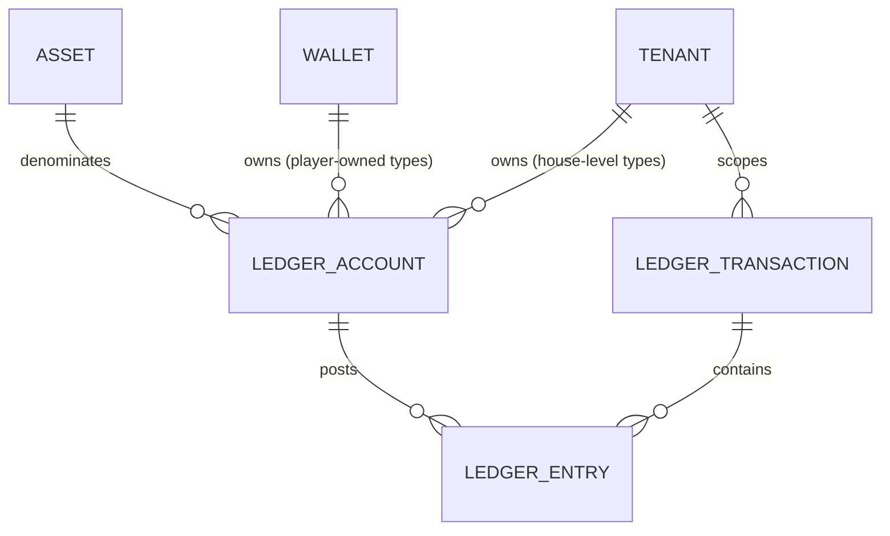

# Ledger Accounting Model

Status: `IMPLEMENTED` (Stage 3B). Designed in Stage 3A (Financial
Architecture Freeze) and built in Stage 3B: migrations `0020`–`0023`
(`ledger_accounts`, `ledger_transactions`, `ledger_entries`,
`wallet_balance_projection`) plus `internal/ledger`. Note that
`ledger_transactions.transaction_type` is deliberately constrained to the
deposit/withdrawal/manual-adjustment/tombstone types Stage 3B actually
posts; casino/sportsbook/bonus/crypto types listed in §1.2 and
`financial-transaction-flows.md` are added by their own stage. Source:
Blueprint §4.2 ("Wallet and ledger"), extending `docs/decisions/0001`,
`0007`, and `docs/architecture/06-wallet-ledger-architecture.md`, and
consistent with `financial-domain-model.md`'s scoping table. Owner:
`ledger-finance`.

Labeling convention (unchanged from `financial-domain-model.md`):
`BLUEPRINT` = stated directly in the Blueprint; `ARCHITECTURAL DECISION` =
informed by the Blueprint but not literally specified; `OPEN DECISION` =
Blueprint silent, left for a human.

## 1. Core objects



### 1.1 `LedgerAccount` — `BLUEPRINT` (account types) + `ARCHITECTURAL DECISION` (column shape)

```
LedgerAccount
  id                 UUID (PK)
  tenant_id          UUID NOT NULL
  wallet_id          UUID NULL      -- set for player-owned types; NULL for house-level types
  player_account_id  UUID NULL      -- denormalized from the owning Wallet, NULL for house-level types.
                                  -- This is the column the player-scoped RLS policy keys on (migration 0020);
                                  -- kept in lockstep with wallet_id by CHECK ((wallet_id IS NULL) = (player_account_id IS NULL))
  account_type       TEXT NOT NULL  -- see §2
  asset_code         TEXT NOT NULL  -- FK to assets.code
  status             TEXT NULL      -- house-level accounts only ('active' | 'frozen' | 'closed'); NULL for
                                  -- player-owned accounts, whose effective status is read from their Wallet (see below)
  created_at         TIMESTAMPTZ NOT NULL
  UNIQUE (wallet_id, account_type, asset_code) WHERE wallet_id IS NOT NULL
  UNIQUE (tenant_id, account_type, asset_code) WHERE wallet_id IS NULL
```

A `LedgerAccount` is a named bucket that ledger entries post to — it never
carries a balance column itself (§5). `asset_code` is denormalized from the
owning `Wallet` for player-owned types (and must match it — enforced by a
composite FK `(wallet_id, asset_code) REFERENCES wallets (id, asset_code)`,
the same denormalization-plus-FK pattern used for `tenant_id`/`brand_id` on
`Wallet` itself); for house-level types it is set directly since there is
no wallet to inherit it from.

Exactly one `LedgerAccount` row exists per `(wallet_id, account_type,
asset_code)` or `(tenant_id, account_type, asset_code)` — accounts are not
created per-transaction; a transaction's entries reference existing
accounts, creating one lazily on first use if it doesn't exist yet (via
`INSERT ... ON CONFLICT DO NOTHING` against the unique constraints above,
never check-then-insert, so two concurrent first postings cannot create
two accounts).

**`status` is derived for player-owned accounts, not stored twice.** The
idea that an account "inherits wallet status" is only sound if it is an actual
derivation: a stored per-account copy of `wallets.status` is a second
source of truth for freeze state that can drift from the wallet (e.g. a
wallet frozen for an AML investigation while one of its accounts still
reads `'active'`, which is precisely the account an attacker or a buggy
code path would post to). For player-owned types the effective status is
therefore *always read from the owning `Wallet`* — no independent
per-account status exists. Only house-level accounts (`wallet_id IS NULL`)
carry their own `status`, defaulting to `'active'`. Freezing a house-level
account halts every flow that touches it tenant-wide, so **`OPEN
DECISION`**: which role may do so, and under what approval tier, is an
operational/risk policy question left for `security` + finance — not
decided here. Note that in all cases a frozen or closed account still
permits the compensating and four-eyes-gated corrective postings described
in `financial-domain-model.md`; "frozen" blocks ordinary flows, never the
ledger's ability to record a correction.

### 1.2 `LedgerTransaction` — `ARCHITECTURAL DECISION`

```
LedgerTransaction
  id                 UUID (PK)
  tenant_id          UUID NOT NULL
  transaction_type   TEXT NOT NULL   -- 'deposit' | 'withdrawal' | 'casino_bet' | ... | 'tombstone' (see financial-transaction-flows.md and §1.4)
  -- NOTE: there is deliberately NO stored `status` column. 'posted'/'reversed'
  -- are DERIVED labels (a view or computed expression), never a mutable field
  -- — see the status note below in this section. A physical status column is an
  -- UPDATE target on a historical financial row, contradicting the append-only
  -- rule and invariant #2. (Stage 3A `security` review: the column sketch and
  -- the prose below contradicted each other; the prose is the correct one.)
  idempotency_key    TEXT NOT NULL   -- see idempotency ADR and §3
  provider_id        TEXT NULL       -- external system that originated this, if any
  provider_tx_id     TEXT NULL       -- external system's reference for this transaction
  correlation_id     UUID NOT NULL   -- ties together a business operation across services/requests
  causation_id       UUID NULL       -- the specific event/command that caused this transaction (e.g. a provider callback id)
  reverses_transaction_id UUID NULL  -- set on a compensating transaction; FK to ledger_transactions.id
  reason_code        TEXT NULL       -- required for manual_adjustment transactions (CLAUDE.md four-eyes rule)
  created_at         TIMESTAMPTZ NOT NULL
  posted_at          TIMESTAMPTZ NOT NULL  -- when entries became visible/authoritative; see §4 on posting vs. creation
  UNIQUE (tenant_id, provider_id, provider_tx_id) WHERE provider_id IS NOT NULL  -- BLUEPRINT idempotency rule, tenant-scoped (§3)
  UNIQUE (tenant_id, idempotency_key)
```

A `LedgerTransaction` is the atomicity/idempotency boundary: it either
posts all of its entries or none of them, in one database transaction. It
never spans tenants — a database constraint (§6, invariant #5) ensures every entry it
owns belongs to an account whose `tenant_id` matches the transaction's own
`tenant_id`.

**`provider_id`/`provider_tx_id` are opaque strings, never a provider
type or enum.** This is what already makes the ledger provider-agnostic
(per the business owner's multi-provider fiat/crypto requirement,
formalized in `docs/decisions/0022-payment-provider-agnosticism-and-
capability-model.md`): the ledger records *which adapter, which external
reference*, and nothing about how that provider works. No table or
invariant in this document may ever branch on a specific provider's
identity — provider-specific behavior lives exclusively in that
provider's `PaymentProvider`/`CryptoCustodyProvider` adapter
(`payment-orchestration.md`, `crypto-custody-boundary.md`), translated
into the same canonical flow shapes (`financial-transaction-flows.md`)
before it ever reaches this model.

`status`: `'posted'` is the only state a completed `LedgerTransaction` has
— per principle 2 (append-only, no `UPDATE`/`DELETE` of historical
entries), a posted transaction's entries are never edited or unposted.
`'reversed'` is not a state a row transitions *into* by mutation; it is a
**derived/reporting label** meaning "a later transaction exists with
`reverses_transaction_id` pointing at this one" — included in the model
as a queryable view/computed column, not as a column that gets `UPDATE`d
on the original row. There is deliberately no `'pending'` or `'failed'`
status on `LedgerTransaction` itself: a transaction that failed to post
completely (application crash, provider timeout mid-flow) simply does not
exist as a row — nothing partial is ever visible (see §4). Provider-
side pending/settling states belong to the provider's own state machine
(e.g. withdrawal-state-machine.md, payment-orchestration.md), which decides
*when* to ask the ledger to post — the ledger itself only ever records
completed, balanced, atomic facts.

### 1.3 `LedgerEntry` — `BLUEPRINT` (debit/credit columns) + `ARCHITECTURAL DECISION` (remaining columns)

```
LedgerEntry
  id                 UUID (PK)
  ledger_transaction_id UUID NOT NULL  -- composite FK, see below
  ledger_account_id  UUID NOT NULL     -- composite FK, see below
  tenant_id          UUID NOT NULL     -- denormalized from ledger_account; must match it (composite FK)
  wallet_id          UUID NULL         -- denormalized from ledger_account; NULL for house-level accounts.
                                       -- Required so ADR 0019's player-scoped RLS policy can be written
                                       -- against a column ON THIS ROW rather than via a join (see below).
  player_account_id  UUID NULL         -- denormalized from ledger_account; NULL for house-level accounts.
                                       -- The column the player-scoped RLS policy actually keys on (migration 0022).
  asset_code         TEXT NOT NULL     -- denormalized from ledger_account; must match it (composite FK)
  direction          TEXT NOT NULL     -- 'debit' | 'credit'
  amount             NUMERIC(38,0) NOT NULL CHECK (amount > 0)  -- minor units, scaled by asset's decimal_exponent
  created_at         TIMESTAMPTZ NOT NULL
  FOREIGN KEY (ledger_account_id, tenant_id, asset_code)
    REFERENCES ledger_accounts (id, tenant_id, asset_code)
  -- wallet_id is deliberately NOT part of this FK: it is NULL for house-level
  -- entries, and a composite FK containing a NULL column is satisfied
  -- trivially (MATCH SIMPLE), which would switch the tenant/asset check OFF
  -- for exactly the house-level rows. wallet_id agreement with the account is
  -- enforced by a trigger/CHECK instead (see the `wallet_id` note below).
  FOREIGN KEY (ledger_transaction_id, tenant_id)
    REFERENCES ledger_transactions (id, tenant_id)
```

**Both composite foreign keys are load-bearing.** §1.2's claim that a
transaction never spans tenants is only a schema-level, RLS-independent
guarantee if the entry is pinned on `tenant_id` to its *transaction* as
well as to its *account*; the account-side FK alone does not achieve it.
`FOREIGN KEY (ledger_transaction_id, tenant_id) REFERENCES
ledger_transactions (id, tenant_id)` supplies the missing half, and requires
`ledger_transactions` to expose a `UNIQUE (id, tenant_id)` constraint
(trivially addable alongside its own PK, the same pattern already used for
`ledger_accounts (id, tenant_id, asset_code)` and for `wallets`'
`(player_account_id, tenant_id, brand_id)` FK in
`financial-domain-model.md`).

**Why `wallet_id` is on this row** (Stage 3A `security` review): ADR 0019
specifies a player-principal-scoped read policy over ledger entries ("a
player reads only ledger entries for their own wallets, never another
player's, even within the same tenant"). Such a policy is not implementable
without a wallet/player column on the row being protected — it would have
to subquery `ledger_accounts`, which is slower and *itself subject to that
table's own RLS*, producing a policy whose deny behaviour silently depends
on a second table's policy set. That is precisely the indirection ADR 0016
had to unwind for `sessions`. `wallet_id` is therefore denormalized onto
the entry, NULL for house-level accounts.

Because `wallet_id` is nullable it cannot be carried in the composite FK
(a `MATCH SIMPLE` composite FK with any NULL column is satisfied
trivially, which would disable the tenant/asset check for exactly the
house-level rows, and `MATCH FULL` would reject them outright). Stage 3B
must therefore enforce `ledger_entries.wallet_id = ledger_accounts.wallet_id`
with a trigger (or a generated column plus `CHECK`) on insert — an explicit
Stage 3B obligation, not an assumed property of the FK.

Per the Blueprint's own worked examples (reproduced in
`06-wallet-ledger-architecture.md`), entries use an explicit
**debit/credit direction column with a strictly positive amount**, never a
single signed amount column. This is the standard double-entry
representation and is what the Blueprint's worked tables show; it is kept
verbatim rather than "simplified" to a signed integer, because a signed
column silently allows an unbalanced transaction (e.g. two negative
entries) to look superficially plausible, whereas `SUM(debit) =
SUM(credit)` per asset per transaction is a single, mechanically checkable
invariant (§6, invariant #1) against this exact shape.

`tenant_id` and `asset_code` are denormalized onto `LedgerEntry` (not only
reachable via a join to `ledger_accounts`) for the same RLS-needs-the-
column-on-the-protected-row reason `Wallet` denormalizes `tenant_id`/
`brand_id` (`financial-domain-model.md` §"Wallet identity").

### 1.4 Tombstones (rollback of a never-seen transaction) — `ARCHITECTURAL DECISION`

CLAUDE.md / ADR 0001 require that "a rollback for a transaction never seen
writes a tombstone so a late-arriving original is rejected", and
`financial-transaction-flows.md` Flows 2 and 7 depend on that mechanism.
It is modeled here because it has to live in the *same uniqueness
namespace* as ordinary transactions to be database-enforced — a separate
table would require a second lookup and reintroduce the check-then-insert
race the unique constraint exists to eliminate.

A tombstone is therefore a `LedgerTransaction` row with
`transaction_type = 'tombstone'`, carrying the **original's**
`(provider_id, provider_tx_id)` and **zero `LedgerEntry` rows**: no money
moved, so nothing posts, but the late-arriving original callback hits
`UNIQUE (tenant_id, provider_id, provider_tx_id)` (§3) and is rejected rather than posted
after the fact. The tombstone row itself records `reason_code`, the
rollback/reversal callback's own reference in `causation_id`, and the
`correlation_id` of the business operation.

Consequences that Stage 3B must honour explicitly:

- The "debits = credits per transaction per asset" invariant (§6 #1) is
  satisfied trivially (0 = 0) by a tombstone; the enforcing
  constraint/trigger must therefore permit an entry-less transaction **only**
  for `transaction_type = 'tombstone'`, and must reject an entry-less
  transaction of any other type (which would otherwise be an
  invisible-but-plausible bug).
- A tombstone is never reversed. If the original transaction legitimately
  needs to be posted after a tombstone exists, that is a manual,
  four-eyes, reason-coded `manual_adjustment` with its own idempotency key
  — not a deletion or mutation of the tombstone.
- Tombstones are excluded from GGR/turnover reporting by
  `transaction_type`, since they represent a *rejected* fact, not a
  financial one.

### 1.5 Audit relationship

Every `LedgerTransaction` write additionally writes one audit record (per
CLAUDE.md's "every mutating administrative/financial action writes an
audit record") via the existing append-only audit store
(`docs/decisions/0013-audit-log-immutability-and-dual-scope-rls.md`),
correlated by `correlation_id`. The audit record captures actor/principal,
tenant, `transaction_type`, `ledger_transaction_id`, before/after balance
projections for affected accounts where meaningful, external reference,
and reason code (for manual adjustments). **The audit log is a secondary,
human-readable trail — the ledger itself remains the sole authoritative
financial record** (CLAUDE.md; ADR 0001). Reconstructing money movement from the audit log alone is
explicitly not a supported operation; reconciliation and balance rebuild
(`reconciliation-model.md`) always read `ledger_entries`, never the audit
store.

## 2. Financial accounts

Per-account-type modeling. The Blueprint's list (`player_cash`, `player_bonus`,
`player_locked`, `house_gaming`, `provider_payable`, `psp_clearing`,
`psp_reserve`, `jackpot_contribution`, `promo_liability`,
`manual_adjustment`) is `BLUEPRINT`; `player_withdrawal_hold` below is an
`ARCHITECTURAL DECISION` addition, called out explicitly as such.

| Account type | Purpose | Owner/scope | Asset applicability | Normal balance | Allowed transaction types | Directly manipulable? | Compensating entries required? | Reconciliation |
|---|---|---|---|---|---|---|---|---|
| `player_cash` (`BLUEPRINT`) | Player's real-money balance | Wallet (player+brand+tenant) | Any asset the tenant/jurisdiction offers | Credit (liability — asset owed to player) | deposit, deposit_reversal, withdrawal_requested/_reversed, casino bet/win/rollback, sportsbook bet/settlement/void/partial settlement, bonus conversion-in, jackpot_payout, manual_adjustment | No — only via a `LedgerTransaction` | Yes, always | Wallet projection vs. ledger (hourly); wallet vs. PSP/provider (daily) |
| `player_bonus` (`BLUEPRINT`) | Non-withdrawable bonus balance subject to wagering | Wallet | Any asset bonuses are offered in | Credit | bonus_grant, casino/sportsbook bet/win (bonus-funded stake), bonus_conversion (bonus→cash), bonus_forfeiture | No | Yes | Wallet projection vs. ledger (hourly); bonus-engine liability vs. `promo_liability` (see below) |
| `player_locked` (`BLUEPRINT`) | Funds locked against an open sportsbook stake (not yet settled) | Wallet | Any asset sportsbook accepts | Credit while locked (liability — stake still belonging to the player until the outcome is known) | sportsbook_bet (lock), sportsbook_settlement (release), sportsbook_partial_settlement (partial release), sportsbook_void (release) | No | Yes, on void/partial settlement | Open-liability report (see `09-sportsbook-architecture.md`) vs. sum of `player_locked` balances |
| `player_withdrawal_hold` (`ARCHITECTURAL DECISION`) | Funds earmarked for a withdrawal request that has left `player_cash` but is not yet externally sent (pending approval/PSP submission) | Wallet | Any withdrawable asset | Credit while held | withdrawal_requested (in), withdrawal_completed (out, external send), withdrawal_reversed (back to `player_cash`) | No | Yes | Cross-checked against open rows in the withdrawal state machine (`withdrawal-state-machine.md`) — every held amount must equal exactly one non-terminal withdrawal request |
| `house_gaming` (`BLUEPRINT`) | House's gaming P&L (stakes in, wins out) | Tenant (house-level, no wallet — see `financial-domain-model.md`) | Any asset the tenant accepts stakes in | Credit (revenue) net over time — may legitimately sit debit-side for a period if payouts exceed stakes | casino_bet, casino_win, casino_rollback, sportsbook_settlement, sportsbook_partial_settlement, sportsbook_void (post-settlement), provider_settlement (fee recognition — see Flow 17 `OPEN DECISION`). **Not** `sportsbook_bet`: a sportsbook stake moves `player_cash`/`player_bonus` → `player_locked` only, and does not touch `house_gaming` until settlement | No | Yes | Recomputed GGR (Blueprint §4.9) vs. this account's balance, per tenant per asset |
| `provider_payable` (`BLUEPRINT`) | Amount owed to a casino/sportsbook game provider for GGR-share/fees | Tenant (house-level) | Any asset the provider bills in | Credit (liability) | provider_settlement | No | Yes | Daily reconciliation against provider settlement statements |
| `psp_clearing` (`BLUEPRINT`) | In-flight funds between a PSP initiating a movement and it landing in `player_cash`/external bank rail | Tenant (house-level) | Any fiat asset with PSP rails | **Debit** (asset — funds receivable from / held at the PSP). Transient: should net toward zero as batches settle to the bank rail | deposit (debit, in), deposit_reversal (credit), withdrawal send (credit, out), psp_settlement_batch (credit, out to bank rail), psp_reserve_movement | No | Yes | PSP settlement file reconciliation (`reconciliation-model.md`) |
| `psp_reserve` (`BLUEPRINT`) | Funds a PSP holds back (rolling reserve / chargeback buffer) | Tenant (house-level) | Any fiat asset the PSP reserves | **Debit** (asset — platform funds withheld by the PSP and receivable back; a credit normal balance would state the opposite of this account's stated purpose) | psp_reserve_movement (increase = debit `psp_reserve` / credit `psp_clearing`; release = inverse) | No | Yes | PSP reserve statement vs. this account, monthly or per PSP's own cadence |
| `jackpot_contribution` (`BLUEPRINT`) | Portion of stakes contributed to a progressive jackpot pool | Tenant (house-level) — `OPEN DECISION`: or provider-scoped if the Blueprint's jackpot model is provider-hosted (see below) | Any asset the jackpot-enabled games accept | Credit (liability to eventual jackpot winner/provider) | casino_bet (contribution split), jackpot_payout | No | Yes | Provider's jackpot pool statement vs. this account |
| `promo_liability` (`BLUEPRINT`) | Contra/cost account mirroring outstanding bonus value issued but not yet converted or forfeited | Tenant (house-level) | Any asset bonuses are issued in | **Debit**, as posted by Flows 12/15 — see the `promo_liability` `OPEN DECISION` below; the player-facing *liability* is `player_bonus` (credit), and this account is its balancing counter-side, so labelling it "credit (liability)" both double-counts the liability and makes Flow 12 unbalanced | bonus_grant (debit, in), bonus_conversion / bonus_forfeiture (credit, out) | No | Yes | Sum of all non-terminal `player_bonus` balances vs. this account, per tenant per asset — must reconcile exactly |
| `manual_adjustment` (`BLUEPRINT`) | Counter-account for staff-initiated corrections | Tenant (house-level) | Any asset | Neither — a clearing/offset account by design; direction is whatever balances the account being corrected | manual_adjustment only | **No** — like every other account, it is only ever moved by posting a `LedgerTransaction`; the difference is that the *initiation* is a human back-office action, four-eyes-gated above threshold (CLAUDE.md), never a raw account or balance mutation | Yes — a manual adjustment is itself corrected only by a further, separately approved compensating `manual_adjustment`, never by editing the original | Every entry here requires a reason code and is 100% audited; this account's activity is itself a standing reconciliation report (all manual interventions, by definition) |

`OPEN DECISION` (`jackpot_contribution` scope): the Blueprint mentions
jackpot contribution as a Blueprint-listed account type but does not
specify whether progressive jackpots are platform-hosted (tenant liability
until paid) or entirely provider-hosted (the provider owns the pool and
the platform only records its own contribution as an expense, not a
liability it could ever be asked to pay out directly). This changes
whether `jackpot_contribution`'s normal balance is a liability or an
expense-recognition account. Left open pending the actual jackpot-provider
contract; Stage 3B does not require resolving it since no jackpot
integration ships in this stage.

`OPEN DECISION` — **now RESOLVED, see the resolution note immediately
below this block** (`promo_liability` framing and the missing bonus-cost
account): double-entry forces a choice here, and the Blueprint's
ten-account list does not obviously contain the counter-account a bonus
grant needs. `player_bonus` is unambiguously credit-normal (value owed to
the player). A grant must therefore *debit* something. Two coherent
models exist:

1. **As currently posted (Flows 12/15)**: `promo_liability` is the debit
   side — effectively a bonus-cost / contra-liability account whose debit
   balance mirrors the sum of outstanding `player_bonus` credit balances
   (which is exactly what this row's reconciliation column asserts). Its
   name is then misleading but no new account type is needed.
2. **Strict liability framing**: `promo_liability` stays credit-normal and
   a *new* `bonus_expense` (P&L) account type is added as the debit side
   of a grant, with `promo_liability` mirroring `player_bonus` on the
   credit side. This adds an eleventh account type and changes NGR
   reporting.

Which framing is adopted is a finance/reporting decision (it changes how
bonus cost appears in GGR/NGR and in the tenant's P&L), not an
engineering one, and is **not** resolved here. What *is* fixed regardless:
a bonus grant is one debit and one credit of equal amount in one asset
(Flow 12 must never post two same-direction entries), and no bonus value
is ever created without a balancing counter-entry.

**RESOLVED (Stage 4H-A) — `docs/decisions/0032-bonus-accounting.md`.** The
framing above is settled: **framing 1 is confirmed** — `promo_liability` is
the debit-side mirror of `player_bonus`, and the genuinely missing piece,
a **new `bonus_expense` account type** (house-level, per `(tenant_id,
asset_code)`, `wallet_id IS NULL`, debit-normal), is added to carry
*recognized* promotional cost at the moment bonus value leaves
`player_bonus` for any reason other than forfeiture. The resulting
zero-tolerance invariant is **B1**: `signed(promo_liability) + Σ
signed(player_bonus) == 0` per `(tenant_id, asset_code)` at every instant
(see §6). ADR 0032 holds the full reasoning, the per-event entry tables
(grant / conversion / forfeiture / reversal), the operator- vs.
provider-funded vs. externally-fulfilled cost treatments, and the
recognition position; it is not duplicated here. Status: **architecture
only, `NOT IMPLEMENTED`** — no migration adds `bonus_expense` or any
`bonus_*` `transaction_type` yet, so bonus postings remain `BLOCKED` by the
existing `CHECK` constraint until their own stage.

`OPEN DECISION` (cross-asset conversion counter-account): `ADR 0021`'s
`ConversionOperation` cannot balance per asset using only player wallet
accounts (see that ADR's corrected text) — it requires a house-level
FX/conversion clearing account per asset, which is also not in the
Blueprint's ten. Deferred with the same reasoning; no flow in
`financial-transaction-flows.md` produces a conversion in Stage 3B.

Beyond the Blueprint's ten plus `player_withdrawal_hold`, every flow in
`financial-transaction-flows.md` resolves onto this list **with three
exceptions, all recorded as `OPEN DECISION`s above or in the flows
document rather than silently patched**: the bonus-grant counter-account
(`promo_liability` framing, above — **now resolved by ADR 0032, which also
adds `bonus_expense` as a twelfth account type; `NOT IMPLEMENTED`**), the
FX/conversion clearing account
required by ADR 0021, and the provider-fee expense account (Flow 17). Each
is a finance/reporting decision, not an engineering one. If Stage 3B
implementation surfaces a further gap, it is likewise a new architectural
decision, not a silent schema addition.

## 3. Idempotency keys — `BLUEPRINT` (constraint) + `ARCHITECTURAL DECISION` (scope, detailed in the idempotency ADR)

Every `LedgerTransaction` carries two independent uniqueness mechanisms,
both database-enforced:

1. `UNIQUE (tenant_id, provider_id, provider_tx_id) WHERE provider_id IS
   NOT NULL` — the Blueprint's own idempotency rule, for transactions that
   originate from an external callback (PSP, casino provider, sportsbook
   provider, custodian).
2. `UNIQUE (tenant_id, idempotency_key)` — a platform-generated or
   caller-supplied key for internally-originated operations (manual
   adjustments, bonus-engine-triggered postings) that have no natural
   `(provider_id, provider_tx_id)` pair.

**Both keys are tenant-scoped** (`ARCHITECTURAL DECISION`, Stage 3A, owner
`architect`; CLAUDE.md permits "(provider_id, provider_tx_id) *or
equivalent*"). A platform-global unique key on a tenant-partitioned,
RLS-protected table is a multi-tenancy defect in two directions:

- **Cross-tenant denial/collision.** Provider references and
  caller-supplied idempotency keys are only unique within a provider
  *account*, and provider credentials are per tenant (`CLAUDE.md`,
  `payment-orchestration.md` §10). Two tenants using the same PSP — or one
  tenant simply choosing a key another tenant already used — could
  otherwise block each other's legitimate postings.
- **Cross-tenant information leak.** With `FORCE ROW LEVEL SECURITY`, a
  unique violation against a row the current tenant cannot see still
  surfaces as an error, revealing that another tenant holds that
  reference. Scoping the constraint by `tenant_id` removes the oracle.

This satisfies the Blueprint/CLAUDE.md rule ("a unique constraint on
`(provider_id, provider_tx_id)` *or equivalent*, enforced by the
database"). Because `tenant_id` is always derived server-side from
authenticated context (invariant #6), adding it to the key cannot be
influenced by a client. The trade-off is explicit: per-tenant provider
credentials become a hard requirement, because one provider account shared
across two tenants would no longer be de-duplicated by a tenant-scoped
constraint. `ledger-finance` sign-off, with `architect` + `security`
confirmation, is required before Stage 3B encodes this in a migration,
since it modifies the mechanism behind invariants #3/#4.

Full retry/concurrency semantics (exact-retry vs. same-key-different-
payload vs. concurrent-duplicate behavior) are specified in
`docs/decisions/0020-financial-idempotency-and-concurrency-control.md`.

## 4. Posting status vs. transaction status

Because `LedgerTransaction` has no partial/pending state (§1.2), there is
no separate "posting status" column distinct from `status` — posting is
atomic and binary (all entries exist, or the transaction row does not
exist). What upstream systems call "pending" (a deposit awaiting PSP
confirmation, a withdrawal awaiting approval) is modeled as **no ledger
transaction yet** — the provider/workflow state machine tracks its own
pending states externally (`withdrawal-state-machine.md`,
`payment-orchestration.md`) and only calls into the ledger once there is a
fact to post. This is a deliberate simplification versus modeling
"pending ledger transactions": a pending ledger row would be either (a)
mutated later (violates append-only) or (b) itself require a compensating-
entry model to "cancel" — both worse than keeping pending state entirely
outside the ledger until the fact is final.

## 5. Balance is a projection, never a stored field — `BLUEPRINT`

No table in this model has a `balance` column. A `LedgerAccount`'s balance
at any point is:

```sql
SELECT direction, SUM(amount) FROM ledger_entries
WHERE ledger_account_id = $1 AND created_at <= $2
GROUP BY direction;
-- signed_balance = SUM(amount FILTER direction='credit')
--                - SUM(amount FILTER direction='debit')
```

`signed_balance` is defined **credit-positive for every account type,
without exception** — the stored/compared value never varies by account
type, because a per-account sign convention applied at read time is
exactly the kind of ambiguity that produces a wrong comparison in
reconciliation. The "normal balance" column in §2 is therefore only a
statement of which sign a healthy account is *expected* to carry
(`player_cash`, `player_bonus`, `player_locked`,
`player_withdrawal_hold`, `provider_payable`, `jackpot_contribution`,
`house_gaming` ≥ 0; `psp_clearing`, `psp_reserve`, `promo_liability` ≤ 0),
and a presentation-layer instruction to negate debit-normal accounts for
human display. A balance whose sign is the opposite of its normal balance
is an operational alert, not an error in this formula.

Note on the point-in-time filter: `created_at <= $2` uses the *entry's*
timestamp. For as-of reporting, `ledger_transactions.posted_at` is the
business-meaningful instant; the two are equal for atomically posted
transactions, but Stage 3B must pick one explicitly (recommendation:
join and filter on `posted_at`) rather than leaving both in use.

Materialized projections for read performance are covered in
`reconciliation-model.md` §3 ("Balance projections") — they are explicitly
**subordinate, rebuildable caches**, never a second source of truth.

## 6. Mandatory Financial Invariants

Formal list Stage 3B implementation **must** enforce, at minimum, with
the mechanism this model uses to enforce each one (#15 was added during
Stage 3A review):

| # | Invariant | Enforcement mechanism in this model |
|---|---|---|
| 1 | Debits = credits, per transaction, per asset | DB constraint/trigger on `ledger_entries` grouped by `(ledger_transaction_id, asset_code)` — see `docs/decisions/0019` |
| 2 | No historical ledger mutation | **No `UPDATE`/`DELETE` policy at all** on `ledger_entries`/`ledger_transactions` under `FORCE ROW LEVEL SECURITY` (absent permissive policy = deny), **plus** a `BEFORE UPDATE OR DELETE` row trigger **and** a `BEFORE TRUNCATE` statement trigger that unconditionally raise — the pair ADR 0013 arrived at for `audit_log`. Corrected in Stage 3A `security` review: the previous "no `UPDATE`/`DELETE` grants for the application role" does **not** hold here, because that role *owns* these tables (ADR 0016, "Approaches considered" #2) and a table owner can re-`GRANT` itself any privilege; row triggers also never fire on `TRUNCATE`. See ADR 0019, "Append-only enforcement". |
| 3 | No duplicate financial effect from retries | `UNIQUE (tenant_id, idempotency_key)` (§3) |
| 4 | No duplicate provider callback effect | `UNIQUE (tenant_id, provider_id, provider_tx_id)` (§3) |
| 5 | No cross-tenant financial access | RLS on every table in this model, `tenant_id` denormalized onto every row (see `docs/decisions/0019`) |
| 6 | No client-controlled tenant assignment | `tenant_id` always derived server-side from authenticated context (unchanged platform-wide rule, CLAUDE.md) |
| 7 | No floating-point monetary arithmetic | `NUMERIC(38,0)` everywhere; no `FLOAT`/`DOUBLE` column or application-layer float math on any amount |
| 8 | Asset precision respected | `decimal_exponent` always read from the `Asset` registry, never hardcoded (ADR 0007) |
| 9 | Authoritative balance rebuildable from ledger | §5 — balance is always `SELECT SUM(...)`, never a mutated field |
| 10 | Compensating entries only for corrections | `reverses_transaction_id` is the only correction mechanism; no delete/edit path exists |
| 11 | Withdrawal approval cannot be bypassed | State machine gate before any `withdrawal_completed` `LedgerTransaction` can be created — see `withdrawal-state-machine.md` |
| 12 | Locked funds cannot be spent twice | `player_locked`/`player_withdrawal_hold` balances are moved by transactions referencing the specific open bet/withdrawal id they lock against, checked before release (`financial-transaction-flows.md`) |
| 13 | Settlement cannot be posted twice | Same idempotency mechanism (#3/#4) applied to settlement callbacks specifically |
| 14 | Reversed operations leave an auditable financial trail; failed ones leave a non-ledger trail | §1.5 — a posted transaction, including one later reversed, is a permanent row, and a reversal adds entries rather than removing them. An operation that never reached a posted fact (declined, abandoned, crashed mid-flow) deliberately has **no** ledger row at all (§4); its trail is the audit log plus the orchestrator/workflow attempt records (`payment-orchestration.md` §5, `withdrawal-state-machine.md` §2) |
| 15 | Balance sufficiency is checked in the same database transaction as the debit it authorizes | Not a new rule — CLAUDE.md's "the authoritative balance read happens inside the same database transaction as the write", given its own number because `financial-transaction-flows.md` Flows 3/5/8 need one to cite and #9 (balance rebuildability) is a different property. Mechanism: `docs/decisions/0020` (row lock or `SERIALIZABLE`) |

These are the floor Stage 3B must meet; each transaction flow in
`financial-transaction-flows.md` states which of these apply to it
specifically.

### 6.1 Invariant B1 (bonus mirror) — added Stage 4H-A, `NOT IMPLEMENTED`

`docs/decisions/0032-bonus-accounting.md` §2 adds one further invariant,
listed here so the mandatory list above stays the single place to look:

| # | Invariant | Enforcement mechanism |
|---|---|---|
| B1 | `signed(promo_liability) + Σ signed(player_bonus) == 0` for every `(tenant_id, asset_code)`, at every instant, **no tolerance band** | Rule B2 in ADR 0032: every `LedgerEntry` against a `player_bonus` account carries an equal, opposite `promo_liability` entry in the **same `LedgerTransaction`**, generated/validated in `internal/ledger` rather than assembled by callers. Verified continuously by a new hourly, zero-tolerance reconciliation stream, P1 on any drift (`reconciliation-model.md`) |

B1 is `NOT IMPLEMENTED`: it becomes enforceable only once the
`bonus_expense` account type and the `bonus_*` transaction types exist.
Its full derivation, the worked grant/bet/win/convert check, and the
provider-funded and externally-fulfilled variants are in ADR 0032 and are
not restated here.

### 6.2 Open item — `player_locked` loses stake origin (blocking precondition, future stage)

`OPEN DECISION`, recorded here because it constrains a **future** stage and
must not be discovered during implementation. §2's `player_locked` is a
**single** account type, so a sportsbook stake posted per
`financial-transaction-flows.md` Flow 8 loses whether the locked funds came
from `player_cash` or `player_bonus`. Two consequences: settlement cannot
know whether to return the stake to cash or to bonus, and invariant B1
(§6.1) breaks the moment a bonus-funded stake is locked, because the value
has left `player_bonus` while the player may still get it back, leaving
`promo_liability` with nothing correct to mirror.

`RECOMMENDATION` (ADR 0032 §10): split into `player_locked_cash` and
`player_locked_bonus` (or carry an equally binding, indexable origin
dimension) and extend B1's account set to include the bonus-origin locked
account. This does **not** affect casino (no locked state) and is **not**
resolved in Stage 4H-A. It **is** a blocking precondition for implementing
bonus-funded sportsbook stakes, it changes a Blueprint-listed account type,
and it therefore requires `architect` + `sportsbook` + `ledger-finance`
sign-off in the stage that needs it.

## 7. Cross-references

- Object scoping, `Wallet` shape: `financial-domain-model.md`.
- Canonical transaction flows (one row per flow type in §2's "allowed
  transaction types" column): `financial-transaction-flows.md`.
- Idempotency/concurrency mechanism detail:
  `docs/decisions/0020-financial-idempotency-and-concurrency-control.md`.
- Authoritative-ledger/balance-projection ADR:
  `docs/decisions/0019-authoritative-ledger-and-balance-projection-architecture.md`.
- Multi-asset accounting ADR:
  `docs/decisions/0021-multi-asset-accounting.md`.
- Bonus/reward/promotional accounting (`promo_liability` resolution,
  `bonus_expense`, invariant B1): `docs/decisions/0032-bonus-accounting.md`.
- Loyalty/VIP points (a **separate** ledger, not covered by this model):
  `docs/architecture/24-points-accounting-architecture.md`.
- RLS design for every table introduced here: kept in one canonical place,
  `docs/decisions/0019-authoritative-ledger-and-balance-projection-architecture.md`'s
  "Security/RLS" section, rather than duplicated per document.
