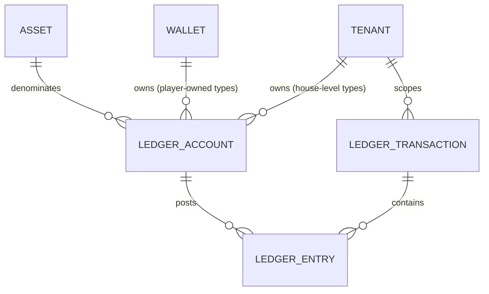

# Ledger Accounting Model

Status: `IMPLEMENTED` (Stage 3B). Designed in Stage 3A (Financial
Architecture Freeze) and built in Stage 3B: migrations `0020`–`0023`
(`ledger_accounts`, `ledger_transactions`, `ledger_entries`,
`wallet_balance_projection`) plus `internal/ledger`. Note that
`ledger_transactions.transaction_type` is deliberately constrained to the
deposit/withdrawal/manual-adjustment/tombstone types Stage 3B actually
posts; casino/sportsbook/bonus/crypto types listed in §1.2 and
`financial-transaction-flows.md` are added by their own stage. Source:
Blueprint §4.2 ("Wallet and ledger"), extending `docs/decisions/0001`,
`0007`, and `docs/architecture/06-wallet-ledger-architecture.md`, and
consistent with `financial-domain-model.md`'s scoping table. Owner:
`ledger-finance`.

Labeling convention (unchanged from `financial-domain-model.md`):
`BLUEPRINT` = stated directly in the Blueprint; `ARCHITECTURAL DECISION` =
informed by the Blueprint but not literally specified; `OPEN DECISION` =
Blueprint silent, left for a human.

## 1. Core objects



### 1.1 `LedgerAccount` — `BLUEPRINT` (account types) + `ARCHITECTURAL DECISION` (column shape)

```
LedgerAccount
  id                 UUID (PK)
  tenant_id          UUID NOT NULL
  wallet_id          UUID NULL      -- set for player-owned types; NULL for house-level types
  player_account_id  UUID NULL      -- denormalized from the owning Wallet, NULL for house-level types.
                                  -- This is the column the player-scoped RLS policy keys on (migration 0020);
                                  -- kept in lockstep with wallet_id by CHECK ((wallet_id IS NULL) = (player_account_id IS NULL))
  account_type       TEXT NOT NULL  -- see §2
  asset_code         TEXT NOT NULL  -- FK to assets.code
  status             TEXT NULL      -- house-level accounts only ('active' | 'frozen' | 'closed'); NULL for
                                  -- player-owned accounts, whose effective status is read from their Wallet (see below)
  created_at         TIMESTAMPTZ NOT NULL
  UNIQUE (wallet_id, account_type, asset_code) WHERE wallet_id IS NOT NULL
  UNIQUE (tenant_id, account_type, asset_code) WHERE wallet_id IS NULL
```

A `LedgerAccount` is a named bucket that ledger entries post to — it never
carries a balance column itself (§5). `asset_code` is denormalized from the
owning `Wallet` for player-owned types (and must match it — enforced by a
composite FK `(wallet_id, asset_code) REFERENCES wallets (id, asset_code)`,
the same denormalization-plus-FK pattern used for `tenant_id`/`brand_id` on
`Wallet` itself); for house-level types it is set directly since there is
no wallet to inherit it from.

Exactly one `LedgerAccount` row exists per `(wallet_id, account_type,
asset_code)` or `(tenant_id, account_type, asset_code)` — accounts are not
created per-transaction; a transaction's entries reference existing
accounts, creating one lazily on first use if it doesn't exist yet (via
`INSERT ... ON CONFLICT DO NOTHING` against the unique constraints above,
never check-then-insert, so two concurrent first postings cannot create
two accounts).

**`status` is derived for player-owned accounts, not stored twice.** The
idea that an account "inherits wallet status" is only sound if it is an actual
derivation: a stored per-account copy of `wallets.status` is a second
source of truth for freeze state that can drift from the wallet (e.g. a
wallet frozen for an AML investigation while one of its accounts still
reads `'active'`, which is precisely the account an attacker or a buggy
code path would post to). For player-owned types the effective status is
therefore *always read from the owning `Wallet`* — no independent
per-account status exists. Only house-level accounts (`wallet_id IS NULL`)
carry their own `status`, defaulting to `'active'`. Freezing a house-level
account halts every flow that touches it tenant-wide, so **`OPEN
DECISION`**: which role may do so, and under what approval tier, is an
operational/risk policy question left for `security` + finance — not
decided here. Note that in all cases a frozen or closed account still
permits the compensating and four-eyes-gated corrective postings described
in `financial-domain-model.md`; "frozen" blocks ordinary flows, never the
ledger's ability to record a correction.

### 1.2 `LedgerTransaction` — `ARCHITECTURAL DECISION`

```
LedgerTransaction
  id                 UUID (PK)
  tenant_id          UUID NOT NULL
  transaction_type   TEXT NOT NULL   -- 'deposit' | 'withdrawal' | 'casino_bet' | ... | 'tombstone' (see financial-transaction-flows.md and §1.4)
  -- NOTE: there is deliberately NO stored `status` column. 'posted'/'reversed'
  -- are DERIVED labels (a view or computed expression), never a mutable field
  -- — see the status note below in this section. A physical status column is an
  -- UPDATE target on a historical financial row, contradicting the append-only
  -- rule and invariant #2. (Stage 3A `security` review: the column sketch and
  -- the prose below contradicted each other; the prose is the correct one.)
  idempotency_key    TEXT NOT NULL   -- see idempotency ADR and §3
  provider_id        TEXT NULL       -- external system that originated this, if any
  provider_tx_id     TEXT NULL       -- external system's reference for this transaction
  correlation_id     UUID NOT NULL   -- ties together a business operation across services/requests
  causation_id       UUID NULL       -- the specific event/command that caused this transaction (e.g. a provider callback id)
  reverses_transaction_id UUID NULL  -- set on a compensating transaction; FK to ledger_transactions.id
  reason_code        TEXT NULL       -- required for manual_adjustment transactions (CLAUDE.md four-eyes rule)
  created_at         TIMESTAMPTZ NOT NULL
  posted_at          TIMESTAMPTZ NOT NULL  -- when entries became visible/authoritative; see §4 on posting vs. creation
  UNIQUE (tenant_id, provider_id, provider_tx_id) WHERE provider_id IS NOT NULL  -- BLUEPRINT idempotency rule, tenant-scoped (§3)
  UNIQUE (tenant_id, idempotency_key)
```

A `LedgerTransaction` is the atomicity/idempotency boundary: it either
posts all of its entries or none of them, in one database transaction. It
never spans tenants — a database constraint (§6, invariant #5) ensures every entry it
owns belongs to an account whose `tenant_id` matches the transaction's own
`tenant_id`.

**`provider_id`/`provider_tx_id` are opaque strings, never a provider
type or enum.** This is what already makes the ledger provider-agnostic
(per the business owner's multi-provider fiat/crypto requirement,
formalized in `docs/decisions/0022-payment-provider-agnosticism-and-
capability-model.md`): the ledger records *which adapter, which external
reference*, and nothing about how that provider works. No table or
invariant in this document may ever branch on a specific provider's
identity — provider-specific behavior lives exclusively in that
provider's `PaymentProvider`/`CryptoCustodyProvider` adapter
(`payment-orchestration.md`, `crypto-custody-boundary.md`), translated
into the same canonical flow shapes (`financial-transaction-flows.md`)
before it ever reaches this model.

`status`: `'posted'` is the only state a completed `LedgerTransaction` has
— per principle 2 (append-only, no `UPDATE`/`DELETE` of historical
entries), a posted transaction's entries are never edited or unposted.
`'reversed'` is not a state a row transitions *into* by mutation; it is a
**derived/reporting label** meaning "a later transaction exists with
`reverses_transaction_id` pointing at this one" — included in the model
as a queryable view/computed column, not as a column that gets `UPDATE`d
on the original row. There is deliberately no `'pending'` or `'failed'`
status on `LedgerTransaction` itself: a transaction that failed to post
completely (application crash, provider timeout mid-flow) simply does not
exist as a row — nothing partial is ever visible (see §4). Provider-
side pending/settling states belong to the provider's own state machine
(e.g. withdrawal-state-machine.md, payment-orchestration.md), which decides
*when* to ask the ledger to post — the ledger itself only ever records
completed, balanced, atomic facts.

### 1.3 `LedgerEntry` — `BLUEPRINT` (debit/credit columns) + `ARCHITECTURAL DECISION` (remaining columns)

```
LedgerEntry
  id                 UUID (PK)
  ledger_transaction_id UUID NOT NULL  -- composite FK, see below
  ledger_account_id  UUID NOT NULL     -- composite FK, see below
  tenant_id          UUID NOT NULL     -- denormalized from ledger_account; must match it (composite FK)
  wallet_id          UUID NULL         -- denormalized from ledger_account; NULL for house-level accounts.
                                       -- Required so ADR 0019's player-scoped RLS policy can be written
                                       -- against a column ON THIS ROW rather than via a join (see below).
  player_account_id  UUID NULL         -- denormalized from ledger_account; NULL for house-level accounts.
                                       -- The column the player-scoped RLS policy actually keys on (migration 0022).
  asset_code         TEXT NOT NULL     -- denormalized from ledger_account; must match it (composite FK)
  direction          TEXT NOT NULL     -- 'debit' | 'credit'
  amount             NUMERIC(38,0) NOT NULL CHECK (amount > 0)  -- minor units, scaled by asset's decimal_exponent
  created_at         TIMESTAMPTZ NOT NULL
  FOREIGN KEY (ledger_account_id, tenant_id, asset_code)
    REFERENCES ledger_accounts (id, tenant_id, asset_code)
  -- wallet_id is deliberately NOT part of this FK: it is NULL for house-level
  -- entries, and a composite FK containing a NULL column is satisfied
  -- trivially (MATCH SIMPLE), which would switch the tenant/asset check OFF
  -- for exactly the house-level rows. wallet_id agreement with the account is
  -- enforced by a trigger/CHECK instead (see the `wallet_id` note below).
  FOREIGN KEY (ledger_transaction_id, tenant_id)
    REFERENCES ledger_transactions (id, tenant_id)
```

**Both composite foreign keys are load-bearing.** §1.2's claim that a
transaction never spans tenants is only a schema-level, RLS-independent
guarantee if the entry is pinned on `tenant_id` to its *transaction* as
well as to its *account*; the account-side FK alone does not achieve it.
`FOREIGN KEY (ledger_transaction_id, tenant_id) REFERENCES
ledger_transactions (id, tenant_id)` supplies the missing half, and requires
`ledger_transactions` to expose a `UNIQUE (id, tenant_id)` constraint
(trivially addable alongside its own PK, the same pattern already used for
`ledger_accounts (id, tenant_id, asset_code)` and for `wallets`'
`(player_account_id, tenant_id, brand_id)` FK in
`financial-domain-model.md`).

**Why `wallet_id` is on this row** (Stage 3A `security` review): ADR 0019
specifies a player-principal-scoped read policy over ledger entries ("a
player reads only ledger entries for their own wallets, never another
player's, even within the same tenant"). Such a policy is not implementable
without a wallet/player column on the row being protected — it would have
to subquery `ledger_accounts`, which is slower and *itself subject to that
table's own RLS*, producing a policy whose deny behaviour silently depends
on a second table's policy set. That is precisely the indirection ADR 0016
had to unwind for `sessions`. `wallet_id` is therefore denormalized onto
the entry, NULL for house-level accounts.

Because `wallet_id` is nullable it cannot be carried in the composite FK
(a `MATCH SIMPLE` composite FK with any NULL column is satisfied
trivially, which would disable the tenant/asset check for exactly the
house-level rows, and `MATCH FULL` would reject them outright). Stage 3B
must therefore enforce `ledger_entries.wallet_id = ledger_accounts.wallet_id`
with a trigger (or a generated column plus `CHECK`) on insert — an explicit
Stage 3B obligation, not an assumed property of the FK.

Per the Blueprint's own worked examples (reproduced in
`06-wallet-ledger-architecture.md`), entries use an explicit
**debit/credit direction column with a strictly positive amount**, never a
single signed amount column. This is the standard double-entry
representation and is what the Blueprint's worked tables show; it is kept
verbatim rather than "simplified" to a signed integer, because a signed
column silently allows an unbalanced transaction (e.g. two negative
entries) to look superficially plausible, whereas `SUM(debit) =
SUM(credit)` per asset per transaction is a single, mechanically checkable
invariant (§6, invariant #1) against this exact shape.

`tenant_id` and `asset_code` are denormalized onto `LedgerEntry` (not only
reachable via a join to `ledger_accounts`) for the same RLS-needs-the-
column-on-the-protected-row reason `Wallet` denormalizes `tenant_id`/
`brand_id` (`financial-domain-model.md` §"Wallet identity").

### 1.4 Tombstones (rollback of a never-seen transaction) — `ARCHITECTURAL DECISION`

CLAUDE.md / ADR 0001 require that "a rollback for a transaction never seen
writes a tombstone so a late-arriving original is rejected", and
`financial-transaction-flows.md` Flows 2 and 7 depend on that mechanism.
It is modeled here because it has to live in the *same uniqueness
namespace* as ordinary transactions to be database-enforced — a separate
table would require a second lookup and reintroduce the check-then-insert
race the unique constraint exists to eliminate.

A tombstone is therefore a `LedgerTransaction` row with
`transaction_type = 'tombstone'`, carrying the **original's**
`(provider_id, provider_tx_id)` and **zero `LedgerEntry` rows**: no money
moved, so nothing posts, but the late-arriving original callback hits
`UNIQUE (tenant_id, provider_id, provider_tx_id)` (§3) and is rejected rather than posted
after the fact. The tombstone row itself records `reason_code`, the
rollback/reversal callback's own reference in `causation_id`, and the
`correlation_id` of the business operation.

Consequences that Stage 3B must honour explicitly:

- The "debits = credits per transaction per asset" invariant (§6 #1) is
  satisfied trivially (0 = 0) by a tombstone; the enforcing
  constraint/trigger must therefore permit an entry-less transaction **only**
  for `transaction_type = 'tombstone'`, and must reject an entry-less
  transaction of any other type (which would otherwise be an
  invisible-but-plausible bug).
- A tombstone is never reversed. If the original transaction legitimately
  needs to be posted after a tombstone exists, that is a manual,
  four-eyes, reason-coded `manual_adjustment` with its own idempotency key
  — not a deletion or mutation of the tombstone.
- Tombstones are excluded from GGR/turnover reporting by
  `transaction_type`, since they represent a *rejected* fact, not a
  financial one.

### 1.5 Audit relationship

Every `LedgerTransaction` write additionally writes one audit record (per
CLAUDE.md's "every mutating administrative/financial action writes an
audit record") via the existing append-only audit store
(`docs/decisions/0013-audit-log-immutability-and-dual-scope-rls.md`),
correlated by `correlation_id`. The audit record captures actor/principal,
tenant, `transaction_type`, `ledger_transaction_id`, before/after balance
projections for affected accounts where meaningful, external reference,
and reason code (for manual adjustments). **The audit log is a secondary,
human-readable trail — the ledger itself remains the sole authoritative
financial record** (CLAUDE.md; ADR 0001). Reconstructing money movement from the audit log alone is
explicitly not a supported operation; reconciliation and balance rebuild
(`reconciliation-model.md`) always read `ledger_entries`, never the audit
store.

## 2. Financial accounts

Per-account-type modeling. The Blueprint's list (`player_cash`, `player_bonus`,
`player_locked`, `house_gaming`, `provider_payable`, `psp_clearing`,
`psp_reserve`, `jackpot_contribution`, `promo_liability`,
`manual_adjustment`) is `BLUEPRINT`; `player_withdrawal_hold` below is an
`ARCHITECTURAL DECISION` addition, called out explicitly as such.

| Account type | Purpose | Owner/scope | Asset applicability | Normal balance | Allowed transaction types | Directly manipulable? | Compensating entries required? | Reconciliation |
|---|---|---|---|---|---|---|---|---|
| `player_cash` (`BLUEPRINT`) | Player's real-money balance | Wallet (player+brand+tenant) | Any asset the tenant/jurisdiction offers | Credit (liability — asset owed to player) | deposit, deposit_reversal, withdrawal_requested/_reversed, casino bet/win/rollback, sportsbook bet/settlement/void/partial settlement, bonus conversion-in, jackpot_payout, manual_adjustment | No — only via a `LedgerTransaction` | Yes, always | Wallet projection vs. ledger (hourly); wallet vs. PSP/provider (daily) |
| `player_bonus` (`BLUEPRINT`) | Non-withdrawable bonus balance subject to wagering | Wallet | Any asset bonuses are offered in | Credit | bonus_grant, casino/sportsbook bet/win (bonus-funded stake), bonus_conversion (bonus→cash), bonus_forfeiture | No | Yes | Wallet projection vs. ledger (hourly); bonus-engine liability vs. `promo_liability` (see below) |
| `player_locked` (`BLUEPRINT`) | Funds locked against an open sportsbook stake (not yet settled) | Wallet | Any asset sportsbook accepts | Credit while locked (liability — stake still belonging to the player until the outcome is known) | sportsbook_bet (lock), sportsbook_settlement (release), sportsbook_partial_settlement (partial release), sportsbook_void (release) | No | Yes, on void/partial settlement | Open-liability report (see `09-sportsbook-architecture.md`) vs. sum of `player_locked` balances |
| `player_withdrawal_hold` (`ARCHITECTURAL DECISION`) | Funds earmarked for a withdrawal request that has left `player_cash` but is not yet externally sent (pending approval/PSP submission) | Wallet | Any withdrawable asset | Credit while held | withdrawal_requested (in), withdrawal_completed (out, external send), withdrawal_reversed (back to `player_cash`) | No | Yes | Cross-checked against open rows in the withdrawal state machine (`withdrawal-state-machine.md`) — every held amount must equal exactly one non-terminal withdrawal request |
| `house_gaming` (`BLUEPRINT`) | House's gaming P&L (stakes in, wins out) | Tenant (house-level, no wallet — see `financial-domain-model.md`) | Any asset the tenant accepts stakes in | Credit (revenue) net over time — may legitimately sit debit-side for a period if payouts exceed stakes | casino_bet, casino_win, casino_rollback, sportsbook_settlement, sportsbook_partial_settlement, sportsbook_void (post-settlement), provider_settlement (fee recognition — see Flow 17 `OPEN DECISION`). **Not** `sportsbook_bet`: a sportsbook stake moves `player_cash`/`player_bonus` → `player_locked` only, and does not touch `house_gaming` until settlement | No | Yes | Recomputed GGR (Blueprint §4.9) vs. this account's balance, per tenant per asset |
| `provider_payable` (`BLUEPRINT`) | Amount owed to a casino/sportsbook game provider for GGR-share/fees | Tenant (house-level) | Any asset the provider bills in | Credit (liability) | provider_settlement | No | Yes | Daily reconciliation against provider settlement statements |
| `psp_clearing` (`BLUEPRINT`) | In-flight funds between a PSP initiating a movement and it landing in `player_cash`/external bank rail | Tenant (house-level) | Any fiat asset with PSP rails | **Debit** (asset — funds receivable from / held at the PSP). Transient: should net toward zero as batches settle to the bank rail | deposit (debit, in), deposit_reversal (credit), withdrawal send (credit, out), psp_settlement_batch (credit, out to bank rail), psp_reserve_movement | No | Yes | PSP settlement file reconciliation (`reconciliation-model.md`) |
| `psp_reserve` (`BLUEPRINT`) | Funds a PSP holds back (rolling reserve / chargeback buffer) | Tenant (house-level) | Any fiat asset the PSP reserves | **Debit** (asset — platform funds withheld by the PSP and receivable back; a credit normal balance would state the opposite of this account's stated purpose) | psp_reserve_movement (increase = debit `psp_reserve` / credit `psp_clearing`; release = inverse) | No | Yes | PSP reserve statement vs. this account, monthly or per PSP's own cadence |
| `jackpot_contribution` (`BLUEPRINT`) | Portion of stakes contributed to a progressive jackpot pool | Tenant (house-level) — `OPEN DECISION`: or provider-scoped if the Blueprint's jackpot model is provider-hosted (see below) | Any asset the jackpot-enabled games accept | Credit (liability to eventual jackpot winner/provider) | casino_bet (contribution split), jackpot_payout | No | Yes | Provider's jackpot pool statement vs. this account |
| `promo_liability` (`BLUEPRINT`) | Contra/cost account mirroring outstanding bonus value issued but not yet converted or forfeited | Tenant (house-level) | Any asset bonuses are issued in | **Debit**, as posted by Flows 12/15 — see the `promo_liability` `OPEN DECISION` below; the player-facing *liability* is `player_bonus` (credit), and this account is its balancing counter-side, so labelling it "credit (liability)" both double-counts the liability and makes Flow 12 unbalanced | bonus_grant (debit, in), bonus_conversion / bonus_forfeiture (credit, out) | No | Yes | Sum of all non-terminal `player_bonus` balances vs. this account, per tenant per asset — must reconcile exactly |
| `manual_adjustment` (`BLUEPRINT`) | Counter-account for staff-initiated corrections | Tenant (house-level) | Any asset | Neither — a clearing/offset account by design; direction is whatever balances the account being corrected | manual_adjustment only | **No** — like every other account, it is only ever moved by posting a `LedgerTransaction`; the difference is that the *initiation* is a human back-office action, four-eyes-gated above threshold (CLAUDE.md), never a raw account or balance mutation | Yes — a manual adjustment is itself corrected only by a further, separately approved compensating `manual_adjustment`, never by editing the original | Every entry here requires a reason code and is 100% audited; this account's activity is itself a standing reconciliation report (all manual interventions, by definition) |

`OPEN DECISION` (`jackpot_contribution` scope): the Blueprint mentions
jackpot contribution as a Blueprint-listed account type but does not
specify whether progressive jackpots are platform-hosted (tenant liability
until paid) or entirely provider-hosted (the provider owns the pool and
the platform only records its own contribution as an expense, not a
liability it could ever be asked to pay out directly). This changes
whether `jackpot_contribution`'s normal balance is a liability or an
expense-recognition account. Left open pending the actual jackpot-provider
contract; Stage 3B does not require resolving it since no jackpot
integration ships in this stage.

`OPEN DECISION` — **now RESOLVED, see the resolution note immediately
below this block** (`promo_liability` framing and the missing bonus-cost
account): double-entry forces a choice here, and the Blueprint's
ten-account list does not obviously contain the counter-account a bonus
grant needs. `player_bonus` is unambiguously credit-normal (value owed to
the player). A grant must therefore *debit* something. Two coherent
models exist:

1. **As currently posted (Flows 12/15)**: `promo_liability` is the debit
   side — effectively a bonus-cost / contra-liability account whose debit
   balance mirrors the sum of outstanding `player_bonus` credit balances
   (which is exactly what this row's reconciliation column asserts). Its
   name is then misleading but no new account type is needed.
2. **Strict liability framing**: `promo_liability` stays credit-normal and
   a *new* `bonus_expense` (P&L) account type is added as the debit side
   of a grant, with `promo_liability` mirroring `player_bonus` on the
   credit side. This adds an eleventh account type and changes NGR
   reporting.

Which framing is adopted is a finance/reporting decision (it changes how
bonus cost appears in GGR/NGR and in the tenant's P&L), not an
engineering one, and is **not** resolved here. What *is* fixed regardless:
a bonus grant is one debit and one credit of equal amount in one asset
(Flow 12 must never post two same-direction entries), and no bonus value
is ever created without a balancing counter-entry.

**RESOLVED (Stage 4H-A) — `docs/decisions/0032-bonus-accounting.md`.** The
framing above is settled: **framing 1 is confirmed** — `promo_liability` is
the debit-side mirror of `player_bonus`, and the genuinely missing piece,
a **new `bonus_expense` account type** (house-level, per `(tenant_id,
asset_code)`, `wallet_id IS NULL`, debit-normal), is added to carry
*recognized* promotional cost at the moment bonus value leaves
`player_bonus` for any reason other than forfeiture. The resulting
zero-tolerance invariant is **B1**: `signed(promo_liability) + Σ
signed(player_bonus) == 0` per `(tenant_id, asset_code)` at every instant
(see §6). ADR 0032 holds the full reasoning, the per-event entry tables
(grant / conversion / forfeiture / reversal), the operator- vs.
provider-funded vs. externally-fulfilled cost treatments, and the
recognition position; it is not duplicated here. Status: **architecture
only, `NOT IMPLEMENTED`** — no migration adds `bonus_expense` or any
`bonus_*` `transaction_type` yet, so bonus postings remain `BLOCKED` by the
existing `CHECK` constraint until their own stage.

`OPEN DECISION` (cross-asset conversion counter-account): `ADR 0021`'s
`ConversionOperation` cannot balance per asset using only player wallet
accounts (see that ADR's corrected text) — it requires a house-level
FX/conversion clearing account per asset, which is also not in the
Blueprint's ten. Deferred with the same reasoning; no flow in
`financial-transaction-flows.md` produces a conversion in Stage 3B.

Beyond the Blueprint's ten plus `player_withdrawal_hold`, every flow in
`financial-transaction-flows.md` resolves onto this list **with three
exceptions, all recorded as `OPEN DECISION`s above or in the flows
document rather than silently patched**: the bonus-grant counter-account
(`promo_liability` framing, above — **now resolved by ADR 0032, which also
adds `bonus_expense` as a twelfth account type; `NOT IMPLEMENTED`**), the
FX/conversion clearing account
required by ADR 0021, and the provider-fee expense account (Flow 17). Each
is a finance/reporting decision, not an engineering one. If Stage 3B
implementation surfaces a further gap, it is likewise a new architectural
decision, not a silent schema addition.

## 3. Idempotency keys — `BLUEPRINT` (constraint) + `ARCHITECTURAL DECISION` (scope, detailed in the idempotency ADR)

Every `LedgerTransaction` carries two independent uniqueness mechanisms,
both database-enforced:

1. `UNIQUE (tenant_id, provider_id, provider_tx_id) WHERE provider_id IS
   NOT NULL` — the Blueprint's own idempotency rule, for transactions that
   originate from an external callback (PSP, casino provider, sportsbook
   provider, custodian).
2. `UNIQUE (tenant_id, idempotency_key)` — a platform-generated or
   caller-supplied key for internally-originated operations (manual
   adjustments, bonus-engine-triggered postings) that have no natural
   `(provider_id, provider_tx_id)` pair.

**Both keys are tenant-scoped** (`ARCHITECTURAL DECISION`, Stage 3A, owner
`architect`; CLAUDE.md permits "(provider_id, provider_tx_id) *or
equivalent*"). A platform-global unique key on a tenant-partitioned,
RLS-protected table is a multi-tenancy defect in two directions:

- **Cross-tenant denial/collision.** Provider references and
  caller-supplied idempotency keys are only unique within a provider
  *account*, and provider credentials are per tenant (`CLAUDE.md`,
  `payment-orchestration.md` §10). Two tenants using the same PSP — or one
  tenant simply choosing a key another tenant already used — could
  otherwise block each other's legitimate postings.
- **Cross-tenant information leak.** With `FORCE ROW LEVEL SECURITY`, a
  unique violation against a row the current tenant cannot see still
  surfaces as an error, revealing that another tenant holds that
  reference. Scoping the constraint by `tenant_id` removes the oracle.

This satisfies the Blueprint/CLAUDE.md rule ("a unique constraint on
`(provider_id, provider_tx_id)` *or equivalent*, enforced by the
database"). Because `tenant_id` is always derived server-side from
authenticated context (invariant #6), adding it to the key cannot be
influenced by a client. The trade-off is explicit: per-tenant provider
credentials become a hard requirement, because one provider account shared
across two tenants would no longer be de-duplicated by a tenant-scoped
constraint. `ledger-finance` sign-off, with `architect` + `security`
confirmation, is required before Stage 3B encodes this in a migration,
since it modifies the mechanism behind invariants #3/#4.

Full retry/concurrency semantics (exact-retry vs. same-key-different-
payload vs. concurrent-duplicate behavior) are specified in
`docs/decisions/0020-financial-idempotency-and-concurrency-control.md`.

## 4. Posting status vs. transaction status

Because `LedgerTransaction` has no partial/pending state (§1.2), there is
no separate "posting status" column distinct from `status` — posting is
atomic and binary (all entries exist, or the transaction row does not
exist). What upstream systems call "pending" (a deposit awaiting PSP
confirmation, a withdrawal awaiting approval) is modeled as **no ledger
transaction yet** — the provider/workflow state machine tracks its own
pending states externally (`withdrawal-state-machine.md`,
`payment-orchestration.md`) and only calls into the ledger once there is a
fact to post. This is a deliberate simplification versus modeling
"pending ledger transactions": a pending ledger row would be either (a)
mutated later (violates append-only) or (b) itself require a compensating-
entry model to "cancel" — both worse than keeping pending state entirely
outside the ledger until the fact is final.

## 5. Balance is a projection, never a stored field — `BLUEPRINT`

No table in this model has a `balance` column. A `LedgerAccount`'s balance
at any point is:

```sql
SELECT direction, SUM(amount) FROM ledger_entries
WHERE ledger_account_id = $1 AND created_at <= $2
GROUP BY direction;
-- signed_balance = SUM(amount FILTER direction='credit')
--                - SUM(amount FILTER direction='debit')
```

`signed_balance` is defined **credit-positive for every account type,
without exception** — the stored/compared value never varies by account
type, because a per-account sign convention applied at read time is
exactly the kind of ambiguity that produces a wrong comparison in
reconciliation. The "normal balance" column in §2 is therefore only a
statement of which sign a healthy account is *expected* to carry
(`player_cash`, `player_bonus`, `player_locked`,
`player_withdrawal_hold`, `provider_payable`, `jackpot_contribution`,
`house_gaming` ≥ 0; `psp_clearing`, `psp_reserve`, `promo_liability` ≤ 0),
and a presentation-layer instruction to negate debit-normal accounts for
human display. A balance whose sign is the opposite of its normal balance
is an operational alert, not an error in this formula.

Note on the point-in-time filter: `created_at <= $2` uses the *entry's*
timestamp. For as-of reporting, `ledger_transactions.posted_at` is the
business-meaningful instant; the two are equal for atomically posted
transactions, but Stage 3B must pick one explicitly (recommendation:
join and filter on `posted_at`) rather than leaving both in use.

Materialized projections for read performance are covered in
`reconciliation-model.md` §3 ("Balance projections") — they are explicitly
**subordinate, rebuildable caches**, never a second source of truth.

## 6. Mandatory Financial Invariants

Formal list Stage 3B implementation **must** enforce, at minimum, with
the mechanism this model uses to enforce each one (#15 was added during
Stage 3A review):

| # | Invariant | Enforcement mechanism in this model |
|---|---|---|
| 1 | Debits = credits, per transaction, per asset | DB constraint/trigger on `ledger_entries` grouped by `(ledger_transaction_id, asset_code)` — see `docs/decisions/0019` |
| 2 | No historical ledger mutation | **No `UPDATE`/`DELETE` policy at all** on `ledger_entries`/`ledger_transactions` under `FORCE ROW LEVEL SECURITY` (absent permissive policy = deny), **plus** a `BEFORE UPDATE OR DELETE` row trigger **and** a `BEFORE TRUNCATE` statement trigger that unconditionally raise — the pair ADR 0013 arrived at for `audit_log`. Corrected in Stage 3A `security` review: the previous "no `UPDATE`/`DELETE` grants for the application role" does **not** hold here, because that role *owns* these tables (ADR 0016, "Approaches considered" #2) and a table owner can re-`GRANT` itself any privilege; row triggers also never fire on `TRUNCATE`. See ADR 0019, "Append-only enforcement". |
| 3 | No duplicate financial effect from retries | `UNIQUE (tenant_id, idempotency_key)` (§3) |
| 4 | No duplicate provider callback effect | `UNIQUE (tenant_id, provider_id, provider_tx_id)` (§3) |
| 5 | No cross-tenant financial access | RLS on every table in this model, `tenant_id` denormalized onto every row (see `docs/decisions/0019`) |
| 6 | No client-controlled tenant assignment | `tenant_id` always derived server-side from authenticated context (unchanged platform-wide rule, CLAUDE.md) |
| 7 | No floating-point monetary arithmetic | `NUMERIC(38,0)` everywhere; no `FLOAT`/`DOUBLE` column or application-layer float math on any amount |
| 8 | Asset precision respected | `decimal_exponent` always read from the `Asset` registry, never hardcoded (ADR 0007) |
| 9 | Authoritative balance rebuildable from ledger | §5 — balance is always `SELECT SUM(...)`, never a mutated field |
| 10 | Compensating entries only for corrections | `reverses_transaction_id` is the only correction mechanism; no delete/edit path exists |
| 11 | Withdrawal approval cannot be bypassed | State machine gate before any `withdrawal_completed` `LedgerTransaction` can be created — see `withdrawal-state-machine.md` |
| 12 | Locked funds cannot be spent twice | `player_locked`/`player_withdrawal_hold` balances are moved by transactions referencing the specific open bet/withdrawal id they lock against, checked before release (`financial-transaction-flows.md`) |
| 13 | Settlement cannot be posted twice | Same idempotency mechanism (#3/#4) applied to settlement callbacks specifically |
| 14 | Reversed operations leave an auditable financial trail; failed ones leave a non-ledger trail | §1.5 — a posted transaction, including one later reversed, is a permanent row, and a reversal adds entries rather than removing them. An operation that never reached a posted fact (declined, abandoned, crashed mid-flow) deliberately has **no** ledger row at all (§4); its trail is the audit log plus the orchestrator/workflow attempt records (`payment-orchestration.md` §5, `withdrawal-state-machine.md` §2) |
| 15 | Balance sufficiency is checked in the same database transaction as the debit it authorizes | Not a new rule — CLAUDE.md's "the authoritative balance read happens inside the same database transaction as the write", given its own number because `financial-transaction-flows.md` Flows 3/5/8 need one to cite and #9 (balance rebuildability) is a different property. Mechanism: `docs/decisions/0020` (row lock or `SERIALIZABLE`) |

These are the floor Stage 3B must meet; each transaction flow in
`financial-transaction-flows.md` states which of these apply to it
specifically.

### 6.1 Invariant B1 (bonus mirror) — added Stage 4H-A, `NOT IMPLEMENTED`

`docs/decisions/0032-bonus-accounting.md` §2 adds one further invariant,
listed here so the mandatory list above stays the single place to look:

| # | Invariant | Enforcement mechanism |
|---|---|---|
| B1 | `signed(promo_liability) + Σ signed(player_bonus) == 0` for every `(tenant_id, asset_code)`, at every instant, **no tolerance band** | Rule B2 in ADR 0032: every `LedgerEntry` against a `player_bonus` account carries an equal, opposite `promo_liability` entry in the **same `LedgerTransaction`**, generated/validated in `internal/ledger` rather than assembled by callers. Verified continuously by a new hourly, zero-tolerance reconciliation stream, P1 on any drift (`reconciliation-model.md`) |

B1 is `NOT IMPLEMENTED`: it becomes enforceable only once the
`bonus_expense` account type and the `bonus_*` transaction types exist.
Its full derivation, the worked grant/bet/win/convert check, and the
provider-funded and externally-fulfilled variants are in ADR 0032 and are
not restated here.

### 6.2 Open item — `player_locked` loses stake origin (blocking precondition, future stage)

`OPEN DECISION`, recorded here because it constrains a **future** stage and
must not be discovered during implementation. §2's `player_locked` is a
**single** account type, so a sportsbook stake posted per
`financial-transaction-flows.md` Flow 8 loses whether the locked funds came
from `player_cash` or `player_bonus`. Two consequences: settlement cannot
know whether to return the stake to cash or to bonus, and invariant B1
(§6.1) breaks the moment a bonus-funded stake is locked, because the value
has left `player_bonus` while the player may still get it back, leaving
`promo_liability` with nothing correct to mirror.

`RECOMMENDATION` (ADR 0032 §10): split into `player_locked_cash` and
`player_locked_bonus` (or carry an equally binding, indexable origin
dimension) and extend B1's account set to include the bonus-origin locked
account. This does **not** affect casino (no locked state) and is **not**
resolved in Stage 4H-A. It **is** a blocking precondition for implementing
bonus-funded sportsbook stakes, it changes a Blueprint-listed account type,
and it therefore requires `architect` + `sportsbook` + `ledger-finance`
sign-off in the stage that needs it.

**Stage 4H-B0-R5**: §6.3 below formalizes this recommendation into a
concrete, reviewable proposal — still `OPEN DECISION`, still not resolved
here, now in an exactly-specified form for `architect` + `bonus-engine` +
`sportsbook` to review, mirroring how ADR 0035 §1.3.1 formalized the
agent-float schema question. `docs/decisions/0038-sportsbook-accounting-
and-ledger-integration.md` §15 is the sportsbook-specific instantiation of
what follows; this section is the platform-wide mechanism, written here
rather than in that ADR because the gap is not sportsbook-specific (it
would recur identically for any future bonus-funded casino feature with a
contingent/locked state) and CLAUDE.md's "no uncontrolled scope
expansion"/"never invent a sportsbook-specific workaround" reasoning
belongs with the general model, not a single domain's ADR.

### 6.3 Proposed resolution — `player_locked` origin split (Stage 4H-B0-R5, PROPOSAL ONLY, `NOT IMPLEMENTED`)

**Status: `NOT IMPLEMENTED`. This section is a `ledger-finance` *proposal*
for independent review, not a decision.** It requires `architect` +
`bonus-engine` + `sportsbook` review, and human approval, before any
migration is written — CLAUDE.md's "no specialist redesigns shared
architecture unilaterally" applies without exception, because this amends
the practical shape of a Blueprint-listed account type governed by
human-approved decisions (ADR 0007, ADR 0019, this document). §6.2's
`OPEN DECISION` status is unchanged by this section; only its form
changes, from a recommended direction to an exact, implementable shape —
the identical service ADR 0035 §1.3.1 performed for the agent-float
schema question, and this section follows that precedent's tone and rigor
deliberately.

#### 6.3.1 Two shapes considered

Per the constraint that the fix must not be "a new account merely to avoid
the issue" without justifying it against the alternative, two genuinely
different shapes were evaluated — one that splits the **account**, one
that tags the **entry**:

**Shape A — split `player_locked` by `account_type`
(`player_locked_cash`/`player_locked_bonus`).** Two new, additive
`account_type` values, both player-owned (`wallet_id NOT NULL`), each
fitting the **existing** `UNIQUE (wallet_id, account_type, asset_code)`
constraint unchanged — no new owner family (unlike ADR 0035 §1.3.1's
`hierarchy_node_id`, which needed one), no new column on
`ledger_accounts`, no RLS change (RLS keys on `wallet_id`/`tenant_id`/
`player_account_id`, not `account_type`). The only schema change is an
additive `account_type` CHECK widening — the same *shape* ADR 0032 §2
**architecturally decided** to use when it added `bonus_expense` as a
twelfth account type, for exactly the reason "double-entry genuinely needs
a new bucket," not as a workaround.

> **Stage 4H-B0-R5 `architect`-review factual correction.** An earlier
> draft of this paragraph, and of ADR 0038 §15's Consequences entry,
> claimed this was "a shape this platform has already done once,
> successfully." **That was false and is withdrawn.** Verified against the
> live schema: `bonus_expense` appears in **zero** files under
> `migrations/` — migration `0020_create_ledger_accounts.up.sql`'s
> `account_type` CHECK still lists exactly eleven values
> (`player_cash`, `player_bonus`, `player_locked`,
> `player_withdrawal_hold`, `house_gaming`, `provider_payable`,
> `psp_clearing`, `psp_reserve`, `jackpot_contribution`,
> `promo_liability`, `manual_adjustment`) — and ADR 0032 §2's own status
> line reads `RESOLVED (architecture) — NOT IMPLEMENTED`, explicitly
> listing "an additive migration adding the account type" as still
> outstanding. The correct statement is therefore: **ADR 0032 decided to
> use this shape; nobody has executed it yet.** If this proposal is
> approved and migrated before ADR 0032's own `bonus_expense` migration
> lands, it would be **the first `account_type` CHECK-widening migration
> ever executed against this schema**, which raises the operational bar on
> it (down-migration, ordering against `0020`'s constraint name, and a
> deployed-instance rehearsal) rather than lowering it by precedent. The
> argument for Shape A does not depend on the withdrawn claim: points 1–5
> below stand on their own.

**Shape B — an origin-tag column on `ledger_entries` (e.g.
`funding_origin TEXT NULL CHECK (funding_origin IN ('cash','bonus'))`,
`NULL` for every entry not against `player_locked`), keeping a single
`player_locked` account per wallet+asset.** Seriously considered: it adds
no new `account_type` value, and `ledger_entries` already denormalizes
per-row dimensions for policy reasons (`wallet_id`, `player_account_id`,
`tenant_id`, `asset_code` — §1.3), so a further per-row dimension is not
without precedent in this exact table. A mixed-funded bet (§6.3.3 case C)
works under Shape B too, via two origin-tagged credit entries into the one
`player_locked` account instead of two separate accounts — functionally
equivalent generality to Shape A for that case.

**Shape A is the recommended shape.** Reasons, weighed against Shape B
rather than asserted:

1. **Smaller schema footprint on the higher-volume, higher-scrutiny
   table.** `ledger_entries` is append-only and written on every posting
   in the platform; `ledger_accounts` is written once per
   wallet/account-type/asset combination and is comparatively small and
   slow-changing. A new dimension is safer to add to the smaller,
   slower-changing table.
2. **Zero new query shape.** Every existing formula in this model that
   aggregates money — §5's balance formula, §6's open-liability query,
   B1's `Σ signed(player_bonus)` — aggregates **by `account_type`**.
   Shape A composes into that pattern with a one-token change (`account_type
   = 'player_locked_bonus'` instead of `= 'player_locked'`, or an `IN`
   list across both new types for the combined open-liability figure).
   Shape B requires a **new kind of query** everywhere those formulas
   would need the bonus-attributable subset — a filtered aggregate
   (`WHERE account_type = 'player_locked' AND funding_origin = 'bonus'`)
   that has no precedent anywhere else in `reconciliation-model.md` or
   this document, meaning the reconciliation machinery would need to learn
   a second aggregation shape rather than reuse its existing one.
3. **Consistency with the platform's own established idiom for this exact
   problem.** "Same player value, different origin, must not be
   commingled" is not a new problem this proposal is solving for the first
   time — it is *exactly* what `player_cash` vs. `player_bonus` already
   is, and that distinction has always been expressed as separate
   `account_type` values, never as an origin tag on a shared account's
   entries. Shape A extends the existing idiom; Shape B introduces a
   second, inconsistent way of expressing the same kind of distinction
   elsewhere in the same model.
4. **Administrative/status granularity.** `ledger-accounting-model.md`
   §1.1 ties an account's effective status/freeze state to the account
   itself. Under Shape A, bonus-origin locked exposure is a distinct
   account and could, if ever needed, be reasoned about, reported on, or
   (in principle) frozen independently of cash-origin locked exposure —
   consistent with how `player_cash`/`player_bonus` already can be. Under
   Shape B, both origins share one account's identity permanently; the
   distinction exists only inside `ledger_entries`, one level below where
   this platform's other account-level controls operate.
5. **No data to migrate.** Sportsbook is `NOT IMPLEMENTED` — zero
   `player_locked` rows exist in any environment today. Shape A can be
   adopted with **zero backfill** if the recommendation below (mint
   `player_locked_cash` from the very first cash-funded posting, never
   bare `player_locked`) is followed, which removes the one real cost
   (migrating already-posted rows) that would otherwise favor a
   less-invasive column addition.

Shape B is not rejected as invalid — it is a coherent alternative — but
Shape A is recommended on the balance of these five points, particularly
#2 and #5.

**Not adopted, and why (mirroring ADR 0035 §1.3's format for
considered-and-rejected alternatives):**

- **Do nothing / infer origin by looking back through `correlation_id` at
  settlement time.** Rejected: this does not actually fix invariant B1.
  B1 is an *aggregate*, continuously-checked, zero-tolerance invariant
  (§6.1) — it needs a **cheap, indexed aggregate** over the
  bonus-attributable locked amount at every instant, not a per-bet lookup
  that only helps a settlement handler decide which single account to
  credit for the bet it is currently processing. The aggregate is what is
  actually missing; a per-bet lookup does not produce it.
- **A new mirror-leg pair posted at lock time (`Dr bonus_expense X · Cr
  promo_liability X` alongside the lock).** Rejected outright: it
  contradicts ADR 0032 §3's already-`RESOLVED` recognition-timing rule
  ("no `bonus_expense` is recognized at grant... a bonus becomes a
  recognized expense at the instant bonus value leaves `player_bonus` for
  any reason **other than forfeiture**") — a lock is not such a departure,
  the stake is still contingent, and recognizing expense before the bet
  even resolves would materially misstate `bonus_expense`/NGR for every
  open bet. This is exactly the "invent a new mechanism to avoid the
  issue" failure mode CLAUDE.md warns against, and it is rejected on that
  basis, not merely because a cleaner alternative exists.

#### 6.3.2 The proposed additive schema change (Shape A)

Illustrative only — **not a migration to run**, per the same convention
ADR 0035 §1.3.1(2) uses:

```sql
-- PROPOSED (Stage 4H-B0-R5, NOT IMPLEMENTED, human approval required)
ALTER TABLE ledger_accounts
    DROP CONSTRAINT <existing account_type CHECK constraint>;
ALTER TABLE ledger_accounts
    ADD CONSTRAINT ledger_accounts_account_type_check
    CHECK (account_type IN (
        -- ... every currently-implemented and already-approved value ...
        'player_locked_cash', 'player_locked_bonus'
        -- 'player_locked' itself is never added — see the migration-
        -- sequencing note below.
    ));
```

No new column, no new index, no new owner family, no RLS change. The
`UNIQUE (wallet_id, account_type, asset_code)` constraint already covers
both new values without modification, because they are player-owned like
every other `player_*` type.

**Verified constraint identity (per the `architect` review's request to
check this line-by-line against the live schema, the way ADR 0035 §1.3.2
did).** Migration `0020_create_ledger_accounts.up.sql` declares
`account_type` with an **inline, unnamed** `CHECK (account_type IN (...))`,
so PostgreSQL has auto-named it `ledger_accounts_account_type_check`. The
migration that executes this proposal must therefore `DROP CONSTRAINT
ledger_accounts_account_type_check` (the auto-generated name, not a
hand-chosen one) and re-add it with the full widened list — and because no
such widening has ever been executed against this schema (see §6.3.1's
factual correction), the migration must carry a working `.down.sql` that
re-narrows the list, and must be rehearsed against an instance that
already holds `player_locked_cash` rows to confirm the down-migration
fails loudly rather than silently orphaning them.

**Migration-sequencing note.** Because zero `player_locked` rows exist
anywhere today, this proposal recommends that the **first** sportsbook
migration (ADR 0038's Consequences §, migration step 1) mint
`player_locked_cash` directly for the cash-funded case, and never post a
bare `player_locked` row at all — even though cash-funded sportsbook
wagering does not, by itself, need the origin split to function correctly
(§6.3.3, case A). This is a sequencing recommendation, not a schema
requirement: if cash-funded sportsbook ships before this proposal is
reviewed and approved, using bare `player_locked` is not incorrect, but it
creates real rows that would need a backfill migration
(`player_locked` → `player_locked_cash`) the moment this proposal is later
approved — a cost this recommendation avoids entirely if followed from the
start.

**B1 extension.** Invariant B1's covered "bonus-denominated player
accounts" set (§6.1; ADR 0032 §2 already flags this exact section as "the
one change that would extend it") widens from `{player_bonus}` to
`{player_bonus, player_locked_bonus}`:

> **B1 (extended, proposed).** For every `(tenant_id, asset_code)`:
> `signed(promo_liability) + Σ signed(player_bonus) + Σ
> signed(player_locked_bonus) == 0`, at every instant, no tolerance band.

**Why this holds through the lock/unlock cycle with no mirror leg at lock
time.** A lock (`Dr player_bonus X · Cr player_locked_bonus X`) moves
value **within** the extended set — `player_bonus` decreases by `X`,
`player_locked_bonus` increases by `X`, net change to the set's sum is
zero, `promo_liability` is untouched, B1 holds automatically. The same is
true for a rollback of that lock (the exact inverse, also entirely inside
the set — this is also why a rollback needs no special-case mirror logic,
consistent with ADR 0032 §7's existing "falls out of reversing the same
transaction" property). The mirror pair is only required at the moment
value actually **leaves** the extended set for `house_gaming` (settlement
loss, or the stake-absorption leg of a settlement win) for a reason other
than forfeiture — which is ADR 0032 §3's existing recognition-timing rule,
applied to the extended set instead of `{player_bonus}` alone. No new
rule is introduced; an existing one is generalized to the correct account
set.

**Rule B2 must be restated too, and the restatement is the load-bearing
part (Stage 4H-B0-R5, `bonus-engine`-review addition).** The paragraph
above extends B1 (the *aggregate* invariant) but an earlier draft left ADR
0032 §2's **Rule B2** — the *constructive* rule that makes B1 hold, and
the one `internal/ledger`'s automatic mirror-generation mechanism is
actually built from — stated only in its original `{player_bonus}`-only
form. Read literally, original Rule B2 ("every `LedgerEntry` against a
`player_bonus` account is accompanied, in the same `LedgerTransaction`, by
an equal, opposite entry against `promo_liability`") is **wrong** under
Shape A in two directions at once:

- It would **wrongly require** a `promo_liability` mirror on the lock
  entry itself (`Dr player_bonus X` at lock is an entry against
  `player_bonus`, so literal B2 demands a mirror) — which is exactly the
  mistake §6.3.1 already rejects on ADR 0032 §3 recognition-timing
  grounds, and which would double-count `promo_liability` against a stake
  that is still contingent.
- It would **wrongly omit** the mirror on every entry against
  `player_locked_bonus`, because that account does not exist in original
  B2's text — missing the mirror requirement on the stake-absorption leg
  (`Dr player_locked_bonus S · Cr house_gaming S`, the loss case, §6.3.3
  case G / C-loss) and, symmetrically, leaving the settlement-payout leg
  that credits `player_bonus` (the win case, cases F / C-win) governed
  only by the literal per-entry rule rather than by a rule that explains
  *why* it mirrors while the lock does not.

The correct generalization is not "add `player_locked_bonus` to B2's list
of accounts" — that reproduces the first error. It is to restate B2 as a
**boundary-crossing** rule over the set as a whole:

> **Rule B2 (extended, proposed).** Let
> `BONUS_SET = {player_bonus, player_locked_bonus}` for a given
> `(tenant_id, asset_code)`. A mirror entry against `promo_liability` is
> required **if and only if** a `LedgerEntry` moves value across the
> **boundary** of `BONUS_SET` — i.e. value enters `BONUS_SET` from an
> account outside it, or leaves `BONUS_SET` for an account outside it. It
> is required in the **same `LedgerTransaction`**, of the opposite
> direction and equal amount, for the same `(tenant_id, asset_code)`.
> **No mirror is generated for a transfer *within* `BONUS_SET`** — a
> `player_bonus ↔ player_locked_bonus` movement in either direction (the
> lock leg, and the rollback-of-lock leg) leaves the set's sum unchanged,
> so B1 already holds across it with no mirror and a mirror would break
> B1 rather than preserve it.
>
> Corollaries, stated so the implementation has no room to interpret:
> - **Per-crossing, not netted.** Where one transaction contains both an
>   outbound and an inbound crossing (§6.3.3 case C-win, case C-partial
>   `P > R`), **one mirror pair is generated per crossing leg**, not one
>   net mirror. Netting would leave `promo_liability` and `bonus_expense`
>   at identical *balances* — so B1 cannot detect the difference — but it
>   would destroy leg-level auditability of *why* expense was recognized
>   and then partly reversed, and it would produce a zero-amount entry
>   (forbidden, §1.3) whenever the two crossings happen to be equal.
> - **Counterparty-independent.** The crossing, not the counterparty,
>   triggers the mirror. §6.3.2's paragraph above names `house_gaming` as
>   the destination because that is the common case, but the rule does not
>   depend on it: in a mixed-funded partial settlement the bonus-origin
>   debit's value is absorbed by a *mix* of `house_gaming` and player
>   accounts across the transaction's other legs, and no per-leg
>   counterparty is even well-defined in a multi-entry transaction. A
>   counterparty-keyed rule would be unimplementable there; a
>   boundary-keyed rule is not.
> - **Forfeiture remains the one exception**, unchanged from ADR 0032 §3:
>   a forfeiture *is* an outbound crossing of `BONUS_SET`, so it carries
>   the `promo_liability` mirror, but that mirror's counter-leg is
>   `player_bonus` → `promo_liability` directly (the liability simply
>   evaporates) and **no `bonus_expense` is recognized**. Rule B2
>   (extended) governs whether a `promo_liability` mirror exists;
>   ADR 0032 §3's recognition rule governs whether the mirror's other side
>   is `bonus_expense` or not. Keeping those two questions separate is
>   what makes forfeiture expressible without an exception clause inside
>   B2 itself.
> - **Still no exception by transaction type**, per ADR 0032 §2's
>   "Rule B2 admits no exception by transaction type": `manual_adjustment`,
>   `bonus_reversal`, `sportsbook_*` and any future type bind identically,
>   and the rule is evaluated and enforced unconditionally in
>   `internal/ledger`, never assembled by `internal/sportsbook`,
>   `internal/casino` or the bonus engine.

**Implementation note for `internal/ledger`'s mirror generator.** Stated
because the generator does not exist yet and this is its specification,
not a description of existing behavior: the generator cannot decide
"mirror or not" by inspecting one entry's `account_type` alone (that is
precisely original B2's failure). It must classify the transaction's
entry set: for each `(tenant_id, asset_code)`, compute the debit and
credit totals against `BONUS_SET`; the portion that is matched by an
opposite-direction entry against the *other* member of `BONUS_SET` is an
internal transfer and is not mirrored; the unmatched remainder in each
direction is a boundary crossing and is mirrored leg-by-leg. Because
`account_type` lives on `ledger_accounts` and **not** on `ledger_entries`
(verified against migration `0022_create_ledger_entries.up.sql` — that
table carries `tenant_id`, `wallet_id`, `player_account_id`, `asset_code`,
`direction`, `amount` only), this classification is a join against the
already-resolved account rows the poster is holding anyway, not a new
query shape.

**Required worked numeric example — a bonus-funded sportsbook win as one
combined `LedgerTransaction` (`bonus-engine`-review addition, cases F/G).**
ADR 0032 §3 proved its recognition rule against casino's *separate* bet
and win transactions. Sportsbook settles a win in a **single**
`sportsbook_settlement` transaction containing both the stake-absorption
leg and the payout leg, so the same proof must be redone on the combined
shape — it is not implied by the casino walkthrough. Take a fully
bonus-funded bet: grant `20`, stake `S = 20` (the whole bonus), the bet
wins with winnings `W = 15`, full payout `S + W = 35` (EUR, minor units
omitted for readability, per ADR 0032 §3's own convention).

`T1` — grant (ADR 0032 §3, unchanged, shown for a complete trace):

| # | Dr | Cr | Amount |
|---|---|---|---|
| 1 | `promo_liability` | | 20 |
| 2 | | `player_bonus` | 20 |

`T2` — `sportsbook_bet` (the lock; **two entries, no mirror**, per Rule B2
extended: `player_bonus → player_locked_bonus` is a transfer *within*
`BONUS_SET`):

| # | Dr | Cr | Amount |
|---|---|---|---|
| 1 | `player_bonus` | | 20 |
| 2 | | `player_locked_bonus` | 20 |

`T3` — `sportsbook_settlement`, **one transaction, eight entries**: the
stake-absorption leg (an outbound crossing of `BONUS_SET`, mirrored) and
the payout leg (an inbound crossing, mirrored), per-crossing not netted:

| # | Leg | Dr | Cr | Amount |
|---|---|---|---|---|
| 1 | stake absorption | `player_locked_bonus` | | 20 |
| 2 | stake absorption | | `house_gaming` | 20 |
| 3 | mirror of #1 (outbound crossing) | `bonus_expense` | | 20 |
| 4 | mirror of #1 (outbound crossing) | | `promo_liability` | 20 |
| 5 | payout `S+W` | `house_gaming` | | 35 |
| 6 | payout `S+W` | | `player_bonus` | 35 |
| 7 | mirror of #6 (inbound crossing) | `promo_liability` | | 35 |
| 8 | mirror of #6 (inbound crossing) | | `bonus_expense` | 35 |

**Invariant #1 (debits == credits, per transaction, per asset) across the
combined `T3`:** debits `20 + 20 + 35 + 35 = 110`; credits
`20 + 20 + 35 + 35 = 110`. Balanced as one transaction, which is what
migration 0022's deferred `ledger_entries_balanced` constraint trigger
checks at commit — the two legs do **not** need to balance individually
(they happen to here: `20 = 20` and `35 = 35`), and nothing in this shape
relies on them doing so.

**Invariant B1 (extended) after each committed transaction** — signed =
credits − debits, so `promo_liability` is credit-normal/negative-signed:

| After | `player_bonus` | `player_locked_bonus` | `promo_liability` | B1 sum | `house_gaming` | `bonus_expense` (Dr-positive) |
|---|---|---|---|---|---|---|
| `T1` (grant 20) | +20 | 0 | −20 | `−20 + 20 + 0 = 0` ✓ | 0 | 0 |
| `T2` (lock 20) | 0 | +20 | −20 | `−20 + 0 + 20 = 0` ✓ | 0 | 0 |
| `T3` (settle win 35) | +35 | 0 | −35 | `−35 + 35 + 0 = 0` ✓ | −15 | −15 |

B1 holds at every committed instant, including **through the lock with no
mirror leg** (`T2`'s row is the whole point: the set's sum is unchanged at
`+20` while its internal distribution moves) and across the combined
settlement. Within `T3` the mirror legs also pair off internally
(`#3/#4` net `BONUS_SET` down by 20 and `promo_liability` up by 20;
`#7/#8` do the reverse at 35), so no intermediate ordering of inserts can
transiently violate B1 even if the invariant were checked mid-transaction.

**Cross-check against ADR 0032 §3's casino walkthrough.** That table's
economically identical case (grant 20, bet 10, win 25 — net player gain
15 out of the house) ends at `house_gaming −15` and `bonus_expense −15`.
This combined sportsbook settlement, with net player gain also 15, ends at
exactly the same two figures: `house_gaming = 20 − 35 = −15`,
`bonus_expense = 20 − 35 = −15`. **Combining the two legs into one
transaction changes the entry count and the transaction count, and changes
nothing about the recognized expense or the house result** — which is the
property that had to be proved rather than assumed, and is the reason
sportsbook's single-transaction settlement needs no sportsbook-specific
recognition rule.

**Rule B2 (extended) check on `T3`:** crossings of `BONUS_SET` are entry
#1 (outbound, 20) and entry #6 (inbound, 35); each carries exactly one
mirror pair (#3/#4 and #7/#8); no other entry touches `BONUS_SET`; the
lock in `T2` correctly carries none. A generator implementing original,
unextended B2 would instead have produced a mirror on `T2` (wrong, expense
recognized on a still-contingent stake) and none on entry #1 of `T3`
(wrong, `promo_liability` left mirroring value that has irreversibly left
the player's bonus balance) — B1 would then be broken by `20` from `T2`
onward and detected only by the next hourly zero-tolerance B1 sweep. That
failure mode is the concrete reason this restatement is required rather
than editorial.

#### 6.3.3 Worked cases (also cross-referenced from ADR 0038 §15 for the sportsbook instantiation)

| Case | Entries | Origin-dependence |
|---|---|---|
| A. Cash-funded lock | `Dr player_cash X · Cr player_locked_cash X` | None — confirmed unaffected |
| B. Bonus-funded lock | `Dr player_bonus X · Cr player_locked_bonus X` | Origin now recorded by the account itself; no mirror leg at lock (§6.3.2) |
| C. Mixed lock | `Dr player_cash C · Dr player_bonus B · Cr player_locked_cash C · Cr player_locked_bonus B` | Split instruction supplied by the wagering domain, posted by `internal/ledger`, identical boundary to `10-bonus-engine-architecture.md` §6 |
| D. Rollback, cash-funded | `Dr player_locked_cash X · Cr player_cash X` | None — confirmed unaffected |
| E. Rollback, bonus-funded | `Dr player_locked_bonus X · Cr player_bonus X` | **The crux**: without the split, a rollback handler cannot reliably determine this, and either leaks real cash to the player or wrongly re-restricts real cash as bonus funds |
| F. Win after bonus-funded bet | Stake-absorption leg + mirror pair at settlement (not at lock) + payout `Cr player_bonus (S+W)`, continuing wagering progress | Same treatment ADR 0032 already gives a bonus-funded casino win — not a new, sportsbook-specific rule |
| G. Loss after bonus-funded bet | `Dr player_locked_bonus S · Cr house_gaming S` + mirror pair | Stake absorption itself needs no origin distinction; only whether the mirror pair fires does |

##### 6.3.3.1 Recovering a bet's original cash/bonus split at unlock time (`sportsbook`-review addition, Stage 4H-B0-R5)

Cases D–G above are all *single-origin*, so the unlock side is
unambiguous: there is exactly one locked account to debit. Case C is not,
and the cases below (C-void, C-loss, C-win, C-partial, C-cashout) all
need one input that **was never stated anywhere in this proposal, in ADR
0038, or in ADR 0032**: at unlock time, what were this bet's `C` (cash-
origin) and `B` (bonus-origin) amounts? `sportsbook`'s review correctly
identified this as a real gap rather than an implementation detail,
because **sportsbook's lock and its settlement are separated in time**
(minutes to months) and possibly by process restarts, whereas casino
resolves a bet atomically inside one transaction and therefore still holds
the split in memory. Casino never needed a recovery mechanism; sportsbook
cannot work without one.

**The mechanism (proposed).** The split is recovered from the ledger
itself — the append-only record that already contains it — never from a
sportsbook-side cached copy that could drift from the ledger:

```sql
-- PROPOSED. Recovers a bet's ORIGINAL per-origin lock amounts.
-- account_type lives on ledger_accounts, NOT on ledger_entries
-- (verified against migration 0022) - hence the join.
SELECT la.account_type,
       SUM(CASE WHEN e.direction = 'credit' THEN e.amount ELSE -e.amount END)
         AS locked_signed
  FROM ledger_entries      e
  JOIN ledger_accounts     la ON la.id = e.ledger_account_id
  JOIN ledger_transactions t  ON t.id  = e.ledger_transaction_id
 WHERE t.correlation_id = :internal_bet_id      -- ADR 0038 §3/§5 "Correlation"
   AND t.transaction_type = 'sportsbook_bet'    -- the LOCK transaction only
   AND la.wallet_id = :wallet_id
   AND e.asset_code = :asset_code
   AND la.account_type IN ('player_locked_cash', 'player_locked_bonus')
 GROUP BY la.account_type;
```

Two distinct questions, two variants of this query, and conflating them is
the trap worth naming:

1. **The original split (`C:B` ratio)** — the query above, pinned to
   `transaction_type = 'sportsbook_bet'`. This is what the proportional
   rules below key off.
2. **The currently-remaining per-origin locked amount** — the same query
   with the `transaction_type` filter **dropped**, so it nets the original
   lock against every later `sportsbook_partial_settlement` /
   `sportsbook_cashout` / `sportsbook_void` / `sportsbook_rollback`
   transaction sharing the same `correlation_id`. This is what a handler
   must check before debiting, so it can never release more than is
   actually still locked per origin. For a bet with no prior partial
   events the two answers coincide; for a partially-settled or
   partially-cashed-out bet they do not, and using (1) where (2) is meant
   would over-release.

**Indexed with no new index.** `ledger_transactions` already carries
`idx_ledger_transactions_correlation ON (correlation_id)` (migration 0021)
and `ledger_entries` already carries
`idx_ledger_entries_transaction ON (ledger_transaction_id)` (migration
0022), so both variants are index-driven joins over a handful of rows.
This preserves §6.3.1's "no new index" claim.

**This is not the rejected alternative resurfacing.** §6.3.1 rejects "do
nothing / infer origin by looking back through `correlation_id` at
settlement time" — and this section is a `correlation_id` lookback at
settlement time, so the distinction must be explicit rather than left for
a reviewer to reconstruct. The rejected proposal used the lookback
**instead of** the split, to reconstruct origin from an undifferentiated
`player_locked` balance; the rejection stands because that cannot produce
invariant B1's cheap, indexed, continuously-checked *aggregate* over
bonus-attributable locked value. Here the lookback is used **on top of**
the split, and only to answer a per-bet routing question ("which of this
bet's two locked accounts, and how much of each"). B1's aggregate still
comes from the account-type aggregate (`Σ signed(player_locked_bonus)`),
which needs no lookback at all. The lookback is a convenience for one
handler; it is not load-bearing for any invariant.

##### 6.3.3.2 Mixed-funded unlock-side cases (`sportsbook`-review addition, Stage 4H-B0-R5)

All cases below use the same bet: **stake `S = 50`, locked as `C = 30`
cash-origin + `B = 20` bonus-origin** (§6.3.3 case C), i.e. a 60:40
cash:bonus ratio, EUR, minor units omitted per ADR 0032 §3's convention.
Every case is checked against invariant #1 (debits == credits per
transaction per asset) and invariant B1 (extended). Rule B2 (extended)
from §6.3.2 decides where mirror pairs appear. The pre-state for B1 is
`player_bonus 0`, `player_locked_bonus +20`, `promo_liability −20`
(sum `0` ✓).

**Case C-void — mixed-funded void (ADR 0038 §8.1).** The full stake
returns as if the bet never happened. Each origin returns to **its own**
source account; no proportionality question arises because nothing is
being divided.

| # | Dr | Cr | Amount |
|---|---|---|---|
| 1 | `player_locked_cash` | | 30 |
| 2 | | `player_cash` | 30 |
| 3 | `player_locked_bonus` | | 20 |
| 4 | | `player_bonus` | 20 |

Four entries. #1 (debits 30 + 20 = 50) == credits (30 + 20 = 50) ✓.
**No mirror pair**: legs #3/#4 are a transfer *within* `BONUS_SET`
(Rule B2 extended), so `promo_liability` is untouched. B1 after:
`−20 + 20 + 0 = 0` ✓. This is the exact inverse of case C and therefore
also the shape a `sportsbook_rollback` of the lock takes, consistent with
ADR 0032 §7's "falls out of reversing the same transaction" property.
**Note for ADR 0034 §14.1**: a self-exclusion-triggered void posts this
same shape, which is why that section's current undifferentiated
`Dr player_locked / Cr player_cash|player_bonus` needs a follow-up edit
(listed in ADR 0038's Consequences).

**Case C-loss — mixed-funded total loss (ADR 0038 §5).** The whole stake
is absorbed by the house. Only the bonus-attributable share crosses
`BONUS_SET`'s boundary, so only `20` is mirrored — the `30` cash-origin
share carries no mirror at all.

| # | Leg | Dr | Cr | Amount |
|---|---|---|---|---|
| 1 | stake absorption (cash origin) | `player_locked_cash` | | 30 |
| 2 | stake absorption (bonus origin) | `player_locked_bonus` | | 20 |
| 3 | stake absorption | | `house_gaming` | 50 |
| 4 | mirror of #2 (outbound crossing) | `bonus_expense` | | 20 |
| 5 | mirror of #2 (outbound crossing) | | `promo_liability` | 20 |

Five entries. Debits `30 + 20 + 20 = 70`; credits `50 + 20 = 70` ✓. B1
after: `player_bonus 0`, `player_locked_bonus 0`,
`promo_liability −20 + 20 = 0` → `0 + 0 + 0 = 0` ✓. `bonus_expense` ends
`+20` Dr-positive: the operator has irreversibly given up exactly the
bonus value the player wagered away, and nothing more — the `30` of real
cash lost is ordinary `house_gaming` revenue, never promotional expense.
This is case G generalized: **the mirror is sized to `B`, not to `S`**,
which is the single arithmetic fact a mixed-funded loss adds over the
fully-bonus-funded one.

**Case C-win — mixed-funded win. PROPOSED RULE, NEWLY ADDED CONTENT,
NOT YET REVIEWED (see the sign-off note at the end of this case).** Stake
`S = 50` (30:20), winnings `W = 25`, full payout `S + W = 75`.

> **Proposed rule (C-win).** The **full payout (`S + W`), not the
> winnings alone**, is split between `player_cash` and `player_bonus`
> **in the same ratio as the original lock** (`C : B`, recovered per
> §6.3.3.1 variant 1). The `promo_liability`/`bonus_expense` mirror pair
> fires **only on the bonus-attributable share** of each boundary
> crossing — `B` on the outbound stake-absorption leg, and the
> bonus-attributable payout share on the inbound payout leg.

At 60:40 on a payout of 75: bonus-attributable payout `= 30`,
cash-attributable payout `= 45`.

| # | Leg | Dr | Cr | Amount |
|---|---|---|---|---|
| 1 | stake absorption (cash origin) | `player_locked_cash` | | 30 |
| 2 | stake absorption (bonus origin) | `player_locked_bonus` | | 20 |
| 3 | stake absorption | | `house_gaming` | 50 |
| 4 | mirror of #2 (outbound crossing) | `bonus_expense` | | 20 |
| 5 | mirror of #2 (outbound crossing) | | `promo_liability` | 20 |
| 6 | payout `S+W` | `house_gaming` | | 75 |
| 7 | payout, cash share | | `player_cash` | 45 |
| 8 | payout, bonus share | | `player_bonus` | 30 |
| 9 | mirror of #8 (inbound crossing) | `promo_liability` | | 30 |
| 10 | mirror of #8 (inbound crossing) | | `bonus_expense` | 30 |

Ten entries, one transaction. Debits `30 + 20 + 20 + 75 + 30 = 175`;
credits `50 + 20 + 45 + 30 + 30 = 175` ✓. B1 after: `player_bonus +30`,
`player_locked_bonus 0`, `promo_liability −20 + 20 − 30 = −30` →
`−30 + 30 + 0 = 0` ✓. `bonus_expense` ends `20 − 30 = −10`;
`house_gaming` ends `50 − 75 = −25`. The `−10` is the correct economic
statement: the operator recognized `20` of promotional cost when the
bonus stake was absorbed, then handed back `30` of restricted bonus value
it had already expensed, so net recognized promotional cost is negative
by `10` at this instant and resolves to a final, non-negative figure only
when that bonus value is later converted, wagered away, or forfeited —
the identical pattern ADR 0032 §3's casino table shows (`bonus_expense`
at `−15` after the win, `+20` after conversion).

Why this rule rather than the alternatives, stated so the reviewers weigh
a reasoned choice and not a default:

- **Not "all payout to `player_cash`."** That would let a player convert
  bonus-origin value into withdrawable cash by placing one winning bet,
  bypassing the wagering requirement entirely. It also breaks B1 unless a
  compensating mirror is invented, because bonus value would leave
  `BONUS_SET` permanently while `promo_liability` still carried it.
- **Not "all payout to `player_bonus`."** That re-restricts the `30` of
  *real cash* the player staked as non-withdrawable bonus funds — the
  same defect §6.3.3 case E names for rollback, arriving through
  settlement instead.
- **Not "winnings split, stake returned to origin."** Arithmetically this
  lands in the same place for a proportional split, but it requires the
  settlement handler to decompose the provider's single stated payout
  figure into `S` and `W` — and ADR 0038 §5 is explicit that the provider
  states `S + W` as one already-rounded integer and "the ledger posts
  exactly what the callback states; it does not recompute." Splitting a
  figure the ledger is forbidden to recompute would reintroduce exactly
  the recompute-the-provider's-math posture ADR 0038 §5 rejects. Ratio
  applied to the stated total needs no decomposition.
- **Proportionality is the only rule that is origin-neutral on the
  house's side.** A player who funds 60% of a stake with real money has
  60% of the outcome's economics riding on real money, win or lose. The
  loss case (C-loss) already splits the absorbed stake `30/20` by
  construction; splitting the payout by the same ratio makes win and loss
  symmetric rather than giving the player the more favorable treatment in
  each direction.

**Rounding (binding, not optional).** A proportional split is a
rate-of-money computation and therefore falls under ADR 0021's DS-1/DS-2/
DS-3: full `NUMERIC` precision until one rounding, round-half-up, through
the **one shared helper**, at the final monetary boundary. To guarantee
the two credit legs sum **exactly** to the provider-stated payout with no
minor unit created or destroyed (which would break invariant #1 outright,
not merely round oddly), the split is computed as:

```
bonus_share = round_half_up(payout × B / (C + B))   -- one rounding, shared helper
cash_share  = payout − bonus_share                  -- residual, never rounded
```

The **residual goes to the cash leg by construction**, so
`cash_share + bonus_share == payout` identically for every input,
including 18-exponent crypto assets. Where `bonus_share` rounds to `0`
(a payout smaller than half a minor unit of bonus attribution) the
`player_bonus` leg and its mirror pair are **omitted entirely** rather
than posted at zero — zero-amount entries are forbidden (§1.3,
`CHECK (amount > 0)` in migration 0022) — and the whole payout credits
`player_cash`. Whether residual-to-cash is the right direction (it can
over-credit withdrawable cash by at most one minor unit relative to an
exact proportional split) is a deliberate, documented micro-decision, not
an accident, and is flagged for the reviewers below.

> **Sign-off gate for case C-win.** This rule is **new content proposed in
> Stage 4H-B0-R5 by `ledger-finance` in response to `sportsbook`'s
> review, and has had zero independent review of its own.** It is
> **not** decided, **not** implied by any prior approval of Shape A, and
> must not be cited as settled. It needs the **same** `architect` +
> `bonus-engine` + `sportsbook` review gate as the rest of §6.3 before it
> is treated as anything other than a proposal — `bonus-engine`
> specifically on whether proportional payout attribution is compatible
> with wagering-requirement progress accounting and bonus-abuse controls
> (that is bonus-policy territory, not ledger territory: **every** option
> listed above can be made B1-safe, so the ledger's invariants do not
> select between them and `ledger-finance` has no authority to decide it
> alone), and on the residual-rounding direction above.

**Case C-partial — mixed-funded partial settlement (ADR 0038 §8.2).**
Using ADR 0038 §8.2's `R`/`P` generalized formula, with `R` (the released
portion of the locked stake) split by the **same original `C:B` ratio**,
and `P` split by that ratio too, under the same proposed rule as C-win.
Take `R = 20` (60:40 → 12 cash-origin, 8 bonus-origin) and `P = 30`
(the `P > R` case; 60:40 → 18 cash, 12 bonus):

| # | Leg | Dr | Cr | Amount |
|---|---|---|---|---|
| 1 | release `R`, cash origin | `player_locked_cash` | | 12 |
| 2 | release `R`, bonus origin | `player_locked_bonus` | | 8 |
| 3 | `P − R` from the house | `house_gaming` | | 10 |
| 4 | payout `P`, cash share | | `player_cash` | 18 |
| 5 | payout `P`, bonus share | | `player_bonus` | 12 |
| 6 | mirror of #2 (outbound crossing) | `bonus_expense` | | 8 |
| 7 | mirror of #2 (outbound crossing) | | `promo_liability` | 8 |
| 8 | mirror of #5 (inbound crossing) | `promo_liability` | | 12 |
| 9 | mirror of #5 (inbound crossing) | | `bonus_expense` | 12 |

Debits `12 + 8 + 10 + 8 + 12 = 50`; credits `18 + 12 + 8 + 12 = 50` ✓.
B1 after: `player_bonus +12`, `player_locked_bonus 20 − 8 = +12`,
`promo_liability −20 + 8 − 12 = −24` → `−24 + 12 + 12 = 0` ✓.

Two properties worth stating explicitly:

- **This case is why Rule B2 (extended) must be counterparty-independent
  and per-crossing.** One transaction contains an outbound crossing (#2,
  8) and an inbound crossing (#5, 12) simultaneously, and the
  bonus-origin release's value is absorbed by a *mix* of `house_gaming`
  and player accounts across the other legs — there is no single
  counterparty for leg #2. A counterparty-keyed mirror rule cannot be
  implemented here; the boundary-keyed rule in §6.3.2 handles it without
  a special case. Netting the two crossings into one `4` mirror would
  leave both `promo_liability` and `bonus_expense` at identical balances
  (B1 cannot tell the difference) while destroying the leg-level audit
  trail, which is why §6.3.2's corollary forbids it.
- **Proportional release preserves the ratio for later events.** The
  remainder is `player_locked_cash 18` / `player_locked_bonus 12` — still
  exactly 60:40. Any subsequent partial settlement, cashout, void or
  rollback on the same bet therefore recovers the same ratio from
  §6.3.3.1, and the invariant "each origin's locked balance never goes
  negative" holds without a per-event reservation ledger. Releasing `R`
  in any *other* ratio (e.g. bonus-first) would let one origin's locked
  balance reach zero while stake remained locked, forcing a subsequent
  event to release against an exhausted account — an avoidable class of
  bug, which is the reason proportional release is proposed rather than
  any exhaustion order. **This inherits case C-win's sign-off gate**: it
  is the same proposed proportionality rule and has had no independent
  review.

**Case C-cashout — mixed-funded cashout. `OPEN QUESTION`, deliberately
NOT resolved by this proposal.** ADR 0038 §8.3 keeps cashout separate
from partial settlement for a reason that is about **meaning, not
arithmetic**: a partial settlement is a *market fact becoming known*,
whereas a cashout is the **player's own voluntary commercial decision**
to accept a provider-priced buyout before any new market fact exists.
`sportsbook`'s review is right that this distinction is exactly what
makes the mixed-funded cashout split a question this proposal must **not**
settle by extrapolating from C-partial, even though the two share the
`R`/`P` formula. Both candidate treatments are shown, both are
arithmetically sound, and **both satisfy invariant #1 and B1** — which is
precisely why the ledger cannot decide between them. Take a full cashout
of the original bet: `R = 50` (30:20), `P = 40`.

*Candidate 1 — proportional, mirroring the lock split (same rule as
C-partial):* cash share 24, bonus share 16.

| # | Dr | Cr | Amount |
|---|---|---|---|
| 1 | `player_locked_cash` | | 30 |
| 2 | `player_locked_bonus` | | 20 |
| 3 | | `player_cash` | 24 |
| 4 | | `player_bonus` | 16 |
| 5 | | `house_gaming` | 10 |
| 6 | `bonus_expense` | | 20 |
| 7 | | `promo_liability` | 20 |
| 8 | `promo_liability` | | 16 |
| 9 | | `bonus_expense` | 16 |

Debits `30 + 20 + 20 + 16 = 86`; credits `24 + 16 + 10 + 20 + 16 = 86` ✓.
B1 after: `player_bonus +16`, `player_locked_bonus 0`,
`promo_liability −20 + 20 − 16 = −16` → `−16 + 16 + 0 = 0` ✓.

*Candidate 2 — proceeds paid entirely to `player_cash` regardless of
origin mix,* on the theory that a cashout is a voluntary buyout of a
contract for cash rather than a continuation of restricted bonus play:

| # | Dr | Cr | Amount |
|---|---|---|---|
| 1 | `player_locked_cash` | | 30 |
| 2 | `player_locked_bonus` | | 20 |
| 3 | | `player_cash` | 40 |
| 4 | | `house_gaming` | 10 |
| 5 | `bonus_expense` | | 20 |
| 6 | | `promo_liability` | 20 |

Debits `30 + 20 + 20 = 70`; credits `40 + 10 + 20 = 70` ✓. B1 after:
`player_bonus 0`, `player_locked_bonus 0`, `promo_liability 0` →
`0 + 0 + 0 = 0` ✓.

**Why this is an open question and not a `ledger-finance` call.** Both
candidates are balanced and B1-safe, so no financial invariant selects
between them; the choice turns on considerations outside this
specialist's authority:

- Candidate 2 lets a player **convert bonus-origin value into immediately
  withdrawable cash at a price the player chooses the moment to accept**,
  which is a wagering-requirement bypass and a named bonus-abuse vector —
  a `bonus-engine` policy question (ADR 0032/ADR 0034 territory), and
  plausibly also a responsible-gaming and jurisdiction-rules question
  (whether a jurisdiction permits bonus funds to be cashed out at all).
- Candidate 1 pays part of a voluntary buyout into restricted funds,
  which may conflict with how the buyout is presented to the player in
  the UI and with consumer-protection expectations about what "cash out"
  means — a `product-owner-proxy`/compliance question, not a ledger one.
- A third possibility neither candidate covers — **bonus-funded bets are
  simply not cashout-eligible**, enforced upstream in
  `internal/sportsbook` so the posting question never arises — may well
  be the simplest correct answer, and is a `sportsbook` + `bonus-engine`
  product decision, not an accounting one.

> **`OPEN QUESTION` (Stage 4H-B0-R5, referred upward):** the mixed-funded
> and bonus-funded cashout proceeds split. Requires `bonus-engine` +
> `sportsbook` + `product-owner-proxy` input, and is **not** resolved by
> approving Shape A, C-void, C-loss, or C-win. Until it is resolved,
> **bonus-funded and mixed-funded cashout remains `BLOCKED`** — a
> stricter status than cash-funded cashout (unaffected, ADR 0038 §8.3
> stands as written) and than the other C-cases above. `ledger-finance`
> will not pick a candidate by default and will not accept a silent
> extrapolation from C-partial as having answered it.

**`sportsbook`'s input (Stage 4H-B0-R5, Wave 3) — input to the joint
decision, not a resolution.**

- **Funding mix is neither known to, nor needed by, the trading/cashout-
  pricing layer at the moment a cashout offer is computed**, in either
  mode. Doc 09 §3.5 states the in-house engine's cashout price is "a live
  price to close out an open position," unchanged "whether the cashout
  price came from an external provider or the in-house trading engine" —
  the price is a pure function of the market/position (current odds,
  exposure), never of the wallet's cash/bonus attribution. An external
  provider's cashout API is equally price-only; it has no visibility into
  the platform's wallet split at all. **Consequence**: neither Candidate 1
  nor Candidate 2 requires any change to how a cashout price is quoted or
  offered — both are decided entirely downstream, after `P` is already
  accepted, by the same recovery-and-split mechanism §6.3.3.1/case C-win
  already establish. This is not a consideration that favors either
  candidate; it only confirms the pricing layer is not where the answer
  needs to live.
- **Option 3 (bonus-funded bets not cashout-eligible) is mechanically
  simple to enforce as a gate** — cashout eligibility is already an
  existing precondition check (`SportsbookAdapterCapability.supports_cashout`,
  §2.2, plus the in-house engine's own trading logic deciding whether to
  offer a price at all); adding "this bet's locked stake carries no
  bonus-origin amount" is one more boolean precondition against a fact
  the platform already records at lock time, with no new mechanism.
- **But it does create real product/UX complexity for a *mixed*-funded
  bet, which sportsbook flags rather than resolves.** "Bonus-funded bets
  are not cashout-eligible," read literally, is ambiguous between (a) any
  bet with *any* bonus-origin amount is excluded, or (b) only a
  *fully*-bonus-funded bet is excluded. Reading (a) produces exactly the
  UX problem the task anticipates: a bet that is, say, 95% cash / 5%
  bonus becomes entirely cashout-ineligible over a small bonus remainder
  — a player experiences this as "my cash bet won't let me cash out,"
  with the actual cause (a small bonus attribution) not necessarily
  surfaced anywhere in the bet slip UI today; neither doc 09 nor ADR 0034
  establishes that a player-facing bet record displays its cash/bonus
  funding split. That combination (an eligibility rule keyed on an
  attribute the player cannot see) is a genuine UX/transparency question
  for `product-owner-proxy`, not something sportsbook can dismiss as
  purely a backend simplicity win.
- **If Option 3 is chosen, sportsbook's recommendation (not a decision)
  is reading (b)** — exclude only fully-bonus-funded bets from cashout,
  mirroring the existing all-or-nothing framing ADR 0038 §9 already uses
  ("bonus-funded sportsbook wagering — confirmed BLOCKED," a whole-bet
  property, not a partial one). Note this does **not** fully retire the
  open question by itself: a mixed-funded bet would still be
  cashout-eligible under reading (b), so Candidate 1 vs. Candidate 2 is
  still needed for that case. A version of Option 3 broad enough to make
  the split question disappear entirely would have to exclude *any*
  bonus attribution, which — per the point above — is the reading with
  the worse UX/product cost for what sportsbook sees as a small
  bonus-abuse benefit, since the cash-origin portion of a mixed bet
  carries no wagering-requirement exposure to protect.

**Wagering-progress attribution (directive's explicit question for case
B) needs no change at all.** Wagering progress is defined
(`ledger-accounting-model.md` §6.1 cross-reference; ADR 0032 §0) as "a
derived read over ledger entries that debited `player_bonus`." That debit
already posts at **lock** time (`Dr player_bonus X`) regardless of this
proposal — the existing wagering-progress query already correctly counts
a bonus-funded stake toward its wagering requirement the moment it locks,
with zero extension needed. What is missing today is not wagering-progress
attribution; it is invariant B1's aggregate, which is what this section
fixes.

**Compatibility with future bonus-funded casino activity.** Nothing in
this section is sportsbook-specific. `player_locked_cash`/
`player_locked_bonus` are ordinary `player_*` account types available to
any domain that locks player funds pending a contingent outcome — today
that is sportsbook only (casino resolves atomically, no locked state), but
the mechanism, the B1 extension, and the recognition-timing generalization
are stated at the ledger-account level, not inside a sportsbook-scoped
document, so a future casino feature that introduces a contingent/locked
state reuses this unchanged.

#### 6.3.4 Implementation checklist — every call site and document that must change alongside the migration (`architect`-review addition, Stage 4H-B0-R5)

`NOT IMPLEMENTED` — nothing below is done; this is the exhaustive list the
authorizing stage must work through, written now because `architect`'s
review found a **silent balance-display defect** that the "purely
additive, no code changes needed" framing of an earlier draft would have
shipped. "Additive at the schema level" is **not** the same as "no code
changes required", and the distinction is exactly what this checklist
exists to prevent being lost.

**1. `internal/wallet/wallet.go` — `GetSummary`'s `account_type` switch
(the silent defect; verified against the file, not inferred).** `GetSummary`
(lines 141–180) selects `account_type` from `wallet_balance_projection`
and dispatches on it in a `switch` at **lines 163–172**, whose current
third arm is:

```go
		case ledger.AccountPlayerLocked:
			s.LockedBalance = signed
```

`switch` on a string-typed value with **no `default` arm**: once postings
land against `player_locked_cash`/`player_locked_bonus`, those rows fall
through every `case` and are **silently dropped**. `Summary.LockedBalance`
would report **zero while real locked funds exist** — no error, no log, no
reconciliation failure (the ledger and the projection would agree
perfectly; only this read-model aggregation would be wrong), surfacing to
a player or support agent as a plausible-looking but false balance. This
is the worst failure class in this file: wrong money shown, nothing
alarming.

Required fix, and it must land in the **same** change as the migration,
never after it:

```go
		case ledger.AccountPlayerLockedCash, ledger.AccountPlayerLockedBonus:
			s.LockedBalance += signed
```

Two details that are load-bearing, not stylistic:

- **`+=`, not `=`.** Two account types now feed one field, and the query
  returns one row per account; `=` would make `LockedBalance` depend on
  row order and report only whichever arrived last. Every other arm in
  the switch stays `=` because those fields remain fed by exactly one
  account type. (`s` is a fresh zero-valued `Summary` per call, so `+=`
  starts from `0` correctly.)
- **Consider whether `LockedBalance` should stay a single field.** A
  combined figure is right for "total locked" display, but any caller
  that needs the bonus-attributable portion (a wagering-requirement or
  withdrawable-balance calculation) cannot recover it from the sum. Adding
  `LockedCashBalance`/`LockedBonusBalance` alongside the combined
  `LockedBalance` is the cheap, non-breaking option and is
  `RECOMMENDED`; deciding it later means revisiting this function twice.
  Note `AvailableBalance` is currently `= CashBalance` only (line 178) and
  is **not** affected by this change either way.

This is the **only** Go call site that enumerates `player_locked`.
Verified by grep across `internal/`: the sole other reference is the
`AccountPlayerLocked` const declaration itself
(`internal/ledger/ledger.go:39`). `GetOrCreateAccount`,
`GetProjectedBalance`, `RebuildBalance`, `RebuildProjectionRow` and
`internal/reconciliation` all treat `account_type` as an opaque
pass-through value and need **no** change — which is a genuine Shape A
advantage, but one that holds for four call sites and not for the fifth.

**2. `internal/ledger/ledger.go` — the `AccountType` const block.** Add
`AccountPlayerLockedCash`/`AccountPlayerLockedBonus` (lines 35–47), and
fix the type's doc comment (lines 30–32), which currently reads "one of
the Blueprint's ten ledger account types plus the Stage 3A architectural
addition `player_withdrawal_hold`" — a count that is already going to be
wrong when ADR 0032's `bonus_expense` lands and would be wrong twice
over after this change. Whether `AccountPlayerLocked` is **removed** or
**retained as a rejected legacy value** is a decision for the authorizing
stage: if §6.3.2's migration-sequencing recommendation is followed (never
mint a bare `player_locked` row), removing the const is clean and the
compiler finds every stale use; if bare `player_locked` rows were already
created, the const must be retained until the backfill completes.

**3. `migrations/` — the CHECK widening.** Per §6.3.2, including the
`.down.sql` and the verified constraint name
`ledger_accounts_account_type_check`. There is **no** corresponding
`transaction_type` change: the lock/settlement transaction types are ADR
0038's migration step 1 and are independent of this one.

**4. `internal/ledger` — the mirror generator.** Rule B2 (extended,
§6.3.2) is the specification; no implementation exists to amend yet, so
this is net-new work in whichever stage builds ADR 0032's mirror
mechanism, not an edit to existing behavior. It must be built to the
boundary-crossing rule from the start — retrofitting a per-entry
`player_bonus`-only generator to the boundary rule later means a second
pass over the same code plus a correction of every posting made in
between.

**5. The split-instruction boundary.** Whatever type carries a wagering
domain's stake split (`internal/sportsbook` → `internal/ledger`, per
§6.3.3 case C and ADR 0038 §9) must express per-origin amounts, and
`internal/ledger` must validate that their sum equals the stated stake
before posting — a caller that supplies a split summing to anything else
must be rejected, not silently reconciled.

**6. Documents requiring a follow-up edit** (all `NOT IMPLEMENTED` until
made; `ledger-finance` owns the first three, the rest are listed for the
authorizing stage's cross-domain sequencing):

- This document, §2's account-type table (line ~285: the `player_locked`
  row splits into two, and `house_gaming`'s row references
  `player_locked` in its "Allowed transaction types" prose), §2's
  narrative account list (line ~276), §5's normal-balance sign list (line
  ~448 — both new types are `≥ 0`, same as `player_locked` today), and
  invariant #12's wording (line ~484).
- §6.1's invariant B1 row and §6.2's open-item text, once this proposal
  is decided either way.
- `reconciliation-model.md`'s B1 stream, to aggregate over
  `{player_bonus, player_locked_bonus}` rather than `player_bonus` alone.
- `financial-transaction-flows.md` Flows 8–11.
- ADR 0032 §2 (Rule B2's extended form), §9/§10 (the recommendation this
  section answers).
- ADR 0038 §3/§5/§8/§15.
- ADR 0034 §14.1 — the self-exclusion void posting, per §6.3.3.2 case
  C-void. Owned by `identity-compliance`/`architect`, not by
  `ledger-finance`; listed in ADR 0038's Consequences.

**7. Tests** (CLAUDE.md's financial testing floor, owned by
`ledger-finance`, non-negotiable): mixed-funded lock; mixed-funded void;
mixed-funded loss (mirror sized to `B`, not `S`); mixed-funded win
(proportional split, both credit legs summing exactly to the stated
payout); the `bonus_share == 0` degenerate case asserting **no**
zero-amount entry is attempted; two successive mixed partial settlements
proving the `C:B` ratio survives the first (§6.3.3.2 case C-partial);
rollback of a mixed-funded lock; B1 (extended) asserted after **every**
one of those transactions; Rule B2 (extended) asserted to produce **no**
mirror on a lock and **one pair per crossing** on a combined settlement;
a regression test asserting `GetSummary().LockedBalance` is non-zero and
correct when a wallet holds **both** `player_locked_cash` and
`player_locked_bonus` (item 1's defect, caught by a test rather than by a
player); and the same set on an 18-exponent asset. A happy-path
mixed-funded lock does not satisfy this list.

#### 6.3.5 Approval and review status

- **`NOT IMPLEMENTED`.** No migration, no column, no CHECK, no Go code
  exists. Every bonus-funded sportsbook posting in ADR 0038 §3/§5/§8
  remains `BLOCKED` until this is approved and migrated. Bonus-funded and
  mixed-funded **cashout** stays `BLOCKED` even after that, on the
  separate `OPEN QUESTION` in §6.3.3.2 case C-cashout.
- **`ledger-finance` proposes; it does not decide.** Required next step:
  independent `architect` + `bonus-engine` + `sportsbook` review of this
  section as drafted, then human approval (CLAUDE.md: this changes a
  Blueprint-listed account type), then a migration in its own authorized
  stage.
- §6.2's `OPEN DECISION` stays open. This section changes its *form*, not
  its *status*.

**Focus questions for the three independent reviewers**, so the review is
not a re-derivation of this section from scratch:

1. **`architect`**: is Shape A (account-type split) genuinely the
   better-justified shape against Shape B (entry-level origin tag), or
   does §6.3.1's weighing miss a consideration — e.g. a future need to
   query "total locked exposure regardless of origin" cheaply, which Shape
   A answers with an `account_type IN (...)` list and Shape B would answer
   with no `WHERE` clause at all (arguably simpler for that one query,
   though every other query in this model already filters by
   `account_type` for other reasons)? Is the "no new column" claim
   correct against the live schema, the way ADR 0035 §1.3.2 verified its
   own equivalent claim line-by-line against migration 0020?
2. **`bonus-engine`**: does the B1 extension (§6.3.2) and the generalized
   recognition-timing rule (mirror pair fires when value leaves
   `{player_bonus, player_locked_bonus}`, not `{player_bonus}` alone)
   correctly preserve every invariant ADR 0032 §2/§3 already established,
   with no unstated edge case (e.g., forfeiture of a bonus-funded stake
   that is *currently locked* — is that architecturally possible, and if
   so does §5's existing forfeiture treatment need a locked-stake variant
   this section did not enumerate)?
3. **`sportsbook`**: does case C's mixed-funded posting shape match how
   the sportsbook domain actually intends to compute a split instruction
   for an in-flight stake (doc 09/ADR 0038 §9), and is the
   migration-sequencing recommendation (mint `player_locked_cash` from day
   one) compatible with whatever sequencing sportsbook has already
   planned for its own first cash-funded implementation slice?

##### 6.3.5.1 Round-2 status — what the three reviews closed, and what is newly proposed and therefore *not* yet reviewed

Stage 4H-B0-R5 round 2. `sportsbook`, `architect` and `bonus-engine` each
reviewed §6.3 independently and **each approved Shape A itself**, with
specific gaps. This round closes those gaps; Shape A is **not**
re-litigated here. The resulting review state is deliberately
**not uniform across this section**, and treating it as uniform is the
one mistake a later reader could make:

| Content | Status |
|---|---|
| Shape A (the account-type split) vs. Shape B, §6.3.1 | **Approved by all three reviewers.** Still requires human approval before migration |
| §6.3.1's "the platform has already done this successfully" claim | **Withdrawn as factually false** (`architect`), corrected in place |
| Invariant B1 (extended), §6.3.2 | Reviewed and approved by `bonus-engine` |
| Cases A, B, C, D, E, F, G, §6.3.3 | Reviewed; C's lock-time shape confirmed by `sportsbook` |
| **Rule B2 (extended), §6.3.2** | **Newly added this round** at `bonus-engine`'s request — the *wording* is new and unreviewed even though the intent was approved |
| **Combined bonus-funded-win worked example, §6.3.2** | **Newly added this round**, unreviewed |
| **§6.3.3.1 split-recovery mechanism** | **Newly added this round**, unreviewed |
| **Cases C-void, C-loss, C-partial, §6.3.3.2** | **Newly added this round**, unreviewed |
| **Case C-win's proportional-payout rule, §6.3.3.2** | **Newly proposed this round, no review at all. Explicitly not decided** — see its own sign-off gate |
| **Case C-cashout, §6.3.3.2** | **`OPEN QUESTION`, deliberately unresolved.** Bonus/mixed-funded cashout is `BLOCKED` |
| §6.3.4 implementation checklist | **Newly added this round**, unreviewed |

**Round-2 focus questions, additional to the three above** (which stand
for anything a reviewer wants to revisit):

4. **`bonus-engine`**: is Rule B2 (extended)'s **boundary-crossing**
   formulation over `{player_bonus, player_locked_bonus}` — including the
   per-crossing-not-netted and counterparty-independent corollaries, and
   the split of responsibility between B2 (does a `promo_liability`
   mirror exist) and ADR 0032 §3 (is the mirror's other side
   `bonus_expense`) — a correct and complete specification for the
   automatic mirror generator? Does the combined-transaction worked
   example (§6.3.2) hold? And, the substantive policy question:
   **is case C-win's proportional payout split the right rule** for
   wagering-requirement accounting and bonus-abuse control? Every
   candidate is B1-safe, so this is not a ledger decision.
5. **`sportsbook`**: does §6.3.3.1's `correlation_id`-based split recovery
   match how `internal/sportsbook` will actually reach settlement (in
   particular the original-ratio vs. remaining-balance distinction), and
   do cases C-void/C-loss/C-partial match the intended lifecycle events?
6. **`bonus-engine` + `sportsbook` + `product-owner-proxy`**: the
   C-cashout `OPEN QUESTION` — proportional, all-to-cash, or
   not-cashout-eligible-at-all. `ledger-finance` will not resolve this by
   default.
7. **`architect`**: is §6.3.4's checklist complete, or is there a further
   `account_type`-enumerating call site or document that the grep behind
   item 1 missed?

**Deliberately out of scope this round.** The question of what happens
when a win or void settlement lands against an **already-terminal bonus
`Grant`** (`bonus-engine`'s round-1 item 2) is **not** addressed in §6.3
and is not `ledger-finance`'s to resolve — it is Grant-lifecycle
semantics, handled separately by `bonus-engine`. Nothing in this round
should be read as having answered it.

##### 6.3.5.2 `sportsbook` independent review (Stage 4H-B0-R5, Wave 3) — answering focus question 5, and case C-win's boundary question

**Cases C-void/C-loss/C-partial (§6.3.3.2): confirmed, match the intended
lifecycle events.** Each corresponds 1:1 to an existing ADR 0038
`transaction_type` (`sportsbook_void` before settlement, total-loss
settlement, `sportsbook_partial_settlement`) with no additional
sportsbook-side event needed to trigger the mixed-origin variant — the
origin split is a posting-shape detail, not a new domain event, exactly
as §6.3.3.1 frames it.

**§6.3.3.1's `correlation_id`-based recovery: confirmed it matches how
`internal/sportsbook` reaches settlement**, and the original-ratio vs.
remaining-balance distinction (variant 1 vs. variant 2) is exactly the
distinction a settlement/partial-settlement/cashout handler needs —
sportsbook has no objection to either query shape.

**Case C-win's proportional split — confirms the boundary, and flags
where the computation must actually live.** From sportsbook's domain
angle: the provider states the full payout `S+W` as one already-rounded
integer and sportsbook's settlement handler passes it through
**verbatim** — it never decomposes `S+W` into stake/winnings, and it
never derives or caches its own copy of a bet's original `C:B` ratio
across the lock-to-settlement gap (§6.3.3.1 already rules that cache out,
correctly, as a drift risk). This means **sportsbook/the provider
adapter is not, and cannot reliably be, the party that computes the
proportional split and hands it to the ledger as part of the settlement
instruction** — the premise that it would needs correcting. The only
party with a trustworthy, non-drifting view of the original `C:B` ratio
is the ledger's own tables (§6.3.3.1's query), so the recovery join and
the rounding-split arithmetic (ADR 0021's shared helper) belong **inside
`internal/ledger`'s own `sportsbook_bet`-settlement posting handler**,
triggered automatically whenever the correlated lock transaction was
mixed-origin — not inside `internal/sportsbook`, and not a new field
sportsbook supplies.

This does **not** violate ADR 0038 §5's "the ledger posts exactly what
the callback states; it does not recompute" rule, because that rule is
scoped to the *provider's own odds/settlement math* (never
re-deriving/validating `S+W` itself) — the proportional cash/bonus
attribution is a different, platform-internal computation over an
already-trusted, unmodified total, the same category of computation the
ledger already performs for FX conversions and bonus-wagering splits
elsewhere, not a re-computation of vendor math.

**Consequence for the settlement instruction's shape**: **no new field**
is needed from sportsbook or the provider adapter — `correlation_id` and
the verbatim provider-stated total are already sufficient, exactly as
ADR 0038 §5/§14 specify today. What changes is **not** the instruction's
shape but the **posting layer's own responsibility**: this section (and
ADR 0038 §15) should say explicitly that the split computation is a
ledger-posting-layer concern, so a future implementer does not read §9's
"sportsbook computes the split, `internal/ledger` posts it" (a placement-
time statement, where sportsbook genuinely has a live wallet-balance view)
as also governing settlement-time, where it does not apply and where
sportsbook has no equivalent live source. `ledger-finance` should confirm
this ownership statement when it next touches §6.3.3.2/ADR 0038 §15; it is
recorded here as `sportsbook`'s review finding, not a decision made
unilaterally.

**Deliberately out of scope**: `bonus-engine`'s substantive policy
question ("is proportional payout attribution right for wagering-
requirement accounting and bonus-abuse control") is unaffected by the
above and remains open per §6.3.5.1's own framing.

##### 6.3.5.3 `bonus-engine` independent review (Stage 4H-B0-R5, Wave 3) — answering focus questions 4 and 6

**Verdict on case C-win's proportional-payout rule: APPROVE-WITH-CHANGES,
not a clean approve.** Two of the three sub-questions this specialist was
asked resolve cleanly; the third surfaces a real, previously-unflagged gap
that must be closed before this rule is implemented, not merely noted.

1. **Wagering-requirement semantics: preserved, no objection.** Wagering
   progress is derived entirely from the debit to `player_bonus` at
   **lock** time (§6.3.3.2's own restatement, confirmed correct and
   confirmed by this review). Case C-win's payout-side split happens
   strictly after that debit is already counted and cannot inflate or
   deflate progress already recorded for the bet in question — the
   proportional-split *rule itself* has no wagering-progress side effect,
   win or lose.
2. **Recognition-timing compatibility (ADR 0032 §3): confirmed compatible,
   no new rule invented.** The mirror pair firing on the bonus-attributable
   *outbound* stake-absorption leg and again on the bonus-attributable
   *inbound* payout leg is the same boundary-crossing timing ADR 0032 §3
   already established for casino (`bonus_expense` going negative between a
   win and a later conversion is the identical, already-accepted pattern,
   restated correctly here for the mixed-funded case).
3. **Bonus-abuse vector — found, not hypothetical, and not addressed by
   the proposal as written.** The rounding rule's degenerate case ("where
   `bonus_share` rounds to `0`... the whole payout credits `player_cash`")
   creates a **structuring vector**: a player who arranges a stake so the
   bonus-origin fraction `B/(C+B)` is small enough that
   `round_half_up(payout × B/(C+B))` rounds to `0` for every plausible
   payout on that bet (e.g. funding a large stake with an overwhelmingly
   cash-dominant mix and a deliberately tiny bonus sliver) causes **the
   entire payout to post to `player_cash`, with no inbound mirror at all**,
   even though the bonus-origin stake's outbound mirror already recognized
   a real `bonus_expense`. The net effect, repeated across many
   structured bets, is a **one-directional leak**: a nominally
   bonus-restricted sliver is converted to fully withdrawable cash on every
   winning bet that clears this threshold, with no forfeiture, no
   write-off entry, and no detection trigger, because each individual
   instance is "correct" under the stated rounding rule. This is exactly
   the class of exploit this specialist's abuse-control mandate exists to
   catch (structuring around a threshold, cf. velocity caps), and it is not
   mitigated by anything in §6.3.3.2 as drafted. **Required before this
   rule may be implemented**: a bonus-engine-owned control at the
   split-instruction boundary — e.g. a minimum-viable bonus-attribution
   floor at lock time (reject or round up a bonus origin fraction too small
   to ever survive the payout-side rounding), and/or per-player monitoring
   for repeated bonus-share-rounds-to-zero outcomes as a manual-review
   trigger — is a `bonus-engine` deliverable, not a `ledger-finance` one,
   and is not designed here; it is recorded as a blocking precondition on
   this rule's approval, not a nice-to-have.
4. **Forfeiture mechanics — the exact gap `ledger-finance`'s own focus
   question 4 anticipated, confirmed real.** Answering it directly: yes, a
   bonus-funded stake can be, and architecturally will routinely be,
   *currently locked in an open sportsbook bet* at the moment a forfeiture
   trigger fires — a wagering-requirement time limit elapsing, a
   wagering-rule breach being detected, or an administrative cancellation
   (`10-bonus-engine-architecture.md` §1.2's `expired`/`forfeited`/
   `cancelled` states), all of which post the identical Dr `player_bonus` ·
   Cr `promo_liability` shape against "the currently outstanding bonus
   attributable balance" (ADR 0032 §3.1/§5). **None of those three states'
   postings are specified to know what to do when some or all of that
   outstanding value is sitting in `player_locked_bonus` instead of
   `player_bonus`** — it cannot be reached by that posting shape at all
   today, locked or not, until the account exists, and even once it does,
   forfeiting a stake that is riding on an outcome not yet known raises a
   question this section does not answer: does the forfeiture wait for the
   bet's natural settlement and act only on whatever lands back in
   `player_bonus` afterward, or does it force an immediate void of the open
   bet (which is a `sportsbook` product/market decision, not a pure ledger
   one, and interacts with whatever void semantics that domain has for a
   bet it did not choose to void)? **This is not decided here and is not
   this specialist's call to make alone** — it needs `sportsbook` +
   `ledger-finance` + `bonus-engine` joint design, is a blocking
   precondition for the overall §6.3/§15 proposal's bonus-funded
   sportsbook unblock (§9 of ADR 0038), and is filed as a new,
   explicitly-named open item rather than silently left implicit in "the
   currently outstanding balance."

**Net verdict**: the proportional-split *shape* and its recognition-timing
placement are sound and approved. The rule as a whole is
**APPROVE-WITH-CHANGES**: it must not ship without (a) a bonus-engine
anti-structuring control for the rounding-to-cash degenerate case, and (b)
an explicit locked-stake forfeiture variant, jointly designed with
`sportsbook`. Neither is a reason to discard the proportional-split
approach itself — both are closable gaps, not a rejection of the rule's
premise.

**Input on the C-cashout `OPEN QUESTION` (focus question 6) — bonus-engine's
angle, not a decision.** Per this ADR's own framing, this is `sportsbook` +
`bonus-engine` + `product-owner-proxy` joint territory; the following is
this specialist's input only, weighted toward wagering-requirement
integrity and the bonus-abuse surface this specialist owns:

- **Candidate 2 (all proceeds to `player_cash`) — reject.** This is a
  materially worse abuse surface than case C-win's rounding-dust vector
  above: it lets a player convert the *entire* bonus-origin content of a
  mixed-funded stake into withdrawable cash, on demand, at a
  provider-priced moment the player chooses. Unlike a win (an uncertain
  outcome the player does not control), a cashout offer is accepted
  voluntarily once known, so a player funding a bet as bonus-heavy as
  permitted and then cashing out whenever the quoted price is favorable is
  a direct, repeatable wagering-requirement bypass with no structuring
  effort required at all. This specialist will not sign off on candidate 2
  under any framing that leaves the current wagering-rule model otherwise
  unchanged.
- **Candidate 3 (bonus-funded/mixed-funded bets are simply not
  cashout-eligible, enforced upstream) — this specialist's preferred
  option.** It closes the abuse surface by construction, needs no
  proportional-split arithmetic or rounding policy of its own (so it does
  not inherit case C-win's structuring vector either), and needs no answer
  to the "does part of a cashout count as restricted funds" consumer-
  protection question candidate 1 raises — it sidesteps that question
  instead of answering it. The cost is product/UX, not a bonus-policy
  cost: a sportsbook feature (cashout) becomes unavailable on any bet
  carrying bonus content, which is `sportsbook`'s and
  `product-owner-proxy`'s tradeoff to weigh, not this specialist's.
- **Candidate 1 (proportional, mirroring the lock ratio) — acceptable only
  as a fallback, and only with the same rounding-abuse control this review
  requires for case C-win**, since it is arithmetically the same
  degenerate-case exposure (a structured, bonus-dust-sized `B` at lock time
  would round the cashout's bonus share to zero identically). It also
  carries the "meaning, not arithmetic" UX/consumer-protection concern this
  ADR itself already names — a player told they are "cashing out $X" while
  part of $X lands in restricted `player_bonus` is a disclosure question
  for `product-owner-proxy`, not something this specialist can clear
  unilaterally.
- **Recommended ordering for the joint decision: candidate 3, then
  candidate 1 with the rounding control attached, never candidate 2.**
  This is input to the joint `sportsbook`/`bonus-engine`/
  `product-owner-proxy` call this ADR already requires, not a unilateral
  resolution of the `OPEN QUESTION` — mixed-funded and bonus-funded
  cashout remains `BLOCKED` until that joint call lands, exactly as
  §6.3.3.2 already states.

## 7. Cross-references

- Object scoping, `Wallet` shape: `financial-domain-model.md`.
- Canonical transaction flows (one row per flow type in §2's "allowed
  transaction types" column): `financial-transaction-flows.md`.
- Idempotency/concurrency mechanism detail:
  `docs/decisions/0020-financial-idempotency-and-concurrency-control.md`.
- Authoritative-ledger/balance-projection ADR:
  `docs/decisions/0019-authoritative-ledger-and-balance-projection-architecture.md`.
- Multi-asset accounting ADR:
  `docs/decisions/0021-multi-asset-accounting.md`.
- Bonus/reward/promotional accounting (`promo_liability` resolution,
  `bonus_expense`, invariant B1): `docs/decisions/0032-bonus-accounting.md`.
- Sportsbook accounting and ledger integration (idempotency occurrence
  discriminator §14; sportsbook-specific instantiation of the §6.3
  proposal, §15): `docs/decisions/0038-sportsbook-accounting-and-ledger-
  integration.md`.
- Tone/rigor precedent for a `ledger-finance` schema *proposal* requiring
  independent review before implementation: `docs/decisions/0035-retail-
  agent-network-accounting.md` §1.3.1.
- Loyalty/VIP points (a **separate** ledger, not covered by this model):
  `docs/architecture/24-points-accounting-architecture.md`.
- RLS design for every table introduced here: kept in one canonical place,
  `docs/decisions/0019-authoritative-ledger-and-balance-projection-architecture.md`'s
  "Security/RLS" section, rather than duplicated per document.
