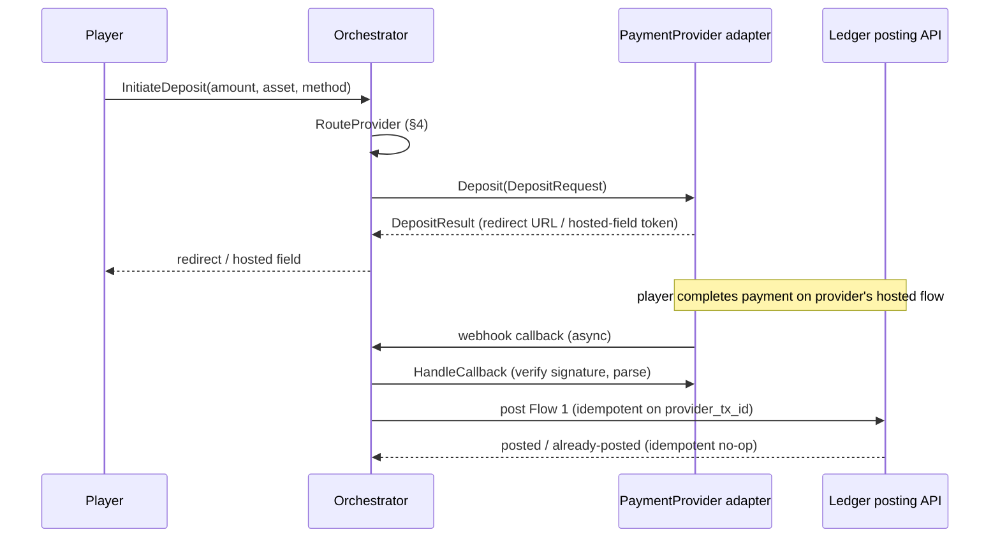

# Payment Orchestration Architecture

Status: `PARTIALLY IMPLEMENTED` (Stage 3B). The `PaymentProvider`
interface, the deposit-direction orchestrator (`InitiateDeposit`,
`RouteProvider`, `ReceiveCallback`, cascade and ambiguous-outcome
handling), the `ProviderCapability` model (migration `0024`), and
`deposit_intents` (migration `0025`) are implemented in `internal/payments`
against a **`MOCK` PSP adapter only** — no real PSP is integrated and no
production provider credential storage exists. Withdrawal-direction
orchestration, `ListSettledTransactions` (§9), and PSP reconciliation
(§9, `reconciliation-model.md`) remain `NOT IMPLEMENTED`; see §3 and §6
for the specific shapes that changed between design and implementation.
Owner: `payments`, with `ledger-finance` on anything that posts to the
ledger.

## 1. Scope

Design only: no real PSP is integrated in this stage, and Stage 3B
implements against a mock PSP adapter. This document fixes the
`PaymentProvider`/`PaymentOrchestrator` shape, routing dimensions, and
callback contract so Stage 3B can implement against it without redesigning
mid-flight.

## 2. `PaymentProvider` interface — `ARCHITECTURAL DECISION`

```
PaymentProvider (per-adapter implementation)
  Deposit(ctx, DepositRequest) (DepositResult, error)
  Withdraw(ctx, WithdrawRequest) (WithdrawResult, error)
  QueryStatus(ctx, provider_tx_id) (StatusResult, error)
  HandleCallback(ctx, rawPayload) (CallbackEvent, error)   -- verifies signature, parses provider-specific shape into a canonical CallbackEvent
  Capabilities() ProviderCapability                         -- adapter-declared layer only (no tenant/brand/priority/status,
                                                            --   which are tenant-config data): docs/decisions/0022 §2
  HealthStatus(ctx) (ProviderHealth, error)
```

No PSP SDK or vendor-specific type ever appears above this interface —
unchanged from `07-payments-architecture.md`. Each adapter is a
`PaymentProvider` implementation; the mock PSP used in Stage 3B
implementation is itself just another `PaymentProvider` implementation
with synthetic success/decline/timeout behavior, not a special code path,
and must pass the same provider-conformance suite every real adapter
does (`docs/decisions/0022` §6). **This interface, and every routing
decision built on it, must remain payment-provider-agnostic**: the
business owner has stated multi-provider fiat and crypto integration as a
core commercial requirement (`docs/decisions/0022`), so nothing below may
assume a single provider, a fixed provider list, or a fixed set of
currencies/methods — every provider-specific fact is data
(`ProviderCapability`, `docs/decisions/0022` §2), never a code branch.

## 3. `PaymentOrchestrator` — `ARCHITECTURAL DECISION`

All scoping arguments below (`tenant_id`, `brand_id`, `player_account_id`,
`wallet_id`) are **server-derived from the authenticated context** and are
written out only to keep the signature self-contained. They are never
populated from request fields: a handler passes the tenant and player
resolved from the caller's own verified session, and the wallet is looked
up from `(player_account_id, asset_code)` rather than accepted as an id
from the client. Stage 3B should prefer carrying them in a
server-constructed scope struct, precisely so that a future caller cannot
pass a client-supplied value positionally without it being obvious in
review.

```
PaymentOrchestrator
  InitiateDeposit(ctx, tenant_id, brand_id, player_account_id, wallet_id, amount, asset_code, method) (DepositIntent, error)
  RouteProvider(RoutingRequest) (PaymentProvider, error)
  ReceiveCallback(ctx, tenant_id, provider_id, InboundCallback) error  -- verifies the tenant-bound credential/signature (docs/decisions/0022 §3 as amended), then dispatches to the adapter's HandleCallback and ledger-finance's posting API
                                                            -- tenant/player/wallet are resolved OUTSIDE the payload — never from identifiers in the body, and the route tenant is only a lookup hint until the credential verifies
```

**No `InitiateWithdrawalRequest` orchestrator method was built** (Stage 3B
correction to this sketch). Withdrawal submission is instead a narrower,
staff-triggered HTTP handler
(`internal/httpserver/withdrawal_handlers.go`, `newSubmitWithdrawalHandler`)
that calls `RouteProvider` and then `PaymentProvider.Withdraw` directly on
the withdrawal state machine's `approved` -> `submitted` transition — no
shared orchestrator method, no cascade across providers, and no
`WithdrawalIntent` table (`withdrawal-state-machine.md` §2). That call is
still distinct from `CryptoCustodyProvider.InitiateWithdrawal`
(`crypto-custody-boundary.md` §2), which is out of scope entirely this
stage.

**`ReceiveCallback`'s implemented signature** is now (Stage 10.1,
PAY-WH-TENANT-1, ADR 0090; `docs/decisions/0022` §3 as amended
2026-09-26) `ReceiveCallback(ctx, tx, tenant_id, provider_id,
InboundCallback)`, where `InboundCallback{TenantID, ProviderID, Header,
Body}` carries the raw request headers and body — it takes an
already-tenant-scoped `pgx.Tx` like every other DB-touching function in
this codebase. The tenant is resolved by the HTTP layer from a **per-tenant
URL path slug** (`POST /v1/webhooks/payments/{tenantSlug}/{providerID}`),
which `docs/decisions/0022` §3 (as amended) confirms is only a lookup
hint — a payload field never asserts the tenant.

**Verification order**, strictly before any ledger/intent/wallet read,
lock, write, tombstone, or audit row:

1. the adapter must be registered for `provider_id` (`ReasonProviderUnregistered`);
2. the provider must be configured for this tenant to accept webhooks —
   `payments.ProviderAcceptsWebhook`, a read-only `EXISTS`
   (`ReasonProviderNotConfigured`) — a `'disabled'` capability row still
   counts, since disabling is a routing decision, not a callback-acceptance
   revocation (a compromised provider is revoked by removing its
   credential from the resolver instead);
3. resolve the single candidate credential for `(tenant_id, provider_id,
   key_id)` via the injected `WebhookCredentialResolver`, then re-check
   `cred.TenantID`/`cred.ProviderID` equal what was just resolved for — a
   mismatch, or a nil resolver, fails closed (`ReasonNoResolver` /
   `ReasonCredentialUnavailable`), never falling back to unauthenticated
   verification;
4. key-material scan, then HMAC verification, both inside the adapter's
   own `HandleCallback(ctx, InboundCallback, WebhookCredential)` — the
   platform-defined (MOCK) signing input is
   `"igaming.payments.webhook.v1" \0 tenant_id \0 provider_id \0 key_id \0
   <raw body bytes>`, so the tenant is bound into what is verified, not
   merely which key was used.

Every failure above returns `payments.ErrCallbackAuthFailed` (a
`*CallbackAuthError` carrying a closed, allow-listed reason) — the HTTP
layer maps EVERY reason to the identical 401 `"callback rejected"`
response, so an unauthenticated caller can never distinguish which is
true. There is still no stored "verified callback credential" TABLE this
stage — `payments.MockWebhookCredentials` derives every tenant's key from
one process-local master via HMAC (`MOCK`, labelled as such); the real
per-tenant credential store (a FORCE-RLS handle table plus a secret store)
is `NOT IMPLEMENTED`, and S-6 (a callback signed for tenant A verifying for
tenant B) is closed for the MOCK only and remains launch-blocking for any
real PSP until that store exists.

The orchestrator never posts ledger entries itself — it resolves *which
provider* handles a request and translates provider callbacks into calls
against the ledger's posting API (`financial-transaction-flows.md`
Flows 1/3 — the flow catalogue lives there, not in
`ledger-accounting-model.md`),
keeping the "every service that moves money must go through the wallet
service's API" rule from ADR 0001 intact. The orchestrator owns
routing/retry/health; `ledger-finance`'s posting API owns idempotent
posting.

## 4. Routing dimensions — `BLUEPRINT` (dimensions) + `ARCHITECTURAL DECISION` (resolution order)

Routing must be capable of considering all of: brand, country, currency/asset, payment method, amount, and provider
health. Proposed resolution order (first full match wins, evaluated in
this order because each earlier dimension is a harder constraint than the
next):

1. **Tenant/brand** — which providers this tenant/brand has active
   commercial relationships with (a provider not configured for this
   tenant is never considered, regardless of any other dimension).
2. **Jurisdiction/country** — the player's registered jurisdiction, per
   `docs/decisions/0006` and `tenant_jurisdiction_configs` (Stage 1) —
   drops providers not licensed/permitted to serve that country.
3. **Currency/asset** — drops providers whose `Capabilities()` don't cover
   the wallet's `asset_code`.
4. **Payment method** — the player-selected or method-filtered set (card,
   bank transfer, e-wallet, crypto rail).
5. **Amount** — drops providers whose configured min/max doesn't cover the
   requested amount.
6. **Provider health** — among the remaining candidates, ranked by a
   rolling success-rate/latency score (see §6); the orchestrator picks the
   healthiest, falling to the next on decline (cascade, §5).

Configuration for dimensions 1–4 lives in per-tenant provider
configuration rows (consistent with CLAUDE.md's "nothing brand-specific
may become a code path" — routing rules are configuration, not `if`
statements keyed on tenant/brand identity). Concretely, this means every
candidate considered here is a `ProviderCapability` row
(`docs/decisions/0022` §2) scoped by `(tenant_id, brand_id)`: **different
brands under different or the same tenant may route the identical
currency/asset to different providers simultaneously** — e.g. Brand A
routes EUR to Provider A while Brand B routes EUR to Provider D, both
live at once — and adding a provider that only one brand uses never
touches another brand's configuration or the orchestrator's code
(`docs/decisions/0022` §3, §5).

`OPEN DECISION`: this routing order is written for deposits and is applied
to withdrawals as-is, but a common gambling-AML control is "return to
source" — requiring a withdrawal (up to the amount deposited) to route
back to the same instrument/provider used for the matching deposit, ahead
of health-based provider selection. Whether such a constraint is required
in any of this platform's target jurisdictions, and if so where it sits in
this resolution order, is a compliance/legal determination this document
does not make; `identity-compliance`/legal must confirm before Stage 3B
implements withdrawal routing, since if required it would need to be
inserted as a dimension above (or instead of) provider health.

## 5. Cascade-on-decline — `BLUEPRINT`

If the chosen provider declines (not "fails" — a hard decline, e.g. issuer
rejection) and the decline reason is provider-specific rather than
player-specific (e.g. not "insufficient funds," which no other provider
would resolve either), the orchestrator retries against the next-ranked
candidate from §4 step 6's ordering, up to a configurable cascade depth.
No cascade attempt is a ledger transaction — no ledger row exists until one
attempt actually succeeds, per `financial-transaction-flows.md` Flow 1's
"no `LedgerTransaction` for a declined attempt". As implemented (Stage 3B
correction to this section's original "a distinct `DepositIntent` attempt
row" wording): a cascade reuses **one** `deposit_intents` row for the whole
chain, overwriting `provider_id`/`provider_reference` on each attempt, and
the per-attempt **audit records** (`deposit.attempt_declined` and
friends) are the attempt history. A consequence worth knowing: because the
row keeps only the latest attempted provider, a cascade continued from an
asynchronously-arriving callback can exclude only the most recently tried
provider, not every provider tried across the intent's lifetime (a
per-attempt history table is the follow-up if that is ever needed).

`OPEN DECISION`: the exact taxonomy of "retriable-elsewhere" vs.
"player-specific, no cascade" decline reasons is provider-specific and not
specified by the Blueprint; Stage 3B must define this taxonomy per
adapter, not assume every decline cascades.

**Ambiguous-outcome handling — `ARCHITECTURAL DECISION`, clarified**: the
distinction drawn above is deliberately "decline" (a definite negative
response from the provider) vs. "fails" (timeout, no callback, ambiguous
network/5xx outcome) precisely because cascading on an *ambiguous* outcome
is a duplicate-payment risk, not just a UX inconvenience — if provider A's
payment actually succeeded but its confirmation was merely delayed, and
the orchestrator cascades to provider B on the assumption A failed, a
player can be charged twice with two separate `DepositIntent`s each
capable of independently reaching a posted `LedgerTransaction` (the
ledger's per-provider `(provider_id, provider_tx_id)` uniqueness does
**not** catch this, since the two attempts have different provider
references entirely — this is a distinct risk from duplicate-callback
idempotency, §8). The orchestrator must not cascade on an ambiguous/
timeout outcome; it must call the provider's `QueryStatus` to resolve the
ambiguity first (polled with backoff, per Stage 3B's retry policy) and
only cascade once that provider has returned a definite decline. If
`QueryStatus` itself cannot resolve the ambiguity within a bounded window,
the attempt is left open (not cascaded, not failed) pending manual/
reconciliation resolution — an `OPEN DECISION` for Stage 3B is the exact
bound on that window, not fixed here.

## 6. Provider health — `ARCHITECTURAL DECISION`

```
ProviderHealth
  provider_id
  rolling_success_rate   -- last N minutes, configurable window
  rolling_latency_p99
  circuit_state           -- 'closed' | 'open' | 'half_open'
  last_updated
```

**This is not a stored table.** As implemented, `ProviderHealth` is the
return value of an in-memory `PaymentProvider.HealthStatus(ctx)` call the
orchestrator makes per routing decision — no `provider_health` table,
migration, or persisted rolling window exists (Stage 3B correction; a
durable, cross-instance health store is a future consideration, not
something built here).

A provider whose `circuit_state = 'open'` is excluded from routing
entirely (not just deprioritized) until health checks and/or a cooldown
period return it to `half_open`. This is standard circuit-breaker
behavior, not itself a financial-correctness mechanism — it exists so a
degraded provider doesn't keep absorbing traffic, not to prevent
double-posting (that's idempotency's job, §8).

## 7. Deposit flow through the orchestrator



## 8. Idempotency and retries at the orchestration layer

The orchestrator's own idempotency (retrying `InitiateDeposit` from a
flaky client, or a provider redelivering the same webhook) is layered on
top of, not a replacement for, the ledger's own `(provider_id,
provider_tx_id)` constraint (`ledger-accounting-model.md` §3):

- A client-side retried `InitiateDeposit` call is deduplicated by a
  client-supplied or session-derived `idempotency_key` at the orchestrator
  level, returning the same `DepositIntent` rather than creating a second
  one with the provider.
- A provider-redelivered webhook is deduplicated by the adapter recognizing
  the same `provider_tx_id` it already forwarded — but even if the adapter
  forwards it twice, the ledger's own unique constraint is the actual
  backstop (defense in depth, not "the orchestrator promises exactly-once
  so the ledger doesn't need to check").

## 9. Reconciliation hook

The orchestrator exposes a `ListSettledTransactions(ctx, provider_id,
period)` call per adapter, used by `reconciliation-model.md`'s PSP
reconciliation job — the orchestrator does not itself reconcile; it is the
data source the reconciliation job pulls from and diffs against the
ledger's `psp_clearing` activity for the same period.

## 10. Security/RLS

`PaymentProvider` credentials (API keys, webhook signing secrets) are
per-tenant configuration, never hardcoded, never logged. The platform's
posture is already fixed by `docs/security/security-architecture.md`
§"Secrets" (Vault or a cloud KMS; provider HMAC keys rotate; PSP
credentials are per-tenant; no secret in a committed config file, an
environment variable dumped to logs, or an API response) — this document
does not re-litigate it. Four constraints follow specifically from these
credentials being *per-tenant configuration* and are binding on Stage 3B
(Stage 3A `security` review):

- A provider-configuration **row stores a secret reference/handle, never
  secret material**. CLAUDE.md makes provider credentials partner-console-
  editable configuration; if the material itself lived in Postgres it would
  also be in every backup, every `pg_dump`, and — per
  `03-database-architecture.md` — in the **CDC stream feeding ClickHouse**,
  putting live PSP credentials in the analytics store. Provider-
  configuration tables are therefore explicitly excluded from CDC capture.
- Writing or rotating a credential is an audited administrative action, but
  the audit record's before/after state stores only the handle and a
  fingerprint, **never** the secret value. CLAUDE.md's audit requirement
  ("before/after state") must not become a secret-exfiltration path into an
  append-only store that by design cannot be redacted afterwards.
- Webhook signature verification happens inside `HandleCallback` **before**
  any payload field is used to resolve tenant, player, or wallet. An
  unverified payload never reaches the ledger posting API. Per
  `docs/decisions/0022` §3 as amended 2026-09-26 (PAY-WH-TENANT-1): the
  route (a per-tenant URL slug) is a lookup hint ONLY, never the source of
  authorization; the tenant is established by verifying a signature whose
  input includes the route-resolved tenant_id, and a payload field never
  asserts the tenant. Exactly one credential is tried — never a trial
  across tenants — and every write after verification uses that same
  tenant id as both the RLS context and the binding. A callback must never
  be able to name the tenant it credits.
- Rotation is per-tenant and supports an overlap window (old and new
  signing key both accepted) so rotating one tenant's PSP key cannot drop
  another tenant's in-flight callbacks. `OPEN DECISION`: rotation cadence
  and overlap-window length per provider — a `devops`/contract decision,
  not fixed here.

Orchestrator-level state (as built: `deposit_intents` and
`withdrawal_requests` — there is no `WithdrawalIntent` table, and provider
health is not stored at all, see §3 and §6 — plus provider configuration,
including the
`provider_capabilities` / routing-priority rows of `docs/decisions/0022`
§2, which are per-`(tenant_id, brand_id)` and therefore leak another
tenant's provider set, limits and priorities if their policy is missed) is
tenant-scoped and RLS-protected identically to every other tenant-owned
table: `tenant_id NOT NULL` under `FORCE ROW LEVEL SECURITY`, and each of
these tables is named in ADR 0019's enumerated table list so none is
missed at migration time. None of them is platform-global, so none gets a
dual-scope (ADR 0013) `tenant_id IS NULL` policy.
Exact columns are deferred to Stage 3B migration design; the
`tenant_id`-plus-`FORCE`-RLS requirement is not deferred.

The orchestrator-level idempotency key of §8 is client-supplied or
session-derived, so it is namespaced server-side and unique per
`(tenant_id, player_account_id, key)` — never placed in a globally unique
column. A guessed key in a shared namespace would let one caller deny
another's deposit, and under RLS the resulting unique violation against an
invisible row is a cross-tenant existence oracle.

## 11. Provider independence and agnosticism — `docs/decisions/0022`

The full `ProviderCapability` model, the multi-tenant/brand routing
requirement, the Crypto-Payment-Provider-vs-Crypto-Custodian distinction,
the provider-addition checklist, and the provider-agnosticism test
obligations Stage 3B must satisfy are specified once, canonically, in
`docs/decisions/0022-payment-provider-agnosticism-and-capability-model.md`
— not duplicated here. In short: adding a payment provider (fiat or
crypto) is an adapter + a capability declaration + routing configuration
+ that adapter's own tests, and must never require changing `Wallet`,
the ledger, the balance projection, any Mandatory Financial Invariant, or
`financial-transaction-flows.md`.

## Cross-references

- Ledger posting this orchestrator calls into: `financial-transaction-flows.md`
  Flows 1–4, `ledger-accounting-model.md`.
- Withdrawal-specific workflow (approval, four-eyes): `withdrawal-state-machine.md`.
- Crypto rail specifics, and the Crypto Payment Provider vs. Crypto
  Custodian distinction: `crypto-custody-boundary.md`,
  `docs/decisions/0022` §4.
- Provider capability model, multi-tenant routing, provider independence,
  test obligations: `docs/decisions/0022-payment-provider-agnosticism-and-capability-model.md`.
- Reconciliation: `reconciliation-model.md`.
- Existing orchestration/custody principles this document extends:
  `07-payments-architecture.md`.
