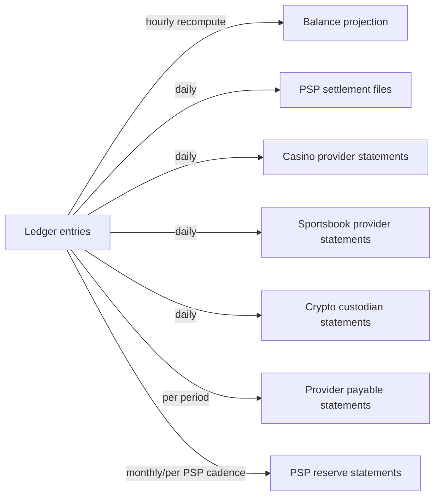

# Reconciliation Model

Status: Stage 3A (Financial Architecture Freeze) — architecture only,
`NOT IMPLEMENTED`. Source: Blueprint §4.2 (hourly reconciliation, zero
drift is P1), §6 (NFR table: reconciliation drift target = 0), extending
`ledger-accounting-model.md` §5 and `06-wallet-ledger-architecture.md`.
Owner: `ledger-finance`.

## 1. Principle — `BLUEPRINT`

No financial tolerance is introduced where the Blueprint expects drift to
be zero (Blueprint §6 NFR: reconciliation drift target = 0). Every
reconciliation stream below targets **exact** equality, not a
tolerance band, unless a specific stream is explicitly marked otherwise
with its own justification.

## 2. Reconciliation streams



### 2.1 Ledger ↔ wallet balance projection — `BLUEPRINT` ("hourly" target)

- **Reconciliation key**: `(wallet_id, account_type, asset_code)`.
- **Expected state**: materialized projection value = `SELECT SUM(...)
  FROM ledger_entries` for the same key (`ledger-accounting-model.md` §5).
- **Mismatch state**: any non-zero difference.
- **Tolerance**: **zero** — this is the Blueprint's own explicit example
  of a P1-triggering drift.
- **Investigation workflow**: an automated job (Stage 3B) runs the
  recompute every hour, writes a `ReconciliationRun` result row per key
  checked, and any non-zero row pages the on-call/`ledger-finance` owner
  immediately — not batched into a daily report.
- **Correction mechanism**: **the projection is rebuilt from the ledger,
  never the reverse.** A drift is definitionally a bug in the projection
  maintenance path (a missed event, a double-applied one, a race), never
  evidence the ledger itself needs correcting — the ledger's own internal
  consistency is checked separately (§4).

### 2.2 Wallet ↔ PSP — `BLUEPRINT`

- **Reconciliation key**: `(provider_id, provider_tx_id)`, joined against
  the PSP's own settlement file/API for the same period.
- **Expected state**: every `psp_clearing`-touching `LedgerTransaction` in
  the period has exactly one matching PSP settlement record, and vice
  versa.
- **Mismatch states**: (a) ledger has a transaction the PSP file doesn't
  show (possible fraud/integrity issue — escalate immediately, do not
  auto-resolve); (b) PSP file shows a settlement the ledger never posted
  (a missed/lost webhook — the reconciliation job itself becomes the
  trigger to post the missing transaction, going through the *same*
  idempotent posting path a live webhook would, not a special "backfill"
  code path, so invariants #1–#4 still apply uniformly).
- **Tolerance**: zero count mismatch; a monetary rounding tolerance may
  exist **only** if a specific PSP's settlement file is contractually
  known to round differently (e.g. FX-converted settlement) — `OPEN
  DECISION`, resolved per PSP contract, not assumed here for any PSP.

  **Authenticity requirement (Stage 3A `security` review):** this path can
  *mint player credits*, so the settlement data it acts on must be
  retrieved by the `PaymentProvider` adapter over an authenticated channel
  using that tenant's own PSP credentials (`payment-orchestration.md` §9's
  `ListSettledTransactions`), and the posting runs under a service identity
  (ADR 0014) with the tenant resolved from the credential used — never from
  a tenant identifier inside the file. `OPEN DECISION` (operations/policy):
  if operators are ever allowed to *upload* a settlement file manually for
  a PSP with no API, that upload must be a privileged, four-eyes-gated,
  reason-coded, fully audited action, because it is otherwise an
  unreviewed path to arbitrary credits. This document does not grant that
  capability; Stage 3B must not add it without an explicit decision.

### 2.3 Wallet ↔ casino provider — `BLUEPRINT`

- **Reconciliation key**: `(provider_id, provider_tx_id)` for bet/win/
  rollback transactions, joined against the provider's own settlement/
  GGR report for the period.
- **Expected state**: sum of `house_gaming` net movement for that provider/
  period matches the provider's reported GGR for the same period.
- **Mismatch state**: any non-zero difference — investigated transaction-
  by-transaction using the `(provider_id, provider_tx_id)` key, same
  missed-event-vs-integrity-issue triage as §2.2.

### 2.4 Wallet ↔ sportsbook provider — `BLUEPRINT`

- Same shape as §2.3, additionally reconciling **open liability**: the sum
  of `player_locked` balances for that provider must match the provider's
  own reported open-bets-outstanding figure at the same point in time
  (Blueprint's sportsbook open-liability reporting requirement, per
  `09-sportsbook-architecture.md`) — this is a snapshot comparison, not a
  period-sum comparison, since open bets are a point-in-time state.

### 2.5 Provider payable reconciliation — `BLUEPRINT`

- **Reconciliation key**: `(provider_id, settlement_period)`.
- **Expected state**: `provider_payable` balance for that provider/period
  matches the provider's invoice/statement.
- **Correction mechanism**: a discrepancy here is a commercial dispute
  process (contacting the provider), not a unilateral ledger correction —
  if the platform's own figure is confirmed wrong, correct via a
  compensating entry (never edit the original); if the provider's figure
  is wrong, the resolution happens outside the ledger (contract/invoice
  dispute) and the ledger is not touched until a resolution is confirmed.

### 2.6 PSP clearing reconciliation — `BLUEPRINT`

- **Reconciliation key**: PSP's own batch/settlement reference (Flow 18).
- **Expected state**: `psp_clearing`'s net balance drains to (approximately)
  zero once every deposit/withdrawal in a batch has both its `psp_clearing`
  leg and its externally-settled leg accounted for; a persistently non-zero
  `psp_clearing` balance beyond the PSP's normal settlement lag is a signal
  of unreconciled transactions, not a target state.

### 2.7 PSP reserve reconciliation — `BLUEPRINT`

- **Reconciliation key**: PSP's own reserve statement (monthly or the
  PSP's own cadence, per §"Reserve accounting" in
  `07-payments-architecture.md`).
- **Expected state**: `psp_reserve` balance matches the PSP-reported held
  reserve at the same point in time, with a defined release schedule
  tracked so an expected release that doesn't land in the PSP statement is
  itself flagged.

### 2.8 Crypto custodian reconciliation — `BLUEPRINT`

- **Reconciliation key**: on-chain tx hash / custodian reference
  (`crypto-custody-boundary.md` §4).
- **Expected state**: confirmed on-chain deposits/withdrawals the
  custodian reports match the ledger's `LedgerTransaction`s for the same
  wallet/asset/period, exactly.
- **Special case**: confirmation-threshold timing means a deposit can be
  "on-chain but not yet platform-confirmed" — this is not a mismatch, it's
  an expected in-flight state (§4 of `crypto-custody-boundary.md`); the
  reconciliation job's window accounts for the per-asset confirmation
  delay rather than flagging every recent deposit as a false mismatch.

## 3. Balance projections — materialization and rebuild

- **Current balance** = `SELECT SUM(...)` over all `player_cash` entries
  for a wallet (§5 of `ledger-accounting-model.md`).
- **Available balance** = the `player_cash` balance itself. It is **not**
  `player_cash` minus `player_withdrawal_hold`: Flow 3 Step A already
  *debits* `player_cash` when the hold is placed
  (`financial-transaction-flows.md` §3), so the held amount has already
  left `player_cash`. Subtracting the hold a second time would understate
  every withdrawing player's spendable balance by the held amount and
  wrongly decline their bets. Neither value is a separately-tracked field;
  both are reads over ledger-derived account balances.
- **Locked balance** = current `player_locked` balance (open sportsbook
  stakes).
- **Bonus balance** = current `player_bonus` balance.
- **Materialization**: for read performance, a `wallet_balance_projection`
  table (one row per `ledger_account_id`, carrying `tenant_id NOT NULL`,
  `asset_code`, and a `wallet_id` that is NULL for house-level accounts,
  per ADR 0019 — keyed on the account rather than on
  `(wallet_id, account_type)` so that house-level accounts, which
  `ledger-accounting-model.md` §2 also requires be reconciled, have a row
  at all; for player-owned accounts the asset is single-valued per wallet,
  so this row is the same one §2.1's `(wallet_id, account_type,
  asset_code)` key identifies) is updated
  transactionally alongside every `LedgerEntry` insert that touches it
  (same database transaction — never a separate async step that could
  drift before the hourly reconcile catches it). This keeps the
  projection "subordinate" per CLAUDE.md/ADR 0001: it's an optimization
  applied in lockstep with the source of truth, not an independently
  computed cache.
- **Rebuild/recovery**: because the projection update happens in the same
  transaction as the entry insert, the projection can never diverge except
  through a bug — but the rebuild procedure (drop and recompute
  `wallet_balance_projection` entirely from `ledger_entries`) must still
  exist and be exercised (Stage 3B: a documented, tested runbook and/or
  CLI command) so recovery from a hypothetical corruption doesn't require
  inventing the procedure under incident pressure.

## 4. Ledger internal-consistency check (separate from projection reconciliation)

In addition to ledger↔projection (§2.1), a second check verifies the
ledger's *own* internal balance: `SUM(debit) = SUM(credit)` per
`(ledger_transaction_id, asset_code)`, across every transaction, on the
same hourly cadence. This should be structurally impossible to violate if
invariant #1 is enforced at write time (a DB constraint/trigger, per
`docs/decisions/0019`) — this check exists as a defense-in-depth
verification that the constraint itself hasn't been bypassed or disabled,
not as the primary enforcement mechanism.

## 5. Investigation and correction workflow — `ARCHITECTURAL DECISION`

```
ReconciliationRun
  id, tenant_id (NOT NULL), stream (per §2's numbered streams), period, run_at
  status            -- 'clean' | 'mismatches_found'
ReconciliationMismatch
  id, tenant_id (NOT NULL), reconciliation_run_id
  reconciliation_key  -- e.g. the (provider_id, provider_tx_id) or wallet_id
  expected_value, actual_value
  investigation_status -- 'open' | 'investigating' | 'resolved'
  resolution_note, resolved_by, resolved_at
  correction_ledger_transaction_id  UUID NULL  -- if resolved via a compensating entry
```

`investigation_status`, `resolution_note`, `resolved_by`, and `resolved_at`
are mutable workflow fields on *this* table only; every change to them
writes an audit record (actor, tenant, entity, before/after, reason) to the
append-only store, and no mutation here ever reaches a ledger row.

Every mismatch is a row, never a log line — auditable, assignable, and
trackable to resolution. A resolution that involves changing the ledger
does so exclusively via a compensating `LedgerTransaction`
(`reverses_transaction_id` or a fresh corrective posting, per invariant
#10) — `ReconciliationMismatch` rows are never themselves a mechanism for
mutating historical data, only for tracking that an investigation happened
and what it concluded.

## 6. Security/RLS

`ReconciliationRun`/`ReconciliationMismatch` are **always** tenant-scoped:
`tenant_id NOT NULL` with `FORCE ROW LEVEL SECURITY`, like every other
table in the Stage 3A model (ADR 0019 — "no ledger table is
platform-scoped"). This is not conditional on the stream: every stream in
§2 belongs to exactly one tenant, because every account type in
`ledger-accounting-model.md` §2 is tenant- or tenant+brand+player-scoped,
and provider/PSP credentials are themselves per tenant
(`payment-orchestration.md` §10). A reconciliation run that spanned tenants
would have no valid `tenant_id` and is therefore not a supported shape —
one run per tenant per stream per period instead. Cross-tenant
reconciliation reporting (e.g. platform-wide drift dashboards) is a
platform-admin read path **through the reporting layer** (ADR 0019,
`12-audit-reporting-architecture.md`), using the existing Stage 2
platform-admin authorization model — never relaxed RLS on these operational
tables, and not a new primitive.

## Cross-references

- Balance-is-a-projection principle: `ledger-accounting-model.md` §5.
- Flows each stream reconciles: `financial-transaction-flows.md`.
- PSP-side data source: `payment-orchestration.md` §9.
- Crypto-side data source: `crypto-custody-boundary.md` §7.
- Withdrawal-hold-specific check: `withdrawal-state-machine.md` §3.
