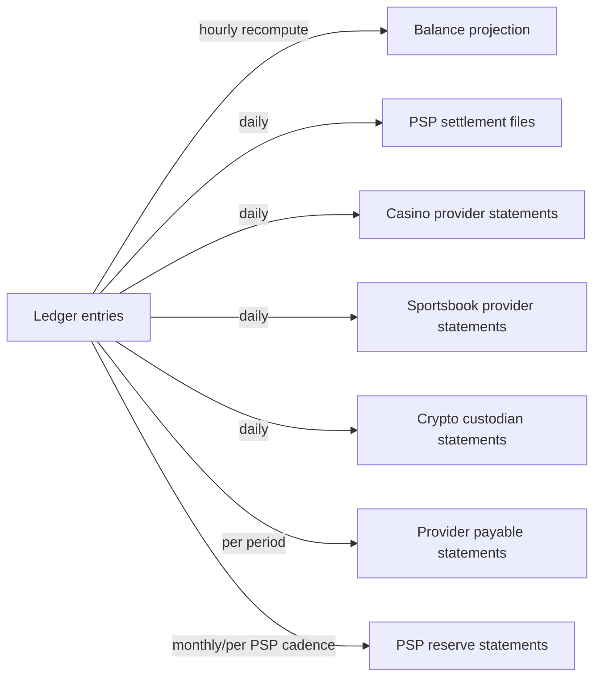

# Reconciliation Model

Status: `PARTIALLY IMPLEMENTED` (Stage 3B core stream; Stage 3C
scheduling). **Only the ledger ↔ balance projection stream (§2.1) is
implemented and tested** (`internal/reconciliation.RunLedgerVsProjection`,
over the `reconciliation_runs` / `reconciliation_mismatches` tables of
migration `0027`, RLS tightened by `0028`, mismatch classification added
by `0031`). Every other stream in §2 — wallet ↔ PSP, wallet ↔ casino,
wallet ↔ sportsbook, provider payable, PSP clearing/reserve, crypto
custodian — is `NOT IMPLEMENTED` and remains architecture only: no real
PSP, casino, sportsbook or custodian relationship exists yet to
reconcile against, so there is no counterparty statement to diff.

**Scheduling is now `IMPLEMENTED` (Stage 3C)**:
`internal/reconciliation.RunSchedulerLoop` (started in
`cmd/platform-api/main.go`) invokes a sweep every
`RECONCILIATION_INTERVAL_SECONDS` (default: hourly, matching §2.1's
design target below) over every active tenant, each isolated in its own
transaction with a transaction-scoped advisory lock
(`internal/reconciliation/scheduler.go`). Every attempt (clean, mismatch
found, lock-skipped, or failed) is recorded to `audit_log`; a mismatch
found is logged at `Error` level, not merely inserted as a row -
CLAUDE.md treats non-zero drift as a P1 incident and the runtime signal
now says so. Known limitations, not yet closed: `reconciliation_runs`'
`period_start`/`period_end` are recorded but do not actually bound the
comparison (every run compares all-time ledger vs. projection totals),
and an unresolved mismatch is re-detected as a new `open` row on every
subsequent sweep with no deduplication against an existing open mismatch
for the same key - see ADR 0023 §4 for the full account. (The open-hold
check `withdrawal-state-machine.md` §3 refers to this document for is
likewise not built.) Source: Blueprint §4.2 (hourly reconciliation, zero
drift is P1), §6 (NFR table: reconciliation drift target = 0), extending
`ledger-accounting-model.md` §5 and `06-wallet-ledger-architecture.md`.
Owner: `ledger-finance`.

## 1. Principle — `BLUEPRINT`

No financial tolerance is introduced where the Blueprint expects drift to
be zero (Blueprint §6 NFR: reconciliation drift target = 0). Every
reconciliation stream below targets **exact** equality, not a
tolerance band, unless a specific stream is explicitly marked otherwise
with its own justification.

## 2. Reconciliation streams



### 2.1 Ledger ↔ wallet balance projection — `BLUEPRINT` ("hourly" target)

- **Reconciliation key**: `(wallet_id, account_type, asset_code)`.
- **Expected state**: materialized projection value = `SELECT SUM(...)
  FROM ledger_entries` for the same key (`ledger-accounting-model.md` §5).
- **Mismatch state**: any non-zero difference.
- **Tolerance**: **zero** — this is the Blueprint's own explicit example
  of a P1-triggering drift.
- **Investigation workflow**: an automated job (Stage 3B) runs the
  recompute every hour, writes a `ReconciliationRun` result row per key
  checked, and any non-zero row pages the on-call/`ledger-finance` owner
  immediately — not batched into a daily report.
- **Correction mechanism**: **the projection is rebuilt from the ledger,
  never the reverse.** A drift is definitionally a bug in the projection
  maintenance path (a missed event, a double-applied one, a race), never
  evidence the ledger itself needs correcting — the ledger's own internal
  consistency is checked separately (§4).

### 2.2 Wallet ↔ PSP — `BLUEPRINT`

- **Reconciliation key**: `(provider_id, provider_tx_id)`, joined against
  the PSP's own settlement file/API for the same period.
- **Expected state**: every `psp_clearing`-touching `LedgerTransaction` in
  the period has exactly one matching PSP settlement record, and vice
  versa.
- **Mismatch states**: (a) ledger has a transaction the PSP file doesn't
  show (possible fraud/integrity issue — escalate immediately, do not
  auto-resolve); (b) PSP file shows a settlement the ledger never posted
  (a missed/lost webhook). The reconciliation job **flags** it; the
  posting happens only through fresh provider evidence (`QueryStatus`)
  applied by the payments state machine. *(Amended 2026-09-27 by
  `ledger-finance` per ADR 0095 §12.6 and LF-Q3 (§21.4); see "Amendment
  (ADR 0095)" below. Original text, preserved: "~~the reconciliation job
  itself becomes the trigger to post the missing transaction, going
  through the *same* idempotent posting path a live webhook would, not a
  special "backfill" code path, so invariants #1–#4 still apply
  uniformly~~".)*
- **Tolerance**: zero count mismatch; a monetary rounding tolerance may
  exist **only** if a specific PSP's settlement file is contractually
  known to round differently (e.g. FX-converted settlement) — `OPEN
  DECISION`, resolved per PSP contract, not assumed here for any PSP.

  **Authenticity requirement (Stage 3A `security` review):** this path can
  *mint player credits*, so the settlement data it acts on must be
  retrieved by the `PaymentProvider` adapter over an authenticated channel
  using that tenant's own PSP credentials (`payment-orchestration.md` §9's
  `ListSettledTransactions`), and the posting runs under a service identity
  (ADR 0014) with the tenant resolved from the credential used — never from
  a tenant identifier inside the file. `OPEN DECISION` (operations/policy):
  if operators are ever allowed to *upload* a settlement file manually for
  a PSP with no API, that upload must be a privileged, four-eyes-gated,
  reason-coded, fully audited action, because it is otherwise an
  unreviewed path to arbitrary credits. This document does not grant that
  capability; Stage 3B must not add it without an explicit decision.

  *(Note, 2026-09-27, ADR 0095: after the (b) amendment below, the
  reconciliation stream no longer mints credits at all, so this
  requirement now applies to the statement fetch (it is still provider
  I/O under the tenant's own credential, and still must not take a tenant
  id from the file) and to the separate `payments`-owned re-drive job, not
  to a reconciliation posting path. The manual-upload `OPEN DECISION`
  stands unchanged: an uploaded file would still be detection input only,
  never posting authority.)*

  **Amendment (ADR 0095, 2026-09-27, `ledger-finance`; LF-Q3 / §21.4,
  §12.6; design `ACCEPTED`, stream `NOT IMPLEMENTED` — target PRH-I5,
  `MOCK` source only until a real PSP contract exists).** Binding on the
  `payment_statement` stream (migration 0103):

  1. **Never writes the ledger.** The stream writes exactly one
     `reconciliation_runs` row plus its `reconciliation_mismatches` rows
     (`persistRun`) and nothing else (ADR 0095 INV-IO-12, MX9). No
     `ledger_transactions`, `ledger_entries`, projection, attempt or intent
     write, and no call into `ledger.Post`. A bulk statement line is not
     verified evidence of one payment; posting from it would be the
     unreviewed path to arbitrary credits this section warns about.
  2. **Remediation of (b) is outside the stream.** A `payments`-owned
     re-drive job reads new `pay_status_mismatch` rows and requests T17 on
     the named attempt; T17 calls `QueryStatus`, and only that fresh,
     provider-bound evidence, applied by `applyEvidence`, may post (T7/T13)
     through the normal idempotent path under the `(provider_id,
     provider_tx_id)` unique constraint. An operator may also request T17.
     Any credit not backed by such evidence goes only through
     LEDGER-MANUAL-ADJ-4EYES-1 (`BLOCKED`).
  3. **Fetch outside any transaction.** `Fetch` is provider I/O and runs
     with no tx open (ADR 0095 INV-IO-1), through the provider-call gate,
     with the tenant's own outbound credential, a capped body and a
     per-import line cap (over the cap: refuse, store nothing, P1).
  4. **Append-only statement store.** The fetched statement is ingested in
     a short tx into `payment_statement_imports` and
     `payment_statement_lines`, both append-only by trigger, idempotent on
     `(tenant, provider, source_label, coverage_start, coverage_end,
     content_digest)`. Matching reads only the stored copy, never the live
     provider.
  5. **Match under REPEATABLE READ.** The match tx runs under
     `WithTenantSnapshot` with REPEATABLE READ required and enforced, plus
     the per-tenant transaction-scoped advisory lock used by the other
     streams, so every read (lines, `payment_attempts`, unresolved
     `payment_provider_events`, ledger) sees one snapshot.
  6. **The key is the ledger's `(provider_id, provider_tx_id)`.** Matching
     statement lines against `payment_attempts` alone is not sufficient. In
     the same match tx the stream also joins the ledger, independently of
     the statement:
     - a `deposit` or `withdrawal_completed` ledger transaction in the
       window, carrying a `provider_id`, that maps to no `succeeded`
       attempt (or to more than one) → `pay_missing_platform_record`;
     - a `succeeded` attempt without exactly one ledger transaction whose
       `(provider_id, provider_tx_id)` equals the deposit's
       `provider_reference` or the payout's Step B settlement reference →
       `pay_status_mismatch`.
     A statement line of provider P resolves only records with
     `provider_id = P` (ADR 0095 INV-IO-14). Join paths (ADR 0095 §12.3,
     revision 3, RV-0095 L4): deposit via
     `payment_attempts.ledger_transaction_id`; payout via
     `payment_attempts.withdrawal_request_id →
     withdrawal_requests.release_ledger_transaction_id` (migration 0026)
     with `transaction_type = 'withdrawal_completed'`.
  7. **Classification and tolerance.** Kinds and remediation per ADR 0095
     §12.3/§12.5; amounts compared as integers (`big.Int`), zero
     tolerance (§1); every mismatch is a P1; no auto-resolution of (a).
     Platform records outside the import's coverage window are never
     flagged as missing.

  Gates on `IMPLEMENTED` (not on this amendment): LF95-C13 (ledger join)
  and the §16.3 reconciliation tests, including a statement-capture test
  proving the run writes nothing outside `reconciliation_runs` /
  `reconciliation_mismatches`.

  **Implementation status (PRH-I5, 2026-09-27, `ledger-finance`):
  `IMPLEMENTED` against a `MOCK` source; real PSP statement matching
  `PROVIDER DEPENDENT`; pending gate review.** Stream
  `internal/reconciliation/payment_statement.go`, **migration 0102** (the
  orchestrator swapped 0102/0103; the amendment's "migration 0103" reads as
  0102), source `payments.MockStatementSource` (the MockProvider's own
  per-tenant records, never the platform DB; refused in production). Points
  1–7 above are enforced in code. The LF95-C13 ledger join and the
  statement-capture test are covered by tests (the per-tenant advisory lock
  of point 5 reuses the other streams' pattern and has no dedicated
  contention test for this stream); 28/28 mutations killed
  (`docs/plans/payment-readiness/evidence/prh-i5-mutation-kill.txt`). Point 2's
  automatic re-drive job (LF95-R1) is `NOT IMPLEMENTED` (deferred, owner
  `payments`); remediation today is an operator T17 followed by the
  sweeper's `QueryStatus`, proven end to end. Deviations and residuals:
  ADR 0095 §12.7.

  **Interim exclusion (fix round, ADR 0095 §12.7.1).** Until the payments
  cutover, a `deposit` / `withdrawal_completed` posting linked from an
  intent or withdrawal request that has no `payment_attempts` row at all
  (the live legacy path) is not a point-6 mismatch. It is counted as
  `legacy_unattempted` in every run's audit record. This keeps an
  expected, per-posting P1 flood out of the signal. An unlinked posting, or
  one whose intent or request has attempts, is still a P1. The rule
  retires itself: `legacy_unattempted` must stop growing after the
  cutover. Until then the ledger join is `PARTIALLY IMPLEMENTED` for
  legacy-path postings.

  **Amendment (INV-DEP-1 / PAY-DOUBLE-CREDIT-1, 2026-09-27,
  `ledger-finance`; ADR 0095 §28.9; ruling
  `docs/plans/payment-readiness/lf-q1-supersession.md` §4; design
  `ACCEPTED`, `NOT IMPLEMENTED`; migration 0107 widens the kind CHECK).**

  1. **New kind `pay_captured_unposted`** ("provider captured, platform
     disputed, not posted").
     - Emitted per attempt with `state = 'disputed' AND terminal_reason =
       'multiple_success_for_intent'`, when all of these hold:
       - its statement line (if any) is `succeeded`;
       - there is no `deposit_reversal` line naming its reference;
       - no ledger tombstone holds `(provider_id, provider_reference)`.
     - `matchPayment` stops skipping `disputed` attempts **for this reason
       code only**. Every other disputed attempt stays a `payments` P1, not a
       reconciliation row.
     - `reversal_tombstone_precedes_success` disputes are excluded: the PSP
       reversed that capture, so it nets to zero.
  2. **Ageing.** It is re-reported on every run until it clears. The
     amount and asset go in the mismatch row, never in log lines. It clears
     when a reversal or tombstone appears (the PSP refunded), or on M1 /
     allocation (both `BLOCKED`: HD-0095-1, LEDGER-MANUAL-ADJ-4EYES-1).
  3. **Remediation.** Escalate. Never auto-resolve. **Never** a T17 or
     re-drive trigger: the re-drive job must not select these rows. Even
     if it did, T17 cannot post for a financially resolved intent (ADR 0095
     §28.3 choke point).
  4. **`pay_duplicate` is kept as an integrity detector.** After migration
     0107, point 6's "maps to more than one succeeded attempt" branch and
     `checkPlatformDuplicates` are structurally unreachable for new data.
     Any occurrence is a P1 integrity alert: an index was dropped, or the
     data predates 0107.
  5. **HD-LEDGER-UNALLOC-1: (A) now.** Under (A) the held capture is
     deliberately **absent from the ledger**, and this kind is its only
     standing record. Each open row is an explained, expected difference
     in the §2.6 `psp_clearing` reconciliation. Under (B) later
     (LEDGER-SUSPENSE-B-1), the kind becomes "unallocated receipt still
     open", and point 6's ledger join must include the (B) postings mapped
     to their disputed attempt.

### 2.3 Wallet ↔ casino provider — `BLUEPRINT`

- **Reconciliation key**: `(provider_id, provider_tx_id)` for bet/win/
  rollback transactions, joined against the provider's own settlement/
  GGR report for the period.
- **Expected state**: sum of `house_gaming` net movement for that provider/
  period matches the provider's reported GGR for the same period.
- **Mismatch state**: any non-zero difference — investigated transaction-
  by-transaction using the `(provider_id, provider_tx_id)` key, same
  missed-event-vs-integrity-issue triage as §2.2.

**Stage 10.3 W2b status (CAS-RECON-1, ADR 0092; design:
`docs/plans/stage-10.3-planning/02-casino-financial-analysis.md` §2).**
The platform-internal half of this stream is `IMPLEMENTED` as the
`casino_consistency` stream (`internal/reconciliation/casino_consistency.go`,
migration `0097`), on the existing run/mismatch tables:

- Checks C1 round binding, C2 posting shape, C3 orphan win, C4 rollback
  linkage, C5 tombstone conflict (backstop), C6 provider-asserted event
  the ledger lacks, C7 tombstone later matched by an original. Kinds
  `cas_round_binding_mismatch`, `cas_posting_shape_mismatch`,
  `cas_orphan_win`, `cas_rollback_linkage_mismatch`,
  `cas_tombstone_conflict`, `cas_unposted_provider_event`,
  `cas_tombstone_late_original`. C6/C7 are evidence-type (recorded once
  per key); C1–C5 are state-type (re-detected every run, ADR 0023 §4).
- Input for C6/C7: the append-only, FORCE-RLS, verified-only
  `casino_callback_rejections` record (migration `0097`). A rejection is
  written in the callback's own transaction when the callback commits (E3
  declined bet; E9 second distinct rollback reference), and in a separate
  freshly-opened transaction after the callback's rollback otherwise
  (E10, the G-1 409 classes, bet not found, already rolled back, payload
  mismatch, round ownership conflict) - the PAY-REV-1 separately
  committed denial pattern. Nothing rejected before signature
  verification is ever recorded.
- Run by `RunSweep` after `sportsbook_settlement`, own transaction, own
  advisory lock (`reconciliation:casino_consistency:<tenant>`), every
  attempt audited with metrics, `Error`-level "MISMATCH FOUND" (P1) on
  drift. Detection only; it never corrects and never writes money.
- Ageing cash rounds (loss-by-silence) are a metric in the run audit
  (`unresolved_cash_rounds_older_than_window`, window 24h, reporting
  only), never a mismatch. `cas_locked_unresolved` stays dormant until
  bonus-funded casino stakes ship (the settlement window W is an open
  human decision, 08 §16.5a).
- Deviations from paper 02 §2.4, recorded by its author: C3's
  "win posted after its bet was reversed" order sub-check is
  `NOT IMPLEMENTED` (the ledger has no commit-order evidence; `posted_at`
  is transaction start time, so a zero-tolerance P1 would fire on a
  legitimate interleaving - the guarantee is enforced at write time by the
  L2 lock); C4's exact-inverse comparison covers cash rollbacks only
  (BONUS_SET held-disposition rollbacks are intentionally not inverses);
  no `internal_error` rejection class (a 500 is retryable and is not a
  rejection decision).
- **Gate 10.3-W2/W3 fix round (ledger-finance).**
  - **C4 exemption narrowed.** The exact-inverse comparison is skipped
    only when the **original** touches BONUS_SET (`player_bonus`,
    `player_locked_bonus`, `player_bonus_held`), never because the
    rollback does. A cash bet whose `casino_rollback` credits
    `player_bonus` is a `cas_rollback_linkage_mismatch`.
  - **C2 positive `house_gaming` rules.** A bet with no BONUS_SET leg
    credits `house_gaming` exactly the stake (debits on the player's
    spendable accounts, the same stake definition `casino_statement`
    uses). A win debits `house_gaming` exactly the wallet credit minus the
    lock-release legs (debits on `player_locked_cash`/
    `player_locked_bonus`); for today's cash-only wins that is simply
    "house debit == wallet credit". Recorded deviation: the bet rule does
    not cover BONUS_SET bets, because the bonus-funded casino bet shape is
    not implemented (G-6); it activates with that change, and jackpot
    contributions (G-6) will extend it to "house_gaming +
    jackpot_contribution credits == stake".
  - **C6 class ruling** (paper 02 §2.19). C6 raises
    `cas_unposted_provider_event` only for the classes where a verified
    provider asserted a **settlement of existing exposure** that the
    ledger does not hold: `bet_not_found`, `ambiguous_round`,
    `wallet_collision`, `mixed_funding`, `lock_already_released`,
    `bonus_bet_not_locked`. The other five are correct platform behaviour
    and are **evidence only**: `original_tombstoned` (net zero by design;
    C7 records it), `payload_mismatch` (the ledger holds the posted fact),
    `already_rolled_back` (the ledger holds the one reversal),
    `round_ownership_conflict` (a refused bet, i.e. refused new exposure;
    nothing was owed) and `rollback_of_tombstoned_original` (E9 different
    reference: acknowledged 200, net zero, and a match in
    `casino_statement`). They stay visible in the run audit as
    `rejections_by_class` and `rejections_evidence_only`. An integration
    test pins that the two sets partition migration 0097's `reason_class`
    CHECK and `internal/casino`'s constants, so a new class cannot ship
    without a ruling.
  - **Rejection-record write detached from the request (security R-1).**
    The separate write runs on `context.WithoutCancel` with a 2 s bound,
    so a provider that disconnects no longer erases the evidence. This
    applies to the webhook route and the play-simulation routes (one
    shared helper).
  - **Provider reference length is unbounded** (security R-2):
    registered as PROVIDER-REF-BOUND-1, platform-wide; no migration in
    this round. **Update (PRH-REF, 2026-09-27):** the bound is now
    implemented: 255 bytes, validated at the verified callback boundary,
    plus migration 0099's CHECKs. A casino callback over the bound gets
    no rejection row (its value cannot be stored); the evidence is a log
    line with the length and a hash prefix. See
    `docs/plans/payment-readiness/prh-ref-provider-reference-bound.md`.
- Read-only staff views: `GET /v1/admin/casino/reconciliation/runs`,
  `GET /v1/admin/casino/reconciliation/mismatches`,
  `GET /v1/admin/casino/callback-rejections`
  (`casino_reconciliation:read`: tenant_admin, finance, compliance).
- **Compensation stays a human, four-eyes action. Its mechanism,
  LEDGER-MANUAL-ADJ-4EYES-1 (manual-adjustment API, four-eyes approval,
  mismatch resolution route), is `NOT IMPLEMENTED`** and blocks real-money
  go-live. Until it exists the only corrections are provider redelivery
  or a provider-issued rollback through the normal idempotent callback
  path.
- The counterparty half (matching a provider statement, the GGR totals
  above) is the separate `casino_statement` stream, CAS-RECON-STMT-1
  (W3a, `MOCK` source); real statement matching is `PROVIDER DEPENDENT`.

**Stage 10.3 W3a status (CAS-RECON-STMT-1).** The counterparty half is
`IMPLEMENTED — MOCK source; real statement PROVIDER DEPENDENT; pending
gate 10.3-W3` as the `casino_statement` stream
(`internal/reconciliation/casino_statement.go`, migration `0098`):

- **Contract.** Provider-neutral `statement.CasinoStatementSource`
  (`internal/reconciliation/statement`, the dependency-free leaf):
  `Label()` plus `Statement(ctx, tx, tenant, periodStart, periodEnd)`
  returning lines (`provider_id`, `provider_tx_id`, kind
  bet/win/rollback, original reference for a rollback, round, asset,
  minor-unit amount) and optional per-(provider, asset) GGR totals.
- **Key match** by `(provider_id, provider_tx_id)` against every
  `casino_bet`/`casino_win`/`casino_rollback` carrying a provider
  reference: present on both sides with the same kind, amount, asset,
  round (compared through the ledger correlation id) and, for a rollback,
  original reference. Amounts: a bet's stake (debits on the player's
  spendable accounts), a win's payout (its `house_gaming` debit - a
  recorded deviation from paper 02 §2.5's "player-side leg sum", which
  would include the lock-release legs of a locked win), a rollback's
  original's amount. A duplicate statement line is a finding. A statement
  rollback whose original the ledger holds only as a **casino** tombstone
  is a **match** (the one one-sided pattern that is not a finding). A
  statement line for a reference held only as a tombstone is a finding
  that names the tombstone (the counterparty half of C7).
- **Tombstone pairing, disclosed (gate 10.3-W2/W3 code review #7).**
  - An **unpaired** casino tombstone (no statement rollback names its
    original) is **not** flagged. A tombstone has no entries and moves no
    money, so the totals match is unaffected. The MOCK can never list the
    rollback (the ledger keeps only the original's reference on a
    tombstone), so flagging it would make every MOCK run with a tombstone
    a permanent P1. The money-moving case (the provider still counts the
    original) is flagged, as above.
  - **Many** statement rollbacks naming **one** tombstoned original **all
    match**. This mirrors E9: a second distinct rollback reference for a
    tombstoned original is acknowledged idempotently and is net zero;
    `casino_consistency` counts it as the evidence-only
    `rollback_of_tombstoned_original` metric.
  - A **real** statement source may want to flag both: an unpaired
    tombstone (the provider never reported the rollback the platform acted
    on) and a second rollback line for the same original (a provider-side
    duplicate). That depends on the real statement's semantics for
    rollbacks of unseen rounds (`PROVIDER DEPENDENT`) and is decided with
    the first real source and its own mismatch kind.
    `TestCasinoStatement_TombstonePairingDisclosedBehaviour` pins today's
    behaviour, so any change is deliberate.
- **Totals match**, when the source reports totals: per (provider, asset),
  net `house_gaming` movement (credits - debits) over the casino
  transactions carrying that `provider_id` equals the stated GGR; every
  ledger (provider, asset) needs a stated total; a duplicate or nil total
  is a finding. A source reporting no totals skips this match, and the run
  audit says so (`statement_totals_provided: false`).
- **One kind**, `cas_mock_statement_mismatch` (migration `0098`, additive
  CHECK widening; down refuses once a row exists - roll forward). Every
  row is P1, never auto-corrected; state-type (re-detected every run until
  resolved, ADR 0023 §4). The stream never writes the ledger, a
  projection, a round, a session, a capability or the rejection record.
- **Snapshot.** The statement and the ledger are read in separate
  statements, so the stream **requires** a REPEATABLE READ transaction
  (`db.Pool.WithTenantSnapshot`) and fails closed otherwise; a posting
  committed between the two reads can therefore never become a false P1.
- **Sweep.** Run by `RunSweep` after `casino_consistency`, own
  REPEATABLE READ transaction, own advisory lock
  (`reconciliation:casino_statement:<tenant>`); every attempt audited with
  the source label and statement shape; `Error`-level "MISMATCH FOUND"
  (P1) with the label; a nil or erroring source fails the run closed and
  is audited in a fresh transaction, never recorded as clean.
- **Read-only views**: the W2b runs and mismatches routes take an optional
  `?stream=casino_consistency|casino_statement` filter (absent = both).
- **Honesty of the result.** The only source is
  `casino.MockStatementSource` (`MOCK`; a synthetic component, so the
  production startup guard refuses it; registered in the provider bundle
  as `casino/statement_source`). It renders its lines and totals from the
  **same casino ledger rows** the stream reads, so against it the match is
  **tautological**: a clean run proves the plumbing (stream, sweep, lock,
  audit, evidence rows) and **nothing** about agreement with any provider.
  The one thing it can independently disagree on is the round binding
  (rendered from `casino_provider_rounds`), which C1 already covers. The
  matching logic itself is proven by test-only divergent sources that
  exercise every detection path (`casino_statement_integration_test.go`;
  mutation-kill evidence in
  `docs/plans/stage-10.3-planning/evidence/w3a-mutation-kill.txt`).
- **`PROVIDER DEPENDENT` / `NOT IMPLEMENTED`:** real statement ingestion
  (provider API or file, append-only statement storage, idempotent
  ingest, per-tenant credentials from the secret store), a real mismatch
  kind, and the period **timing** window for provider cut-offs (a key on
  one side only is a finding only if also absent from the adjacent
  period; never an amount tolerance). Today the MOCK is all-time and
  `period_start`/`period_end` are recorded, not used as a filter. Manual
  statement upload stays an `OPEN DECISION` (§2.2). Compensation stays
  LEDGER-MANUAL-ADJ-4EYES-1 (`NOT IMPLEMENTED`).

### 2.4 Wallet ↔ sportsbook provider — `BLUEPRINT`

- Same shape as §2.3, additionally reconciling **open liability**: the sum
  of the locked-funds family's balances for that provider —
  `account_type IN ('player_locked_cash', 'player_locked_bonus')`, **both
  members named explicitly**, migration `0048` having removed the single
  `player_locked` (`ledger-accounting-model.md` §6.5, invariant L1) — must
  match the provider's
  own reported open-bets-outstanding figure at the same point in time
  (Blueprint's sportsbook open-liability reporting requirement, per
  `09-sportsbook-architecture.md`) — this is a snapshot comparison, not a
  period-sum comparison, since open bets are a point-in-time state.
- A query naming only one locked type **silently under-reports** open
  liability rather than failing — the fail-quiet class this model treats
  as unacceptable, and the same defect `ledger-accounting-model.md`
  §6.4.8 item 5 rates P1 against ADR 0038 §6's query. Any future
  locked-family member must be added here in the same change that adds it
  to `ledger_accounts_account_type_check` (invariant L1, layer 4).

### 2.5 Provider payable reconciliation — `BLUEPRINT`

- **Reconciliation key**: `(provider_id, settlement_period)`.
- **Expected state**: `provider_payable` balance for that provider/period
  matches the provider's invoice/statement.
- **Correction mechanism**: a discrepancy here is a commercial dispute
  process (contacting the provider), not a unilateral ledger correction —
  if the platform's own figure is confirmed wrong, correct via a
  compensating entry (never edit the original); if the provider's figure
  is wrong, the resolution happens outside the ledger (contract/invoice
  dispute) and the ledger is not touched until a resolution is confirmed.

### 2.6 PSP clearing reconciliation — `BLUEPRINT`

- **Reconciliation key**: PSP's own batch/settlement reference (Flow 18).
- **Expected state**: `psp_clearing`'s net balance drains to (approximately)
  zero once every deposit/withdrawal in a batch has both its `psp_clearing`
  leg and its externally-settled leg accounted for; a persistently non-zero
  `psp_clearing` balance beyond the PSP's normal settlement lag is a signal
  of unreconciled transactions, not a target state.
- **Explained difference (INV-DEP-1, 2026-09-27):** under
  HD-LEDGER-UNALLOC-1 (A), a second real capture held as a
  `multiple_success_for_intent` disputed attempt is settled by the PSP but
  never debited to `psp_clearing`. Each open `pay_captured_unposted` row
  (§2.2) is therefore an expected, itemised difference until it is
  refunded or allocated. It is never an unexplained drift, and it is never
  netted away.

### 2.7 PSP reserve reconciliation — `BLUEPRINT`

- **Reconciliation key**: PSP's own reserve statement (monthly or the
  PSP's own cadence, per §"Reserve accounting" in
  `07-payments-architecture.md`).
- **Expected state**: `psp_reserve` balance matches the PSP-reported held
  reserve at the same point in time, with a defined release schedule
  tracked so an expected release that doesn't land in the PSP statement is
  itself flagged.

### 2.8 Crypto custodian reconciliation — `BLUEPRINT`

- **Reconciliation key**: on-chain tx hash / custodian reference
  (`crypto-custody-boundary.md` §4).
- **Expected state**: confirmed on-chain deposits/withdrawals the
  custodian reports match the ledger's `LedgerTransaction`s for the same
  wallet/asset/period, exactly.
- **Special case**: confirmation-threshold timing means a deposit can be
  "on-chain but not yet platform-confirmed" — this is not a mismatch, it's
  an expected in-flight state (§4 of `crypto-custody-boundary.md`); the
  reconciliation job's window accounts for the per-asset confirmation
  delay rather than flagging every recent deposit as a false mismatch.

### 2.9 Bonus mirror (invariant B1) — added Stage 4H-A, `NOT IMPLEMENTED`

`docs/decisions/0032-bonus-accounting.md` §2 adds a reconciliation stream
of the same class as §2.1 (internal, zero-tolerance, hourly, P1 on drift) —
not a counterparty-statement diff, so it is buildable without any vendor
relationship, unlike §2.2–§2.8.

- **Reconciliation key**: `(tenant_id, asset_code)`.
- **Expected state**: `signed(promo_liability) + Σ signed(player_bonus)
  + Σ signed(player_locked_bonus) == 0` — invariant B1 in its **extended**
  form (`ledger-accounting-model.md` §6.1, derived at §6.3.2). The
  aggregate runs over the set `BONUS_SET = {player_bonus,
  player_locked_bonus}`, not over `player_bonus` alone: migration `0048`
  made bonus-origin locked funds their own account type, and a lock
  (`Dr player_bonus X · Cr player_locked_bonus X`) is a transfer *within*
  that set, so the set's sum is unchanged by it while `player_bonus`
  alone is not. Aggregating over `player_bonus` only would therefore
  report a spurious P1 drift of `X` on every bonus-funded lock.
- **Cadence**: hourly, the same sweep cadence as §2.1.
- **Tolerance**: **zero**, no tolerance band.
- **Severity**: **P1** on any non-zero drift, identical handling to §2.1
  (page `ledger-finance`/on-call immediately, one
  `ReconciliationMismatch` row per key, never a log line).
- **Cost**: two aggregate reads per `(tenant, asset)`; it catches the whole
  family of bonus-posting bugs that would otherwise surface months later as
  an unexplained `promo_liability` balance.
- **Correction mechanism**: a compensating `LedgerTransaction` only (§5);
  B1 drift means a bonus posting path omitted or mis-signed a mirror leg,
  and is never resolved by adjusting `promo_liability` to match.

`NOT IMPLEMENTED`: this stream becomes runnable only once the
`bonus_expense` account type and the `bonus_*` transaction types exist.
ADR 0032 holds the invariant's derivation and Rule B2 (how the mirror legs
are produced); it is not restated here.

### 2.10 Externally-fulfilled bonuses — memo/audit stream, `NOT IMPLEMENTED`

Per ADR 0032 §6(c), a bonus granted, tracked and settled entirely inside a
provider's own system **posts zero ledger entries** — the platform never
mirrors a balance held in a provider's system. That does not make it
unreconcilable: the *fact* of the external grant is still recorded as a
domain event plus an `audit.Record`, and must be diffable against the
provider's own reporting.

- **Reconciliation key**: the external reward reference declared by the
  provider contract (`docs/architecture/23-external-reward-provider-
  contract.md`), correlated to our domain event / `audit.Record`.
- **Expected state**: **counts and references match, not balances.** This
  is a memo stream by construction — there is no ledger balance on our side
  to compare, and asserting one would recreate the second-truth-system
  failure §6(c) exists to prevent.
- **Mismatch states**: (a) the provider reports an external grant we have
  no event/audit record for (visibility gap — RG/limit and player-support
  answerability are affected even though no money moved on our side); (b)
  we recorded a grant the provider's statement does not show.
- **Tolerance**: zero count/reference mismatch; **no monetary tolerance
  applies because no monetary comparison is made.**
- **Boundary**: if external value genuinely lands in a platform wallet,
  that is an ordinary provider settlement into `player_cash` keyed on
  `(tenant_id, provider_id, provider_tx_id)` (Flow 9 shape) and reconciles
  under §2.3/§2.4, **not** here. If the provider bills us for its cost,
  that is `provider_payable` and reconciles under §2.5.

The stream shape is defined by the External Reward Provider contract
(`docs/architecture/23-external-reward-provider-contract.md`) and ADR 0032
§6(c); this section records that it is required and its tolerance, and does
not redesign the job.

## 3. Balance projections — materialization and rebuild

- **Current balance** = `SELECT SUM(...)` over all `player_cash` entries
  for a wallet (§5 of `ledger-accounting-model.md`).
- **Available balance** = the `player_cash` balance itself. It is **not**
  `player_cash` minus `player_withdrawal_hold`: Flow 3 Step A already
  *debits* `player_cash` when the hold is placed
  (`financial-transaction-flows.md` §3), so the held amount has already
  left `player_cash`. Subtracting the hold a second time would understate
  every withdrawing player's spendable balance by the held amount and
  wrongly decline their bets. Neither value is a separately-tracked field;
  both are reads over ledger-derived account balances.
- **Locked balance** = the **sum** of the current `player_locked_cash` and
  `player_locked_bonus` balances (open sportsbook stakes). Migration
  `0048` split the former single `player_locked` account by the origin of
  the locked value (`ledger-accounting-model.md` §6.5, invariant L1), so a
  wallet may hold one, the other, or both, and a read naming only one
  under-reports the player's locked funds. The per-origin amounts are also
  exposed separately (`internal/wallet`'s `Summary` carries both alongside
  the combined figure); this combined definition is what "locked balance"
  means wherever this model says it without qualification.
- **Bonus balance** = current `player_bonus` balance.
- **Materialization**: for read performance, a `wallet_balance_projection`
  table (one row per `ledger_account_id`, carrying `tenant_id NOT NULL`,
  `asset_code`, and a `wallet_id` that is NULL for house-level accounts,
  per ADR 0019 — keyed on the account rather than on
  `(wallet_id, account_type)` so that house-level accounts, which
  `ledger-accounting-model.md` §2 also requires be reconciled, have a row
  at all; for player-owned accounts the asset is single-valued per wallet,
  so this row is the same one §2.1's `(wallet_id, account_type,
  asset_code)` key identifies) is updated
  transactionally alongside every `LedgerEntry` insert that touches it
  (same database transaction — never a separate async step that could
  drift before the hourly reconcile catches it). This keeps the
  projection "subordinate" per CLAUDE.md/ADR 0001: it's an optimization
  applied in lockstep with the source of truth, not an independently
  computed cache.
- **Rebuild/recovery**: because the projection update happens in the same
  transaction as the entry insert, the projection can never diverge except
  through a bug — but the rebuild procedure (drop and recompute
  `wallet_balance_projection` entirely from `ledger_entries`) must still
  exist and be exercised (Stage 3B: a documented, tested runbook and/or
  CLI command) so recovery from a hypothetical corruption doesn't require
  inventing the procedure under incident pressure.

## 4. Ledger internal-consistency check (separate from projection reconciliation)

In addition to ledger↔projection (§2.1), a second check verifies the
ledger's *own* internal balance: `SUM(debit) = SUM(credit)` per
`(ledger_transaction_id, asset_code)`, across every transaction, on the
same hourly cadence. This should be structurally impossible to violate if
invariant #1 is enforced at write time (a DB constraint/trigger, per
`docs/decisions/0019`) — this check exists as a defense-in-depth
verification that the constraint itself hasn't been bypassed or disabled,
not as the primary enforcement mechanism.

## 5. Investigation and correction workflow — `ARCHITECTURAL DECISION`

```
ReconciliationRun
  id, tenant_id (NOT NULL), stream (per §2's numbered streams), period, run_at
  status            -- 'clean' | 'mismatches_found'
ReconciliationMismatch
  id, tenant_id (NOT NULL), reconciliation_run_id
  reconciliation_key  -- e.g. the (provider_id, provider_tx_id) or wallet_id
  expected_value, actual_value
  investigation_status -- 'open' | 'investigating' | 'resolved'
  resolution_note, resolved_by, resolved_at
  correction_ledger_transaction_id  UUID NULL  -- if resolved via a compensating entry
```

`investigation_status`, `resolution_note`, `resolved_by`, and `resolved_at`
are mutable workflow fields on *this* table only; every change to them
writes an audit record (actor, tenant, entity, before/after, reason) to the
append-only store, and no mutation here ever reaches a ledger row.

Every mismatch is a row, never a log line — auditable, assignable, and
trackable to resolution. A resolution that involves changing the ledger
does so exclusively via a compensating `LedgerTransaction`
(`reverses_transaction_id` or a fresh corrective posting, per invariant
#10) — `ReconciliationMismatch` rows are never themselves a mechanism for
mutating historical data, only for tracking that an investigation happened
and what it concluded.

## 6. Security/RLS

`ReconciliationRun`/`ReconciliationMismatch` are **always** tenant-scoped:
`tenant_id NOT NULL` with `FORCE ROW LEVEL SECURITY`, like every other
table in the Stage 3A model (ADR 0019 — "no ledger table is
platform-scoped"). This is not conditional on the stream: every stream in
§2 belongs to exactly one tenant, because every account type in
`ledger-accounting-model.md` §2 is tenant- or tenant+brand+player-scoped,
and provider/PSP credentials are themselves per tenant
(`payment-orchestration.md` §10). A reconciliation run that spanned tenants
would have no valid `tenant_id` and is therefore not a supported shape —
one run per tenant per stream per period instead. Cross-tenant
reconciliation reporting (e.g. platform-wide drift dashboards) is a
platform-admin read path **through the reporting layer** (ADR 0019,
`12-audit-reporting-architecture.md`), using the existing Stage 2
platform-admin authorization model — never relaxed RLS on these operational
tables, and not a new primitive.

## Cross-references

- Balance-is-a-projection principle: `ledger-accounting-model.md` §5.
- Flows each stream reconciles: `financial-transaction-flows.md`.
- PSP-side data source: `payment-orchestration.md` §9.
- Crypto-side data source: `crypto-custody-boundary.md` §7.
- Withdrawal-hold-specific check: `withdrawal-state-machine.md` §3.
- Bonus mirror invariant B1 and the externally-fulfilled treatment
  (§2.9/§2.10): `docs/decisions/0032-bonus-accounting.md`,
  `ledger-accounting-model.md` §6.1.
- External reward reference/reporting contract (§2.10's data source):
  `docs/architecture/23-external-reward-provider-contract.md`.
