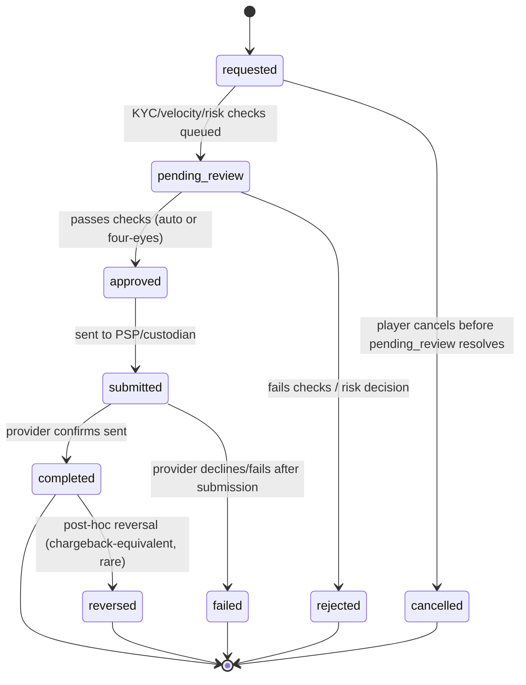

# Withdrawal State Machine

Status: Stage 3A (Financial Architecture Freeze) — architecture only,
`NOT IMPLEMENTED`. Source: Blueprint §4.6 ("withdrawals as a workflow, not
an endpoint"), extending `07-payments-architecture.md`'s "Withdrawals as a
workflow" section and `financial-transaction-flows.md` Flows 3–4. Owner:
`payments`, with `ledger-finance` on the ledger-visible transitions and
`security` on the ADR-0017 step-up question (§6).

## 1. States — `BLUEPRINT` (that a workflow with approval exists) + `ARCHITECTURAL DECISION` (the specific states)



- `requested`: player submits a withdrawal request. Ledger effect: Flow 3
  Step A posts immediately (`player_cash` → `player_withdrawal_hold`) —
  the hold exists from the moment a request is accepted, not from the
  moment it's approved, so the funds cannot be spent twice while a
  decision is pending (invariant #12).
- `pending_review`: automated KYC/velocity/risk checks run (owned by
  `identity-compliance`, not re-specified here — see
  `11-kyc-aml-rg-architecture.md`).
- `approved`: checks pass. For withdrawals above the tenant's configured
  four-eyes threshold (CLAUDE.md), `approved` requires two distinct staff
  approvers, not one — modeled as a `WithdrawalApproval` sub-record (see
  §5), not a single `approved_by` column.
- `rejected`: checks fail, or a reviewer denies it. Ledger effect: Flow 4
  (pre-submission variant) reverses the hold back to `player_cash`.
- `submitted`: orchestrator has sent the payout instruction to the PSP/
  custodian adapter. No ledger effect yet — submission is not confirmation.
- `completed`: provider confirms funds sent. Ledger effect: Flow 3 Step B
  posts (`player_withdrawal_hold` → `psp_clearing`/custodian account).
- `failed`: provider declines/fails post-submission. Ledger effect: Flow 4
  (post-submission variant) restores from hold to `player_cash`.
- `cancelled`: player-initiated cancellation, only while still in
  `requested` (before review starts). Ledger effect: as for a
  pre-submission rejection (Flow 4) — the hold posted at `requested` is
  released back to `player_cash`, and `release_ledger_transaction_id` is
  set (see §3) — `ARCHITECTURAL DECISION`: once
  `pending_review` has started, the request is not player-cancellable
  (avoids a race between a player cancelling and a reviewer approving in
  the same window). Because the hold posts *at* `requested` (before this
  state is even reachable), `cancelled` also requires a release
  transaction like every other terminal state — see §3's invariant list,
  which states this directly. `OPEN DECISION` on whether operators want a
  cancel-during-review capability — not assumed here.
- `reversed`: a `completed` withdrawal is later reversed (funds recalled by
  the bank/PSP, extremely rare vs. deposit chargebacks but architecturally
  symmetric) — Flow 4-equivalent compensating entries, `player_cash` moves
  again since the original hold has already been fully discharged.

## 2. State storage — `ARCHITECTURAL DECISION`

```
WithdrawalRequest
  id                 UUID (PK)
  tenant_id          UUID NOT NULL
  brand_id           UUID NOT NULL
  player_account_id  UUID NOT NULL
  wallet_id          UUID NOT NULL
  asset_code         TEXT NOT NULL
  amount             NUMERIC(38,0) NOT NULL
  state              TEXT NOT NULL   -- per §1
  idempotency_key    TEXT NOT NULL   -- client/session-supplied, deduplicates double-submits; UNIQUE (tenant_id, player_account_id, idempotency_key) per §4 — namespaced by tenant *and* player because the value is client-supplied (a tenant-only namespace would let one player's guessed key block another's request)
  hold_ledger_transaction_id     UUID NULL  -- Flow 3 Step A's transaction, once posted
  release_ledger_transaction_id  UUID NULL  -- whichever of Flow 3 Step B / Flow 4 resolves the hold
  requested_at, updated_at        TIMESTAMPTZ NOT NULL
```

Scope: tenant + brand + player + asset, via `wallet_id` — recorded in
`financial-domain-model.md`'s scoping table alongside every other Stage 3A
table. `brand_id` is carried here (rather than derived through the wallet)
because back-office withdrawal queues are listed and authorized per brand;
it is constrained by a composite FK back to the wallet/player account so it
cannot disagree with them (`financial-domain-model.md`, "Brand
denormalization rule").

`WithdrawalRequest` is the workflow's own state, separate from
`LedgerTransaction` (§1.2 of `ledger-accounting-model.md` — the ledger
itself has no "pending" concept). This table is the thing
`pending_review`/`approved` actually live on; the ledger only sees the two
or three atomic postings that correspond to specific transitions. This
mirrors the general principle stated in `ledger-accounting-model.md` §4:
provider/workflow state machines track pending state externally and call
into the ledger only when there is a fact to post.

## 3. State-transition invariants

- A `WithdrawalRequest` can have **at most one** non-terminal state at a
  time (enforced by the row itself — there is one row per request, not a
  transition log as the primary record; a transition history table is an
  additive audit convenience, not the state source of truth).
- `hold_ledger_transaction_id` is set exactly once, at `requested` →
  posting time, and never changes afterward: the ledger transaction it
  points at is itself immutable, so re-pointing it would silently detach a
  request from the hold that actually moved its money.
- `release_ledger_transaction_id` is set exactly once, on reaching **any**
  terminal state — `completed`, `rejected`, `failed`, `reversed` *and*
  `cancelled`. `cancelled` is included deliberately: the hold posts at
  `requested` (§1), before cancellation is possible, so a cancelled request
  still has a hold that must be released back to `player_cash` via Flow 4's
  pre-submission variant. Leaving it unset would break invariant #12's
  requirement that every hold has a tracked release.
- Invariant #12 (`ledger-accounting-model.md` §6) is enforced structurally:
  every open `player_withdrawal_hold` credit must correspond to exactly one
  `WithdrawalRequest` row in a non-terminal state with a matching amount —
  this is a Stage 3B reconciliation check (`reconciliation-model.md`), not
  merely a hopeful convention.
- The four-eyes count check in §5 (two distinct `approve` decisions before
  `approved` is reachable) and the `submitted`-state stuck-transaction case
  (a request that never receives a provider/custodian confirmation either
  way) are both **application-logic** invariants, not DB constraints —
  unlike the idempotency/uniqueness invariants elsewhere in this document,
  nothing at the database layer prevents a code defect from transitioning
  `approved` on a single approval or leaving `submitted` unmonitored
  forever. Stage 3B must treat the four-eyes count check as a
  `code-reviewer`/`ledger-finance`-gated code path (same rigor as the
  idempotent-insert helper in ADR 0020), and `OPEN DECISION`: the
  stuck-in-`submitted` timeout/alerting policy (how long before an
  unconfirmed submission is escalated to manual investigation) is an
  operational policy not fixed here.

## 4. Idempotency and concurrency

- Creating a `WithdrawalRequest` is idempotent on a client-supplied
  `idempotency_key` (prevents a double-submit from creating two holds for
  one player intent). That key is **namespaced server-side** and unique per
  `(tenant_id, player_account_id, idempotency_key)` — never inserted into a
  globally-unique column. A client-chosen value sharing a uniqueness
  namespace across tenants or players lets one caller deny or probe
  another's operations by guessing keys, and under RLS the resulting unique
  violation against an invisible row is a cross-tenant existence oracle.
  The workflow-layer key is also distinct from the ledger's own
  `idempotency_key` (ADR 0020): a client value never reaches the ledger's
  uniqueness namespace directly.
- The `requested` → hold-posting step and the `WithdrawalRequest` row
  creation happen in the **same** database transaction (the row and its
  `hold_ledger_transaction_id` are set together) — there is never a
  `WithdrawalRequest` row with a `requested` state and no
  `hold_ledger_transaction_id`, which would otherwise let a concurrent
  second request also see "sufficient balance" and double-spend the same
  cash (this is the same insufficient-funds-checked-atomically pattern as
  `financial-transaction-flows.md` Flow 5/8, applied here).
- State transitions (`pending_review` → `approved`/`rejected`,
  `approved` → `submitted`, etc.) use optimistic concurrency (a `version`
  column or `state` value checked in the `UPDATE ... WHERE state =
  $expected` clause) so two concurrent reviewers, or a reviewer and a
  timeout-driven auto-reject, cannot both apply conflicting transitions —
  full detail in `docs/decisions/0020-financial-idempotency-and-concurrency-control.md`.

## 5. Four-eyes approval — `ARCHITECTURAL DECISION` (CLAUDE.md requires four-eyes approval for *manual balance adjustments* above a configurable threshold; extending the same control to withdrawal approval is this document's decision, not a Blueprint requirement)

```
WithdrawalApproval
  id                 UUID (PK)
  tenant_id          UUID NOT NULL   -- denormalized from the parent request; RLS needs the column on the protected row (§7), composite FK (withdrawal_request_id, tenant_id) keeps it honest
  withdrawal_request_id  UUID NOT NULL
  approver_principal_id  UUID NOT NULL
  decision           TEXT NOT NULL   -- 'approve' | 'reject'
  reason_code        TEXT NULL       -- required on 'reject'
  threshold_amount_at_decision  NUMERIC(38,0) NOT NULL  -- four-eyes threshold in force when this decision was taken
  request_amount_at_decision    NUMERIC(38,0) NOT NULL  -- the amount this approver actually saw
  decided_at         TIMESTAMPTZ NOT NULL
  UNIQUE (withdrawal_request_id, approver_principal_id)  -- one approver can't double-count
  FOREIGN KEY (withdrawal_request_id, tenant_id)
      REFERENCES withdrawal_requests (id, tenant_id)  -- an approval can never cross tenants
```

For requests above the tenant's configured four-eyes threshold,
`WithdrawalRequest.state` transitions to `approved` only once **two
distinct** `approve` decisions exist from **two distinct**
`approver_principal_id`s (checked at transition time, not assumed from
row count alone, since the uniqueness constraint already prevents the
same approver counting twice — the check is belt-and-braces). Below the
threshold, a single approval (potentially automated, per risk-engine
rules owned by `identity-compliance`) suffices. `OPEN DECISION`: the exact
threshold value(s) and whether they vary by jurisdiction/tenant/player
risk tier are business/compliance decisions, not fixed here — the
mechanism supports any threshold, tenant-configurable.

### Four-eyes bypass paths Stage 3B must close explicitly

`UNIQUE (withdrawal_request_id, approver_principal_id)` alone does **not**
deliver four-eyes. Each of the following was reachable in this design as
originally written (Stage 3A `security` review):

1. **Approver identity is server-derived and permission-checked.**
   `approver_principal_id` comes from the approving staff member's own
   authenticated session, never from the request body, and that principal
   must hold the withdrawal-approval RBAC permission **in the tenant that
   owns the request**. Otherwise "two distinct approver ids" is satisfiable
   by one actor supplying two ids.
2. **The approver is never the beneficiary.** A principal linked to the
   withdrawing `player_account_id` — or, where a staff member and a player
   can resolve to the same `Person` (realistic for our own B2C brand), any
   principal resolving to that `Person` — is rejected as an approver.
   Without this, a staff member who is also a player self-approves their
   own payout.
3. **Threshold mutation is itself a bypass.** If the four-eyes threshold
   lives in tenant configuration, a single principal holding both
   config-edit and approval permissions can raise the threshold above the
   amount, single-approve, and lower it back — no constraint here would
   notice. `threshold_amount_at_decision`/`request_amount_at_decision`
   above make it detectable after the fact; *preventing* it requires the
   two permissions to be separable, and every threshold change to write an
   audit record naming the actor. `OPEN DECISION` (business/policy, not
   invented here): whether config-edit and withdrawal-approval permissions
   must be held by disjoint roles, and whether a threshold change applies
   to already-open requests or only to ones created after it.
4. **Structuring below the threshold.** Nothing here stops one large payout
   being split into N sub-threshold requests, each needing a single
   approval. The mechanism hook is recorded now so Stage 3B need not
   retrofit it: threshold evaluation takes a **rolling per-player total**
   over a window, not only the single request's amount. `OPEN DECISION`
   (risk/AML policy, owned by `identity-compliance`): the window length and
   rolling-total threshold.
5. **No TOCTOU window at the transition.** The two-distinct-approvers check
   and the threshold comparison run **inside the same database
   transaction** as the `UPDATE ... WHERE state = 'pending_review'` that
   sets `approved`, reading the request's own current `amount`. A check
   done in an earlier read and trusted at write time is exploitable.
6. **Automated approval is a service identity, not a human one.** Where the
   risk engine auto-approves below the threshold, the `WithdrawalApproval`
   row records a service identity (ADR 0014). An auto-approval can never
   count as one of the two human approvals for an above-threshold request.
7. **Approvals are append-only.** `WithdrawalApproval` rows are never
   updated or deleted — a reconsideration is a new request, not an edited
   decision. Enforced by the same `BEFORE UPDATE OR DELETE` / `BEFORE
   TRUNCATE` trigger pair `audit_log` uses (ADR 0013), **not** by `REVOKE`,
   because the application role owns the table.

## 6. Relationship to ADR 0017 (staff MFA / step-up)

ADR 0017 (architecture-only, from the security hardening pass) defines
step-up authentication for high-risk operations, explicitly naming
"withdrawal approval" as a candidate. This document's position: **the
withdrawal state machine's `approved` transition is the natural
enforcement point for a step-up requirement** — a `WithdrawalApproval`
row's `approver_principal_id` should, once ADR 0017 is implemented, only
be acceptable from a session carrying a sufficient session-assurance
level (ADR 0017 §"session assurance level"). This document does **not**
implement or mandate step-up now — ADR 0017 is architecture-only and MFA
remains unimplemented (`docs/active-stage.md`); this section only records
where the hook goes so Stage 3B doesn't have to retrofit it.
`OPEN DECISION`: whether step-up is required for *every* withdrawal
approval or only above the four-eyes threshold — left to ADR 0017's own
open decisions, not duplicated here.

## 7. Security/RLS

`WithdrawalRequest` and `WithdrawalApproval` are tenant-owned tables,
RLS-protected identically to every Stage 2 tenant-owned table (`tenant_id`
present on both — see §2 and §5 — enforced by `FORCE ROW LEVEL SECURITY`,
no client-controlled tenant assignment). A player can read/list only their
own `WithdrawalRequest` rows (player-account-scoped, same pattern as the
hardened `sessions` RLS from ADR 0016); staff reviewers/approvers require
the appropriate RBAC permission (existing Stage 2 permission-based RBAC, no
new authorization primitive needed).

`tenant_id`, `brand_id`, `player_account_id`, and `wallet_id` on a new
`WithdrawalRequest` are **all** resolved server-side from the authenticated
player session; the request body supplies only `asset_code` (validated
against the caller's own wallets) and `amount`. A client-supplied wallet or
account identifier is never trusted, even when it looks like the caller's
own.

`amount`, `asset_code`, `wallet_id`, and `player_account_id` are
**immutable after insert** (a `BEFORE UPDATE` trigger raises if any
changes). Without that, §5's threshold check is trivially bypassable —
request a below-threshold amount, collect the single approval it needs,
then raise the amount — and the hold posted at `requested` would
desynchronize from the request, breaking §3's invariant-#12 reconciliation.

Two mechanics inherited from ADR 0016 that Stage 3B must not rediscover the
hard way:

- **A player-scoped `SELECT` policy must be an additional *permissive*
  policy OR'd with the tenant-scope one, never an extra `AND`.** Postgres
  requires a row to be visible under some `SELECT` policy before an
  `UPDATE`/`DELETE` can affect it, with or without `RETURNING` (ADR 0016,
  "A Postgres behavior discovered while building this"). Every transition
  here is a staff/system `UPDATE` running in a tenant-only scope with no
  player-scope GUC set; if the player scope were ANDed in, every transition
  would silently affect zero rows — and §4's optimistic-concurrency
  `RowsAffected()` check would report that as "lost the race" rather than
  as an authorization failure. ADR 0019 holds the canonical statement of
  this requirement for all financial tables.
- **Players get no `INSERT`/`UPDATE` policy on either table.** A player
  causes a `WithdrawalRequest` only through the server-side handler and
  never writes the row directly. A player-writable `WithdrawalApproval`
  would be a complete four-eyes bypass.

Every state transition and every approval decision writes an audit record
(actor, tenant, entity, before/after state, IP, reason code) to the
append-only store per CLAUDE.md — including rejections, and including the
threshold and amount in force at the time.

## Cross-references

- Ledger postings referenced here: `financial-transaction-flows.md`
  Flows 3–4.
- Account this workflow's holds live in: `ledger-accounting-model.md` §2
  (`player_withdrawal_hold`).
- Payment orchestrator's role in `submitted`/`completed`/`failed`:
  `payment-orchestration.md`.
- Crypto-specific withdrawal detail (custodian approval step): `crypto-custody-boundary.md`.
- Reconciliation of open holds: `reconciliation-model.md`.
