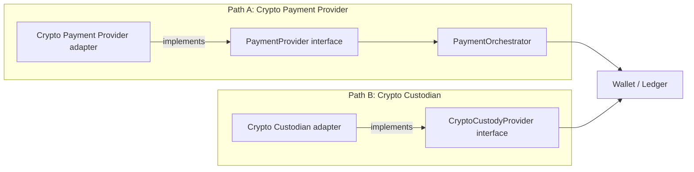

# ADR 0022 — Payment Provider Agnosticism and Capability Model

Status: Accepted (Stage 3A) and `PARTIALLY IMPLEMENTED` (Stage 3B). The
`PaymentProvider` interface, its canonical request/result shapes, the
adapter-conformance suite, and the `ProviderCapability` model (migration
`0024`; RLS tightened by `0028`) are built in `internal/payments`. What
exercises them is a **`MOCK` fiat adapter only** — no real PSP integration,
no per-tenant provider credential storage, and no `crypto_payment` adapter
exists. §3 carries one known gap against the shape decided here (see the
note in its table-shape constraints).
Issued directly by the business owner as a core commercial requirement,
extending `payment-orchestration.md` and `crypto-custody-boundary.md`
with the formal provider-independence and capability-model design those
documents referenced but had not yet made mandatory/explicit.

## Context

The business owner has stated, as a core commercial requirement, that the
platform must integrate **multiple** external payment gateways/providers
— for fiat (multiple currencies, cards, bank transfers, local payment
methods, other rails) and for crypto (multiple assets, crypto payment
gateways, custodian/blockchain-infrastructure providers) — and that
providers must be replaceable and independently integratable without
rewriting the core financial system. `payment-orchestration.md` already
designed a `PaymentProvider`/`PaymentOrchestrator` split and a mock-PSP-
implements-the-same-interface rule; this ADR makes the capability model,
the multi-tenant/brand routing requirement, and the crypto-payment-
provider-vs-custodian distinction explicit and binding, and records the
provider-agnosticism test obligations for Stage 3B.

Nothing in this ADR changes the ledger/accounting model
(`ledger-accounting-model.md`), the invariants
(`ledger-accounting-model.md` §6), or the custody boundary (ADR 0008).
It constrains how the orchestration layer must be built so that those
remain untouched by any single provider's specifics — which was already
the design intent of `payment-orchestration.md` §2/§3, now made an
explicit, testable requirement rather than an implicit consequence.

## Decision

### 1. The core financial system contains no provider-specific logic

`Wallet`, `LedgerAccount`, `LedgerTransaction`, `LedgerEntry`, balance
projection, and the Mandatory Financial Invariants
(`ledger-accounting-model.md` §6) reference a provider only via the
generic `provider_id`/`provider_tx_id` pair already in the
`LedgerTransaction` shape (§1.2 of that document) — an opaque string
identifying *which* adapter and *which* external reference, never a
provider-specific type, enum of known providers, or branch in posting
logic. This was already true of the Stage 3A ledger design; this ADR
states it as a binding constraint so it is never violated by a future
provider integration: **no `IF provider = X` branch may ever appear in
`ledger-accounting-model.md`- or `financial-transaction-flows.md`-owned
code.** Provider-specific behavior belongs exclusively inside the
provider's own adapter, translated into the canonical
`DepositRequest`/`WithdrawRequest`/`CallbackEvent` shapes
`payment-orchestration.md` §2 already defines before it ever reaches the
ledger posting API.

### 2. Provider Capability Model — `ARCHITECTURAL DECISION`

Formalizing `payment-orchestration.md` §2's `Capabilities()` return type,
which was previously left as a comment (`"countries, currencies/assets,
methods, min/max amounts"`):

```
ProviderCapability
  provider_id
  provider_kind            -- 'fiat' | 'crypto_payment' — payment rails only. A Crypto Custodian is deliberately NOT
                           --   representable here: it implements CryptoCustodyProvider, not PaymentProvider, has no
                           --   Capabilities() method, and must never appear as a RouteProvider candidate (§4 below).
                           --   Custodian configuration and limits are owned by crypto-custody-boundary.md.
  supported_fiat_currencies    []TEXT   -- asset codes, empty for a crypto-only provider
  supported_crypto_assets      []TEXT   -- asset codes, empty for a fiat-only provider
  supported_payment_methods    []TEXT   -- 'card' | 'bank_transfer' | 'local_method:<name>' | 'crypto_rail' | ...  -- open-ended, never a fixed enum the orchestrator hardcodes (see §3)
  supported_countries          []TEXT   -- ISO country codes; empty/omitted means "not country-restricted", never "all countries" by silent default
  supports_deposit              BOOLEAN
  supports_withdrawal           BOOLEAN
  supports_refund_reversal      BOOLEAN
  amount_limits                 -- a child set of (asset_code, min_amount, max_amount) rows, NOT two columns on this
                                --   row: a provider declaring several assets carries one limit pair PER asset.
                                --   NUMERIC(38,0) minor units at that asset's own exponent (ADR 0021), never floating
                                --   point, and never a single platform-wide pair applied across assets.
  settlement_behavior           -- e.g. 'instant' | 'batched:<period>' | 'custodian_confirmation_based' — informs reconciliation-model.md's cadence per provider, not hardcoded per provider type
  callback_capabilities         -- 'webhook' | 'polling_only' | 'both' — the orchestrator must not assume every provider can push
  priority                      -- tenant-configurable ranking among otherwise-equal candidates, distinct from the health-based ranking in §6 of payment-orchestration.md
  tenant_id, brand_id            -- tenant_id NOT NULL under FORCE ROW LEVEL SECURITY (§2.2). NULL brand_id = available to every brand under that tenant; a capability row is never platform-global (no provider is "available to all tenants" by default — see §3)
  status                        -- 'active' | 'disabled' -- an operator kill-switch independent of health/circuit-breaker state
```

**Two layers, one shape.** The fields above split into (a) *adapter-
declared* facts, which are static properties of the integration and are
what `Capabilities()` returns from adapter code — `provider_kind`, the
supported currency/asset/method/country lists, the
deposit/withdrawal/refund flags, `amount_limits`, `settlement_behavior`,
`callback_capabilities`; and (b) *operator-configured* facts, which are
`tenant-config` rows and never live in adapter code — `tenant_id`,
`brand_id`, `priority`, `status`, and any per-tenant narrowing of the
declared lists (a tenant may enable a subset of what the adapter can do,
never a superset). Keeping `priority` and `status` in layer (b) is what
makes the kill-switch and routing rank partner-console-editable per
CLAUDE.md, rather than requiring a deploy. An effective capability is the
intersection of the two layers, resolved per `(tenant_id, brand_id)`.

Layer (b) — and therefore every routing candidate — is **data**, read by
`RouteProvider` (`payment-orchestration.md` §3/§4), never compiled into
the orchestrator. Adding a payment method the
orchestrator has never seen before (a new local payment method, a new
crypto asset) requires a new `ProviderCapability` row and (if genuinely
novel) a new value in the open-ended `supported_payment_methods`/
`supported_crypto_assets` lists — never a code change to the routing
dimensions in `payment-orchestration.md` §4, which already read these
lists rather than a fixed set.

#### 2.1 A capability row describes an adapter; it never promotes one — `security`

Layer (a) is an assertion *about* code that already exists, so the adapter
registry — which interface a given `provider_id` is compiled against — is
the authority, and the row is only ever a filter over it:

- `provider_kind` is **not tenant-editable**. A partner-console operator
  may enable/disable, re-rank, or narrow (layer (b)); they may never change
  `provider_kind`, register a `provider_id` the platform has not
  integrated, or assert a capability the adapter does not declare. Without
  this, editing a configuration row becomes a way to move an adapter
  between trust boundaries without the ADR 0008 review §4 requires.
- Registering a `provider_id` or changing its declared kind is a
  platform-level administrative action, audited per CLAUDE.md (actor,
  tenant, entity, before/after, IP, reason code).
- A vendor performing both roles (§4) holds **two distinct `provider_id`
  values** — one `PaymentProvider`, one `CryptoCustodyProvider` — never one
  id reused across both boundaries, so that per-provider authorization
  (ADR 0019's actor matrix) and per-provider credentials can differ.
- A capability row grants nothing. It may only narrow what an adapter's own
  credential is already permitted to originate; it can never widen it.

#### 2.2 Capability rows carry no secret material, and are RLS-scoped — `security`

The shape above deliberately has **no credential field**, and
`payment-orchestration.md` §10 applies unchanged to this new table and to
any per-`(tenant_id, brand_id)` credential row it points at:

- A configuration row stores a **secret handle/reference, never secret
  material** — API keys, webhook signing secrets, custodian keys and mTLS
  private keys included.
- `provider_capabilities` and any provider-credential table are **excluded
  from CDC capture**, for the same reason §10 excludes provider
  configuration: otherwise handles, routing topology and (if the
  no-material rule is ever broken) live credentials land in ClickHouse.
- Credential writes/rotations are audited with **handle plus fingerprint
  only** — never the value, into a store that by design cannot be redacted.
- Rotation stays per-tenant with an overlap window; making one adapter
  serve many tenants (§3) must not turn its rotation into a cross-tenant
  event.
- `tenant_id NOT NULL` with `FORCE ROW LEVEL SECURITY` and an
  `app.tenant_id`-gated policy. `provider_capabilities` is named
  explicitly in ADR 0019's enumerated table list so it cannot be missed at
  migration time. Capability rows are not secrets but they are
  confidential: which providers, limits and priorities a tenant runs is
  commercially sensitive and a map of which rail to attack. There is no
  platform-global capability row, therefore **no** dual-scope (ADR 0013)
  policy here — a `WithoutTenant` connection must not become a
  cross-tenant read path for provider configuration.

### 3. Multi-tenant, multi-brand provider configuration — `ARCHITECTURAL DECISION`

`payment-orchestration.md` §4 already resolves routing tenant/brand-first;
this ADR makes explicit what that implies for configuration, using the
business owner's own example:

```
Brand A:  EUR → Provider A     Brand B:  EUR → Provider D
          USD → Provider B               USD → Provider A
          BTC → Provider C               BTC → Provider E
```

This is expressed entirely as `ProviderCapability`/routing-priority rows
scoped by `(tenant_id, brand_id)` — never as application code branching
on a brand or tenant identifier (CLAUDE.md's "nothing brand-specific may
become a code path", already the platform-wide rule this ADR merely
applies to payments specifically). The same `PaymentProvider` adapter
(e.g. "Provider A") can be configured for multiple tenants/brands
simultaneously with independent credentials, priority, and enabled-asset
sets per `(tenant_id, brand_id)` — the adapter code is shared; only its
configuration rows differ. A capability row with `brand_id = NULL`
applies to every brand under that tenant unless a more specific
`(tenant_id, brand_id)` row overrides it for one brand. This
most-specific-row-wins resolution is **established here for payment
provider configuration**; it is not an existing documented platform-wide
pattern (`tenant-config` owns brand configuration per
`02-domain-and-service-boundaries.md`, but no ADR yet defines a general
tenant→brand configuration override rule). `OPEN DECISION`: whether
`tenant-config` should generalize this resolution rule to all
tenant/brand-scoped configuration — an `architect` item, not decided
here.

Resolution is **whole-row replacement**, not a per-field merge: a
brand-specific row replaces the tenant-wide row for that provider and
brand entirely. A field-level merge would make "which assets does Brand B
actually accept" unreadable from any single row.

Note that ADR 0012 went the *other* way for consumer-facing
configuration: it dropped `tenant_config` and moved its columns onto
`brands`, so brand configuration is mandatory and per-brand with no
tenant-level fallback row. The nullable-`brand_id` fallback is justified
here, and is deliberately not retrofitted onto `brands`, because a
tenant's commercial relationship with a provider is genuinely
tenant-level — it is the Tenant, the licensing/commercial entity per
ADR 0012, that holds the provider contract — while *which* of its brands
may use that relationship is a per-brand choice. That is the same
tenant-vs-brand split `financial-domain-model.md` already applies to
house-level ledger accounts ("Why house-level accounts are tenant-scoped,
not brand-scoped").

**Table-shape constraints this implies** (exact key shape is Stage 3B
migration design; the constraints themselves are not deferrable):

- Because the row carries `brand_id`, it is constrained by a composite
  foreign key `(brand_id, tenant_id) REFERENCES brands(id, tenant_id)` —
  ADR 0012's own pattern — so a capability row can never name a brand
  belonging to a different tenant. With `brand_id` NULL that FK is not
  checked at all (Postgres `MATCH SIMPLE`), so `tenant_id`'s own FK is
  what binds a tenant-wide row. **Known gap (Stage 3B):** migration `0024`
  as written carries only the composite `(brand_id, tenant_id)` FK — there
  is no direct `tenant_id REFERENCES tenants(id)` FK on
  `provider_capabilities`. For a tenant-wide row (`brand_id IS NULL`)
  `MATCH SIMPLE` skips the composite entirely, so nothing at the database
  level currently verifies that such a row's `tenant_id` names a real
  tenant. Recorded here rather than patched in place; adding the direct FK
  is an additive follow-up migration.
- `ProviderCapability` is the **second** Stage 3A table permitted to
  carry `brand_id` under `financial-domain-model.md`'s brand-
  denormalization rule (the first being `WithdrawalRequest`). It is the
  one table in this stage that cannot reach brand through `wallet_id`,
  because it is configuration that exists before and independently of any
  wallet. That document's rule and scoping table are updated to name it,
  rather than this ADR quietly taking an undocumented exception to them.
- It is tenant-owned configuration: `tenant_id NOT NULL` under `FORCE ROW
  LEVEL SECURITY`, never platform-scoped, holding no secret material.
  Stated in full at §2.2 above, not repeated here.

`OPEN DECISION` (`security`/`payments`, Stage 3B): one adapter shared
across many tenants with independent credentials sharpens an unresolved
question in `payment-orchestration.md` §10, which requires the tenant to
come from "the key that verified the signature". With N tenants on one
provider, an inbound webhook must select a candidate verification key
*before* any tenant is known. Trial-verifying against every tenant's key
is not acceptable — it makes one tenant's key material reachable from
another tenant's traffic. The candidate resolutions (a per-tenant webhook
endpoint/path, so the URL selects the key, versus a provider-supplied
account identifier used *only* to look up a single candidate key that
must then still verify) are a Stage 3B design decision this ADR does not
make. Binding regardless: exactly one key is tried, and a payload field
never *asserts* the tenant.

> **Amendment 2026-09-26 (Stage 10.1, PAY-WH-TENANT-1, ADR 0090 item 3) —
> §3 OPEN DECISION CLOSED (`security`/`payments`, recorded by `architect`;
> not a human decision, no HDR reopened).**
>
> **Candidate 1 is adopted.** The per-tenant webhook route selects exactly
> one candidate tenant. The platform resolves at most one credential for
> (that tenant, the route `provider_id`, the vendor-supplied key id), and
> that credential must verify.
>
> **Candidate 2 is not adopted.** A provider-supplied account id selecting
> the tenant is not permitted. Adopting it later requires a further
> amendment.
>
> **Binding contract** (the reference contract for every inbound provider
> callback, platform-wide):
> 1. The route is a lookup hint only. The tenant is established by
>    successful verification with a credential bound to that tenant, and a
>    payload field never asserts it.
> 2. Exactly one credential is tried. There is no trial across tenants,
>    and adapters receive only that one credential.
> 3. The verified tenant is bound into what is verified:
>    - **Platform-defined schemes** (MOCK) put `tenant_id` and
>      `provider_id` in the signing input.
>    - **Vendor schemes** must use per-merchant keys and, where the vendor
>      signs a merchant or account id, require it to equal the
>      credential's bound account.
>    - A vendor offering neither is not integrable without a further ADR.
>    - Real adapters enforce the vendor's signed-timestamp tolerance
>      (PAYWH-TS-1).
> 4. Verification completes before any tenant-scoped financial or state
>    read, lock or write. Before it, only read-only, tenant-scoped
>    configuration or credential-handle lookups are allowed.
> 5. Every pre-verification failure is one indistinguishable response
>    (401). Unauthenticated failures write no `audit_log` row and are
>    logged with allow-listed fields only.
> 6. All writes use the verified tenant as both the RLS context and the
>    binding. `(provider_id, provider_tx_id)` is keyed on the route
>    `provider_id` that the credential verified.
> 7. **Adapter error contract (added 2026-09-26, Stage 10.1 post-
>    implementation review: security P2-1, code review F1, architect
>    PW-1).** Any `HandleCallback` failure that occurs BEFORE that
>    adapter's own signature/MAC verification has succeeded — including an
>    unparseable body, a header that fails format validation, or any other
>    structural problem the adapter would otherwise notice while preparing
>    to verify — MUST be reported as one of the two closed authentication
>    sentinels (`ErrCallbackSignatureInvalid` or, once verification has
>    succeeded and a key-material scan then rejects the payload,
>    `ErrInboundKeyMaterial`), never any other error type. Concretely: an
>    adapter verifies the raw wire bytes first (its MAC/signature check
>    needs no parsing at all) and only parses the body — generically for
>    the key-material scan, then into typed fields — AFTER verification
>    succeeds. A structural failure discovered only after successful
>    verification (a verified-but-malformed body) is a DIFFERENT, distinct
>    error (the mock's `ErrCallbackMalformedBody`), mapped to a 4xx
>    validation response, never to the uniform pre-verification 401 and
>    never logged with body content. This closes the specific defect where
>    an unauthenticated non-JSON body with well-formed headers returned a
>    distinguishable 500 instead of the same 401 every other
>    pre-verification failure gets — reintroducing exactly the tenant/
>    provider enumeration oracle point 5 exists to remove.
>
> **Provider status.** `ProviderCapability.status` governs routing only.
> Callback acceptance is revoked by revoking the tenant's credential, so
> in-flight funds are not stranded.
>
> **Status.**
> - `MOCK` resolver only (`payments.MockWebhookCredentials`,
>   `internal/payments/mock.go`).
> - The real credential resolver (FORCE-RLS handle table + secret store,
>   §2.2) is `NOT IMPLEMENTED`. It is blocked on the secret-store ADR and
>   on human-authorized provisioning.
> - S-6 is closed for the MOCK only and stays launch-blocking for any real
>   PSP.
> - Casino (CAS-WH-TENANT-1) and KYC (KYC-WH-1) callbacks do not yet
>   conform. They are registered, not in scope.
> - **`MultiWebhookCredentialResolver` (`internal/payments/webhook_auth.go`)
>   is MOCK/test wiring only** (Stage 10.1 review PW-6/P3-1): it composes
>   several `WebhookCredentialResolver`s keyed by `provider_id` so tests
>   can stand up more than one mock provider in the same process. It is
>   NOT a template for the real resolver: the real resolver is a single
>   platform component, backed by one FORCE-RLS handle table plus a secret
>   store, keyed by `(tenant_id, provider_id, key_id)` — never a
>   per-provider-vendor map composed at the Orchestrator boundary. A nil
>   entry in the composite fails closed
>   (`ErrWebhookCredentialUnavailable`), it never panics.
> - **The C4 tenant-binding conformance case
>   (`internal/payments/conformance_test.go`) is mandatory for the first
>   real adapter** (Stage 10.1 review PW-4; hardened Stage 10.2 final
>   review K3): it FAILS, not skips, for any provider that is not
>   `*MockProvider`. A real adapter must supply its own per-tenant
>   signed-fixture hook and pass this case to prove tenant binding the
>   same way the mock's is proven; it cannot get a pass by skipping.
>
> The Consequences clause "§3 leaves open *how* the right key is
> selected" is superseded by this amendment.

> **Amendment 2026-09-26 (Stage 10.2, ADR 0091; KYC-WH-1, CAS-WH-TENANT-1,
> PAYWH-GATE-1) — contract extracted and extended (recorded by
> `architect`; design `docs/plans/stage-10.2-planning/01-webhook-trust-design.md`,
> rulings §J; review `07-review-architect-db.md` §5 A).**
>
> **Extraction.** The contract primitives now live in the provider-neutral
> package `internal/webhookauth`: `Credential`, `Resolver`, `Inbound`, the
> single closed `Reason` enum, `AuthError`, the auth sentinels
> (`ErrSignatureInvalid`, `ErrAuthFailed`, `ErrCredentialUnavailable`),
> the platform-defined MOCK wire `Scheme` and its verify-before-parse
> preamble, and the MOCK helpers in `internal/webhookauth/mock.go`
> (`NewMockMaster`, `DeriveMockKey`, `MockResolver`, key id `mock-v1`).
> The code was moved, not copied. `internal/payments` keeps type aliases and
> sentinel variables pointing at it (`WebhookCredential`,
> `WebhookCredentialResolver`, `InboundCallback`, `CallbackAuthReason`,
> `CallbackAuthError`, `ErrCallbackSignatureInvalid`,
> `ErrCallbackAuthFailed`, `ErrWebhookCredentialUnavailable`), so payments
> behaviour and `errors.Is`/`errors.As` results are unchanged. There is one
> preamble and one `Reason` enum. Each domain documents the subset of
> reasons it emits. `provider_not_configured` and `key_material` stay
> payments-only (§4.1).
>
> **Scope.** Points 1–7 bind KYC callbacks
> (`POST /v1/webhooks/kyc/{tenantSlug}/{providerID}`) and casino callbacks
> (`POST /v1/webhooks/casino/{tenantSlug}/{providerID}`) exactly as they
> bind payments. For point 7 in those domains, the pre-verification
> sentinel is `webhookauth.ErrSignatureInvalid` (the casino alias is
> `casino.ErrCallbackSignatureInvalid`). The key-material sentinel is
> payments-only. A verified-but-malformed body is the domain's own
> `ErrCallbackMalformedBody` and maps to 400, never to the uniform 401 -
> **except one deliberate carve-out** (Stage 10.2 final review, K7/F-8): a
> body that has already passed verification but still carries the legacy
> top-level `signature` field is rejected with
> `ErrSignatureInvalid`/`ErrCallbackSignatureInvalid` (401
> `signature_invalid`), not `ErrCallbackMalformedBody`, in every domain
> (KYC, casino, and payments' pre-existing identical rule). **Disclosure:**
> because that sender has, by construction, already proven knowledge of
> the shared credential, this is a benign false-positive on the
> `signature_invalid` forgery-alert signal (§G "Audit and alerting" in the
> Stage 10.2 design) - it is not evidence of an actual forgery attempt, and
> alerting on it should account for that.
>
> 8. **Domain separation.** Each platform-defined (MOCK) scheme is
>    HMAC-SHA256 over
>    `Prefix‖0x00‖tenant_id‖0x00‖provider_id‖0x00‖key_id‖0x00‖raw body`.
>    Each domain has three independent separators:
>
>    | Domain | Signing prefix | Signature header | Key-id header | Mock key label |
>    |---|---|---|---|---|
>    | payments | `igaming.payments.webhook.v1` | `X-Payments-Signature` | `X-Payments-Key-Id` | `igaming/payments-mock-webhook/v1` |
>    | KYC | `igaming.kyc.webhook.v1` | `X-KYC-Signature` | `X-KYC-Key-Id` | `igaming/kyc-mock-webhook/v1` |
>    | casino | `igaming.casino.webhook.v1` | `X-Casino-Signature` | `X-Casino-Key-Id` | `igaming/casino-mock-webhook/v1` |
>
>    (Source of truth: `internal/webhookauth/domains.go`. The payments
>    values are byte-identical to Stage 10.1's and must never change.)
>    A signature valid in one domain never verifies in another, even under
>    an equal key. The cross-scheme test (equal key, different domain, so
>    reject) is mandatory. **`Scheme` is not a vendor wire format.** The
>    platform never invents a generic signature scheme for third parties.
>    A real adapter verifies with its vendor's own scheme, still consumes
>    `Credential` and `Inbound`, and still obeys points 1–7.
> 9. **KYC and casino I1 is strict.** Before the adapter's verification
>    succeeds, the only statements allowed are the platform-scoped
>    `GetTenantBySlug` and the `set_config` inside `WithTenant`. No
>    tenant-scoped statement runs, not even a configuration read. That is
>    stricter than point 4's configuration-lookup allowance, which only
>    payments uses (`ProviderAcceptsWebhook`). The casino capability check
>    (`LoadCapability`) runs only after verification (ADR 0025, Stage 10.2
>    amendment). Tenant id has one source: each domain's
>    `ReceiveCallback(…, tenantID, providerID, in)` first overwrites
>    `in.TenantID` and `in.ProviderID` from its parameters, as payments
>    does. So the route slug resolves one tenant id, and that same id is
>    the RLS context, the resolver key, part of the signing input, the
>    `cred.TenantID` check, and the scope of every write.
>
> **Status update.**
> - KYC-WH-1 and CAS-WH-TENANT-1 conform for the **MOCK only**.
> - Mock resolvers are wired only when `TestSupportRoutesEnabled()` is
>   true (ADR 0085 §1). The decision is made in one place,
>   `cmd/platform-api/wiring.go` `mockProviderWiring`, and this now
>   includes the payments mock resolver (PAYWH-GATE-1). In production, or
>   with test support off, payments and casino have a nil resolver: every
>   callback fails closed with the uniform 401 (`no_resolver`). The KYC
>   mock and its webhook route are absent (ADR 0028, Stage 10.2
>   amendment).
> - Real KYC and casino resolvers are `NOT IMPLEMENTED`. They are blocked
>   in the same way as the payments resolver (secret-store ADR plus
>   human-authorized provisioning).
> - The KYC and casino tenant-binding conformance cases are mandatory for
>   the first real adapter in each domain, in all three domains including
>   payments (Stage 10.2 final review, K3): the case FAILS, not skips, for
>   any provider that is not the package's own mock type - it no longer
>   merely skips today with a plan to turn into a failure "once a real
>   adapter exists." A non-mock adapter must supply its own per-tenant
>   signed-fixture hook to pass this case at all.
> - **Known constraint on the first real adapter, in every domain** (Stage
>   10.2 final review, K12/L8): `internal/httpserver`'s shared
>   `webhookPreamble` and every domain's `Orchestrator.ReceiveCallback`
>   parse inbound headers with that domain's platform-defined MOCK
>   `Scheme.ParseHeaders` (fixed header names, `v1=<hex>` signature
>   format, `mock-v1`-shaped key ids). A real vendor's own header names or
>   signature encoding will not survive that parse and is rejected with
>   the uniform 401 before the adapter's own verification ever runs. Per
>   point 8, `Scheme` is not a vendor wire format, so this is expected, not
>   a defect - but header parsing must become an adapter/Scheme capability
>   (not a shared, hard-coded preamble step) before the first real adapter
>   can be wired in any domain. Tracked as **`WH-VENDOR-SCHEME-1`**
>   (`docs/governance/task-registry.md`, Stage 10.2 section; owner
>   `architect`; pre-condition for the first real adapter in any domain).
> - The Stage 10.1 status bullet "Casino (CAS-WH-TENANT-1) and KYC
>   (KYC-WH-1) callbacks do not yet conform" is **superseded** by this
>   amendment.
> - Implementation and completion status is tracked in
>   `docs/governance/task-registry.md` (Stage 10.2) and the Stage 10.2
>   completion report. This amendment records the binding contract, not
>   completion.

#### Amendment (Stage 10.3, ADR 0092)

> **Amendment 2026-09-26 (Stage 10.3, ADR 0092; WH-VENDOR-SCHEME-1).
> Recorded by `architect`.** Sources: paper
> `docs/plans/stage-10.3-planning/01-provider-trust-analysis.md` §1–§2 and
> the security review `04-review-security.md` (C3, C4, C5, C9, C10, C11),
> as adopted by rulings R3, R4 and R6. `security` concurrence on points 2,
> 9 and 10 is given in §1.4 of that review. Points 1–9 remain binding
> except where changed below. The credential and secret-store model is in
> ADR 0093.
>
> **Per-adapter `VerificationScheme` (removes the Stage 10.2 "known
> constraint").**
> - Header parsing and verification move from the shared, hard-coded MOCK
>   `Scheme.ParseHeaders` into a per-adapter capability. Each domain's
>   provider interface gains `WebhookScheme() webhookauth.VerificationScheme`.
> - The interface has three methods:
>   - `Extract(in) (AuthMaterial, Reason, bool)`. It is pure: no DB, no
>     secret, no clock and no body parsing. On failure it returns only
>     `signature_missing` or `signature_invalid`.
>   - `Verify(creds CredentialSet, in, m, now)`. It verifies the raw bytes
>     in constant time and returns a closed `Reason` alongside the single
>     sentinel `ErrSignatureInvalid`.
>   - `Properties() SchemeProperties`, which declares `Binding`,
>     `KeySelection`, `SignedTimestamp` and `MaxSkew`.
> - **The key-selection mode comes only from `Properties().KeySelection`,
>   never from the request (R3/C3).**
>   - A `KeyFromHeader` scheme whose key id is absent yields
>     `signature_missing`. The resolver is never called in multi-row mode
>     for it.
>   - A `KeyFromHeader` scheme never receives a `Previous` credential.
> - **Properties are validated at registration.** For a non-synthetic
>   scheme, any of the following makes the process refuse to start:
>   `SignedTimestamp = false`, `MaxSkew <= 0`, `MaxSkew` above the cap, or
>   an unknown `Binding` or `KeySelection`. The conformance suite proves a
>   declaration is truthful; the startup check proves it is permitted.
> - The MOCK `Scheme` implements `VerificationScheme` unchanged
>   (`SignedTenant`, `KeyFromHeader`, `SignedTimestamp = false`). Its bytes
>   stay identical (`TestPaymentsParameters_ByteIdentical`).
> - The preamble looks up the scheme by provider id before looking up the
>   tenant (`provider_unregistered`). It gives the same uniform 401.
> - **The MOCK scheme is not the protocol of any real provider.** A real
>   provider is declared supported only after its actual
>   documentation/contract is implemented and tested, including its
>   known-answer vectors (ADR 0092).
>
> **Verify is enforced by the orchestrator (points 7/8).**
> - Each domain's `ReceiveCallback` calls `scheme.Verify` itself, after
>   resolution and before `HandleCallback`. An adapter therefore cannot
>   skip verification.
> - `HandleCallback` may re-verify as defence in depth. It parses only
>   bytes that have already been verified.
> - Point 7's error contract is unchanged.
> - Each domain has a mutation test ("delete the orchestrator's `Verify`
>   call" must go red). A compile-time `Verified` token is recommended
>   (security R-1) but not required.
>
> **Distinct reason `timestamp_out_of_window` (R3/C10).**
> - It is a new closed `Reason`. It is reported only when the MAC over
>   the same bytes is otherwise valid; otherwise the reason is
>   `signature_invalid`.
> - The HTTP response stays the uniform 401.
> - The enum and the allow-list log tests are updated.
>
> **Point 2, clarified: key-id overlap (R4/C4).**
> - "Exactly one credential" means exactly one (tenant, domain, provider,
>   purpose) credential binding.
> - For `KeyImplicit` schemes only, the `active` key and **at most one**
>   `verify_only` predecessor of that same binding may be tried, and only
>   before its `not_after`.
> - Both are evaluated without short-circuiting. The log records which
>   `key_id` verified.
> - The overlap window is capped at 7 days, `not_after` can only shrink,
>   and the DB enforces a limit of one `verify_only` (ADR 0093 §1).
> - A trial across tenants, domains, providers or purposes stays
>   forbidden.
>
> **Point 9, allowance: one handle read before verification (R4/C5).**
> - Before KYC or casino verification, exactly **one** further statement
>   is allowed: the resolver's plain, lock-free, read-only `SELECT` on
>   `provider_credential_handles`, pinned to that shape, with an explicit
>   `tenant_id = $1` predicate in addition to RLS.
> - That statement takes no `FOR UPDATE`/`SHARE`, no advisory lock, and
>   writes nothing, including audit rows.
> - The K7/C7 statement-capture tests pin its exact SQL. Any other
>   pre-verification statement still fails them.
> - Payments keeps its point-4 read `ProviderAcceptsWebhook`, plus this
>   read, and nothing else.
> - A DB error on this read gives a response that does not depend on
>   whether a handle exists.
> - This resolves the conflict for a DB-backed resolver between point 4
>   ("credential-handle lookups") and point 9.
>
> **New point 10: timestamp and replay rules.**
> - Every real (non-synthetic) scheme declares its provider-specific
>   signed-timestamp and replay rules, taken from the vendor's own
>   documentation: `SignedTimestamp = true` and `0 < MaxSkew ≤ 10 minutes`.
> - A larger vendor tolerance needs a recorded `security` sign-off in that
>   adapter's review.
> - The timestamp must be inside the signed input. The platform clock is
>   the only `now`.
> - A vendor without signed timestamps cannot be integrated without a
>   further ADR (as with point 3's "neither" clause).
> - The MOCK is exempt only because it can never run in production
>   (ADR 0085 §1, Stage 10.3 amendment), its bytes are frozen, and replay
>   has no effect because of idempotency.
> - **PAYWH-TS-1 stays DEFERRED/open (ADR 0092; proposal §22).** R4's
>   "closes as superseded" is withdrawn. Closure is decided at the 10.3
>   completion gate, on evidence. F-5, which dedupes the KYC `error` audit
>   on replay, is carried to the first real KYC adapter.
>
> **Conformance suite `internal/webhookauth/webhookauthtest`
> (`RunSchemeConformance`), cases SC1–SC13** (paper 01 §1.2):
> - SC1: a genuine signature verifies.
> - SC2: tampering is rejected.
> - SC3: tenant binding.
> - SC4: provider binding.
> - SC5: `Extract` rejects missing or malformed headers and is fuzzed for
>   panics.
> - SC6: a key-id mismatch is rejected.
> - SC7: the replay window. It is **mandatory and fails rather than skips
>   for every real scheme**.
> - SC8: the signed account id must equal the bound account.
> - SC9: rotation overlap.
> - SC10: an empty or short secret is rejected.
> - SC11: the error value is `ErrSignatureInvalid` and contains no body,
>   secret or fingerprint.
> - SC12: duplicate headers behave deterministically.
> - SC13: the MOCK cross-domain check.
>
> The following are mandatory (R6/C9):
> 1. **Vendor known-answer vectors.** Each real scheme has at least one
>    vector from the vendor's documentation or a recorded sandbox
>    delivery. The vector is committed with its provenance and contains no
>    real credential. This stops `Sign` and `Verify` from sharing a bug.
> 2. **One broken reference scheme per mandatory case**, each killed only
>    by that case:
>    - ignores the tenant → SC3;
>    - ignores the provider → SC4;
>    - ignores the timestamp → SC7;
>    - prefix compare → SC2;
>    - ignores the bound account → SC8;
>    - honours `Previous` after `not_after` → SC9;
>    - accepts an empty secret → SC10;
>    - secret in the error text → SC11;
>    - panics on a malformed header → SC5;
>    - multi-key trial on an absent key id under `KeyFromHeader` → the C3
>      case.
> 3. **Tampering is generated by the suite.** It mutates every byte of the
>    body and of every header the fixture declares as authentication
>    material.
> 4. **A registry-driven run.** A test iterates the adapter registrations
>    (the same `buildRegistrations` used by the synthetic guard) and fails
>    for any non-synthetic scheme without a registered fixture.
> 5. **A constant-time lint/AST rule.** In scheme packages, signature and
>    MAC comparison uses `hmac.Equal` or `subtle.ConstantTimeCompare`,
>    never `==` or `bytes.Equal`. This is also a `code-reviewer` checklist
>    item.
>
> The domain suites' remaining skips for non-mock adapters (payments and
> casino, paper 01 §0) become failures through a `CallbackFixture` hook
> that uses the same `Sign`.
>
> **Status.** `NOT IMPLEMENTED` at acceptance. Target:
> `IMPLEMENTED` in W1a (contract, suite, MOCK schemes). Every real vendor
> scheme is `PROVIDER DEPENDENT`.

### 4. Crypto Payment Provider is not the same object as Crypto Custodian

The business owner's instruction is explicit and is adopted verbatim as
architecture: a **Crypto Payment Provider** (a gateway that accepts or
sends crypto payments on the platform's behalf — e.g. a crypto payment
processor) is modeled as a `PaymentProvider` implementation, routed by
the `PaymentOrchestrator` exactly like a fiat PSP. A **Crypto Custodian**
(who holds the platform's own crypto assets and private keys — ADR 0008)
is modeled as a `CryptoCustodyProvider` implementation
(`crypto-custody-boundary.md` §2). These are two distinct interfaces with
two distinct trust boundaries:



**They are never collapsed into one object merely because both happen to
be "the crypto integration."** A vendor that genuinely performs both
roles (accepts crypto payments on the platform's behalf *and* is also the
platform's institutional custodian for held crypto assets) is integrated
as **two separate adapters against two separate interfaces**, with
separate `provider_id`s, separate credentials and independent rotation
(§4.2 — they may share stateless vendor SDK *library* code, never a shared
authenticated client or API key), but never exposing a single combined
interface to the orchestration layer — collapsing them would let
a "just a payment provider" integration quietly acquire custody-boundary
trust (private key access, withdrawal-signing authority) without passing
through ADR 0008's institutional-custodian review, which is precisely the
boundary CLAUDE.md's Security section and ADR 0008 exist to protect.
Whether a specific vendor fills one role or both is a Stage 3B/vendor-
selection question, not decided here; the architectural separation holds
regardless of the answer.

**Where this separation is genuinely at risk of leaking, acknowledged
rather than assumed away.** The two-adapter rule is sound as a *code*
boundary, but two concrete pressures will push against it in a real
dual-role integration, and neither is resolved by this ADR:

1. **Shared credential and webhook surface.** A dual-role vendor commonly
   issues one API credential and delivers one webhook stream covering
   both payment and custody events, which makes the interface split stop
   constraining what the payment path *could* do at the vendor. Addressed
   in §4.2 below (separately-scoped credentials, no shared authenticated
   client). The remaining unaddressed piece is dispatch: which webhook
   events route to which adapter when they arrive on one stream — a
   Stage 3B design item, and one where misrouting a custody event into
   the payment adapter is the failure mode to test for.
2. **Crypto deposit-address issuance.** `GenerateDepositAddress` lives on
   `CryptoCustodyProvider` (`crypto-custody-boundary.md` §2), and
   `DepositAddress.custodian_ref` is `NOT NULL` (§3 of that document) —
   so a *crypto payment provider* that issues its own deposit addresses
   has no modeled home for them today. `OPEN DECISION` (`payments`/
   `architect`, before Stage 3B implements any crypto deposit): whether
   `DepositAddress` generalizes to "externally-issued address" with a
   provider-kind discriminator, or crypto-payment-provider deposits use a
   hosted-flow shape that never surfaces a platform-persisted address.
   This ADR does not invent either.

**Ledger consequence this ADR does not resolve.** Routing a crypto
payment provider like a fiat PSP also requires a clearing account for the
in-flight leg, and none exists: `ledger-accounting-model.md` §2 defines
`psp_clearing` as covering "any fiat asset with PSP rails", which by its
own definition cannot hold a crypto asset. This is the *same* unresolved
`OPEN DECISION` already recorded at `crypto-custody-boundary.md` §4.1
(generalize `psp_clearing` to external-rail clearing, or add a
`custodian_clearing`/external-rail account type), now with a second
consumer: it must cover crypto *payment providers* as well as custodians.
It is owned by `ledger-finance`, is not decided here, and — being an
account-type question — is the one point where this ADR's "adding a
provider never touches the ledger" claim is bounded: adding the *first*
crypto rail of either kind requires that decision to be made first. Every
subsequent provider of either kind then adds nothing to the ledger.

#### 4.1 Key material is a boundary violation on arrival, whatever interface the adapter implements — `security`

"A payment adapter never implements `CryptoCustodyProvider`" is an
*interface-shaped* rule, and alone it is not watertight: it constrains what
the adapter is declared as, not what the vendor hands it at runtime.
Real crypto payment gateways commonly offer a "non-custodial"/"self-managed
wallet" mode in which an API response or webhook returns a private key or
WIF for a generated deposit address, a seed phrase/mnemonic, an `xpub` plus
derivation path sufficient to derive spending keys, or a local-signing SDK
handle. An adapter that merely *accepts* such a response — logging it,
persisting the raw payload, or passing it through a free-form metadata
field — has put key material inside the platform while formally
implementing only `PaymentProvider`. ADR 0008 would then be broken without
the separation rule above being textually violated once. Binding:

1. **The platform never operates a crypto payment provider in a mode that
   transfers key material or signing authority to the platform.** Selecting
   such a mode is a custody decision under ADR 0008 (human/commercial, with
   `security` review), not a payment integration, and is out of scope for
   Stage 3A/3B.
2. **Inbound key material is rejected, not stored.** If a response or
   webhook carries a private key, seed/mnemonic, spend-capable extended key,
   or signing handle, the adapter treats it as a boundary violation: the
   value is dropped at the parsing step, never persisted, never logged (not
   even truncated or hashed — a hashed seed is still an offline-attack
   target and a custody signal), the operation fails, and a security alert
   is raised. Silently ignoring the field is not sufficient, because the
   next integration then quietly starts using it.
3. **The canonical shapes cannot transport it.** `DepositRequest`/
   `DepositResult`, `WithdrawRequest`/`WithdrawResult`, `CallbackEvent` and
   `ProviderCapability` have no free-form passthrough blob
   (`provider_metadata`, `raw`, `extra_json`). Every field crossing the
   `PaymentProvider` interface is explicitly enumerated and typed; any
   Stage 3B proposal to add a passthrough field is a `security` review item.
4. **Raw payload retention is bounded and CDC-excluded.** If raw provider
   payloads are retained at all (signature re-verification, idempotency
   evidence), that store is excluded from CDC capture on the same grounds as
   provider configuration (`payment-orchestration.md` §10), is never emitted
   to application logs, and is scrubbed per (2) before storage.
   `OPEN DECISION`: whether raw payloads are retained at all and for how
   long — a `security`/`devops`/compliance retention decision, not fixed
   here.
5. **Addresses are not custody.** A custodian- or gateway-issued address and
   memo/destination tag are public chain data, stored normally
   (`crypto-custody-boundary.md` §3). The prohibition is on keys, seeds,
   spend-capable derivation material and signing capability.

#### 4.2 A shared vendor SDK must not become shared privilege — `security`

§4 allows two adapters of one vendor to share SDK code. That convenience is
the second silent path across the boundary: if both share one authenticated
client or one API key, the payment adapter transitively holds
custody-scoped privilege (key export, transfer authorization, signing)
while implementing only `PaymentProvider`, and a compromise of the payment
path reaches the custody path. Binding:

- Sharing is limited to **stateless SDK/library code**. No shared
  authenticated client, session, token cache or connection carrying custody
  scope.
- Each adapter authenticates with its **own credential**, least-privilege
  scoped vendor-side: the payment adapter's credential carries **no**
  key-export, signing or transfer-authorization scope. A vendor that cannot
  issue separately-scoped credentials is a `security` vendor-selection
  finding, not something an adapter works around.
- Credentials rotate and revoke independently in both directions.
- `OPEN DECISION` (business/risk, not architecture): whether the platform
  permits one vendor to hold both roles for a given tenant at all, or
  requires payment gateway and custodian to be distinct entities to limit
  concentration and blast radius. Flagged here, not decided.

### 5. Provider independence — the addition checklist

Restating `payment-orchestration.md`'s existing design, and ADR 0004's
"every external integration is a subsystem, not a connector" obligations,
as an explicit checklist (no change to either document's mechanics, only
to what is now a stated acceptance bar): adding a new payment provider —
fiat or crypto — must require only:

1. Implementing the `PaymentProvider` (or `CryptoCustodyProvider`, for a
   genuine custodian) adapter.
2. Declaring its `ProviderCapability` row(s).
3. Configuring credentials through the platform's existing secret-
   handle-not-material mechanism (`payment-orchestration.md` §10 — no
   change here).
4. Configuring routing/priority per `(tenant_id, brand_id)` (§3 above).
5. Adding the adapter's own provider-specific integration tests (against
   that provider's sandbox, or the conformance suite in §6 below),
   including that adapter's own decline-reason taxonomy (which of its
   decline codes are "retriable elsewhere" vs. "player-specific, no
   cascade" — `payment-orchestration.md` §5's per-adapter `OPEN DECISION`,
   restated here so it is not missed as part of "adding a provider").
6. Declaring the adapter's state-machine mapping (pending → settled →
   reversed) and its reconciliation cadence — derived from its
   `settlement_behavior` capability (§2) and consumed by
   `reconciliation-model.md`. Per ADR 0004 and CLAUDE.md's Provider
   abstraction rule, the **platform** owns idempotency/retry semantics,
   that state machine, and daily reconciliation for every provider —
   including one whose vendor claims to handle them itself. An adapter
   that has not declared these is not "added", however green its own
   tests are.

It must **never** require changing `Wallet`, `LedgerAccount`,
`LedgerTransaction`, `LedgerEntry`, the balance projection mechanism, any
Mandatory Financial Invariant, or the core transaction flows in
`financial-transaction-flows.md`. If a future provider integration seems
to need one of those changed, that is itself a signal the provider is
being modeled incorrectly (e.g. leaking a provider-specific concept into
the canonical `DepositRequest`/`CallbackEvent` shape) and is a
`payments`/`architect` design review item, not a routine addition.

**Known narrow exception, called out so this checklist is not overstated**:
`crypto-custody-boundary.md` §4.1 records an already-open, unresolved
decision — no ledger account currently exists for a custodian-facing
in-flight leg (`psp_clearing` is defined as fiat-only). Until that
one-time, ledger-model decision is made (owned by `ledger-finance`, not
by this checklist), the *first* crypto rail of either kind — a
`CryptoCustodyProvider` **or** a crypto-asset `PaymentProvider` (§4) —
cannot satisfy the "never touches the ledger" rule above as written,
because Flow 3 Step B currently has nowhere valid to post a crypto
withdrawal's clearing leg, and Flow 1 has nowhere valid to debit for a
crypto deposit. §4.1's resolution must therefore cover crypto payment
providers as well as custodians; it now has two consumers, not one. This is not a new decision invented here and it does not
generalize into "provider additions routinely touch the ledger" — once
§4.1 is resolved (either generalizing `psp_clearing` or adding a
`custodian_clearing` account type), every subsequent custodian or
payment-provider addition again requires no ledger change, per the rule
above. Stage 3B must not begin real custodian integration before §4.1 is
resolved.

### 6. Mock provider conformance — `ARCHITECTURAL DECISION`

Already stated in `payment-orchestration.md` §2 ("the mock PSP used in
Stage 3B implementation is itself just another `PaymentProvider`
implementation... not a special code path"); this ADR extends the same
rule to crypto and generalizes it into a **conformance requirement**: a
single test suite, parameterized over any `PaymentProvider`
implementation, must pass identically for the mock adapter and for every
real adapter added later (deposit/withdraw/query-status/callback-
handling/capability-declaration behavior, run against each adapter's own
sandbox or synthetic double). The mock is not exempt from this suite and
does not get its own bespoke test path — it is the first adapter to pass
the suite, not a stand-in that skips it.

At minimum, the suite must assert, per adapter: (a) a definite decline
and an ambiguous/timeout outcome are surfaced through `QueryStatus`/
`HandleCallback` as distinguishably different `CallbackEvent`/
`StatusResult` states — never collapsed into one generic "not success"
result — because `payment-orchestration.md` §5's cascade-vs-hold logic
depends on that distinction to avoid double-charging a player, and an
adapter that miscategorizes one as the other is a conformance failure,
not a routing bug; (b) a redelivered/duplicate callback for the same
`provider_tx_id` is handled idempotently by the adapter (§8 of that
document); and (c) `Capabilities()` returns a value matching the
`ProviderCapability` shape (§2) for every declared asset/method, not just
a non-null response. Without these three, "passes the conformance suite"
would not actually establish the safety properties the orchestrator
relies on.

### 7. Provider-agnosticism test obligations for Stage 3B

Because Stage 3A is documentation-only (no wallet/ledger/orchestrator
code exists), the following is recorded as a **required Stage 3B test
plan** — mirroring how ADR 0019 already records an authorization/
isolation test floor for Stage 3B rather than writing tests against
nonexistent code:

- **Provider-conformance suite** (§6): one parameterized test suite every
  `PaymentProvider` adapter, including the mock, must pass.
- **Provider-swap test**: with two adapters both declaring capability for
  the same `(tenant_id, brand_id, asset_code)`, switching the
  configured/priority adapter between them and re-running the same
  deposit/withdrawal scenario produces identical `LedgerTransaction`/
  `LedgerEntry` effects on every accounting-significant field — entry
  count, entry ordering, `account_id`, debit/credit direction, `amount`,
  `asset_code`, and `transaction_type` (not "status" — a
  `LedgerTransaction` has no stored status column by design,
  `ledger-accounting-model.md` §1.2; compare the *derived* posted/reversed
  label instead) — excluding only values that
  differ by construction on any two runs (`provider_id`,
  `provider_tx_id`, surrogate ids, timestamps, idempotency keys). Asserted
  by field-level comparison, not a whole-row/serialized-blob diff, which
  would never match. This proves the ledger/wallet layer cannot
  distinguish which provider handled the operation.
- **Routing-matrix test**: the business owner's own example (§3) encoded
  as a table-driven test — two tenants/brands, overlapping currency sets,
  different providers per currency — asserting `RouteProvider` selects
  the configured provider for each `(tenant, brand, currency)` combination
  and never a hardcoded default.
- **No-provider-branch review gate**: a `code-reviewer`/`architect`
  checklist item (not a runtime test) confirming no code under
  `ledger-accounting-model.md`'s or `financial-transaction-flows.md`'s
  ownership contains a provider-identity conditional — enforced at review
  time for every PR touching those packages, the same review-gate pattern
  already used for "no floating-point money" (CLAUDE.md) and "no
  hardcoded decimal exponent" (ADR 0007).
- **Custody-boundary-preserved check** (a static gate plus a runtime
  test — split because "never imports" and "never holds a reference to
  key-material at runtime" are not the same kind of property and only
  the first is mechanically provable): (1) a **static dependency-lint
  rule**, run in CI, failing if any `PaymentProvider` adapter package
  (crypto payment provider included) imports the
  custodian-SDK/key-management package(s) `CryptoCustodyProvider`
  adapters depend on — this is the automatable, falsifiable part; (2) a
  **review-gate checklist item**, alongside the no-provider-branch gate
  above, for the residual, not-mechanically-testable case of a
  `PaymentProvider` adapter being handed a signing capability indirectly
  (e.g. via a shared client object) without importing the key-management
  package directly — reviewers confirm no such handle is constructed or
  passed in, since a runtime test cannot assert the *absence* of a
  capability reference with any confidence.

- **Inbound-key-material rejection test** (§4.1): a `PaymentProvider`
  adapter fed a synthetic provider response and a synthetic webhook each
  containing a private-key / seed-phrase / spend-capable-`xpub` /
  signing-handle field must fail the operation, persist nothing, and emit
  no log line containing the value — asserted against the persisted rows
  and against captured log output, not just the return value. Part of the
  §6 conformance suite, so the mock is not exempt. This is the runtime
  counterpart to the static import lint above: the lint catches an adapter
  *reaching for* key material, this catches an adapter *being handed* it.
- **Credential-separation test** (§4.2): for a vendor integrated in both
  roles, the payment adapter and the custodian adapter resolve two distinct
  secret handles, and the payment adapter's credential cannot invoke any
  `CryptoCustodyProvider` operation against the vendor sandbox/double.
- **Per-provider callback authorization test** (ADR 0019 actor matrix): a
  signature-verified callback from provider X that names a
  `transaction_type` outside X's declared capability, references provider
  Y's intent/`provider_tx_id`, or emits a custodian event from a
  `crypto_payment` adapter, is rejected and posts nothing.
- **Capability-row isolation and non-promotion test** (§2.1/§2.2): a
  `provider_capabilities` row for tenant A is invisible and unwritable
  under tenant B's `app.tenant_id` (database-level, not handler-level), and
  a tenant-admin principal cannot change `provider_kind`, introduce an
  unregistered `provider_id`, or widen a capability beyond the adapter's
  own declaration.

None of these tests exist yet, and none are written in this pass — Stage
3B implements them alongside the adapters and orchestrator they test,
per CLAUDE.md's "not done without tests" rule extended here to provider
agnosticism specifically.

## Consequences

- `payment-orchestration.md` and `crypto-custody-boundary.md` are updated
  to reference this ADR and carry the concrete `ProviderCapability` shape
  and the Crypto-Payment-Provider-vs-Custodian diagram, rather than
  duplicating them.
- No change to the ledger schema, the account-type list, or any Mandatory
  Financial Invariant — this ADR constrains the orchestration layer
  around an already-provider-agnostic ledger design, it does not itself
  modify the ledger. This does not retroactively resolve the pre-existing
  `crypto-custody-boundary.md` §4.1 open decision (a custodian-facing
  clearing account does not yet exist); §5's exception governs that case,
  and it remains a `ledger-finance` decision, not one this ADR makes or
  bypasses.
- **No new actor class in ADR 0019's "who may originate which posting"
  matrix — only a narrowing of an existing one.** That matrix is keyed on
  *actor class*, not provider identity: every payment provider, fiat or
  crypto, mock or real, one or twenty, falls under the existing "verified
  provider callback (signature-verified adapter)" row. An open-ended
  provider set therefore adds no originator class, which is evidence the
  matrix was drawn at the right level. What it *does* require is that the
  row be scoped **per provider** rather than treated as one undifferentiated
  privilege — provider X's credential may originate only what X's own
  `ProviderCapability` declares, for the tenant/brand that credential is
  bound to, and never a posting attributed to another provider's or the
  custodian's leg. That refinement is recorded in ADR 0019 itself, not
  duplicated here. Unchanged either way: tenant comes from the verified
  credential, never from the payload — §3's "leaves open *how* the right
  key is selected" is CLOSED by the 2026-09-26 amendment above
  (PAY-WH-TENANT-1): the route selects one candidate, a single resolved
  credential must verify, MOCK only, real resolver NOT IMPLEMENTED.
- `financial-domain-model.md` is updated so `ProviderCapability` appears
  in the object-scoping table and is named as the second permitted
  `brand_id`-carrying table under that document's brand-denormalization
  rule — rather than this ADR introducing a `brand_id` column that the
  rule, read literally, forbids.
- Provider selection, vendor contracts, and specific provider integration
  remain out of scope for Stage 3A/3B's initial cut, per the business
  owner's explicit instruction: no real provider is integrated, no
  production credentials are requested or stored, and no specific vendor
  is selected by this ADR.

## Owner

`payments`, with `architect` on the capability-model/multi-tenant routing
shape and `security` on preserving the ADR 0008 custody boundary across
§4.
